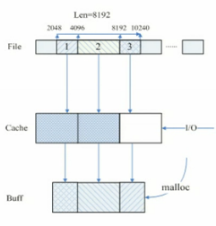
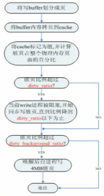

## 从fread和mmap 谈读文件的性能  
                                                         
### 作者                                        
digoal                                        
                                        
### 日期                                         
2015-08-16                                   
                                          
### 标签                                        
PostgreSQL , fread , mmap    
                                                    
----                                                    
                                                     
## 背景                                         
## 原文  
1\. https://www.byvoid.com/blog/fast-readfile/  
  
2\. http://blog.csdn.net/jwh_bupt/article/details/7793549  
  
3\. http://blog.csdn.net/jwh_bupt/article/details/8373063  
  
## 原文1  
        在进行大规模数据处理时，读文件很有可能成为速度瓶颈。不管你的CPU有4个核还是8个核，主频有2G还是3G，硬盘IO速度总是有个上限的。在本人最近的一次经历中，对一个11G的文本进行数据处理，一共耗时34.8秒，其中竟然有30.2秒用在访问IO上，占了所有时间的87%左右。  
  
	虽然说硬盘IO是有上限的，那么C++为我们提供的各函数，是否都能让我们达到这个上限呢？为了求得真相，我对这个11G的文本用fread函数读取，在linux下用iostat检查硬盘的访问速度，发现读的速度大约在380M/s。然后用dd指令测了一下读文本的访问速度，发现速度可以达到460M/s。可见单线程fread访问并没有达到硬盘的读取上限。第一次考虑会不会是fread访问硬盘的时候有一些固定开销，用多线程可以达到流水访问IO的效果提高读文本的效率，结果发现多线程也只有380M/s的读取速率。  
          
	为什么fread的效率达不到最大呢？查阅一些资料才知，用fread/fwrite方式访问硬盘，用户须向内核指定要读多少，内核再把得到的内容从内核缓冲池拷向用户空间；写也须要有一个大致如此的过程。这样在访问IO的时候就多经历了这么一个内核的buffer，造成速度的限制。一个解决的办法是mmap。mmap就是通过把文件的某一块内容直接映射到用户空间上，用户可以直接向内核缓冲池读写这一块内容，这样一来就少了内核与用户空间的来回拷贝所以通常更快。  
  
  
   
        mmap的使用方法如下：  
  
```  
[cpp] view plaincopyprint?  
char *data = NULL;    
int fd=open(“file.txt”,O_RDONLY);     
long size = lseek(fd, 0, SEEK_END);    
data = (char *) mmap( NULL,  size ,PROT_READ, MAP_PRIVATE, fd, 0 );     
```  
  
        这时file.txt文件中的数据就可以从data指针指向的首地址开始访问了。  
  
	为了从数据说明这个问题，我引用一位网友的结论，希望对大家有所启发。  
  
```  
方法/平台/时间(秒)	Linux gcc	Windows mingw	Windows VC2008  
  
scanf		2.010	3.704	3.425  
cin		6.380	64.003	19.208  
cin取消同步	2.050	6.004	19.616  
fread		0.290	0.241	0.304  
read		0.290	0.398	不支持  
mmap		0.250	不支持	不支持  
Pascal read	2.160	4.668  
```  
  
  
## 原文2  
  
Linux的IO从广义上来说包括很多类，从狭义上来说只是讲磁盘的IO。在本文中我也就只是主要介绍磁盘的IO。在这里我对Linux的磁盘IO的常用系统调用进行深入一些的分析，希望在大家在磁盘IO产生瓶颈的时候，能够帮助做优化，同时我也是对之前的一篇博文作总结。  
  
一、读磁盘：  
  
```  
ssize_t read(int fd,void * buf ,size_t count);  
```  
  
        读磁盘时，最常用的系统调用就是read（或者fread）。大家都很熟悉它了，首先fopen打开一个文件，同时malloc一段内存，最后调用read函数将fp指向的文件读到这段内存当中。执行完毕后，文件读写位置会随读取到的字节移动。  
  
	虽然很简单，也最通用，但是read函数的执行过程有些同学可能不大了解。  
  
这个过程可以总结为下面这个图：  
  
  
   
  
	图中从上到下的三个位置依次表示：  
  
1\. 文件在磁盘中的存储地址；  
  
2\. 内核维护的文件的cache（也叫做page cache，4k为一页，每一页是一个基本的cache单位）；  
  
3\. 用户态的buffer（read函数中分配的那段内存）。  
  
	 发起一次读请求后，内核会先看一下，要读的文件是否已经缓存在内核的页面里面了。如果是，则直接从内核的buffer中复制到用户态的buffer里面。如果不是，内核会发起一次对文件的IO，读到内核的cache中，然后才会拷贝到buffer中。  
           
	 这个行为有三个特点：  
  
1\. read的行为是一种阻塞的系统调用（堵在这，直到拿到数据为止）；  
  
2\. 以内核为缓冲，从内核到用户内存进行了一次内存拷贝（而内存拷贝是很占用CPU的）  
  
3\. 没有显示地通知使用者从文件的哪个位置开始去读。使用者需要利用文件指针，通过lseek之类的系统调用来指定位置。  
           
	 这三个特点其实都是有很多缺点的（相信在我的描述下大家也体会到了）。对于第二个特点，可以采用direct IO消除这个内核buffer的过程（方法是fopen的时候在标志位上加一个o_direct标志），不过带来的问题则是无法利用cache，这显然不是一种很好的解决办法。所以在很多场景下，直接用read不是很高效的。接下来，我就要依次为大家介绍几种更高效的系统调用。  
  
  
```  
ssize_t pread(intfd, void *buf, size_tcount, off_toffset);  
```  
  
        pread与read在功能上完全一样，只是多一个参数：要读的文件的起始地址。在多线程的情况下，多个线程要同时读同一个文件的不同地址时，要对文件指针加锁，影响了性能，而用pread后就不需要加锁了，使程序更加高效。解决了第三个问题。  
  
```  
ssize_t readahead(int fd, off64_t offset, size_t count);  
```  
  
       readahead是一种非阻塞的系统调用，它只要求内核把这段数据预读到内核的buffer中，并不等待它执行完就返回了。执行readahead后再执行read的话，由于之前已经并行地让内核读取了数据了，这时更多地是直接从内核的buffer中直接copy到用户的buffer里，效率就有所提升了。这样就解决了read的第一个问题。我们可以看下面这个例子：  
1\.  
  
```  
while(time < Ncnts)    
{    
   read（fd[i], buf[i], lens）;    
   process(buf[i]);   //相对较长的处理过程    
}    
```  
  
2\.   
  
```  
while(time < Ncnts)    
{    
   readahead（fd[i], buf[i], lens）;    
}    
    
while(time < Ncnts)    
{    
   read（fd[i], buf[i], lens）;    
   process(buf[i]);   //相对较长的处理过程    
}  
```  
  
  
	修改后加了readahead之后，readahead很快地发送了读取消息后就返回了，而process的过程中，readahead使内核并行地读取磁盘，下一次process的时候数据已经读取到内核中了，减少了等待read的过程。  
  
```  
void *mmap(void *addr, size_t length, int prot, int flags, int fd, off_t offset);  
```  
  
	刚才提到的两个函数中，从内核的buffer到用户的buffer这个拷贝过程依然没有处理。刚才说了，这个内存拷贝的过程是很占cpu的。为了解决这个问题，一种方法就是使用mmap（在之前的这篇博文里我已经介绍了如何去使用）、它直接把内核态的地址map到用户态上，用户态通过这个指针可以直接访问（相当于从磁盘跳过cache直接到用户态）。  
          
	但是mmap同时存在着两个重要的问题：  
  
1\. cache命中率不如read；  
  
2\. 在线程模型下互斥十分严重  
          
	对于第一个问题的解释，和内核的实现机制比较相关。在实际命中cache的时候，调用mmap是没有进行从用户态到内核态的切换的，这样采用LRU更新策略的内核页面没法让这个被访问的页面的热度加1，也就是尽管可能这个页面通过mmap访问了许多次，但是都没有被内核记录下来，就好像一次也没有访问到一样，这样LRU很容易地就把它更新掉了。而read一定陷入到内核态了。为了解决这个问题，可以用一个readahead发起这次内核态的切换（同时提前发起IO）。  
  
	对于第二个问题产生的原因，则是在不命中内核cache的情况下内核从disk读数据是要加一把mm级别的锁（内核帮你加的）。加着这个级别的锁进行IO操作，肯定不是很高效的。readahead可以一定程度解决这个问题，但是更好的办法是利用一种和readahead一样但是是阻塞型的系统调用（具体我不知道Linux是否提供了这样一种函数）。阻塞的方式让内核预读磁盘，这样能够保证mmap的时候要读的数据肯定在内核中，尽可能地避免了这把锁。  
  
二、写磁盘  
  
        对比read的系统调用，write更多是一种非阻塞的调用方式。即一般是write到内存中就可以返回了。具体的过程如下所示：  
  
  
   
  
	其中有两个过程会触发写磁盘：  
  
1）dirty ration（默认40%）超过阈值：此时write会被阻塞，开始同步写脏页，直到比例降下去以后才继续write。  
  
2）dirty background ration（默认10%）超过阈值：此时write不被阻塞，会被返回，不过返回之前会唤醒后台进程pdflush刷脏页。它的行为是有脏页就开始刷（不一定是正在write的脏页）。对于低于10%什么时候刷脏页呢？内核的后台有一个线程pdflush，它会周期性地刷脏页。这个周期在内核中默认是5秒钟（即每5秒钟唤醒一次）。它会扫描所有的脏页，然后找到最老的脏页变脏的时间超过dirty_expire_centisecs（默认为30秒），达到这个时间的就刷下去（这个过程与刚才的那个后台进程是有些不一样的）。  
  
	写磁盘遇到的问题一般是，在内核写磁盘的过程中，如果这个比例不合适，可能会突然地写磁盘占用的IO过大，这样导致读磁盘的性能下降。  
  
## 参考  
1\. https://www.byvoid.com/blog/fast-readfile/  
  
2\. http://blog.csdn.net/jwh_bupt/article/details/7793549  
  
3\. http://blog.csdn.net/jwh_bupt/article/details/8373063  
  
<a rel="nofollow" href="http://info.flagcounter.com/h9V1"  ></a>  
  
  
  
  
  
  
## [digoal's 大量PostgreSQL文章入口](https://github.com/digoal/blog/blob/master/README.md "22709685feb7cab07d30f30387f0a9ae")
  
