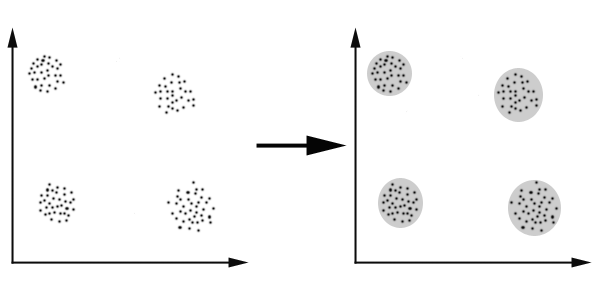
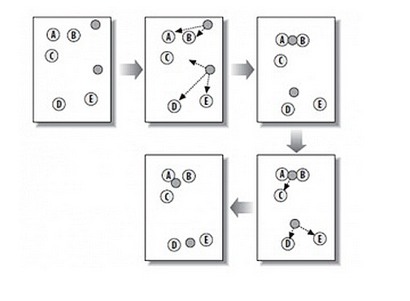
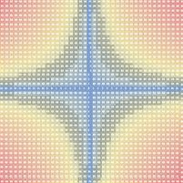
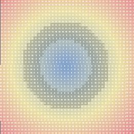
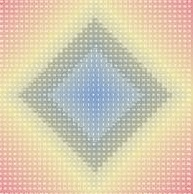

## K-Means 数据聚集算法  
                 
### 作者                  
digoal                 
                   
### 日期                   
2015-08-17               
                            
### 标签            
PostgreSQL , kmean , 聚类       
            
----            
             
## 背景          
K-Means是什么？引用一篇网友的文章：  
  
http://coolshell.cn/articles/7779.html  
  
## 引用  
最近在学习一些数据挖掘的算法，看到了这个算法，也许这个算法对你来说很简单，但对我来说，我是一个初学者，我在网上翻看了很多资料，发现中文社区没有把这个问题讲得很全面很清楚的文章，所以，把我的学习笔记记录下来，分享给大家。  
  
在数据挖掘中， k-Means 算法是一种 [cluster analysis](http://en.wikipedia.org/wiki/Cluster_analysis) 的算法，其主要是来计算数据聚集的算法，主要通过不断地取离种子点最近均值的算法。  
  
## 问题  
K-Means算法主要解决的问题如下图所示。我们可以看到，在图的左边有一些点，我们用肉眼可以看出来有四个点群，但是我们怎么通过计算机程序找出这几个点群来呢？于是就出现了我们的K-Means算法（[Wikipedia链接](http://en.wikipedia.org/wiki/K-means_clustering)）  
  
  
  
## 算法概要  
这个算法其实很简单，如下图所示：  
  
  
  
从上图中，我们可以看到，A, B, C, D, E 是五个在图中点。而灰色的点是我们的种子点，也就是我们用来找点群的点。有两个种子点，所以K=2。  
  
然后，K-Means的算法如下：  
  
1、随机在图中取K（这里K=2）个种子点。  
  
2、然后对图中的所有点求到这K个种子点的距离，假如点Pi离种子点Si最近，那么Pi属于Si点群。（上图中，我们可以看到A,B属于上面的种子点，C,D,E属于下面中部的种子点）  
  
3、接下来，我们要移动种子点到属于他的“点群”的中心。（见图上的第三步）  
  
4、然后重复第2）和第3）步，直到，种子点没有移动（我们可以看到图中的第四步上面的种子点聚合了A,B,C，下面的种子点聚合了D，E）。  
  
这个算法很简单，但是有些细节我要提一下，求距离的公式我不说了，大家有初中毕业水平的人都应该知道怎么算的。我重点想说一下“求点群中心的算法”  
  
## 求点群中心的算法  
  
一般来说，求点群中心点的算法你可以很简的使用各个点的X/Y坐标的平均值。不过，我这里想告诉大家另三个求中心点的的公式：  
  
1）Minkowski Distance 公式 —— λ 可以随意取值，可以是负数，也可以是正数，或是无穷大。  
  
  
  
2）Euclidean Distance 公式 —— 也就是第一个公式 λ=2 的情况  
  
  
  
3）CityBlock Distance 公式 —— 也就是第一个公式 λ=1 的情况  
  
  
  
这三个公式的求中心点有一些不一样的地方，我们看下图（对于第一个 λ 在 0-1之间）。  
  
（1）Minkowski Distance      
  
  
  
（2）Euclidean Distance      
  
  
  
（3） CityBlock Distance  
  
  
  
上面这几个图的大意是他们是怎么个逼近中心的，第一个图以星形的方式，第二个图以同心圆的方式，第三个图以菱形的方式。  
  
## K-Means的演示  
  
如果你以“[K Means Demo](https://www.google.com/search?hl=zh-CN&q=K+Means+Demo)”为关键字到Google里查你可以查到很多演示。这里推荐一个演示  
  
http://home.dei.polimi.it/matteucc/Clustering/tutorial_html/AppletKM.html  
  
操作是，鼠标左键是初始化点，右键初始化“种子点”，然后勾选“Show History”可以看到一步一步的迭代。  
  
注：这个演示的链接也有一个不错的 [K Means Tutorial](http://home.dei.polimi.it/matteucc/Clustering/tutorial_html/index.html) 。  
  
## K-Means ++ 算法  
K-Means主要有两个最重大的缺陷 —— 都和初始值有关：  
  
* K 是事先给定的，这个 K 值的选定是非常难以估计的。很多时候，事先并不知道给定的数据集应该分成多少个类别才最合适。（ [ISODATA 算法](http://en.wikipedia.org/wiki/Multispectral_pattern_recognition)通过类的自动合并和分裂，得到较为合理的类型数目 K）  
  
* K-Means算法需要用初始随机种子点来搞，这个随机种子点太重要，不同的随机种子点会有得到完全不同的结果。（[K-Means++算法](http://en.wikipedia.org/wiki/K-means%2B%2B)可以用来解决这个问题，其可以有效地选择初始点）  
  
我在这里重点说一下 K-Means++算法步骤：  
  
1、先从我们的数据库随机挑个随机点当“种子点”。  
  
2、对于每个点，我们都计算其和最近的一个“种子点”的距离D(x)并保存在一个数组里，然后把这些距离加起来得到Sum(D(x))。  
  
3、然后，再取一个随机值，用权重的方式来取计算下一个“种子点”。这个算法的实现是，先取一个能落在Sum(D(x))中的随机值Random，然后用Random -= D(x)，直到其<=0，此时的点就是下一个“种子点”。  
  
4、重复第（2）和第（3）步直到所有的K个种子点都被选出来。  
  
5、进行K-Means算法。  
  
相关的代码你可以在这里找到“[implement the K-means++ algorithm](http://rosettacode.org/wiki/K-means%2B%2B_clustering)”(墙) 另，[Apache 的通用数据学库也实现了这一算法](http://commons.apache.org/math/api-2.1/index.html?org/apache/commons/math/stat/clustering/KMeansPlusPlusClusterer.html)  
  
## K-Means 算法应用  
  
看到这里，你会说，K-Means算法看来很简单，而且好像就是在玩坐标点，没什么真实用处。而且，这个算法缺陷很多，还不如人工呢。是的，前面的例子只是玩二维坐标点，的确没什么意思。但是你想一下下面的几个问题：  
  
* 1）如果不是二维的，是多维的，如5维的，那么，就只能用计算机来计算了。  
  
* 2）二维坐标点的X, Y 坐标，其实是一种向量，是一种数学抽象。现实世界中很多属性是可以抽象成向量的，比如，我们的年龄，我们的喜好，我们的商品，等等，能抽象成向量的目的就是可以让计算机知道某两个属性间的距离。如：我们认为，18岁的人离24岁的人的距离要比离12岁的距离要近，鞋子这个商品离衣服这个商品的距离要比电脑要近，等等。  
  
**只要能把现实世界的物体的属性抽象成向量，就可以用K-Means算法来归类了。**  
  
在 [《k均值聚类(K-means)》](http://www.cnblogs.com/leoo2sk/archive/2010/09/20/k-means.html) 这篇文章中举了一个很不错的应用例子，作者用亚洲15支足球队的2005年到1010年的战绩做了一个向量表，然后用K-Means把球队归类，得出了下面的结果，呵呵。  
  
* 亚洲一流：日本，韩国，伊朗，沙特  
  
* 亚洲二流：乌兹别克斯坦，巴林，朝鲜  
  
* 亚洲三流：中国，伊拉克，卡塔尔，阿联酋，泰国，越南，阿曼，印尼  
  
其实，这样的业务例子还有很多，比如，分析一个公司的客户分类，这样可以对不同的客户使用不同的商业策略，或是电子商务中分析商品相似度，归类商品，从而可以使用一些不同的销售策略，等等。  
  
最后给一个挺好的算法的幻灯片：  
  
[clusting](20150817_01_pdf_001.pdf)  
  
## PostgreSQL kmean插件  
PostgreSQL有一个k-means插件，可以用来实现kmean数据聚集统计，用在窗口函数中。   
  
用法举例：  
  
```  
    SELECT kmeans(ARRAY[x, y, z], 10) OVER (), * FROM samples;  
    SELECT kmeans(ARRAY[x, y], 2, ARRAY[0.5, 0.5, 1.0, 1.0]) OVER (), * FROM samples;  
    SELECT kmeans(ARRAY[x, y, z], 2, ARRAY[ARRAY[0.5, 0.5], ARRAY[1.0, 1.0]]) OVER (PARTITION BY group_key), * FROM samples;  
```  
  
第一个参数是需要参与聚类分析的数组，第二个参数是最终分成几类（输出结果时类是从0开始的，如分2类的话，输出是0和1）。  
  
第三个参数是种子参数，可以是1维或2维数组，如果是1维数组，必须是第一个参数的元素个数乘以第二个元素的值。(可以认为是给每一个类分配一个种子)。  
  
```  
The `kmeans` function calculates and returns class number which starts from  
0, by using input vectors. The first argument is the vector, represented  
by array of float8. You must give the same-length 1-dimension array across  
all the input rows. The second argument is an integer K in "K-means", the  
number of class you want to partition. The third argument is optional,  
an array of vector which represents initial mean vectors. Since the  
algorithm is sensitive with initial mean vectors, and although the function  
calculates them by input vectors in the first form, you may sometimes want  
to give fixed mean vectors. The vectors can be passed as 1-d array or 2-d  
array of float8. In case of 1-d, the length of it must match k * lengthof(vector).  
  
If the third argument, initial centroids, is not given, it scans  
all the input vectors and stores min/max for each element of vector.  
Then decide initial hypothetical vector elements by the next formula:  
  
    init = (max - min) * (i + 1) / (k + 1) + min  
  
where `i` varies from 0 to k-1. This means that the vector elements  
are decided as the liner interpolation from min to max divided by k.  
Then one of the input vectors nearest to this hypothetical vector  
is picked up as the centroid. Note that input vector is not picked  
more than twice as far as possible, to gain good result.  
```  
  
例子  
  
```  
postgres=# create extension kmeans;  
CREATE EXTENSION  
postgres=# create table t1(c1 int,c2 int,c3 int,c4 int);  
CREATE TABLE  
postgres=# insert into t1 select 100*random(),1000*random(),100*random(),10000*random() from generate_series(1,100000);  
INSERT 0 100000  
postgres=# select kmeans(array[c1,c2,c3],2,array[1,2,3,4,5,6]) over() , * from t1;  
 kmeans | c1  |  c2  | c3  |  c4     
--------+-----+------+-----+-------  
      1 |  67 |  976 |  39 |  9036  
      0 |  71 |  493 |  19 |  9169  
      1 |  59 |  913 |  59 |  8343  
      0 |  54 |   99 |  26 |  6788  
      1 |   5 |  959 |  36 |  7663  
......  
```  
  
如果是一维数组，必须是第一个参数数组的长度乘以类别个数2。  
  
```  
postgres=# select kmeans(array[c1,c2,c3],2,array[1,2,3,4]) over() ,* from t1;  
ERROR:  initial mean vector must be 2d without NULL element  
  
postgres=# select kmeans(array[c1,c2,c3],2) over() ,* from t1;  
 kmeans | c1  |  c2  | c3  |  c4     
--------+-----+------+-----+-------  
      1 |  67 |  976 |  39 |  9036  
      0 |  71 |  493 |  19 |  9169  
      1 |  59 |  913 |  59 |  8343  
      0 |  54 |   99 |  26 |  6788  
      1 |   5 |  959 |  36 |  7663  
      1 |  26 |  873 |  87 |  9793  
```  
  
或者这种写法，也可以。  
  
```  
postgres=# select kmeans(array[c1,c2,c3],3,array[[1,1,1],[2,2,2],[3,3,3]]) over() ,* from t1;  
 kmeans | c1  |  c2  | c3  |  c4     
--------+-----+------+-----+-------  
      2 |  67 |  976 |  39 |  9036  
      1 |  71 |  493 |  19 |  9169  
      2 |  59 |  913 |  59 |  8343  
      0 |  54 |   99 |  26 |  6788  
      2 |   5 |  959 |  36 |  7663  
```  
  
## 参考  
1\. http://api.pgxn.org/src/kmeans/kmeans-1.1.0/doc/kmeans.md  
  
2\. https://en.wikipedia.org/wiki/K-means_clustering  
  
3\. http://coolshell.cn/articles/7779.html  
  
<a rel="nofollow" href="http://info.flagcounter.com/h9V1"  ></a>  
  
  
  
  
  
  
## [digoal's 大量PostgreSQL文章入口](https://github.com/digoal/blog/blob/master/README.md "22709685feb7cab07d30f30387f0a9ae")
  
