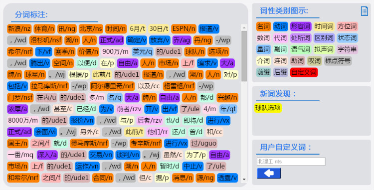

## NLPIR 分词准确率接近98.23%  
                                                                   
### 作者                                                  
digoal                                                  
                                                  
### 日期                                                   
2015-08-21                                           
                                                    
### 标签                                                  
PostgreSQL , 中文分词    
                                                              
----                                                              
                                                               
## 背景                                                   
http://www.nlpir.org/  
  
几个例子：  
  
```  
为人民办公益  
为/p人民/n办/v公益/n  
  
  
独立自主和平等互利的原则  
独立自主/vl和/cc平等互利/vl的/ude1原则/n  
  
  
结婚的和尚未结婚的  
结婚/vi的/ude1和/cc尚未/d结婚/vi的/ude1  
  
  
北京大学生前来应聘  
北京/ns大学生/n前来/vi应聘/vi  
  
  
然并卵  
然/rz并/cc卵/n  
  
  
他说的确实在理  
他/rr说/v的/ude1确实/ad在理/a  
```  
  
  
scws的测试结果：  
  
```  
postgres=#  SELECT to_tsvector('testzhcfg','独立自主和平等互利的原则');  
                   to_tsvector                      
--------------------------------------------------  
 '原则':5 '和':2 '平等互利':3 '独立自主':1 '的':4  
(1 row)  
postgres=#  SELECT to_tsvector('testzhcfg','结婚的和尚未结婚的');  
             to_tsvector               
-------------------------------------  
 '和':3 '尚未':4 '的':2,6 '结婚':1,5  
(1 row)  
postgres=#  SELECT to_tsvector('testzhcfg','北京大学生前来应聘');  
              to_tsvector                
---------------------------------------  
 '前来':3 '北京':1 '大学生':2 '应聘':4  
(1 row)  
postgres=#  SELECT to_tsvector('testzhcfg','为人民办公益');  
           to_tsvector             
---------------------------------  
 '为人':1 '办公':3 '民':2 '益':4  
(1 row)  
postgres=#  SELECT to_tsvector('testzhcfg','然并卵');  
     to_tsvector        
----------------------  
 '卵':3 '并':2 '然':1  
(1 row)  
postgres=#  SELECT to_tsvector('testzhcfg','他说的确实在理');  
              to_tsvector                 
----------------------------------------  
 '他':1 '在理':5 '的':3 '确实':4 '说':2  
(1 row)  
```  
  
NLPIR/ICTCLAS中英文一体化分词可视化效果图  
  
  
  
  NLPIR/ICTCLAS分词系统可以支持中英文分词与词性标注，可视化系统可根据词性对不同的分词结果进行区分显示，一般虚词都是浅色，而名词、动词、形容词等实词为显著的颜色。在分词的同时，还会发现新词。本系统还支持在线用户词典的输入，用户可以在右下方添加用户词及词性，如“中东呼吸综合征 bing”。NLPIR/ICTCLAS分词系统，采用层叠隐马模型  
  
（算法细节请参照：张华平,高凯，黄河燕，赵燕平，《大数据搜索与挖掘》科学出版社。2014.5 ISBN:978-7-03-040318-6），分词准确率接近98.23%，具备准确率高、速度快、可适应性强等优势。它能够真正理解中文，利用机器学习的方式解决歧义切分与词性标注歧义问题。  
  
相关产品  
  
http://bosonnlp.com/  
  
## 参考  
1\. http://www.nlpir.org/  
  
2\. http://baike.baidu.com/view/19109.htm  
  
3\. https://github.com/NLPIR-team/NLPIR  
  
  
  
  
  
  
  
  
  
  
  
  
  
  
  
  
  
  
  
  
  
  
  
  
  
  
  
  
  
  
  
  
  
  
  
  
  
  
  
  
  
  
  
  
  
  
#### [9.9元购买3个月阿里云RDS PostgreSQL实例](https://www.aliyun.com/database/postgresqlactivity "57258f76c37864c6e6d23383d05714ea")
  
  
#### [PostgreSQL 解决方案集合](https://yq.aliyun.com/topic/118 "40cff096e9ed7122c512b35d8561d9c8")
- [1 任意维度实时圈人](https://yq.aliyun.com/topic/118 "40cff096e9ed7122c512b35d8561d9c8")
- [2 时序数据实时处理](https://yq.aliyun.com/topic/118 "40cff096e9ed7122c512b35d8561d9c8")
- [3 时间、空间、业务 多维数据实时透视](https://yq.aliyun.com/topic/118 "40cff096e9ed7122c512b35d8561d9c8")
- [4 独立事件相关性分析](https://yq.aliyun.com/topic/118 "40cff096e9ed7122c512b35d8561d9c8")
- [5 海量关系实时图式搜索](https://yq.aliyun.com/topic/118 "40cff096e9ed7122c512b35d8561d9c8")
- [6 社交业务案例](https://yq.aliyun.com/topic/118 "40cff096e9ed7122c512b35d8561d9c8")
- [7 流式数据实时处理案例](https://yq.aliyun.com/topic/118 "40cff096e9ed7122c512b35d8561d9c8")
- [8 IoT 物联网, 时序](https://yq.aliyun.com/topic/118 "40cff096e9ed7122c512b35d8561d9c8")
- [9 全文检索](https://yq.aliyun.com/topic/118 "40cff096e9ed7122c512b35d8561d9c8")
- [10 模糊、正则 查询案例](https://yq.aliyun.com/topic/118 "40cff096e9ed7122c512b35d8561d9c8")
- [11 图像识别](https://yq.aliyun.com/topic/118 "40cff096e9ed7122c512b35d8561d9c8")
- [12 向量相似检索](https://yq.aliyun.com/topic/118 "40cff096e9ed7122c512b35d8561d9c8")
- [13 数据清洗、采样、脱敏、批处理、合并](https://yq.aliyun.com/topic/118 "40cff096e9ed7122c512b35d8561d9c8")
- [14 GIS 地理信息空间数据应用](https://yq.aliyun.com/topic/118 "40cff096e9ed7122c512b35d8561d9c8")
- [15 金融业务](https://yq.aliyun.com/topic/118 "40cff096e9ed7122c512b35d8561d9c8")
- [16 异步消息应用案例](https://yq.aliyun.com/topic/118 "40cff096e9ed7122c512b35d8561d9c8")
- [17 海量数据 冷热分离](https://yq.aliyun.com/topic/118 "40cff096e9ed7122c512b35d8561d9c8")
- [18 倒排索引案例](https://yq.aliyun.com/topic/118 "40cff096e9ed7122c512b35d8561d9c8")
- [19 海量数据OLAP处理应用](https://yq.aliyun.com/topic/118 "40cff096e9ed7122c512b35d8561d9c8")
  
  
#### [德哥 / digoal's 趣味入口 - 努力成为灯塔, 公益是一辈子的事.](https://github.com/digoal/blog/blob/master/README.md "22709685feb7cab07d30f30387f0a9ae")
  
  

  
  
#### [PostgreSQL 解决方案集合](https://yq.aliyun.com/topic/118 "40cff096e9ed7122c512b35d8561d9c8")
- [1 任意维度实时圈人](https://yq.aliyun.com/topic/118 "40cff096e9ed7122c512b35d8561d9c8")
- [2 时序数据实时处理](https://yq.aliyun.com/topic/118 "40cff096e9ed7122c512b35d8561d9c8")
- [3 时间、空间、业务 多维数据实时透视](https://yq.aliyun.com/topic/118 "40cff096e9ed7122c512b35d8561d9c8")
- [4 独立事件相关性分析](https://yq.aliyun.com/topic/118 "40cff096e9ed7122c512b35d8561d9c8")
- [5 海量关系实时图式搜索](https://yq.aliyun.com/topic/118 "40cff096e9ed7122c512b35d8561d9c8")
- [6 社交业务案例](https://yq.aliyun.com/topic/118 "40cff096e9ed7122c512b35d8561d9c8")
- [7 流式数据实时处理案例](https://yq.aliyun.com/topic/118 "40cff096e9ed7122c512b35d8561d9c8")
- [8 IoT 物联网, 时序](https://yq.aliyun.com/topic/118 "40cff096e9ed7122c512b35d8561d9c8")
- [9 全文检索](https://yq.aliyun.com/topic/118 "40cff096e9ed7122c512b35d8561d9c8")
- [10 模糊、正则 查询案例](https://yq.aliyun.com/topic/118 "40cff096e9ed7122c512b35d8561d9c8")
- [11 图像识别](https://yq.aliyun.com/topic/118 "40cff096e9ed7122c512b35d8561d9c8")
- [12 向量相似检索](https://yq.aliyun.com/topic/118 "40cff096e9ed7122c512b35d8561d9c8")
- [13 数据清洗、采样、脱敏、批处理、合并](https://yq.aliyun.com/topic/118 "40cff096e9ed7122c512b35d8561d9c8")
- [14 GIS 地理信息空间数据应用](https://yq.aliyun.com/topic/118 "40cff096e9ed7122c512b35d8561d9c8")
- [15 金融业务](https://yq.aliyun.com/topic/118 "40cff096e9ed7122c512b35d8561d9c8")
- [16 异步消息应用案例](https://yq.aliyun.com/topic/118 "40cff096e9ed7122c512b35d8561d9c8")
- [17 海量数据 冷热分离](https://yq.aliyun.com/topic/118 "40cff096e9ed7122c512b35d8561d9c8")
- [18 倒排索引案例](https://yq.aliyun.com/topic/118 "40cff096e9ed7122c512b35d8561d9c8")
- [19 海量数据OLAP处理应用](https://yq.aliyun.com/topic/118 "40cff096e9ed7122c512b35d8561d9c8")
  
