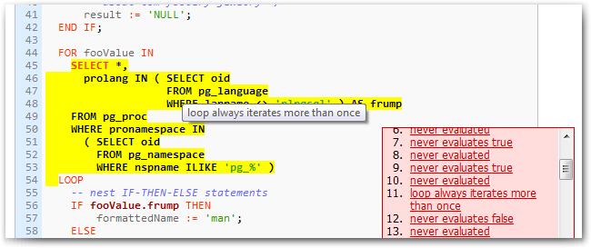

## piggly, 一个plpgsql 代码覆盖测试工具  
                                                                                             
### 作者                                                                            
digoal                                                                            
                                                                            
### 日期                                                                             
2015-09-07                                                                  
                                                                              
### 标签                                                                            
PostgreSQL , plpgsql , 代码覆盖率测试         
                                                                                        
----                                                                                        
                                                                                         
## 背景                 
https://github.com/kputnam/piggly  
  
RUBY写的一个postgresql plpgsql函数代码覆盖测试框架，测试脚本不限语言，你可以用perl,python。。。来写测试脚本。  
  
这个测试框架虽然是几年前写的，但值得学习。  
  
  
