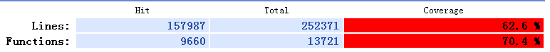
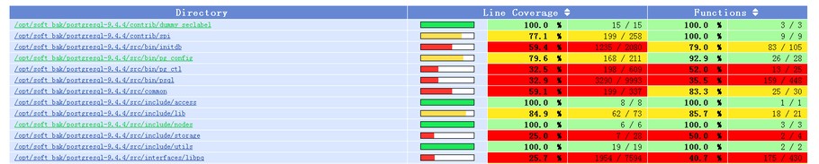
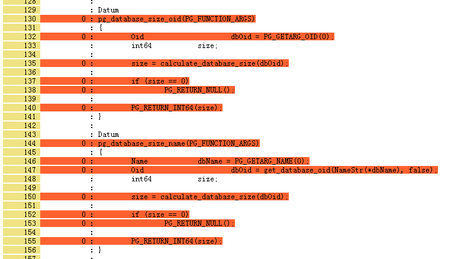
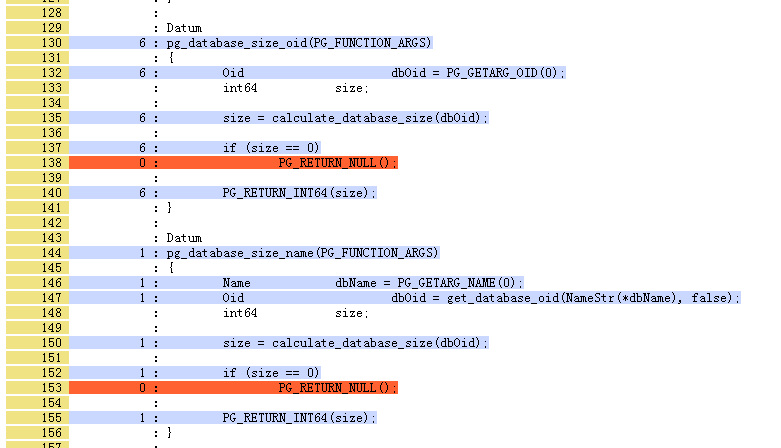

## PostgreSQL C代码覆盖率测试(gcov, lcov)  
                                                                                               
### 作者                                                                              
digoal                                                                              
                                                                              
### 日期                                                                               
2015-09-07                                                                    
                                                                                
### 标签                                                                              
PostgreSQL , C , 代码覆盖率测试            
                                                                                          
----                                                                                          
                                                                                           
## 背景                   
通常我们评判一个test case好坏的标准之一是代码的覆盖率，一个好的test case应该覆盖到所有的代码。  
  
那么问题来了，我们怎么知道这个test case有没有覆盖到所有的代码呢？  
  
以C代码为例，我们看看如何检测代码覆盖率。其他语言自然有其他语言的代码覆盖测试工具，例如plpgsql：  
  
http://blog.163.com/digoal@126/blog/static/16387704020158792814297/  
  
C代码覆盖率测试，需要用到gcc的配套工具gcov ， 还有一个可视化公建lcov。  
  
接下来以PostgreSQL为例，看看如何查看代码覆盖率。  
  
首先需要打开PostgreSQL的一个编译选项。  
  
```  
  --enable-coverage       build with coverage testing instrumentation  
```  
  
这个编译项对应gcc的两个参数 -fprofile-arcs -ftest-coverage  
  
```  
# enable code coverage if --enable-coverage  
if test "$enable_coverage" = yes; then  
  if test "$GCC" = yes; then  
    CFLAGS="$CFLAGS -fprofile-arcs -ftest-coverage"  
  else  
    as_fn_error $? "--enable-coverage is supported only when using GCC" "$LINENO" 5  
  fi  
fi  
```  
  
这两个参数的含义如下：  
  
```  
man gcc  
       -fprofile-arcs 用于产生.c文件对应的.gcda文件，.gcda文件可以被用于profile驱动的优化，或者结合gcov 来做代码覆盖分析。  
           编译时尽量不要使用-O优化，这样代码覆盖数据.gcda才能尽可能和代码接近。  
	   当代码被调用时，.gcda文件中对应的计数器会被修改，记录代码被调用的次数。  
  
           Add code so that program flow arcs are instrumented.  During execution the program records how many times each branch and call is executed and how many times it is taken or returns.  When the compiled  
           program exits it saves this data to a file called auxname.gcda for each source file.  The data may be used for profile-directed optimizations (-fbranch-probabilities), or for test coverage analysis  
           (-ftest-coverage).  Each object file’s auxname is generated from the name of the output file, if explicitly specified and it is not the final executable, otherwise it is the basename of the source file.  
           In both cases any suffix is removed (e.g. foo.gcda for input file dir/foo.c, or dir/foo.gcda for output file specified as -o dir/foo.o).  
  
       --coverage  
           This option is used to compile and link code instrumented for coverage analysis.  The option is a synonym for -fprofile-arcs -ftest-coverage (when compiling) and -lgcov (when linking).  See the  
           documentation for those options for more details.  
  
           ·   Compile the source files with -fprofile-arcs plus optimization and code generation options.  For test coverage analysis, use the additional -ftest-coverage option.  You do not need to profile every  
               source file in a program.  
  
           ·   Link your object files with -lgcov or -fprofile-arcs (the latter implies the former).  
  
           ·   Run the program on a representative workload to generate the arc profile information.  This may be repeated any number of times.  You can run concurrent instances of your program, and provided that  
               the file system supports locking, the data files will be correctly updated.  Also "fork" calls are detected and correctly handled (double counting will not happen).  
  
           ·   For profile-directed optimizations, compile the source files again with the same optimization and code generation options plus -fbranch-probabilities.  
  
           ·   For test coverage analysis, use gcov to produce human readable information from the .gcno and .gcda files.  Refer to the gcov documentation for further information.  
  
           With -fprofile-arcs, for each function of your program GCC creates a program flow graph, then finds a spanning tree for the graph.  Only arcs that are not on the spanning tree have to be instrumented:  
           the compiler adds code to count the number of times that these arcs are executed.  When an arc is the only exit or only entrance to a block, the instrumentation code can be added to the block;  
           otherwise, a new basic block must be created to hold the instrumentation code.  
  
  
       -ftest-coverage  这个选项用于产生.c文件的.gcno文件。这个文件生成后不会被修改。结合.gcda，可以分析测试代码覆盖率。  
           Produce a notes file that the gcov code-coverage utility can use to show program coverage.  Each source file’s note file is called auxname.gcno.  Refer to the -fprofile-arcs option above for a  
           description of auxname and instructions on how to generate test coverage data.  Coverage data will match the source files more closely, if you do not optimize.  
```  
  
首先需要安装依赖gcov和lcov  
  
gcov在gcc包中已经包含了，locv是ltp的一个gcov扩展插件，用来产生HTML报告.   
  
lcov用法参考：  
  
http://ltp.sourceforge.net/coverage/lcov.php  
  
http://ltp.sourceforge.net/coverage/lcov/readme.php  
  
```  
# yum install -y http://downloads.sourceforge.net/ltp/lcov-1.11-1.noarch.rpm  
```  
  
编译PostgreSQL  
  
```  
./configure --prefix=/opt/pgsql9.4.4 --with-pgport=1921 --with-perl --with-python --with-tcl --with-openssl --with-pam --with-ldap --with-libxml --with-libxslt --enable-thread-safety --enable-debug --enable-dtrace --enable-coverage  
gmake world && gmake install-world  
```  
  
安装好后，我们会发现在源码目录中多了一些.gcda和.gcno的文件，每个.c文件都会对应这两个文件。  
  
```  
postgres@digoal-> ll  
total 1.3M  
-rw-r--r-- 1 postgres postgres  22K Jun 10 03:29 gistbuildbuffers.c  
-rw------- 1 postgres postgres 1.6K Sep  7 14:42 gistbuildbuffers.gcda  
-rw-r--r-- 1 postgres postgres  15K Sep  7 14:38 gistbuildbuffers.gcno  
-rw-r--r-- 1 postgres postgres  70K Sep  7 14:38 gistbuildbuffers.o  
-rw-r--r-- 1 postgres postgres  37K Jun 10 03:29 gistbuild.c  
-rw------- 1 postgres postgres 2.2K Sep  7 14:42 gistbuild.gcda  
-rw-r--r-- 1 postgres postgres  20K Sep  7 14:38 gistbuild.gcno  
-rw-r--r-- 1 postgres postgres  92K Sep  7 14:38 gistbuild.o  
-rw-r--r-- 1 postgres postgres  43K Jun 10 03:29 gist.c  
-rw------- 1 postgres postgres 3.1K Sep  7 14:42 gist.gcda  
-rw-r--r-- 1 postgres postgres  29K Sep  7 14:38 gist.gcno  
-rw-r--r-- 1 postgres postgres  16K Jun 10 03:29 gistget.c  
-rw------- 1 postgres postgres 1.3K Sep  7 14:42 gistget.gcda  
-rw-r--r-- 1 postgres postgres  13K Sep  7 14:38 gistget.gcno  
-rw-r--r-- 1 postgres postgres  74K Sep  7 14:38 gistget.o  
-rw-r--r-- 1 postgres postgres 101K Sep  7 14:38 gist.o  
-rw-r--r-- 1 postgres postgres  39K Jun 10 03:29 gistproc.c  
-rw------- 1 postgres postgres 3.1K Sep  7 14:42 gistproc.gcda  
-rw-r--r-- 1 postgres postgres  31K Sep  7 14:38 gistproc.gcno  
-rw-r--r-- 1 postgres postgres  79K Sep  7 14:38 gistproc.o  
-rw-r--r-- 1 postgres postgres 9.1K Jun 10 03:29 gistscan.c  
-rw------- 1 postgres postgres  848 Sep  7 14:42 gistscan.gcda  
-rw-r--r-- 1 postgres postgres 6.7K Sep  7 14:38 gistscan.gcno  
-rw-r--r-- 1 postgres postgres  60K Sep  7 14:38 gistscan.o  
-rw-r--r-- 1 postgres postgres  24K Jun 10 03:29 gistsplit.c  
-rw------- 1 postgres postgres 1.5K Sep  7 14:42 gistsplit.gcda  
-rw-r--r-- 1 postgres postgres  15K Sep  7 14:38 gistsplit.gcno  
-rw-r--r-- 1 postgres postgres  68K Sep  7 14:38 gistsplit.o  
-rw-r--r-- 1 postgres postgres  21K Jun 10 03:29 gistutil.c  
-rw------- 1 postgres postgres 2.2K Sep  7 14:42 gistutil.gcda  
-rw-r--r-- 1 postgres postgres  20K Sep  7 14:38 gistutil.gcno  
-rw-r--r-- 1 postgres postgres  84K Sep  7 14:38 gistutil.o  
-rw-r--r-- 1 postgres postgres 7.1K Jun 10 03:29 gistvacuum.c  
-rw------- 1 postgres postgres  784 Sep  7 14:42 gistvacuum.gcda  
-rw-r--r-- 1 postgres postgres 7.3K Sep  7 14:38 gistvacuum.gcno  
-rw-r--r-- 1 postgres postgres  56K Sep  7 14:38 gistvacuum.o  
-rw-r--r-- 1 postgres postgres  14K Jun 10 03:29 gistxlog.c  
-rw------- 1 postgres postgres 1.2K Sep  7 14:42 gistxlog.gcda  
-rw-r--r-- 1 postgres postgres  12K Sep  7 14:38 gistxlog.gcno  
-rw-r--r-- 1 postgres postgres  50K Sep  7 14:38 gistxlog.o  
-rw-r--r-- 1 postgres postgres  538 Jun 10 03:29 Makefile  
-rw-r--r-- 1 postgres postgres  357 Sep  7 14:38 objfiles.txt  
-rw-r--r-- 1 postgres postgres  20K Jun 10 03:29 README  
postgres@digoal-> pwd  
/opt/soft_bak/postgresql-9.4.4/src/backend/access/gist  
```  
  
注意，源码文件目录的权限需要改为数据库启动用户的权限，否则无法修改.gcda的值，也就无法获取代码被调用的次数了。  
  
```  
root@digoal-> chown -R postgres:postgres /opt/soft_bak/postgresql-9.4.4  
```  
  
接下来我们看看文件的变化，以dbsize.c中的两个获取pg_database_size的C函数为例：  
  
```  
postgres@digoal-> ls -la|grep dbsize  
-rw-r--r--  1 postgres postgres  19342 Jun 10 03:29 dbsize.c  
-rw-------  1 postgres postgres   2664 Sep  7 15:01 dbsize.gcda  
-rw-r--r--  1 postgres postgres  23272 Sep  7 14:38 dbsize.gcno  
-rw-r--r--  1 postgres postgres  89624 Sep  7 14:38 dbsize.o  
```  
  
调用一次  
  
```  
postgres@digoal-> psql  
psql (9.4.4)  
Type "help" for help.  
postgres=# select pg_database_size(oid) from pg_database;  
 pg_database_size   
------------------  
          6898180  
          6889988  
         24742560  
          6898180  
          6898180  
          6898180  
(6 rows)  
postgres=# \q  
```  
  
再次查看  
  
```  
postgres@digoal-> ls -la|grep dbsize  
-rw-r--r--  1 postgres postgres  19342 Jun 10 03:29 dbsize.c  
-rw-------  1 postgres postgres   2664 Sep  7 15:12 dbsize.gcda  
-rw-r--r--  1 postgres postgres  23272 Sep  7 14:38 dbsize.gcno  
-rw-r--r--  1 postgres postgres  89624 Sep  7 14:38 dbsize.o  
```  
  
dbsize.gcda文件的修改时间发送了变化，说明刚才我们调用pg_database_size(oid)时，调用了dbsize.c中的代码。对应的行计数器会发生变化。  
  
接下来我们生成html  
  
```  
$ mkdir html  
$ cd html  
$ lcov --directory /opt/soft_bak/postgresql-9.4.4 --capture --output-file ./app.info  
```  
  
如果你不需要所有的代码，修改以上目录即可，譬如只看contrib下面的代码覆盖率。  
  
```  
$ genhtml ./app.info   
postgres@digoal-> ll  
total 3.7M  
drwxrwxr-x 12 postgres postgres 4.0K Sep  7 15:02 access  
-rw-rw-r--  1 postgres postgres  141 Sep  7 15:02 amber.png  
-rw-rw-r--  1 postgres postgres 3.4M Sep  7 15:02 app.info  
drwxrwxr-x  2 postgres postgres 4.0K Sep  7 15:02 bootstrap  
drwxrwxr-x  2 postgres postgres 4.0K Sep  7 15:02 catalog  
drwxrwxr-x  2 postgres postgres 4.0K Sep  7 15:02 commands  
-rw-rw-r--  1 postgres postgres  141 Sep  7 15:02 emerald.png  
drwxrwxr-x  2 postgres postgres  12K Sep  7 15:02 executor  
drwxrwxr-x  2 postgres postgres 4.0K Sep  7 15:02 foreign  
-rw-rw-r--  1 postgres postgres 9.7K Sep  7 15:02 gcov.css  
-rw-rw-r--  1 postgres postgres  167 Sep  7 15:02 glass.png  
-rw-rw-r--  1 postgres postgres  57K Sep  7 15:02 index.html  
-rw-rw-r--  1 postgres postgres  57K Sep  7 15:02 index-sort-f.html  
-rw-rw-r--  1 postgres postgres  57K Sep  7 15:02 index-sort-l.html  
drwxrwxr-x  2 postgres postgres 4.0K Sep  7 15:02 lib  
drwxrwxr-x  2 postgres postgres 4.0K Sep  7 15:02 libpq  
drwxrwxr-x  2 postgres postgres 4.0K Sep  7 15:02 main  
drwxrwxr-x  2 postgres postgres 4.0K Sep  7 15:02 nodes  
drwxrwxr-x  3 postgres postgres 4.0K Sep  7 15:02 opt  
drwxrwxr-x  7 postgres postgres 4.0K Sep  7 15:02 optimizer  
drwxrwxr-x  2 postgres postgres 4.0K Sep  7 15:02 parser  
drwxrwxr-x  2 postgres postgres 4.0K Sep  7 15:02 port  
drwxrwxr-x  2 postgres postgres 4.0K Sep  7 15:02 postmaster  
drwxrwxr-x  2 postgres postgres 4.0K Sep  7 15:02 regex  
drwxrwxr-x  3 postgres postgres 4.0K Sep  7 15:02 replication  
drwxrwxr-x  2 postgres postgres 4.0K Sep  7 15:02 rewrite  
-rw-rw-r--  1 postgres postgres  141 Sep  7 15:02 ruby.png  
drwxrwxr-x  3 postgres postgres 4.0K Sep  7 15:02 snowball  
-rw-rw-r--  1 postgres postgres  141 Sep  7 15:02 snow.png  
drwxrwxr-x 10 postgres postgres 4.0K Sep  7 15:02 storage  
drwxrwxr-x  2 postgres postgres 4.0K Sep  7 15:02 tcop  
drwxrwxr-x  2 postgres postgres 4.0K Sep  7 15:02 tsearch  
-rw-rw-r--  1 postgres postgres  117 Sep  7 15:02 updown.png  
drwxrwxr-x  3 postgres postgres 4.0K Sep  7 15:02 usr  
drwxrwxr-x 14 postgres postgres 4.0K Sep  7 15:02 utils  
```  
  
输出的HTML报告图例，  
  
行数的覆盖率，函数的覆盖率。  
  
  
   
每个目录下的覆盖率。  
  
  
  
调用pg_database_size前，你会发现这两个函数没有被覆盖到，说明PG自己的回归测试可能没有覆盖这两个函数，或者我们在安装PG时没有使用make check来进行回归测试。  
  
  
   
在我们调用pg_database_size(oid)和(name)后，重新生成app.info文件和html。  
  
这两个函数被调用到了。第二列是调用次数，说明pg_database_size_oid被调用了6次。pg_database_size_name被调用了一次，我们前面的测试省略了一些SQL没有列出。  
  
  
  
最后，PostgreSQL其实已经在Makefile提供了生成代码覆盖HTML的target。  
  
```  
[root@digoal postgresql-9.4.4]# make coverage-html  
```  
  
产生的html目录如下：  
  
```  
[root@digoal postgresql-9.4.4]# cd coverage  
[root@digoal coverage]# ll  
total 224  
-rw-r--r--  1 root root   141 Sep  7 19:17 amber.png  
-rw-r--r--  1 root root   141 Sep  7 19:17 emerald.png  
-rw-r--r--  1 root root  9893 Sep  7 19:17 gcov.css  
-rw-r--r--  1 root root   167 Sep  7 19:17 glass.png  
-rw-r--r--  1 root root 58737 Sep  7 19:18 index.html  
-rw-r--r--  1 root root 58730 Sep  7 19:18 index-sort-f.html  
-rw-r--r--  1 root root 58730 Sep  7 19:18 index-sort-l.html  
-rw-r--r--  1 root root   141 Sep  7 19:17 ruby.png  
-rw-r--r--  1 root root   141 Sep  7 19:17 snow.png  
drwxr-xr-x 11 root root  4096 Sep  7 19:18 src  
-rw-r--r--  1 root root   117 Sep  7 19:17 updown.png  
drwxr-xr-x  3 root root  4096 Sep  7 19:18 usr  
```  
  
target见makefile：  
  
src/Makefile.global  
  
```  
##########################################################################  
#  
# Coverage  
  
# Explanation of involved files:  
#   foo.c       source file  
#   foo.o       object file  
#   foo.gcno    gcov graph (a.k.a. "notes") file, created at compile time  
#               (by gcc -ftest-coverage)  
#   foo.gcda    gcov data file, created when the program is run (for  
#               programs compiled with gcc -fprofile-arcs)  
#   foo.c.gcov  gcov output file with coverage information, created by  
#               gcov from foo.gcda (by "make coverage")  
#   foo.c.gcov.out  stdout captured when foo.c.gcov is created, mildly  
#               interesting  
#   lcov.info   lcov tracefile, built from gcda files in one directory,  
#               later collected by "make coverage-html"  
  
ifeq ($(enable_coverage), yes)  
  
# There is a strange interaction between lcov and existing .gcov  
# output files.  Hence the rm command and the ordering dependency.  
  
gcda_files := $(wildcard *.gcda)  
  
lcov.info: $(gcda_files)  
        rm -f *.gcov  
        $(if $^,$(LCOV) -d . -c -o $@ $(LCOVFLAGS) --gcov-tool $(GCOV))  
  
%.c.gcov: %.gcda | lcov.info  
        $(GCOV) -b -f -p -o . $(GCOVFLAGS) $*.c >$*.c.gcov.out  
  
coverage: $(gcda_files:.gcda=.c.gcov) lcov.info  
  
.PHONY: coverage-html  
coverage-html: coverage  
        rm -rf coverage  
        mkdir coverage  
        $(GENHTML) --show-details --legend --output-directory=coverage --title=PostgreSQL --num-spaces=4 --prefix=$(abs_top_srcdir) `find . -name lcov.info -print`  
  
  
# hook for clean-up  
clean distclean maintainer-clean: clean-coverage  
  
.PHONY: clean-coverage  
clean-coverage:  
        rm -rf coverage  
        rm -f *.gcda *.gcno lcov.info *.gcov *.gcov.out  
  
  
# User-callable target to reset counts between test runs  
coverage-clean:  
        rm -f `find . -name '*.gcda' -print`  
  
endif # enable_coverage  
```  
  
所以每次对代码改动后，执行完make check或其他回归测试手段后，就可以执行make coverage-html了。  
  
## 参考  
1\. http://magustest.com/blog/whiteboxtesting/using-gcov-lcov/  
  
2\. http://ltp.sourceforge.net/coverage/lcov.php  
  
3\. http://ltp.sourceforge.net/coverage/lcov/readme.php  
  
4\. http://blog.163.com/digoal@126/blog/static/16387704020158792814297/  
  
5\. http://blog.csdn.net/livelylittlefish/article/details/6321861  
  
6\. https://github.com/linux-test-project/ltp  
  
7\. https://gcc.gnu.org/onlinedocs/gcc/Gcov.html  
  
8\. https://wiki.postgresql.org/wiki/CodeCoverage  
  
9\. http://www.postgresql.org/docs/devel/static/regress-coverage.html  
  
<a rel="nofollow" href="http://info.flagcounter.com/h9V1"  ></a>  
  
  
  
  
  
  
## [digoal's 大量PostgreSQL文章入口](https://github.com/digoal/blog/blob/master/README.md "22709685feb7cab07d30f30387f0a9ae")
  
