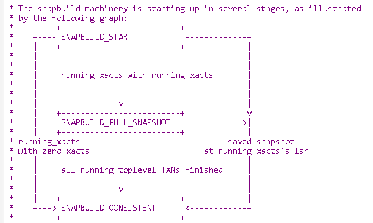

## londiste3 copy table' snapshot & PostgreSQL logical replication's snapshot 不同之处  
                    
### 作者                             
digoal                           
                                      
### 日期                                                                                                                                             
2015-09-08                                                                        
                                                                             
### 标签                                                                          
PostgreSQL , londiste3 , 快照 , snapshot , logical replication , 逻辑复制 , 队列复制      
                                                                                                                                                
----                                                                                                                                          
                                                                                                                                                   
## 背景           
PostgreSQL有物理复制，也有逻辑复制。  
  
物理复制是持续的从XLOG读取block data在对应的物理文件实行recovery的过程。  
  
建立物理备份的standby时，会强制开启一个检查点，然后拷贝数据文件，拷贝完后的数据库其实是不一致的，没有关系，只要从检查点开始的所有XLOG都在，就可以恢复。检查点我们可以通俗的认为是一个snapshot。  
  
那么对于逻辑复制，snapshot又是怎么来的呢？  
  
我们想象一下，在备份数据库时，会堵塞数据库的读写操作吗？当然不会，所以创建逻辑备份库，也不能堵塞数据库的读写操作。  
  
那么，怎样保证数据一致性呢？  
  
例如常见的逻辑备份工具londiste3，它支持表级别的创建复制对象。还有PostgreSQL的基于XLOG的逻辑复制，它们是怎么保证创建基础后可以准确的接上REDO SQL。  
  
本文主要谈一下londiste3和PostgreSQL逻辑流复制的snapshot的差别。  
  
首先谈一下londiste3，它可以在http://git.postgresql.org/gitweb/?p=skytools.git;a=summary这里下载。  
  
londiste3的原理是使用触发器记录行的变更，包括变更前和变更后的记录。  
  
初始化前，创建触发器，记录所有的变更，（由于创建触发器是DDL操作，在建好触发器时，所有这个表相关的事务一定是已经结束了的），在拷贝初始化数据的事务中，先使用txid_current_snapshot()获得当前的事务快照，然后获取数据。  
  
数据获取完后，就可以从触发器跟踪的REDO记录开始持续恢复了，快照的作用是判断事务产生的REDO是否需要应用。  
  
例如：  
  
```  
0. 创建触发器，开始记录表的REDO SQL。  
1. 未结束事务1,2,3,4   
2. begin;  
3. 获得快照  1:5:1,2,3,4    
4. 开始创建初始化数据  
5. 开启事务6,7,8,9   结束事务6   
6. 结束事务1    
7. end;  // 结束创建初始化数据  
8. 回滚事务  2,7   
9. 结束事务  3,4,8,9   
```  
  
以上是一个非常容易遇到的情况，在创建初始化数据前，可能有未结束的事务，开始创建初始化数据后，可能有新的事务发起，回归等等情况。  
  
通过快照就可以很好的处理这些情况，skytools相关的代码。  
  
```  
python/londiste/table_copy.py  
	# get snapshot  
        src_curs.execute("select txid_current_snapshot()")  
        snapshot = src_curs.fetchone()[0]  
        src_db.commit()  
  
        # restore old behaviour  
        src_db.set_isolation_level(oldiso)  
        src_db.commit()  
  
        tbl_stat.change_state(TABLE_CATCHING_UP)  
        tbl_stat.change_snapshot(snapshot)  
        self.save_table_state(dst_curs)  
  
  
python/londiste/playback.py  
    def change_snapshot(self, str_snapshot, tag_changed = 1):  
        """Set snapshot."""  
        if self.str_snapshot == str_snapshot:  
            return  
        self.log.debug("%s: change_snapshot to %s", self.name, str_snapshot)  
        self.str_snapshot = str_snapshot  
        if str_snapshot:  
            self.from_snapshot = skytools.Snapshot(str_snapshot)  
        else:  
            self.from_snapshot = None  
  
        if tag_changed:  
            self.ok_batch_count = 0  
            self.last_tick = None  
            self.changed = 1  
  
  
python/skytools/sqltools.py  
#  
# Support for PostgreSQL snapshot  
#  
  
class Snapshot(object):  
    """Represents a PostgreSQL snapshot.  
  
    Example:  
    >>> sn = Snapshot('11:20:11,12,15')  //  最小未提交事务11, 最小未分配事务20, 当前未提交事务11,12,15  
    >>> sn.contains(9)  // 该snapshot是否包含事务9的内容, 是，因为最小未提交事务是11，9已经提交了。  
    True  
    >>> sn.contains(11)  // 该snapshot是否包含事务11的内容, 否，因为11还未提交  
    False  
    >>> sn.contains(17)  // 该snapshot是否包含事务9的内容, 是，已提交  
    True  
    >>> sn.contains(20)  // 该snapshot是否包含事务9的内容, 否，未分配  
    False  
    """  
  
    def __init__(self, str):  
        "Create snapshot from string."  
  
        self.sn_str = str  
        tmp = str.split(':')  
        if len(tmp) != 3:  
            raise Exception('Unknown format for snapshot')  
        self.xmin = int(tmp[0])  
        self.xmax = int(tmp[1])  
        self.txid_list = []  
        if tmp[2] != "":  
            for s in tmp[2].split(','):  
                self.txid_list.append(int(s))  
  
    def contains(self, txid):  
        "Is txid visible in snapshot."  
  
        txid = int(txid)  
  
        if txid < self.xmin:  
            return True  
        if txid >= self.xmax:  
            return False  
        if txid in self.txid_list:  
            return False  
        return True  
```  
  
通过快照来判断，哪些事务的变更是需要APPLY的，哪些事务的变更是不需要APPLY的。  
  
用到的txid_current_snapsho()函数介绍如下：  
  
http://www.postgresql.org/docs/devel/static/functions-info.html  
  
  
Name|	Description  
---|---  
xmin|	Earliest transaction ID (txid) that is still active. All earlier transactions will either be committed and visible, or rolled back and dead.  
xmax|	First as-yet-unassigned txid. All txids greater than or equal to this are not yet started as of the time of the snapshot, and thus invisible.  
xip_list|	Active txids at the time of the snapshot. The list includes only those active txids between xmin and xmax; there might be active txids higher than xmax. A txid that is xmin <= txid < xmax and not in this list was already completed at the time of the snapshot, and thus either visible or dead according to its commit status. The list does not include txids of subtransactions.  
  
  
接下来看看基于流复制的逻辑复制的初始化怎么做？以及如何获得快照。  
  
手册上告诉我们，在创建slot后，decode可以从slot对应的XLOG OFFSET开始获取差量，也就是说，它不管OFFSET之前的XLOG。那么问题来了，如果不管OFFSET之前的XLOG，必须要确保我们创建slot时，所有的事务都已经结束了，否则我们就一定要用到OFFSET之前的XLOG，为什么呢？这就是和londiste3复制不一样的地方了，因为事务的XLOG是在修改BLOCK后即刻产生的，而不是在事务结束后产生的，所以如果我们同样有前面提到的场景，那么我们必须要读OFFSET之前的XLOG才能获取到一个之前开启的事务的完整信息。  
  
而londiste3是基于触发器的，并且将REDO记录在表里面的原理，记录时在提交后才能看到的，所以只要表在，就一定能读到，而且londiste3的OFFSET指的是最小未提交事务，所以一定能获取到。  
  
从代码层面去分析，我们可以看到PostgreSQL基于XLOG的逻辑复制，在创建slot时，获取的OFFSET确实是一致性点，因为它会等待所有的事务结束。  
  
从创建slot的函数pg_create_logical_replication_slot开始：  
  
src/backend/replication/slotfuncs.c  
  
```  
/*  
 * SQL function for creating a new logical replication slot.  
 */  
Datum  
pg_create_logical_replication_slot(PG_FUNCTION_ARGS)  
{  
......  
        /* build initial snapshot, might take a while */  
        DecodingContextFindStartpoint(ctx);  
......  
```  
  
src/backend/replication/logical/logical.c  
  
  
等待所有事务结束。  
  
```  
/*  
 * Read from the decoding slot, until it is ready to start extracting changes.  
 */  
void  
DecodingContextFindStartpoint(LogicalDecodingContext *ctx)  
{  
......  
        /* Wait for a consistent starting point */  等待一致性点，所有事务结束  
        for (;;)  
        {  
......  
                /* only continue till we found a consistent spot */  
                if (DecodingContextReady(ctx))  
                        break;  
......  
          }  
        ctx->slot->data.confirmed_flush = ctx->reader->EndRecPtr;  
......  
```  
  
src/backend/replication/logical/logical.c  
  
```  
/*  
 * Returns true if an consistent initial decoding snapshot has been built.  
 */  
bool  
DecodingContextReady(LogicalDecodingContext *ctx)  
{  
        return SnapBuildCurrentState(ctx->snapshot_builder) == SNAPBUILD_CONSISTENT;  
}  
```  
  
src/include/replication/snapbuild.h  
  
```  
typedef enum  
{  
        /*  
         * Initial state, we can't do much yet.  
         */  
        SNAPBUILD_START,  
  
        /*  
         * We have collected enough information to decode tuples in transactions  
         * that started after this.  
         *  
         * Once we reached this we start to collect changes. We cannot apply them  
         * yet because the might be based on transactions that were still running  
         * when we reached them yet.  
         */  
        SNAPBUILD_FULL_SNAPSHOT,  
  
        /*  
         * Found a point after hitting built_full_snapshot where all transactions  
         * that were running at that point finished. Till we reach that we hold  
         * off calling any commit callbacks.    
         */  
        SNAPBUILD_CONSISTENT  
} SnapBuildState;  
```  
  
从src/backend/replication/snapbuild.c截取出来的一张状态图，在创建snapshot时，经过的几个阶段和状态描述。  
  
  
  
创建slot时，表示all running toplevel TXNs finished。  
  
所以在slot后，从XLOG解析到的ROW，都是整个事务的，不会出现部分事务的ROW。（当然，我们其实还有办法区分是不是部分事务的ROW，因为事务开始的信息也可以从XLOG获取，凡是没有事务开始信息的都可以认为是部分事务。）  
  
接下来要考虑的就是数据初始化的问题了，我们能不能向londiste3那样，记录snapshot时的XID，然后COPY数据，然后再从XLOG获取呢？（其实也可以，只是decode时，我们需要输出ROW对应的XID，同时在APPLY时过滤掉初始化数据时已经包含的XID）。  
  
但是PostgreSQL官方不建议我们这么做，它更倾向我们使用snapshot export，即创建slot时，使用同一个事务导出事务镜像，并使用这个事务镜像去导出数据，那么从这个SLOT解析出来的ROW都是我们在此次数据导出后需要APPLY的ROW。  
  
例子：  
  
[《PostgreSQL 9.5 new feature - pg_dump use --snapshot taken by another session (exp. slot, pg_export_snapshot())》](../201506/20150616_02.md)    
  
http://www.postgresql.org/docs/devel/static/logicaldecoding-explanation.html  
  
```  
46.2.4. Exported Snapshots  
  
When a new replication slot is created using the streaming replication interface,   
a snapshot is exported (see Section 9.26.5),   
which will show exactly the state of the database after which all changes will be included in the change stream.   
  
This can be used to create a new replica by using SET TRANSACTION SNAPSHOT to read the state   
of the database at the moment the slot was created.   
  
This transaction can then be used to dump the database's state at that point in time,   
which afterwards can be updated using the slot's contents without losing any changes.  
```  
  
slot需要记录已经读取到哪些XLOG OFFSET了，对于逻辑SLOT，还需要记录哪些XMIN是还没有DECODE的，在做垃圾回收时，这些XMIN以前的垃圾可以回收，以后的不能回收，因为可能需要用来转换relname, relattrname等(pg_class,pg_attr)。(XLOG中记录的是OID，所以decode必须要从数据库将OID转换为对应的表名，列名。)  
  
src/include/replication/slot.h  
  
```  
/*  
 * Shared memory state of a single replication slot.  
 */  
typedef struct ReplicationSlot  
{  
        /* lock, on same cacheline as effective_xmin */  
        slock_t         mutex;  
  
        /* is this slot defined */  
        bool            in_use;  
  
        /* is somebody streaming out changes for this slot */  
        bool            active;  
  
        /* any outstanding modifications? */  
        bool            just_dirtied;  
        bool            dirty;  
  
        /*  
         * For logical decoding, it's extremely important that we never remove any  
         * data that's still needed for decoding purposes, even after a crash;  
         * otherwise, decoding will produce wrong answers.  Ordinary streaming  
         * replication also needs to prevent old row versions from being removed  
         * too soon, but the worst consequence we might encounter there is  
         * unwanted query cancellations on the standby.  Thus, for logical  
         * decoding, this value represents the latest xmin that has actually been  
         * written to disk, whereas for streaming replication, it's just the same  
         * as the persistent value (data.xmin).  
         */  
        TransactionId effective_xmin;  
        TransactionId effective_catalog_xmin;  
  
        /* data surviving shutdowns and crashes */  
        ReplicationSlotPersistentData data;  
  
        /* is somebody performing io on this slot? */  
        LWLock     *io_in_progress_lock;  
  
        /* all the remaining data is only used for logical slots */  
  
        /* ----  
         * When the client has confirmed flushes >= candidate_xmin_lsn we can  
         * advance the catalog xmin, when restart_valid has been passed,  
         * restart_lsn can be increased.  
         * ----  
         */  
        TransactionId candidate_catalog_xmin;  
        XLogRecPtr      candidate_xmin_lsn;  
        XLogRecPtr      candidate_restart_valid;  
        XLogRecPtr      candidate_restart_lsn;  
} ReplicationSlot;  
```  
  
2nd开发的一个基于逻辑复制的decode插件  
  
https://github.com/2ndQuadrant/bdr/tree/bdr-plugin/REL0_9_STABLE  
  
有兴趣的同学可以试试，9.4分支如下。  
  
git clone -b REL0_9_STABLE https://github.com/2ndQuadrant/bdr   
  
## 参考  
1\. http://git.postgresql.org/gitweb/?p=skytools.git;a=summary  
  
2\. http://www.postgresql.org/docs/devel/static/logicaldecoding-explanation.html  
  
3\. http://www.postgresql.org/docs/devel/static/functions-info.html  
  
4\. [《PostgreSQL 9.5 new feature - pg_dump use --snapshot taken by another session (exp. slot, pg_export_snapshot())》](../201506/20150616_02.md)    
   
  
<a rel="nofollow" href="http://info.flagcounter.com/h9V1"  ></a>  
  
  
  
  
  
  
## [digoal's 大量PostgreSQL文章入口](https://github.com/digoal/blog/blob/master/README.md "22709685feb7cab07d30f30387f0a9ae")
  
