## [转载]关于字符编码，你所需要知道的   
                                                                                                   
### 作者                                                                                  
digoal                                                                                  
                                                                                  
### 日期                                                                                   
2015-09-11                                                                        
                                                                                    
### 标签                                                                                  
PostgreSQL , 字符集 , 编码        
                                                                                              
----                                                                                              
                                                                                               
## 背景                       
## 原文  
1\. http://www.cnblogs.com/KevinYang/archive/2010/06/18/1760597.html  
  
字符编码的问题看似很小，经常被技术人员忽视，但是很容易导致一些莫名其妙的问题。这里总结了一下字符编码的一些普及性的知识，希望对大家有所帮助。  
  
## 从ASCII码说起  
  
说到字符编码，不得不说ASCII码的简史。计算机一开始发明的时候是用来解决数字计算的问题，后来人们发现，计算机还可以做更多的事，例如文本处理。但由于计算机只识“数”，因此人们必须告诉计算机哪个数字来代表哪个特定字符，例如65代表字母‘A’，66代表字母‘B’，以此类推。但是计算机之间字符-数字的对应关系必须得一致，否则就会造成同一段数字在不同计算机上显示出来的字符不一样。因此美国国家标准协会ANSI制定了一个标准，规定了常用字符的集合以及每个字符对应的编号，这就是ASCII字符集（Character Set），也称ASCII码。  
  
当时的计算机普遍使用8比特字节作为最小的存储和处理单元，加之当时用到的字符也很少，26个大小写英文字母还有数字再加上其他常用符号，也不到100个，因此使用7个比特位就可以高效的存储和处理ASCII码，剩下最高位1比特被用作一些通讯系统的奇偶校验。  
  
注意，字节代表系统能够处理的最小单位，不一定是8比特。只是现代计算机的事实标准就是用8比特来代表一个字节。在很多技术规格文献中，为了避免产生歧义，更倾向于使用8位组（Octet）而不是字节（Byte）这个术语来强调8个比特的二进制流。下文中为了便于理解，我会延用大家熟悉的“字节”这个概念。  
  
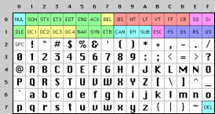  
  
ASCII字符集由95个可打印字符（0x20-0x7E）和33个控制字符（0x00-0x19，0x7F）组成。可打印字符用于显示在输出设备上，例如荧屏或者打印纸上，控制字符用于向计算机发出一些特殊指令，例如0x07会让计算机发出哔的一声，0x00通常用于指示字符串的结束，0x0D和0x0A用于指示打印机的打印针头退到行首（回车）并移到下一行（换行）。  
  
那时候的字符编解码系统非常简单，就是简单的查表过程。例如将字符序列编码为二进制流写入存储设备，只需要在ASCII字符集中依次找到字符对应的字节，然后直接将该字节写入存储设备即可。解码二进制流的过程也是类似。  
  
## OEM字符集的衍生  
  
当计算机开始发展起来的时候，人们逐渐发现，ASCII字符集里那可怜的128个字符已经不能再满足他们的需求了。人们就在想，一个字节能够表示的数字（编号）有256个，而ASCII字符只用到了0x00~0x7F，也就是占用了前128个，后面128个数字不用白不用，因此很多人打起了后面这128个数字的主意。可是问题在于，很多人同时有这样的想法，但是大家对于0x80-0xFF这后面的128个数字分别对应什么样的字符，却有各自的想法。这就导致了当时销往世界各地的机器上出现了大量各式各样的OEM字符集。  
  
下面这张表是IBM-PC机推出的其中一个OEM字符集，字符集的前128个字符和ASCII字符集的基本一致（为什么说基本一致呢，是因为前32个控制字符在某些情况下会被IBM-PC机当作可打印字符解释），后面128个字符空间加入了一些欧洲国家用到的重音字符，以及一些用于画线条画的字符。  
  
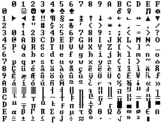  
  
事实上，大部分OEM字符集是兼容ASCII字符集的，也就是说，大家对于0x00~0x7F这个范围的解释基本是相同的，而对于后半部分0x80~0xFF的解释却不一定相同。甚至有时候同样的字符在不同OEM字符集中对应的字节也是不同的。  
  
不同的OEM字符集导致人们无法跨机器交流各种文档。例如职员甲发了一封简历résumés给职员乙，结果职员乙看到的却是r?sum?s，因为é字符在职员甲机器上的OEM字符集中对应的字节是0x82，而在职员乙的机器上，由于使用的OEM字符集不同，对0x82字节解码后得到的字符却是?。  
  
## 多字节字符集（MBCS）和中文字符集  
  
上面我们提到的字符集都是基于单字节编码，也就是说，一个字节翻译成一个字符。这对于拉丁语系国家来说可能没有什么问题，因为他们通过扩展第8个比特，就可以得到256个字符了，足够用了。但是对于亚洲国家来说，256个字符是远远不够用的。因此这些国家的人为了用上电脑，又要保持和ASCII字符集的兼容，就发明了多字节编码方式，相应的字符集就称为多字节字符集。例如中国使用的就是双字节字符集编码（DBCS，Double Byte Character Set）。  
  
对于单字节字符集来说，代码页中只需要有一张码表即可，上面记录着256个数字代表的字符。程序只需要做简单的查表操作就可以完成编解码的过程。  
  
代码页是字符集编码的具体实现，你可以把他理解为一张“字符-字节”映射表，通过查表实现“字符-字节”的翻译。下面会有更详细的描述。  
  
而对于多字节字符集，代码页中通常会有很多码表。那么程序怎么知道该使用哪张码表去解码二进制流呢？答案是，根据第一个字节来选择不同的码表进行解析。  
  
例如目前最常用的中文字符集GB2312，涵盖了所有简体字符以及一部分其他字符；GBK（K代表扩展的意思）则在GB2312的基础上加入了对繁体字符等其他非简体字符（GB18030字符集不是双字节字符集，我们在讲Unicode的时候会提到）。这两个字符集的字符都是使用1-2个字节来表示。Windows系统采用936代码页来实现对GBK字符集的编解码。在解析字节流的时候，如果遇到字节的最高位是0的话，那么就使用936代码页中的第1张码表进行解码，这就和单字节字符集的编解码方式一致了。  
  
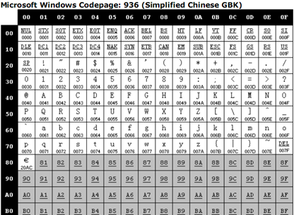  
  
当字节的高位是1的时候，确切的说，当第一个字节位于0x81–0xFE之间时，根据第一个字节不同找到代码页中的相应的码表，例如当第一个字节是0x81，那么对应936中的下面这张码表：  
  
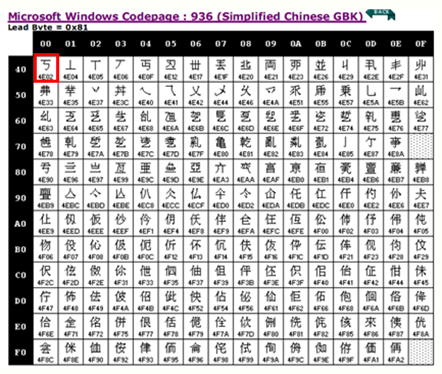  
  
（关于936代码页中完整的码表信息，参见MSDN：http://msdn.microsoft.com/en-us/library/cc194913%28v=MSDN.10%29.aspx.）  
  
按照936代码页的码表，当程序遇到连续字节流0x81 0x40的时候，就会解码为“丂”字符。  
  
## ANSI标准、国家标准、ISO标准  
  
不同ASCII衍生字符集的出现，让文档交流变得非常困难，因此各种组织都陆续进行了标准化流程。例如美国ANSI组织制定了ANSI标准字符编码（注意，我们现在通常说到ANSI编码，通常指的是平台的默认编码，例如英文操作系统中是ISO-8859-1，中文系统是GBK），ISO组织制定的各种ISO标准字符编码，还有各国也会制定一些国家标准字符集，例如中国的GBK，GB2312和GB18030。  
  
操作系统在发布的时候，通常会往机器里预装这些标准的字符集还有平台专用的字符集，这样只要你的文档是使用标准字符集编写的，通用性就比较高了。例如你用GB2312字符集编写的文档，在中国大陆内的任何机器上都能正确显示。同时，我们也可以在一台机器上阅读多个国家不同语言的文档了，前提是本机必须安装该文档使用的字符集。  
  
## Unicode的出现  
  
虽然通过使用不同字符集，我们可以在一台机器上查阅不同语言的文档，但是我们仍然无法解决一个问题：在一份文档中显示所有字符。为了解决这个问题，我们需要一个全人类达成共识的巨大的字符集，这就是Unicode字符集。  
  
### Unicode字符集概述  
Unicode字符集涵盖了目前人类使用的所有字符，并为每个字符进行统一编号，分配唯一的字符码（Code Point）。Unicode字符集将所有字符按照使用上的频繁度划分为17个层面（Plane），每个层面上有216=65536个字符码空间。  
  
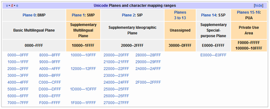  
  
其中第0个层面BMP，基本涵盖了当今世界用到的所有字符。其他的层面要么是用来表示一些远古时期的文字，要么是留作扩展。我们平常用到的Unicode字符，一般都是位于BMP层面上的。目前Unicode字符集中尚有大量字符空间未使用。  
  
### 编码系统的变化  
在Unicode出现之前，所有的字符集都是和具体编码方案绑定在一起的，都是直接将字符和最终字节流绑定死了，例如ASCII编码系统规定使用7比特来编码ASCII字符集；GB2312以及GBK字符集，限定了使用最多2个字节来编码所有字符，并且规定了字节序。这样的编码系统通常用简单的查表，也就是通过代码页就可以直接将字符映射为存储设备上的字节流了。例如下面这个例子：  
  
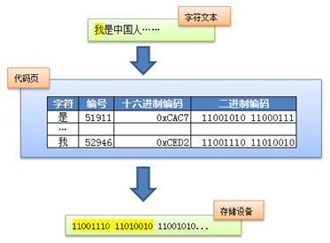  
  
这种方式的缺点在于，字符和字节流之间耦合得太紧密了，从而限定了字符集的扩展能力。假设以后火星人入住地球了，要往现有字符集中加入火星文就变得很难甚至不可能了，而且很容易破坏现有的编码规则。  
  
因此Unicode在设计上考虑到了这一点，将字符集和字符编码方案分离开。  
  
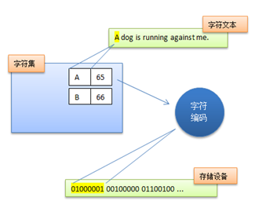  
  
也就是说，虽然每个字符在Unicode字符集中都能找到唯一确定的编号（字符码，又称Unicode码），但是决定最终字节流的却是具体的字符编码。例如同样是对Unicode字符“A”进行编码，UTF-8字符编码得到的字节流是0x41，而UTF-16（大端模式）得到的是0x00 0x41。  
  
### 常见的Unicode编码  
#### UCS-2/UTF-16  
  
如果要我们来实现Unicode字符集中BMP字符的编码方案，我们会怎么实现？由于BMP层面上有216=65536个字符码，因此我们只需要两个字节就可以完全表示这所有的字符了。  
  
举个例子，“中”的Unicode字符码是0x4E2D(01001110 00101101)，那么我们可以编码为01001110 00101101（大端）或者00101101 01001110 （小端）。  
  
UCS-2和UTF-16对于BMP层面的字符均是使用2个字节来表示，并且编码得到的结果完全一致。不同之处在于，UCS-2最初设计的时候只考虑到BMP字符，因此使用固定2个字节长度，也就是说，他无法表示Unicode其他层面上的字符，而UTF-16为了解除这个限制，支持Unicode全字符集的编解码，采用了变长编码，最少使用2个字节，如果要编码BMP以外的字符，则需要4个字节结对，这里就不讨论那么远，有兴趣可以参考维基百科：UTF-16/UCS-2。  
  
Windows从NT时代开始就采用了UTF-16编码，很多流行的编程平台，例如.Net，Java，Qt还有Mac下的Cocoa等都是使用UTF-16作为基础的字符编码。例如代码中的字符串，在内存中相应的字节流就是用UTF-16编码过的。  
  
#### UTF-8  
  
UTF-8应该是目前应用最广泛的一种Unicode编码方案。由于UCS-2/UTF-16对于ASCII字符使用两个字节进行编码，存储和处理效率相对低下，并且由于ASCII字符经过UTF-16编码后得到的两个字节，高字节始终是0x00，很多C语言的函数都将此字节视为字符串末尾从而导致无法正确解析文本。因此一开始推出的时候遭到很多西方国家的抵触，大大影响了Unicode的推行。后来聪明的人们发明了UTF-8编码，解决了这个问题。  
  
UTF-8编码方案采用1-4个字节来编码字符，方法其实也非常简单。  
  
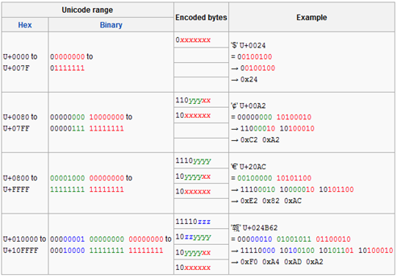  
  
（上图中的x代表Unicode码的低8位，y代表高8位）  
  
对于ASCII字符的编码使用单字节，和ASCII编码一摸一样，这样所有原先使用ASCII编解码的文档就可以直接转到UTF-8编码了。对于其他字符，则使用2-4个字节来表示，其中，首字节前置1的数目代表正确解析所需要的字节数，剩余字节的高2位始终是10。例如首字节是1110yyyy，前置有3个1，说明正确解析总共需要3个字节，需要和后面2个以10开头的字节结合才能正确解析得到字符。  
  
关于UTF-8的更多信息，参考维基百科：UTF-8。  
  
#### GB18030  
  
任何能够将Unicode字符映射为字节流的编码都属于Unicode编码。中国的GB18030编码，覆盖了Unicode所有的字符，因此也算是一种Unicode编码。只不过他的编码方式并不像UTF-8或者UTF-16一样，将Unicode字符的编号通过一定的规则进行转换，而只能通过查表的手段进行编码。  
  
关于GB18030的更多信息，参考：GB18030。  
  
### Unicode相关的常见问题  
  
#### Unicode是两个字节吗？  
  
Unicode只是定义了一个庞大的、全球通用的字符集，并为每个字符规定了唯一确定的编号，具体存储为什么样的字节流，取决于字符编码方案。推荐的Unicode编码是UTF-16和UTF-8。  
  
#### 带签名的UTF-8指的是什么意思？  
  
带签名指的是字节流以BOM标记开始。很多软件会“智能”的探测当前字节流使用的字符编码，这种探测过程出于效率考虑，通常会提取字节流前面若干个字节，看看是否符合某些常见字符编码的编码规则。由于UTF-8和ASCII编码对于纯英文的编码是一样的，无法区分开来，因此通过在字节流最前面添加BOM标记可以告诉软件，当前使用的是Unicode编码，判别成功率就十分准确了。但是需要注意，不是所有软件或者程序都能正确处理BOM标记，例如PHP就不会检测BOM标记，直接把它当普通字节流解析了。因此如果你的PHP文件是采用带BOM标记的UTF-8进行编码的，那么有可能会出现问题。  
  
#### Unicode编码和以前的字符集编码有什么区别？  
  
早期字符编码、字符集和代码页等概念都是表达同一个意思。例如GB2312字符集、GB2312编码，936代码页，实际上说的是同个东西。但是对于Unicode则不同，Unicode字符集只是定义了字符的集合和唯一编号，Unicode编码，则是对UTF-8、UCS-2/UTF-16等具体编码方案的统称而已，并不是具体的编码方案。所以当需要用到字符编码的时候，你可以写gb2312，codepage936，utf-8，utf-16，但请不要写unicode（看过别人在网页的meta标签里头写charset=unicode，有感而发）。  
  
   
  
## 乱码问题  
  
乱码指的是程序显示出来的字符文本无法用任何语言去解读。一般情况下会包含大量?或者?。乱码问题是所有计算机用户或多或少会遇到的问题。造成乱码的原因就是因为使用了错误的字符编码去解码字节流，因此当我们在思考任何跟文本显示有关的问题时，请时刻保持清醒：当前使用的字符编码是什么。只有这样，我们才能正确分析和处理乱码问题。  
  
例如最常见的网页乱码问题。如果你是网站技术人员，遇到这样的问题，需要检查以下原因：  
  
服务器返回的响应头Content-Type没有指明字符编码  
  
网页内是否使用META HTTP-EQUIV标签指定了字符编码  
  
网页文件本身存储时使用的字符编码和网页声明的字符编码是否一致    
  
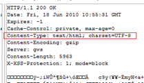  
  
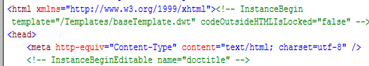  
  
注意，网页解析的过程如果使用的字符编码不正确，还可能会导致脚本或者样式表出错。具体细节可以参考我以前写过的文章：文档字符集导致的脚本错误和Asp.Net页面的编码问题。  
  
不久前看到某技术论坛有人反馈，WinForm程序使用Clipboard类的GetData方法去访问剪切板中的HTML内容时会出现乱码的问题，我估计也是由于WinForm在获取HTML文本的时候没有用对正确的字符编码导致的。Windows剪贴板只支持UTF-8编码，也就是说你传入的文本都会被UTF-8编解码。这样一来，只要两个程序都是调用Windows剪切板API编程的话，那么复制粘贴的过程中不会出现乱码。除非一方在获取到剪贴板数据之后使用了错误的字符编码进行解码，才会得到乱码（我做了简单的WinForm剪切板编程实验，发现GetData使用的是系统默认编码，而不是UTF-8编码）。  
  
关于乱码中出现?或者?，这里需要额外提一下，当程序使用特定字符编码解析字节流的时候，一旦遇到无法解析的字节流时，就会用?或者?来替代。因此，一旦你最终解析得到的文本包含这样的字符，而你又无法得到原始字节流的时候，说明正确的信息已经彻底丢失了，尝试任何字符编码都无法从这样的字符文本中还原出正确的信息来。  
  
## 必要的术语解释  
  
字符集（Character Set），字面上的理解就是字符的集合，例如ASCII字符集，定义了128个字符；GB2312定义了7445个字符。而计算机系统中提到的字符集准确来说，指的是已编号的字符的有序集合（不一定是连续）。  
  
字符码（Code Point）指的就是字符集中每个字符的数字编号。例如ASCII字符集用0-127这连续的128个数字分别表示128个字符；GBK字符集使用区位码的方式为每个字符编号，首先定义一个94X94的矩阵，行称为“区”，列称为“位”，然后将所有国标汉字放入矩阵当中，这样每个汉字就可以用唯一的“区位”码来标识了。例如“中”字被放到54区第48位，因此字符码就是5448。而Unicode中将字符集按照一定的类别划分到0~16这17个层面（Planes）中，每个层面中拥有216=65536个字符码，因此Unicode总共拥有的字符码，也即是Unicode的字符空间总共有17*65536=1114112。  
  
  
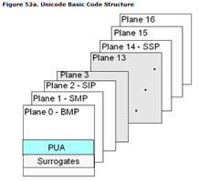  
  
编码的过程是将字符转换成字节流。  
  
解码的过程是将字节流解析为字符。  
  
字符编码（Character Encoding）是将字符集中的字符码映射为字节流的一种具体实现方案。例如ASCII字符编码规定使用单字节中低位的7个比特去编码所有的字符。例如‘A’的编号是65，用单字节表示就是0x41，因此写入存储设备的时候就是b’01000001’。GBK编码则是将区位码（GBK的字符码）中的区码和位码的分别加上0xA0（160）的偏移（之所以要加上这样的偏移，主要是为了和ASCII码兼容），例如刚刚提到的“中”字，区位码是5448，十六进制是0x3630，区码和位码分别加上0xA0的偏移之后就得到0xD6D0，这就是“中”字的GBK编码结果。  
  
代码页（Code Page）一种字符编码具体形式。早期字符相对少，因此通常会使用类似表格的形式将字符直接映射为字节流，然后通过查表的方式来实现字符的编解码。现代操作系统沿用了这种方式。例如Windows使用936代码页、Mac系统使用EUC-CN代码页实现GBK字符集的编码，名字虽然不一样，但对于同一汉字的编码肯定是一样的。  
  
大小端的说法源自《格列佛游记》。我们知道，鸡蛋通常一端大一端小，小人国的人们对于剥蛋壳时应从哪一端开始剥起有着不一样的看法。同样，计算机界对于传输多字节字（由多个字节来共同表示一个数据类型）时，是先传高位字节（大端）还是先传低位字节（小端）也有着不一样的看法，这就是计算机里头大小端模式的由来了。无论是写文件还是网络传输，实际上都是往流设备进行写操作的过程，而且这个写操作是从流的低地址向高地址开始写（这很符合人的习惯），对于多字节字来说，如果先写入高位字节，则称作大端模式。反之则称作小端模式。也就是说，大端模式下，字节序和流设备的地址顺序是相反的，而小端模式则是相同的。一般网络协议都采用大端模式进行传输。  
  
——Kevin Yang  
  
## 参考链接  
  
The Absolute Minimum Every Software Developer Absolutely, Positively Must Know About Unicode and Character Sets (No Excuses!)  
  
http://developers.sun.com/dev/gadc/technicalpublications/articles/gb18030.html  
  
http://en.wikipedia.org/wiki/Universal_Character_Set  
  
http://en.wikipedia.org/wiki/Code_page  
  
  
  
  
  
  
  
  
## [digoal's 大量PostgreSQL文章入口](https://github.com/digoal/blog/blob/master/README.md "22709685feb7cab07d30f30387f0a9ae")
  
