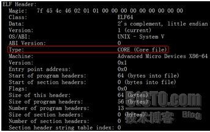
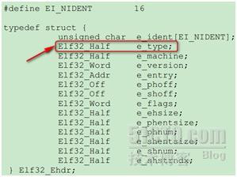
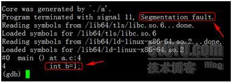
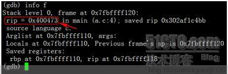
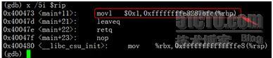
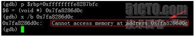
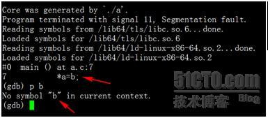
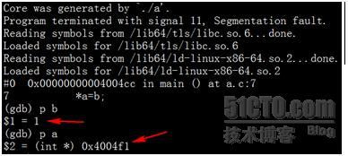

## Core dump 分析  
                                
### 作者                                                                             
digoal                           
                                  
### 日期                             
2015-09-16                         
                              
### 标签                           
PostgreSQL , Linux , Core dump , gdb , gcore          
                                
----                          
                                   
## 背景          
本文参考互联网文  
  
Core，又称之为Core Dump文件，是Unix/Linux操作系统的一种机制，对于线上服务而言，Core令人闻之色变，因为出Core的过程意味着服务暂时不能正常响应，需要恢复，并且随着吐Core进程的内存空间越大，此过程可能持续很长一段时间（例如当进程占用60G+以上内存时，完整Core文件需要15分钟才能完全写到磁盘上），这期间产生的流量损失，不可估量。  
  
凡事皆有两面性，OS在出Core的同时，虽然会终止掉当前进程，但是也会保留下第一手的现场数据，OS仿佛是一架被按下快门的相机，而照片就是产出的Core文件。  
  
Core文件里面含有当进程被终止时内存、CPU寄存器等信息，可以供后续开发人员进行调试。  
  
关于Core产生的原因很多，比如过去一些Unix的版本不支持现代Linux上这种GDB直接附着到进程上进行调试的机制，需要先向进程发送终止信号，然后用工具阅读core文件。在Linux上，我们就可以使用kill向一个指定的进程发送信号，  
  
man 7 signal  
  
以下信号将产生Core文件。  
  
```  
       Core   Default action is to terminate the process and dump core (see core(5)).  
  
       First the signals described in the original POSIX.1-1990 standard.  
       Signal     Value     Action   Comment  
       ----------------------------------------------------------------------  
       SIGQUIT       3       Core    Quit from keyboard  
       SIGILL        4       Core    Illegal Instruction  
       SIGABRT       6       Core    Abort signal from abort(3)  
       SIGFPE        8       Core    Floating point exception  
       SIGSEGV      11       Core    Invalid memory reference  
  
       Next the signals not in the POSIX.1-1990 standard but described in SUSv2 and POSIX.1-2001.  
       Signal       Value     Action   Comment  
       --------------------------------------------------------------------  
       SIGBUS      10,7,10     Core    Bus error (bad memory access)  
       SIGSYS      12,-,12     Core    Bad argument to routine (SVr4)  
       SIGTRAP        5        Core    Trace/breakpoint trap  
       SIGXCPU     24,24,30    Core    CPU time limit exceeded (4.2BSD)  
       SIGXFSZ     25,25,31    Core    File size limit exceeded (4.2BSD)  
  
       Next various other signals.  
       Signal       Value     Action   Comment  
       --------------------------------------------------------------------  
       SIGIOT         6        Core    IOT trap. A synonym for SIGABRT  
```  
  
或者使用gcore命令来使其主动生成Core。  
  
```  
[root@digoal sysctl]# gcore  
usage:  gcore [-o filename] pid  
```  
  
例子  
  
```  
postgres=# select pid from pg_stat_activity ;  
  pid    
-------  
 29103  
(1 row)  
  
生成CORE  
$gcore -o /disk1/dege.zzz/abc 29103  
[Thread debugging using libthread_db enabled]  
0x00007fa6dbed06a2 in recv () from /lib64/libc.so.6  
Saved corefile /disk1/dege.zzz/abc.29103  
  
分析CORE  
$gdb --core=/disk1/dege.zzz/abc.29103 /home/digoal/pgsql9.6/bin/postgres  
  
(gdb) bt  
#0  0x00007fa6dbed06a2 in ?? ()  
#1  0x00000000012f3b50 in ?? ()  
#2  0x0000000000532139 in typeidTypeRelid ()  
#3  0x000000000066274e in log_line_prefix.isra.1 ()  
#4  0x00007fa6dbdef760 in ?? ()  
#5  0x0000000001345dd0 in ?? ()  
#6  0x0000000000000001 in ?? ()  
#7  0x00007fa6dca2c188 in _r_debug ()  
#8  0x0000000000000000 in ?? ()  
  
以上符号表不全，可以换个编译全面的postgres二进制文件。  
```  
  
如果从浅层次的原因上来讲，出Core意味着当前进程存在BUG，需要程序员修复。从深层次的原因上讲，是当前进程触犯了某些OS层级的保护机制，逼迫OS向当前进程发送诸如SIGSEGV(即signal 11)之类的信号, 例如访问空指针或数组越界出Core，实际上是触犯了OS的内存管理，访问了非当前进程的内存空间，OS需要通过出Core来进行警示，这就好像一个人身体内存在病毒，免疫系统就会通过发热来警示，并导致人体发烧是一个道理（有意思的是，并不是每次数组越界都会出Core，这和OS的内存管理中虚拟页面分配大小和边界有关，即使不出Core，也很有可能读到脏数据，引起后续程序行为紊乱，这是一种很难追查的BUG）。  
  
说了这些，似乎感觉Core很强势，让人感觉缺乏控制力，其实不然。  
  
控制Core产生的行为和方式，有两个途径：  
  
1\. 修改/proc/sys/kernel/core_pattern文件(或者/etc/sysctl.conf)，此文件用于控制Core文件产生的文件名，默认情况下，此文件内容只有一行内容：“core”，此文件支持定制，一般使用%配合不同的字符，这里罗列几种：  
  
```  
%p  出Core进程的PID  
%u  出Core进程的UID  
%s  造成Core的signal号  
%t  出Core的时间，从1970-01-0100:00:00开始的秒数  
%e  出Core进程对应的可执行文件名  
```  
  
所有的规则请参考man 5 core或/usr/share/doc/kernel-doc-2.6.32/Documentation/sysctl/kernel.txt  
  
```  
           %%  a single % character  
           %c  core file size soft resource limit of crashing process (since Linux 2.6.24)  
           %d  dump mode—same as value returned by prctl(2) PR_GET_DUMPABLE (since Linux 3.7)  
           %e  executable filename (without path prefix)  
           %E  pathname of executable, with slashes ('/') replaced by exclamation marks ('!') (since Linux 3.0).  
           %g  (numeric) real GID of dumped process  
           %h  hostname (same as nodename returned by uname(2))  
           %p  PID of dumped process, as seen in the PID namespace in which the process resides  
           %P  PID of dumped process, as seen in the initial PID namespace (since Linux 3.12)  
           %s  number of signal causing dump  
           %t  time of dump, expressed as seconds since the Epoch, 1970-01-01 00:00:00 +0000 (UTC)  
           %u  (numeric) real UID of dumped process  
  
==============================================================  
core_pattern:  
  
core_pattern is used to specify a core dumpfile pattern name.  
. max length 128 characters; default value is "core"  
. core_pattern is used as a pattern template for the output filename;  
  certain string patterns (beginning with '%') are substituted with  
  their actual values.  
. backward compatibility with core_uses_pid:  
        If core_pattern does not include "%p" (default does not)  
        and core_uses_pid is set, then .PID will be appended to  
        the filename.  
. corename format specifiers:  
        %<NUL>  '%' is dropped  
        %%      output one '%'  
        %p      pid  
        %u      uid  
        %g      gid  
        %s      signal number  
        %t      UNIX time of dump  
        %h      hostname  
        %e      executable filename (may be shortened)  
        %E      executable path  
        %<OTHER> both are dropped  
. If the first character of the pattern is a '|', the kernel will treat  
  the rest of the pattern as a command to run.  The core dump will be  
  written to the standard input of that program instead of to a file.  
```  
  
例子：  
  
```  
[root@digoal ~]# sysctl -a|grep core  
kernel.core_uses_pid = 1  
kernel.core_pattern = |/usr/libexec/abrt-hook-ccpp %s %c %p %u %g %t e  
kernel.core_pipe_limit = 4  
[root@digoal ~]# /usr/libexec/abrt-hook-ccpp --help  
Usage: /usr/libexec/abrt-hook-ccpp SIGNO CORE_SIZE_LIMIT PID UID GID TIME BINARY_NAME [HOSTNAME]  
```  
  
2\. ulimit -c 命令，此命令可以显示当前OS对于Core文件大小的限制，如果为0，则表示不允许产生Core文件。  
  
如果想进行修改，可以使用：  
  
```  
ulimit -c n  
```  
  
其中n为数字，表示允许Core文件体积的最大值，单位为Kb，如果想设为无限大，可以执行：  
  
```  
ulimit -c unlimited  
```  
  
或者你可以将limit永久修改，写入/etc/security/limits.conf中.  
  
产生了Core文件之后，就是如何查看Core文件，并确定问题所在，进行修复。为此，我们不妨先来看看Core文件的格式，多了解一些Core文件。  
  
首先可以明确一点，Core文件的格式ELF格式，这一点可以通过使用readelf -h命令来证实，如下图：  
  
    
  
从读出来的ELF头信息可以看到，此文件类型为Core文件，那么readelf是如何得知的呢？可以从下面的数据结构中窥得一二：  
  
    
  
其中当值为4的时候，表示当前文件为Core文件。如此，整个过程就很清楚了。  
  
了解了这些之后，我们来看看如何阅读Core文件，并从中追查BUG。在Linux下，一般读取Core的命令为：  
  
```  
gdb exec_file core_file  
```  
  
使用GDB，先从可执行文件中读取符号表信息，然后读取Core文件。  
  
如果不与可执行文件搅合在一起可以吗？答案是不行，因为Core文件中没有符号表信息，无法进行调试，可以使用如下命令来验证：  
  
```  
objdump -x core_file | tail  
```  
  
我们看到如下两行信息：  
  
```  
SYMBOL TABLE:  
no symbols  
```  
  
表明当前的ELF格式文件中没有符号表信息。  
  
为了解释如何看Core中信息，我们来举一个简单的例子：  
  
```  
#include "stdio.h"  
int main(){  
int stack_of[100000000];  
int b=1;  
int* a;  
*a=b;  
}  
```  
  
这段程序使用gcc -g a.c -o a进行编译，运行后直接会Core掉，使用gdb a core_file查看栈信息，可见其Core在了这行代码：  
  
```  
int stack_of[100000000];  
```  
  
原因很明显，直接在栈上申请如此大的数组，导致栈空间溢出，触犯了OS对于栈空间大小的限制，所以出Core（这里是否出Core还和OS对栈空间的大小配置有关，一般为8M）。但是这里要明确一点，真正出Core的代码不是分配栈空间的int stack_of[100000000]， 而是后面这句int b=1, 为何？出Core的一种原因是因为对内存的非法访问，在上面的代码中分配数组stack_of时并未访问它，但是在其后声明变量并赋值，就相当于进行了越界访问，继而出Core。为了解释得更详细些，让我们使用gdb来看一下出Core的地方，使用命令gdb a core_file可见：  
  
    
  
可知程序出现了段错误"Segmentation fault"， 代码是int b=1这句。我们来查看一下当前的栈信息：  
  
    
  
其中可见指令指针rip指向地址为0x400473, 我们来看下当前的指令是什么：  
  
    
  
这条movl指令要把立即数1送到0xffffffffe8287bfc(%rbp)这个地址去，其中rbp存储的是帧指针，而0xffffffffe8287bfc很明显是一个负数，结果计算为-400000004。这就可以解释了：其中我们申请的int stack_of[100000000]占用400000000字节，b是int类型，占用4个字节，且栈空间是由高地址向低地址延伸，那么b的栈地址就是0xffffffffe8287bfc(%rbp)，也就是$rbp-400000004。当我们尝试访问此地址时：  
  
    
  
可以看到无法访问此内存地址，这是因为它已经超过了OS允许的范围。  
  
下面我们把程序进行改进：  
  
```  
#include "stdio.h"  
int main(){  
int* stack_of = malloc(sizeof(int)*100000000);  
int b=1;  
int* a;  
*a=b;  
}  
```  
  
使用gcc -O3 -g a.c -o a进行编译,运行后会再次Core掉，使用gdb查看栈信息，请见下图：  
  
    
  
可见BUG出在第7行，也就是*a=b这句，这时我们尝试打印b的值，却发现符号表中找不到b的信息。为何？原因在于gcc使用了-O3参数，此参数可以对程序进行优化，一个负面效应是优化过程中会舍弃部分局部变量，导致调试时出现困难。在我们的代码中，b声明时即赋值，随后用于为*a赋值。优化后，此变量不再需要，直接为*a赋值为1即可，如果汇编级代码上讲，此优化可以减少一条MOV语句，节省一个寄存器。  
  
此时我们的调试信息已经出现了一些扭曲，为此我们重新编译源程序，去掉-O3参数（这就解释了为何一些大型软件都会有debug版本存在，因为debug是未经优化的版本，包含了完整的符号表信息，易于调试），并重新运行，得到新的core并查看，如下图：  
  
    
  
这次就比较明显了，b中的值没有问题，有问题的是a，其指向的地址是非法区域，也就是a没有分配内存导致的Core。当然，本例中的问题其实非常明显，几乎一眼就能看出来，但不妨碍它成为一个例子，用来解释在看Core过程中，需要注意的一些问题。  
  
其他例子  
  
3\. 使用gdb调试core文件。    运行命令：$gdb ./a.out ./core.7369，可看到如下打印：  
  
```  
[michael@localhost core_dump]$ gdb ./a.out ./core.7369   
GNU gdb (GDB) Fedora (7.2-52.fc14)  
Copyright (C) 2010 Free Software Foundation, Inc.  
License GPLv3+: GNU GPL version 3 or later <http://gnu.org/licenses/gpl.html>  
This is free software: you are free to change and redistribute it.  
There is NO WARRANTY, to the extent permitted by law.  Type "show copying"  
and "show warranty" for details.  
This GDB was configured as "i686-redhat-linux-gnu".  
For bug reporting instructions, please see:  
<http://www.gnu.org/software/gdb/bugs/>...  
Reading symbols from /home/michael/core_dump/a.out...done.  
[New Thread 7369]  
Missing separate debuginfo for   
Try: yum --disablerepo='*' --enablerepo='*-debuginfo' install /usr/lib/debug/.build-id/c4/1c574f31a203492b9389c783adad6ff1989915  
Reading symbols from /lib/libc.so.6...(no debugging symbols found)...done.  
Loaded symbols for /lib/libc.so.6  
Reading symbols from /lib/ld-linux.so.2...(no debugging symbols found)...done.  
Loaded symbols for /lib/ld-linux.so.2  
Core was generated by `./a.out'.  
Program terminated with signal 11, Segmentation fault.  
#0  0x080483b8 in do_it () at ./test.c:10  
10        *p = 'a'; //真正产生段错误的在这里，试图更改地址1的值，此时内核会终止该进程，并且把core文件dump出来  
Missing separate debuginfos, use: debuginfo-install glibc-2.13-2.i686  
(gdb)   
    运行命令：where，即可看到出现段错误的行数了，如下打印：  
(gdb) where  
#0  0x080483b8 in do_it () at ./test.c:10  
#1  0x0804839f in main () at ./test.c:4  
(gdb)   
    在第10行，很容易吧。  
```  
  
## 参考  
http://my.oschina.net/michaelyuanyuan/blog/68618  
  
http://blog.csdn.net/_xiao/article/details/22389997  
  
http://blog.csdn.net/_xiao/article/details/23177577  
  
http://www.cnblogs.com/kernel-style/archive/2012/12/26/2833485.html  
  
http://www.bo56.com/%E6%80%8E%E6%A0%B7%E7%94%A8core%E6%96%87%E4%BB%B6%E8%B0%83%E8%AF%95%E4%BD%A0%E7%9A%84linux%E7%A8%8B%E5%BA%8F/  
  
http://baidutech.blog.51cto.com/4114344/904419  
  
man 5 core  
  
man 7 signal  
  
ulimit -a  
  
readelf  
  
gdb  
  
objdump   
  
/usr/share/doc/kernel-doc-2.6.32/Documentation/sysctl/kernel.txt  
  
```  
==============================================================  
core_pattern:  
  
core_pattern is used to specify a core dumpfile pattern name.  
. max length 128 characters; default value is "core"  
. core_pattern is used as a pattern template for the output filename;  
  certain string patterns (beginning with '%') are substituted with  
  their actual values.  
. backward compatibility with core_uses_pid:  
        If core_pattern does not include "%p" (default does not)  
        and core_uses_pid is set, then .PID will be appended to  
        the filename.  
. corename format specifiers:  
        %<NUL>  '%' is dropped  
        %%      output one '%'  
        %p      pid  
        %u      uid  
        %g      gid  
        %s      signal number  
        %t      UNIX time of dump  
        %h      hostname  
        %e      executable filename (may be shortened)  
        %E      executable path  
        %<OTHER> both are dropped  
. If the first character of the pattern is a '|', the kernel will treat  
  the rest of the pattern as a command to run.  The core dump will be  
  written to the standard input of that program instead of to a file.  
  
==============================================================  
  
core_pipe_limit:  
  
This sysctl is only applicable when core_pattern is configured to pipe core  
files to user space helper a (when the first character of core_pattern is a '|',  
see above).  When collecting cores via a pipe to an application, it is  
occasionally usefull for the collecting application to gather data about the  
crashing process from its /proc/pid directory.  In order to do this safely, the  
kernel must wait for the collecting process to exit, so as not to remove the  
crashing processes proc files prematurely.  This in turn creates the possibility  
that a misbehaving userspace collecting process can block the reaping of a  
crashed process simply by never exiting.  This sysctl defends against that.  It  
defines how many concurrent crashing processes may be piped to user space  
applications in parallel.  If this value is exceeded, then those crashing  
processes above that value are noted via the kernel log and their cores are  
skipped.  0 is a special value, indicating that unlimited processes may be  
captured in parallel, but that no waiting will take place (i.e. the collecting  
process is not guaranteed access to /proc/<crahing pid>/).  This value defaults  
to 0.  
  
==============================================================  
  
core_uses_pid:  
  
The default coredump filename is "core".  By setting  
core_uses_pid to 1, the coredump filename becomes core.PID.  
If core_pattern does not include "%p" (default does not)  
and core_uses_pid is set, then .PID will be appended to  
the filename.  
```  

  
<a rel="nofollow" href="http://info.flagcounter.com/h9V1"  ></a>  
  
  
  
  
  
  
## [digoal's 大量PostgreSQL文章入口](https://github.com/digoal/blog/blob/master/README.md "22709685feb7cab07d30f30387f0a9ae")
  
