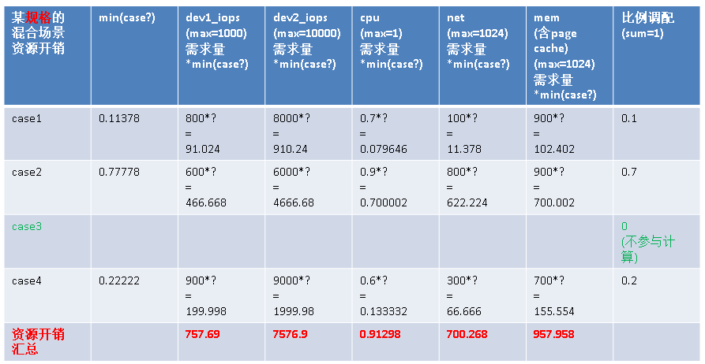
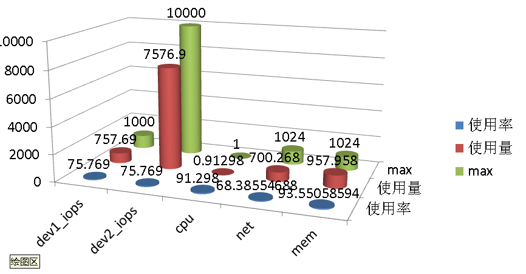

## PostgreSQL 混合场景benchmark计算方法  
                                                                                                                                                       
### 作者                                                                                                                                                       
digoal                                                                                                                                                       
                                                                                                                                                       
### 日期                                                                                                                                                       
2015-09-23                                                                                                                                                   
                                                                                                                                                       
### 标签                                                                                                                                                       
PostgreSQL , benchmark , 评估    
                                                                                                                                                       
----                                                                                                                                                       
                                                                                                                                                       
## 背景                                           
数据库性能基准测试的工具很多，标准基本都是参考TPC提供的模型在做的。  
  
TPC标准是Transaction Processing-Performance Council，事务处理性能委员会的缩写。  
  
该组织的主要功能是指定商用应用基准程序(Benchmark)的标准规范、性能和价格度量，并管理测试结果的发布。  
  
TPC的几种测试模型，覆盖了在线事务，大数据，决策支持，虚拟化等多种应用场景。  
  
  
  
TPC组织开放了一些测试基准的测试软件和数据，你可以在这里下载。  
  
http://www.tpc.org/information/current_specifications.asp  
  
但是它不一定支持所有的数据库，比如PostgreSQL就不被支持。  
  
虽然TPC可能不支持PG，但是市面上有很多支持PostgreSQL的测试工具，包括PostgreSQL自己提供的测试工具pgbench。  
  
我们可以使用TPC提供的各种模拟场景，对数据库进行基准测试，对于sysbench这个工具来说，就是需要我们自己写对应的lua脚本，生成测试数据。对于pgbench来说，也是如此。  
  
以BenchmarkSQL和TPC-C为例，介绍一下这个测试场景：  
  
BenchmarkSQL这个开源软件是基于TPC标准来生成数据库测试数据的。这里的TPC-C 会模拟一个批发商的货物管理环境。  
  
该批发公司有N个仓库，每个仓库供应10个地区，其中每个地区为3000 名顾客服务。  
  
在每个仓库中有10 个终端，每个终端用于一个地区。  
  
在运行的时候，10*N 个终端操作员会向公司的数据库发送5类请求。  
  
由于一个仓库中不可能存储公司中所有的货物，有一些请求必须发往其他的仓库，因此数据库在逻辑上是分布的。  
  
N 是一个可变的参数值，测试则可以将 N 作为传入参数。  
  
虽然TPC提供了很多测试场景，但是它并不能覆盖到所有的应用场景，有些用户可能是OLTP和OLAP混合使用的，而且比例不确定。还有些场景可能用到了数据库的某些特性，而TPC提供的模拟场景无法体现这种特性的测试。  
  
对于这种特殊应用场景，同样需要用户自己模拟应用场景，生成测试数据。使用sysbench的话要写lua脚本，使用pgbench的话需要自己写测试脚本。  
  
如果场景比较复杂，我们可能会将一个场景拆分成多个场景来做基准测试，再使用一种方法估算出混合场景的性能。  
  
例如，我们可以将测试场景单一化，使用固定的并发连接进行测试（建议2*COREs）：  
  
### 键值应用  
	查询，更新，插入  
  
### LBS类应用场景  
	压测PostGIS性能，距离计算，距离排序，点面查询  
  
### 异构数据需求  
	压测JSONB的插入性能，按KEY查询，更新性能  
  
### 范围数据场景  
	压测range类型的包含，不包含，位置查询性能  
  
### 中文分词  
	压测分词查询，插入，更新性能  
  
### JOIN  
	压测3到10个表的JOIN性能  
  
### 运算场景  
	压测窗口查询，聚合查询，分析函数的性能  
  
### 秒杀场景  
	压测更新单条记录的tps，突出advisory lock特性。  
  
每一单项测试CASE，应该包含的输出项：  
  
```  
TPS  
  
CPU   (700/800),   
  
DEV1_IOPS  (100/1000),   
DEV2_IOPS  (100/1000),   
......  
  
网卡1收   (100/1024), 网卡1发   (200/1024),   
网卡2收   (200/1024), 网卡2发   (300/1024),   
......  
  
MEM   (800/1024)  
  
(使用率/最大允许量)  
```  
  
其中网卡需要分设备，分收发，块设备需要分设备进行统计。  
  
这些统计项将被用于估算混合场景的性能。  
  
最终，我们在计算混合场景时，需要圈定几种test case，并指定每一个test case对应的ratio。  
  
通过之前test case的benchmark，计算出混合场景下的每一项test case的tps以及混合场景下总的cpu,iops,net,mem使用情况。  
  
### 算法  
首先要有标准，例如被测试主机对应的CPU,IOPS,NET,MEM的常数。  
  
计算混合场景中，某CASE在某个块设备上的抢占比例，1表示完全满足自己的需求。  
  
例如IOPS能力是1000，某CASE只需要10的IOPS，其他所有CASE的IOPS总需求只有500，那么这个CASE肯定能满足需求。  
  
（当然，这里并没有考虑内存命中率的问题，因为混合场景可能导致命中率下降，所以我们还需要计算内存抢占）  
  
计算方法，以IOPS为例：  
  
块设备1      IOPS能力 : DEV1_IOPS  
  
所有已勾选test case的块设备1           IOPS开销总和 : ALL_CASE_DEV1_IOPS  
  
除自己以外的所有已勾选test case的块设备1        IOPS开销总和 : ALL_CASE_EXCEPT_ME_DEV1_IOPS  
  
自己的块设备1         IOPS : ME_DEV1_IOPS  
  
自己的比例(用户评估的比例) : RATIO  
  
```  
dev1_iops_bottle =   
{  
if ALL_CASE_DEV1_IOPS <= DEV1_IOPS   
then   
  1  
else  
  if (DEV1_IOPS - ALL_CASE_EXCEPT_ME_DEV1_IOPS) >= 0   
  then  
    if (DEV1_IOPS - ALL_CASE_EXCEPT_ME_DEV1_IOPS + ALL_CASE_EXCEPT_ME_DEV1_IOPS*RATIO) >= ME_DEV1_IOPS  
    then   
      1  
    else  
      (DEV1_IOPS - ALL_CASE_EXCEPT_ME_DEV1_IOPS + ALL_CASE_EXCEPT_ME_DEV1_IOPS*RATIO) / ME_DEV1_IOPS  
    end if  
  else   
    if DEV1_IOPS*RATIO >= ME_DEV1_IOPS  
    then  
      1  
    else  
      (DEV1_IOPS*RATIO) / ME_DEV1_IOPS  
    end if  
  end if  
end if  
}  
```  
  
最终混合场景中，对应的每个CASE的tps=misc_tps$n， :   
  
```  
misc_tps1 = tps1 * min(dev1_iops_bottle, dev2_iops_bottle, ..., cpu_bottle , netxx_bottle, mem_bottle)  
misc_tps2 = tps2 * min(dev1_iops_bottle, dev2_iops_bottle, ..., cpu_bottle , netxx_bottle, mem_bottle)  
......  
```  
  
最终的资源开销cpu,iops,net,mem的计算方法，max_cpu指被测试机的CPU能力。  
  
```  
if   
  min(case1)*cpu1+min(case2)*cpu2+… > max_cpu   
then   
  max_cpu   
else   
  min(case1)*cpu1+min(case2)*cpu2+…   
……  
```  
  
例子：  
  
  
  
  
  
  
  
  
  
  
  
  
  
  
这种估算方法的准确性未得到验证，有兴趣的朋友可以验证一下。  
  
如果准确的话，可以大大简化用户评估已有硬件规格的数据库性能的工作。  
  
## 参考  
http://sourceforge.net/projects/hammerora  
  
http://hammerora.sourceforge.net/hammerdb_postgres_oltp.pdf  
  
http://sourceforge.net/projects/benchmarksql  
  
https://github.com/akopytov/sysbench  
  
http://www.tpc.org/default.asp  
  
<a rel="nofollow" href="http://info.flagcounter.com/h9V1"  ></a>  
  
  
  
  
  
  
## [digoal's 大量PostgreSQL文章入口](https://github.com/digoal/blog/blob/master/README.md "22709685feb7cab07d30f30387f0a9ae")
  
