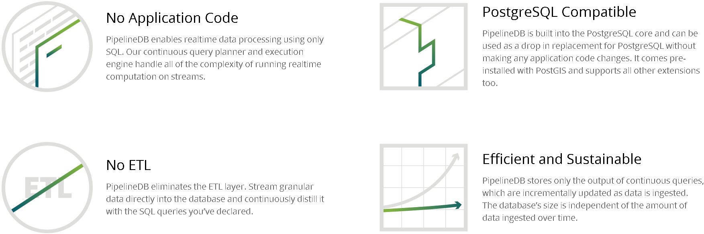
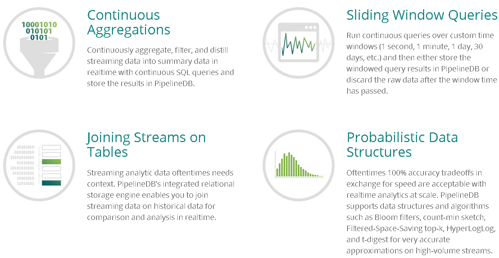

## 基于PostgreSQL的流式PipelineDB, 1000万/s实时统计不是梦      
                                                  
### 作者                                                 
digoal                                                  
                                                  
### 日期                                                
2015-10-15                                                   
                                                  
### 标签                                                
PostgreSQL , pipelinedb , jstorm , 流式处理 , 效率                                                                                         
                                                  
----                                                
                                                  
## 背景    
PipelineDB是基于PostgreSQL研发的一种流式关系数据库(0.8.1基于9.4.4)，这种数据库的特点是自动处理流式数据，不存储原始数据，只存储处理后的数据，所以非常适合当下流行的实时流式数据处理。    
  
例如网站流量统计，IT服务的监控统计，APPStore的浏览统计，物联网的传感器数据实时统计，物流订单的实时统计等等。  
  
      
    
      
    
## pipelineDB介绍  
http://www.postgresql.org/about/news/1596/    
    
```  
PipelineDB, an open-source relational streaming-SQL database, publicly released version (0.7.7) today and made the product available as open-source via their website and GitHub.   
  
PipelineDB is based on, and is wire compatible with, PostgreSQL 9.4 and has added functionality including continuous SQL queries, probabilistic data structures, sliding windowing, and stream-table joins.   
  
For a full description of PipelineDB and its capabilities see their technical documentation.  
  
PipelineDB’s fundamental abstraction is what is called a continuous view.   
  
These are much like regular SQL views, except that their defining SELECT queries can include streams as a source to read from.   
  
The most important property of continuous views is that they only store their output in the database.   
  
That output is then continuously updated incrementally as new data flows through streams, and raw stream data is discarded once all continuous views have read it.   
  
Let's look at a canonical example:  
  
CREATE CONTINUOUS VIEW v AS SELECT COUNT(*) FROM stream  
  
Only one row would ever physically exist in PipelineDB for this continuous view, and its value would simply be incremented for each new event ingested.  
  
For more information on PipelineDB as a company, product and for examples and benefits, please check out their first blog post on their new website.  
```  
    
## 流式统计例子  
创建动态流视图，不需要对表进行定义，太棒了，这类似活生生的NoSQL。  
  
```  
pipeline=# CREATE CONTINUOUS VIEW v0 AS SELECT COUNT(*) FROM stream;    
CREATE CONTINUOUS VIEW  
pipeline=# CREATE CONTINUOUS VIEW v1 AS SELECT COUNT(*) FROM stream;  
CREATE CONTINUOUS VIEW  
```  
  
激活流视图  
  
```  
pipeline=# ACTIVATE;  
ACTIVATE 2  
```  
  
往流写入数据  
  
```  
pipeline=# INSERT INTO stream (x) VALUES (1);  
INSERT 0 1  
pipeline=# SET stream_targets TO v0;  
SET  
pipeline=# INSERT INTO stream (x) VALUES (1);  
INSERT 0 1  
pipeline=# SET stream_targets TO DEFAULT;  
SET  
pipeline=# INSERT INTO stream (x) VALUES (1);  
INSERT 0 1  
```  
  
如果不想接收流数据了，停止即可  
  
```  
pipeline=# DEACTIVATE;  
DEACTIVATE 2  
```  
  
查询流视图  
  
```  
pipeline=# SELECT count FROM v0;  
 count  
-------  
     3  
(1 row)  
pipeline=# SELECT count FROM v1;  
 count  
-------  
     2  
(1 row)  
pipeline=#  
```  
  
## 如何部署  
安装  
  
```  
[root@digoal soft_bak]# rpm -ivh pipelinedb-0.8.1-centos6-x86_64.rpm   
Preparing...                ########################################### [100%]  
   1:pipelinedb             ########################################### [100%]  
/sbin/ldconfig: /opt/gcc4.9.3/lib/libstdc++.so.6.0.20-gdb.py is not an ELF file - it has the wrong magic bytes at the start.  
  
/sbin/ldconfig: /opt/gcc4.9.3/lib64/libstdc++.so.6.0.20-gdb.py is not an ELF file - it has the wrong magic bytes at the start.  
  
  
    ____  _            ___            ____  ____  
   / __ \(_)___  ___  / (_)___  ___  / __ \/ __ )  
  / /_/ / / __ \/ _ \/ / / __ \/ _ \/ / / / __  |  
 / ____/ / /_/ /  __/ / / / / /  __/ /_/ / /_/ /  
/_/   /_/ .___/\___/_/_/_/ /_/\___/_____/_____/  
       /_/  
  
PipelineDB successfully installed. To get started, initialize a  
database directory:  
  
pipeline-init -D <data directory>  
  
where <data directory> is a nonexistent directory where you'd  
like all of your database files to live.   
  
You can find the PipelineDB documentation at:  
  
http://docs.pipelinedb.com  
```  
  
配置  
  
```  
[root@digoal soft_bak]# cd /usr/lib/pipelinedb  
[root@digoal pipelinedb]# ll  
total 16  
drwxr-xr-x 2 root root 4096 Oct 15 10:47 bin  
drwxr-xr-x 5 root root 4096 Oct 15 10:47 include  
drwxr-xr-x 6 root root 4096 Oct 15 10:47 lib  
drwxr-xr-x 4 root root 4096 Oct 15 10:47 share  
  
[root@digoal pipelinedb]# useradd pdb  
[root@digoal pipelinedb]# vi /home/pdb/.bash_profile  
# add by digoal  
export PS1="$USER@`/bin/hostname -s`-> "  
export PGPORT=1953  
export PGDATA=/data01/pg_root_1953  
export LANG=en_US.utf8  
export PGHOME=/usr/lib/pipelinedb  
export LD_LIBRARY_PATH=$PGHOME/lib:/lib64:/usr/lib64:/usr/local/lib64:/lib:/usr/lib:/usr/local/lib:$LD_LIBRARY_PATH  
export DATE=`date +"%Y%m%d%H%M"`  
export PATH=$PGHOME/bin:$PATH:.  
export MANPATH=$PGHOME/share/man:$MANPATH  
export PGHOST=$PGDATA  
export PGDATABASE=pipeline  
export PGUSER=postgres  
alias rm='rm -i'  
alias ll='ls -lh'  
unalias vi  
  
[root@digoal pipelinedb]# mkdir /data01/pg_root_1953  
[root@digoal pipelinedb]# chown pdb:pdb /data01/pg_root_1953  
[root@digoal pipelinedb]# chmod 700 /data01/pg_root_1953  
  
[root@digoal pipelinedb]# su - pdb  
pdb@digoal-> which psql  
/usr/lib/pipelinedb/bin/psql  
```  
  
初始化数据库  
  
```  
pdb@digoal-> psql -V  
psql (PostgreSQL) 9.4.4  
  
pdb@digoal-> cd /usr/lib/pipelinedb/bin/  
pdb@digoal-> ll  
total 13M  
-rwxr-xr-x 1 root root  62K Sep 18 01:01 clusterdb  
-rwxr-xr-x 1 root root  62K Sep 18 01:01 createdb  
-rwxr-xr-x 1 root root  66K Sep 18 01:01 createlang  
-rwxr-xr-x 1 root root  63K Sep 18 01:01 createuser  
-rwxr-xr-x 1 root root  44K Sep 18 01:02 cs2cs  
-rwxr-xr-x 1 root root  58K Sep 18 01:01 dropdb  
-rwxr-xr-x 1 root root  66K Sep 18 01:01 droplang  
-rwxr-xr-x 1 root root  58K Sep 18 01:01 dropuser  
-rwxr-xr-x 1 root root 776K Sep 18 01:01 ecpg  
-rwxr-xr-x 1 root root  28K Sep 18 00:57 gdaladdo  
-rwxr-xr-x 1 root root  79K Sep 18 00:57 gdalbuildvrt  
-rwxr-xr-x 1 root root 1.3K Sep 18 00:57 gdal-config  
-rwxr-xr-x 1 root root  33K Sep 18 00:57 gdal_contour  
-rwxr-xr-x 1 root root 188K Sep 18 00:57 gdaldem  
-rwxr-xr-x 1 root root  74K Sep 18 00:57 gdalenhance  
-rwxr-xr-x 1 root root 131K Sep 18 00:57 gdal_grid  
-rwxr-xr-x 1 root root  83K Sep 18 00:57 gdalinfo  
-rwxr-xr-x 1 root root  90K Sep 18 00:57 gdallocationinfo  
-rwxr-xr-x 1 root root  42K Sep 18 00:57 gdalmanage  
-rwxr-xr-x 1 root root 236K Sep 18 00:57 gdal_rasterize  
-rwxr-xr-x 1 root root  25K Sep 18 00:57 gdalserver  
-rwxr-xr-x 1 root root  77K Sep 18 00:57 gdalsrsinfo  
-rwxr-xr-x 1 root root  49K Sep 18 00:57 gdaltindex  
-rwxr-xr-x 1 root root  33K Sep 18 00:57 gdaltransform  
-rwxr-xr-x 1 root root 158K Sep 18 00:57 gdal_translate  
-rwxr-xr-x 1 root root 168K Sep 18 00:57 gdalwarp  
-rwxr-xr-x 1 root root  41K Sep 18 01:02 geod  
-rwxr-xr-x 1 root root 1.3K Sep 18 00:51 geos-config  
lrwxrwxrwx 1 root root    4 Oct 15 10:47 invgeod -> geod  
lrwxrwxrwx 1 root root    4 Oct 15 10:47 invproj -> proj  
-rwxr-xr-x 1 root root  20K Sep 18 01:02 nad2bin  
-rwxr-xr-x 1 root root 186K Sep 18 00:57 nearblack  
-rwxr-xr-x 1 root root 374K Sep 18 00:57 ogr2ogr  
-rwxr-xr-x 1 root root  77K Sep 18 00:57 ogrinfo  
-rwxr-xr-x 1 root root 283K Sep 18 00:57 ogrlineref  
-rwxr-xr-x 1 root root  47K Sep 18 00:57 ogrtindex  
-rwxr-xr-x 1 root root  30K Sep 18 01:01 pg_config  
-rwxr-xr-x 1 root root  30K Sep 18 01:01 pg_controldata  
-rwxr-xr-x 1 root root  33K Sep 18 01:01 pg_isready  
-rwxr-xr-x 1 root root  39K Sep 18 01:01 pg_resetxlog  
-rwxr-xr-x 1 root root 183K Sep 18 01:02 pgsql2shp  
lrwxrwxrwx 1 root root    4 Oct 15 10:47 pipeline -> psql  
-rwxr-xr-x 1 root root  74K Sep 18 01:01 pipeline-basebackup  
lrwxrwxrwx 1 root root    9 Oct 15 10:47 pipeline-config -> pg_config  
-rwxr-xr-x 1 root root  44K Sep 18 01:01 pipeline-ctl  
-rwxr-xr-x 1 root root 355K Sep 18 01:01 pipeline-dump  
-rwxr-xr-x 1 root root  83K Sep 18 01:01 pipeline-dumpall  
-rwxr-xr-x 1 root root 105K Sep 18 01:01 pipeline-init  
-rwxr-xr-x 1 root root  50K Sep 18 01:01 pipeline-receivexlog  
-rwxr-xr-x 1 root root  56K Sep 18 01:01 pipeline-recvlogical  
-rwxr-xr-x 1 root root 153K Sep 18 01:01 pipeline-restore  
-rwxr-xr-x 1 root root 6.2M Sep 18 01:01 pipeline-server  
lrwxrwxrwx 1 root root   15 Oct 15 10:47 postmaster -> pipeline-server  
-rwxr-xr-x 1 root root  49K Sep 18 01:02 proj  
-rwxr-xr-x 1 root root 445K Sep 18 01:01 psql  
-rwxr-xr-x 1 root root 439K Sep 18 01:02 raster2pgsql  
-rwxr-xr-x 1 root root  62K Sep 18 01:01 reindexdb  
-rwxr-xr-x 1 root root 181K Sep 18 01:02 shp2pgsql  
-rwxr-xr-x 1 root root  27K Sep 18 00:57 testepsg  
-rwxr-xr-x 1 root root  63K Sep 18 01:01 vacuumdb  
  
pdb@digoal-> pipeline-init -D $PGDATA -U postgres -E UTF8 --locale=C -W  
pdb@digoal-> cd $PGDATA  
pdb@digoal-> ll  
total 108K  
drwx------ 5 pdb pdb 4.0K Oct 15 10:57 base  
drwx------ 2 pdb pdb 4.0K Oct 15 10:57 global  
drwx------ 2 pdb pdb 4.0K Oct 15 10:57 pg_clog  
drwx------ 2 pdb pdb 4.0K Oct 15 10:57 pg_dynshmem  
-rw------- 1 pdb pdb 4.4K Oct 15 10:57 pg_hba.conf  
-rw------- 1 pdb pdb 1.6K Oct 15 10:57 pg_ident.conf  
drwx------ 4 pdb pdb 4.0K Oct 15 10:57 pg_logical  
drwx------ 4 pdb pdb 4.0K Oct 15 10:57 pg_multixact  
drwx------ 2 pdb pdb 4.0K Oct 15 10:57 pg_notify  
drwx------ 2 pdb pdb 4.0K Oct 15 10:57 pg_replslot  
drwx------ 2 pdb pdb 4.0K Oct 15 10:57 pg_serial  
drwx------ 2 pdb pdb 4.0K Oct 15 10:57 pg_snapshots  
drwx------ 2 pdb pdb 4.0K Oct 15 10:57 pg_stat  
drwx------ 2 pdb pdb 4.0K Oct 15 10:57 pg_stat_tmp  
drwx------ 2 pdb pdb 4.0K Oct 15 10:57 pg_subtrans  
drwx------ 2 pdb pdb 4.0K Oct 15 10:57 pg_tblspc  
drwx------ 2 pdb pdb 4.0K Oct 15 10:57 pg_twophase  
-rw------- 1 pdb pdb    4 Oct 15 10:57 PG_VERSION  
drwx------ 3 pdb pdb 4.0K Oct 15 10:57 pg_xlog  
-rw------- 1 pdb pdb   88 Oct 15 10:57 pipelinedb.auto.conf  
-rw------- 1 pdb pdb  23K Oct 15 10:57 pipelinedb.conf  
```  
  
和流处理相关的参数，例如设置内存大小，是否同步，合并的batch，工作进程数等等。  
  
```  
pipelinedb.conf  
#------------------------------------------------------------------------------  
# CONTINUOUS VIEW OPTIONS  
#------------------------------------------------------------------------------  
  
# size of the buffer for storing unread stream tuples  
#tuple_buffer_blocks = 128MB  
  
# synchronization level for combiner commits; off, local, remote_write, or on  
#continuous_query_combiner_synchronous_commit = off  
  
# maximum amount of memory to use for combiner query executions  
#continuous_query_combiner_work_mem = 256MB  
  
# maximum memory to be used by the combiner for caching; this is independent  
# of combiner_work_mem  
#continuous_query_combiner_cache_mem = 32MB  
  
# the default fillfactor to use for continuous views  
#continuous_view_fillfactor = 50  
  
# the time in milliseconds a continuous query process will wait for a batch  
# to accumulate  
# continuous_query_max_wait = 10  
  
# the maximum number of events to accumulate before executing a continuous query  
# plan on them  
#continuous_query_batch_size = 10000  
  
# the number of parallel continuous query combiner processes to use for  
# each database  
#continuous_query_num_combiners = 2  
  
# the number of parallel continuous query worker processes to use for  
# each database  
#continuous_query_num_workers = 2  
  
# allow direct changes to be made to materialization tables?  
#continuous_query_materialization_table_updatable = off  
  
# inserts into streams should be synchronous?  
#synchronous_stream_insert = off  
  
# continuous views that should be affected when writing to streams.  
# it is string with comma separated values for continuous view names.  
#stream_targets = ''  
```  
  
启动数据库，可以看到原生是支持postgis的，吐个槽，这个项目是专门为NASA研发的么？  
  
```  
pdb@digoal-> pipeline-ctl start  
pdb@digoal-> psql pipeline postgres  
psql (9.4.4)  
Type "help" for help.  
  
pipeline=# \l  
                             List of databases  
   Name    |  Owner   | Encoding | Collate | Ctype |   Access privileges     
-----------+----------+----------+---------+-------+-----------------------  
 pipeline  | postgres | UTF8     | C       | C     |   
 template0 | postgres | UTF8     | C       | C     | =c/postgres          +  
           |          |          |         |       | postgres=CTc/postgres  
 template1 | postgres | UTF8     | C       | C     | =c/postgres          +  
           |          |          |         |       | postgres=CTc/postgres  
(3 rows)  
pipeline=# \dx  
                                          List of installed extensions  
       Name       | Version  |   Schema   |                             Description                               
------------------+----------+------------+---------------------------------------------------------------------  
 plpgsql          | 1.0      | pg_catalog | PL/pgSQL procedural language  
 postgis          | 2.2.0dev | pg_catalog | PostGIS geometry, geography, and raster spatial types and functions  
 postgis_topology | 2.2.0dev | topology   | PostGIS topology spatial types and functions  
(3 rows)  
```  
  
查看pipelinedb加了哪些函数，有些是插件形式加入的，如POSTGIS，有些是我们可以借鉴，直接拿来用的。  
  
```  
pipeline=# select proname from pg_proc order by oid desc;  
......  
 second  
 minute  
 hour  
 day  
 month  
 year  
......  
 cmsketch_empty  
 tdigest_add  
 tdigest_empty  
 tdigest_empty  
 bloom_add  
 bloom_empty  
 bloom_empty  
 hll_add  
 hll_empty  
 hll_empty  
......  
```  
  
## 在我自己的笔记本中的虚拟机中的性能测试
  
创建5个动态流视图，动态流视图就是不需要建立基表的流视图。  
  
```  
CREATE CONTINUOUS VIEW v0 AS SELECT COUNT(*) FROM stream;   
CREATE CONTINUOUS VIEW v1 AS SELECT sum(x::int),count(*),avg(y::int) FROM stream;   
CREATE CONTINUOUS VIEW v001 AS SELECT sum(x::int),count(*),avg(y::int) FROM stream1;  
CREATE CONTINUOUS VIEW v002 AS SELECT sum(x::int),count(*),avg(y::int) FROM stream2;   
CREATE CONTINUOUS VIEW v003 AS SELECT sum(x::int),count(*),avg(y::int) FROM stream3;  
```  
  
激活流统计  
  
```  
activate;  
```  
  
查看数据字典  
  
```  
select relname from pg_class where relkind='C';  
```  
  
批量插入测试  
  
```  
pdb@digoal-> vi test.sql  
insert into stream(x,y,z) select generate_series(1,1000),1,1;  
insert into stream1(x,y,z) select generate_series(1,1000),1,1;  
insert into stream2(x,y,z) select generate_series(1,1000),1,1;  
insert into stream3(x,y,z) select generate_series(1,1000),1,1;  
```  
  
测试结果，注意这里需要使用simple或者extended ， 如果用prepared会导致只有最后一条SQL起作用。现在不清楚是pipelinedb还是pgbench的BUG。  
  
```  
pdb@digoal-> /opt/pgsql/bin/pgbench -M extended -n -r -f ./test.sql -P 1 -c 10 -j 10 -T 100000  
progress: 1.0 s, 133.8 tps, lat 68.279 ms stddev 58.444  
progress: 2.0 s, 143.9 tps, lat 71.623 ms stddev 53.880  
progress: 3.0 s, 149.5 tps, lat 66.452 ms stddev 49.727  
progress: 4.0 s, 148.3 tps, lat 67.085 ms stddev 55.484  
progress: 5.1 s, 145.7 tps, lat 68.624 ms stddev 67.795  
```  
  
每秒入库约58万条记录，并完成5个流视图的统计。  
  
因为都在内存中完成，所以速度非常快。  
  
pipelinedb使用了worker进程来处理数据合并。  
  
压测时的top如下：  
  
```  
top - 11:23:07 up  2:49,  4 users,  load average: 1.83, 3.08, 1.78  
Tasks: 177 total,   5 running, 172 sleeping,   0 stopped,   0 zombie  
Cpu(s): 11.6%us, 15.0%sy, 10.3%ni, 63.0%id,  0.0%wa,  0.0%hi,  0.1%si,  0.0%st  
Mem:   3916744k total,   605084k used,  3311660k free,    27872k buffers  
Swap:  1048572k total,        0k used,  1048572k free,   401748k cached  
  
  PID USER      PR  NI  VIRT  RES  SHR S %CPU %MEM    TIME+  COMMAND                                               
11469 pdb       25   5  405m  75m  67m R 52.9  2.0   1:56.45 pipeline: bgworker: worker0 [pipeline]   
12246 pdb       20   0  400m  69m  67m S 14.3  1.8   0:10.55 pipeline: postgres pipeline [local] idle    
12243 pdb       20   0  400m  69m  67m S 13.3  1.8   0:10.45 pipeline: postgres pipeline [local] idle   
12248 pdb       20   0  400m  69m  67m S 13.3  1.8   0:10.40 pipeline: postgres pipeline [local] idle              
12244 pdb       20   0  400m  69m  67m S 12.6  1.8   0:10.50 pipeline: postgres pipeline [local] idle   
12237 pdb       20   0  400m  69m  67m R 12.3  1.8   0:10.52 pipeline: postgres pipeline [local] idle              
12247 pdb       20   0  402m  70m  67m R 12.3  1.8   0:10.70 pipeline: postgres pipeline [local] idle              
12245 pdb       20   0  401m  69m  67m S 12.0  1.8   0:10.78 pipeline: postgres pipeline [local] idle              
12235 pdb       20   0  400m  69m  67m S 11.3  1.8   0:10.88 pipeline: postgres pipeline [local] idle              
12239 pdb       20   0  400m  69m  67m S 11.0  1.8   0:10.79 pipeline: postgres pipeline [local] idle              
12241 pdb       20   0  400m  69m  67m S 11.0  1.8   0:10.53 pipeline: postgres pipeline [local] idle              
11466 pdb       20   0  119m 1480  908 R  5.3  0.0   0:58.39 pipeline: stats collector process                     
11468 pdb       25   5  401m  12m 9744 S  2.3  0.3   0:16.49 pipeline: bgworker: combiner0 [pipeline]              
12228 pdb       20   0  678m 3408  884 S  2.3  0.1   0:02.36 /opt/pgsql/bin/pgbench -M extended -n -r -f ./test.sql -P 1 -c 10 -j 10 -T 100000   
11464 pdb       20   0  398m  17m  16m S  1.7  0.4   0:10.47 pipeline: wal writer process                          
11459 pdb       20   0  398m 153m 153m S  0.0  4.0   0:00.37 /usr/lib/pipelinedb/bin/pipeline-server               
11460 pdb       20   0  115m  852  424 S  0.0  0.0   0:00.02 pipeline: logger process                              
11462 pdb       20   0  398m 3336 2816 S  0.0  0.1   0:00.06 pipeline: checkpointer process                        
11463 pdb       20   0  398m 2080 1604 S  0.0  0.1   0:00.08 pipeline: writer process                              
11465 pdb       20   0  401m 4460 1184 S  0.0  0.1   0:00.33 pipeline: autovacuum launcher process                 
11467 pdb       20   0  398m 1992 1056 S  0.0  0.1   0:00.00 pipeline: continuous query scheduler process  
  
pdb@digoal-> psql  
psql (9.4.4)  
Type "help" for help.  
pipeline=# select * from v0;  
  count    
---------  
 9732439  
(1 row)  
  
pipeline=# select * from v1;  
    sum     |  count  |          avg             
------------+---------+------------------------  
 4923514276 | 9837585 | 1.00000000000000000000  
(1 row)  
  
pipeline=# select * from v001;  
     sum      |  count   |          avg             
--------------+----------+------------------------  
 505023543131 | 11036501 | 1.00000000000000000000  
(1 row)  
  
pipeline=# select * from v002;  
      sum      |  count   |          avg             
---------------+----------+------------------------  
 1005065536319 | 12119513 | 1.00000000000000000000  
(1 row)  
  
pipeline=# select * from v003;  
     sum     |  count   |          avg             
-------------+----------+------------------------  
 14948355485 | 29867002 | 1.00000000000000000000  
(1 row)  
```  
  
在写入 10 亿 流数据后，数据库的大小依旧只有13MB，因为流数据都在内存中，处理完就丢弃了。  
  
```  
pipeline=# \l+  
                                                              List of databases  
   Name    |  Owner   | Encoding | Collate | Ctype |   Access privileges   | Size  | Tablespace |                Description                   
-----------+----------+----------+---------+-------+-----------------------+-------+------------+--------------------------------------------  
 pipeline  | postgres | UTF8     | C       | C     |                       | 13 MB | pg_default | default administrative connection database  
 template0 | postgres | UTF8     | C       | C     | =c/postgres          +| 12 MB | pg_default | unmodifiable empty database  
           |          |          |         |       | postgres=CTc/postgres |       |            |   
 template1 | postgres | UTF8     | C       | C     | =c/postgres          +| 12 MB | pg_default | default template for new databases  
           |          |          |         |       | postgres=CTc/postgres |       |            |   
(3 rows)  
```  
  
如果你的应用有类似场景，恭喜你，找到终极杀手锏了。  
  
  
## 补充物理机的测试数据  
E5-2650上的测试结果。  
  
开10个PipelineDB实例，跑以上CASE，每秒约处理600万记录。  
  
结合lvs,haproxy或者jdbc LB，你可以搞比较大型的实时处理了，当然这也说明了PipelineDB的单机性能还有非常多的提升空间。  
  
老版本不能充分利用CPU，新版本已经不需要开多个实例了，一个实例就可以跑满整个CPU。  
  
## 参考  
https://github.com/pipelinedb/pipelinedb  
  
https://www.pipelinedb.com/  
               
          
                         
  
<a rel="nofollow" href="http://info.flagcounter.com/h9V1"  ></a>  
  
  
  
  
  
  
## [digoal's 大量PostgreSQL文章入口](https://github.com/digoal/blog/blob/master/README.md "22709685feb7cab07d30f30387f0a9ae")
  
