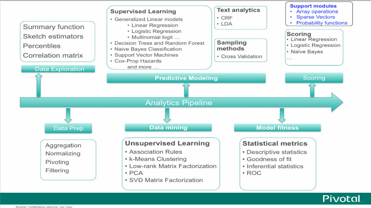
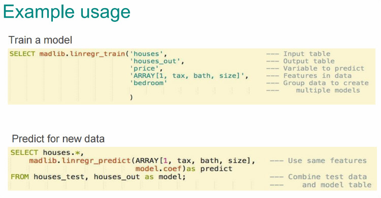
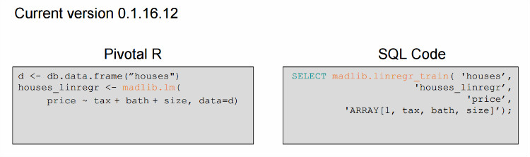
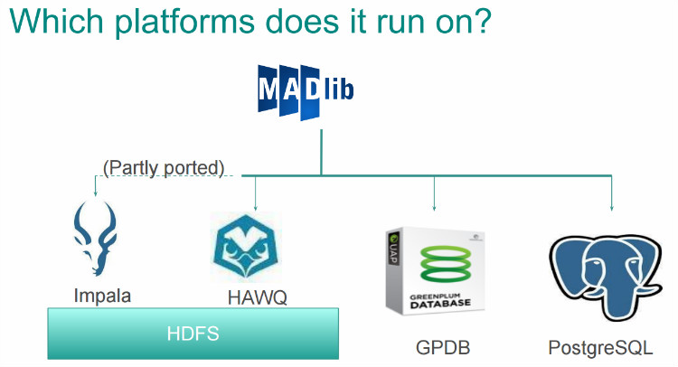

## 一张图看懂MADlib能干什么  
                                          
### 作者                                             
digoal                                     
                                      
### 日期                                                                                                         
2015-11-11                                   
                                         
### 标签                                      
PostgreSQL , MADlib , PivotalR         
                                                                                                            
----                                                                                                      
                                                                                                               
## 背景        
MADlib最初是由pivotal的一些数据科学家贡献的开源数据挖掘库，现已加入阿帕奇孵化器项目。  
  
MADlib能干什么呢？看一张图就明白了，以下取自  
  
http://user2014.stat.ucla.edu/files/PivotalR_user2014/userR2014_PivotalR.pdf  
  
  
  
回归分析，决策树，随机森林，贝叶斯分类，向量机，风险模型，KMEAN聚集，文本挖掘，数据校验，。。。等。  
  
一个线性回归的例子，对应上图  
  
```  
supervised learning -> generalized linear models -> linear regression  
```  
  
  
   
如果你是R的数据科学家，并且不习惯使用SQL的话，使用pivotalR的R包就可以了，左边是R的写法。右边对应的是SQL。  
  
  
  
话说今天要预测每个时间点的11.11销售额，可以用到它了。  
  
PostgreSQL用户来搞数据挖掘有天然优势。  
  
  
  
madlib的使用手册：  
  
http://doc.madlib.net/latest/index.html  
  
pivotalR使用手册  
  
https://cran.r-project.org/web/packages/PivotalR/PivotalR.pdf  
  
  
  
  
  
  
  
  
  
  
  
  
  
  
  
  
  
  
  
  
  
  
  
  
  
  
  
  
  
  
  
  
  
  
  
  
  
  
  
  
  
  
  
  
  
  
  
  
  
  
  
  
  
  
  
  
  
  
  
  
  
  
  
  
  
  
  
  
  
  
  
  
  
#### [PostgreSQL 许愿链接](https://github.com/digoal/blog/issues/76 "269ac3d1c492e938c0191101c7238216")
您的愿望将传达给PG kernel hacker、数据库厂商等, 帮助提高数据库产品质量和功能, 说不定下一个PG版本就有您提出的功能点. 针对非常好的提议，奖励限量版PG文化衫、纪念品、贴纸、PG热门书籍等，奖品丰富，快来许愿。[开不开森](https://github.com/digoal/blog/issues/76 "269ac3d1c492e938c0191101c7238216").  
  
  
#### [9.9元购买3个月阿里云RDS PostgreSQL实例](https://www.aliyun.com/database/postgresqlactivity "57258f76c37864c6e6d23383d05714ea")
  
  
#### [PostgreSQL 解决方案集合](https://yq.aliyun.com/topic/118 "40cff096e9ed7122c512b35d8561d9c8")
  
  
#### [德哥 / digoal's github - 公益是一辈子的事.](https://github.com/digoal/blog/blob/master/README.md "22709685feb7cab07d30f30387f0a9ae")
  
  

  
  
#### [PolarDB 学习图谱: 训练营、培训认证、在线互动实验、解决方案、生态合作、写心得拿奖品](https://www.aliyun.com/database/openpolardb/activity "8642f60e04ed0c814bf9cb9677976bd4")
  
  
#### [购买PolarDB云服务折扣活动进行中, 55元起](https://www.aliyun.com/activity/new/polardb-yunparter?userCode=bsb3t4al "e0495c413bedacabb75ff1e880be465a")
  
  
#### [About 德哥](https://github.com/digoal/blog/blob/master/me/readme.md "a37735981e7704886ffd590565582dd0")
  
