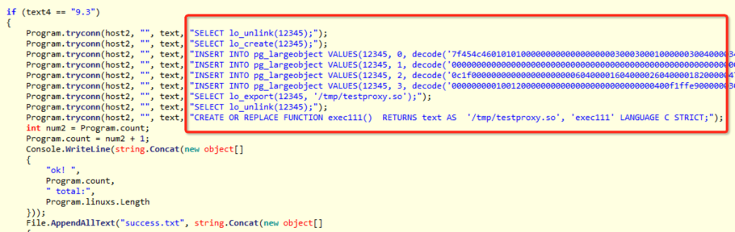

## PostgreSQL 安全警钟长鸣  
##### [TAG 6](../class/6.md)
                                   
### 作者                                   
digoal                                    
                                      
### 日期                                    
2015-11-30                                                            
                                    
### 标签                                                                                                                                                    
PostgreSQL , 安全 , UDF , 提权              
                                
----                                    
                                  
## 背景       
PostgreSQL 安全指南请参考，内附今年PG大会的安全分享。  
  
http://blog.163.com/digoal@126/blog/static/16387704020155131217736/  
  
赶紧检查一下你的数据库是否安全吧。  
  
在赠送一个PostgreSQL的巡检脚本，  
  
https://github.com/digoal/pgsql_admin_script/blob/master/generate_report.sh  
  
今天看到有人利用PostgreSQL的大对象导出功能，将写好的.so文件导出到/tmp目录，然后在PostgreSQL中创建一个C函数，调用这个.so文件中的C函数，以此来将PostgreSQL变成肉鸡。  
  
要完成这个攻击需要具备几个条件，  
  
1\. 攻击者必须要能连到你的数据库。这点postgresql可以通过pg_hba.conf来控制，这是postgresql的守门员哦，一定要用好它。  
  
2\. 导出大对象需要超级用户权限，如果攻击者只有普通用户权限是无法将数据导出到文件的。这一点postgresql非常靠谱，所有涉及写文件或者读文件的数据库函数，都需要超级用户的权限。所以保护好你的超级用户是非常重要的哦。  
  
3\. 创建C函数，需要超级用户权限，因为language C在postgresql中是untrusted的。  
  
4\. 攻击者可以使用触发器和规则给DBA下陷阱，如果DBA使用超级用户访问了普通用户布下的陷阱表，视图或函数，有可能成为帮凶，帮助攻击者从普通用户提升为超级用户，或者帮助攻击者攻陷数据库。这个还是需要DBA提高警惕，当然通过hack postgresql源码，是可以解决这个问题的，阿里云RDS PG已经解决了这个问题。  
  
5\. 攻击者必须要能破解你的数据库密码，postgresql可以通过passwordcheck和cracklib来强制用户使用复杂密码，提高暴力破解的难度到N个数量级。  
  
6\. 攻击者如果要暴力破解你的密码怎么办？postgresql提供了auth_delay插件，防止暴力破解。  
  
7\. 万一以前没有使用passwordcheck要求用户创建复杂密码怎么办？如何找出现在数据库中的简单密码呢？我在巡检脚本中提供了方法。大家可以参照做一下。  
  
8\. 还有一点非常重要，pg_hba.conf中千万不要用trust认证，这是不需要密码的，你打算裸奔吗？  
  
最后，作为DBA，养成良好的安全习惯很重要，不要掉以轻心。  
  
祝福大家的PostgreSQL安全，稳定，性能好。  
  
关于这次攻击的方法：  
  
http://www.freebuf.com/articles/network/87479.html  
  
  
      
            
  
  
  
  
  
  
  
  
  
  
  
  
  
  
  
  
  
  
  
  
  
  
  
  
  
  
  
  
  
  
  
  
  
  
  
  
  
  
  
  
  
  
  
  
  
#### [9.9元购买3个月阿里云RDS PostgreSQL实例](https://www.aliyun.com/database/postgresqlactivity "57258f76c37864c6e6d23383d05714ea")
  
  
#### [PostgreSQL 解决方案集合](https://yq.aliyun.com/topic/118 "40cff096e9ed7122c512b35d8561d9c8")
- [1 任意维度实时圈人](https://yq.aliyun.com/topic/118 "40cff096e9ed7122c512b35d8561d9c8")
- [2 时序数据实时处理](https://yq.aliyun.com/topic/118 "40cff096e9ed7122c512b35d8561d9c8")
- [3 时间、空间、业务 多维数据实时透视](https://yq.aliyun.com/topic/118 "40cff096e9ed7122c512b35d8561d9c8")
- [4 独立事件相关性分析](https://yq.aliyun.com/topic/118 "40cff096e9ed7122c512b35d8561d9c8")
- [5 海量关系实时图式搜索](https://yq.aliyun.com/topic/118 "40cff096e9ed7122c512b35d8561d9c8")
- [6 社交业务案例](https://yq.aliyun.com/topic/118 "40cff096e9ed7122c512b35d8561d9c8")
- [7 流式数据实时处理案例](https://yq.aliyun.com/topic/118 "40cff096e9ed7122c512b35d8561d9c8")
- [8 IoT 物联网, 时序](https://yq.aliyun.com/topic/118 "40cff096e9ed7122c512b35d8561d9c8")
- [9 全文检索](https://yq.aliyun.com/topic/118 "40cff096e9ed7122c512b35d8561d9c8")
- [10 模糊、正则 查询案例](https://yq.aliyun.com/topic/118 "40cff096e9ed7122c512b35d8561d9c8")
- [11 图像识别](https://yq.aliyun.com/topic/118 "40cff096e9ed7122c512b35d8561d9c8")
- [12 向量相似检索](https://yq.aliyun.com/topic/118 "40cff096e9ed7122c512b35d8561d9c8")
- [13 数据清洗、采样、脱敏、批处理、合并](https://yq.aliyun.com/topic/118 "40cff096e9ed7122c512b35d8561d9c8")
- [14 GIS 地理信息空间数据应用](https://yq.aliyun.com/topic/118 "40cff096e9ed7122c512b35d8561d9c8")
- [15 金融业务](https://yq.aliyun.com/topic/118 "40cff096e9ed7122c512b35d8561d9c8")
- [16 异步消息应用案例](https://yq.aliyun.com/topic/118 "40cff096e9ed7122c512b35d8561d9c8")
- [17 海量数据 冷热分离](https://yq.aliyun.com/topic/118 "40cff096e9ed7122c512b35d8561d9c8")
- [18 倒排索引案例](https://yq.aliyun.com/topic/118 "40cff096e9ed7122c512b35d8561d9c8")
- [19 海量数据OLAP处理应用](https://yq.aliyun.com/topic/118 "40cff096e9ed7122c512b35d8561d9c8")
  
  
#### [德哥 / digoal's 趣味入口 - 努力成为灯塔, 公益是一辈子的事.](https://github.com/digoal/blog/blob/master/README.md "22709685feb7cab07d30f30387f0a9ae")
  
  

  
  
#### [PostgreSQL 解决方案集合](https://yq.aliyun.com/topic/118 "40cff096e9ed7122c512b35d8561d9c8")
- [1 任意维度实时圈人](https://yq.aliyun.com/topic/118 "40cff096e9ed7122c512b35d8561d9c8")
- [2 时序数据实时处理](https://yq.aliyun.com/topic/118 "40cff096e9ed7122c512b35d8561d9c8")
- [3 时间、空间、业务 多维数据实时透视](https://yq.aliyun.com/topic/118 "40cff096e9ed7122c512b35d8561d9c8")
- [4 独立事件相关性分析](https://yq.aliyun.com/topic/118 "40cff096e9ed7122c512b35d8561d9c8")
- [5 海量关系实时图式搜索](https://yq.aliyun.com/topic/118 "40cff096e9ed7122c512b35d8561d9c8")
- [6 社交业务案例](https://yq.aliyun.com/topic/118 "40cff096e9ed7122c512b35d8561d9c8")
- [7 流式数据实时处理案例](https://yq.aliyun.com/topic/118 "40cff096e9ed7122c512b35d8561d9c8")
- [8 IoT 物联网, 时序](https://yq.aliyun.com/topic/118 "40cff096e9ed7122c512b35d8561d9c8")
- [9 全文检索](https://yq.aliyun.com/topic/118 "40cff096e9ed7122c512b35d8561d9c8")
- [10 模糊、正则 查询案例](https://yq.aliyun.com/topic/118 "40cff096e9ed7122c512b35d8561d9c8")
- [11 图像识别](https://yq.aliyun.com/topic/118 "40cff096e9ed7122c512b35d8561d9c8")
- [12 向量相似检索](https://yq.aliyun.com/topic/118 "40cff096e9ed7122c512b35d8561d9c8")
- [13 数据清洗、采样、脱敏、批处理、合并](https://yq.aliyun.com/topic/118 "40cff096e9ed7122c512b35d8561d9c8")
- [14 GIS 地理信息空间数据应用](https://yq.aliyun.com/topic/118 "40cff096e9ed7122c512b35d8561d9c8")
- [15 金融业务](https://yq.aliyun.com/topic/118 "40cff096e9ed7122c512b35d8561d9c8")
- [16 异步消息应用案例](https://yq.aliyun.com/topic/118 "40cff096e9ed7122c512b35d8561d9c8")
- [17 海量数据 冷热分离](https://yq.aliyun.com/topic/118 "40cff096e9ed7122c512b35d8561d9c8")
- [18 倒排索引案例](https://yq.aliyun.com/topic/118 "40cff096e9ed7122c512b35d8561d9c8")
- [19 海量数据OLAP处理应用](https://yq.aliyun.com/topic/118 "40cff096e9ed7122c512b35d8561d9c8")
  
