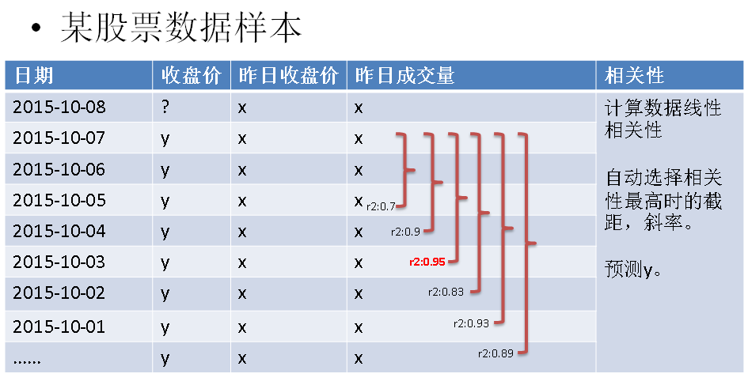

## PostgreSQL 多元线性回归 - 2 股票预测   
                                      
### 作者                                         
digoal                                 
                                  
### 日期                                                                                                     
2015-12-14                               
                                     
### 标签                                  
PostgreSQL , MADlib , 机器学习 , 多元回归            
                                                                                                        
----                                                                                                  
                                                                                                           
## 背景    
前面写了两篇关于股价预测的，都是用的一元回归，也就是说只用了1个自变量。  
  
例如用昨天的收盘价预测今天的收盘价，但是元素太单一的话，除非自变量的影响因素非常大，否则容易不准。  
  
所以就有了多元回归，例如，昨天的成交量，收盘价，开盘价三个数据预测下一天的收盘价。这就是三元回归。  
  
PostgreSQL可以通过MADlib库来实现多元回归。  
  
举例：  
  
p元线性回归公式  
  
```  
y1=b0+b1x11+b2x12+…+bpx1p+ε1  
y2=b0+b1x21+b2x22+…+bpx2p+ε2  
………………  
```  
  
1\. 求截距，斜率。  
  
2\. 预测yn  
  
```  
yn=b0+b1xn1+b2xn2+…+bpxnp+εn  
```  
  
R公式  
  
```  
lm(y: 收盘价 ~ x1: 昨日收盘价 + x2: 昨日成交量, $DATA)  
```  
  
  
  
用法举例：  
  
http://doc.madlib.net/latest/group__grp__linreg.html  
  
```  
Create an input data set.  
CREATE TABLE houses (id INT, tax INT, bedroom INT, bath FLOAT, price INT,  
            size INT, lot INT);  
COPY houses FROM STDIN WITH DELIMITER '|';  
  1 |  590 |       2 |    1 |  50000 |  770 | 22100  
  2 | 1050 |       3 |    2 |  85000 | 1410 | 12000  
  3 |   20 |       3 |    1 |  22500 | 1060 |  3500  
  4 |  870 |       2 |    2 |  90000 | 1300 | 17500  
  5 | 1320 |       3 |    2 | 133000 | 1500 | 30000  
  6 | 1350 |       2 |    1 |  90500 |  820 | 25700  
  7 | 2790 |       3 |  2.5 | 260000 | 2130 | 25000  
  8 |  680 |       2 |    1 | 142500 | 1170 | 22000  
  9 | 1840 |       3 |    2 | 160000 | 1500 | 19000  
 10 | 3680 |       4 |    2 | 240000 | 2790 | 20000  
 11 | 1660 |       3 |    1 |  87000 | 1030 | 17500  
 12 | 1620 |       3 |    2 | 118600 | 1250 | 20000  
 13 | 3100 |       3 |    2 | 140000 | 1760 | 38000  
 14 | 2070 |       2 |    3 | 148000 | 1550 | 14000  
 15 |  650 |       3 |  1.5 |  65000 | 1450 | 12000  
\.  
```  
  
预测模型  
  
```  
linregr_train( source_table,  
               out_table,  
               dependent_varname,  
               independent_varname,  
               grouping_cols,  -- 可选  
               heteroskedasticity_option  -- 可选  
             )  
  
Train a regression model. First, a single regression for all the data.  
```  
  
houses中包含了历史数据，有自变量，有因变量。  
  
其中price是因变量，tax, bath, size是自变量。即三元回归。  
  
houses_linregr存放线性回归的统计值。包括相关性，R2，标准差，P值等。  
  
```  
SELECT madlib.linregr_train( 'houses',  
                             'houses_linregr',  
                             'price',  
                             'ARRAY[1, tax, bath, size]'  
                           );  
```  
  
当需要根据来源数据分组预测时，你可以加入分组字段。  
  
```  
Generate three output models, one for each value of "bedroom".  
  
SELECT madlib.linregr_train( 'houses',  
                             'houses_linregr_bedroom',  
                             'price',  
                             'ARRAY[1, tax, bath, size]',  
                             'bedroom'  
                           );  
  
Examine the resulting models.  
  
-- Set extended display on for easier reading of output  
  
\x ON  
  
SELECT * FROM houses_linregr;  
Result:  
-[ RECORD 1 ]+---------------------------------------------------------------------------  
coef         | {-12849.4168959872,28.9613922651765,10181.6290712648,50.516894915354}  
r2           | 0.768577580597443  
std_err      | {33453.0344331391,15.8992104963997,19437.7710925923,32.928023174087}  
t_stats      | {-0.38410317968819,1.82156166004184,0.523806408809133,1.53416118083605}  
p_values     | {0.708223134615422,0.0958005827189772,0.610804093526536,0.153235085548186}  
condition_no | 9002.50457085737  
```  
  
这个r2只有0.76，相关性不太好，所以依旧需要用我之前提到的方法来获得好的相关性，即动态数据段计算。  
  
```  
View the results grouped by bedroom.  
SELECT * FROM houses_linregr_bedroom;  
Result:  
-[ RECORD 1 ]+--------------------------------------------------------------------------  
bedroom      | 2  
coef         | {-84242.0345406597,55.4430144648696,-78966.9753675319,225.611910021192}  
r2           | 0.968809546465313  
std_err      | {35018.9991665742,19.5731125320686,23036.8071292552,49.0448678148784}  
t_stats      | {-2.40560942761235,2.83261103077151,-3.42786111480046,4.60011251070697}  
p_values     | {0.250804617665239,0.21605133377602,0.180704400437373,0.136272031474122}  
condition_no | 10086.1048721726  
-[ RECORD 2 ]+--------------------------------------------------------------------------  
bedroom      | 4  
coef         | {0.0112536020318378,41.4132554771633,0.0225072040636757,31.3975496688276}  
r2           | 1  
std_err      | {0,0,0,0}  
t_stats      | {Infinity,Infinity,Infinity,Infinity}  
p_values     |  
condition_no | Infinity  
-[ RECORD 3 ]+--------------------------------------------------------------------------  
bedroom      | 3  
coef         | {-88155.8292501601,27.1966436294429,41404.0293363612,62.637521075324}  
r2           | 0.841699901311252  
std_err      | {57867.9999702625,17.8272309154689,43643.1321511114,70.8506824863954}  
t_stats      | {-1.52339512849005,1.52556747362508,0.948695185143966,0.884077878676067}  
p_values     | {0.188161432894871,0.187636685729869,0.386340032374927,0.417132778705789}  
condition_no | 11722.6225642147  
  
Alternatively you can unnest the results for easier reading of output.  
\x OFF  
SELECT unnest(ARRAY['intercept','tax','bath','size']) as attribute,  
       unnest(coef) as coefficient,  
       unnest(std_err) as standard_error,  
       unnest(t_stats) as t_stat,  
       unnest(p_values) as pvalue  
FROM houses_linregr;  
Use the prediction function to evaluate residuals.  
SELECT houses.*,  
       madlib.linregr_predict( ARRAY[1,tax,bath,size],  
                               m.coef  
                             ) as predict,  
        price -  
          madlib.linregr_predict( ARRAY[1,tax,bath,size],  
                                  m.coef  
                                ) as residual  
FROM houses, houses_linregr m;  
```  
  
在获得了好的R2之后，就可以拿这组数据预测下一组数据了。  
  
  
<a rel="nofollow" href="http://info.flagcounter.com/h9V1"  ></a>  
  
  
  
  
  
  
## [digoal's 大量PostgreSQL文章入口](https://github.com/digoal/blog/blob/master/README.md "22709685feb7cab07d30f30387f0a9ae")
  
