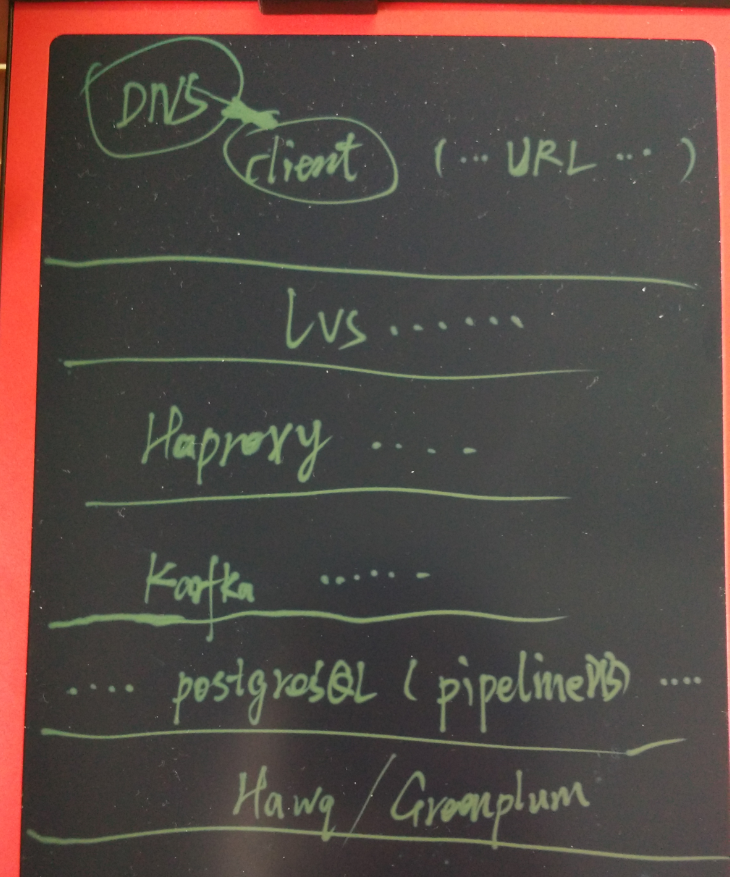

## "物联网"流式处理应用 - 用PostgreSQL实时处理(万亿每天)        
                                                    
### 作者                                                   
digoal                                                    
                                                    
### 日期                                                  
2015-12-15                                                     
                                                    
### 标签                                                  
PostgreSQL , pipelinedb , jstorm , 流式处理 , 效率                                                                                           
                                                    
----                                                  
                                                    
## 背景      
物联网的一个特点是万物联网，会产生大量的数据。    
  
### 药品监督    
一盒药，从生产，到运输，到药店，到售卖。每流经一个节点，都会记录它的信息。    
  
### 个人健康、基础设施监测  
健康手环，儿童防丢手表，一些动物迁徙研究的传感器（如中华鲟），水纹监测，电网监测，煤气管道监测，气象监测等等这些信息。    
  
### 金融数据实时监测  
股价的实时预测。    
  
### 车联网  
车流实时数据统计，车辆轨迹实时合并。    
    
例如货车车队的车辆实时的轨迹监测和告警，停顿实时告警，车辆轨迹偏移实时告警，车辆的行车码表与实际里程偏离实时告警。    
  
### 智慧综合商场  
商场人流实时统计。    
  
### IT基础设施监测  
数据监控实时处理，例如数据库的监控，服务器的监控，操作系统的监控等。    
  
传感器种类繁多，采集的数据量已经达到了海量。    
  
这些数据比电商双十一的量有过之而不及，怎样才能处理好这些数据呢？如何做到实时的流式数据处理？    
    
PostgreSQL提供了一个很好的基于流的数据处理产品，实时计算能力达到了单机10W记录/s（普通X86服务器）。    
  
## 流式处理应用CASE  
### 安装pipelinedb  
下载并安装pipelineDB，它是基于PostgreSQL改进的流式数据处理数据库。    
  
```  
# wget https://s3-us-west-2.amazonaws.com/download.pipelinedb.com/pipelinedb-0.8.5-centos6-x86_64.rpm    
#rpm -ivh pipelinedb-0.8.5-centos6-x86_64.rpm  --prefix=/home/digoal/pipelinedb    
```  
  
配置环境变量脚本    
  
```  
$vi env_pipe.sh     
    
export PS1="$USER@`/bin/hostname -s`-> "    
export PGPORT=1922    
export PGDATA=/disk1/digoal/pipe/pg_root    
export LANG=en_US.utf8    
export PGHOME=/home/digoal/pipelinedb    
export LD_LIBRARY_PATH=/home/digoal/scws/lib:$PGHOME/lib:/lib64:/usr/lib64:/usr/local/lib64:/lib:/usr/lib:/usr/local/lib:$LD_LIBRARY_PATH    
export DATE=`date +"%Y%m%d%H%M"`    
export PATH=/home/digoal/scws/bin:$PGHOME/bin:$PATH:.    
export MANPATH=$PGHOME/share/man:$MANPATH    
export PGHOST=$PGDATA    
export PGUSER=postgres    
export PGDATABASE=pipeline    
alias rm='rm -i'    
alias ll='ls -lh'    
unalias vi    
    
$ . ./env_pipe.sh    
```  
  
初始化数据库    
  
```  
$ pipeline-init -D $PGDATA -U postgres -E UTF8 --locale=C -W    
```  
  
配置参数    
  
```  
$ cd $PGDATA    
$ vi pipelinedb.conf    
listen_addresses = '0.0.0.0'            # what IP address(es) to listen on;    
port = 1922                            # (change requires restart)    
max_connections = 200                   # (change requires restart)    
unix_socket_directories = '.'   # comma-separated list of directories    
shared_buffers = 8GB                    # min 128kB    
maintenance_work_mem = 640MB            # min 1MB    
dynamic_shared_memory_type = posix      # the default is the first option    
synchronous_commit = off                # synchronization level;    
wal_buffers = 16MB                      # min 32kB, -1 sets based on shared_buffers    
wal_writer_delay = 10ms         # 1-10000 milliseconds    
checkpoint_segments = 400               # in logfile segments, min 1, 16MB each    
log_destination = 'csvlog'              # Valid values are combinations of    
logging_collector = on          # Enable capturing of stderr and csvlog    
log_timezone = 'PRC'    
datestyle = 'iso, mdy'    
timezone = 'PRC'    
lc_messages = 'C'                       # locale for system error message    
lc_monetary = 'C'                       # locale for monetary formatting    
lc_numeric = 'C'                        # locale for number formatting    
lc_time = 'C'                           # locale for time formatting    
default_text_search_config = 'pg_catalog.english'    
continuous_query_combiner_work_mem = 1GB    
continuous_query_batch_size = 100000    
continuous_query_num_combiners = 8    
continuous_query_num_workers = 4    
continuous_queries_enabled = on    
```  
  
启动数据库   
  
```  
$ pipeline-ctl start    
```  
  
### 应用场景  
1\. 场景1，假设传感器会上传3个数据，分别是传感器ID，时间，以及采样值。    
  
gid, crt_time, val    
  
应用需要实时统计每分钟，每小时，每天，每个传感器上传的值的最大，最小，平均值，以及 count。    
  
创建三个流视图，每个代表一个统计维度。    
  
如下：    
  
创建流（从表里消费数据）    
  
```  
pipeline=# CREATE CONTINUOUS VIEW sv01  AS SELECT gid::int,date_trunc('min',crt_time::timestamp),max(val::int),min(val),avg(val),count(val) FROM stream01 group by gid,date_trunc('min',crt_time);     
    
pipeline=# CREATE CONTINUOUS VIEW sv02  AS SELECT gid::int,date_trunc('hour',crt_time::timestamp),max(val::int),min(val),avg(val),count(val) FROM stream01 group by gid,date_trunc('hour',crt_time);     
    
pipeline=# CREATE CONTINUOUS VIEW sv03  AS SELECT gid::int,date_trunc('day',crt_time::timestamp),max(val::int),min(val),avg(val),count(val) FROM stream01 group by gid,date_trunc('day',crt_time);     
```  
  
激活流    
  
```  
pipeline=# activate;    
ACTIVATE    
```  
  
插入数据测试    
  
```  
pipeline=# insert into stream01(gid,val,crt_time) values (1,1,now());    
INSERT 0 1    
pipeline=# select * from sv01;    
 gid |     date_trunc      | max | min |          avg           | count     
-----+---------------------+-----+-----+------------------------+-------    
   1 | 2015-12-15 13:44:00 |   1 |   1 | 1.00000000000000000000 |     1    
(1 row)    
    
pipeline=# select * from sv02;    
 gid |     date_trunc      | max | min |          avg           | count     
-----+---------------------+-----+-----+------------------------+-------    
   1 | 2015-12-15 13:00:00 |   1 |   1 | 1.00000000000000000000 |     1    
(1 row)    
    
pipeline=# select * from sv03;    
 gid |     date_trunc      | max | min |          avg           | count     
-----+---------------------+-----+-----+------------------------+-------    
   1 | 2015-12-15 00:00:00 |   1 |   1 | 1.00000000000000000000 |     1    
(1 row)    
```  
  
压力测试：    
  
假设有10万个传感器，传感器上传的取值范围1到100。    
  
```  
$ vi test.sql    
\setrandom gid 1 100000    
\setrandom val 1 100    
insert into stream01(gid,val,crt_time) values (:gid,:val,now());    
    
./pgsql9.5/bin/pgbench -M prepared -n -r -f ./test.sql -P 5 -c 24 -j 24 -T 100    
progress: 5.0 s, 95949.9 tps, lat 0.247 ms stddev 0.575    
progress: 10.0 s, 98719.9 tps, lat 0.240 ms stddev 0.549    
progress: 15.0 s, 100207.8 tps, lat 0.237 ms stddev 0.573    
progress: 20.0 s, 101596.4 tps, lat 0.234 ms stddev 0.517    
progress: 25.0 s, 102830.4 tps, lat 0.231 ms stddev 0.492    
progress: 30.0 s, 103055.0 tps, lat 0.230 ms stddev 0.488    
progress: 35.0 s, 102786.0 tps, lat 0.231 ms stddev 0.482    
progress: 40.0 s, 99066.3 tps, lat 0.240 ms stddev 0.578    
progress: 45.0 s, 102912.5 tps, lat 0.231 ms stddev 0.494    
progress: 50.0 s, 100398.2 tps, lat 0.236 ms stddev 0.530    
progress: 55.0 s, 105719.8 tps, lat 0.224 ms stddev 0.425    
progress: 60.0 s, 99041.0 tps, lat 0.240 ms stddev 0.617    
progress: 65.0 s, 97087.0 tps, lat 0.245 ms stddev 0.619    
progress: 70.0 s, 95312.6 tps, lat 0.249 ms stddev 0.653    
progress: 75.0 s, 98768.3 tps, lat 0.240 ms stddev 0.593    
progress: 80.0 s, 106203.8 tps, lat 0.223 ms stddev 0.435    
progress: 85.0 s, 103423.1 tps, lat 0.229 ms stddev 0.480    
progress: 90.0 s, 106143.5 tps, lat 0.223 ms stddev 0.429    
progress: 95.0 s, 103514.5 tps, lat 0.229 ms stddev 0.478    
progress: 100.0 s, 100222.8 tps, lat 0.237 ms stddev 0.547    
transaction type: Custom query    
scaling factor: 1    
query mode: prepared    
number of clients: 24    
number of threads: 24    
duration: 100 s    
number of transactions actually processed: 10114821    
latency average: 0.235 ms    
latency stddev: 0.530 ms    
tps = 101089.580065 (including connections establishing)    
tps = 101101.483296 (excluding connections establishing)    
statement latencies in milliseconds:    
        0.003051        \setrandom gid 1 100000    
        0.000866        \setrandom val 1 100    
        0.230430        insert into stream01(gid,val,crt_time) values (:gid,:val,now());    
```  
  
每秒约处理10万记录，统计维度见上面的流SQL。    
    
多轮测试后    
  
```  
pipeline=# select sum(count) from sv03;    
   sum        
----------    
 53022588    
(1 row)    
    
pipeline=# select * from sv01 limit 10;    
  gid  |     date_trunc      | max | min |          avg           | count     
-------+---------------------+-----+-----+------------------------+-------    
     1 | 2015-12-15 13:44:00 |   1 |   1 | 1.00000000000000000000 |     1    
 53693 | 2015-12-15 13:47:00 |  68 |   1 |    28.0000000000000000 |     6    
   588 | 2015-12-15 13:47:00 |  88 |  11 |    47.6250000000000000 |     8    
 60154 | 2015-12-15 13:47:00 |  95 |   1 |    40.9090909090909091 |    11    
 38900 | 2015-12-15 13:47:00 |  90 |  17 |    57.2000000000000000 |     5    
 12784 | 2015-12-15 13:47:00 |  93 |  13 |    64.1250000000000000 |     8    
 79782 | 2015-12-15 13:47:00 |  60 |  16 |    43.1666666666666667 |     6    
  5122 | 2015-12-15 13:47:00 | 100 |   3 |    46.8333333333333333 |    12    
 97444 | 2015-12-15 13:47:00 |  98 |   9 |    59.5833333333333333 |    12    
 34209 | 2015-12-15 13:47:00 |  86 |  13 |    52.2857142857142857 |     7    
(10 rows)    
    
pipeline=# select * from sv02 limit 10;    
  gid  |     date_trunc      | max | min |         avg         | count     
-------+---------------------+-----+-----+---------------------+-------    
 91065 | 2015-12-15 14:00:00 | 100 |   0 | 51.4299065420560748 |   321    
 24081 | 2015-12-15 14:00:00 | 100 |   0 | 52.1649831649831650 |   297    
 29013 | 2015-12-15 14:00:00 | 100 |   0 | 50.9967213114754098 |   305    
 13134 | 2015-12-15 14:00:00 | 100 |   0 | 49.6968750000000000 |   320    
 84691 | 2015-12-15 14:00:00 | 100 |   0 | 49.5547445255474453 |   274    
 91059 | 2015-12-15 14:00:00 | 100 |   1 | 47.7536764705882353 |   272    
 50115 | 2015-12-15 14:00:00 | 100 |   1 | 49.4219269102990033 |   301    
 92610 | 2015-12-15 14:00:00 | 100 |   0 | 50.1197183098591549 |   284    
 36616 | 2015-12-15 14:00:00 | 100 |   1 | 48.8750000000000000 |   312    
 46390 | 2015-12-15 14:00:00 |  99 |   0 | 48.3246268656716418 |   268    
(10 rows)    
    
pipeline=# select * from sv03 limit 10;    
  gid  |     date_trunc      | max | min |         avg         | count     
-------+---------------------+-----+-----+---------------------+-------    
 68560 | 2015-12-15 00:00:00 | 100 |   0 | 51.2702702702702703 |   555    
 42241 | 2015-12-15 00:00:00 | 100 |   0 | 49.5266903914590747 |   562    
 64946 | 2015-12-15 00:00:00 | 100 |   0 | 48.2409177820267686 |   523    
  2451 | 2015-12-15 00:00:00 | 100 |   0 | 49.8153564899451554 |   547    
 11956 | 2015-12-15 00:00:00 | 100 |   0 | 51.2382739212007505 |   533    
 21578 | 2015-12-15 00:00:00 | 100 |   0 | 49.2959558823529412 |   544    
 36451 | 2015-12-15 00:00:00 | 100 |   0 | 51.1292035398230088 |   565    
 62380 | 2015-12-15 00:00:00 | 100 |   0 | 48.9099437148217636 |   533    
 51946 | 2015-12-15 00:00:00 | 100 |   0 | 51.0318091451292247 |   503    
 35084 | 2015-12-15 00:00:00 | 100 |   0 | 49.3613766730401530 |   523    
(10 rows)    
```  
    
2. 场景2，假设车辆运行过程中，每隔一段时间会上传位置信息，    
  
gid, crt_time, poi    
  
应用需要按天，绘制车辆的路径信息(把多个point聚合成路径类型，或者数组类型，或者字符串，。。。)。    
    
假设有1000万量车，每辆车每次上传一个坐标和时间信息，（或者是一批信息）。    
  
应用需求  
  
2\.1\. 按天绘制车辆的路径信息    
  
2\.2\. 按小时统计每个区域有多少量车经过    
    
创建流 (这里假设点信息已经经过了二进制编码，用一个INT8来表示，方便压力测试)    
  
```  
CREATE CONTINUOUS VIEW sv04  AS SELECT gid::int,date_trunc('day',crt_time::timestamp),array_agg(poi::int8||' -> '||crt_time) FROM stream02 group by gid,date_trunc('day',crt_time);    
```  
  
压力测试    
  
```  
$ vi test.sql    
\setrandom gid 1 10000000    
\setrandom poi 1 1000000000    
insert into stream02(gid,poi,crt_time) values (:gid,:poi,now());    
    
./pgsql9.5/bin/pgbench -M prepared -n -r -f ./test.sql -P 5 -c 24 -j 24 -T 100    
progress: 5.0 s, 106005.0 tps, lat 0.223 ms stddev 0.370    
progress: 10.0 s, 109884.8 tps, lat 0.216 ms stddev 0.347    
progress: 15.0 s, 111122.1 tps, lat 0.213 ms stddev 0.368    
progress: 20.0 s, 111987.0 tps, lat 0.212 ms stddev 0.353    
progress: 25.0 s, 111835.4 tps, lat 0.212 ms stddev 0.363    
progress: 30.0 s, 111759.7 tps, lat 0.212 ms stddev 0.366    
progress: 35.0 s, 112110.4 tps, lat 0.211 ms stddev 0.358    
progress: 40.0 s, 112185.4 tps, lat 0.211 ms stddev 0.352    
progress: 45.0 s, 113080.0 tps, lat 0.210 ms stddev 0.345    
progress: 50.0 s, 113205.4 tps, lat 0.209 ms stddev 0.353    
progress: 55.0 s, 113415.1 tps, lat 0.209 ms stddev 0.352    
progress: 60.0 s, 113519.8 tps, lat 0.209 ms stddev 0.342    
progress: 65.0 s, 112683.6 tps, lat 0.210 ms stddev 0.358    
progress: 70.0 s, 112748.3 tps, lat 0.210 ms stddev 0.360    
progress: 75.0 s, 112158.9 tps, lat 0.211 ms stddev 0.373    
progress: 80.0 s, 112580.8 tps, lat 0.210 ms stddev 0.355    
progress: 85.0 s, 111895.5 tps, lat 0.212 ms stddev 0.370    
progress: 90.0 s, 112229.2 tps, lat 0.211 ms stddev 0.442    
progress: 95.0 s, 104915.8 tps, lat 0.226 ms stddev 2.852    
progress: 100.0 s, 103079.9 tps, lat 0.230 ms stddev 2.054    
transaction type: Custom query    
scaling factor: 1    
query mode: prepared    
number of clients: 24    
number of threads: 24    
duration: 100 s    
number of transactions actually processed: 11112035    
latency average: 0.213 ms    
latency stddev: 0.836 ms    
tps = 111106.652772 (including connections establishing)    
tps = 111118.651135 (excluding connections establishing)    
statement latencies in milliseconds:    
        0.002939        \setrandom gid 1 10000000    
        0.000887        \setrandom poi 1 1000000000    
        0.209177        insert into stream02(gid,poi,crt_time) values (:gid,:poi,now());    
    
pipeline=# select * from sv04 limit 3;    
  448955 | 2015-12-15 00:00:00 | {"306029686 -> 2015-12-15 14:53:01.273121","885962518 -> 2015-12-15 14:53:03.352406"}    
 7271368 | 2015-12-15 00:00:00 | {"615447469 -> 2015-12-15 14:53:01.2616","944473391 -> 2015-12-15 14:53:04.543387"}    
 8613957 | 2015-12-15 00:00:00 | {"473349491 -> 2015-12-15 14:53:01.288332","125413709 -> 2015-12-15 14:53:08.742894"}    
```  
  
3\. 场景3，按交警探头为单位，统计每个探头采集的车辆信息。    
  
例如    
  
3\.1 以车辆为单位，统计车辆的探头位置信息，串成轨迹数据。    
  
3\.2 以探头为单位，统计每个路口的车流信息。（假设一个探头对应一个路口）    
    
第一个需求和前面的绘制车辆轨迹例子一样，统计路口流量信息则是以探头ID为单位进行统计。    
  
用法都差不多，不再举例    
    
4\. 场景4，实时股价预测。    
  
可以结合madlib或者plr进行多元回归，选择最好的R2，根据对应的截距和斜率推测下一组股价。    
  
需要用到UDF，具体的用法参考我以前写的文章。    
  
这里不再举例。    
    
5\. 场景5，商场WIFI传感器的信息实时统计。    
  
根据WIFI提供的位置信息，实时统计每个店铺的人流量。店铺的人均驻留时间，总计驻留时间。    
    
6\. 场景6，假设你的数据处理场景，PG现有的函数无法处理怎么办？没问题，PG提供了自定义UDF，数据类型，操作符，索引方法等一系列API。你可以根据业务的需求，在此基础上实现。    
    
用法还有很多，无法穷举。    
    
7\. 与Kafka结合的例子  
  
下面再结合一个当下非常流行的消息队列，pipelineDB可以实时的从消息队列取数据并进行实时计算。    
  
例子：    
  
在本地起一个nginx服务端，并且使用siege模拟HTTP请求，nginx将记录这些行为，存储为JSON格式到文件中。    
  
在本地起kafka服务端，使用kafkacat将nginx的访问日志不断的push到kafka。    
  
在pipelinedb中订阅kafka的消息，并实时处理为想要的统计信息，（WEB页面的访问人数，延迟，等信息）    
    
安装kafka    
  
```  
http://kafka.apache.org/07/quickstart.html    
    
# wget http://www.us.apache.org/dist/kafka/0.8.2.2/kafka_2.10-0.8.2.2.tgz    
# tar -zxvf kafka_2.10-0.8.2.2.tgz    
    
# git clone https://github.com/edenhill/librdkafka.git    
# cd librdkafka    
./configure    
make    
make install    
    
# git clone https://github.com/lloyd/yajl.git    
# cd yajl    
./configure    
make    
make install    
    
# vi /etc/ld.so.conf    
/usr/local/lib    
# ldconfig    
    
# git clone https://github.com/edenhill/kafkacat.git    
# cd kafkacat    
./configure    
make    
make install    
```  
  
安装siege和nginx    
  
```  
# yum install -y siege nginx    
```  
  
创建一个nginx配置文件，记录访问日志到/tmp/access.log，格式为json    
  
```  
cd /tmp    
    
cat <<EOF > nginx.conf    
worker_processes 4;    
pid $PWD/nginx.pid;    
events {}    
http {    
    
    log_format json     
    '{'    
        '"ts": "\$time_iso8601", '    
        '"user_agent": "\$http_user_agent", '    
        '"url": "\$request_uri", '    
        '"latency": "\$request_time",  '    
        '"user": "\$arg_user"'    
    '}';    
    
    access_log $PWD/access.log json;    
    error_log $PWD/error.log;    
    
    server {    
        location ~ ^/ {    
            return 200;    
        }    
    }    
}    
EOF    
```  
  
启动nginx    
  
```  
nginx -c $PWD/nginx.conf -p $PWD/    
```  
  
配置主机名    
  
```  
# hostname    
digoal.org    
# vi /etc/hosts    
127.0.0.1 digoal.org    
```  
  
启动kafka    
  
```  
cd /opt/soft_bak/kafka_2.10-0.8.2.2    
bin/zookeeper-server-start.sh config/zookeeper.properties &    
bin/kafka-server-start.sh config/server.properties &    
```  
  
产生一个随机URL文件    
  
```  
for x in {0..1000000}; do echo "http://localhost/page$((RANDOM % 100))/path$((RANDOM % 10))?user=$((RANDOM % 100000))" >> urls.txt; done    
```  
  
使用siege模拟访问这些URL，nginx会产生访问日志到/tmp/access.log    
  
```  
siege -c32 -b -d0 -f urls.txt >/dev/null 2>&1    
    
/tmp/access.log举例，格式为JSON    
{"ts": "2015-10-21T11:21:48+08:00", "user_agent": "Mozilla/5.0 (redhat-x86_64-linux-gnu) Siege/3.0.8", "url": "/page68/path7?user=18583", "latency": "0.002",  "user": "18583"}    
{"ts": "2015-10-21T11:21:48+08:00", "user_agent": "Mozilla/5.0 (redhat-x86_64-linux-gnu) Siege/3.0.8", "url": "/page78/path0?user=24827", "latency": "0.003",  "user": "24827"}    
{"ts": "2015-10-21T11:21:48+08:00", "user_agent": "Mozilla/5.0 (redhat-x86_64-linux-gnu) Siege/3.0.8", "url": "/page19/path6?user=3988", "latency": "0.003",  "user": "3988"}    
{"ts": "2015-10-21T11:21:48+08:00", "user_agent": "Mozilla/5.0 (redhat-x86_64-linux-gnu) Siege/3.0.8", "url": "/page55/path2?user=18433", "latency": "0.003",  "user": "18433"}    
{"ts": "2015-10-21T11:21:48+08:00", "user_agent": "Mozilla/5.0 (redhat-x86_64-linux-gnu) Siege/3.0.8", "url": "/page62/path3?user=10801", "latency": "0.001",  "user": "10801"}    
{"ts": "2015-10-21T11:21:48+08:00", "user_agent": "Mozilla/5.0 (redhat-x86_64-linux-gnu) Siege/3.0.8", "url": "/page9/path2?user=4915", "latency": "0.001",  "user": "4915"}    
{"ts": "2015-10-21T11:21:48+08:00", "user_agent": "Mozilla/5.0 (redhat-x86_64-linux-gnu) Siege/3.0.8", "url": "/page10/path2?user=5367", "latency": "0.001",  "user": "5367"}    
```  
  
将访问日志输出到kafkacat，推送到kafka消息系统，对应的topic为logs_topic。    
  
```  
( tail -f /tmp/access.log | kafkacat -b localhost:9092 -t logs_topic ) &    
```  
  
原始的消费方式如下：    
  
```  
# cd /opt/soft_bak/kafka_2.10-0.8.2.2    
# bin/kafka-console-consumer.sh --zookeeper localhost:2181 --topic logs_topic --from-beginning    
# Ctrl+C    
```  
  
接下来我们使用pipelinedb来实时消费这些消息，并转化为需要的统计结果。    
  
```  
CREATE EXTENSION pipeline_kafka;    
SELECT kafka_add_broker('localhost:9092');  -- 添加一个kafka broker(kafka集群的一个节点)    
CREATE STREAM logs_stream (payload json);  -- 创建一个流映射到，kafka消息系统。    
CREATE CONTINUOUS VIEW message_count AS SELECT COUNT(*) FROM logs_stream;   -- 创建一个流视图，实时消费，处理kafka消息。    
SELECT kafka_consume_begin('logs_topic', 'logs_stream');  -- 开始消费指定的topic，logs_topic，    
 kafka_consume_begin     
------------------    
 success    
(1 row)    
```  
  
查询流视图，可以获得当前NGINX的访问统计。    
  
```  
SELECT * FROM message_count;    
 count     
--------    
  24    
(1 row)    
    
SELECT * FROM message_count;    
 count    
--------    
  36    
 success    
(1 row)    
```  
  
接下来做一个更深入的实时分析，分析每个URL的访问次数，用户数，99%用户的访问延迟低于多少。    
  
```  
/*     
 * This function will strip away any query parameters from each url,    
 * as we're not interested in them.    
 */    
CREATE FUNCTION url(raw text, regex text DEFAULT '\?.*', replace text DEFAULT '')    
    RETURNS text    
AS 'textregexreplace_noopt'    -- textregexreplace_noopt@src/backend/utils/adt/regexp.c    
LANGUAGE internal;    
    
CREATE CONTINUOUS VIEW url_stats AS    
    SELECT    
        url, -- url地址    
    percentile_cont(0.99) WITHIN GROUP (ORDER BY latency_ms) AS p99,  -- 99%的URL访问延迟小于多少    
        count(DISTINCT user) AS uniques,  -- 唯一用户数    
    count(*) total_visits  -- 总共访问次数    
  FROM    
    (SELECT     
        url(payload->>'url'),  -- 地址    
        payload->>'user' AS user,  -- 用户ID    
        (payload->>'latency')::float * 1000 AS latency_ms,  -- 访问延迟    
        arrival_timestamp    
    FROM logs_stream) AS unpacked    
WHERE arrival_timestamp > clock_timestamp() - interval '1 day'    
 GROUP BY url;    
    
CREATE CONTINUOUS VIEW user_stats AS    
    SELECT    
        day(arrival_timestamp),    
        payload->>'user' AS user,    
        sum(CASE WHEN payload->>'url' LIKE '%landing_page%' THEN 1 ELSE 0 END) AS landings,    
        sum(CASE WHEN payload->>'url' LIKE '%conversion%' THEN 1 ELSE 0 END) AS conversions,    
        count(DISTINCT url(payload->>'url')) AS unique_urls,    
        count(*) AS total_visits    
    FROM logs_stream GROUP BY payload->>'user', day;    
    
-- What are the top-10 most visited urls?    
SELECT url, total_visits FROM url_stats ORDER BY total_visits DESC limit 10;    
      url      | total_visits     
---------------+--------------    
 /page62/path4 |        10182    
 /page51/path4 |        10181    
 /page24/path5 |        10180    
 /page93/path3 |        10180    
 /page81/path0 |        10180    
 /page2/path5  |        10180    
 /page75/path2 |        10179    
 /page28/path3 |        10179    
 /page40/path2 |        10178    
 /page74/path0 |        10176    
(10 rows)    
    
    
-- What is the 99th percentile latency across all urls?    
SELECT combine(p99) FROM url_stats;    
     combine          
------------------    
 6.95410494731137    
(1 row)    
    
-- What is the average conversion rate each day for the last month?    
SELECT day, avg(conversions / landings) FROM user_stats GROUP BY day;    
          day           |            avg                 
------------------------+----------------------------    
 2015-09-15 00:00:00-07 | 1.7455000000000000000000000    
(1 row)    
    
-- How many unique urls were visited each day for the last week?    
SELECT day, combine(unique_urls) FROM user_stats WHERE day > now() - interval '1 week' GROUP BY day;    
          day           | combine     
------------------------+---------    
 2015-09-15 00:00:00-07 |  100000    
(1 row)    
    
-- Is there a relationship between the number of unique urls visited and the highest conversion rates?    
SELECT unique_urls, sum(conversions) / sum(landings) AS conversion_rate FROM user_stats    
    GROUP BY unique_urls ORDER BY conversion_rate DESC LIMIT 10;    
 unique_urls |  conversion_rate      
-------------+-------------------    
          41 |  2.67121005785842    
          36 |  2.02713894173361    
          34 |  2.02034637010851    
          31 |  2.01958418072859    
          27 |  2.00045348712296    
          24 |  1.99714899522942    
          19 |  1.99438839453606    
          16 |  1.98083502184886    
          15 |  1.87983011139079    
          14 |  1.84906254929873    
(1 row)    
```  
  
使用PipelineDB + kafka，应用场景又更丰富了。    
    
## 如何构建更大的实时消息处理集群？    
规划好数据的分片规则（避免跨节点的统计），如果有跨节点访问需求，可以在每个节点使用维度表，来实现。   
  
例如每天要处理 万亿 条消息，怎么办？    
  
根据以上压力测试，平均每台机器每秒处理10万记录(每天处理86亿)，计算需要用到116台PostgreSQL。是不是很省心呢？    
  
一个图例：    
  
每一层都可以扩展    
  
从lvs到 haproxy到 kafka到 PostgreSQL到 离线分析HAWQ。    
    
    
                 
            
                           
  
<a rel="nofollow" href="http://info.flagcounter.com/h9V1"  ></a>  
  
  
  
  
  
  
## [digoal's 大量PostgreSQL文章入口](https://github.com/digoal/blog/blob/master/README.md "22709685feb7cab07d30f30387f0a9ae")
  
