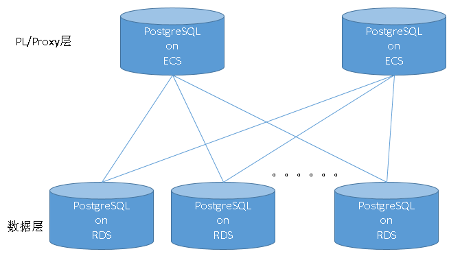
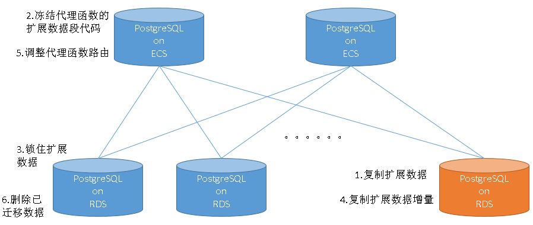
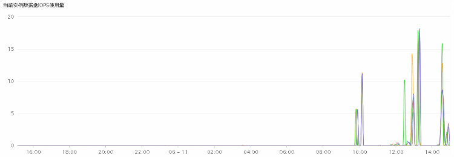
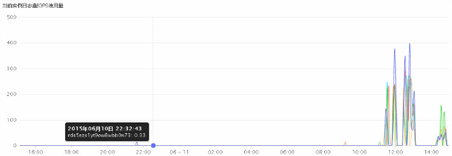
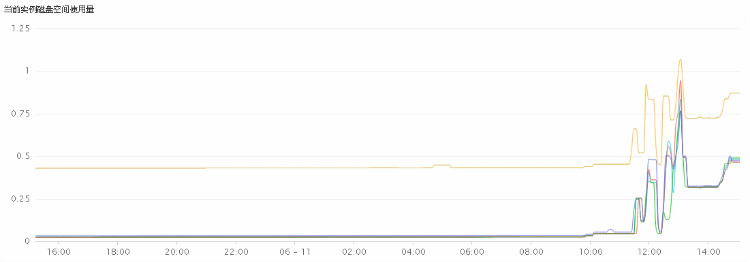

## 阿里云ApsaraDB RDS for PostgreSQL 最佳实践 - 2 教你RDS PG的水平分库(plproxy)  
##### [TAG 24](../class/24.md)
                            
### 作者                                                                         
digoal                       
                              
### 日期                         
2015-12-20                         
                          
### 标签                       
PostgreSQL , 阿里云RDS      
                            
----                      
                               
## 背景             
使用pl/proxy 做分布式处理的性能。  
  
  
大家可供参考，注意目前plproxy不支持跨库关联，仅仅是函数代理。  
  
如果要做跨库事务需要结合PostgreSQL的prepared transaction(分布式事务/2PC)来实现，  
  
如果要做跨库关联，可以用PostgreSQL的外部表，例如在每个节点上都建立其他节点需要关联的表的外部表，这样也可以做关联。  
  
plproxy支持run on all,any,NR,HASH四种方式。  
  
接下来我会一一测试 。   
  
  
  
   
  
  
部署ECS：  
  
安装PostgreSQL 9.4.3，略。  
  
安装plproxy，可参考  
  
http://blog.163.com/digoal@126/blog/static/1638770402013102242543765/  
  
http://git.postgresql.org/gitweb/?p=plproxy.git;a=summary  
  
```  
cd plproxy  
export PATH=/opt/pgsql/bin:$PATH  
gmake  
gmake install  
  
psql  
create extension plproxy;  
```  
  
在plproxy代理节点部署数据库密码文件：  
  
编辑密码文件，免输入密码。(主机名和密码以模糊化，一共有16台RDS)  
  
```  
# vi ~/.pgpass  
xxxx.pg.rds.aliyuncs.com:3433:*:digoal:xxxx  
xxxx.pg.rds.aliyuncs.com:3433:*:digoal:xxxx  
xxxx.pg.rds.aliyuncs.com:3433:*:digoal:xxxx  
xxxx.pg.rds.aliyuncs.com:3433:*:digoal:xxxx  
xxxx.pg.rds.aliyuncs.com:3433:*:digoal:xxxx  
xxxx.pg.rds.aliyuncs.com:3433:*:digoal:xxxx  
xxxx.pg.rds.aliyuncs.com:3433:*:digoal:xxxx  
xxxx.pg.rds.aliyuncs.com:3433:*:digoal:xxxx  
xxxx.pg.rds.aliyuncs.com:3433:*:digoal:xxxx  
xxxx.pg.rds.aliyuncs.com:3433:*:digoal:xxxx  
xxxx.pg.rds.aliyuncs.com:3433:*:renny:xxxx  
xxxx.pg.rds.aliyuncs.com:3433:*:postgres:xxxx  
xxxx.pg.rds.aliyuncs.com:3433:*:dbnosql:xxxx  
xxxx.pg.rds.aliyuncs.com:3433:*:dbuser:xxxx  
xxxx.pg.rds.aliyuncs.com:3433:*:dbuser:xxxx  
xxxx.pg.rds.aliyuncs.com:3433:*:dbuser:xxxx  
  
chmod 400 ~/.pgpass  
```  
  
创建server，用于部署plproxy前期管理远程数据库。  
  
```  
create extension dblink;  
  
CREATE SERVER p0 FOREIGN DATA WRAPPER dblink_fdw OPTIONS (host 'xxxx1.pg.rds.aliyuncs.com', dbname 'postgres', port '3433');  
CREATE SERVER p1 FOREIGN DATA WRAPPER dblink_fdw OPTIONS (host 'xxxx2.pg.rds.aliyuncs.com', dbname 'postgres', port '3433');  
CREATE SERVER p2 FOREIGN DATA WRAPPER dblink_fdw OPTIONS (host 'xxxx3.pg.rds.aliyuncs.com', dbname 'postgres', port '3433');  
CREATE SERVER p3 FOREIGN DATA WRAPPER dblink_fdw OPTIONS (host 'xxxx4.pg.rds.aliyuncs.com', dbname 'postgres', port '3433');  
CREATE SERVER p4 FOREIGN DATA WRAPPER dblink_fdw OPTIONS (host 'xxxx5.pg.rds.aliyuncs.com', dbname 'postgres', port '3433');  
CREATE SERVER p5 FOREIGN DATA WRAPPER dblink_fdw OPTIONS (host 'xxxx6.pg.rds.aliyuncs.com', dbname 'postgres', port '3433');  
CREATE SERVER p6 FOREIGN DATA WRAPPER dblink_fdw OPTIONS (host 'xxxx7.pg.rds.aliyuncs.com', dbname 'postgres', port '3433');  
CREATE SERVER p7 FOREIGN DATA WRAPPER dblink_fdw OPTIONS (host 'xxxx8.pg.rds.aliyuncs.com', dbname 'postgres', port '3433');  
CREATE SERVER p8 FOREIGN DATA WRAPPER dblink_fdw OPTIONS (host 'xxxx9.pg.rds.aliyuncs.com', dbname 'postgres', port '3433');  
CREATE SERVER p9 FOREIGN DATA WRAPPER dblink_fdw OPTIONS (host 'xxxx10.pg.rds.aliyuncs.com', dbname 'postgres', port '3433');  
CREATE SERVER p10 FOREIGN DATA WRAPPER dblink_fdw OPTIONS (host 'xxxx11.pg.rds.aliyuncs.com', dbname 'postgres', port '3433');  
CREATE SERVER p11 FOREIGN DATA WRAPPER dblink_fdw OPTIONS (host 'xxxx12.pg.rds.aliyuncs.com', dbname 'postgres', port '3433');  
CREATE SERVER p12 FOREIGN DATA WRAPPER dblink_fdw OPTIONS (host 'xxxx13.pg.rds.aliyuncs.com', dbname 'postgres', port '3433');  
CREATE SERVER p13 FOREIGN DATA WRAPPER dblink_fdw OPTIONS (host 'xxxx14.pg.rds.aliyuncs.com', dbname 'postgres', port '3433');  
CREATE SERVER p14 FOREIGN DATA WRAPPER dblink_fdw OPTIONS (host 'xxxx15.pg.rds.aliyuncs.com', dbname 'postgres', port '3433');  
CREATE SERVER p15 FOREIGN DATA WRAPPER dblink_fdw OPTIONS (host 'xxxx16.pg.rds.aliyuncs.com', dbname 'postgres', port '3433');  
```  
  
创建user mapping  
  
```  
CREATE USER MAPPING FOR public SERVER p0 OPTIONS (user 'digoal');  
CREATE USER MAPPING FOR public SERVER p1 OPTIONS (user 'digoal');  
CREATE USER MAPPING FOR public SERVER p2 OPTIONS (user 'digoal');  
CREATE USER MAPPING FOR public SERVER p3 OPTIONS (user 'digoal');  
CREATE USER MAPPING FOR public SERVER p4 OPTIONS (user 'digoal');  
CREATE USER MAPPING FOR public SERVER p5 OPTIONS (user 'digoal');  
CREATE USER MAPPING FOR public SERVER p6 OPTIONS (user 'digoal');  
CREATE USER MAPPING FOR public SERVER p7 OPTIONS (user 'digoal');  
CREATE USER MAPPING FOR public SERVER p8 OPTIONS (user 'digoal');  
CREATE USER MAPPING FOR public SERVER p9 OPTIONS (user 'digoal');  
CREATE USER MAPPING FOR public SERVER p10 OPTIONS (user 'renny');  
CREATE USER MAPPING FOR public SERVER p11 OPTIONS (user 'postgres');  
CREATE USER MAPPING FOR public SERVER p12 OPTIONS (user 'dbnosql');  
CREATE USER MAPPING FOR public SERVER p13 OPTIONS (user 'dbuser');  
CREATE USER MAPPING FOR public SERVER p14 OPTIONS (user 'dbuser');  
CREATE USER MAPPING FOR public SERVER p15 OPTIONS (user 'dbuser');  
```  
  
创建一个不报错的dblink建立函数，方便管理用：  
  
```  
create or replace function new_dblink_connect(text,text) returns void as $$  
declare  
begin  
  perform dblink_connect($1,$2);  
  exception   
    when SQLSTATE '42710' then  
      return;  
    when others then  
      raise;  
end;  
$$ language plpgsql;  
```  
  
在16台数据节点分别创建2个数据库，一共32个数据库(db0,db16; db1,db17;, ..... db15,db31;)，将用于演示数据节点扩容。  
  
```  
do language plpgsql $$  
declare  
begin  
  for i in 0..15 loop  
    perform new_dblink_connect('p'||i||'_conn', 'p'||i);  
    perform dblink_exec('p'||i||'_conn', 'create database db'||i, false);  
    perform dblink_exec('p'||i||'_conn', 'create database db'||(i+16), false);  
    perform dblink_disconnect('p'||i||'_conn');  
  end loop;  
end;  
$$;  
```  
  
修改server到对应的32个DB。  
  
```  
alter server p0 options (set dbname 'db0');  
alter server p1 options (set dbname 'db1');  
alter server p2 options (set dbname 'db2');  
alter server p3 options (set dbname 'db3');  
alter server p4 options (set dbname 'db4');  
alter server p5 options (set dbname 'db5');  
alter server p6 options (set dbname 'db6');  
alter server p7 options (set dbname 'db7');  
alter server p8 options (set dbname 'db8');  
alter server p9 options (set dbname 'db9');  
alter server p10 options (set dbname 'db10');  
alter server p11 options (set dbname 'db11');  
alter server p12 options (set dbname 'db12');  
alter server p13 options (set dbname 'db13');  
alter server p14 options (set dbname 'db14');  
alter server p15 options (set dbname 'db15');  
```  
  
新建剩余的DB。每个+16得到新的DB号。  
  
```  
CREATE SERVER p16 FOREIGN DATA WRAPPER dblink_fdw OPTIONS (host 'xxxx1.pg.rds.aliyuncs.com', dbname 'db16', port '3433');  
CREATE SERVER p17 FOREIGN DATA WRAPPER dblink_fdw OPTIONS (host 'xxxx2.pg.rds.aliyuncs.com', dbname 'db17', port '3433');  
CREATE SERVER p18 FOREIGN DATA WRAPPER dblink_fdw OPTIONS (host 'xxxx3.pg.rds.aliyuncs.com', dbname 'db18', port '3433');  
CREATE SERVER p19 FOREIGN DATA WRAPPER dblink_fdw OPTIONS (host 'xxxx4.pg.rds.aliyuncs.com', dbname 'db19', port '3433');  
CREATE SERVER p20 FOREIGN DATA WRAPPER dblink_fdw OPTIONS (host 'xxxx5.pg.rds.aliyuncs.com', dbname 'db20', port '3433');  
CREATE SERVER p21 FOREIGN DATA WRAPPER dblink_fdw OPTIONS (host 'xxxx6.pg.rds.aliyuncs.com', dbname 'db21', port '3433');  
CREATE SERVER p22 FOREIGN DATA WRAPPER dblink_fdw OPTIONS (host 'xxxx7.pg.rds.aliyuncs.com', dbname 'db22', port '3433');  
CREATE SERVER p23 FOREIGN DATA WRAPPER dblink_fdw OPTIONS (host 'xxxx8.pg.rds.aliyuncs.com', dbname 'db23', port '3433');  
CREATE SERVER p24 FOREIGN DATA WRAPPER dblink_fdw OPTIONS (host 'xxxx9.pg.rds.aliyuncs.com', dbname 'db24', port '3433');  
CREATE SERVER p25 FOREIGN DATA WRAPPER dblink_fdw OPTIONS (host 'xxxx10.pg.rds.aliyuncs.com', dbname 'db25', port '3433');  
CREATE SERVER p26 FOREIGN DATA WRAPPER dblink_fdw OPTIONS (host 'xxxx11.pg.rds.aliyuncs.com', dbname 'db26', port '3433');  
CREATE SERVER p27 FOREIGN DATA WRAPPER dblink_fdw OPTIONS (host 'xxxx12.pg.rds.aliyuncs.com', dbname 'db27', port '3433');  
CREATE SERVER p28 FOREIGN DATA WRAPPER dblink_fdw OPTIONS (host 'xxxx13.pg.rds.aliyuncs.com', dbname 'db28', port '3433');  
CREATE SERVER p29 FOREIGN DATA WRAPPER dblink_fdw OPTIONS (host 'xxxx14.pg.rds.aliyuncs.com', dbname 'db29', port '3433');  
CREATE SERVER p30 FOREIGN DATA WRAPPER dblink_fdw OPTIONS (host 'xxxx15.pg.rds.aliyuncs.com', dbname 'db30', port '3433');  
CREATE SERVER p31 FOREIGN DATA WRAPPER dblink_fdw OPTIONS (host 'xxxx16.pg.rds.aliyuncs.com', dbname 'db31', port '3433');  
```  
  
创建user mapping  
  
```  
CREATE USER MAPPING FOR public SERVER p16 OPTIONS (user 'digoal');  
CREATE USER MAPPING FOR public SERVER p17 OPTIONS (user 'digoal');  
CREATE USER MAPPING FOR public SERVER p18 OPTIONS (user 'digoal');  
CREATE USER MAPPING FOR public SERVER p19 OPTIONS (user 'digoal');  
CREATE USER MAPPING FOR public SERVER p20 OPTIONS (user 'digoal');  
CREATE USER MAPPING FOR public SERVER p21 OPTIONS (user 'digoal');  
CREATE USER MAPPING FOR public SERVER p22 OPTIONS (user 'digoal');  
CREATE USER MAPPING FOR public SERVER p23 OPTIONS (user 'digoal');  
CREATE USER MAPPING FOR public SERVER p24 OPTIONS (user 'digoal');  
CREATE USER MAPPING FOR public SERVER p25 OPTIONS (user 'digoal');  
CREATE USER MAPPING FOR public SERVER p26 OPTIONS (user 'renny');  
CREATE USER MAPPING FOR public SERVER p27 OPTIONS (user 'postgres');  
CREATE USER MAPPING FOR public SERVER p28 OPTIONS (user 'dbnosql');  
CREATE USER MAPPING FOR public SERVER p29 OPTIONS (user 'dbuser');  
CREATE USER MAPPING FOR public SERVER p30 OPTIONS (user 'dbuser');  
CREATE USER MAPPING FOR public SERVER p31 OPTIONS (user 'dbuser');  
```  
  
增加一个application_name的参数，用于分辨节点：  
  
```  
alter server p0 options (add application_name '0');  
alter server p1 options (add application_name '1');  
alter server p2 options (add application_name '2');  
alter server p3 options (add application_name '3');  
alter server p4 options (add application_name '4');  
alter server p5 options (add application_name '5');  
alter server p6 options (add application_name '6');  
alter server p7 options (add application_name '7');  
alter server p8 options (add application_name '8');  
alter server p9 options (add application_name '9');  
alter server p10 options (add application_name '10');  
alter server p11 options (add application_name '11');  
alter server p12 options (add application_name '12');  
alter server p13 options (add application_name '13');  
alter server p14 options (add application_name '14');  
alter server p15 options (add application_name '15');  
alter server p16 options (add application_name '16');  
alter server p17 options (add application_name '17');  
alter server p18 options (add application_name '18');  
alter server p19 options (add application_name '19');  
alter server p20 options (add application_name '20');  
alter server p21 options (add application_name '21');  
alter server p22 options (add application_name '22');  
alter server p23 options (add application_name '23');  
alter server p24 options (add application_name '24');  
alter server p25 options (add application_name '25');  
alter server p26 options (add application_name '26');  
alter server p27 options (add application_name '27');  
alter server p28 options (add application_name '28');  
alter server p29 options (add application_name '29');  
alter server p30 options (add application_name '30');  
alter server p31 options (add application_name '31');  
```  
  
在16台数据节点的32个数据库，每个RDS跑两个数据库。(db0,db16; db1,db17;, ..... db15,db31;)：  
  
1\. 创建schema: digoal；  
  
2\. 创建动态函数，用于plproxy测试动态查询。  
  
```  
do language plpgsql $$  
declare  
  v_sql text;  
begin  
  v_sql := 'CREATE OR REPLACE FUNCTION digoal.dy(sql text)  
     RETURNS SETOF record  
     LANGUAGE plpgsql  
     STRICT  
    AS $function$  
      declare  
        rec record;  
      begin  
        for rec in execute sql loop  
          return next rec;  
        end loop;  
        return;  
      end;  
    $function$;';  
  
  for i in 0..31 loop  
    perform new_dblink_connect('p'||i||'_conn', 'p'||i);  
    perform dblink_exec('p'||i||'_conn', 'create schema digoal', false);  
    perform dblink_exec('p'||i||'_conn', v_sql, false);  
    perform dblink_disconnect('p'||i||'_conn');  
  end loop;  
end;  
$$;  
```  
  
创建plproxy使用的集群，注意顺序：  
  
```  
CREATE SERVER rds_pg_cluster FOREIGN DATA WRAPPER plproxy options(  
connection_lifetime '1800',  
disable_binary  '0',  
p0 'host=xxxx1.pg.rds.aliyuncs.com dbname=db0 port=3433 user=digoal keepalives_idle=30 keepalives_interval=10 keepalives_count=10 application_name=0',  
p1 'host=xxxx2.pg.rds.aliyuncs.com dbname=db1 port=3433 user=digoal keepalives_idle=30 keepalives_interval=10 keepalives_count=10 application_name=1',  
p2 'host=xxxx3.pg.rds.aliyuncs.com dbname=db2 port=3433 user=digoal keepalives_idle=30 keepalives_interval=10 keepalives_count=10 application_name=2',  
p3 'host=xxxx4.pg.rds.aliyuncs.com dbname=db3 port=3433 user=digoal keepalives_idle=30 keepalives_interval=10 keepalives_count=10 application_name=3',  
p4 'host=xxxx5.pg.rds.aliyuncs.com dbname=db4 port=3433 user=digoal keepalives_idle=30 keepalives_interval=10 keepalives_count=10 application_name=4',  
p5 'host=xxxx6.pg.rds.aliyuncs.com dbname=db5 port=3433 user=digoal keepalives_idle=30 keepalives_interval=10 keepalives_count=10 application_name=5',  
p6 'host=xxxx7.pg.rds.aliyuncs.com dbname=db6 port=3433 user=digoal keepalives_idle=30 keepalives_interval=10 keepalives_count=10 application_name=6',  
p7 'host=xxxx8.pg.rds.aliyuncs.com dbname=db7 port=3433 user=digoal keepalives_idle=30 keepalives_interval=10 keepalives_count=10 application_name=7',  
p8 'host=xxxx9.pg.rds.aliyuncs.com dbname=db8 port=3433 user=digoal keepalives_idle=30 keepalives_interval=10 keepalives_count=10 application_name=8',  
p9 'host=xxxx10.pg.rds.aliyuncs.com dbname=db9 port=3433 user=digoal keepalives_idle=30 keepalives_interval=10 keepalives_count=10 application_name=9',  
p10 'host=xxxx11.pg.rds.aliyuncs.com dbname=db10 port=3433 user=renny keepalives_idle=30 keepalives_interval=10 keepalives_count=10 application_name=10',  
p11 'host=xxxx12.pg.rds.aliyuncs.com dbname=db11 port=3433 user=postgres keepalives_idle=30 keepalives_interval=10 keepalives_count=10 application_name=11',  
p12 'host=xxxx13.pg.rds.aliyuncs.com dbname=db12 port=3433 user=dbnosql keepalives_idle=30 keepalives_interval=10 keepalives_count=10 application_name=12',  
p13 'host=xxxx14.pg.rds.aliyuncs.com dbname=db13 port=3433 user=dbuser keepalives_idle=30 keepalives_interval=10 keepalives_count=10 application_name=13',  
p14 'host=xxxx15.pg.rds.aliyuncs.com dbname=db14 port=3433 user=dbuser keepalives_idle=30 keepalives_interval=10 keepalives_count=10 application_name=14',  
p15 'host=xxxx16.pg.rds.aliyuncs.com dbname=db15 port=3433 user=dbuser keepalives_idle=30 keepalives_interval=10 keepalives_count=10 application_name=15',  
p16 'host=xxxx1.pg.rds.aliyuncs.com dbname=db16 port=3433 user=digoal keepalives_idle=30 keepalives_interval=10 keepalives_count=10 application_name=16',  
p17 'host=xxxx2.pg.rds.aliyuncs.com dbname=db17 port=3433 user=digoal keepalives_idle=30 keepalives_interval=10 keepalives_count=10 application_name=17',  
p18 'host=xxxx3.pg.rds.aliyuncs.com dbname=db18 port=3433 user=digoal keepalives_idle=30 keepalives_interval=10 keepalives_count=10 application_name=18',  
p19 'host=xxxx4.pg.rds.aliyuncs.com dbname=db19 port=3433 user=digoal keepalives_idle=30 keepalives_interval=10 keepalives_count=10 application_name=19',  
p20 'host=xxxx5.pg.rds.aliyuncs.com dbname=db20 port=3433 user=digoal keepalives_idle=30 keepalives_interval=10 keepalives_count=10 application_name=20',  
p21 'host=xxxx6.pg.rds.aliyuncs.com dbname=db21 port=3433 user=digoal keepalives_idle=30 keepalives_interval=10 keepalives_count=10 application_name=21',  
p22 'host=xxxx7.pg.rds.aliyuncs.com dbname=db22 port=3433 user=digoal keepalives_idle=30 keepalives_interval=10 keepalives_count=10 application_name=22',  
p23 'host=xxxx8.pg.rds.aliyuncs.com dbname=db23 port=3433 user=digoal keepalives_idle=30 keepalives_interval=10 keepalives_count=10 application_name=23',  
p24 'host=xxxx9.pg.rds.aliyuncs.com dbname=db24 port=3433 user=digoal keepalives_idle=30 keepalives_interval=10 keepalives_count=10 application_name=24',  
p25 'host=xxxx10.pg.rds.aliyuncs.com dbname=db25 port=3433 user=digoal keepalives_idle=30 keepalives_interval=10 keepalives_count=10 application_name=25',  
p26 'host=xxxx11.pg.rds.aliyuncs.com dbname=db26 port=3433 user=renny keepalives_idle=30 keepalives_interval=10 keepalives_count=10 application_name=26',  
p27 'host=xxxx12.pg.rds.aliyuncs.com dbname=db27 port=3433 user=postgres keepalives_idle=30 keepalives_interval=10 keepalives_count=10 application_name=27',  
p28 'host=xxxx13.pg.rds.aliyuncs.com dbname=db28 port=3433 user=dbnosql keepalives_idle=30 keepalives_interval=10 keepalives_count=10 application_name=28',  
p29 'host=xxxx14.pg.rds.aliyuncs.com dbname=db29 port=3433 user=dbuser keepalives_idle=30 keepalives_interval=10 keepalives_count=10 application_name=29',  
p30 'host=xxxx15.pg.rds.aliyuncs.com dbname=db30 port=3433 user=dbuser keepalives_idle=30 keepalives_interval=10 keepalives_count=10 application_name=30',  
p31 'host=xxxx16.pg.rds.aliyuncs.com dbname=db31 port=3433 user=dbuser keepalives_idle=30 keepalives_interval=10 keepalives_count=10 application_name=31'  
);  
  
CREATE USER MAPPING FOR public SERVER rds_pg_cluster;  
```  
  
执行动态SQL的代理函数：  
  
```  
CREATE OR REPLACE FUNCTION dy(sql text)                           
 RETURNS SETOF record  
 LANGUAGE plproxy  
 STRICT  
AS $function$  
  cluster 'rds_pg_cluster';  
  run on all;  
  target digoal.dy;  
$function$;  
```  
  
例子(IP已隐去部分)：  
  
```  
postgres=# select * from dy('select inet_server_addr(),inet_server_port(),inet_client_addr(),inet_client_port(),count(*) from pg_stat_activity group by 1,2,3,4') as t(c1 inet,c2 int,c3 inet,c4 int,cnt int8) order by 1,2;  
      c1       |  c2  |       c3       |  c4   | cnt   
---------------+------+----------------+-------+-----  
10.151. | 3012 | 10.172. | 48477 | 2  
10.151. | 3012 | 10.172. | 48493 | 2  
10.151. | 3013 | 10.172. | 27255 | 3  
10.151. | 3013 | 10.172. | 27239 | 3  
10.151. | 3014 | 10.172. | 64573 | 2  
10.151. | 3014 | 10.172. | 64557 | 2  
10.151. | 3004 | 10.172. | 63958 | 2  
10.151. | 3004 | 10.172. | 63974 | 2  
10.151. | 3009 | 10.172. | 34966 | 3  
10.151. | 3009 | 10.172. | 34982 | 3  
10.151. | 3010 | 10.172. | 24074 | 2  
10.151. | 3010 | 10.172. | 24058 | 2  
10.151. | 3009 | 10.172. | 56821 | 2  
10.151. | 3009 | 10.172. | 56837 | 2  
10.151. | 3011 | 10.172. | 29265 | 3  
10.151. | 3011 | 10.172. | 29249 | 3  
10.151. | 3012 | 10.172. | 14945 | 2  
10.151. | 3012 | 10.172. | 14961 | 2  
10.151. | 3008 | 10.172. | 24139 | 2  
10.151. | 3008 | 10.172. | 24155 | 2  
10.151. | 3003 | 10.172. | 9419 | 2  
10.151. | 3003 | 10.172. | 9435 | 2  
10.151. | 3004 | 10.172. | 35252 | 2  
10.151. | 3004 | 10.172. | 35236 | 2  
10.151. | 3004 | 10.172. | 47530 | 2  
10.151. | 3004 | 10.172. | 47546 | 2  
10.151. | 3006 | 10.172. | 33434 | 2  
10.151. | 3006 | 10.172. | 33418 | 2  
10.151. | 3006 | 10.172. | 56858 | 2  
10.151. | 3006 | 10.172. | 56842 | 2  
10.151. | 3010 | 10.172. | 46645 | 2  
10.151. | 3010 | 10.172. | 46629 | 2  
(32 rows)  
```  
  
16个RDS，server IP有8个。  
  
使用dblink在所有节点创建以下dy_ddl实体函数，用于执行DDL：  
  
```  
do language plpgsql $$  
declare  
  v_sql text;  
begin  
  v_sql := 'CREATE OR REPLACE FUNCTION digoal.dy_ddl(sql text)  
     RETURNS VOID  
     LANGUAGE plpgsql  
     STRICT  
    AS $function$  
      declare  
      begin  
        execute sql;  
        return;  
      exception when others then return;  
      end;  
    $function$;';  
  
  for i in 0..31 loop  
    perform new_dblink_connect('p'||i||'_conn', 'p'||i);  
    perform dblink_exec('p'||i||'_conn', v_sql, false);  
    perform dblink_disconnect('p'||i||'_conn');  
  end loop;  
end;  
$$;  
```  
  
创建plproxy函数，代理DDL语句：  
  
```  
CREATE OR REPLACE FUNCTION dy_ddl(sql text)                           
 RETURNS setof void  
 LANGUAGE plproxy  
 STRICT  
AS $function$  
  cluster 'rds_pg_cluster';  
  run on all;  
  target digoal.dy_ddl;  
$function$;  
```  
  
利用这个plproxy代理DDL函数在所有节点创建test表:  
  
```  
postgres=# select dy_ddl('create table test(id int)');  
 dy_ddl   
--------  
   
 ......  
(32 rows)  
Time: 35.683 ms  
```  
  
查询刚刚创建的test表:  
  
```  
postgres=# select * from dy('select id from test') as t(id int);  
 id   
----  
(0 rows)  
Time: 2.958 ms  
```  
  
删除test表：  
  
```  
select dy_ddl('drop table test');  
```  
  
接下来部署测试用例：  
  
  
使用dblink，连接到不同的db创建测试表：  
  
```  
do language plpgsql $$  
declare  
  v_sql text;  
begin  
  for i in 0..31 loop  
    perform new_dblink_connect('p'||i||'_conn', 'p'||i);  
    v_sql := 'create table digoal.userinfo(dbid int default '||i||',userid int,info text)';  
    perform dblink_exec('p'||i||'_conn', v_sql, false);  
      
    v_sql := 'create table digoal.session (dbid int default '||i||',userid int,last_login timestamp)';  
    perform dblink_exec('p'||i||'_conn', v_sql, false);  
      
    v_sql := 'create table digoal.login_log (dbid int default '||i||',userid int,db_user name,client_addr inet,  
                       client_port int,server_addr inet,server_port int,login_time timestamp)';  
    perform dblink_exec('p'||i||'_conn', v_sql, false);  
  
    v_sql := 'create table digoal.tbl_small (userid int primary key,info text)';  
    perform dblink_exec('p'||i||'_conn', v_sql, false);  
  
    perform dblink_disconnect('p'||i||'_conn');  
  end loop;  
end;  
$$;  
```  
  
生成测试数据，每个库200万数据(每个RDS 400万)，一共6400万用户数据：  
  
创建实体函数：  
  
```  
do language plpgsql $$  
declare  
  v_sql text;  
begin  
  v_sql := 'CREATE OR REPLACE FUNCTION digoal.dy_generate_test_ddl()  
     RETURNS VOID  
     LANGUAGE plpgsql  
     STRICT  
    AS $function$  
      declare  
        node int;  
sql text;  
      begin  
        select application_name::int into node from pg_stat_activity where pid=pg_backend_pid();  
sql := $a$insert into digoal.userinfo select $a$||node||$a$,generate_series($a$||node||$a$,32000000,32)$a$;  
execute sql;  
sql := $a$insert into digoal.session select dbid,userid from digoal.userinfo$a$;  
execute sql;  
        return;  
      exception when others then return;  
      end;  
    $function$;';  
  
  for i in 0..31 loop  
    perform new_dblink_connect('p'||i||'_conn', 'p'||i);  
    perform dblink_exec('p'||i||'_conn', v_sql, false);  
    perform dblink_disconnect('p'||i||'_conn');  
  end loop;  
end;  
$$;  
```  
  
创建代理函数：  
  
```  
CREATE OR REPLACE FUNCTION dy_generate_test_ddl()                           
 RETURNS setof void  
 LANGUAGE plproxy  
 STRICT  
AS $function$  
  cluster 'rds_pg_cluster';  
  run on all;  
  target digoal.dy_generate_test_ddl;  
$function$;  
```  
  
调用代理函数，生成测试数据：  
  
```  
select dy_generate_test_ddl();  
```  
  
创建主键：  
  
```  
select dy_ddl('alter table digoal.userinfo add constraint pk_userinfo primary key (userid)');  
select dy_ddl('alter table digoal.session add constraint pk_session primary key (userid)');  
```  
  
生成用于run on any测试的小表数据（每个节点的数据量为50万）：  
  
```  
select dy_ddl('insert into digoal.tbl_small select generate_series(1,500000)');  
```  
  
在psql中观察进度：  
  
```  
select * from dy('select application_name::int,query,now()-query_start from pg_stat_activity where state=$$active$$ andid<>pg_backend_pid()') as t(c1 int,c2 text,c3 interval)  where c2 ~ 'dy_' order by 1;  
\watch 1  
```  
  
创建实体测试函数以及对应的代理函数：  
  
基于主键的查询, run on NR  
  
```  
select dy_ddl('  
CREATE OR REPLACE FUNCTION digoal.query_pk(IN i_userid int, OUT dbid int, OUT userid int, OUT info text)  
     RETURNS record  
     LANGUAGE plpgsql  
     STRICT  
    AS $function$  
      declare  
      begin  
        select t.dbid,t.userid,t.info into dbid,userid,info from digoal.userinfo t where t.userid=i_userid;  
        return;  
      end;  
    $function$  
');  
  
CREATE OR REPLACE FUNCTION query_pk(IN i_userid int, OUT dbid int, OUT userid int, OUT info text)                           
 RETURNS setof record  
 LANGUAGE plproxy  
 STRICT  
AS $function$  
  cluster 'rds_pg_cluster';  
  run on i_userid;  
  target digoal.query_pk;  
$function$;  
```  
  
插入, run on NR  
  
```  
select dy_ddl('  
CREATE OR REPLACE FUNCTION digoal.insert_log(IN i_userid int)  
     RETURNS void  
     LANGUAGE plpgsql  
     STRICT  
    AS $function$  
      declare  
      begin  
        set synchronous_commit=off;  
        insert into digoal.login_log (userid,db_user,client_addr,client_port,server_addr,server_port,login_time)  
   values (i_userid,current_user,inet_client_addr(),inet_client_port(),inet_server_addr(),inet_server_port(),now());  
      end;  
    $function$  
');  
  
CREATE OR REPLACE FUNCTION insert_log(IN i_userid int)                           
 RETURNS void  
 LANGUAGE plproxy  
 STRICT  
AS $function$  
  cluster 'rds_pg_cluster';  
  run on i_userid;  
  target digoal.insert_log;  
$function$;  
```  
  
基于主键的查询+插入, run on NR  
  
```  
select dy_ddl('  
CREATE OR REPLACE FUNCTION digoal.query_insert(IN i_userid int, OUT dbid int, OUT userid int, OUT info text)  
     RETURNS record  
     LANGUAGE plpgsql  
     STRICT  
    AS $function$  
      declare  
      begin  
        set synchronous_commit=off;  
        select t.dbid,t.userid,t.info into dbid,userid,info from digoal.userinfo t where t.userid=i_userid;  
        insert into digoal.login_log (userid,db_user,client_addr,client_port,server_addr,server_port,login_time)  
   values (i_userid,current_user,inet_client_addr(),inet_client_port(),inet_server_addr(),inet_server_port(),now());  
        return;  
      end;  
    $function$  
');  
  
CREATE OR REPLACE FUNCTION query_insert(IN i_userid int, OUT dbid int, OUT userid int, OUT info text)                           
 RETURNS setof record  
 LANGUAGE plproxy  
 STRICT  
AS $function$  
  cluster 'rds_pg_cluster';  
  run on i_userid;  
  target digoal.query_insert;  
$function$;  
```  
  
基于主键的更新, run on NR  
  
```  
select dy_ddl('  
CREATE OR REPLACE FUNCTION digoal.update_pk(IN i_userid int)  
     RETURNS void  
     LANGUAGE plpgsql  
     STRICT  
    AS $function$  
      declare  
      begin  
        set synchronous_commit=off;  
        update digoal.session t set last_login=now() where t.userid=i_userid;  
      end;  
    $function$  
');  
  
CREATE OR REPLACE FUNCTION update_pk(IN i_userid int)                           
 RETURNS void  
 LANGUAGE plproxy  
 STRICT  
AS $function$  
  cluster 'rds_pg_cluster';  
  run on i_userid;  
  target digoal.update_pk;  
$function$;  
```  
  
基于主键的查询+更新+插入, run on NR  
  
```  
select dy_ddl('  
CREATE OR REPLACE FUNCTION digoal.query_update_insert(IN i_userid int, OUT dbid int, OUT userid int, OUT info text)  
     RETURNS record  
     LANGUAGE plpgsql  
     STRICT  
    AS $function$  
      declare  
      begin  
        set synchronous_commit=off;  
        select t.dbid,t.userid,t.info into dbid,userid,info from digoal.userinfo t where t.userid=i_userid;  
        insert into digoal.login_log (userid,db_user,client_addr,client_port,server_addr,server_port,login_time)  
   values (i_userid,current_user,inet_client_addr(),inet_client_port(),inet_server_addr(),inet_server_port(),now());  
        update digoal.session t set last_login=now() where t.userid=i_userid;  
        return;  
      end;  
    $function$  
');  
  
CREATE OR REPLACE FUNCTION query_update_insert(IN i_userid int, OUT dbid int, OUT userid int, OUT info text)                           
 RETURNS setof record  
 LANGUAGE plproxy  
 STRICT  
AS $function$  
  cluster 'rds_pg_cluster';  
  run on i_userid;  
  target digoal.query_update_insert;  
$function$;  
```  
  
count汇聚, run on ALL  
  
```  
select sum(cnt) from (select cnt from dy('select count(*) from digoal.login_log') as t(cnt int8)) t;  
select sum(cnt) from (select cnt from dy('select count(*) from digoal.userinfo') as t(cnt int8)) t;  
```  
  
全量复制数据, run on ANY  
  
```  
select dy_ddl('  
CREATE OR REPLACE FUNCTION digoal.query_smalltbl(IN i_userid int, OUT userid int, OUT info text)  
     RETURNS record  
     LANGUAGE plpgsql  
     STRICT  
    AS $function$  
      declare  
      begin  
        select t.userid,t.info into userid,info from digoal.tbl_small t where t.userid=i_userid;  
        return;  
      end;  
    $function$  
');  
  
CREATE OR REPLACE FUNCTION query_smalltbl(IN i_userid int, OUT userid int, OUT info text)                           
 RETURNS setof record  
 LANGUAGE plproxy  
 STRICT  
AS $function$  
  cluster 'rds_pg_cluster';  
  run on ANY;  
  target digoal.query_smalltbl;  
$function$;  
```  
  
测试：  
  
```  
postgres=# select (query_pk(id)).* from generate_series(0,63) t(id) order by dbid;  
 dbid | userid | info   
------+--------+------  
    0 |     32 |   
    0 |      0 |   
    1 |     33 |   
    1 |      1 |   
    2 |      2 |   
    2 |     34 |   
......  
   31 |     31 |   
   31 |     63 |   
(64 rows)  
```  
  
测试基于主键的查询：  
  
```  
 vi test.sql  
\setrandom id 0 32000000  
select query_pk(:id);  
pgbench -M prepared -n -r -f ./test.sql -P 1 -c 45 -j 45 -T 30  
progress: 1.0 s, 10954.4 tps, lat 3.687 ms stddev 5.910  
progress: 2.0 s, 20403.0 tps, lat 2.008 ms stddev 0.553  
progress: 3.0 s, 20725.8 tps, lat 1.977 ms stddev 0.479  
progress: 4.0 s, 20365.1 tps, lat 2.012 ms stddev 0.527  
progress: 5.0 s, 20135.4 tps, lat 2.035 ms stddev 0.617  
progress: 6.0 s, 20722.6 tps, lat 1.977 ms stddev 0.450  
progress: 7.0 s, 20424.4 tps, lat 2.006 ms stddev 0.504  
progress: 8.0 s, 20631.0 tps, lat 1.985 ms stddev 0.507  
progress: 9.0 s, 20270.0 tps, lat 2.021 ms stddev 0.493  
progress: 10.0 s, 20190.1 tps, lat 2.030 ms stddev 0.492  
......  
```  
  
测试插入：  
  
```  
vi test.sql  
\setrandom id 0 32000000  
select insert_log(:id);  
pgbench -M prepared -n -r -f ./test.sql -P 1 -c 45 -j 45 -T 30  
progress: 1.0 s, 11763.3 tps, lat 3.505 ms stddev 5.379  
progress: 2.0 s, 21192.4 tps, lat 1.980 ms stddev 0.748  
progress: 3.0 s, 21406.8 tps, lat 1.961 ms stddev 0.492  
progress: 4.0 s, 21471.7 tps, lat 1.954 ms stddev 0.484  
progress: 5.0 s, 21095.4 tps, lat 1.989 ms stddev 0.718  
progress: 6.0 s, 21494.3 tps, lat 1.953 ms stddev 0.458  
progress: 7.0 s, 21553.9 tps, lat 1.947 ms stddev 0.480  
progress: 8.0 s, 21600.1 tps, lat 1.942 ms stddev 0.471  
progress: 9.0 s, 21665.0 tps, lat 1.937 ms stddev 0.465  
progress: 10.0 s, 21635.1 tps, lat 1.940 ms stddev 0.495  
......  
```  
  
测试基于主键的查询+插入  
  
```  
vi test.sql  
\setrandom id 0 32000000  
select query_insert(:id);  
pgbench -M prepared -n -r -f ./test.sql -P 1 -c 45 -j 45 -T 30  
progress: 1.0 s, 8624.2 tps, lat 4.604 ms stddev 7.918  
progress: 2.0 s, 19089.2 tps, lat 2.042 ms stddev 0.521  
progress: 3.0 s, 19272.3 tps, lat 2.022 ms stddev 0.579  
progress: 4.0 s, 19403.2 tps, lat 2.008 ms stddev 0.470  
progress: 5.0 s, 19129.1 tps, lat 2.037 ms stddev 0.485  
progress: 6.0 s, 19166.5 tps, lat 2.033 ms stddev 0.476  
progress: 7.0 s, 19490.7 tps, lat 1.999 ms stddev 0.455  
progress: 8.0 s, 19135.0 tps, lat 2.037 ms stddev 1.044  
progress: 9.0 s, 19213.7 tps, lat 2.029 ms stddev 0.529  
progress: 10.0 s, 19217.0 tps, lat 2.027 ms stddev 0.788  
......  
```  
  
测试基于主键的更新  
  
```  
vi test.sql  
\setrandom id 0 32000000  
select update_pk(:id);  
pgbench -M prepared -n -r -f ./test.sql -P 1 -c 45 -j 45 -T 30  
progress: 1.0 s, 3490.1 tps, lat 11.086 ms stddev 11.913  
progress: 2.0 s, 5397.6 tps, lat 7.047 ms stddev 9.854  
progress: 15.6 s, 97.1 tps, lat 26.561 ms stddev 523.168  
progress: 15.6 s, 4886.8 tps, lat 8266.126 ms stddev 6532.652  
progress: 15.6 s, 9123.2 tps, lat 2978.012 ms stddev 5564.965  
progress: 15.7 s, 4682.6 tps, lat 4.406 ms stddev 3.083  
progress: 15.7 s, 6713.8 tps, lat 5.121 ms stddev 4.762  
progress: 15.7 s, 4390.4 tps, lat 8.206 ms stddev 8.209  
progress: 15.7 s, 9268.3 tps, lat 7.934 ms stddev 7.146  
progress: 15.7 s, 6483.0 tps, lat 5.530 ms stddev 6.171  
progress: 15.7 s, 11795.5 tps, lat 7.822 ms stddev 8.948  
progress: 15.7 s, 9453.8 tps, lat 3.019 ms stddev 2.223  
progress: 15.7 s, 10840.1 tps, lat 3.939 ms stddev 3.238  
progress: 15.7 s, 4992.6 tps, lat 6.111 ms stddev 7.013  
......  
```  
  
测试基于主键的查询+更新+插入：  
  
```  
vi test.sql  
\setrandom id 0 32000000  
select query_update_insert(:id);  
pgbench -M prepared -n -r -f ./test.sql -P 1 -c 45 -j 45 -T 30  
progress: 1.0 s, 4175.8 tps, lat 10.137 ms stddev 14.241  
progress: 2.0 s, 7094.9 tps, lat 5.901 ms stddev 9.459  
progress: 16.6 s, 236.7 tps, lat 87.273 ms stddev 1079.575  
progress: 16.6 s, 8608.3 tps, lat 4727.488 ms stddev 6682.745  
progress: 16.6 s, 10468.6 tps, lat 2716.975 ms stddev 5595.314  
progress: 16.7 s, 14217.1 tps, lat 2218.013 ms stddev 5155.964  
progress: 16.7 s, 10531.9 tps, lat 3.388 ms stddev 2.354  
progress: 16.7 s, 8932.4 tps, lat 3.128 ms stddev 1.638  
progress: 16.7 s, 9434.0 tps, lat 3.413 ms stddev 2.440  
progress: 16.7 s, 8694.5 tps, lat 4.435 ms stddev 4.919  
progress: 16.7 s, 9926.1 tps, lat 4.536 ms stddev 5.436  
progress: 16.7 s, 10110.3 tps, lat 4.008 ms stddev 3.918  
progress: 16.7 s, 8655.8 tps, lat 4.170 ms stddev 5.261  
progress: 16.7 s, 8436.7 tps, lat 2.633 ms stddev 1.674  
progress: 16.7 s, 7747.6 tps, lat 3.145 ms stddev 2.134  
progress: 16.7 s, 6092.3 tps, lat 7.418 ms stddev 9.344  
......  
```  
  
测试聚合  
  
```  
postgres=# select sum(cnt) from (select cnt from dy('select count(*) from digoal.login_log') as t(cnt int8)) t;  
   sum     
---------  
 7445856  
(1 row)  
Time: 53.389 ms  
postgres=# select sum(cnt) from (select cnt from dy('select count(*) from digoal.userinfo') as t(cnt int8)) t;  
   sum      
----------  
 32000001  
(1 row)  
Time: 196.146 ms  
```  
  
测试run on any  
  
```  
vi test.sql  
\setrandom id 0 32000000  
select query_smalltbl(:id);  
pgbench -M prepared -n -r -f ./test.sql -P 1 -c 45 -j 45 -T 30  
progress: 1.0 s, 12066.0 tps, lat 3.342 ms stddev 5.300  
progress: 2.0 s, 20631.4 tps, lat 1.937 ms stddev 0.712  
progress: 3.0 s, 20776.5 tps, lat 1.924 ms stddev 0.584  
progress: 4.0 s, 20498.0 tps, lat 1.950 ms stddev 0.828  
progress: 5.0 s, 20785.4 tps, lat 1.923 ms stddev 0.490  
progress: 6.0 s, 20200.4 tps, lat 1.979 ms stddev 1.027  
progress: 7.0 s, 20957.9 tps, lat 1.907 ms stddev 0.460  
progress: 8.0 s, 21111.2 tps, lat 1.893 ms stddev 0.452  
progress: 9.0 s, 20940.5 tps, lat 1.908 ms stddev 0.461  
progress: 10.0 s, 20540.5 tps, lat 1.946 ms stddev 0.673  
```  
  
对比6400万数据在单一节点的性能提升，因为单节点下6400万数据已经远超出内存，同时RDS限制了IOPS，所以单节点下6400万数据的性能是很差的。  
  
下篇再提供单RDS下的数据。  
  
问题：（注意，以下这些问题现在阿里云RDS PG已经解决了，以下是公测时遇到的问题。）  
  
1\. 偶尔会遇到中间件这层连接不通的问题(内网，不是外网)，再次执行又能通讯。例如:  
  
```  
ERROR:  could not establish connection  
DETAIL:  could not connect to server: Connection timed out  
        Is the server running on host "xxxx.pg.rds.aliyuncs.com" (100.99.xxx.xxx) and accepting  
        TCP/IP connections on port 3433?  
  
Client 30 aborted in state 1: ERROR:  PL/Proxy function public.query_pk(1): [db1] PQconnectPoll: could not connect to server: Connection timed out  
        Is the server running on host "xxxx.pg.rds.aliyuncs.com" (100.98.xxx.xxx) and accepting  
        TCP/IP connections on port 3433?  
```  
  
2\. 超时, 通过增加集群连接参数 keepalives_idle=30 keepalives_interval=10 keepalives_count=10  
  
```  
ERROR:  PL/Proxy function public.dy_generate_test_ddl(0): [db11] PQconsumeInput: server closed the connection unexpectedly  
        This probably means the server terminated abnormally  
        before or while processing the request.  
```  
  
3\. 尊敬的用户，您的RDS（实例名：rdxxxxxxx1，连接地址：）发生主备切换，请将您的应用程序重连，确保使用正常，如果您的应用程序有自动重连机制请忽略此邮件，谢谢。  
  
不知道是不是因为负载引起的切换，如果是的话，可能主机并未按照负载峰值来估算跑多少实例，导致超跑了。  
  
另外一种原因可能是超资源使用被主动KILL了？（这样就有点暴力了）  
  
不管怎么样，个人认为只有故障才是切换的理由。  
  
4\. 因为RDS限制了最大连接数是100，而且还为超级用户保留了5个连接，然后我这里每个RDS上有两个数据节点库，所以在使用plproxy 测试时，最多能用的连接数是95/2=47.5。  
  
超出将报错如下：  
  
```  
Client 46 aborted in state 1: ERROR:  PL/Proxy function public.query_pk(1): [db4] PQconnectPoll: FATAL:  remaining connection slots are reserved for non-replication superuser connections  
```  
  
所以我这里测试只用45个连接，实际上对单个库，如果响应较慢，那么同一时间最多可能会用掉90个连接。  
  
5\. 本次测试更新性能的硬伤是在RDS的 IOPS和shared_buffers上，如果要上比较高并发的带数据更新需求的业务，建议购买足够的IOPS和内存的RDS，以获得好的性能。以下是一台性能较好的服务器下的benchmark数据，仅供参考：  
  
http://blog.163.com/digoal@126/blog/static/163877040201541104656600/  
  
http://blog.163.com/digoal@126/blog/static/16387704020154431045764/  
  
阿里云RDS监控平台的数据，我的控制台只有5个实例，不过基本上已经能够反映所有实例的情况了：  
  
单个实例的数据基本上在shared buffer中，所以数据盘的IOPS是很小的。  
  
  
  
测试写，更新时xlog的IOPS很高，基本已经到大顶峰，但是使用了异步提交，所以影响较小。  
  
  
  
单个实例在500MB左右。   
  
  
  
## 参考  
1\. http://git.postgresql.org/gitweb/?p=plproxy.git;a=summary  
  
2\. http://blog.163.com/digoal@126/blog/static/163877040201541104656600/  
  
3\. http://blog.163.com/digoal@126/blog/static/16387704020154431045764/  
  
4\. http://blog.163.com/digoal@126/blog/static/1638770402015599230431/  
  
5\. http://blog.163.com/digoal@126/blog/static/1638770402013102242543765/  
  
<a rel="nofollow" href="http://info.flagcounter.com/h9V1"  ></a>  
  
  
  
  
  
  
## [digoal's 大量PostgreSQL文章入口](https://github.com/digoal/blog/blob/master/README.md "22709685feb7cab07d30f30387f0a9ae")
  
