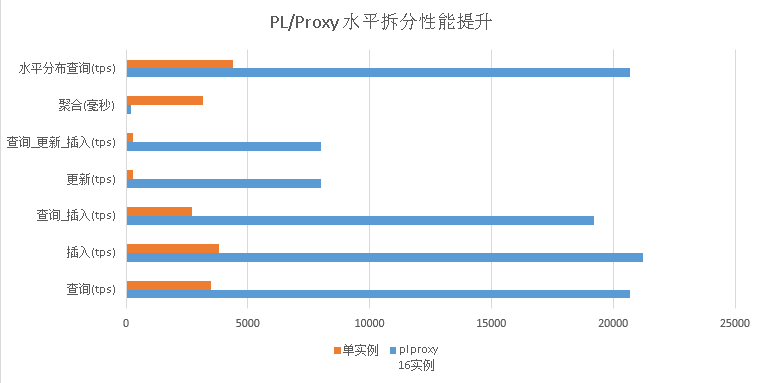

## 阿里云ApsaraDB RDS for PostgreSQL 最佳实践 - 3 水平分库(plproxy) vs 单机 性能
##### [TAG 24](../class/24.md)
                              
### 作者                                                                           
digoal                         
                                
### 日期                           
2015-12-20                           
                            
### 标签                         
PostgreSQL , 阿里云RDS        
                              
----                        
                                 
## 背景               
本文是针对单个RDS实例（同样的配置）承载6400万数据的测试。对比前面的水平分库。  
  
创建测试表，生成测试数据。  
  
```  
create table userinfo(userid int,info text);  
create table session (userid int,last_login timestamp);  
create table login_log (userid int,db_user name,client_addr inet,  
                       client_port int,server_addr inet,server_port int,login_time timestamp);  
create table tbl_small (userid int primary key,info text);  
  
set synchronous_commit=off;  
insert into userinfo select generate_series(1,32000000);  
insert into session select generate_series(1,32000000);  
insert into tbl_small select generate_series(1,500000);  
set maintenance_work_mem='10GB';  
alter table userinfo add constraint pk_userinfo primary key (userid);  
alter table session add constraint pk_session primary key (userid);  
  
postgres=> \dt+  
                         List of relations  
 Schema |      Name       | Type  | Owner  |  Size   | Description   
--------+-----------------+-------+--------+---------+-------------  
 public | ha_health_check | table | aurora | 40 kB   |   
 public | session         | table | digoal | 1106 MB |   
 public | userinfo        | table | digoal | 1106 MB |   
(3 rows)  
postgres=> \di+  
                                    List of relations  
 Schema |         Name         | Type  | Owner  |      Table      |  Size  | Description   
--------+----------------------+-------+--------+-----------------+--------+-------------  
 public | ha_health_check_pkey | index | aurora | ha_health_check | 16 kB  |   
 public | pk_session           | index | digoal | session         | 686 MB |   
 public | pk_userinfo          | index | digoal | userinfo        | 686 MB |   
(3 rows)  
```  
  
测试中发现一个小小的惊喜，RDS限制了数据库进程的内存使用（包括shared buffers,work_mem,maintenance_work_mem, wal_buffers等限制），但是并不会限制OS层缓存的使用，也就是说我们的数据表对应的数据文件如果是热数据的话，可能被缓存好OS层缓存中，假如RDS能提供pgfincore插件就更完美了，不过在云环境中使用会造成内存争抢的情况。  
  
下面我们看一个测试，实例只有256MB的shared buffer, 下面的查询却飞快。  
  
```  
postgres=> explain (analyze,verbose,timing,buffers,costs) select count(userid) from session;  
                                                             QUERY PLAN                                                               
------------------------------------------------------------------------------------------------------------------------------------  
 Aggregate  (cost=541593.00..541593.01 rows=1 width=4) (actual time=6574.761..6574.761 rows=1 loops=1)  
   Output: count(userid)  
   Buffers: shared hit=20229 read=121364  
   I/O Timings: read=227.803  
   ->  Seq Scan on public.session  (cost=0.00..461593.00 rows=32000000 width=4) (actual time=0.029..3295.744 rows=32000001 loops=1)  
         Output: userid, last_login  
         Buffers: shared hit=20229 read=121364  
         I/O Timings: read=227.803  
 Planning time: 0.044 ms  
 Execution time: 6574.794 ms  
(10 rows)  
postgres=> explain (analyze,verbose,timing,buffers,costs) select count(userid) from userinfo;  
                                                             QUERY PLAN                                                               
   
------------------------------------------------------------------------------------------------------------------------------------  
 Aggregate  (cost=541593.00..541593.01 rows=1 width=4) (actual time=6653.383..6653.383 rows=1 loops=1)  
   Output: count(userid)  
   Buffers: shared hit=64 read=141529  
   I/O Timings: read=265.700  
   ->  Seq Scan on public.userinfo  (cost=0.00..461593.00 rows=32000000 width=4) (actual time=0.029..3358.069 rows=32000001 loops=1)  
         Output: userid, info  
         Buffers: shared hit=64 read=141529  
         I/O Timings: read=265.700  
 Planning time: 0.046 ms  
 Execution time: 6653.417 ms  
(10 rows)  
```  
  
分析这里的I/O Timings，单位毫秒，每次IO请求只需要0.0019毫秒。  
  
这已经是内存级别的速度了。  
  
```  
postgres=> select 265.700/141529;  
        ?column?          
------------------------  
 0.00187735375788707615  
(1 row)  
postgres=> select 227.803/121364;  
        ?column?          
------------------------  
 0.00187702284038100260  
(1 row)  
```  
  
离散扫描测试：  
  
```  
postgres=> set enable_seqscan=off;  
SET  
postgres=> explain (analyze,verbose,timing,buffers,costs) select count(userid) from userinfo;  
                                                                          QUERY PLAN                                                  
                            
------------------------------------------------------------------------------------------------------------------------------------  
--------------------------  
 Aggregate  (cost=1052572.56..1052572.57 rows=1 width=4) (actual time=10343.801..10343.801 rows=1 loops=1)  
   Output: count(userid)  
   Buffers: shared read=229028  
   I/O Timings: read=674.634  
   ->  Index Only Scan using pk_userinfo on public.userinfo  (cost=0.56..972572.56 rows=32000000 width=4) (actual time=0.082..7277.8  
18 rows=32000001 loops=1)  
         Output: userid  
         Heap Fetches: 32000001  
         Buffers: shared read=229028  
         I/O Timings: read=674.634  
 Planning time: 0.035 ms  
 Execution time: 10343.851 ms  
(11 rows)  
postgres=> explain (analyze,verbose,timing,buffers,costs) select count(userid) from session;  
                                                                         QUERY PLAN                                                   
                          
------------------------------------------------------------------------------------------------------------------------------------  
------------------------  
 Aggregate  (cost=1052572.56..1052572.57 rows=1 width=4) (actual time=10321.901..10321.901 rows=1 loops=1)  
   Output: count(userid)  
   Buffers: shared read=229028  
   I/O Timings: read=633.969  
   ->  Index Only Scan using pk_session on public.session  (cost=0.56..972572.56 rows=32000000 width=4) (actual time=0.080..7268.908  
 rows=32000001 loops=1)  
         Output: userid  
         Heap Fetches: 32000001  
         Buffers: shared read=229028  
         I/O Timings: read=633.969  
 Planning time: 0.056 ms  
 Execution time: 10321.935 ms  
(11 rows)  
```  
  
分析这里的I/O Timings，单位毫秒，每次IO请求只需要0.0028毫秒。  
  
```  
postgres=> select 633.969/229028;  
        ?column?          
------------------------  
 0.00276808512496288663  
(1 row)  
postgres=> select 674.634/229028;  
        ?column?          
------------------------  
 0.00294563983443072463  
(1 row)  
```  
  
如果这些数据不是在内存中，那么有这样IOPS能力的块设备，那也是怪兽级别的了(8K的数据块，离散读IOPS达到36万，未考虑read ahead，考虑的话一般默认预读是256个扇区，真实IOPS能力会略低)。  
  
我个人的判断还是倾向阿里的RDS未限制OS层CACHE，也就是随你用。  
  
创建测试函数：  
  
```  
CREATE OR REPLACE FUNCTION query_pk(IN i_userid int, OUT userid int, OUT info text)  
     RETURNS record  
     LANGUAGE plpgsql  
     STRICT  
    AS $function$  
      declare  
      begin  
        select t.userid,t.info into userid,info from userinfo t where t.userid=i_userid;  
        return;  
      end;  
    $function$;  
  
CREATE OR REPLACE FUNCTION insert_log(IN i_userid int)  
     RETURNS void  
     LANGUAGE plpgsql  
     STRICT  
    AS $function$  
      declare  
      begin  
        set synchronous_commit=off;  
        insert into login_log (userid,db_user,client_addr,client_port,server_addr,server_port,login_time)  
   values (i_userid,current_user,inet_client_addr(),inet_client_port(),inet_server_addr(),inet_server_port(),now());  
      end;  
    $function$;  
  
CREATE OR REPLACE FUNCTION query_insert(IN i_userid int, OUT userid int, OUT info text)  
     RETURNS record  
     LANGUAGE plpgsql  
     STRICT  
    AS $function$  
      declare  
      begin  
        set synchronous_commit=off;  
        select t.userid,t.info into userid,info from userinfo t where t.userid=i_userid;  
        insert into login_log (userid,db_user,client_addr,client_port,server_addr,server_port,login_time)  
   values (i_userid,current_user,inet_client_addr(),inet_client_port(),inet_server_addr(),inet_server_port(),now());  
        return;  
      end;  
    $function$;  
  
  
CREATE OR REPLACE FUNCTION update_pk(IN i_userid int)  
     RETURNS void  
     LANGUAGE plpgsql  
     STRICT  
    AS $function$  
      declare  
      begin  
        set synchronous_commit=off;  
        update session t set last_login=now() where t.userid=i_userid;  
      end;  
    $function$;  
  
CREATE OR REPLACE FUNCTION query_update_insert(IN i_userid int, OUT userid int, OUT info text)  
     RETURNS record  
     LANGUAGE plpgsql  
     STRICT  
    AS $function$  
      declare  
      begin  
        set synchronous_commit=off;  
        select t.userid,t.info into userid,info from userinfo t where t.userid=i_userid;  
        insert into login_log (userid,db_user,client_addr,client_port,server_addr,server_port,login_time)  
   values (i_userid,current_user,inet_client_addr(),inet_client_port(),inet_server_addr(),inet_server_port(),now());  
        update session t set last_login=now() where t.userid=i_userid;  
        return;  
      end;  
    $function$;  
  
CREATE OR REPLACE FUNCTION query_smalltbl(IN i_userid int, OUT userid int, OUT info text)  
     RETURNS record  
     LANGUAGE plpgsql  
     STRICT  
    AS $function$  
      declare  
      begin  
        select t.userid,t.info into userid,info from tbl_small t where t.userid=i_userid;  
        return;  
      end;  
    $function$;  
```  
  
测试结果：  
  
```  
vi test.sql  
\setrandom id 1 32000000  
select query_pk(:id);  
pgbench -M prepared -n -r -f ./test.sql -P 1 -c 88 -j 88 -T 20 -h xxxx.pg.rds.aliyuncs.com -p 3433 -U digoal postgres  
progress: 1.1 s, 1938.5 tps, lat 30.861 ms stddev 63.730  
progress: 2.1 s, 3397.7 tps, lat 26.197 ms stddev 43.067  
progress: 3.0 s, 3293.2 tps, lat 25.744 ms stddev 36.761  
progress: 4.2 s, 3477.7 tps, lat 26.012 ms stddev 44.032  
progress: 5.1 s, 3448.3 tps, lat 25.291 ms stddev 39.993  
progress: 6.0 s, 3581.1 tps, lat 24.386 ms stddev 53.515  
progress: 7.0 s, 3669.4 tps, lat 23.736 ms stddev 43.620  
progress: 8.1 s, 3635.0 tps, lat 24.333 ms stddev 54.772  
progress: 9.0 s, 3625.6 tps, lat 24.457 ms stddev 39.071  
progress: 10.0 s, 3708.4 tps, lat 23.017 ms stddev 41.434  
  
vi test.sql  
\setrandom id 1 32000000  
select insert_log(:id);  
pgbench -M prepared -n -r -f ./test.sql -P 1 -c 88 -j 88 -T 20 -h xxxx.pg.rds.aliyuncs.com -p 3433 -U digoal postgres  
progress: 1.1 s, 2194.8 tps, lat 26.288 ms stddev 51.427  
progress: 2.0 s, 3841.0 tps, lat 22.859 ms stddev 37.456  
progress: 3.0 s, 3745.8 tps, lat 23.536 ms stddev 46.164  
progress: 4.0 s, 3843.2 tps, lat 22.481 ms stddev 37.077  
progress: 5.0 s, 3676.9 tps, lat 24.256 ms stddev 45.177  
progress: 6.1 s, 3838.0 tps, lat 22.898 ms stddev 38.825  
progress: 7.0 s, 3890.9 tps, lat 22.836 ms stddev 38.612  
progress: 8.0 s, 3590.9 tps, lat 24.565 ms stddev 43.551  
progress: 9.0 s, 3675.0 tps, lat 24.210 ms stddev 38.266  
progress: 10.1 s, 3812.7 tps, lat 22.507 ms stddev 36.516  
  
vi test.sql  
\setrandom id 1 32000000  
select query_insert(:id);  
pgbench -M prepared -n -r -f ./test.sql -P 1 -c 88 -j 88 -T 20 -h xxxx.pg.rds.aliyuncs.com -p 3433 -U digoal postgres  
progress: 1.1 s, 1269.2 tps, lat 45.745 ms stddev 89.929  
progress: 2.1 s, 2700.4 tps, lat 33.356 ms stddev 58.091  
progress: 3.0 s, 2654.6 tps, lat 35.314 ms stddev 54.011  
progress: 4.0 s, 2673.0 tps, lat 31.859 ms stddev 48.704  
progress: 5.0 s, 2762.7 tps, lat 31.759 ms stddev 51.929  
progress: 6.1 s, 2667.7 tps, lat 32.047 ms stddev 55.966  
progress: 7.1 s, 2688.7 tps, lat 32.407 ms stddev 58.218  
progress: 8.2 s, 2785.4 tps, lat 30.795 ms stddev 65.419  
progress: 9.0 s, 2789.9 tps, lat 35.547 ms stddev 58.010  
progress: 10.0 s, 2879.6 tps, lat 30.196 ms stddev 53.233  
  
vi test.sql  
\setrandom id 1 32000000  
select update_pk(:id);  
pgbench -M prepared -n -r -f ./test.sql -P 1 -c 88 -j 88 -T 20 -h xxxx.pg.rds.aliyuncs.com -p 3433 -U digoal postgres  
progress: 2.5 s, 282.4 tps, lat 218.387 ms stddev 495.226  
progress: 5.8 s, 94.8 tps, lat 787.358 ms stddev 1325.987  
progress: 5.8 s, 15727.4 tps, lat 150.434 ms stddev 668.515  
progress: 5.9 s, 945.4 tps, lat 769.080 ms stddev 1374.084  
progress: 16.1 s, 93.2 tps, lat 833.108 ms stddev 1856.263  
progress: 16.2 s, 2598.5 tps, lat 665.837 ms stddev 1693.883  
progress: 17.2 s, 71.7 tps, lat 1571.432 ms stddev 1858.991  
progress: 22.2 s, 29.9 tps, lat 3003.451 ms stddev 2389.133  
  
vi test.sql  
\setrandom id 1 32000000  
select query_update_insert(:id);  
pgbench -M prepared -n -r -f ./test.sql -P 1 -c 88 -j 88 -T 20 -h xxxx.pg.rds.aliyuncs.com -p 3433 -U digoal postgres  
progress: 5.7 s, 144.2 tps, lat 563.075 ms stddev 1426.395  
progress: 5.8 s, 1292.3 tps, lat 133.407 ms stddev 609.956  
progress: 5.8 s, 1028.1 tps, lat 29.967 ms stddev 37.131  
progress: 11.3 s, 25.5 tps, lat 2265.784 ms stddev 2573.469  
progress: 11.3 s, 6079.0 tps, lat 9.619 ms stddev 9.293  
progress: 11.3 s, 4787.2 tps, lat 624.805 ms stddev 1740.448  
progress: 16.9 s, 98.1 tps, lat 867.968 ms stddev 1989.390  
progress: 17.1 s, 1313.4 tps, lat 870.720 ms stddev 2098.172  
progress: 17.1 s, 13863.8 tps, lat 65.169 ms stddev 56.996  
progress: 17.1 s, 11670.3 tps, lat 20.520 ms stddev 35.188  
  
postgres=> \timing  
Timing is on.  
postgres=> select count(*) from login_log;  
  count    
--------  
 140456  
(1 row)  
Time: 28.747 ms  
postgres=> select count(*) from userinfo;  
  count     
----------  
 32000001  
(1 row)  
Time: 3141.289 ms  
  
vi test.sql  
\setrandom id 1 32000000  
select query_smalltbl(:id);  
pgbench -M prepared -n -r -f ./test.sql -P 1 -c 88 -j 88 -T 20 -h xxxx.pg.rds.aliyuncs.com -p 3433 -U digoal postgres  
progress: 1.0 s, 2420.4 tps, lat 23.557 ms stddev 45.623  
progress: 2.0 s, 4337.3 tps, lat 19.923 ms stddev 37.168  
progress: 3.0 s, 4555.2 tps, lat 20.154 ms stddev 35.738  
progress: 4.0 s, 4362.4 tps, lat 20.094 ms stddev 40.591  
progress: 5.1 s, 4203.5 tps, lat 20.386 ms stddev 36.220  
progress: 6.0 s, 4484.5 tps, lat 19.888 ms stddev 36.724  
progress: 7.0 s, 4551.6 tps, lat 19.634 ms stddev 39.959  
progress: 8.0 s, 4041.8 tps, lat 21.195 ms stddev 40.362  
progress: 9.1 s, 4557.6 tps, lat 19.758 ms stddev 37.218  
progress: 10.0 s, 4349.1 tps, lat 20.254 ms stddev 34.562  
```  
  
测试结果与使用plproxy分布式处理的对比：  
  
性能提升非常明显。  
  
  
  
再报几个可能遇到的问题（现在这些问题以及都修复了，感谢阿里云PostgreSQL内核组的小伙伴）：  
  
1\. 当容量超出时（例如执行一个大的插入，我在生成测试数据时遇到），数据库会被KILL掉，数据库重启并恢复。（原因是单个SQL需要申请的内存超出了购买的规格，触发了OOM。）  
  
恢复时间有点长，约30分钟，(恢复过程中建议不要限制IOPS，尽快恢复才是王道)并且恢复后，还会有很长一段时间处于recovery状态。  
  
```  
postgres=> select pg_is_in_recovery();  
 pg_is_in_recovery   
-------------------  
 t  
(1 row)  
```  
  
同时这点过于暴力，是不是可以给用户提个醒，和用户协商一下呢？给用户一个时间窗口，让用户自己处理。（现在已经改为比较温柔的做法了，感兴趣的童鞋可以测试一下）  
  
2\. OS层缓存，这个已经说了，阿里云RDS目前可能没有限制OS层缓存，所以尽情享受吧。  
  
3\. IOPS限制间隔，在测试UPDATE时，性能非常不稳，可能是IOPS限制间隔或者手段造成的，当然也可能是FPW造成的，因为没有RDS所在服务器的权限，没有办法调试，所以基本靠猜。  
  
4\. 为什么我们的plproxy没有看到所有测试的线性性能提升(目测某些只有5到8倍的性能提升，某些有超过16倍的性能提升)，因为阿里云RDS并没有限制CPU的使用率，只限制了共享内存和IOPS，那么有些节点所在的机器可能CPU资源较空，有些较忙，我们的测试虽然是随机的分发到各个节点，但是因测试线程是共享的，所以单个实例如果比较慢，对总体测试结果有一定的影响。  
  
而对于IO类的测试，性能提升是达到16倍的。  
  
排除这些影响，使用plproxy是线性提升的，我在以前的分享中有数据可供查看，有兴趣的朋友可以看我以前的一些分享。  
  
先写到这里，下一篇来讲讲如何增加或减少数据节点。  
  
## 参考  
1\. http://blog.163.com/digoal@126/blog/static/1638770402015599230431/  
  
2\. http://blog.163.com/digoal@126/blog/static/16387704020155104492068/  
  
<a rel="nofollow" href="http://info.flagcounter.com/h9V1"  ></a>  
  
  
  
  
  
  
## [digoal's 大量PostgreSQL文章入口](https://github.com/digoal/blog/blob/master/README.md "22709685feb7cab07d30f30387f0a9ae")
  
