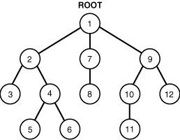
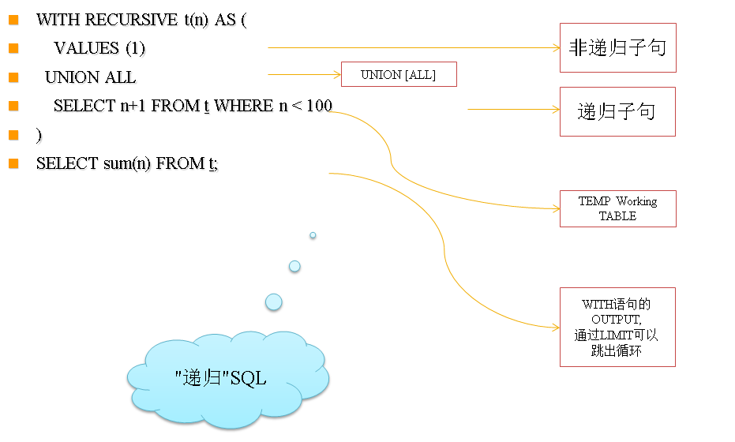
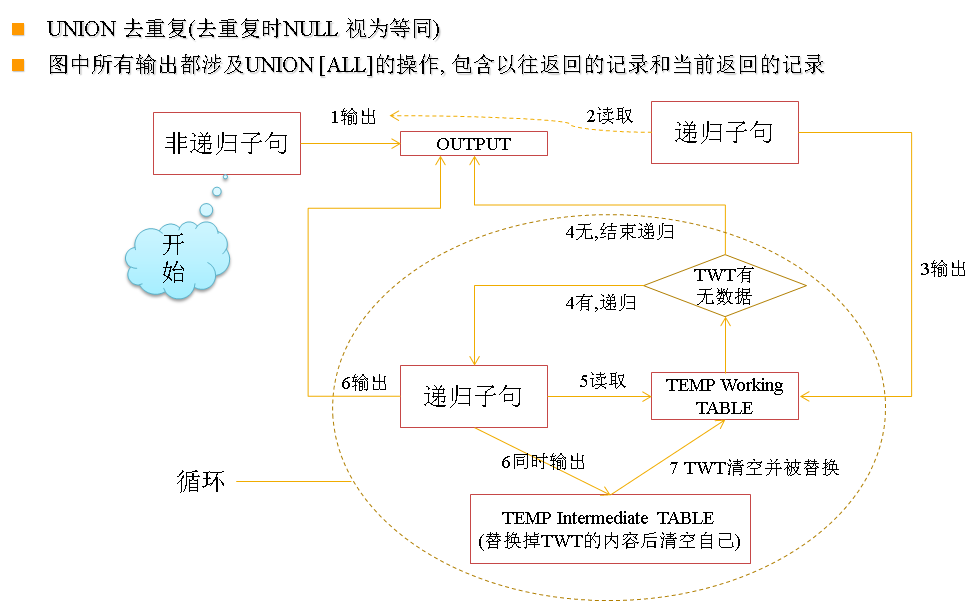
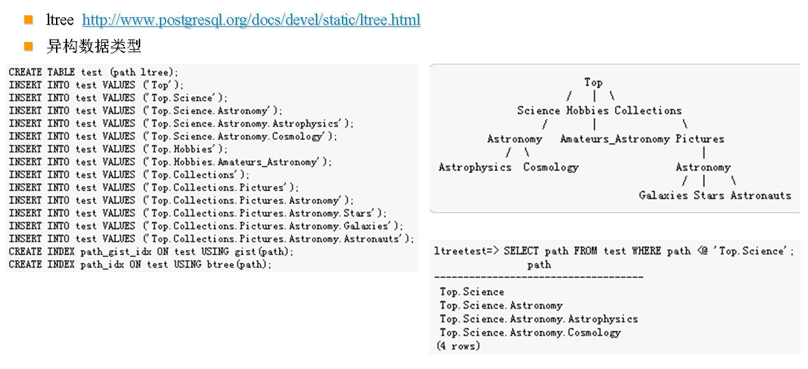

## PostgreSQL Oracle 兼容性之 - WITH 递归 ( connect by )  
##### [TAG 21](../class/21.md)
                                     
### 作者                                     
digoal                                      
                                        
### 日期                                      
2015-12-21                                                                 
                                      
### 标签                                                                                                                                                      
PostgreSQL , Oracle , 兼容性 , 递归 , connect by , with recursive   
                                    
----                                      
                                    
## 背景                              
( 请把本文某些SQL的  SELEC改成 s e l e c t , FRO改成 f r o m , WHE改成 w h e r e  不要空格)  
  
connect by语法是Oracle用来实现树形查询的一种语法。  
  
应用场景如图：  
  
  
  
PostgreSQL虽然不支持connect by语法，但是支持with recursive语法，可以达到相同的目的。  
  
下面举个例子来说明with recursive的用法。  
  
如图：  
  
  
  
假如2(t), 3(t), 4(f), 5(t), 6(f),  
  
当输入条件为2并且附加条件为t时，需要查出2(t),3(t),4(f)  
  
其实这个查询包含了树形查询，同时还包含了第二个条件过滤。  
  
表结构:  
  
```
digoal=> \d tbl_role  
          Table "digoal.tbl_role"  
 Column |         Type          | Modifiers   
--------+-----------------------+-----------  
 id     | integer               |  -- 唯一ID  
 code   | character varying(32) |  -- 树形结构代码  
 extend | boolean               |  -- 是否可扩展  
```
  
数据:  
  
```
digoal=> SELEC * FRO tbl_role order by code;  
 id |     code     | extend   
----+--------------+--------  
  1 | 001          | t  
  4 | 001001       | t  
  5 | 001002       | f  
  6 | 001003       | f  
  7 | 001003001    | t  
 10 | 001005       | t  
 11 | 001005001    | f  
 11 | 001005001001 | t  
  2 | 002          | t  
  8 | 002001       | f  
  3 | 003          | t  
  9 | 003001       | f  
(12 rows)  
```
  
思路:  
  
因为这个CASE设计的数型数据存储在一个字段code里面，所以首先要把对应的父级找出来，才好去做子级和父级的关联查询.  
  
然后使用递归查询得出所要的结果.  
  
具体实现:  
  
例如要查询code = '001',包含所有的扩展结果, (遇到extend = f时仅取出本条，下级的数据不取出) :  
  
```
digoal=> with recursive sub as   
(  
SELEC id,code,coalesce(case when length(substring(code,1,length(code)-3))=0 then null else substring(code,1,length(code)-3) end,'root') parcode,extend   
FRO tbl_role WHE code ='001'  
  union  
SELEC d.* FRO (SELEC id,code,coalesce(case when length(substring(code,1,length(code)-3))=0 then null else substring(code,1,length(code)-3) end,'root') parcode,extend   
FRO tbl_role WHE code like '001%') as d  
  join  
sub as sd  
on (d.parcode=sd.code and (sd.extend='t' or sd.parcode='root'))  
)  
SELEC * FRO sub;  
  
 id |   code    | parcode | extend   
----+-----------+---------+--------  
  1 | 001       | root    | t  
  4 | 001001    | 001     | t  
  5 | 001002    | 001     | f  
  6 | 001003    | 001     | f  
 10 | 001005    | 001     | t  
 11 | 001005001 | 001005  | f  
(6 rows)  
```
  
换个取code = '001005'    
  
```
digoal=> with recursive sub as                            
(  
SELEC id,code,coalesce(case when length(substring(code,1,length(code)-3))=0 then null else substring(code,1,length(code)-3) end,'root') parcode,extend   
FRO tbl_role WHE code ='001005'  
  union  
SELEC d.* FRO (SELEC id,code,coalesce(case when length(substring(code,1,length(code)-3))=0 then null else substring(code,1,length(code)-3) end,'root') parcode,extend   
FRO tbl_role WHE code like '001005%') as d  
  join  
sub as sd  
on (d.parcode=sd.code and (sd.extend='t' or sd.parcode='root'))  
)  
SELEC * FRO sub;  
  
 id |   code    | parcode | extend   
----+-----------+---------+--------  
 10 | 001005    | 001     | t  
 11 | 001005001 | 001005  | f  
(2 rows)  
```
  
  
多个code的场景  
  
```
digoal=> with recursive sub as                           
(  
SELEC id,code,coalesce(case when length(substring(code,1,length(code)-3))=0 then null else substring(code,1,length(code)-3) end,'root') parcode, extend   
FRO tbl_role WHE code in ('001005','001003')  
  union  
SELEC d.* FRO (SELEC id,code,coalesce(case when length(substring(code,1,length(code)-3))=0 then null else substring(code,1,length(code)-3) end,'root') parcode,extend   
FRO tbl_role WHE (code like '001005%' or code like '001003%')) as d  
  join  
sub as sd  
on (d.parcode=sd.code and (sd.extend='t' or sd.parcode='root'))  
)  
SELEC * FRO sub;  
  
 id |   code    | parcode | extend   
----+-----------+---------+--------  
  6 | 001003    | 001     | f  
 10 | 001005    | 001     | t  
 11 | 001005001 | 001005  | f  
(3 rows)  
```
  
## 小结  
  
PostgreSQL的with recursive查询提供了类似ORACLE的  
  
```  
  [ START WITH condition ] CONNECT BY [ NOCYCLE ] condition  
```  
  
的异构查询功能。  
  
## 参考  
http://wiki.postgresql.org/wiki/CTEReadme  
  
http://www.postgresql.org/docs/9.0/static/queries-with.html  
  
补充,另外一个更简易的树形查询的例子:  
  
TABLE:  
  
```  
postgres=#  \d tbl_menu  
                       Table "public.tbl_menu"  
   Column   |            Type             |         Modifiers           
------------+-----------------------------+---------------------------  
 id         | bigint                      | not null  
 name       | character varying(50)       | not null  
 parentid   | bigint                      | not null  
 type       | integer                     | not null  
 status     | integer                     | not null  
 grade      | integer                     | not null  
 filename   | character varying(50)       |   
 md5        | character varying(50)       |   
 brief      | character varying(500)      |   
 orderid    | bigint                      | not null default 99999999  
 updatetime | timestamp without time zone |   
 createtime | timestamp without time zone | default now()  
```  
  
DATA:  
  
```  
postgres=# SELEC * FRO tbl_menu;  
 id |  name  | parentid | type | status | grade | filename |               md5                |  brief   | orderid  |       updateti  
me        |         createtime           
----+--------+----------+------+--------+-------+----------+----------------------------------+----------+----------+---------------  
----------+----------------------------  
 18 | 言情   |       14 |    4 |      1 |    24 |          | d41d8cd98f00b204e9800998ecf8427e |          |        2 | 2011-05-19 14:  
41:17.287 | 2011-05-19 14:37:44.11  
 19 | 玄幻   |       14 |    4 |      1 |    24 | 1.png    | ad5df343eb6b83d3e1100bdbccf98264 |          |        3 | 2011-05-19 14:  
41:25.287 | 2011-05-19 14:38:06.39  
 20 | 明星   |       13 |    3 |      1 |    24 | 1.png    | ad5df343eb6b83d3e1100bdbccf98264 |          | 99999999 | 2011-05-19 15:  
39:24.118 | 2011-05-19 15:34:38.719  
 21 | 免费   |       12 |    2 |      1 |    24 |          | d41d8cd98f00b204e9800998ecf8427e |          | 99999999 | 2011-05-19 20:  
06:30.016 | 2011-05-19 20:06:30.016  
 22 | 专辑   |       11 |    1 |      1 |    24 | 1.png    | ad5df343eb6b83d3e1100bdbccf98264 |          | 99999999 | 2011-05-19 20:  
06:43.328 | 2011-05-19 20:06:43.328  
 25 | 复古   |       22 |    1 |      1 |    24 |          | d41d8cd98f00b204e9800998ecf8427e |          |        1 | 2011-05-19 21:  
45:47.459 | 2011-05-19 21:45:47.459  
 24 | 流行   |       22 |    1 |      1 |    26 | 1.png    | ad5df343eb6b83d3e1100bdbccf98264 | 流行音乐 |        2 | 2011-05-19 21:  
45:54.365 | 2011-05-19 21:41:51.749  
 35 | 高清   |       33 |    6 |      1 |    24 |          | d41d8cd98f00b204e9800998ecf8427e |          |        1 | 2011-05-23 14:  
07:44.659 | 2011-05-23 14:07:44.659  
 36 | 明星   |       33 |    6 |      1 |    26 |          | d41d8cd98f00b204e9800998ecf8427e |          |        2 | 2011-05-23 14:  
08:04.175 | 2011-05-23 14:08:04.175  
 37 | 浙江   |       34 |    5 |      1 |    24 |          | d41d8cd98f00b204e9800998ecf8427e |          |        1 | 2011-05-23 14:  
11:56.77  | 2011-05-23 14:11:56.77  
 11 | 音乐   |        0 |    1 |      1 |    24 |          |                                  |          |        1 | 2011-05-23 14:  
12:08.411 | 2011-05-19 14:25:24.966436  
 12 | 视频   |        0 |    2 |      1 |    24 |          |                                  |          |        2 | 2011-05-23 14:  
12:17.192 | 2011-05-19 14:25:37.569062  
 13 | 图酷   |        0 |    3 |      1 |    24 |          |                                  |          |        3 | 2011-05-23 14:  
12:22.896 | 2011-05-19 14:25:47.118481  
 14 | 书籍   |        0 |    4 |      1 |    24 |          |                                  |          |        4 | 2011-05-23 14:  
12:29.317 | 2011-05-19 14:26:11.781762  
 34 | 直播   |        0 |    5 |      1 |    24 |          |                                  |          |        5 | 2011-05-23 14:  
12:34.786 | 2011-05-19 14:25:24.966436  
 33 | 点播   |        0 |    6 |      1 |    24 |          |                                  |          |        6 | 2011-05-23 14:  
12:38.567 | 2011-05-19 14:25:24.966436  
 38 | 北京   |       34 |    5 |      1 |    24 |          | d41d8cd98f00b204e9800998ecf8427e |          |        1 | 2011-05-23 14:  
13:37.162 | 2011-05-23 14:13:37.162  
 39 | 漫画   |       13 |    3 |      1 |    24 |          | d41d8cd98f00b204e9800998ecf8427e |          |        1 | 2011-05-23 14:  
28:56.777 | 2011-05-23 14:28:56.777  
 40 | 刘德华 |       25 |    1 |      1 |    24 |          | d41d8cd98f00b204e9800998ecf8427e |          |        1 | 2011-05-25 15:  
36:33.139 | 2011-05-25 15:36:33.139  
(19 rows)  
```  
  
### 向上递归查询:  
  
```  
with recursive t_result as                           
(  
SELEC id,name,parentid,type,status,grade,filename,md5,brief,orderid,updatetime,createtime   
FRO tbl_menu as t_initial where name ~ '刘德华'  
union  
SELEC t_working.id,t_working.name,t_working.parentid,t_working.type,t_working.status,t_working.grade,t_working.filename,t_working.md5,t_working.brief,t_working.orderid,t_working.updatetime,t_working.createtime   
FRO tbl_menu as t_working  
join  
t_result  
on (t_result.parentid=t_working.id)  
)  
SELEC id,name,parentid,type,status,grade,filename,md5,brief,orderid,updatetime,createtime   
FRO t_result;  
  
 id |  name  | parentid | type | status | grade | filename |               md5                | brief | orderid  |       updatetime   
       |         createtime           
----+--------+----------+------+--------+-------+----------+----------------------------------+-------+----------+------------------  
-------+----------------------------  
 40 | 刘德华 |       25 |    1 |      1 |    24 |          | d41d8cd98f00b204e9800998ecf8427e |       |        1 | 2011-05-25 15:36:  
33.139 | 2011-05-25 15:36:33.139  
 25 | 复古   |       22 |    1 |      1 |    24 |          | d41d8cd98f00b204e9800998ecf8427e |       |        1 | 2011-05-19 21:45:  
47.459 | 2011-05-19 21:45:47.459  
 22 | 专辑   |       11 |    1 |      1 |    24 | 1.png    | ad5df343eb6b83d3e1100bdbccf98264 |       | 99999999 | 2011-05-19 20:06:  
43.328 | 2011-05-19 20:06:43.328  
 11 | 音乐   |        0 |    1 |      1 |    24 |          |                                  |       |        1 | 2011-05-23 14:12:  
08.411 | 2011-05-19 14:25:24.966436  
(4 rows)  
```  
  
### 向下递归查询:  
  
```  
with recursive t_result as                           
(  
SELEC id,name,parentid,type,status,grade,filename,md5,brief,orderid,updatetime,createtime   
FRO tbl_menu as t_initial where name ~ '音乐'  
  union  
SELEC t_working.id,t_working.name,t_working.parentid,t_working.type,t_working.status,t_working.grade,t_working.filename,t_working.md5,t_working.brief,t_working.orderid,t_working.updatetime,t_working.createtime   
FRO tbl_menu as t_working  
  join  
t_result  
  on (t_working.parentid=t_result.id)  
)  
SELEC id,name,parentid,type,status,grade,filename,md5,brief,orderid,updatetime,createtime   
FRO t_result;  
  
 id |  name  | parentid | type | status | grade | filename |               md5                |  brief   | orderid  |       updateti  
me        |         createtime           
----+--------+----------+------+--------+-------+----------+----------------------------------+----------+----------+---------------  
----------+----------------------------  
 11 | 音乐   |        0 |    1 |      1 |    24 |          |                                  |          |        1 | 2011-05-23 14:  
12:08.411 | 2011-05-19 14:25:24.966436  
 22 | 专辑   |       11 |    1 |      1 |    24 | 1.png    | ad5df343eb6b83d3e1100bdbccf98264 |          | 99999999 | 2011-05-19 20:  
06:43.328 | 2011-05-19 20:06:43.328  
 25 | 复古   |       22 |    1 |      1 |    24 |          | d41d8cd98f00b204e9800998ecf8427e |          |        1 | 2011-05-19 21:  
45:47.459 | 2011-05-19 21:45:47.459  
 24 | 流行   |       22 |    1 |      1 |    26 | 1.png    | ad5df343eb6b83d3e1100bdbccf98264 | 流行音乐 |        2 | 2011-05-19 21:  
45:54.365 | 2011-05-19 21:41:51.749  
 40 | 刘德华 |       25 |    1 |      1 |    24 |          | d41d8cd98f00b204e9800998ecf8427e |          |        1 | 2011-05-25 15:  
36:33.139 | 2011-05-25 15:36:33.139  
(5 rows)  
```  
  
最后用两幅图说明with recursive的原理，学会了是很好用的。  
  
  
  
  
  
PostgreSQL针对这种树形查询，提供了一种数据类型较ltree，使用起来非常方便，如果你有这种应用场景的需求，也可以考虑一下ltree。  
  
  
  
        
                                                                                                  
                                                       
  
<a rel="nofollow" href="http://info.flagcounter.com/h9V1"  ></a>  
  
  
  
  
  
  
## [digoal's 大量PostgreSQL文章入口](https://github.com/digoal/blog/blob/master/README.md "22709685feb7cab07d30f30387f0a9ae")
  
