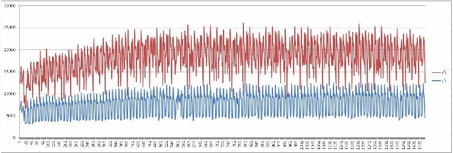

## PostgreSQL OLTP on ZFS 性能优化   
                        
### 作者                                                                     
digoal                   
                          
### 日期                     
2015-12-29                    
                      
### 标签                   
PostgreSQL , zfs , oltp , 性能优化       
                        
----                  
                           
## 背景                 
## 环境  
  
```  
  PostgreSQL 9.5 rc1  
  数据块大小为8KB  
  CentOS 6.x x64  
  zfsonlinux  
  3*aliflash  
  256G内存  
  32核 Intel(R) Xeon(R) CPU E5-2650 v2 @ 2.60GHz  
  
  
pg_xlog on ext4  
  
  ext4 mount option ( defaults,noatime,nodiratime,discard,nodelalloc,data=writeback,nobarrier )  
  
$PGDATA on zfs  
```  
  
## zfs优化  
1\. 块设备对齐  
  
```  
fdisk -c -u /dev/dfa  
start  2048  
end  +(n*2048-1)  
  
或者使用parted分配，GPT+对齐  
```  
  
2\. 模块参数  
  
```  
cd /sys/module/zfs/parameters/  
```  
  
1\.1 关闭zfs prefetch，因为是OLTP系统，不需要prefetch。  
  
```  
echo 1 > zfs_prefetch_disable  
```  
  
1\.2 修改ARC脏页一次被刷出的单位（太大会导致evict arc脏页时中断响应，建议16MB）  
  
算法 :  系统内存 除以 2^zfs_arc_shrink_shift  
  
所以当内存为256GB是，要配置为16MB，zfs_arc_shrink_shift必须设置为14。  
  
```  
echo 14 > zfs_arc_shrink_shift  
```  
  
1\.3 对于未使用ZLOG设备的zpool，可以将sync改为always  
  
```  
zfs set sync=always zp1/data01  
zfs set sync=always zp1  
```  
  
3\. zpool 参数  
  
2\.1 ashift和数据库的块大小对齐。这里PostgreSQL使用了默认的8KB。  
  
所以ashift选择13。  
  
```  
2^13=8192  
  
zpool create -o ashift=13 zp1 dfa1 dfb1 dfc1  
```  
  
4\. zfs 参数  
  
```  
recordsize 对齐数据库块大小 = 8K  
primarycache = metadata  
secondarycache = none  
atime = off  
logbias = throughput    (直接写数据，因为没有使用ZLOG，不需要用标准的)  
```  
  
5\. postgresql 参数  
  
```  
listen_addresses = '0.0.0.0'            # what IP address(es) to listen on;  
port = 1921                             # (change requires restart)  
max_connections = 1000                  # (change requires restart)  
unix_socket_directories = '.'   # comma-separated list of directories  
shared_buffers = 32GB                   # min 128kB  
maintenance_work_mem = 512MB            # min 1MB  
autovacuum_work_mem = 512MB             # min 1MB, or -1 to use maintenance_work_mem  
dynamic_shared_memory_type = posix      # the default is the first option  
bgwriter_delay = 10ms                   # 10-10000ms between rounds  
wal_level = hot_standby  # minimal, archive, hot_standby, or logical  
synchronous_commit = off                # synchronization level;  
max_wal_size = 32GB  
max_wal_senders = 10            # max number of walsender processes  
max_replication_slots = 10      # max number of replication slots  
hot_standby = on                        # "on" allows queries during recovery  
wal_receiver_status_interval = 1s       # send replies at least this often  
hot_standby_feedback = off               # send info from standby to prevent  
random_page_cost = 1.0                  # same scale as above  
effective_cache_size = 256GB  
log_destination = 'csvlog'              # Valid values are combinations of  
logging_collector = on          # Enable capturing of stderr and csvlog  
log_checkpoints = on  
log_connections = on  
log_disconnections = on  
log_error_verbosity = verbose           # terse, default, or verbose messages  
log_timezone = 'PRC'  
datestyle = 'iso, mdy'  
timezone = 'PRC'  
lc_messages = 'C'                       # locale for system error message  
lc_monetary = 'C'                       # locale for monetary formatting  
lc_numeric = 'C'                        # locale for number formatting  
lc_time = 'C'                           # locale for time formatting  
default_text_search_config = 'pg_catalog.english'  
```  
  
6\. 测试PostgreSQL TPC-B  
  
5亿 tpc-b测试数据  
  
```  
pgbench -i -s 5000  
pgbench -M prepared -n -r -P 5 -c 48 -j 48 -T 7200  
```  
  
测试结果：  
  
    
  
zfs下的性能约为XFS的75%.  
  
ZFS  
  
```  
transaction type: TPC-B (sort of)  
scaling factor: 5000  
query mode: prepared  
number of clients: 48  
number of threads: 48  
duration: 7200 s  
number of transactions actually processed: 54221472  
latency average: 6.370 ms  
latency stddev: 13.424 ms  
tps = 7530.645849 (including connections establishing)  
tps = 7530.676229 (excluding connections establishing)  
statement latencies in milliseconds:  
        0.006580        \set nbranches 1 * :scale  
        0.001856        \set ntellers 10 * :scale  
        0.001427        \set naccounts 100000 * :scale  
        0.002671        \setrandom aid 1 :naccounts  
        0.001598        \setrandom bid 1 :nbranches  
        0.001533        \setrandom tid 1 :ntellers  
        0.001618        \setrandom delta -5000 5000  
        0.146576        BEGIN;  
        3.357134        UPDATE pgbench_accounts SET abalance = abalance + :delta WHERE aid = :aid;  
        0.199865        SELECT abalance FROM pgbench_accounts WHERE aid = :aid;  
        1.036640        UPDATE pgbench_tellers SET tbalance = tbalance + :delta WHERE tid = :tid;  
        0.636415        UPDATE pgbench_branches SET bbalance = bbalance + :delta WHERE bid = :bid;  
        0.523942        INSERT INTO pgbench_history (tid, bid, aid, delta, mtime) VALUES (:tid, :bid, :aid, :delta, CURRENT_TIMESTAMP);  
        0.434377        END;  
```  
  
XFS  
  
```  
transaction type: TPC-B (sort of)  
scaling factor: 5000  
query mode: prepared  
number of clients: 48  
number of threads: 48  
duration: 7200 s  
number of transactions actually processed: 78512059  
latency average: 4.400 ms  
latency stddev: 10.051 ms  
tps = 10904.276312 (including connections establishing)  
tps = 10904.307274 (excluding connections establishing)  
statement latencies in milliseconds:  
        0.003500        \set nbranches 1 * :scale  
        0.000971        \set ntellers 10 * :scale  
        0.000787        \set naccounts 100000 * :scale  
        0.001327        \setrandom aid 1 :naccounts  
        0.001081        \setrandom bid 1 :nbranches  
        0.000894        \setrandom tid 1 :ntellers  
        0.000924        \setrandom delta -5000 5000  
        0.096122        BEGIN;  
        1.521620        UPDATE pgbench_accounts SET abalance = abalance + :delta WHERE aid = :aid;  
        0.121572        SELECT abalance FROM pgbench_accounts WHERE aid = :aid;  
        1.035498        UPDATE pgbench_tellers SET tbalance = tbalance + :delta WHERE tid = :tid;  
        0.631052        UPDATE pgbench_branches SET bbalance = bbalance + :delta WHERE bid = :bid;  
        0.524147        INSERT INTO pgbench_history (tid, bid, aid, delta, mtime) VALUES (:tid, :bid, :aid, :delta, CURRENT_TIMESTAMP);  
        0.450451        END;  
```  
  
## 附件  
1\.   
  
```  
#modinfo zfs  
filename:       /lib/modules/3.18.24/extra/zfs/zfs.ko  
version:        0.6.5.3-1  
license:        CDDL  
author:         OpenZFS on Linux  
description:    ZFS  
srcversion:     CEB8F91B3D53F4A2844D531  
depends:        spl,zcommon,znvpair,zavl,zunicode  
vermagic:       3.18.24 SMP mod_unload modversions   
parm:           zvol_inhibit_dev:Do not create zvol device nodes (uint)  
parm:           zvol_major:Major number for zvol device (uint)  
parm:           zvol_max_discard_blocks:Max number of blocks to discard (ulong)  
parm:           zvol_prefetch_bytes:Prefetch N bytes at zvol start+end (uint)  
parm:           zio_delay_max:Max zio millisec delay before posting event (int)  
parm:           zio_requeue_io_start_cut_in_line:Prioritize requeued I/O (int)  
parm:           zfs_sync_pass_deferred_free:Defer frees starting in this pass (int)  
parm:           zfs_sync_pass_dont_compress:Don't compress starting in this pass (int)  
parm:           zfs_sync_pass_rewrite:Rewrite new bps starting in this pass (int)  
parm:           zil_replay_disable:Disable intent logging replay (int)  
parm:           zfs_nocacheflush:Disable cache flushes (int)  
parm:           zil_slog_limit:Max commit bytes to separate log device (ulong)  
parm:           zfs_read_chunk_size:Bytes to read per chunk (long)  
parm:           zfs_immediate_write_sz:Largest data block to write to zil (long)  
parm:           zfs_dbgmsg_enable:Enable ZFS debug message log (int)  
parm:           zfs_dbgmsg_maxsize:Maximum ZFS debug log size (int)  
parm:           zfs_admin_snapshot:Enable mkdir/rmdir/mv in .zfs/snapshot (int)  
parm:           zfs_expire_snapshot:Seconds to expire .zfs/snapshot (int)  
parm:           zfs_vdev_aggregation_limit:Max vdev I/O aggregation size (int)  
parm:           zfs_vdev_read_gap_limit:Aggregate read I/O over gap (int)  
parm:           zfs_vdev_write_gap_limit:Aggregate write I/O over gap (int)  
parm:           zfs_vdev_max_active:Maximum number of active I/Os per vdev (int)  
parm:           zfs_vdev_async_write_active_max_dirty_percent:Async write concurrency max threshold (int)  
parm:           zfs_vdev_async_write_active_min_dirty_percent:Async write concurrency min threshold (int)  
parm:           zfs_vdev_async_read_max_active:Max active async read I/Os per vdev (int)  
parm:           zfs_vdev_async_read_min_active:Min active async read I/Os per vdev (int)  
parm:           zfs_vdev_async_write_max_active:Max active async write I/Os per vdev (int)  
parm:           zfs_vdev_async_write_min_active:Min active async write I/Os per vdev (int)  
parm:           zfs_vdev_scrub_max_active:Max active scrub I/Os per vdev (int)  
parm:           zfs_vdev_scrub_min_active:Min active scrub I/Os per vdev (int)  
parm:           zfs_vdev_sync_read_max_active:Max active sync read I/Os per vdev (int)  
parm:           zfs_vdev_sync_read_min_active:Min active sync read I/Os per vdev (int)  
parm:           zfs_vdev_sync_write_max_active:Max active sync write I/Os per vdev (int)  
parm:           zfs_vdev_sync_write_min_active:Min active sync write I/Os per vdev (int)  
parm:           zfs_vdev_mirror_switch_us:Switch mirrors every N usecs (int)  
parm:           zfs_vdev_scheduler:I/O scheduler (charp)  
parm:           zfs_vdev_cache_max:Inflate reads small than max (int)  
parm:           zfs_vdev_cache_size:Total size of the per-disk cache (int)  
parm:           zfs_vdev_cache_bshift:Shift size to inflate reads too (int)  
parm:           metaslabs_per_vdev:Divide added vdev into approximately (but no more than) this number of metaslabs (int)  
parm:           zfs_txg_timeout:Max seconds worth of delta per txg (int)  
parm:           zfs_read_history:Historic statistics for the last N reads (int)  
parm:           zfs_read_history_hits:Include cache hits in read history (int)  
parm:           zfs_txg_history:Historic statistics for the last N txgs (int)  
parm:           zfs_flags:Set additional debugging flags (uint)  
parm:           zfs_recover:Set to attempt to recover from fatal errors (int)  
parm:           zfs_free_leak_on_eio:Set to ignore IO errors during free and permanently leak the space (int)  
parm:           zfs_deadman_synctime_ms:Expiration time in milliseconds (ulong)  
parm:           zfs_deadman_enabled:Enable deadman timer (int)  
parm:           spa_asize_inflation:SPA size estimate multiplication factor (int)  
parm:           spa_slop_shift:Reserved free space in pool (int)  
parm:           spa_config_path:SPA config file (/etc/zfs/zpool.cache) (charp)  
parm:           zfs_autoimport_disable:Disable pool import at module load (int)  
parm:           spa_load_verify_maxinflight:Max concurrent traversal I/Os while verifying pool during import -X (int)  
parm:           spa_load_verify_metadata:Set to traverse metadata on pool import (int)  
parm:           spa_load_verify_data:Set to traverse data on pool import (int)  
parm:           metaslab_aliquot:allocation granularity (a.k.a. stripe size) (ulong)  
parm:           metaslab_debug_load:load all metaslabs when pool is first opened (int)  
parm:           metaslab_debug_unload:prevent metaslabs from being unloaded (int)  
parm:           metaslab_preload_enabled:preload potential metaslabs during reassessment (int)  
parm:           zfs_mg_noalloc_threshold:percentage of free space for metaslab group to allow allocation (int)  
parm:           zfs_mg_fragmentation_threshold:fragmentation for metaslab group to allow allocation (int)  
parm:           zfs_metaslab_fragmentation_threshold:fragmentation for metaslab to allow allocation (int)  
parm:           metaslab_fragmentation_factor_enabled:use the fragmentation metric to prefer less fragmented metaslabs (int)  
parm:           metaslab_lba_weighting_enabled:prefer metaslabs with lower LBAs (int)  
parm:           metaslab_bias_enabled:enable metaslab group biasing (int)  
parm:           zfs_zevent_len_max:Max event queue length (int)  
parm:           zfs_zevent_cols:Max event column width (int)  
parm:           zfs_zevent_console:Log events to the console (int)  
parm:           zfs_top_maxinflight:Max I/Os per top-level (int)  
parm:           zfs_resilver_delay:Number of ticks to delay resilver (int)  
parm:           zfs_scrub_delay:Number of ticks to delay scrub (int)  
parm:           zfs_scan_idle:Idle window in clock ticks (int)  
parm:           zfs_scan_min_time_ms:Min millisecs to scrub per txg (int)  
parm:           zfs_free_min_time_ms:Min millisecs to free per txg (int)  
parm:           zfs_resilver_min_time_ms:Min millisecs to resilver per txg (int)  
parm:           zfs_no_scrub_io:Set to disable scrub I/O (int)  
parm:           zfs_no_scrub_prefetch:Set to disable scrub prefetching (int)  
parm:           zfs_free_max_blocks:Max number of blocks freed in one txg (ulong)  
parm:           zfs_dirty_data_max_percent:percent of ram can be dirty (int)  
parm:           zfs_dirty_data_max_max_percent:zfs_dirty_data_max upper bound as % of RAM (int)  
parm:           zfs_delay_min_dirty_percent:transaction delay threshold (int)  
parm:           zfs_dirty_data_max:determines the dirty space limit (ulong)  
parm:           zfs_dirty_data_max_max:zfs_dirty_data_max upper bound in bytes (ulong)  
parm:           zfs_dirty_data_sync:sync txg when this much dirty data (ulong)  
parm:           zfs_delay_scale:how quickly delay approaches infinity (ulong)  
parm:           zfs_max_recordsize:Max allowed record size (int)  
parm:           zfs_prefetch_disable:Disable all ZFS prefetching (int)  
parm:           zfetch_max_streams:Max number of streams per zfetch (uint)  
parm:           zfetch_min_sec_reap:Min time before stream reclaim (uint)  
parm:           zfetch_block_cap:Max number of blocks to fetch at a time (uint)  
parm:           zfetch_array_rd_sz:Number of bytes in a array_read (ulong)  
parm:           zfs_pd_bytes_max:Max number of bytes to prefetch (int)  
parm:           zfs_send_corrupt_data:Allow sending corrupt data (int)  
parm:           zfs_mdcomp_disable:Disable meta data compression (int)  
parm:           zfs_nopwrite_enabled:Enable NOP writes (int)  
parm:           zfs_dedup_prefetch:Enable prefetching dedup-ed blks (int)  
parm:           zfs_dbuf_state_index:Calculate arc header index (int)  
parm:           zfs_arc_min:Min arc size (ulong)  
parm:           zfs_arc_max:Max arc size (ulong)  
parm:           zfs_arc_meta_limit:Meta limit for arc size (ulong)  
parm:           zfs_arc_meta_min:Min arc metadata (ulong)  
parm:           zfs_arc_meta_prune:Meta objects to scan for prune (int)  
parm:           zfs_arc_meta_adjust_restarts:Limit number of restarts in arc_adjust_meta (int)  
parm:           zfs_arc_meta_strategy:Meta reclaim strategy (int)  
parm:           zfs_arc_grow_retry:Seconds before growing arc size (int)  
parm:           zfs_arc_p_aggressive_disable:disable aggressive arc_p grow (int)  
parm:           zfs_arc_p_dampener_disable:disable arc_p adapt dampener (int)  
parm:           zfs_arc_shrink_shift:log2(fraction of arc to reclaim) (int)  
parm:           zfs_arc_p_min_shift:arc_c shift to calc min/max arc_p (int)  
parm:           zfs_disable_dup_eviction:disable duplicate buffer eviction (int)  
parm:           zfs_arc_average_blocksize:Target average block size (int)  
parm:           zfs_arc_min_prefetch_lifespan:Min life of prefetch block (int)  
parm:           zfs_arc_num_sublists_per_state:Number of sublists used in each of the ARC state lists (int)  
parm:           l2arc_write_max:Max write bytes per interval (ulong)  
parm:           l2arc_write_boost:Extra write bytes during device warmup (ulong)  
parm:           l2arc_headroom:Number of max device writes to precache (ulong)  
parm:           l2arc_headroom_boost:Compressed l2arc_headroom multiplier (ulong)  
parm:           l2arc_feed_secs:Seconds between L2ARC writing (ulong)  
parm:           l2arc_feed_min_ms:Min feed interval in milliseconds (ulong)  
parm:           l2arc_noprefetch:Skip caching prefetched buffers (int)  
parm:           l2arc_nocompress:Skip compressing L2ARC buffers (int)  
parm:           l2arc_feed_again:Turbo L2ARC warmup (int)  
parm:           l2arc_norw:No reads during writes (int)  
parm:           zfs_arc_lotsfree_percent:System free memory I/O throttle in bytes (int)  
parm:           zfs_arc_sys_free:System free memory target size in bytes (ulong)  
  
  
#zfs get all zp1/data01  
NAME        PROPERTY              VALUE                  SOURCE  
zp1/data01  type                  filesystem             -  
zp1/data01  creation              Tue Dec 29 11:11 2015  -  
zp1/data01  used                  73.3G                  -  
zp1/data01  available             5.01T                  -  
zp1/data01  referenced            73.3G                  -  
zp1/data01  compressratio         1.00x                  -  
zp1/data01  mounted               yes                    -  
zp1/data01  quota                 none                   default  
zp1/data01  reservation           none                   default  
zp1/data01  recordsize            8K                     inherited from zp1  
zp1/data01  mountpoint            /data01                local  
zp1/data01  sharenfs              off                    default  
zp1/data01  checksum              on                     default  
zp1/data01  compression           off                    default  
zp1/data01  atime                 off                    inherited from zp1  
zp1/data01  devices               on                     default  
zp1/data01  exec                  on                     default  
zp1/data01  setuid                on                     default  
zp1/data01  readonly              off                    default  
zp1/data01  zoned                 off                    default  
zp1/data01  snapdir               hidden                 default  
zp1/data01  aclinherit            restricted             default  
zp1/data01  canmount              on                     default  
zp1/data01  xattr                 on                     default  
zp1/data01  copies                1                      default  
zp1/data01  version               5                      -  
zp1/data01  utf8only              off                    -  
zp1/data01  normalization         none                   -  
zp1/data01  casesensitivity       sensitive              -  
zp1/data01  vscan                 off                    default  
zp1/data01  nbmand                off                    default  
zp1/data01  sharesmb              off                    default  
zp1/data01  refquota              none                   default  
zp1/data01  refreservation        none                   default  
zp1/data01  primarycache          metadata               local  
zp1/data01  secondarycache        none                   local  
zp1/data01  usedbysnapshots       0                      -  
zp1/data01  usedbydataset         73.3G                  -  
zp1/data01  usedbychildren        0                      -  
zp1/data01  usedbyrefreservation  0                      -  
zp1/data01  logbias               throughput             local  
zp1/data01  dedup                 off                    default  
zp1/data01  mlslabel              none                   default  
zp1/data01  sync                  standard               default  
zp1/data01  refcompressratio      1.00x                  -  
zp1/data01  written               73.3G                  -  
zp1/data01  logicalused           72.8G                  -  
zp1/data01  logicalreferenced     72.8G                  -  
zp1/data01  filesystem_limit      none                   default  
zp1/data01  snapshot_limit        none                   default  
zp1/data01  filesystem_count      none                   default  
zp1/data01  snapshot_count        none                   default  
zp1/data01  snapdev               hidden                 default  
zp1/data01  acltype               off                    default  
zp1/data01  context               none                   default  
zp1/data01  fscontext             none                   default  
zp1/data01  defcontext            none                   default  
zp1/data01  rootcontext           none                   default  
zp1/data01  relatime              off                    default  
zp1/data01  redundant_metadata    all                    default  
zp1/data01  overlay               off                    default  
  
#zpool get all zp1  
NAME  PROPERTY                    VALUE                       SOURCE  
zp1   size                        5.25T                       -  
zp1   capacity                    1%                          -  
zp1   altroot                     -                           default  
zp1   health                      ONLINE                      -  
zp1   guid                        5337829197153510332         default  
zp1   version                     -                           default  
zp1   bootfs                      -                           default  
zp1   delegation                  on                          default  
zp1   autoreplace                 off                         default  
zp1   cachefile                   -                           default  
zp1   failmode                    wait                        default  
zp1   listsnapshots               off                         default  
zp1   autoexpand                  off                         default  
zp1   dedupditto                  0                           default  
zp1   dedupratio                  1.00x                       -  
zp1   free                        5.18T                       -  
zp1   allocated                   74.1G                       -  
zp1   readonly                    off                         -  
zp1   ashift                      13                          local  
zp1   comment                     -                           default  
zp1   expandsize                  -                           -  
zp1   freeing                     0                           default  
zp1   fragmentation               5%                          -  
zp1   leaked                      0                           default  
zp1   feature@async_destroy       enabled                     local  
zp1   feature@empty_bpobj         active                      local  
zp1   feature@lz4_compress        active                      local  
zp1   feature@spacemap_histogram  active                      local  
zp1   feature@enabled_txg         active                      local  
zp1   feature@hole_birth          active                      local  
zp1   feature@extensible_dataset  enabled                     local  
zp1   feature@embedded_data       active                      local  
zp1   feature@bookmarks           enabled                     local  
zp1   feature@filesystem_limits   enabled                     local  
zp1   feature@large_blocks        enabled                     local  
```  
  
## 参考
https://www.cupfighter.net/2012/10/default-nexenta-zfs-settings-you-want-to-change

https://www.cupfighter.net/2013/03/default-nexenta-zfs-settings-you-want-to-change-part-2

http://open-zfs.org/wiki/Performance_tuning

https://docs.oracle.com/cd/E26502_01/html/E29022/chapterzfs-db1.html#chapterzfs-db2

http://docs.oracle.com/cd/E19253-01/819-5461/givdo/index.html

https://icesquare.com/wordpress/how-to-improve-zfs-performance/

http://zfsonlinux.org/faq.html#HowDoesZFSonLinuxHandlesAdvacedFormatDrives

http://serverfault.com/users/283629/brian-thomas

http://dtrace.org/blogs/ahl/2014/08/31/openzfs-tuning/
   
[<PostgreSQL + ZFS Best Practices and Standard Procedures>](20151229_01_pdf_001.pdf)  
  
  
<a rel="nofollow" href="http://info.flagcounter.com/h9V1"  ></a>  
  
  
  
  
  
  
## [digoal's 大量PostgreSQL文章入口](https://github.com/digoal/blog/blob/master/README.md "22709685feb7cab07d30f30387f0a9ae")
  
