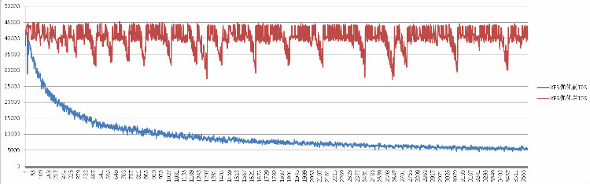

## PostgreSQL on xfs 性能优化 - 2   
                                  
### 作者                                                                               
digoal                             
                                    
### 日期                               
2016-01-06                            
                                
### 标签                             
PostgreSQL , xfs , 性能            
                                  
----                            
                                     
## 背景                           
承接上一篇XFS性能优化。  
  
[《PostgreSQL on xfs 性能优化 - 1》](../201601/20160106_01.md)  
  
本文是对比XFS优化前后的PostgreSQL TPC-B性能。  
  
配置PostgreSQL  
  
数据库参数  
  
```  
listen_addresses='0.0.0.0'  
port=1921  
max_connections=1000  
unix_socket_directories='.'  
shared_buffers=32GB  
maintenance_work_mem=512MB  
autovacuum_work_mem=512MB  
dynamic_shared_memory_type=posix  
bgwriter_delay=10ms  
wal_level=hot_standby  
synchronous_commit=off  
full_page_writes=off  
wal_buffers=16MB  
wal_writer_delay=10ms  
max_wal_size=32GB  
max_wal_senders=10  
max_replication_slots=10  
hot_standby=on  
wal_receiver_status_interval=1s  
hot_standby_feedback=off  
random_page_cost=1.0  
effective_cache_size=256GB  
log_destination='csvlog'  
logging_collector=on  
log_checkpoints=on  
log_connections=on  
log_disconnections=on  
log_error_verbosity=verbose  
log_timezone='PRC'  
datestyle='iso,  
timezone='PRC'  
lc_messages='C'  
lc_monetary='C'  
lc_numeric='C'  
lc_time='C'  
default_text_search_config='pg_catalog.english'  
```  
  
\$PGDATA和pg_xlog都放在XFS文件系统中。  
  
生成测试数据  
  
生成5亿测试数据  
  
```  
pgbench -i -s 5000  
```  
  
## 初始化性能对比  
  
### XFS优化前的统计信息如下  
  
pgbench初始化测试数据时的磁盘iostat  
  
IO落在一块盘上  
  
平均IO响应0.36毫秒，平均IO等待0.87毫秒  
  
```  
avg-cpu:  %user   %nice %system %iowait  %steal   %idle  
           3.60    0.00    1.35    0.19    0.00   94.87  
  
Device:         rrqm/s   wrqm/s     r/s     w/s   rsec/s   wsec/s avgrq-sz avgqu-sz   await  svctm  %util  
sda               0.00     1.00    0.00    4.00     0.00    40.00    10.00     0.00    0.00   0.00   0.00  
sdb               0.00     0.00    0.00    0.00     0.00     0.00     0.00     0.00    0.00   0.00   0.00  
dfa               0.00     0.00    0.00    0.00     0.00     0.00     0.00     0.00    0.00   0.00   0.00  
dfb               0.00     0.00    0.00    0.00     0.00     0.00     0.00     0.00    0.00   0.00   0.00  
dfc               0.00     0.00    0.00  250.00     0.00 206752.00   827.01     0.22    0.86   0.36   9.10  
dm-0              0.00     0.00    0.00  250.00     0.00 206752.00   827.01     0.22    0.87   0.36   9.10  
```  
  
vacuum 时的iostat  
  
IO落在一块盘上  
  
平均IO响应0.28毫秒，平均IO等待26.56毫秒  
  
```  
avg-cpu:  %user   %nice %system %iowait  %steal   %idle  
           1.88    0.00    4.77    0.00    0.00   93.35  
  
Device:         rrqm/s   wrqm/s     r/s     w/s   rsec/s   wsec/s avgrq-sz avgqu-sz   await  svctm  %util  
sda               0.00     0.00    0.00    0.00     0.00     0.00     0.00     0.00    0.00   0.00   0.00  
sdb               0.00     0.00    0.00    0.00     0.00     0.00     0.00     0.00    0.00   0.00   0.00  
dfa               0.00     0.00    0.00    0.00     0.00     0.00     0.00     0.00    0.00   0.00   0.00  
dfb               0.00     0.00    0.00 3211.00     0.00 3280888.00  1021.77    86.20   26.53   0.28  90.20  
dfc               0.00     0.00    0.00    0.00     0.00     0.00     0.00     0.00    0.00   0.00   0.00  
dm-0              0.00     0.00    0.00 3210.00     0.00 3279864.00  1021.76    86.21   26.56   0.28  90.20  
```  
  
  
### XFS优化后的统计信息如下  
  
pgbench初始化测试数据时的磁盘iostat  
  
IO分摊到多快盘上  
  
平均IO响应0.00毫秒，平均IO等待0.01毫秒  
  
```  
avg-cpu:  %user   %nice %system %iowait  %steal   %idle  
           3.57    0.00    2.50    0.03    0.00   93.90  
  
Device:         rrqm/s   wrqm/s     r/s     w/s   rsec/s   wsec/s avgrq-sz avgqu-sz   await  svctm  %util  
sda               0.00     0.00    0.00    0.00     0.00     0.00     0.00     0.00    0.00   0.00   0.00  
sdb               0.00     0.00    0.00    0.00     0.00     0.00     0.00     0.00    0.00   0.00   0.00  
dfa               0.00     0.00    0.00 9262.00     0.00 148096.00    15.99     0.11    0.01   0.01   8.60  
dfb               0.00     0.00    0.00 9243.00     0.00 147888.00    16.00     0.11    0.01   0.01   8.80  
dfc               0.00     0.00    0.00 9256.00     0.00 148096.00    16.00     0.17    0.02   0.01   9.00  
dm-0              0.00     0.00    0.00 27761.00     0.00 444080.00    16.00     0.42    0.01   0.00   9.30  
```  
  
vacuum 时的iostat  
  
IO分摊到多快盘上  
  
平均IO响应0.01毫秒，平均IO等待0.02毫秒  
  
```  
avg-cpu:  %user   %nice %system %iowait  %steal   %idle  
           2.09    0.00   13.57    0.10    0.00   84.25  
  
Device:         rrqm/s   wrqm/s     r/s     w/s   rsec/s   wsec/s avgrq-sz avgqu-sz   await  svctm  %util  
sda               0.00     0.00    0.00    0.00     0.00     0.00     0.00     0.00    0.00   0.00   0.00  
sdb               0.00     0.00    0.00    0.00     0.00     0.00     0.00     0.00    0.00   0.00   0.00  
dfa               0.00     0.00    0.00 52311.00     0.00 836976.00    16.00     0.70    0.01   0.01  63.50  
dfb               0.00     0.00    0.00 52313.00     0.00 837008.00    16.00     0.74    0.01   0.01  66.90  
dfc               0.00     0.00    0.00 52312.00     0.00 836984.00    16.00     1.11    0.02   0.02  94.30  
dm-0              0.00     0.00    0.00 156936.00     0.00 2510952.00    16.00     2.90    0.02   0.01  97.40  
```  
  
  
## 压测性能对比  
  
压测命令  
  
```  
nohup pgbench -M prepared -n -r -P 1 -c 96 -j 96 -T 3600 >./bench.log 2>&1 &  
```  
  
### XFS优化前性能指标  
  
XFS优化前的IOSTAT  
  
未发生检查点时  
  
IO落到一个块设备  
  
平均IO响应0.04毫秒，平均IO等待0.1毫秒  
  
```  
avg-cpu:  %user   %nice %system %iowait  %steal   %idle  
          73.16    0.00   22.17    0.06    0.00    4.61  
  
Device:         rrqm/s   wrqm/s     r/s     w/s   rsec/s   wsec/s avgrq-sz avgqu-sz   await  svctm  %util  
sda               0.00     0.00    0.00    0.00     0.00     0.00     0.00     0.00    0.00   0.00   0.00  
sdb               0.00     0.00    0.00    0.00     0.00     0.00     0.00     0.00    0.00   0.00   0.00  
dfa               0.00     0.00    0.00    0.00     0.00     0.00     0.00     0.00    0.00   0.00   0.00  
dfb               0.00     0.00    0.00  922.00     0.00 12456.00    13.51     0.00    0.00   0.00   0.30  
dfc               0.00     0.00    0.00 3955.00     0.00 131776.00    33.32     0.44    0.11   0.05  18.20  
dm-0              0.00     0.00    0.00 4877.00     0.00 144232.00    29.57     0.47    0.10   0.04  21.00  
```  
  
发生检查点时  
  
IO落到一个块设备  
  
平均IO响应0.03毫秒，平均IO等待0.6毫秒  
  
```  
avg-cpu:  %user   %nice %system %iowait  %steal   %idle  
          72.67    0.00   25.48    0.00    0.00    1.85  
  
Device:         rrqm/s   wrqm/s     r/s     w/s   rsec/s   wsec/s avgrq-sz avgqu-sz   await  svctm  %util  
sda               0.00     0.00    0.00    0.00     0.00     0.00     0.00     0.00    0.00   0.00   0.00  
sdb               0.00     0.00    0.00    0.00     0.00     0.00     0.00     0.00    0.00   0.00   0.00  
dfa               0.00     0.00    0.00    0.00     0.00     0.00     0.00     0.00    0.00   0.00   0.00  
dfb               0.00     0.00    0.00 32539.00     0.00 3184272.00    97.86    20.65    0.63   0.03 100.20  
dfc               0.00     0.00    0.00 2566.00     0.00 84464.00    32.92     0.35    0.14   0.09  22.90  
dm-0              0.00     0.00    0.00 35104.00     0.00 3268672.00    93.11    21.06    0.60   0.03 100.10  
```  
  
tps  
  
```  
transaction type: TPC-B (sort of)  
scaling factor: 5000  
query mode: prepared  
number of clients: 96  
number of threads: 96  
duration: 3600 s  
number of transactions actually processed: 34796111  
latency average: 9.929 ms  
latency stddev: 14.829 ms  
tps = 9664.902474 (including connections establishing)  
tps = 9665.028796 (excluding connections establishing)  
statement latencies in milliseconds:  
        0.006275        \set nbranches 1 * :scale  
        0.001541        \set ntellers 10 * :scale  
        0.001213        \set naccounts 100000 * :scale  
        0.002230        \setrandom aid 1 :naccounts  
        0.001708        \setrandom bid 1 :nbranches  
        0.001497        \setrandom tid 1 :ntellers  
        0.001460        \setrandom delta -5000 5000  
        1.284175        BEGIN;  
        1.139272        UPDATE pgbench_accounts SET abalance = abalance + :delta WHERE aid = :aid;  
        1.012388        SELECT abalance FROM pgbench_accounts WHERE aid = :aid;  
        1.682350        UPDATE pgbench_tellers SET tbalance = tbalance + :delta WHERE tid = :tid;  
        2.705569        UPDATE pgbench_branches SET bbalance = bbalance + :delta WHERE bid = :bid;  
        1.058834        INSERT INTO pgbench_history (tid, bid, aid, delta, mtime) VALUES (:tid, :bid, :aid, :delta, CURRENT_TIMESTAMP);  
        1.015118        END;  
```  
  
### XFS优化后性能指标  
  
未发生检查点时  
  
IO分摊到多快盘上  
  
平均IO响应0.02毫秒，平均IO等待0.02毫秒  
  
```  
avg-cpu:  %user   %nice %system %iowait  %steal   %idle  
          65.34    0.00   26.94    0.00    0.00    7.72  
  
Device:         rrqm/s   wrqm/s     r/s     w/s   rsec/s   wsec/s avgrq-sz avgqu-sz   await  svctm  %util  
sda               0.00     0.00    0.00    0.00     0.00     0.00     0.00     0.00    0.00   0.00   0.00  
sdb               0.00     0.00    0.00    0.00     0.00     0.00     0.00     0.00    0.00   0.00   0.00  
dfa               0.00     0.00    0.00 1428.00     0.00 22832.00    15.99     0.02    0.02   0.02   2.40  
dfb               0.00     0.00    0.00 1417.00     0.00 22672.00    16.00     0.03    0.02   0.02   2.50  
dfc               0.00     0.00    0.00 1417.00     0.00 22672.00    16.00     0.04    0.02   0.02   3.50  
dm-0              0.00     0.00    0.00 4262.00     0.00 68176.00    16.00     0.10    0.02   0.02   9.50  
```  
  
检查点发生时  
  
IO分摊到多快盘上  
  
平均IO响应0.01毫秒，平均IO等待0.02毫秒  
  
```  
avg-cpu:  %user   %nice %system %iowait  %steal   %idle  
          58.82    0.00   35.25    0.00    0.00    5.93  
  
Device:         rrqm/s   wrqm/s     r/s     w/s   rsec/s   wsec/s avgrq-sz avgqu-sz   await  svctm  %util  
sda               0.00     0.00    0.00    0.00     0.00     0.00     0.00     0.00    0.00   0.00   0.00  
sdb               0.00     0.00    0.00    0.00     0.00     0.00     0.00     0.00    0.00   0.00   0.00  
dfa               0.00     0.00    0.00 52709.00     0.00 843272.00    16.00     1.12    0.02   0.01  72.30  
dfb               0.00     0.00    0.00 52632.00     0.00 842048.00    16.00     0.95    0.02   0.01  74.10  
dfc               0.00     0.00    0.00 52805.00     0.00 844832.00    16.00     1.32    0.02   0.02  89.90  
dm-0              0.00     0.00    0.00 158143.00     0.00 2530120.00    16.00     3.72    0.02   0.01  99.50  
```  
  
tps  
  
```  
transaction type: TPC-B (sort of)  
scaling factor: 5000  
query mode: prepared  
number of clients: 96  
number of threads: 96  
duration: 3600 s  
number of transactions actually processed: 144901132  
latency average: 2.381 ms  
latency stddev: 1.571 ms  
tps = 40248.632845 (including connections establishing)  
tps = 40249.214064 (excluding connections establishing)  
statement latencies in milliseconds:  
        0.006825        \set nbranches 1 * :scale  
        0.002457        \set ntellers 10 * :scale  
        0.001856        \set naccounts 100000 * :scale  
        0.003474        \setrandom aid 1 :naccounts  
        0.002448        \setrandom bid 1 :nbranches  
        0.002864        \setrandom tid 1 :ntellers  
        0.003144        \setrandom delta -5000 5000  
        0.220207        BEGIN;  
        0.372330        UPDATE pgbench_accounts SET abalance = abalance + :delta WHERE aid = :aid;  
        0.247961        SELECT abalance FROM pgbench_accounts WHERE aid = :aid;  
        0.301182        UPDATE pgbench_tellers SET tbalance = tbalance + :delta WHERE tid = :tid;  
        0.305694        UPDATE pgbench_branches SET bbalance = bbalance + :delta WHERE bid = :bid;  
        0.247623        INSERT INTO pgbench_history (tid, bid, aid, delta, mtime) VALUES (:tid, :bid, :aid, :delta, CURRENT_TIMESTAMP);  
        0.645872        END;  
```  
  
tps曲线  
  
   
  
  
## 小结  
经过XFS优化，单次IO响应延迟始终保持在0.01毫秒左右，性能表现平稳。  
  
使用了9000个allocation group, fsync时，并行度更高，所以对TPS影响更低了。  
          
  
<a rel="nofollow" href="http://info.flagcounter.com/h9V1"  ></a>  
  
  
  
  
  
  
## [digoal's 大量PostgreSQL文章入口](https://github.com/digoal/blog/blob/master/README.md "22709685feb7cab07d30f30387f0a9ae")
  
