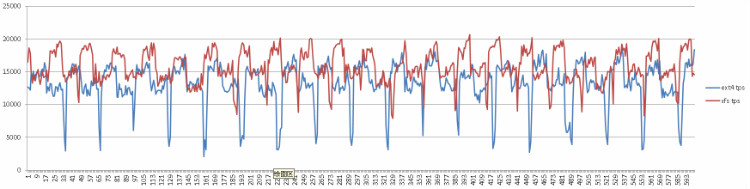

## PostgreSQL on XFS vs EXT4 性能    
                                          
### 作者                                                                                       
digoal                                     
                                            
### 日期                                       
2016-01-07                                    
                                        
### 标签                                     
PostgreSQL , xfs , ext4 , 性能                     
                                          
----                                    
                                             
## 背景                                   
内核版本  
  
```  
3.18.24  
```  
  
系统内存256G。  
  
测试使用了3块PCI-E SSD。  
  
```  
# pvcreate /dev/dfa  
# pvcreate /dev/dfb  
# pvcreate /dev/dfc  
# vgcreate vgdata01 /dev/dfa /dev/dfb /dev/dfc  
# lvcreate -i 3 -I 8 -L 4T -n lv01 aliflash  
# lvcreate -i 3 -I 8 -L 2G -n lv02 aliflash  
```  
  
系统刷脏页内核参数，如下，尽量避免用户进程刷系统脏页。(系统会自动在超过100MB脏页后开始刷脏页。当脏页超过80%的内存时，用户进程才会刷脏页。)  
  
```  
#sysctl -w vm.dirty_background_bytes=102400000  
#sysctl -w vm.dirty_ratio=80  
```  
  
如果不这么设置，EXT4测试时会出现tps=0的阶段，这个时候是用户进程在刷脏页，因为jbd2刷得不够快。  
  
创建EXT4文件系统，使用条带。  
  
```  
# mkfs.ext4 -b 4096 -E stride=2,stripe-width=6 /dev/mapper/aliflash-lv01  
mke2fs 1.41.12 (17-May-2010)  
Discarding device blocks: done                              
Filesystem label=  
OS type: Linux  
Block size=4096 (log=2)  
Fragment size=4096 (log=2)  
Stride=2 blocks, Stripe width=6 blocks  
268443648 inodes, 1073743872 blocks  
53687193 blocks (5.00%) reserved for the super user  
First data block=0  
Maximum filesystem blocks=4294967296  
32769 block groups  
32768 blocks per group, 32768 fragments per group  
8192 inodes per group  
Superblock backups stored on blocks:   
        32768, 98304, 163840, 229376, 294912, 819200, 884736, 1605632, 2654208,   
        4096000, 7962624, 11239424, 20480000, 23887872, 71663616, 78675968,   
        102400000, 214990848, 512000000, 550731776, 644972544  
  
Writing inode tables: done                              
Creating journal (32768 blocks): done  
Writing superblocks and filesystem accounting information: done  
  
This filesystem will be automatically checked every 31 mounts or  
180 days, whichever comes first.  Use tune2fs -c or -i to override.  
```  
  
挂载EXT4文件系统  
  
```  
# mount -o defaults,noatime,nodiratime,discard,nodelalloc,nobarrier /dev/mapper/aliflash-lv01 /data01  
```  
  
创建XFS文件系统，使用条带  
  
```  
# mkfs.xfs -f -b size=4096 -l logdev=/dev/mapper/vgdata01-lv02,size=2136997888,sunit=16 -d agcount=9000,sunit=16,swidth=48 /dev/mapper/vgdata01-lv01   
```  
  
挂载XFS文件系统  
  
```  
# mount -t xfs -o nobarrier,nolargeio,logbsize=262144,noatime,nodiratime,swalloc,logdev=/dev/mapper/vgdata01-lv02 /dev/mapper/vgdata01-lv01 /data01  
```  
  
初始化数据库  
  
```  
initdb -D $PGDATA -E UTF8 --locale=C -U postgres -W  
```  
  
配置数据库参数  
  
```  
postgresql.conf  
port=1921  
max_connections=300  
unix_socket_directories='.'  
shared_buffers=32GB  
maintenance_work_mem=2GB  
dynamic_shared_memory_type=posix  
bgwriter_delay=10ms  
synchronous_commit=off  
wal_writer_delay=10ms  
max_wal_size=32GB  
log_destination='csvlog'  
logging_collector=on  
log_truncate_on_rotation=on  
log_timezone='PRC'  
datestyle='iso, mdy'  
timezone='PRC'  
lc_messages='C'  
lc_monetary='C'  
lc_numeric='C'  
lc_time='C'  
default_text_search_config='pg_catalog.english'  
```  
  
初始化测试数据  
  
```  
pgbench -i -s 5000  
```  
  
xfs耗时  
  
```  
500000000 of 500000000 tuples (100%) done (elapsed 451.46 s, remaining 0.00 s)  
```  
  
ext4耗时  
  
```  
500000000 of 500000000 tuples (100%) done (elapsed 552.96 s, remaining 0.00 s)  
```  
  
数据导入时，XFS优势很明显。  
  
压测tpc-b  
  
```  
nohup pgbench -M prepared -n -r -P 1 -c 96 -j 96 -T 600 >bench.log &  
```  
  
xfs表现  
  
```  
transaction type: TPC-B (sort of)  
scaling factor: 5000  
query mode: prepared  
number of clients: 96  
number of threads: 96  
duration: 600 s  
number of transactions actually processed: 9461961  
latency average: 6.084 ms  
latency stddev: 7.949 ms  
tps = 15765.874525 (including connections establishing)  
tps = 15767.355438 (excluding connections establishing)  
statement latencies in milliseconds:  
        0.006137        \set nbranches 1 * :scale  
        0.002006        \set ntellers 10 * :scale  
        0.001501        \set naccounts 100000 * :scale  
        0.002635        \setrandom aid 1 :naccounts  
        0.001721        \setrandom bid 1 :nbranches  
        0.001623        \setrandom tid 1 :ntellers  
        0.001666        \setrandom delta -5000 5000  
        0.219360        BEGIN;  
        2.035715        UPDATE pgbench_accounts SET abalance = abalance + :delta WHERE aid = :aid;  
        0.243285        SELECT abalance FROM pgbench_accounts WHERE aid = :aid;  
        1.167821        UPDATE pgbench_tellers SET tbalance = tbalance + :delta WHERE tid = :tid;  
        0.785919        UPDATE pgbench_branches SET bbalance = bbalance + :delta WHERE bid = :bid;  
        0.680847        INSERT INTO pgbench_history (tid, bid, aid, delta, mtime) VALUES (:tid, :bid, :aid, :delta, CURRENT_TIMESTAMP);  
        0.916019        END;  
```  
  
ext4表现  
  
```  
transaction type: TPC-B (sort of)  
scaling factor: 5000  
query mode: prepared  
number of clients: 96  
number of threads: 96  
duration: 600 s  
number of transactions actually processed: 7921389  
latency average: 7.268 ms  
latency stddev: 12.104 ms  
tps = 13199.263484 (including connections establishing)  
tps = 13200.414903 (excluding connections establishing)  
statement latencies in milliseconds:  
        0.006100        \set nbranches 1 * :scale  
        0.001954        \set ntellers 10 * :scale  
        0.001445        \set naccounts 100000 * :scale  
        0.002539        \setrandom aid 1 :naccounts  
        0.001651        \setrandom bid 1 :nbranches  
        0.001567        \setrandom tid 1 :ntellers  
        0.001587        \setrandom delta -5000 5000  
        0.229331        BEGIN;  
        2.515092        UPDATE pgbench_accounts SET abalance = abalance + :delta WHERE aid = :aid;  
        0.252870        SELECT abalance FROM pgbench_accounts WHERE aid = :aid;  
        1.455197        UPDATE pgbench_tellers SET tbalance = tbalance + :delta WHERE tid = :tid;  
        0.952964        UPDATE pgbench_branches SET bbalance = bbalance + :delta WHERE bid = :bid;  
        0.817791        INSERT INTO pgbench_history (tid, bid, aid, delta, mtime) VALUES (:tid, :bid, :aid, :delta, CURRENT_TIMESTAMP);  
        1.010413        END;  
```  
  
tps性能曲线  
  
  
   
tpc-b测试xfs性能优势明显。  
  
最后一项测试，使用pg_basebackup备份数据库。  
  
```  
postgresql.conf  
port = 1921                             # (change requires restart)  
max_connections = 300                   # (change requires restart)  
unix_socket_directories = '.'   # comma-separated list of directories  
shared_buffers = 32GB                   # min 128kB  
maintenance_work_mem = 2GB              # min 1MB  
dynamic_shared_memory_type = posix      # the default is the first option  
bgwriter_delay = 10ms                   # 10-10000ms between rounds  
wal_level = hot_standby  # minimal, archive, hot_standby, or logical  
synchronous_commit = off                # synchronization level;  
wal_writer_delay = 10ms         # 1-10000 milliseconds  
max_wal_size = 32GB  
archive_mode = on               # enables archiving; off, on, or always  
archive_command = '/bin/date'           # command to use to archive a logfile segment  
max_wal_senders = 10            # max number of walsender processes  
log_destination = 'csvlog'              # Valid values are combinations of  
logging_collector = on          # Enable capturing of stderr and csvlog  
log_truncate_on_rotation = on           # If on, an existing log file with the  
log_timezone = 'PRC'  
datestyle = 'iso, mdy'  
timezone = 'PRC'  
lc_messages = 'C'                       # locale for system error message  
lc_monetary = 'C'                       # locale for monetary formatting  
lc_numeric = 'C'                        # locale for number formatting  
lc_time = 'C'                           # locale for time formatting  
default_text_search_config = 'pg_catalog.english'  
  
pg_hba.conf  
local   all             all                                     trust  
host    all             all             127.0.0.1/32            trust  
host    all             all             ::1/128                 trust  
local   replication     postgres                                trust  
```  
  
EXT4  
  
```  
$ date +%F%T; pg_basebackup -F p -D /data01/dege.zzz/bak/pgdata -x ; date +%F%T;  
2016-01-0717:31:05  
WARNING:  skipping special file "./.s.PGSQL.1921"  
2016-01-0717:34:37  
  
75GB数据  
353.8MB/s  
```  
  
XFS  
  
```  
date +%F%T; pg_basebackup -F p -D /data01/dege.zzz/bak/pgdata -x ; date +%F%T;  
2016-01-0717:28:14  
WARNING:  skipping special file "./.s.PGSQL.1921"  
2016-01-0717:29:47、  
74GB数据  
  
795.7MB/s  
```  
  
## 小结  
1\. xfs性能明显优于EXT4，而且XFS支持更大的块设备，EXT4只能支持到4TB（更大需要patch）。  
  
2\. XFS还能通过logdev解决cgroup隔离IOPS带来的干扰问题，ext4只能牺牲metadata和data的一致性来解决干扰(data=writeback)。  
  
3\. 备份速度，XFS也是完胜。  
      
  
<a rel="nofollow" href="http://info.flagcounter.com/h9V1"  ></a>  
  
  
  
  
  
  
## [digoal's 大量PostgreSQL文章入口](https://github.com/digoal/blog/blob/master/README.md "22709685feb7cab07d30f30387f0a9ae")
  
