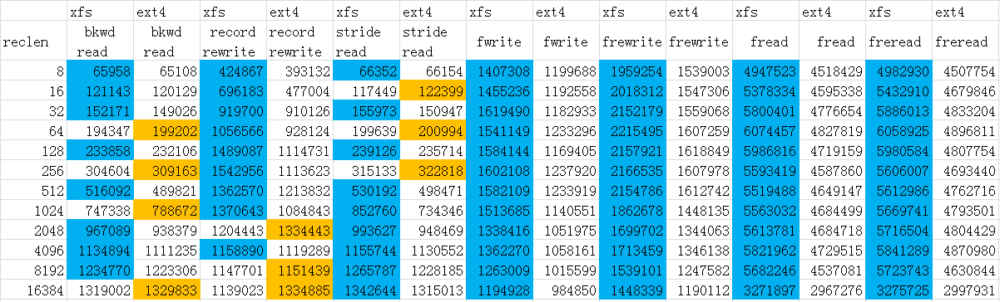
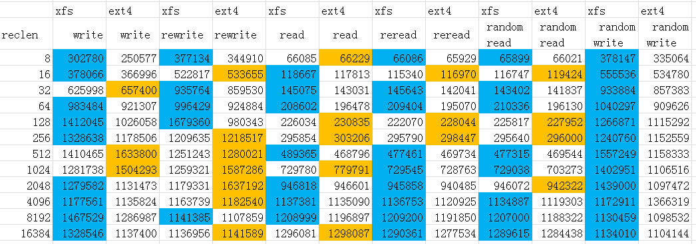

## EXT4 vs XFS us iozone      
                                            
### 作者                                                                                         
digoal                                       
                                              
### 日期                                         
2016-01-07                                      
                                          
### 标签                                       
PostgreSQL , xfs , ext4 , 性能 , iozone                      
                                            
----                                      
                                               
## 背景                                     
之前使用PostgreSQL测试了xfs和ext4在tpc-b方面的性能，XFS完胜。  
  
接下来使用专业的io测试软件iozone测试一下。  
  
安装参考  
  
[《安装iozone on CentOS 7 x64》](../201511/20151130_02.md)  
  
测试case:  
  
2G文件，单个请求8K到16MB分布，测试所有的iozone case，全程使用O_DIRECT。  
  
```  
[root@digoal current]# ./iozone -Ra -I -+u -y 8k -q 16m -g 2G -n 2G -f /data01/test -b /data01/test.wks  
```  
  
详细的参数请参考iozone -h  
  
测试结果如下  
  
```  
./iozone -Ra -I -+u -y 8k -q 16m -g 2G -n 2G -f /data01/test -b /data01/test.wks  
```  
  
附图  
  
蓝色表示XFS胜出  
  
桔色表示EXT4胜出  
  
  
   
  
  
详细报告  
  
XFS  
  
```  
        Iozone: Performance Test of File I/O  
                Version $Revision: 3.434 $  
                Compiled for 64 bit mode.  
                Build: linux-AMD64   
  
        Contributors:William Norcott, Don Capps, Isom Crawford, Kirby Collins  
                     Al Slater, Scott Rhine, Mike Wisner, Ken Goss  
                     Steve Landherr, Brad Smith, Mark Kelly, Dr. Alain CYR,  
                     Randy Dunlap, Mark Montague, Dan Million, Gavin Brebner,  
                     Jean-Marc Zucconi, Jeff Blomberg, Benny Halevy, Dave Boone,  
                     Erik Habbinga, Kris Strecker, Walter Wong, Joshua Root,  
                     Fabrice Bacchella, Zhenghua Xue, Qin Li, Darren Sawyer,  
                     Vangel Bojaxhi, Ben England, Vikentsi Lapa,  
                     Alexey Skidanov.  
  
        Run began: Thu Jan  7 17:59:58 2016  
  
        Excel chart generation enabled  
        Auto Mode  
        O_DIRECT feature enabled  
        CPU utilization Resolution = 0.001 seconds.  
        CPU utilization Excel chart enabled  
        Using Minimum Record Size 8 kB  
        Using Maximum Record Size 16384 kB  
        Using maximum file size of 2097152 kilobytes.  
        Using minimum file size of 2097152 kilobytes.  
        Command line used: ./iozone -Ra -I -+u -y 8k -q 16m -g 2G -n 2G -f /data01/test -b /data01/test.wks  
        Output is in kBytes/sec  
        Time Resolution = 0.000001 seconds.  
        Processor cache size set to 1024 kBytes.  
        Processor cache line size set to 32 bytes.  
        File stride size set to 17 * record size.  
                                                              random    random     bkwd    record    stride                                      
              kB  reclen    write  rewrite    read    reread    read     write     read   rewrite      read   fwrite frewrite    fread  freread  
         2097152       8   302780   377134    66085    66086    65899   378147    65958    424867     66352  1407308  1959254  4947523  4982930  
         2097152      16   378066   522817   118667   115340   116747   555536   121143    696183    117449  1455236  2018312  5378334  5432910  
         2097152      32   625998   935764   145075   145643   143402   933884   152171    919700    155973  1619490  2152179  5800401  5886013  
         2097152      64   983484   996429   208602   209404   210336  1040297   194347   1056566    199639  1541149  2215495  6074457  6058925  
         2097152     128  1412045  1679360   226034   222070   225817  1266871   233858   1489087    239126  1584144  2157921  5986816  5980584  
         2097152     256  1328638  1209635   295854   295790   295640  1240760   304604   1542956    315133  1602108  2166535  5593419  5606007  
         2097152     512  1410465  1251243   489365   477461   477315  1557249   516092   1362570    530192  1582109  2154786  5519488  5612986  
         2097152    1024  1281738  1259321   729780   729545   729038  1402951   747338   1370643    852760  1513685  1862678  5563032  5669741  
         2097152    2048  1279582  1179331   946818   945858   946072  1439000   967089   1204443    993627  1338416  1699702  5613781  5716504  
         2097152    4096  1177561  1163739  1137381  1136753  1134887  1172911  1134894   1158890   1155744  1362270  1713459  5821962  5841289  
         2097152    8192  1467529  1141385  1208999  1209200  1207000  1130459  1234770   1147701   1265787  1263009  1539101  5682246  5723743  
         2097152   16384  1328546  1136956  1296081  1290361  1289615  1134010  1319002   1139023   1342644  1194928  1448339  3271897  3275725  
  
iozone test complete.  
Excel output is below:  
  
"Writer report"  
        "8"  "16"  "32"  "64"  "128"  "256"  "512"  "1024"  "2048"  "4096"  "8192"  "16384"  
"2097152"   302780  378066  625998  983484  1412045  1328638  1410465  1281738  1279582  1177561  1467529  1328546   
  
"Re-writer report"  
        "8"  "16"  "32"  "64"  "128"  "256"  "512"  "1024"  "2048"  "4096"  "8192"  "16384"  
"2097152"   377134  522817  935764  996429  1679360  1209635  1251243  1259321  1179331  1163739  1141385  1136956   
  
"Reader report"  
        "8"  "16"  "32"  "64"  "128"  "256"  "512"  "1024"  "2048"  "4096"  "8192"  "16384"  
"2097152"   66085  118667  145075  208602  226034  295854  489365  729780  946818  1137381  1208999  1296081   
  
"Re-Reader report"  
        "8"  "16"  "32"  "64"  "128"  "256"  "512"  "1024"  "2048"  "4096"  "8192"  "16384"  
"2097152"   66086  115340  145643  209404  222070  295790  477461  729545  945858  1136753  1209200  1290361   
  
"Random read report"  
        "8"  "16"  "32"  "64"  "128"  "256"  "512"  "1024"  "2048"  "4096"  "8192"  "16384"  
"2097152"   65899  116747  143402  210336  225817  295640  477315  729038  946072  1134887  1207000  1289615   
  
"Random write report"  
        "8"  "16"  "32"  "64"  "128"  "256"  "512"  "1024"  "2048"  "4096"  "8192"  "16384"  
"2097152"   378147  555536  933884  1040297  1266871  1240760  1557249  1402951  1439000  1172911  1130459  1134010   
  
"Backward read report"  
        "8"  "16"  "32"  "64"  "128"  "256"  "512"  "1024"  "2048"  "4096"  "8192"  "16384"  
"2097152"   65958  121143  152171  194347  233858  304604  516092  747338  967089  1134894  1234770  1319002   
  
"Record rewrite report"  
        "8"  "16"  "32"  "64"  "128"  "256"  "512"  "1024"  "2048"  "4096"  "8192"  "16384"  
"2097152"   424867  696183  919700  1056566  1489087  1542956  1362570  1370643  1204443  1158890  1147701  1139023   
  
"Stride read report"  
        "8"  "16"  "32"  "64"  "128"  "256"  "512"  "1024"  "2048"  "4096"  "8192"  "16384"  
"2097152"   66352  117449  155973  199639  239126  315133  530192  852760  993627  1155744  1265787  1342644   
  
"Fwrite report"  
        "8"  "16"  "32"  "64"  "128"  "256"  "512"  "1024"  "2048"  "4096"  "8192"  "16384"  
"2097152"   1407308  1455236  1619490  1541149  1584144  1602108  1582109  1513685  1338416  1362270  1263009  1194928   
  
"Re-Fwrite report"  
        "8"  "16"  "32"  "64"  "128"  "256"  "512"  "1024"  "2048"  "4096"  "8192"  "16384"  
"2097152"   1959254  2018312  2152179  2215495  2157921  2166535  2154786  1862678  1699702  1713459  1539101  1448339   
  
"Fread report"  
        "8"  "16"  "32"  "64"  "128"  "256"  "512"  "1024"  "2048"  "4096"  "8192"  "16384"  
"2097152"   4947523  5378334  5800401  6074457  5986816  5593419  5519488  5563032  5613781  5821962  5682246  3271897   
  
"Re-Fread report"  
        "8"  "16"  "32"  "64"  "128"  "256"  "512"  "1024"  "2048"  "4096"  "8192"  "16384"  
"2097152"   4982930  5432910  5886013  6058925  5980584  5606007  5612986  5669741  5716504  5841289  5723743  3275725   
  
"Writer CPU utilization report (Zero values should be ignored)"  
        "8"  "16"  "32"  "64"  "128"  "256"  "512"  "1024"  "2048"  "4096"  "8192"  "16384"  
"2097152"    54.60  60.17  72.35  81.03  87.45  96.28  99.24  99.58 100.00  99.94 100.00  99.85  
  
"Re-writer CPU utilization report (Zero values should be ignored)"  
        "8"  "16"  "32"  "64"  "128"  "256"  "512"  "1024"  "2048"  "4096"  "8192"  "16384"  
"2097152"    41.65  49.19  58.72  79.53  84.88  97.24  99.75  99.85 100.00 100.00 100.00 100.00  
  
"Reader CPU utilization report (Zero values should be ignored)"  
        "8"  "16"  "32"  "64"  "128"  "256"  "512"  "1024"  "2048"  "4096"  "8192"  "16384"  
"2097152"     6.29   9.19   8.98  11.43   8.70  17.45  25.29  44.20  61.47  76.23  83.77  88.55  
  
"Re-Reader CPU utilization report (Zero values should be ignored)"  
        "8"  "16"  "32"  "64"  "128"  "256"  "512"  "1024"  "2048"  "4096"  "8192"  "16384"  
"2097152"     6.31  10.92   8.33  10.67  13.17  17.47  28.20  44.02  61.22  76.02  83.48  88.40  
  
"Random read CPU utilization report (Zero values should be ignored)"  
        "8"  "16"  "32"  "64"  "128"  "256"  "512"  "1024"  "2048"  "4096"  "8192"  "16384"  
"2097152"     6.52  10.29  10.63   9.88   8.71  17.52  28.22  44.01  61.30  75.96  83.35  88.45  
  
"Random write CPU utilization report (Zero values should be ignored)"  
        "8"  "16"  "32"  "64"  "128"  "256"  "512"  "1024"  "2048"  "4096"  "8192"  "16384"  
"2097152"    42.99  49.59  58.69  78.72  88.92  97.14  98.97  99.80  99.61 100.00  99.88 100.00  
  
"Backward read CPU utilization report (Zero values should be ignored)"  
        "8"  "16"  "32"  "64"  "128"  "256"  "512"  "1024"  "2048"  "4096"  "8192"  "16384"  
"2097152"     6.50   8.27   8.79  12.94   8.79  18.04  26.06  44.54  62.80  76.34  84.38  90.53  
  
"Record rewrite CPU utilization report (Zero values should be ignored)"  
        "8"  "16"  "32"  "64"  "128"  "256"  "512"  "1024"  "2048"  "4096"  "8192"  "16384"  
"2097152"    47.12  54.67  60.43  81.31  86.91  96.68  99.08  99.87 100.00 100.00 100.00 100.00  
  
"Stride read CPU utilization report (Zero values should be ignored)"  
        "8"  "16"  "32"  "64"  "128"  "256"  "512"  "1024"  "2048"  "4096"  "8192"  "16384"  
"2097152"     6.53  10.85   9.39  13.30  11.58  17.46  26.67  37.29  64.48  77.26  86.61  92.06  
  
"Fwrite CPU utilization report (Zero values should be ignored)"  
        "8"  "16"  "32"  "64"  "128"  "256"  "512"  "1024"  "2048"  "4096"  "8192"  "16384"  
"2097152"    92.75  99.01  91.39  99.86  99.81  99.95  99.74  99.12  99.95  99.17  99.99  99.95  
  
"Re-Fwrite CPU utilization report (Zero values should be ignored)"  
        "8"  "16"  "32"  "64"  "128"  "256"  "512"  "1024"  "2048"  "4096"  "8192"  "16384"  
"2097152"    99.00  99.25  99.44  98.75  99.72  99.92  94.73  97.81  95.14 100.00  99.81 100.00  
  
"Fread CPU utilization report (Zero values should be ignored)"  
        "8"  "16"  "32"  "64"  "128"  "256"  "512"  "1024"  "2048"  "4096"  "8192"  "16384"  
"2097152"   100.00 100.00 100.00 100.00 100.00 100.00  99.98  99.96 100.00 100.00 100.00 100.00  
  
"Re-Fread CPU utilization report (Zero values should be ignored)"  
        "8"  "16"  "32"  "64"  "128"  "256"  "512"  "1024"  "2048"  "4096"  "8192"  "16384"  
"2097152"   100.00  99.99  99.35  99.95 100.00 100.00 100.00 100.00 100.00 100.00 100.00 100.00  
```  
  
  
EXT4  
  
```  
        Iozone: Performance Test of File I/O  
                Version $Revision: 3.434 $  
                Compiled for 64 bit mode.  
                Build: linux-AMD64   
  
        Contributors:William Norcott, Don Capps, Isom Crawford, Kirby Collins  
                     Al Slater, Scott Rhine, Mike Wisner, Ken Goss  
                     Steve Landherr, Brad Smith, Mark Kelly, Dr. Alain CYR,  
                     Randy Dunlap, Mark Montague, Dan Million, Gavin Brebner,  
                     Jean-Marc Zucconi, Jeff Blomberg, Benny Halevy, Dave Boone,  
                     Erik Habbinga, Kris Strecker, Walter Wong, Joshua Root,  
                     Fabrice Bacchella, Zhenghua Xue, Qin Li, Darren Sawyer,  
                     Vangel Bojaxhi, Ben England, Vikentsi Lapa,  
                     Alexey Skidanov.  
  
        Run began: Thu Jan  7 18:00:06 2016  
  
        Excel chart generation enabled  
        Auto Mode  
        O_DIRECT feature enabled  
        CPU utilization Resolution = 0.001 seconds.  
        CPU utilization Excel chart enabled  
        Using Minimum Record Size 8 kB  
        Using Maximum Record Size 16384 kB  
        Using maximum file size of 2097152 kilobytes.  
        Using minimum file size of 2097152 kilobytes.  
        Command line used: ./iozone -Ra -I -+u -y 8k -q 16m -g 2G -n 2G -f /data01/test -b /data01/test.wks  
        Output is in kBytes/sec  
        Time Resolution = 0.000001 seconds.  
        Processor cache size set to 1024 kBytes.  
        Processor cache line size set to 32 bytes.  
        File stride size set to 17 * record size.  
                                                              random    random     bkwd    record    stride                                      
              kB  reclen    write  rewrite    read    reread    read     write     read   rewrite      read   fwrite frewrite    fread  freread  
         2097152       8   250577   344910    66229    65929    66021   335064    65108    393132     66154  1199688  1539003  4518429  4507754  
         2097152      16   366996   533655   117813   116970   119424   534780   120129    477004    122399  1192558  1547306  4595338  4679846  
         2097152      32   657400   859530   143031   142041   141837   857383   149026    910126    150947  1182933  1559068  4776654  4833204  
         2097152      64   921307   924884   196478   195070   196130   909626   199202    928124    200994  1233296  1607259  4827819  4896811  
         2097152     128  1026058   980343   230835   228044   227952  1115292   232106   1114731    235714  1169405  1618849  4719159  4807754  
         2097152     256  1178506  1218517   303206   298447   296000  1152559   309163   1113623    322818  1237920  1607978  4587860  4693440  
         2097152     512  1633800  1280021   468796   469734   469544  1158333   489821   1213832    498471  1233919  1612742  4649147  4762716  
         2097152    1024  1504293  1587286   779791   728763   703273  1106516   788672   1084843    734346  1140551  1448135  4684499  4793501  
         2097152    2048  1131473  1637192   946601   940485   942322  1097472   938379   1334443    948469  1051975  1344063  4684718  4804429  
         2097152    4096  1135824  1182540  1135090  1120925  1119303  1366319  1111235   1119289   1130552  1058161  1346138  4729515  4870980  
         2097152    8192  1286987  1107859  1196897  1191850  1188322  1098532  1223306   1151439   1228185  1015599  1247582  4537081  4630844  
         2097152   16384  1137400  1141589  1298087  1277534  1284438  1104144  1329833   1334885   1315013   984850  1190112  2967276  2997931  
  
iozone test complete.  
Excel output is below:  
  
"Writer report"  
        "8"  "16"  "32"  "64"  "128"  "256"  "512"  "1024"  "2048"  "4096"  "8192"  "16384"  
"2097152"   250577  366996  657400  921307  1026058  1178506  1633800  1504293  1131473  1135824  1286987  1137400   
  
"Re-writer report"  
        "8"  "16"  "32"  "64"  "128"  "256"  "512"  "1024"  "2048"  "4096"  "8192"  "16384"  
"2097152"   344910  533655  859530  924884  980343  1218517  1280021  1587286  1637192  1182540  1107859  1141589   
  
"Reader report"  
        "8"  "16"  "32"  "64"  "128"  "256"  "512"  "1024"  "2048"  "4096"  "8192"  "16384"  
"2097152"   66229  117813  143031  196478  230835  303206  468796  779791  946601  1135090  1196897  1298087   
  
"Re-Reader report"  
        "8"  "16"  "32"  "64"  "128"  "256"  "512"  "1024"  "2048"  "4096"  "8192"  "16384"  
"2097152"   65929  116970  142041  195070  228044  298447  469734  728763  940485  1120925  1191850  1277534   
  
"Random read report"  
        "8"  "16"  "32"  "64"  "128"  "256"  "512"  "1024"  "2048"  "4096"  "8192"  "16384"  
"2097152"   66021  119424  141837  196130  227952  296000  469544  703273  942322  1119303  1188322  1284438   
  
"Random write report"  
        "8"  "16"  "32"  "64"  "128"  "256"  "512"  "1024"  "2048"  "4096"  "8192"  "16384"  
"2097152"   335064  534780  857383  909626  1115292  1152559  1158333  1106516  1097472  1366319  1098532  1104144   
  
"Backward read report"  
        "8"  "16"  "32"  "64"  "128"  "256"  "512"  "1024"  "2048"  "4096"  "8192"  "16384"  
"2097152"   65108  120129  149026  199202  232106  309163  489821  788672  938379  1111235  1223306  1329833   
  
"Record rewrite report"  
        "8"  "16"  "32"  "64"  "128"  "256"  "512"  "1024"  "2048"  "4096"  "8192"  "16384"  
"2097152"   393132  477004  910126  928124  1114731  1113623  1213832  1084843  1334443  1119289  1151439  1334885   
  
"Stride read report"  
        "8"  "16"  "32"  "64"  "128"  "256"  "512"  "1024"  "2048"  "4096"  "8192"  "16384"  
"2097152"   66154  122399  150947  200994  235714  322818  498471  734346  948469  1130552  1228185  1315013   
  
"Fwrite report"  
        "8"  "16"  "32"  "64"  "128"  "256"  "512"  "1024"  "2048"  "4096"  "8192"  "16384"  
"2097152"   1199688  1192558  1182933  1233296  1169405  1237920  1233919  1140551  1051975  1058161  1015599  984850   
  
"Re-Fwrite report"  
        "8"  "16"  "32"  "64"  "128"  "256"  "512"  "1024"  "2048"  "4096"  "8192"  "16384"  
"2097152"   1539003  1547306  1559068  1607259  1618849  1607978  1612742  1448135  1344063  1346138  1247582  1190112   
  
"Fread report"  
        "8"  "16"  "32"  "64"  "128"  "256"  "512"  "1024"  "2048"  "4096"  "8192"  "16384"  
"2097152"   4518429  4595338  4776654  4827819  4719159  4587860  4649147  4684499  4684718  4729515  4537081  2967276   
  
"Re-Fread report"  
        "8"  "16"  "32"  "64"  "128"  "256"  "512"  "1024"  "2048"  "4096"  "8192"  "16384"  
"2097152"   4507754  4679846  4833204  4896811  4807754  4693440  4762716  4793501  4804429  4870980  4630844  2997931   
  
"Writer CPU utilization report (Zero values should be ignored)"  
        "8"  "16"  "32"  "64"  "128"  "256"  "512"  "1024"  "2048"  "4096"  "8192"  "16384"  
"2097152"    60.64  62.79  72.53  83.28  93.97  98.49  98.76  99.60 100.00 100.00 100.00 100.00  
  
"Re-writer CPU utilization report (Zero values should be ignored)"  
        "8"  "16"  "32"  "64"  "128"  "256"  "512"  "1024"  "2048"  "4096"  "8192"  "16384"  
"2097152"    43.76  51.58  63.94  82.82  93.63  98.48  99.60  99.59  99.90 100.00 100.00 100.00  
  
"Reader CPU utilization report (Zero values should be ignored)"  
        "8"  "16"  "32"  "64"  "128"  "256"  "512"  "1024"  "2048"  "4096"  "8192"  "16384"  
"2097152"     6.81  11.32  11.10  13.06  12.49  13.80  31.00  39.24  64.79  77.93  83.34  89.35  
  
"Re-Reader CPU utilization report (Zero values should be ignored)"  
        "8"  "16"  "32"  "64"  "128"  "256"  "512"  "1024"  "2048"  "4096"  "8192"  "16384"  
"2097152"     6.96  11.72  11.94  14.54  15.86  18.24  31.91  45.01  65.08  78.06  83.25  89.22  
  
"Random read CPU utilization report (Zero values should be ignored)"  
        "8"  "16"  "32"  "64"  "128"  "256"  "512"  "1024"  "2048"  "4096"  "8192"  "16384"  
"2097152"     7.01  10.59  12.14  13.31  15.89  20.20  31.93  47.75  65.28  78.22  83.02  89.32  
  
"Random write CPU utilization report (Zero values should be ignored)"  
        "8"  "16"  "32"  "64"  "128"  "256"  "512"  "1024"  "2048"  "4096"  "8192"  "16384"  
"2097152"    45.04  51.92  63.45  82.84  92.32  98.92  99.47  99.97  99.88 100.00 100.00 100.00  
  
"Backward read CPU utilization report (Zero values should be ignored)"  
        "8"  "16"  "32"  "64"  "128"  "256"  "512"  "1024"  "2048"  "4096"  "8192"  "16384"  
"2097152"     7.37  10.29   9.85   9.81  10.58  15.95  27.47  41.10  64.87  77.82  86.46  91.83  
  
"Record rewrite CPU utilization report (Zero values should be ignored)"  
        "8"  "16"  "32"  "64"  "128"  "256"  "512"  "1024"  "2048"  "4096"  "8192"  "16384"  
"2097152"    52.51  56.54  73.82  84.31  94.46  99.25  99.26  99.53  99.96  99.97 100.00 100.00  
  
"Stride read CPU utilization report (Zero values should be ignored)"  
        "8"  "16"  "32"  "64"  "128"  "256"  "512"  "1024"  "2048"  "4096"  "8192"  "16384"  
"2097152"     6.98  10.55  12.84  14.64  14.86  14.65  28.67  49.69  65.80  77.74  87.26  91.17  
  
"Fwrite CPU utilization report (Zero values should be ignored)"  
        "8"  "16"  "32"  "64"  "128"  "256"  "512"  "1024"  "2048"  "4096"  "8192"  "16384"  
"2097152"    96.92  95.70  95.52  93.15  96.91  92.07  93.77  95.17  98.75  98.81  98.90  98.40  
  
"Re-Fwrite CPU utilization report (Zero values should be ignored)"  
        "8"  "16"  "32"  "64"  "128"  "256"  "512"  "1024"  "2048"  "4096"  "8192"  "16384"  
"2097152"    89.14  89.42  88.62  88.45  88.13  89.37  88.15  90.24  92.71  89.48  92.73  99.08  
  
"Fread CPU utilization report (Zero values should be ignored)"  
        "8"  "16"  "32"  "64"  "128"  "256"  "512"  "1024"  "2048"  "4096"  "8192"  "16384"  
"2097152"    99.97 100.00  99.98 100.00 100.00  99.96  99.96 100.00 100.00 100.00  99.96 100.00  
  
"Re-Fread CPU utilization report (Zero values should be ignored)"  
        "8"  "16"  "32"  "64"  "128"  "256"  "512"  "1024"  "2048"  "4096"  "8192"  "16384"  
"2097152"    99.94  99.96 100.00  99.93  99.95 100.00 100.00 100.00 100.00 100.00  99.94  99.99  
```  
  
  
<a rel="nofollow" href="http://info.flagcounter.com/h9V1"  ></a>  
  
  
  
  
  
  
## [digoal's 大量PostgreSQL文章入口](https://github.com/digoal/blog/blob/master/README.md "22709685feb7cab07d30f30387f0a9ae")
  
