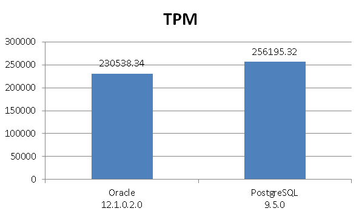
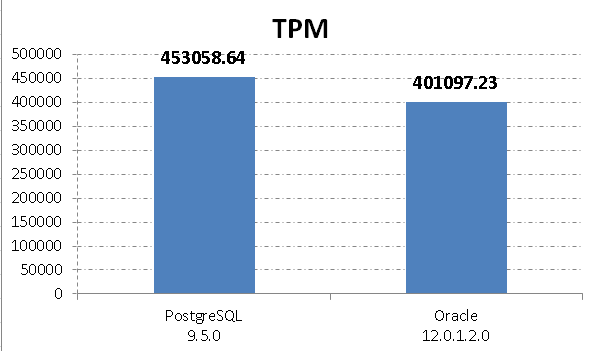
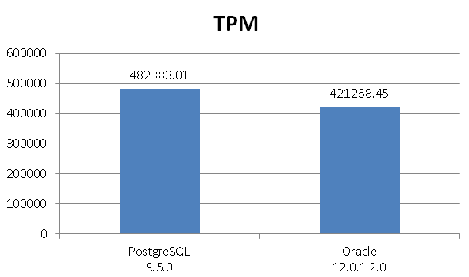

## BenchmarkSQL 测试PostgreSQL 9.5.0 TPC-C 性能        
                                              
### 作者                                                                                           
digoal                                         
                                                
### 日期                                           
2016-01-09                                        
                                            
### 标签                                         
PostgreSQL , benchmarksql , tpc-c                     
                                              
----                                        
                                                 
## 背景                                       
Oracle 12c TPC-C 测试请参考：  
  
[《BenchmarkSQL 测试Oracle 12c TPC-C 性能》](../201512/20151223_02.md)  
  
文件系统为XFS，优化手段如下：  
  
[《PostgreSQL on xfs 性能优化 - 1》](../201601/20160106_01.md)  
  
本文在同样的硬件测试环境下对比PostgreSQL 9.5.0。  
  
我们看看1月7号发布的PostgreSQL 新版本性能咋样？  
  
benchmarkSQL 配置请参考：  
  
[《BenchmarkSQL 测试Oracle 12c TPC-C 性能》](../201512/20151223_02.md)  
  
## 正文  
内核配置  
  
```  
/etc/grub.conf  
numa=off  
elevator=deadline  
```  
  
编译器版本  
  
```  
gcc version 4.4.6 20110731 (Red Hat 4.4.6-3) (GCC)   
```  
  
PostgreSQL编译项  
  
```  
./configure --prefix=/u02/digoal/soft_bak/pgsql9.5 --with-blocksize=8 --with-pgport=1921 --with-perl --with-python --with-tcl --with-openssl --with-pam --with-ldap --with-libxml --with-libxslt --enable-thread-safety  
gmake world -j32  
gmake install-world -j32  
```  
  
配置postgres环境变量  
  
```  
$ vi env_pg.sh   
export PS1="$USER@`/bin/hostname -s`-> "  
export PGPORT=1921  
export PGDATA=/data01/pgdata/pg_root  
export LANG=en_US.utf8  
export PGHOME=/u02/digoal/soft_bak/pgsql9.5  
export LD_LIBRARY_PATH=$PGHOME/lib:/lib64:/usr/lib64:/usr/local/lib64:/lib:/usr/lib:/usr/local/lib:$LD_LIBRARY_PATH  
export DATE=`date +"%Y%m%d%H%M"`  
export PATH=$PGHOME/bin:$PATH:.  
export MANPATH=$PGHOME/share/man:$MANPATH  
export PGHOST=$PGDATA  
export PGDATABASE=postgres  
export PGUSER=postgres  
alias rm='rm -i'  
alias ll='ls -lh'  
unalias vi  
```  
  
配置postgresql.conf  
  
```  
$ vi $PGDATA/postgresql.conf  
port = 1921                             # (change requires restart)  
max_connections = 300                   # (change requires restart)  
unix_socket_directories = '.'   # comma-separated list of directories  
shared_buffers = 32GB                   # min 128kB  
huge_pages = try                       # on, off, or try  
maintenance_work_mem = 2GB              # min 1MB  
dynamic_shared_memory_type = posix      # the default is the first option  
bgwriter_delay = 10ms                   # 10-10000ms between rounds  
wal_level = minimal  # minimal, archive, hot_standby, or logical  
synchronous_commit = off                # synchronization level;  
full_page_writes = off                  # recover from partial page writes  
wal_buffers = 16MB                       # min 32kB, -1 sets based on shared_buffers  
wal_writer_delay = 10ms         # 1-10000 milliseconds  
max_wal_size = 32GB  
effective_cache_size = 240GB  
log_destination = 'csvlog'              # Valid values are combinations of  
logging_collector = on          # Enable capturing of stderr and csvlog  
log_truncate_on_rotation = on           # If on, an existing log file with the  
```  
  
下载最新java版本对应的postgresql jdbc jar  
  
```  
wget https://jdbc.postgresql.org/download/postgresql-9.4.1207.jre7.jar  
mv postgresql-9.4.1207.jre7.jar benchmarksql-4.1.0/lib/  
```  
  
配置benchmarksql，使用新的postgresql java驱动  
  
```  
$ vi runBenchmark.sh   
java -cp .:../lib/postgresql-9.4.1207.jre7.jar:../lib/log4j-1.2.17.jar:../lib/apache-log4j-extras-1.1.jar:../dist/BenchmarkSQL-4.1.jar -Dprop=$1 jTPCC  
  
$ vi runLoader.sh  
java -cp .:../lib/postgresql-9.4.1207.jre7.jar:../dist/BenchmarkSQL-4.1.jar -Dprop=$1 LoadData $2 $3 $4 $5  
  
$ vi runSQL.sh   
myCP="../lib/postgresql-9.4.1207.jre7.jar"  
myCP="$myCP:../dist/BenchmarkSQL-4.1.jar"  
  
myOPTS="-Dprop=$1"  
myOPTS="$myOPTS -DcommandFile=$2"  
  
java -cp .:$myCP $myOPTS ExecJDBC  
```  
  
修改log4j，减少日志打印量。priority改成info，只输出最终结果，不输出产生订单的日志。  
  
```  
$ vi log4j.xml  
<?xml version="1.0" encoding="UTF-8" ?>  
<!DOCTYPE log4j:configuration SYSTEM "log4j.dtd">  
<log4j:configuration xmlns:log4j='http://jakarta.apache.org/log4j/'>  
  
<appender name="console" class="org.apache.log4j.ConsoleAppender">  
<param name="Threshold" value="info"/>  
<layout class="org.apache.log4j.PatternLayout">  
<param name="ConversionPattern" value="%d %5p - %m%n"/>  
</layout>  
</appender>  
  
<appender name="R" class="org.apache.log4j.rolling.RollingFileAppender">  
<param name="Append" value="True" />  
<rollingPolicy class="org.apache.log4j.rolling.TimeBasedRollingPolicy">  
<param name="FileNamePattern" value="log/archive/benchmarksql.%d{yyyyMMddHHmm}.log"/>  
<param name="ActiveFileName" value="log/benchmarksql.log"/>  
</rollingPolicy>  
<triggeringPolicy class="org.apache.log4j.rolling.SizeBasedTriggeringPolicy">  
<param name="MaxFileSize" value="1"/>  
</triggeringPolicy>  
<layout class="org.apache.log4j.PatternLayout">  
<param name="ConversionPattern" value="%5p\t[%d{yyyy-MM-dd HH:mm:ss.SSS}]\t%t \t%m%n"/>  
</layout>  
<filter class="org.apache.log4j.filter.StringMatchFilter">  
<param name="StringToMatch" value ="\n" />  
<param name="AcceptOnMatch" value="false" />  
</filter>  
</appender>  
  
<appender name="E" class="org.apache.log4j.rolling.RollingFileAppender">  
<param name="Append" value="True" />  
<param name="Threshold" value="warn"/>  
<rollingPolicy class="org.apache.log4j.rolling.TimeBasedRollingPolicy">  
<param name="FileNamePattern" value="log/BenchmarkSQLError.%d.log"/>  
<param name="ActiveFileName" value="log/BenchmarkSQLError.log"/>  
</rollingPolicy>  
<layout class="org.apache.log4j.PatternLayout">  
<param name="ConversionPattern" value="%5p\t[%d{yyyy-MM-dd HH:mm:ss.SSS}]\t%t \t%m%n"/>  
</layout>  
</appender>  
  
<root>  
<priority value="info"/>  
<appender-ref ref="R"/>  
<appender-ref ref="E"/>  
</root>  
  
</log4j:configuration>  
```  
  
编辑连接配置和压测配置，与测试Oracle 12c 的保持一致。  
  
1000 个仓库，约5亿数据量。  
  
```  
$ vi props.pg   
driver=org.postgresql.Driver  
conn=jdbc:postgresql://localhost:1921/postgres  
user=postgres  
password=123  
  
warehouses=1000  
terminals=96  
//To run specified transactions per terminal- runMins must equal zero  
runTxnsPerTerminal=0  
//To run for specified minutes- runTxnsPerTerminal must equal zero  
runMins=1  
//Number of total transactions per minute  
limitTxnsPerMin=0  
  
//The following five values must add up to 100  
//The default percentages of 45, 43, 4, 4 & 4 match the TPC-C spec  
newOrderWeight=40  
paymentWeight=36  
orderStatusWeight=8  
deliveryWeight=8  
stockLevelWeight=8  
```  
  
配置postgres用户默认搜索路径  
  
```  
$ psql  
psql (9.5.0)  
Type "help" for help.  
postgres=# alter role postgres set search_path='benchmarksql','public';  
```  
  
创建用于存放生成CSV的目录  
  
```  
$ mkdir /u02/digoal/soft_bak/benchcsv  
```  
  
修改sqlTableCopies，指定目录  
  
```  
$ vi sqlTableCopies   
  
copy benchmarksql.warehouse  
  (w_id, w_ytd, w_tax, w_name, w_street_1, w_street_2, w_city, w_state, w_zip)    
  from '/u02/digoal/soft_bak/benchcsv/warehouse.csv' WITH CSV;  
  
copy benchmarksql.item  
  (i_id, i_name, i_price, i_data, i_im_id)   
  from '/u02/digoal/soft_bak/benchcsv/item.csv' WITH CSV;  
  
copy benchmarksql.stock  
  (s_i_id, s_w_id, s_quantity, s_ytd, s_order_cnt, s_remote_cnt, s_data,  
   s_dist_01, s_dist_02, s_dist_03, s_dist_04, s_dist_05,  
   s_dist_06, s_dist_07, s_dist_08, s_dist_09, s_dist_10)  
  from '/u02/digoal/soft_bak/benchcsv/stock.csv' WITH CSV;  
  
copy benchmarksql.district  
  (d_id, d_w_id, d_ytd, d_tax, d_next_o_id, d_name, d_street_1,  
   d_street_2, d_city, d_state, d_zip)   
  from '/u02/digoal/soft_bak/benchcsv/district.csv' WITH CSV;  
  
copy benchmarksql.customer  
  (c_id, c_d_id, c_w_id, c_discount, c_credit, c_last, c_first, c_credit_lim,   
   c_balance, c_ytd_payment, c_payment_cnt, c_delivery_cnt, c_street_1,   
   c_street_2, c_city, c_state, c_zip, c_phone, c_since, c_middle, c_data)   
  from '/u02/digoal/soft_bak/benchcsv/customer.csv' WITH CSV;  
  
copy benchmarksql.history  
  (hist_id, h_c_id, h_c_d_id, h_c_w_id, h_d_id, h_w_id, h_date, h_amount, h_data)   
  from '/u02/digoal/soft_bak/benchcsv/cust-hist.csv' WITH CSV;  
  
copy benchmarksql.oorder  
  (o_id, o_w_id, o_d_id, o_c_id, o_carrier_id, o_ol_cnt, o_all_local, o_entry_d)   
  from '/u02/digoal/soft_bak/benchcsv/order.csv' WITH CSV;  
  
copy benchmarksql.order_line  
  (ol_w_id, ol_d_id, ol_o_id, ol_number, ol_i_id, ol_delivery_d,   
   ol_amount, ol_supply_w_id, ol_quantity, ol_dist_info)   
  from '/u02/digoal/soft_bak/benchcsv/order-line.csv' WITH CSV;  
  
copy benchmarksql.new_order  
  (no_w_id, no_d_id, no_o_id)    
  from '/u02/digoal/soft_bak/benchcsv/new-order.csv' WITH CSV;  
```  
  
建立表结构  
  
```  
$ cd benchmarksql-4.1.0/run  
$ ./runSQL.sh props.pg sqlTableCreates  
```  
  
生成CSV  
  
```  
$ ./runLoader.sh props.pg numWarehouses 1000 fileLocation /u02/digoal/soft_bak/benchcsv/   
```  
  
1000个仓库的数据量：  
  
```  
total 69G  
-rw-r--r-- 1 digoal users 2.0G Jan  9 15:53 cust-hist.csv  
-rw-r--r-- 1 digoal users  16G Jan  9 15:53 customer.csv  
-rw-r--r-- 1 digoal users 898K Jan  9 15:12 district.csv  
-rw-r--r-- 1 digoal users 7.0M Jan  9 14:22 item.csv  
-rw-r--r-- 1 digoal users  95M Jan  9 16:14 new-order.csv  
-rw-r--r-- 1 digoal users 1.3G Jan  9 16:14 order.csv  
-rw-r--r-- 1 digoal users  22G Jan  9 16:14 order-line.csv  
-rw-r--r-- 1 digoal users  28G Jan  9 15:12 stock.csv  
-rw-r--r-- 1 digoal users  84K Jan  9 14:22 warehouse.csv  
```  
  
导入数据库  
  
```  
$ ./runSQL.sh props.pg sqlTableCopies  
```  
  
创建约束和索引  
  
```  
$ ./runSQL.sh props.pg sqlIndexCreates   
```  
  
备份  
  
```  
$ pg_dump -f /u02/digoal/soft_bak/benchmarksql.dmp -F c -n benchmarksql postgres  
```  
  
压测：  
  
```  
nohup ./runBenchmark.sh props.pg >/dev/null 2>./errrun.log &  
```  
  
测试结果：  
  
```  
 INFO   [2016-01-09 22:03:39.961]       Thread-7        Term-00,   
 INFO   [2016-01-09 22:03:39.963]       Thread-7        Term-00,   
 INFO   [2016-01-09 22:03:39.963]       Thread-7        Term-00, Measured tpmC (NewOrders) = 102494.46  
 INFO   [2016-01-09 22:03:39.963]       Thread-7        Term-00, Measured tpmTOTAL = 256195.32  
 INFO   [2016-01-09 22:03:39.964]       Thread-7        Term-00, Session Start     = 2016-01-09 21:53:39  
 INFO   [2016-01-09 22:03:39.964]       Thread-7        Term-00, Session End       = 2016-01-09 22:03:39  
 INFO   [2016-01-09 22:03:39.964]       Thread-7        Term-00, Transaction Count = 2563088  
```  
  
主机信息，截取压测第9分钟的数据。  
  
TOP  
  
```  
top - 22:02:09 up 3 days, 12:55,  3 users,  load average: 19.23, 15.97, 8.37  
Tasks: 619 total,  10 running, 609 sleeping,   0 stopped,   0 zombie  
Cpu(s): 35.0%us,  9.4%sy,  0.0%ni, 52.6%id,  0.1%wa,  0.0%hi,  2.9%si,  0.0%st  
Mem:  264643396k total, 241719372k used, 22924024k free,    36672k buffers  
Swap: 18825200k total,        0k used, 18825200k free, 196557376k cached  
```  
  
iostat -x  
  
```  
avg-cpu:  %user   %nice %system %iowait  %steal   %idle  
          35.07    0.00   12.30    0.12    0.00   52.51  
Device:         rrqm/s   wrqm/s     r/s     w/s   rsec/s   wsec/s avgrq-sz avgqu-sz   await  svctm  %util  
dfa               0.00     0.00   57.40  743.40   918.40 11849.00    15.94     0.02    0.03   0.03   2.08  
dfb               0.00     0.00   57.20  740.40   915.20 11829.00    15.98     0.02    0.03   0.03   2.04  
dfc               0.00     0.00   58.40  730.80   934.40 11675.80    15.98     0.03    0.03   0.03   2.52  
dm-0              0.00     0.00  173.00 2213.20  2768.00 35331.40    15.97     0.08    0.03   0.03   7.02  
```  
  
Oracle有AWR报告，PostgreSQL可以使用oprofile跟踪统计：  
  
参考  
  
[《PostgreSQL 代码性能诊断之 - OProfile & Systemtap》](../201505/20150509_01.md)  
  
[《Greenplum PostgreSQL --enable-profiling 产生gprof性能诊断代码》](../201601/20160125_01.md)  
  
[《PostgreSQL 源码性能诊断(perf profiling)指南》](../201611/20161129_01.md)  
  
找到需要优化的代码就靠它了。  
  
```  
CPU: Intel Ivy Bridge microarchitecture, speed 2600 MHz (estimated)  
Counted CPU_CLK_UNHALTED events (Clock cycles when not halted) with a unit mask of 0x00 (No unit mask) count 100000  
vma      samples  %        app name                 symbol name  
007a7780 751274    5.1565  /soft/digoal/soft_bak/pgsql9.5/bin/postgres hash_search_with_hash_value  
004a92f0 574315    3.9419  /soft/digoal/soft_bak/pgsql9.5/bin/postgres _bt_compare  
006a4bd0 514473    3.5312  /soft/digoal/soft_bak/pgsql9.5/bin/postgres LWLockAcquire  
0078a090 510962    3.5071  /soft/digoal/soft_bak/pgsql9.5/bin/postgres SearchCatCache  
007bc3a0 484601    3.3262  /soft/digoal/soft_bak/pgsql9.5/bin/postgres AllocSetAlloc  
006969c0 442341    3.0361  /soft/digoal/soft_bak/pgsql9.5/bin/postgres GetSnapshotData  
00498930 352134    2.4170  /soft/digoal/soft_bak/pgsql9.5/bin/postgres heap_hot_search_buffer  
005b8f70 279718    1.9199  /soft/digoal/soft_bak/pgsql9.5/bin/postgres ExecInitExpr  
006895d0 249377    1.7117  /soft/digoal/soft_bak/pgsql9.5/bin/postgres PinBuffer  
006a4220 168770    1.1584  /soft/digoal/soft_bak/pgsql9.5/bin/postgres LWLockRelease  
007ac620 161861    1.1110  /soft/digoal/soft_bak/pgsql9.5/bin/postgres pg_encoding_mbcliplen  
007a2180 161090    1.1057  /soft/digoal/soft_bak/pgsql9.5/bin/postgres FunctionCall2Coll  
004aaa80 153079    1.0507  /soft/digoal/soft_bak/pgsql9.5/bin/postgres _bt_checkkeys  
007a3950 147078    1.0095  /soft/digoal/soft_bak/pgsql9.5/bin/postgres fmgr_info_cxt_security  
0049bce0 136680    0.9381  /soft/digoal/soft_bak/pgsql9.5/bin/postgres heap_page_prune_opt  
0048c8f0 130807    0.8978  /soft/digoal/soft_bak/pgsql9.5/bin/postgres hash_any  
006b2e50 130564    0.8962  /soft/digoal/soft_bak/pgsql9.5/bin/postgres PostgresMain  
0046c790 121776    0.8358  /soft/digoal/soft_bak/pgsql9.5/bin/postgres slot_deform_tuple  
......  
```  
  
## 阶段1  
  
（测试程序和数据库在同一主机）PostgreSQL 9.5.0 对比 Oracle 12c TPC-C tpm对比如下：  
  
  
  
测试数据仅供参考。  
  
使用benchmarksql测试，系统还有大量空闲CPU，IO资源，所以性能应该不止于此。预计PostgreSQL可到50W tpm。  
  
有兴趣的童鞋可以使用load runner或者sysbench或其他工具再测试一下。  
  
------------------------------------------------------------------------------------------------------------  
  
特别感谢给Oracle优化支招的Oracle圈子的兄弟姐妹们。  
  
优化中，期待Oracle更好的表现。  
  
AWR报告截图见：  
  
[《BenchmarkSQL 测试Oracle 12c TPC-C 性能》](../201512/20151223_02.md)  
  
------------------------------------------------------------------------------------------------------------  
  
  
## 阶段2  
benchmarksql放到另一台主机，主机间万兆网同一交换机下互联。  
  
参考  
  
[《BenchmarkSQL 支持多个 schema》](../201601/20160110_01.md)  
  
------------------------------------------------------------------------------------------------------------  
  
为了突破测试程序的极限，开4个schema，每个schema负责1000个仓库，数据量总共20亿左右，数据量400GB。  
  
每个测试程序对付一个schema。  
  
终端数保持一致，每个测试程序开24个终端，一共96个终端。  
  
测试数据量  
  
```  
postgres=# \l+  
                                                               List of databases  
   Name    |  Owner   | Encoding | Collate | Ctype |   Access privileges   |  Size   | Tablespace |                Description                   
-----------+----------+----------+---------+-------+-----------------------+---------+------------+--------------------------------------------  
 test01    | test01   | UTF8     | C       | C     |                       | 100 GB  | pg_default |   
 test02    | test02   | UTF8     | C       | C     |                       | 100 GB  | pg_default |   
 test03    | test03   | UTF8     | C       | C     |                       | 100 GB  | pg_default |   
 test04    | test04   | UTF8     | C       | C     |                       | 100 GB  | pg_default |   
```  
  
benchmarksql软件目录  
  
```  
$ ll  
drwxr-xr-x 7 digoal users 4.0K Jan 10 14:41 benchmarksql-4.1.0_pg01  
drwxr-xr-x 7 digoal users 4.0K Jan 10 14:41 benchmarksql-4.1.0_pg02  
drwxr-xr-x 7 digoal users 4.0K Jan 10 14:41 benchmarksql-4.1.0_pg03  
drwxr-xr-x 7 digoal users 4.0K Jan 10 14:41 benchmarksql-4.1.0_pg04  
```  
  
测试  
  
```  
cd benchmarksql-4.1.0_pg01/run  
nohup ./runBenchmark.sh props.pg >/dev/null 2>./errrun.log &  
cd ../../benchmarksql-4.1.0_pg02/run  
nohup ./runBenchmark.sh props.pg >/dev/null 2>./errrun.log &  
cd ../../benchmarksql-4.1.0_pg03/run  
nohup ./runBenchmark.sh props.pg >/dev/null 2>./errrun.log &  
cd ../../benchmarksql-4.1.0_pg04/run  
nohup ./runBenchmark.sh props.pg >/dev/null 2>./errrun.log &  
cd ../..  
```  
  
测试结果  
  
```  
$ cat benchmarksql-4.1.0_pg01/run/log/benchmarksql.log   
 INFO   [2016-01-10 17:54:04.925]       Thread-22       Term-00, Measured tpmC (NewOrders) = 45416.28  
 INFO   [2016-01-10 17:54:04.925]       Thread-22       Term-00, Measured tpmTOTAL = 113487.61  
 INFO   [2016-01-10 17:54:04.925]       Thread-22       Term-00, Session Start     = 2016-01-10 17:44:04  
 INFO   [2016-01-10 17:54:04.925]       Thread-22       Term-00, Session End       = 2016-01-10 17:54:04  
 INFO   [2016-01-10 17:54:04.925]       Thread-22       Term-00, Transaction Count = 1134913  
$ cat benchmarksql-4.1.0_pg02/run/log/benchmarksql.log   
 INFO   [2016-01-10 17:54:04.943]       Thread-12       Term-00, Measured tpmC (NewOrders) = 45292.48  
 INFO   [2016-01-10 17:54:04.943]       Thread-12       Term-00, Measured tpmTOTAL = 113269.54  
 INFO   [2016-01-10 17:54:04.943]       Thread-12       Term-00, Session Start     = 2016-01-10 17:44:04  
 INFO   [2016-01-10 17:54:04.944]       Thread-12       Term-00, Session End       = 2016-01-10 17:54:04  
 INFO   [2016-01-10 17:54:04.944]       Thread-12       Term-00, Transaction Count = 1132770  
$ cat benchmarksql-4.1.0_pg03/run/log/benchmarksql.log   
 INFO   [2016-01-10 17:54:04.955]       Thread-12       Term-00, Measured tpmC (NewOrders) = 45336.15  
 INFO   [2016-01-10 17:54:04.955]       Thread-12       Term-00, Measured tpmTOTAL = 113247.19  
 INFO   [2016-01-10 17:54:04.956]       Thread-12       Term-00, Session Start     = 2016-01-10 17:44:04  
 INFO   [2016-01-10 17:54:04.956]       Thread-12       Term-00, Session End       = 2016-01-10 17:54:04  
 INFO   [2016-01-10 17:54:04.956]       Thread-12       Term-00, Transaction Count = 1132537  
$ cat benchmarksql-4.1.0_pg04/run/log/benchmarksql.log   
 INFO   [2016-01-10 17:54:04.986]       Thread-23       Term-00, Measured tpmC (NewOrders) = 45231.67  
 INFO   [2016-01-10 17:54:04.987]       Thread-23       Term-00, Measured tpmTOTAL = 113054.3  
 INFO   [2016-01-10 17:54:04.987]       Thread-23       Term-00, Session Start     = 2016-01-10 17:44:04  
 INFO   [2016-01-10 17:54:04.987]       Thread-23       Term-00, Session End       = 2016-01-10 17:54:04  
 INFO   [2016-01-10 17:54:04.987]       Thread-23       Term-00, Transaction Count = 1130640  
  
TPM ：   
113487.61 + 113269.54 + 113247.19 + 113054.3 =  453058.64  
```  
  
第9分钟操作系统统计信息  
  
```  
TOP  
top - 17:38:27 up 4 days,  8:32,  4 users,  load average: 78.54, 68.64, 37.22  
Tasks: 658 total,  34 running, 624 sleeping,   0 stopped,   0 zombie  
Cpu(s): 70.2%us, 15.7%sy,  0.0%ni,  5.5%id,  1.5%wa,  0.0%hi,  7.1%si,  0.0%st  
Mem:  264643396k total, 229866068k used, 34777328k free,    59652k buffers  
Swap: 18825200k total,        0k used, 18825200k free, 183529592k cached  
  
iostat -x  
avg-cpu:  %user   %nice %system %iowait  %steal   %idle  
          71.39    0.00   22.47    1.26    0.00    4.88  
Device:         rrqm/s   wrqm/s     r/s     w/s   rsec/s   wsec/s avgrq-sz avgqu-sz   await  svctm  %util  
dfa               0.00     0.00 3659.33 7008.67 58538.67 112050.67    15.99     5.85    0.55   0.06  68.17  
dfb               0.00     0.00 3714.67 6888.67 59418.67 110173.33    15.99     5.98    0.56   0.06  67.87  
dfc               0.00     0.00 3709.00 6974.33 59328.00 111504.00    15.99     5.63    0.52   0.07  71.60  
dm-0              0.00     0.00 11083.00 20870.33 177285.33 333706.67    15.99    17.60    0.55   0.03  92.10  
```  
  
测试过程oprofile报告  
  
```  
#/home/digoal/oprof/bin/opreport -l -f -w -x -t 0.5  
Using /soft/digoal/soft_bak/oprof_test/oprofile_data/samples/ for samples directory.  
  
WARNING! Some of the events were throttled. Throttling occurs when  
the initial sample rate is too high, causing an excessive number of  
interrupts.  Decrease the sampling frequency. Check the directory  
/soft/digoal/soft_bak/oprof_test/oprofile_data/samples/current/stats/throttled  
for the throttled event names.  
  
CPU: Intel Ivy Bridge microarchitecture, speed 2600 MHz (estimated)  
Counted CPU_CLK_UNHALTED events (Clock cycles when not halted) with a unit mask of 0x00 (No unit mask) count 100000  
vma      samples  %        app name                 symbol name  
007a7780 2632700   5.2511  /soft/digoal/soft_bak/pgsql9.5/bin/postgres hash_search_with_hash_value  
004a92f0 1895924   3.7816  /soft/digoal/soft_bak/pgsql9.5/bin/postgres _bt_compare  
006969c0 1844371   3.6787  /soft/digoal/soft_bak/pgsql9.5/bin/postgres GetSnapshotData  
0078a090 1775031   3.5404  /soft/digoal/soft_bak/pgsql9.5/bin/postgres SearchCatCache  
006a4bd0 1725350   3.4413  /soft/digoal/soft_bak/pgsql9.5/bin/postgres LWLockAcquire  
007bc3a0 1565190   3.1219  /soft/digoal/soft_bak/pgsql9.5/bin/postgres AllocSetAlloc  
00498930 1406694   2.8058  /soft/digoal/soft_bak/pgsql9.5/bin/postgres heap_hot_search_buffer  
005b8f70 965646    1.9261  /soft/digoal/soft_bak/pgsql9.5/bin/postgres ExecInitExpr  
006895d0 767078    1.5300  /soft/digoal/soft_bak/pgsql9.5/bin/postgres PinBuffer  
004aaa80 617741    1.2321  /soft/digoal/soft_bak/pgsql9.5/bin/postgres _bt_checkkeys  
007a2180 588043    1.1729  /soft/digoal/soft_bak/pgsql9.5/bin/postgres FunctionCall2Coll  
006a4220 575864    1.1486  /soft/digoal/soft_bak/pgsql9.5/bin/postgres LWLockRelease  
007ac620 485162    0.9677  /soft/digoal/soft_bak/pgsql9.5/bin/postgres pg_encoding_mbcliplen  
007a3950 471102    0.9396  /soft/digoal/soft_bak/pgsql9.5/bin/postgres fmgr_info_cxt_security  
0046c790 441548    0.8807  /soft/digoal/soft_bak/pgsql9.5/bin/postgres slot_deform_tuple  
0048c8f0 425867    0.8494  /soft/digoal/soft_bak/pgsql9.5/bin/postgres hash_any  
006b2e50 404548    0.8069  /soft/digoal/soft_bak/pgsql9.5/bin/postgres PostgresMain  
007bd0f0 396510    0.7909  /soft/digoal/soft_bak/pgsql9.5/bin/postgres palloc  
0049bce0 394201    0.7863  /soft/digoal/soft_bak/pgsql9.5/bin/postgres heap_page_prune_opt  
007bce00 353243    0.7046  /soft/digoal/soft_bak/pgsql9.5/bin/postgres pfree  
0049b300 335896    0.6700  /soft/digoal/soft_bak/pgsql9.5/bin/postgres heap_page_prune  
0046c580 313145    0.6246  /soft/digoal/soft_bak/pgsql9.5/bin/postgres heap_getsysattr  
006b14a0 311776    0.6219  /soft/digoal/soft_bak/pgsql9.5/bin/postgres exec_bind_message  
007cb070 292106    0.5826  /soft/digoal/soft_bak/pgsql9.5/bin/postgres HeapTupleSatisfiesMVCC  
007bd210 275282    0.5491  /soft/digoal/soft_bak/pgsql9.5/bin/postgres MemoryContextAllocZeroAligned  
005b8530 273199    0.5449  /soft/digoal/soft_bak/pgsql9.5/bin/postgres ExecProject  
00494ba0 266495    0.5315  /soft/digoal/soft_bak/pgsql9.5/bin/postgres heap_update  
007bca10 265556    0.5297  /soft/digoal/soft_bak/pgsql9.5/bin/postgres AllocSetFree  
```  
  
第二阶段Oracle 12.1.0.2.0和PostgreSQL 9.5.0 TPM 对比  
  
  
  
------------------------------------------------------------------------------------------------------------  
  
## 阶段3  
开启PostgreSQL   
  
预读, -- (n-1), n是条带数, 所以本例case effective_io_concurrency = 2  
  
大页支持,  开到168G;    
  
```  
/etc/sysctl.conf  
vm.nr_hugepages = 102352  
sysctl -p  
/etc/security/limits.conf  
*   soft   memlock    250000000  
*   hard   memlock    250000000  
```  
  
memlock    大于  nr_hugepages   大于  shared_buffers   
  
分组提交, commit_delay = 10, commit_siblings = 16  
  
[《PostgreSQL hugepage 支持》](../201601/20160111_01.md)  
  
```  
shared_buffers = 164GB                   # min 128kB  
huge_pages = on                       # on, off, or try  
maintenance_work_mem = 2GB              # min 1MB  
wal_buffers = 16MB                       # min 32kB, -1 sets based on shared_buffers  
wal_writer_delay = 10ms         # 1-10000 milliseconds  
commit_delay = 10                       # range 0-100000, in microseconds  
commit_siblings = 16                    # range 1-1000  
checkpoint_timeout = 35min              # range 30s-1h  
max_wal_size = 320GB  
checkpoint_completion_target = 0.8     # checkpoint target duration, 0.0 - 1.0  
effective_cache_size = 240GB  
log_destination = 'csvlog'              # Valid values are combinations of  
logging_collector = on          # Enable capturing of stderr and csvlog  
log_truncate_on_rotation = on           # If on, an existing log file with the  
```  
  
测试结果：  
  
```  
$tail -n 5 benchmarksql-4.1.0_pg01/run/log/benchmarksql.log   
 INFO   [2016-01-11 13:33:55.917]       Thread-14       Term-00, Measured tpmC (NewOrders) = 48151.07  
 INFO   [2016-01-11 13:33:55.917]       Thread-14       Term-00, Measured tpmTOTAL = 120215.48  
 INFO   [2016-01-11 13:33:55.917]       Thread-14       Term-00, Session Start     = 2016-01-11 13:23:55  
 INFO   [2016-01-11 13:33:55.917]       Thread-14       Term-00, Session End       = 2016-01-11 13:33:55  
 INFO   [2016-01-11 13:33:55.917]       Thread-14       Term-00, Transaction Count = 1202222  
  
$tail -n 5 benchmarksql-4.1.0_pg02/run/log/benchmarksql.log   
 INFO   [2016-01-11 13:33:55.971]       Thread-16       Term-00, Measured tpmC (NewOrders) = 48505.54  
 INFO   [2016-01-11 13:33:55.971]       Thread-16       Term-00, Measured tpmTOTAL = 121182.26  
 INFO   [2016-01-11 13:33:55.971]       Thread-16       Term-00, Session Start     = 2016-01-11 13:23:55  
 INFO   [2016-01-11 13:33:55.972]       Thread-16       Term-00, Session End       = 2016-01-11 13:33:55  
 INFO   [2016-01-11 13:33:55.972]       Thread-16       Term-00, Transaction Count = 1211858  
  
$tail -n 5 benchmarksql-4.1.0_pg03/run/log/benchmarksql.log   
 INFO   [2016-01-11 13:33:55.985]       Thread-4        Term-00, Measured tpmC (NewOrders) = 48119.61  
 INFO   [2016-01-11 13:33:55.985]       Thread-4        Term-00, Measured tpmTOTAL = 120523.98  
 INFO   [2016-01-11 13:33:55.985]       Thread-4        Term-00, Session Start     = 2016-01-11 13:23:55  
 INFO   [2016-01-11 13:33:55.985]       Thread-4        Term-00, Session End       = 2016-01-11 13:33:55  
 INFO   [2016-01-11 13:33:55.985]       Thread-4        Term-00, Transaction Count = 1205271  
  
$tail -n 5 benchmarksql-4.1.0_pg04/run/log/benchmarksql.log   
 INFO   [2016-01-11 13:33:55.958]       Thread-21       Term-00, Measured tpmC (NewOrders) = 48087.55  
 INFO   [2016-01-11 13:33:55.958]       Thread-21       Term-00, Measured tpmTOTAL = 120461.29  
 INFO   [2016-01-11 13:33:55.958]       Thread-21       Term-00, Session Start     = 2016-01-11 13:23:55  
 INFO   [2016-01-11 13:33:55.958]       Thread-21       Term-00, Session End       = 2016-01-11 13:33:55  
 INFO   [2016-01-11 13:33:55.958]       Thread-21       Term-00, Transaction Count = 1204638  
TPM:  
120215.48 + 121182.26 + 120523.98 + 120461.29 = 482383.01  
```  
  
  
  
------------------------------------------------------------------------------------------------------------  
  
## 阶段4  
优化分组提交的时延，最小结束点并发事务数量，work_mem等。  
  
操作系统优化，  
  
```  
优化老化脏页刷新间隔  
vm.dirty_writeback_centisecs=10  
  
优化老化脏页阈值  
vm.dirty_expire_centisecs=6000  
  
优化用户进程刷脏页阈值  
vm.dirty_ratio=80  
  
优化内核进程刷脏页阈值  
vm.dirty_background_bytes=102400000  
```  
  
优化终端数，每个benchmarksql 20个终端，一共80个终端。  
  
```  
psql  
\c test01 test01  
explain analyze select * from customer; explain analyze select * from stock;  
\c test02 test02  
explain analyze select * from customer; explain analyze select * from stock;  
\c test03 test03  
explain analyze select * from customer; explain analyze select * from stock;  
\c test04 test04  
explain analyze select * from customer; explain analyze select * from stock;  
  
  
listen_addresses = '0.0.0.0'         # what IP address(es) to listen on;  
port = 1921                             # (change requires restart)  
max_connections = 300                   # (change requires restart)  
unix_socket_directories = '.'   # comma-separated list of directories  
shared_buffers = 164GB                   # min 128kB  
huge_pages = on                       # on, off, or try  
work_mem = 256MB                         # min 64kB  
maintenance_work_mem = 2GB              # min 1MB  
autovacuum_work_mem = 2GB               # min 1MB, or -1 to use maintenance_work_mem  
dynamic_shared_memory_type = mmap      # the default is the first option  
vacuum_cost_delay = 10                  # 0-100 milliseconds  
vacuum_cost_limit = 10000                # 1-10000 credits  
bgwriter_delay = 10ms                   # 10-10000ms between rounds  
bgwriter_lru_maxpages = 1000            # 0-1000 max buffers written/round  
bgwriter_lru_multiplier = 10.0          # 0-10.0 multipler on buffers scanned/round  
effective_io_concurrency = 2           # 1-1000; 0 disables prefetching  
wal_level = minimal  # minimal, archive, hot_standby, or logical  
synchronous_commit = off                # synchronization level;  
full_page_writes = off                  # recover from partial page writes  
wal_buffers = 1GB                       # min 32kB, -1 sets based on shared_buffers  
wal_writer_delay = 10ms         # 1-10000 milliseconds  
commit_delay = 10                       # range 0-100000, in microseconds  
commit_siblings = 6                    # range 1-1000  
checkpoint_timeout = 55min              # range 30s-1h  
max_wal_size = 320GB  
checkpoint_completion_target = 0.99     # checkpoint target duration, 0.0 - 1.0  
random_page_cost = 1.0                 # same scale as above  
effective_cache_size = 240GB  
log_destination = 'csvlog'              # Valid values are combinations of  
logging_collector = on          # Enable capturing of stderr and csvlog  
log_truncate_on_rotation = on           # If on, an existing log file with the  
log_timezone = 'PRC'  
update_process_title = off  
track_activities = off  
autovacuum = on                        # Enable autovacuum subprocess?  'on'  
  
  
pg_ctl restart  
```  
  
测试结果  
  
```  
$ tail -n 5 benchmarksql-4.1.0_pg01/run/log/benchmarksql.log   
 INFO   [2016-01-12 11:55:09.461]       Thread-12       Term-00, Measured tpmC (NewOrders) = 57995.55  
 INFO   [2016-01-12 11:55:09.461]       Thread-12       Term-00, Measured tpmTOTAL = 144975.59  
 INFO   [2016-01-12 11:55:09.461]       Thread-12       Term-00, Session Start     = 2016-01-12 11:45:09  
 INFO   [2016-01-12 11:55:09.461]       Thread-12       Term-00, Session End       = 2016-01-12 11:55:09  
 INFO   [2016-01-12 11:55:09.462]       Thread-12       Term-00, Transaction Count = 1449796  
$ tail -n 5 benchmarksql-4.1.0_pg02/run/log/benchmarksql.log   
 INFO   [2016-01-12 11:55:09.499]       Thread-0        Term-00, Measured tpmC (NewOrders) = 58013.75  
 INFO   [2016-01-12 11:55:09.499]       Thread-0        Term-00, Measured tpmTOTAL = 145006.74  
 INFO   [2016-01-12 11:55:09.499]       Thread-0        Term-00, Session Start     = 2016-01-12 11:45:09  
 INFO   [2016-01-12 11:55:09.500]       Thread-0        Term-00, Session End       = 2016-01-12 11:55:09  
 INFO   [2016-01-12 11:55:09.500]       Thread-0        Term-00, Transaction Count = 1450110  
$ tail -n 5 benchmarksql-4.1.0_pg03/run/log/benchmarksql.log   
 INFO   [2016-01-12 11:55:09.541]       Thread-14       Term-00, Measured tpmC (NewOrders) = 57322.05  
 INFO   [2016-01-12 11:55:09.541]       Thread-14       Term-00, Measured tpmTOTAL = 143227.03  
 INFO   [2016-01-12 11:55:09.542]       Thread-14       Term-00, Session Start     = 2016-01-12 11:45:09  
 INFO   [2016-01-12 11:55:09.542]       Thread-14       Term-00, Session End       = 2016-01-12 11:55:09  
 INFO   [2016-01-12 11:55:09.542]       Thread-14       Term-00, Transaction Count = 1432298  
$ tail -n 5 benchmarksql-4.1.0_pg04/run/log/benchmarksql.log   
 INFO   [2016-01-12 11:55:09.574]       Thread-7        Term-00, Measured tpmC (NewOrders) = 57863.92  
 INFO   [2016-01-12 11:55:09.574]       Thread-7        Term-00, Measured tpmTOTAL = 144596.45  
 INFO   [2016-01-12 11:55:09.575]       Thread-7        Term-00, Session Start     = 2016-01-12 11:45:09  
 INFO   [2016-01-12 11:55:09.575]       Thread-7        Term-00, Session End       = 2016-01-12 11:55:09  
 INFO   [2016-01-12 11:55:09.575]       Thread-7        Term-00, Transaction Count = 1445978  
  
TPM：  
144975.59 + 145006.74 + 143227.03 + 144596.45 = 577805.81  
```  
  
------------------------------------------------------------------------------------------------------------  
## 阶段5  
  
编译器版本更新或使用其他编译器  
  
INTEL编译器  
  
CLANG编译器  
  
下载新版本gcc  
  
https://gcc.gnu.org/mirrors.html  
  
解压  
  
```  
#tar -xvzf gcc-4.9.3.tar.gz  
#cd gcc-4.9.3  
```  
  
下载依赖包  
  
```  
./contrib/download_prerequisites  
```  
  
安装依赖包  
  
```  
cd contrib  
drwxr-xr-x 16 digoal users    4096 Jan 12 17:11 gmp-4.3.2  
drwxr-xr-x  7 digoal users   20480 Jan 12 17:14 mpfr-2.4.2  
drwxr-xr-x  5 digoal users    4096 Jan 12 17:15 mpc-0.8.1  
drwxr-xr-x  9 digoal users   20480 Jan 12 17:18 isl-0.12.2  
drwxr-xr-x 15 digoal users    4096 Jan 12 17:20 cloog-0.18.1  
  
cd  
tar -jxvf gmp-4.3.2.tar.bz2   
cd gmp-4.3.2  
./configure --prefix=/home/digoal/gmp  
make -j 32 && make install  
cd ..  
  
tar -jxvf mpfr-2.4.2.tar.bz2  
cd mpfr-2.4.2  
./configure --prefix=/home/digoal/mpfr --with-gmp-include=/home/digoal/gmp/include --with-gmp-lib=/home/digoal/gmp/lib  
make -j 32 && make install  
cd ..  
  
tar -zxvf mpc-0.8.1.tar.gz   
cd mpc-0.8.1  
./configure --prefix=/home/digoal/mpc --with-gmp=/home/digoal/gmp --with-mpfr=/home/digoal/mpfr  
make -j 32 && make install  
cd ..  
  
tar -jxvf isl-0.12.2.tar.bz2   
cd isl-0.12.2  
./configure --prefix=/home/digoal/isl --with-gmp-prefix=/home/digoal/gmp  
make -j 32 && make install -j 32  
cd ..  
  
tar -zxvf cloog-0.18.1.tar.gz   
cd cloog-0.18.1  
./configure --prefix=/home/digoal/cloog --with-isl-prefix=/home/digoal/isl --with-gmp-prefix=/home/digoal/gmp  
make && make install  
cd ..  
  
tar -jxvf gcc-4.9.3.tar.bz2  
cd gcc-4.9.3.tar  
./configure --prefix=/home/digoal/gcc4.9.3 --with-mpc=/home/digoal/mpc --with-mpfr=/home/digoal/mpfr --with-gmp=/home/digoal/gmp --with-cloog=/home/digoal/cloog --with-isl=/home/digoal/isl --disable-multilib --disable-isl-version-check  
make -j 32 && make install -j 32  
cd ..  
```  
  
编译gcc  
  
```  
#export LD_LIBRARY_PATH=/u02/digoal/cloog/lib:/u02/digoal/gmp/lib:/u02/digoal/isl/lib:/u02/digoal/mpc/lib:/u02/digoal/mpfr/lib:$LD_LIBRARY_PATH  
  
#./configure --prefix=/u02/digoal/gcc4.9.3 --with-mpc=/u02/digoal/mpc --with-mpfr=/u02/digoal/mpfr --with-gmp=/u02/digoal/gmp --with-cloog=/u02/digoal/cloog --with-isl=/u02/digoal/isl --disable-isl-version-check --disable-multilib --disable-libatomic  
  
make -j 32  
make install -j 32  
```  
  
将环境变量加入/etc/profile  
  
```  
export LD_LIBRARY_PATH=/u02/digoal/gcc4.9.3/lib:/u02/digoal/cloog/lib:/u02/digoal/gmp/lib:/u02/digoal/isl/lib:/u02/digoal/mpc/lib:/u02/digoal/mpfr/lib:$LD_LIBRARY_PATH  
export PATH=/u02/digoal/gcc4.9.3/bin:$PATH  
```  
  
修改ld.so.conf  
  
```  
# vi /etc/ld.so.conf  
/u02/digoal/gcc4.9.3/lib  
/u02/digoal/cloog/lib  
/u02/digoal/gmp/lib  
/u02/digoal/isl/lib  
/u02/digoal/mpc/lib  
u02/digoal/mpfr/lib  
  
# ldconfig  
```  
  
参考  
  
1\. https://gcc.gnu.org/install/prerequisites.html  
  
开始优化  
  
```  
$ export LD_LIBRARY_PATH=/u02/digoal/gcc4.9.3/lib:/u02/digoal/cloog/lib:/u02/digoal/gmp/lib:/u02/digoal/isl/lib:/u02/digoal/mpc/lib:/u02/digoal/mpfr/lib:$LD_LIBRARY_PATH  
$ export PATH=/u02/digoal/gcc4.9.3/bin:$PATH  
  
$ CFLAGS="-O3 -march=native -flto" CC=/u02/digoal/gcc4.9.3/bin/gcc ./configure --prefix=/u02/digoal/soft_bak/pgsql9.5 --with-blocksize=8 --with-pgport=1921 --with-perl --with-python --with-tcl --with-openssl --with-pam --with-ldap --with-libxml --with-libxslt --enable-thread-safety --with-wal-segsize=64  
  
$ make world -j 32  
$ make install-world -j 32  
$ pg_config   
```  
  
测试结果  
  
```  
digoal tail -n 5 benchmarksql-4.1.0_pg01/run/log/benchmarksql.log   
 INFO   [2016-01-13 02:00:49.699]       Thread-15       Term-00, Measured tpmC (NewOrders) = 59092.33  
 INFO   [2016-01-13 02:00:49.699]       Thread-15       Term-00, Measured tpmTOTAL = 147832.44  
 INFO   [2016-01-13 02:00:49.699]       Thread-15       Term-00, Session Start     = 2016-01-13 01:50:49  
 INFO   [2016-01-13 02:00:49.699]       Thread-15       Term-00, Session End       = 2016-01-13 02:00:49  
 INFO   [2016-01-13 02:00:49.699]       Thread-15       Term-00, Transaction Count = 1478385  
digoal tail -n 5 benchmarksql-4.1.0_pg02/run/log/benchmarksql.log   
 INFO   [2016-01-13 02:00:49.704]       Thread-0        Term-00, Measured tpmC (NewOrders) = 60051.49  
 INFO   [2016-01-13 02:00:49.704]       Thread-0        Term-00, Measured tpmTOTAL = 150231.54  
 INFO   [2016-01-13 02:00:49.704]       Thread-0        Term-00, Session Start     = 2016-01-13 01:50:49  
 INFO   [2016-01-13 02:00:49.704]       Thread-0        Term-00, Session End       = 2016-01-13 02:00:49  
 INFO   [2016-01-13 02:00:49.704]       Thread-0        Term-00, Transaction Count = 1502367  
digoal tail -n 5 benchmarksql-4.1.0_pg03/run/log/benchmarksql.log   
 INFO   [2016-01-13 02:00:49.693]       Thread-16       Term-00, Measured tpmC (NewOrders) = 60273.99  
 INFO   [2016-01-13 02:00:49.694]       Thread-16       Term-00, Measured tpmTOTAL = 150601.93  
 INFO   [2016-01-13 02:00:49.694]       Thread-16       Term-00, Session Start     = 2016-01-13 01:50:49  
 INFO   [2016-01-13 02:00:49.694]       Thread-16       Term-00, Session End       = 2016-01-13 02:00:49  
 INFO   [2016-01-13 02:00:49.694]       Thread-16       Term-00, Transaction Count = 1506066  
digoal tail -n 5 benchmarksql-4.1.0_pg04/run/log/benchmarksql.log   
 INFO   [2016-01-13 02:00:49.715]       Thread-18       Term-00, Measured tpmC (NewOrders) = 60180.69  
 INFO   [2016-01-13 02:00:49.715]       Thread-18       Term-00, Measured tpmTOTAL = 150591.78  
 INFO   [2016-01-13 02:00:49.716]       Thread-18       Term-00, Session Start     = 2016-01-13 01:50:49  
 INFO   [2016-01-13 02:00:49.716]       Thread-18       Term-00, Session End       = 2016-01-13 02:00:49  
 INFO   [2016-01-13 02:00:49.716]       Thread-18       Term-00, Transaction Count = 1505962  
  
TPM  
599257.69  
```  
  
------------------------------------------------------------------------------------------------------------  
阶段5.1  
  
采用CLANG编译  
  
```  
gcc  
http://blog.163.com/digoal@126/blog/static/163877040201601313814429/  
export PATH=/u02/dege.zzz/gcc4.9.3/bin:$PATH  
export LD_LIBRARY_PATH=/u02/dege.zzz/gcc4.9.3/lib64:/u02/dege.zzz/gcc4.9.3/lib:$LD_LIBRARY_PATH  
  
cmake  
wget https://cmake.org/files/v3.4/cmake-3.4.1.tar.gz  
tar -zxvf cmake-3.4.1.tar.gz  
cd cmake-3.4.1  
./configure --prefix=/u02/dege.zzz/cmake  
make  
make install  
export PATH=/u02/dege.zzz/cmake/bin:$PATH  
  
python  
wget  
https://www.python.org/ftp/python/2.7.11/Python-2.7.11.tar.xz  
tar -xvf Python-2.7.11.tar.xz  
cd Python-2.7.11  
./configure --prefix=/u02/dege.zzz/python2.7.11 --enable-shared  
make -j 32  
make install -j 32  
export PATH=/u02/dege.zzz/python2.7.11/bin:$PATH  
export LD_LIBRARY_PATH=/u02/dege.zzz/python2.7.11/lib:$LD_LIBRARY_PATH  
vi /etc/ld.so.conf  
/u02/dege.zzz/python2.7.11/lib  
  
llvm, clang  
wget http://llvm.org/releases/3.7.1/llvm-3.7.1.src.tar.xz  
wget http://llvm.org/releases/3.7.1/cfe-3.7.1.src.tar.xz  
wget http://llvm.org/releases/3.7.1/compiler-rt-3.7.1.src.tar.xz  
wget http://llvm.org/releases/3.7.1/clang-tools-extra-3.7.1.src.tar.xz  
wget http://llvm.org/releases/3.7.1/libcxx-3.7.1.src.tar.xz  
  
tar -xvf llvm-3.7.1.src.tar.xz  
tar -xvf cfe-3.7.1.src.tar.xz  
tar -xvf compiler-rt-3.7.1.src.tar.xz  
tar -xvf clang-tools-extra-3.7.1.src.tar.xz  
tar -xvf libcxx-3.7.1.src.tar.xz  
  
mv cfe-3.7.1.src clang  
mv clang/ llvm-3.7.1.src/tools/  
  
mv clang-tools-extra-3.7.1.src extra  
mv extra/ llvm-3.7.1.src/tools/clang/  
  
mv compiler-rt-3.7.1.src compiler-rt  
mv compiler-rt llvm-3.7.1.src/projects/  
  
mkdir mybuild  
cd mybuild  
  
cmake /u02/dege.zzz/soft_bak/llvm-3.7.1.src  
安装  
cmake --build .  
cmake -DCMAKE_INSTALL_PREFIX=/u02/dege.zzz/llvm -P cmake_install.cmake  
或  
/u02/dege.zzz/soft_bak/llvm-3.7.1.src/configure --prefix=/u02/dege.zzz/llvm --enable-optimized --enable-targets=host-only CC=gcc CXX=g++  
make -j 32  
make install -j 32  
  
export PATH=/u02/dege.zzz/llvm/bin:$PATH  
export LD_LIBRARY_PATH=/u02/dege.zzz/llvm/lib:$LD_LIBRARY_PATH  
# vi /etc/ld.so.conf  
/u02/dege.zzz/llvm/lib  
# ldconfig  
```  
  
使用clang重新编译PostgreSQL  
  
```  
CC=/u02/digoal/llvm/bin/clang CFLAGS="-O2 -fstrict-enums" ./configure --prefix=/u02/digoal/soft_bak/pgsql9.5  --with-pgport=1921 --with-perl --with-python --with-tcl --with-openssl --with-pam --with-ldap --with-libxml --with-libxslt --enable-thread-safety  
make world -j 32  
make install-world -j 32  
```  
  
压测结果  
  
```  
$ tail -n 5 benchmarksql-4.1.0_pg01/run/log/benchmarksql.log   
 INFO   [2016-01-16 07:21:58.070]       Thread-12       Term-00, Measured tpmC (NewOrders) = 60519.19  
 INFO   [2016-01-16 07:21:58.070]       Thread-12       Term-00, Measured tpmTOTAL = 151235.02  
 INFO   [2016-01-16 07:21:58.070]       Thread-12       Term-00, Session Start     = 2016-01-16 07:11:58  
 INFO   [2016-01-16 07:21:58.071]       Thread-12       Term-00, Session End       = 2016-01-16 07:21:58  
 INFO   [2016-01-16 07:21:58.071]       Thread-12       Term-00, Transaction Count = 1512377  
$ tail -n 5 benchmarksql-4.1.0_pg02/run/log/benchmarksql.log   
 INFO   [2016-01-16 07:21:58.180]       Thread-15       Term-00, Measured tpmC (NewOrders) = 60924.87  
 INFO   [2016-01-16 07:21:58.180]       Thread-15       Term-00, Measured tpmTOTAL = 152126.73  
 INFO   [2016-01-16 07:21:58.180]       Thread-15       Term-00, Session Start     = 2016-01-16 07:11:58  
 INFO   [2016-01-16 07:21:58.180]       Thread-15       Term-00, Session End       = 2016-01-16 07:21:58  
 INFO   [2016-01-16 07:21:58.180]       Thread-15       Term-00, Transaction Count = 1521312  
$ tail -n 5 benchmarksql-4.1.0_pg03/run/log/benchmarksql.log   
 INFO   [2016-01-16 07:21:58.198]       Thread-0        Term-00, Measured tpmC (NewOrders) = 60481.19  
 INFO   [2016-01-16 07:21:58.198]       Thread-0        Term-00, Measured tpmTOTAL = 151294.63  
 INFO   [2016-01-16 07:21:58.199]       Thread-0        Term-00, Session Start     = 2016-01-16 07:11:58  
 INFO   [2016-01-16 07:21:58.199]       Thread-0        Term-00, Session End       = 2016-01-16 07:21:58  
 INFO   [2016-01-16 07:21:58.199]       Thread-0        Term-00, Transaction Count = 1512968  
$ tail -n 5 benchmarksql-4.1.0_pg04/run/log/benchmarksql.log   
 INFO   [2016-01-16 07:21:58.200]       Thread-5        Term-00, Measured tpmC (NewOrders) = 60715.57  
 INFO   [2016-01-16 07:21:58.200]       Thread-5        Term-00, Measured tpmTOTAL = 151809.93  
 INFO   [2016-01-16 07:21:58.200]       Thread-5        Term-00, Session Start     = 2016-01-16 07:11:58  
 INFO   [2016-01-16 07:21:58.200]       Thread-5        Term-00, Session End       = 2016-01-16 07:21:58  
 INFO   [2016-01-16 07:21:58.200]       Thread-5        Term-00, Transaction Count = 1518149  
TPM:  
606466.31  
```  
  
当前perf top  
  
```  
             samples  pcnt function                          DSO  
             _______ _____ _________________________________ __________________________________________  
  
            15900.00  3.2% hash_search_with_hash_value       /u02/digoal/soft_bak/pgsql9.5/bin/postgres  
            13970.00  2.8% _bt_compare                       /u02/digoal/soft_bak/pgsql9.5/bin/postgres  
            13215.00  2.6% AllocSetAlloc                     /u02/digoal/soft_bak/pgsql9.5/bin/postgres  
            10678.00  2.1% LWLockAcquire                     /u02/digoal/soft_bak/pgsql9.5/bin/postgres  
            10298.00  2.1% memcpy                            /lib64/libc-2.12.so                         
             9016.00  1.8% SearchCatCache                    /u02/digoal/soft_bak/pgsql9.5/bin/postgres  
             8577.00  1.7% heap_hot_search_buffer            /u02/digoal/soft_bak/pgsql9.5/bin/postgres  
             8059.00  1.6% GetSnapshotData                   /u02/digoal/soft_bak/pgsql9.5/bin/postgres  
             6975.00  1.4% ExecInitExpr                      /u02/digoal/soft_bak/pgsql9.5/bin/postgres  
             6517.00  1.3% fmgr_info_cxt_security            /u02/digoal/soft_bak/pgsql9.5/bin/postgres  
             5232.00  1.0% PostgresMain                      /u02/digoal/soft_bak/pgsql9.5/bin/postgres  
             4328.00  0.9% LWLockRelease                     /u02/digoal/soft_bak/pgsql9.5/bin/postgres  
             4044.00  0.8% PinBuffer                         /u02/digoal/soft_bak/pgsql9.5/bin/postgres  
             4037.00  0.8% _int_malloc                       /lib64/libc-2.12.so                         
             4026.00  0.8% StrategyGetBuffer                 /u02/digoal/soft_bak/pgsql9.5/bin/postgres  
             3777.00  0.8% slot_deform_tuple                 /u02/digoal/soft_bak/pgsql9.5/bin/postgres  
             3755.00  0.7% FunctionCall2Coll                 /u02/digoal/soft_bak/pgsql9.5/bin/postgres  
             3741.00  0.7% __GI_vfprintf                     /lib64/libc-2.12.so                         
             3403.00  0.7% __strncpy_ssse3                   /lib64/libc-2.12.so                         
             3305.00  0.7% aliflash_reconfig_task            [aliflash]                                  
             3090.00  0.6% _bt_checkkeys                     /u02/digoal/soft_bak/pgsql9.5/bin/postgres  
             3012.00  0.6% __memset_sse2                     /lib64/libc-2.12.so                         
             2881.00  0.6% palloc                            /u02/digoal/soft_bak/pgsql9.5/bin/postgres  
             2698.00  0.5% __strlen_sse42                    /lib64/libc-2.12.so                         
             2585.00  0.5% _int_free                         /lib64/libc-2.12.so                         
             2505.00  0.5% heap_page_prune                   /u02/digoal/soft_bak/pgsql9.5/bin/postgres  
             2495.00  0.5% hash_any                          /u02/digoal/soft_bak/pgsql9.5/bin/postgres  
             2442.00  0.5% heap_page_prune_opt               /u02/digoal/soft_bak/pgsql9.5/bin/postgres  
             2437.00  0.5% __schedule                        [kernel.kallsyms]                           
             2210.00  0.4% MemoryContextAllocZeroAligned     /u02/digoal/soft_bak/pgsql9.5/bin/postgres  
             2111.00  0.4% pfree                             /u02/digoal/soft_bak/pgsql9.5/bin/postgres  
             2048.00  0.4% heap_update                       /u02/digoal/soft_bak/pgsql9.5/bin/postgres  
             2012.00  0.4% update_blocked_averages           [kernel.kallsyms]                           
             1937.00  0.4% __switch_to                       [kernel.kallsyms]                           
             1925.00  0.4% heap_getsysattr                   /u02/digoal/soft_bak/pgsql9.5/bin/postgres  
             1916.00  0.4% TupleDescInitEntry                /u02/digoal/soft_bak/pgsql9.5/bin/postgres  
             1905.00  0.4% irq_entries_start                 [kernel.kallsyms]                           
             1863.00  0.4% AllocSetFree                      /u02/digoal/soft_bak/pgsql9.5/bin/postgres  
             1821.00  0.4% _wordcopy_bwd_aligned             /lib64/libc-2.12.so                         
             1761.00  0.4% _raw_spin_lock                    [kernel.kallsyms]                           
             1758.00  0.4% check_stack_depth                 /u02/digoal/soft_bak/pgsql9.5/bin/postgres  
             1749.00  0.3% _bt_binsrch                       /u02/digoal/soft_bak/pgsql9.5/bin/postgres  
             1748.00  0.3% ReadBuffer_common                 /u02/digoal/soft_bak/pgsql9.5/bin/postgres  
             1747.00  0.3% expression_tree_walker            /u02/digoal/soft_bak/pgsql9.5/bin/postgres  
             1651.00  0.3% __GI___libc_malloc                /lib64/libc-2.12.so                         
             1608.00  0.3% __memcmp_sse4_1                   /lib64/libc-2.12.so                         
             1586.00  0.3% LockAcquireExtended               /u02/digoal/soft_bak/pgsql9.5/bin/postgres  
```  
  
------------------------------------------------------------------------------------------------------------  
  
小结  
  
极限性能参数  
  
```  
vm.swappiness = 0  
kernel.shmmax=135497418752  
net.core.rmem_max = 4194304  
net.core.wmem_max = 4194304  
net.core.rmem_default = 262144  
net.core.wmem_default = 262144  
net.ipv4.ip_local_port_range = 9000 65535  
kernel.sem = 50100 64128000 50100 1280  
vm.dirty_background_bytes = 102400000  
vm.dirty_ratio = 80  
vm.nr_hugepages = 102352  
  
kernel /vmlinuz-3.18.24 numa=off elevator=deadline intel_idle.max_cstate=0 scsi_mod.scan=sync  
  
blockdev --setra 16384 /dev/dfa  
blockdev --setra 16384 /dev/dfb  
blockdev --setra 16384 /dev/dfc  
blockdev --setra 16384 /dev/dm-0  
```  
  
关闭analyze, 关闭某些日志表的autovacuum.  
  
```  
max_connections = 300                   # (change requires restart)  
unix_socket_directories = '.'   # comma-separated list of directories  
shared_buffers = 194GB                   # min 128kB  
huge_pages = on                       # on, off, or try  
work_mem = 256MB                         # min 64kB  
maintenance_work_mem = 2GB              # min 1MB  
autovacuum_work_mem = 2GB               # min 1MB, or -1 to use maintenance_work_mem  
dynamic_shared_memory_type = mmap      # the default is the first option  
vacuum_cost_delay = 0                  # 0-100 milliseconds  
bgwriter_delay = 10ms                   # 10-10000ms between rounds  
bgwriter_lru_maxpages = 1000            # 0-1000 max buffers written/round  
bgwriter_lru_multiplier = 10.0          # 0-10.0 multipler on buffers scanned/round  
effective_io_concurrency = 2           # 1-1000; 0 disables prefetching  
wal_level = minimal  # minimal, archive, hot_standby, or logical  
synchronous_commit = off                # synchronization level;  
wal_sync_method = open_sync                # the default is the first option  
full_page_writes = off                  # recover from partial page writes  
wal_buffers = 1GB                       # min 32kB, -1 sets based on shared_buffers  
wal_writer_delay = 10ms         # 1-10000 milliseconds  
commit_delay = 20                       # range 0-100000, in microseconds  
commit_siblings = 9                    # range 1-1000  
checkpoint_timeout = 55min              # range 30s-1h  
max_wal_size = 320GB  
checkpoint_completion_target = 0.99     # checkpoint target duration, 0.0 - 1.0  
random_page_cost = 1.0                 # same scale as above  
effective_cache_size = 240GB  
log_destination = 'csvlog'              # Valid values are combinations of  
logging_collector = on          # Enable capturing of stderr and csvlog  
log_truncate_on_rotation = on           # If on, an existing log file with the  
update_process_title = off  
track_activities = off  
autovacuum = on                        # Enable autovacuum subprocess?  'on'  
autovacuum_max_workers = 4             # max number of autovacuum subprocesses    
autovacuum_vacuum_cost_delay = 0    # default vacuum cost delay for  
vacuum_defer_cleanup_age = 0
hot_standby_feedback = off
max_standby_archive_delay = 300s
max_standby_streaming_delay = 300s
log_autovacuum_min_duration = 0
autovacuum_naptime = 30s
autovacuum_vacuum_scale_factor = 0.1
autovacuum_analyze_scale_factor = 0.2
autovacuum_freeze_max_age = 1600000000
autovacuum_multixact_freeze_max_age = 1600000000
vacuum_freeze_table_age = 1500000000
vacuum_multixact_freeze_table_age = 1500000000
```  
  
## 其他优化手段  
1\. PostgreSQL jdbc有一些参数可以优化，本文还未处理。例如防止类型转换，QUERY plan CACHE size。  
  
http://www.postgresql.org/docs/9.2/interactive/libpq-connect.html  
  
2\. PostgreSQL 代码层也有优化的空间，例如分区表的代码，快照的优化。  
  
## 特别声明  
  
1\. 本文纯属技术交流，测试数据不具备任何指导意义。  
  
## 参考  
1\. http://commons.apache.org/proper/commons-logging/apidocs/org/apache/commons/logging/impl/Log4JLogger.html  
    
  
<a rel="nofollow" href="http://info.flagcounter.com/h9V1"  ></a>  
  
  
  
  
  
  
## [digoal's 大量PostgreSQL文章入口](https://github.com/digoal/blog/blob/master/README.md "22709685feb7cab07d30f30387f0a9ae")
  
