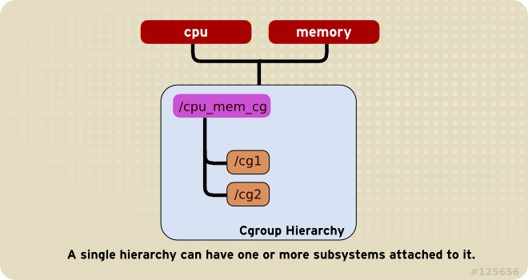
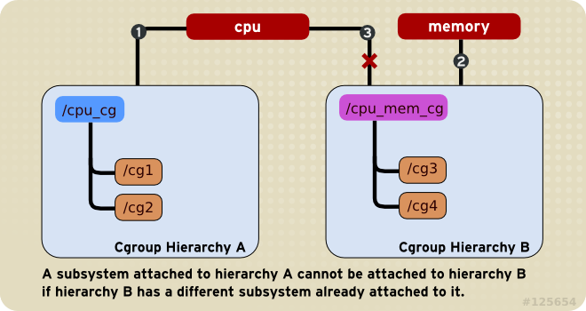
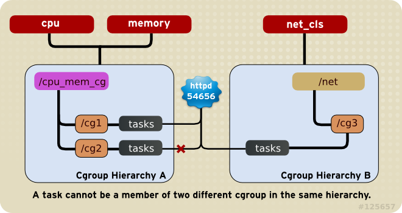
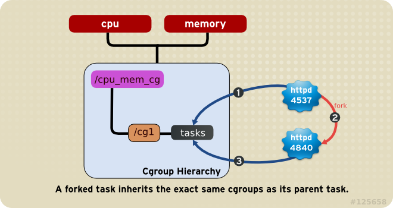

## cgroup 术语和规则    
                                                                                                                               
### 作者                                                                                                                               
digoal                                                                                                                               
                                                                                                                               
### 日期                                                                                                                               
2016-02-15                                                                                                                            
                                                                                                                               
### 标签                                                                                                                               
PostgreSQL , Linux , cgroup     
                                                                                                                               
----                                                                                                                               
                                                                                                                               
## 背景                   
cgroup是Linux下用于隔离或管理资源使用的手段。    
    
Redhat有比较详细的介绍。    
    
https://access.redhat.com/documentation/en-US/Red_Hat_Enterprise_Linux/6/html/Resource_Management_Guide/sec-Relationships_Between_Subsystems_Hierarchies_Control_Groups_and_Tasks.html    
    
首先需要了解几个术语，可以帮助理解cgroup的原理。    
    
1\. Subsystems: 即资源分类，例如cpu , memory, cpu, cpuset, blkio等。安装了cgconfig服务的话可以通过配置文件/etc/cgconfig.conf查看详情。    
    
```    
#    
#  Copyright IBM Corporation. 2007    
#    
#  Authors:     Balbir Singh <balbir@linux.vnet.ibm.com>    
#  This program is free software; you can redistribute it and/or modify it    
#  under the terms of version 2.1 of the GNU Lesser General Public License    
#  as published by the Free Software Foundation.    
#    
#  This program is distributed in the hope that it would be useful, but    
#  WITHOUT ANY WARRANTY; without even the implied warranty of    
#  MERCHANTABILITY or FITNESS FOR A PARTICULAR PURPOSE.    
#    
# See man cgconfig.conf for further details.    
#    
# By default, mount all controllers to /cgroup/<controller>    
    
mount {    
        cpuset  = /cgroup/cpuset;    
        cpu     = /cgroup/cpu;    
        cpuacct = /cgroup/cpuacct;    
        memory  = /cgroup/memory;    
        devices = /cgroup/devices;    
        freezer = /cgroup/freezer;    
        net_cls = /cgroup/net_cls;    
        blkio   = /cgroup/blkio;    
}    
```    
    
2\. Hierarchies: 即资源管理的逻辑最高层级。hierachies通过mount来挂载，系统中可以挂载多个hierachies. 所有的进程pid最初都隶属于这个层级。     
    
3\. Control Groups: 属于hierachie中的下级, cgroup中还可以继续创建cgroup, 这种cgroup下的cgroup并不代表层级关系，只是路径而已。cgroup在同一个hierachie中，是平级的，(不管这个cgroup放在哪个路径下, 例如/cgroup/cpu/cg1, /cgroup/cpu/cg2, /cgroup/cpu/cg1/cg3, cg1,cg2,cg3它们是平级的。)。    
    
4\. Tasks: 即进程pid.    
    
规则讲解    
    
使用cgroup进行资源管理时，必须遵循的规则如下：    
    
规则1    
    
单个hierarchy可以包含多个subsystem, 例如    
    
```    
mkdir /cgroup/cpu_mem_cg    
mount -t cgroup -o cpu,memory cpu_mem_cg /cgroup/cpu_mem_cg    
mkdir /cgroup/cpu_mem_cg/cg1    
mkdir /cgroup/cpu_mem_cg/cg2    
```    
    
    
    
规则2    
    
一个subsystem只能属于一个hierarchy，（有一种情况一个subsystem可以属于多个hierarchy，这些hierarchy的sub system必须完全一样）    
    
例如    
    
```    
mkdir /cgroup/cpu_cg    
mkdir /cgroup/cpu_mem_cg    
mount -t cgroup -o cpu cpu_cg /cgroup/cpu_cg    
mount -t cgroup -o memory cpu_mem_cg /cgroup/cpu_mem_cg    
```    
    
再执行以下命令将报错, 因为cpu_mem_cg这个hierarchy已经包含了一个subsystem memory，所以CPU subsystem不能同时挂载在这两个hierarchy下。    
    
```    
mount -t cgroup -o cpu cpu_mem_cg /cgroup/cpu_mem_cg    
```    
    
有一种情况是允许一个subsystem挂载多个hierarchy下的，当这些hierarchy的subsystem完全一致时。例如    
    
```    
#mkdir /cgroup/cg1    
#mkdir /cgroup/cg2    
#mount -t cgroup -o cpu,memory cg1 /cgroup/cg1    
#mount -t cgroup -o cpu,memory cg2 /cgroup/cg2    
```    
    
这样做并没有什么意义，因为同一个PID会同时出现在这两个hierarchy中。并且在这两个hierarchy中的任意一个中创建cgroup时，另一个hierarchy中也会自动创建对应的cgroup，还有当task从hierarchy调整到cgroup中时，另一个hierarchy中对应的PID也会自动调整到对应的cgroup中，这两个hierarchy是完全一致的。    
    
    
    
规则3    
    
    
一个进程在同一个hierarchy中，不能属于这个hierarchy的多个cgroup中。    
    
但是可以属于多个hierarchy中。    
    
    
    
规则4    
    
进程fork的子进程，会自动放到父进程对应cgroup中。    
    
    
    
最后思考一个问题。    
    
能同时控制一组进程的单个进程的IOPS和一组进程的总IOPS么？    
    
例如    
    
```    
pid a    
  iops <=3000    
pid b    
  iops <=3000    
pid c    
  iops <=3000    
pid d    
  iops <=3000    
```    
    
同时需要限制    
    
```    
pid a+b+c+d    
  iops <= 8000    
```    
    
目前cgroup版本并不能满足这个需求。    
    
又例如一组PID有10个PID，每个PID限制IOPS=100，但是要求10个进程同时使用的IOPS不能超过500.     
    
这个目前无法满足，因为cgroup在一个hierarchy中是平级的。    
    
以下方法不行：    
    
(同一个hierarchy中的不同cgroup，它们属于同一层级)    
    
```    
/cgroup/blkio/blkio.throttle.write_iops_device    
    "8:16 5000"    
/cgroup/blkio/tasks    
    pid 非a,b    
    
/cgroup/blkio/cg1/blkio.throttle.write_iops_device    
    "8:16 3000"    
/cgroup/blkio/cg1/tasks    
    pid a    
/cgroup/blkio/cg2/blkio.throttle.write_iops_device    
    "8:16 3000"    
/cgroup/blkio/cg2/tasks    
    pid b    
```    
    
以下方法也不行：    
    
(使用不同的hierarchy，但是同一个subsystem只能属于一个hierarchy，或者完全一致的hierarchy。)    
    
```    
/cgroup/blkio1/blkio.throttle.write_iops_device    
    "8:16 3000"    
/cgroup/blkio1/tasks    
    pid a    
/cgroup/blkio2/blkio.throttle.write_iops_device    
    "8:16 3000"    
/cgroup/blkio1/tasks    
    pid b    
/cgroup/blkio_all/blkio.throttle.write_iops_device    
    "8:16 5000"    
/cgroup/blkio1/tasks    
    pid a,b    
```    
  
  
<a rel="nofollow" href="http://info.flagcounter.com/h9V1"  ></a>  
  
  
  
  
  
  
## [digoal's 大量PostgreSQL文章入口](https://github.com/digoal/blog/blob/master/README.md "22709685feb7cab07d30f30387f0a9ae")
  
