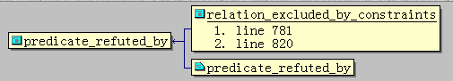
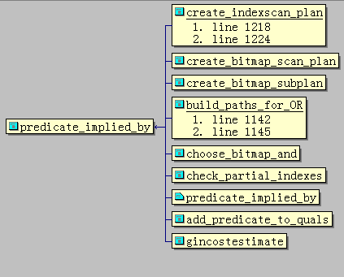

## PostgreSQL 优化器逻辑推理能力 源码解析  
                                          
### 作者                                         
digoal                                          
                                          
### 日期                                        
2016-02-25                                           
                                          
### 标签                                        
PostgreSQL , 优化器 , 操作符 , 逻辑推理                                                                                      
                                          
----                                        
                                          
## 背景            
PostgreSQL 支持自定义操作符，本质上是调用函数来实现的。    
      
同时不同的操作符有幂等，反转，NOT等相关性，数据库的优化器可以利用这些关系，对QUERY进行REWRITE，产生更好的执行计划。      
    
优化器根据操作符进行REWRITE产生好的执行计划，其中有一项就是需要应用操作符的优化器开关，进行逻辑推理，过滤掉约束返回FALSE的，不进入EXECUTE环节，直接返回。     
    
## 什么是逻辑推理  
数据库优化器需要具备逻辑推理能力，而且越强越好，为什么呢？    
  
举一些例子，    
  
通过已知的一个人讲的是真话，推理另一个人讲的一定是真话或一定是假话。    
  
例子1：    
  
    假设预先提供了 a > 10 是真话    
  
    可以推理出 a < 1 一定是假话    
  
例子2：    
  
    假设预先提供了 a > 10 是真话    
  
    无法推理出 a < 100 一定是真话或假话    
  
例子3：    
  
    假设预先提供了 a 是空 是真话    
  
    可以推理出 a 不是空 一定是假话    
  
例子4：    
  
    假设预先提供了 a <>100 是真话    
  
    可以推理出 a =100 一定是假话    
  
例子5：    
  
    假设预先提供了 a >100 是真话    
  
    可以推理出 a >1 一定是真话    
  
例子6：    
  
    假设预先提供了 a 的坐标位置在中国 是真话    
  
    可以推理出 a 的坐标位置在浙江杭州 一定是真话    
  
例子7：    
    假设预先提供了 平面中 坐标A和坐标（1,100）的距离小于100 是真话    
  
    是否推理出 坐标A和坐标（100,100）的距离小于1000 一定是真话或假话？    
    
总结一下以上逻辑推理，首先要提供已知真假的一个表达式，然后推理另一个表达式的真假。推理可以得出的结论是真、或者假、或者不知道真假。    
  
对于推理出来的结果一定是真或者一定是假的情况，数据库可以利用它来减少后期的处理。    
  
这体现在优化器生成查询树之前。例如：    
  
```    
create table tab(id int check (id >=0), info text, crt_time timestamp);    
select * from tab where id<0;    
```    
  
以上已知为真的表达式是id>=0，通过这个表达式能推理出SQL中给出的表达式 id<0 一定是假。那么优化器在执行这条SQL时，可以省去扫描表然后再过滤id<0的行，而是构造结构，并直接返回0条记录。    
  
我们看看执行计划：    
  
```    
digoal=# create table ta(id int check (id >=0), info text, crt_time timestamp);    
CREATE TABLE    
digoal=# explain select * from ta where id=-1;    
                     QUERY PLAN                         
----------------------------------------------------    
 Seq Scan on ta  (cost=0.00..24.12 rows=6 width=44)    
   Filter: (id = '-1'::integer)    
(2 rows)    
```    
  
以上查询貌似并没有优化，还是扫描了表，原因是constraint_exclusion参数默认值对UNION ALL和分区表开启这种逻辑推理检查。    
  
将constraint_exclusion 改为ON即可对所有表进行逻辑推理检查。    
  
```    
digoal=# set constraint_exclusion =on;    
SET    
digoal=# explain select * from ta where id=-1;  -- 现在不需要扫描表了    
                QUERY PLAN                    
------------------------------------------    
 Result  (cost=0.00..0.01 rows=1 width=0)    
   One-Time Filter: false    
(2 rows)    
digoal=# explain select * from ta where id<-1;  -- 现在不需要扫描表了    
                QUERY PLAN                    
------------------------------------------    
 Result  (cost=0.00..0.01 rows=1 width=0)    
   One-Time Filter: false    
(2 rows)    
```    
  
对于无法推理出一定为假的条件，还是需要扫描表的，例如 id<>0。    
  
```    
postgres=# explain select * from ta where id<>0;    
                      QUERY PLAN                           
-------------------------------------------------------    
 Seq Scan on ta  (cost=0.00..24.12 rows=1124 width=44)    
   Filter: (id <> 0)    
(2 rows)    
```    
  
对于提供的表达式与已知的表达式操作符左侧不一致的，目前PG的优化器没有做到这么智能，例如 id+1<10，id+1<0，优化器不会对这种表达式进行逻辑推理，后面我会在代码中分析这块。    
  
```    
postgres=# explain select * from ta where id+1<10;    
                      QUERY PLAN                          
------------------------------------------------------    
 Seq Scan on ta  (cost=0.00..26.95 rows=377 width=44)    
   Filter: ((id + 1) < 10)    
(2 rows)    
postgres=# explain select * from ta where id+1<0;    
                      QUERY PLAN                          
------------------------------------------------------    
 Seq Scan on ta  (cost=0.00..26.95 rows=377 width=44)    
   Filter: ((id + 1) < 0)    
(2 rows)    
```    
  
id+1<0 是可以转换为 id< 0-1的 ，对于以下表达式，PG进行了推理，原因是-操作符是一个immutable操作符，0-1可以转为常数-1从而可以进行推理。    
  
```    
postgres=# explain select * from ta where id<0-1;    
                QUERY PLAN                    
------------------------------------------    
 Result  (cost=0.00..0.01 rows=1 width=0)    
   One-Time Filter: false    
(2 rows)    
```    
  
目前PostgreSQL数据库支持哪些逻辑推理呢？    
  
1\. 约束中包含的表达式的操作符必须是B-tree-indexable operators(或者is null, or , is not null)，也就是可以被btree索引用于检索操作符，例如<,<=,=,>,>=以及<>  (<>不能直接被索引使用，但是可以转换为< OR >来使用索引)。    
  
B-tree-indexable operators   
  
2\. SQL语句where字句中提供的表达式，同样操作符必须是B-tree-indexable operators。    
  
3\. SQL语句where字句中提供的表达式，操作符左侧的操作数必须与约束中的操作数完全一致。    
  
例如约束为(check mod(id,4) = 0)，SQL where字句提供的表达式则必须为 mod(id,4) op?   ?  这种形式才会进行推理。    
  
又如约束为(check id*100 > 1000)，SQL where字句提供的表达式则必须为 id*100 op?   ?  这种形式才会进行推理。    
  
又如约束为(check id+10 between 1000 and 10000)，SQL where字句提供的表达式则必须为 id+10 op?   ?  这种形式才会进行推理。( PostgreSQL 的 between and 会转换为>= and <=，属于B-tree-indexable operators )    
  
又如约束为(check id between 1000 and 10000)，SQL where字句提供的表达式则必须为 id  op?   ?  这种形式才会进行推理。    
    
例子：    
  
约束为is [not] null类型    
  
```    
postgres=# create table tt1(id int check (id is null));    
CREATE TABLE    
postgres=# explain select * from tt1 where id=1;    
                QUERY PLAN                    
------------------------------------------    
 Result  (cost=0.00..0.01 rows=1 width=0)    
   One-Time Filter: false    
(2 rows)    
postgres=# explain select * from tt1 where id is null;    
                     QUERY PLAN                          
-----------------------------------------------------    
 Seq Scan on tt1  (cost=0.00..35.50 rows=13 width=4)    
   Filter: (id IS NULL)    
(2 rows)    
postgres=# explain select * from tt1 where id is not null;    
                QUERY PLAN                    
------------------------------------------    
 Result  (cost=0.00..0.01 rows=1 width=0)    
   One-Time Filter: false    
(2 rows)    
```    
  
约束为 mod(id,4) = 0，=为B-tree-indexable operators    
  
```    
postgres=# create table tt2( id int check(mod(id,4) = 0));    
CREATE TABLE    
postgres=# explain select * from tt2 where id=1;    
                     QUERY PLAN                          
-----------------------------------------------------    
 Seq Scan on tt2  (cost=0.00..41.88 rows=13 width=4)    
   Filter: (id = 1)    
(2 rows)    
-- 要让PG进行逻辑推理，WHERE中必须包含mod(id,4)表达式，并且由于mod是immutable函数，mod(1,4)可以转换为常数，因此以下SQL相当于    
explain select * from tt2 where mod(id,4)=1 and id=1; 这样才可以被逻辑推理。    
postgres=# explain select * from tt2 where mod(id,4)=mod(1,4) and id=1;    
                QUERY PLAN                    
------------------------------------------    
 Result  (cost=0.00..0.01 rows=1 width=0)    
   One-Time Filter: false    
(2 rows)    
```    
  
约束为 id*100 > 1000，>为B-tree-indexable operators    
  
```    
postgres=# create table tt3( id int check(id*100 > 1000));    
CREATE TABLE    
postgres=# explain select * from tt3 where id=1;    
                     QUERY PLAN                          
-----------------------------------------------------    
 Seq Scan on tt3  (cost=0.00..41.88 rows=13 width=4)    
   Filter: (id = 1)    
(2 rows)    
-- 要让PG进行逻辑推理，WHERE中必须包含id*100表达式，并且*是immutable操作符,所以1*100可以替换为常数。从而进行逻辑推理。    
postgres=# explain select * from tt3 where id=1 and id*100=1*100;    
                QUERY PLAN                    
------------------------------------------    
 Result  (cost=0.00..0.01 rows=1 width=0)    
   One-Time Filter: false    
(2 rows)    
```    
  
约束为 id+10 between 1000 and 10000，between and 自动转换为>=和and <=。并且WHERE中必须包含id+10表达式，同时>=或<=是B-tree-indexable operators。    
  
```    
postgres=# create table tt4( id int check(id+10 between 1000 and 10000));    
CREATE TABLE    
postgres=# explain select * from tt4 where id=1;    
                     QUERY PLAN                          
-----------------------------------------------------    
 Seq Scan on tt4  (cost=0.00..41.88 rows=13 width=4)    
   Filter: (id = 1)    
(2 rows)    
postgres=# explain select * from tt4 where id=1 and id+10=1+10;  -- +是immutable操作符1+10将转换为11常数。    
                QUERY PLAN                    
------------------------------------------    
 Result  (cost=0.00..0.01 rows=1 width=0)    
   One-Time Filter: false    
(2 rows)    
```    
  
约束为 check id between 1000 and 10000    
  
```    
postgres=# create table tt5( id int check(id between 1000 and 10000));    
CREATE TABLE    
postgres=# explain select * from tt5 where id=1;    
                QUERY PLAN                    
------------------------------------------    
 Result  (cost=0.00..0.01 rows=1 width=0)    
   One-Time Filter: false    
(2 rows)    
postgres=# explain select * from tt5 where id+1=1;    
                     QUERY PLAN                          
-----------------------------------------------------    
 Seq Scan on tt5  (cost=0.00..48.25 rows=13 width=4)    
   Filter: ((id + 1) = 1)    
(2 rows)    
postgres=# explain select * from tt5 where 1=id;    
                QUERY PLAN                    
------------------------------------------    
 Result  (cost=0.00..0.01 rows=1 width=0)    
   One-Time Filter: false    
(2 rows)    
postgres=# explain select * from tt5 where 1>id;    
                QUERY PLAN                    
------------------------------------------    
 Result  (cost=0.00..0.01 rows=1 width=0)    
   One-Time Filter: false    
(2 rows)    
postgres=# explain select * from tt5 where 1<id;    
                      QUERY PLAN                          
------------------------------------------------------    
 Seq Scan on tt5  (cost=0.00..41.88 rows=850 width=4)    
   Filter: (1 < id)    
(2 rows)    
```    
  
PostgreSQL数据库是如何实现这些逻辑推理的呢？    
  
上面的例子，都转换成了?1 op ?2，其中 ?1 是一个表达式或字段，?2是一个常数。    
  
但是，数据库是怎么通过一个条件的真伪判断另一个条件的真伪呢？    
  
还是回到一个例子：    
  
check id > 100    
  
推理 id > 1 是真是假？可以通过比较两个常数来决定，100 >= 1 为真则说明 id>1为真。    
  
为什么要比较这两个常数呢？因为这是优化器排除对表的扫描的一种手段，这时还没有到需要用到id值的阶段。所以此时优化器只能通过常数来推理。    
  
具体的代码如下：    
  
目前PG只实现了对btree索引可以用到的操作符的逻辑推理，使用了两张映射表来描述推理关系。    
  
一张表BT_implic_table 用来推理一定为真，另一张表BT_refute_table 用来推理一定为假。    
  
例如：    
  
已知 ATTR given_op CONST1 为真    
  
如果 CONST2 test_op CONST1 为真    
  
则推理得出 ATTR target_op CONST2 一定为真    
  
其中 test_op = BT_implic_table[given_op-1][target_op-1] 就是通过BT_implic_table 映射表取出的操作符。    
    
已知 ATTR given_op CONST1 为真    
  
如果 CONST2 test_op CONST1 为假    
  
则推理得出 ATTR target_op CONST2 一定为假    
  
其中 test_op = BT_refute_table[given_op-1][target_op-1] 就是通过BT_refute_table 映射表取出的操作符。    
  
代码：    
  
```    
/*    
 * Define an "operator implication table" for btree operators ("strategies"),    
 * and a similar table for refutation.    
 *    
 * The strategy numbers defined by btree indexes (see access/skey.h) are:    
 *		(1) <	(2) <=	 (3) =	 (4) >=   (5) >    
 * and in addition we use (6) to represent <>.  <> is not a btree-indexable    
 * operator, but we assume here that if an equality operator of a btree    
 * opfamily has a negator operator, the negator behaves as <> for the opfamily.    
 * (This convention is also known to get_op_btree_interpretation().)    
 *    
 * The interpretation of:    
 *    
 *		test_op = BT_implic_table[given_op-1][target_op-1]    
 *    
 * where test_op, given_op and target_op are strategy numbers (from 1 to 6)    
 * of btree operators, is as follows:    
 *    
 *	 If you know, for some ATTR, that "ATTR given_op CONST1" is true, and you    
 *	 want to determine whether "ATTR target_op CONST2" must also be true, then    
 *	 you can use "CONST2 test_op CONST1" as a test.  If this test returns true,    
 *	 then the target expression must be true; if the test returns false, then    
 *	 the target expression may be false.    
 *    
 * For example, if clause is "Quantity > 10" and pred is "Quantity > 5"    
 * then we test "5 <= 10" which evals to true, so clause implies pred.    
 *    
 * Similarly, the interpretation of a BT_refute_table entry is:    
 *    
 *	 If you know, for some ATTR, that "ATTR given_op CONST1" is true, and you    
 *	 want to determine whether "ATTR target_op CONST2" must be false, then    
 *	 you can use "CONST2 test_op CONST1" as a test.  If this test returns true,    
 *	 then the target expression must be false; if the test returns false, then    
 *	 the target expression may be true.    
 *    
 * For example, if clause is "Quantity > 10" and pred is "Quantity < 5"    
 * then we test "5 <= 10" which evals to true, so clause refutes pred.    
 *    
 * An entry where test_op == 0 means the implication cannot be determined.    
 */    
    
#define BTLT BTLessStrategyNumber    
#define BTLE BTLessEqualStrategyNumber    
#define BTEQ BTEqualStrategyNumber    
#define BTGE BTGreaterEqualStrategyNumber    
#define BTGT BTGreaterStrategyNumber    
#define BTNE ROWCOMPARE_NE    
    
static const StrategyNumber BT_implic_table[6][6] = {    
/*    
 *			The target operator:    
 *    
 *	 LT    LE	 EQ    GE	 GT    NE    
 */    
	{BTGE, BTGE, 0, 0, 0, BTGE},	/* LT */    
	{BTGT, BTGE, 0, 0, 0, BTGT},	/* LE */    
	{BTGT, BTGE, BTEQ, BTLE, BTLT, BTNE},		/* EQ */    
	{0, 0, 0, BTLE, BTLT, BTLT},	/* GE */    
	{0, 0, 0, BTLE, BTLE, BTLE},	/* GT */    
	{0, 0, 0, 0, 0, BTEQ}		/* NE */    
};    
    
static const StrategyNumber BT_refute_table[6][6] = {    
/*    
 *			The target operator:    
 *    
 *	 LT    LE	 EQ    GE	 GT    NE    
 */    
	{0, 0, BTGE, BTGE, BTGE, 0},	/* LT */    
	{0, 0, BTGT, BTGT, BTGE, 0},	/* LE */    
	{BTLE, BTLT, BTNE, BTGT, BTGE, BTEQ},		/* EQ */    
	{BTLE, BTLT, BTLT, 0, 0, 0},	/* GE */    
	{BTLE, BTLE, BTLE, 0, 0, 0},	/* GT */    
	{0, 0, BTEQ, 0, 0, 0}		/* NE */    
};    
```    
  
这两个表里面的0，表示无法推断真或假的情况。例如通过 a>100 无法推断 a>? 一定为假， 只能推断 a>? 一定为真。    
  
通过100, ?, 以及 test_op 来推断，而test_op就是从BT_implic_table表中取出的BTLE即<=，因此判断的依据是 ? <= 100 为真则a>? 一定为真。    
    
PostgreSQL通过get_btree_test_op 获得test_op，代码如下：    
  
```    
get_btree_test_op    
			/*    
			 * Look up the "test" strategy number in the implication table    
			 */    
			if (refute_it)    
				test_strategy = BT_refute_table[clause_strategy - 1][pred_strategy - 1];    
			else    
				test_strategy = BT_implic_table[clause_strategy - 1][pred_strategy - 1];    
    
			if (test_strategy == 0)    
			{    
				/* Can't determine implication using this interpretation */    
				continue;    
			}    
			/*    
			 * See if opfamily has an operator for the test strategy and the    
			 * datatypes.    
			 */    
			if (test_strategy == BTNE)    
			{    
				test_op = get_opfamily_member(opfamily_id,    
											  pred_op_info->oprighttype,    
											  clause_op_info->oprighttype,    
											  BTEqualStrategyNumber);    
				if (OidIsValid(test_op))    
					test_op = get_negator(test_op);    
			}    
			else    
			{    
				test_op = get_opfamily_member(opfamily_id,    
											  pred_op_info->oprighttype,    
											  clause_op_info->oprighttype,    
											  test_strategy);    
			}    
    
			if (!OidIsValid(test_op))    
				continue;    
...    
	return test_op;    
```    
  
那么PostgreSQL可以利用这些逻辑推理来做什么呢？    
  
通过推断 "一定为假" 来排除哪些表不需要参与到执行计划。直接排除掉。    
  
  
    
通过推断 “一定对真” ，可以用在建立执行计划的过程中。    
  
  
    
以一定为假为例，我们看看PostgreSQL优化器如何排除哪些表是不需要参与执行计划的。    
  
constraint_exclusion参数控制的逻辑推理应用，可以看到调用栈如下：    
    
relation_excluded_by_constraints 返回 true 表示不需要扫描这个表，返回 false 表示需要扫描这个表。    
  
简单分析一下这个函数的代码：    
  
未开启constraint_exclusion时，不进行逻辑推理。    
  
```    
	/* Skip the test if constraint exclusion is disabled for the rel */    
	if (constraint_exclusion == CONSTRAINT_EXCLUSION_OFF ||    
		(constraint_exclusion == CONSTRAINT_EXCLUSION_PARTITION &&    
		 !(rel->reloptkind == RELOPT_OTHER_MEMBER_REL ||    
		   (root->hasInheritedTarget &&    
			rel->reloptkind == RELOPT_BASEREL &&    
			rel->relid == root->parse->resultRelation))))    
		return false;    
```    
  
在检查表自身的约束和SQL提供的where条件前，先检查where 条件是否有自相矛盾的。例如：    
  
```    
 id <> mod(4,3) and id = mod(4,3)    
postgres=# \d+ tt11    
                         Table "public.tt11"    
 Column |  Type   | Modifiers | Storage | Stats target | Description     
--------+---------+-----------+---------+--------------+-------------    
 id     | integer |           | plain   |              |     
    
postgres=# explain (analyze,verbose) select * from tt11 where id<>mod(4,3) and id=mod(4,3);    
                                     QUERY PLAN                                         
------------------------------------------------------------------------------------    
 Result  (cost=0.00..0.01 rows=1 width=0) (actual time=0.001..0.001 rows=0 loops=1)    
   Output: id    
   One-Time Filter: false    
 Planning time: 0.051 ms    
 Execution time: 0.012 ms    
(5 rows)    
```    
  
代码如下    
  
```    
	/*    
	 * Check for self-contradictory restriction clauses.  We dare not make    
	 * deductions with non-immutable functions, but any immutable clauses that    
	 * are self-contradictory allow us to conclude the scan is unnecessary.    
	 *    
	 * Note: strip off RestrictInfo because predicate_refuted_by() isn't    
	 * expecting to see any in its predicate argument.    
	 */    
	safe_restrictions = NIL;    
	foreach(lc, rel->baserestrictinfo)    
	{    
		RestrictInfo *rinfo = (RestrictInfo *) lfirst(lc);    
    
		if (!contain_mutable_functions((Node *) rinfo->clause))    
			safe_restrictions = lappend(safe_restrictions, rinfo->clause);    
	}    
    
	if (predicate_refuted_by(safe_restrictions, safe_restrictions))    
		return true;    
    
        // 从SQL涉及的表，以及继承表中获取约束    
	/* Only plain relations have constraints */    
	if (rte->rtekind != RTE_RELATION || rte->inh)    
		return false;    
    
	/*    
	 * OK to fetch the constraint expressions.  Include "col IS NOT NULL"    
	 * expressions for attnotnull columns, in case we can refute those.    
	 */    
	constraint_pred = get_relation_constraints(root, rte->relid, rel, true);    
    
	/*    
	 * We do not currently enforce that CHECK constraints contain only    
	 * immutable functions, so it's necessary to check here. We daren't draw    
	 * conclusions from plan-time evaluation of non-immutable functions. Since    
	 * they're ANDed, we can just ignore any mutable constraints in the list,    
	 * and reason about the rest.    
	 */    
	safe_constraints = NIL;    
	foreach(lc, constraint_pred)    
	{    
		Node	   *pred = (Node *) lfirst(lc);    
                         // 包含非immutable函数的表达式不加入推理判断，因为非immutable函数存在变数，不能转常量    
		if (!contain_mutable_functions(pred))      
			safe_constraints = lappend(safe_constraints, pred);    
	}    
    
	/*    
	 * The constraints are effectively ANDed together, so we can just try to    
	 * refute the entire collection at once.  This may allow us to make proofs    
	 * that would fail if we took them individually.    
	 *    
	 * Note: we use rel->baserestrictinfo, not safe_restrictions as might seem    
	 * an obvious optimization.  Some of the clauses might be OR clauses that    
	 * have volatile and nonvolatile subclauses, and it's OK to make    
	 * deductions with the nonvolatile parts.    
	 */           
                        //   检测是否一定为假，如果一定为假，则不需要扫描这个表。    
	if (predicate_refuted_by(safe_constraints, rel->baserestrictinfo))    
		return true;    
```    
  
调用栈如下：    
  
```    
predicate_refuted_by    
predicate_refuted_by_recurse    
predicate_refuted_by_simple_clause    
       return btree_predicate_proof(predicate, clause, true)    
btree_predicate_proof@src/backend/optimizer/util/predtest.c    
	/*    
	 * Lookup the comparison operator using the system catalogs and the    
	 * operator implication tables.    
	 */    
	test_op = get_btree_test_op(pred_op, clause_op, refute_it);    
```    
    
目前PostgreSQL仅仅支持有限操作符的逻辑推理，这些操作符必须是btree-indexable operator    
  
```    
postgres=# select oprname,oprcode from pg_operator where oid in (select amopopr from pg_amop where amopmethod=(select oid from pg_am where amname='btree'));    
 oprname |         oprcode              
---------+--------------------------    
 =       | int48eq    
 <       | int48lt    
 >       | int48gt    
 <=      | int48le    
 >=      | int48ge    
 <       | boollt    
 >       | boolgt    
 =       | booleq    
 <=      | boolle    
 >=      | boolge    
 =       | chareq    
 =       | nameeq    
 =       | int2eq    
 <       | int2lt    
 =       | int4eq    
 <       | int4lt    
 =       | texteq    
 =       | tideq    
 <       | tidlt    
 >       | tidgt    
 <=      | tidle    
 >=      | tidge    
 =       | int8eq    
 <       | int8lt    
 >       | int8gt    
 <=      | int8le    
 >=      | int8ge    
 =       | int84eq    
 <       | int84lt    
 >       | int84gt    
 <=      | int84le    
 >=      | int84ge    
 >       | int2gt    
 >       | int4gt    
 <=      | int2le    
 <=      | int4le    
 >=      | int2ge    
 >=      | int4ge    
 =       | int24eq    
 =       | int42eq    
 <       | int24lt    
 <       | int42lt    
 >       | int24gt    
 >       | int42gt    
 <=      | int24le    
 <=      | int42le    
 >=      | int24ge    
 >=      | int42ge    
 =       | abstimeeq    
 <       | abstimelt    
 >       | abstimegt    
 <=      | abstimele    
 >=      | abstimege    
 =       | reltimeeq    
 <       | reltimelt    
 >       | reltimegt    
 <=      | reltimele    
 >=      | reltimege    
 =       | oideq    
 <       | oidlt    
 >       | oidgt    
 <=      | oidle    
 >=      | oidge    
 <       | oidvectorlt    
 >       | oidvectorgt    
 <=      | oidvectorle    
 >=      | oidvectorge    
 =       | oidvectoreq    
 =       | float4eq    
 <       | float4lt    
 >       | float4gt    
 <=      | float4le    
 >=      | float4ge    
 <       | charlt    
 <=      | charle    
 >       | chargt    
 >=      | charge    
 <       | namelt    
 <=      | namele    
 >       | namegt    
 >=      | namege    
 <       | text_lt    
 <=      | text_le    
 >       | text_gt    
 >=      | text_ge    
 =       | float8eq    
 <       | float8lt    
 <=      | float8le    
 >       | float8gt    
 >=      | float8ge    
 =       | tintervaleq    
 <       | tintervallt    
 >       | tintervalgt    
 <=      | tintervalle    
 >=      | tintervalge    
 =       | cash_eq    
 <       | cash_lt    
 >       | cash_gt    
 <=      | cash_le    
 >=      | cash_ge    
 =       | bpchareq    
 <       | bpcharlt    
 <=      | bpcharle    
 >       | bpchargt    
 >=      | bpcharge    
 =       | array_eq    
 <       | array_lt    
 >       | array_gt    
 <=      | array_le    
 >=      | array_ge    
 =       | date_eq    
 <       | date_lt    
 <=      | date_le    
 >       | date_gt    
 >=      | date_ge    
 =       | time_eq    
 <       | time_lt    
 <=      | time_le    
 >       | time_gt    
 >=      | time_ge    
 =       | timetz_eq    
 <       | timetz_lt    
 <=      | timetz_le    
 >       | timetz_gt    
 >=      | timetz_ge    
 =       | float48eq    
 <       | float48lt    
 >       | float48gt    
 <=      | float48le    
 >=      | float48ge    
 =       | float84eq    
 <       | float84lt    
 >       | float84gt    
 <=      | float84le    
 >=      | float84ge    
 =       | timestamptz_eq    
 <       | timestamptz_lt    
 <=      | timestamptz_le    
 >       | timestamptz_gt    
 >=      | timestamptz_ge    
 =       | interval_eq    
 <       | interval_lt    
 <=      | interval_le    
 >       | interval_gt    
 >=      | interval_ge    
 =       | macaddr_eq    
 <       | macaddr_lt    
 <=      | macaddr_le    
 >       | macaddr_gt    
 >=      | macaddr_ge    
 =       | network_eq    
 <       | network_lt    
 <=      | network_le    
 >       | network_gt    
 >=      | network_ge    
 =       | numeric_eq    
 <       | numeric_lt    
 <=      | numeric_le    
 >       | numeric_gt    
 >=      | numeric_ge    
 =       | biteq    
 <       | bitlt    
 >       | bitgt    
 <=      | bitle    
 >=      | bitge    
 =       | varbiteq    
 <       | varbitlt    
 >       | varbitgt    
 <=      | varbitle    
 >=      | varbitge    
 =       | int28eq    
 <       | int28lt    
 >       | int28gt    
 <=      | int28le    
 >=      | int28ge    
 =       | int82eq    
 <       | int82lt    
 >       | int82gt    
 <=      | int82le    
 >=      | int82ge    
 =       | byteaeq    
 <       | bytealt    
 <=      | byteale    
 >       | byteagt    
 >=      | byteage    
 =       | timestamp_eq    
 <       | timestamp_lt    
 <=      | timestamp_le    
 >       | timestamp_gt    
 >=      | timestamp_ge    
 ~<~     | text_pattern_lt    
 ~<=~    | text_pattern_le    
 ~>=~    | text_pattern_ge    
 ~>~     | text_pattern_gt    
 ~<~     | bpchar_pattern_lt    
 ~<=~    | bpchar_pattern_le    
 ~>=~    | bpchar_pattern_ge    
 ~>~     | bpchar_pattern_gt    
 <       | date_lt_timestamp    
 <=      | date_le_timestamp    
 =       | date_eq_timestamp    
 >=      | date_ge_timestamp    
 >       | date_gt_timestamp    
 <       | date_lt_timestamptz    
 <=      | date_le_timestamptz    
 =       | date_eq_timestamptz    
 >=      | date_ge_timestamptz    
 >       | date_gt_timestamptz    
 <       | timestamp_lt_date    
 <=      | timestamp_le_date    
 =       | timestamp_eq_date    
 >=      | timestamp_ge_date    
 >       | timestamp_gt_date    
 <       | timestamptz_lt_date    
 <=      | timestamptz_le_date    
 =       | timestamptz_eq_date    
 >=      | timestamptz_ge_date    
 >       | timestamptz_gt_date    
 <       | timestamp_lt_timestamptz    
 <=      | timestamp_le_timestamptz    
 =       | timestamp_eq_timestamptz    
 >=      | timestamp_ge_timestamptz    
 >       | timestamp_gt_timestamptz    
 <       | timestamptz_lt_timestamp    
 <=      | timestamptz_le_timestamp    
 =       | timestamptz_eq_timestamp    
 >=      | timestamptz_ge_timestamp    
 >       | timestamptz_gt_timestamp    
 =       | uuid_eq    
 <       | uuid_lt    
 >       | uuid_gt    
 <=      | uuid_le    
 >=      | uuid_ge    
 =       | pg_lsn_eq    
 <       | pg_lsn_lt    
 >       | pg_lsn_gt    
 <=      | pg_lsn_le    
 >=      | pg_lsn_ge    
 =       | enum_eq    
 <       | enum_lt    
 >       | enum_gt    
 <=      | enum_le    
 >=      | enum_ge    
 <       | tsvector_lt    
 <=      | tsvector_le    
 =       | tsvector_eq    
 >=      | tsvector_ge    
 >       | tsvector_gt    
 <       | tsquery_lt    
 <=      | tsquery_le    
 =       | tsquery_eq    
 >=      | tsquery_ge    
 >       | tsquery_gt    
 =       | record_eq    
 <       | record_lt    
 >       | record_gt    
 <=      | record_le    
 >=      | record_ge    
 *=      | record_image_eq    
 *<      | record_image_lt    
 *>      | record_image_gt    
 *<=     | record_image_le    
 *>=     | record_image_ge    
 =       | range_eq    
 <       | range_lt    
 <=      | range_le    
 >=      | range_ge    
 >       | range_gt    
 =       | jsonb_eq    
 <       | jsonb_lt    
 >       | jsonb_gt    
 <=      | jsonb_le    
 >=      | jsonb_ge    
(273 rows)    
```    
  
除此以外的操作符，不参与逻辑推理。    
  
例如    
  
我们知道geo严格在坐标10,0的左边，肯定能推理出它不可能在11,0的右边，正常情况下是可以排除对这个表的扫描的。    
  
但是由于<<,>>不是btree operator，所以不参与推理。    
  
```    
postgres=# create table tt13(id int, geo point check(geo << point '(10,0)'));    
CREATE TABLE    
postgres=# explain select * from tt13 where geo >> point '(11,0)';    
                       QUERY PLAN                           
--------------------------------------------------------    
 Seq Scan on tt13  (cost=0.00..31.25 rows=170 width=20)    
   Filter: (geo >> '(11,0)'::point)    
(2 rows)    
```    
  
这种逻辑推理在分区表的应用中尤为突出，例如：    
  
用户规划了一批分区表，按照ID取模分区。    
  
```    
postgres=# create table p(id int, info text);    
CREATE TABLE    
postgres=# create table t0(id int check(abs(mod(id,4))=0), info text);    
CREATE TABLE    
postgres=# create table t1(id int check(abs(mod(id,4))=1), info text);    
CREATE TABLE    
postgres=# create table t2(id int check(abs(mod(id,4))=2), info text);    
CREATE TABLE    
postgres=# create table t3(id int check(abs(mod(id,4))=3), info text);    
CREATE TABLE    
postgres=# alter table t0 inherit p;    
ALTER TABLE    
postgres=# alter table t1 inherit p;    
ALTER TABLE    
postgres=# alter table t2 inherit p;    
ALTER TABLE    
postgres=# alter table t3 inherit p;    
ALTER TABLE    
postgres=# explain select * from p where id=0;  -- id=0 和 abs(mod(id,4)) =  0,1,2,3由于操作数不一致，不会进行推理。    
                        QUERY PLAN                            
----------------------------------------------------------    
 Append  (cost=0.00..103.50 rows=25 width=36)    
   ->  Seq Scan on p  (cost=0.00..0.00 rows=1 width=36)    
         Filter: (id = 0)    
   ->  Seq Scan on t0  (cost=0.00..25.88 rows=6 width=36)    
         Filter: (id = 0)    
   ->  Seq Scan on t1  (cost=0.00..25.88 rows=6 width=36)    
         Filter: (id = 0)    
   ->  Seq Scan on t2  (cost=0.00..25.88 rows=6 width=36)    
         Filter: (id = 0)    
   ->  Seq Scan on t3  (cost=0.00..25.88 rows=6 width=36)    
         Filter: (id = 0)    
(11 rows)    
postgres=# explain select * from p where id=0 and abs(mod(id,4)) = abs(mod(0,4));   -- 所以必须带上与约束一致的操作数    
                        QUERY PLAN                            
----------------------------------------------------------    
 Append  (cost=0.00..35.40 rows=2 width=36)    
   ->  Seq Scan on p  (cost=0.00..0.00 rows=1 width=36)    
         Filter: ((id = 0) AND (abs(mod(id, 4)) = 0))    
   ->  Seq Scan on t0  (cost=0.00..35.40 rows=1 width=36)    
         Filter: ((id = 0) AND (abs(mod(id, 4)) = 0))    
(5 rows)    
```    
  
如果我们使用的是范围分区，就不存在以上的问题。因为约束中的操作数和WHERE子句中的操作数可以做到一致。    
    
从以上的例子可以了解到，PostgreSQL优化器的逻辑推理能力还可以加强。    
  
只要能推理出一定为假的，就可以被优化器用于排除表。例如一些几何类型的操作符，数组类型的操作符等等。    
    
## 参考    
1\. 分区字段的分区方法，这种方法对应的函数或操作符必须是immutable的，同时尽量以字段加btree operator来分区，方便写SQL，如果做不到，那么SQL中必须带上原样的表达式，同时代入，例如 abs(mod(id,4)) = abs(mod(?,4))  。   
  
2\. http://www.postgresql.org/docs/9.5/static/ddl-partitioning.html#DDL-PARTITIONING-CONSTRAINT-EXCLUSION    
  
```    
The following caveats apply to constraint exclusion:    
Constraint exclusion only works when the query's WHERE clause contains constants (or externally supplied parameters). For example, a comparison against a non-immutable function such as CURRENT_TIMESTAMP cannot be optimized, since the planner cannot know which partition the function value might fall into at run time.    
Keep the partitioning constraints simple, else the planner may not be able to prove that partitions don't need to be visited. Use simple equality conditions for list partitioning, or simple range tests for range partitioning, as illustrated in the preceding examples. A good rule of thumb is that partitioning constraints should contain only comparisons of the partitioning column(s) to constants using B-tree-indexable operators.    
All constraints on all partitions of the master table are examined during constraint exclusion, so large numbers of partitions are likely to increase query planning time considerably. Partitioning using these techniques will work well with up to perhaps a hundred partitions; don't try to use many thousands of partitions.    
```    
  
3\. constraint_exclusion    
  
http://www.postgresql.org/docs/9.5/static/runtime-config-query.html#RUNTIME-CONFIG-QUERY-OTHER    
  
```    
constraint_exclusion (enum)    
Controls the query planner's use of table constraints to optimize queries. The allowed values of constraint_exclusion are on (examine constraints for all tables), off (never examine constraints), and partition (examine constraints only for inheritance child tables and UNION ALL subqueries). partition is the default setting. It is often used with inheritance and partitioned tables to improve performance.    
```    
      
             
                           
  
<a rel="nofollow" href="http://info.flagcounter.com/h9V1"  ></a>  
  
  
  
  
  
  
## [digoal's 大量PostgreSQL文章入口](https://github.com/digoal/blog/blob/master/README.md "22709685feb7cab07d30f30387f0a9ae")
  
