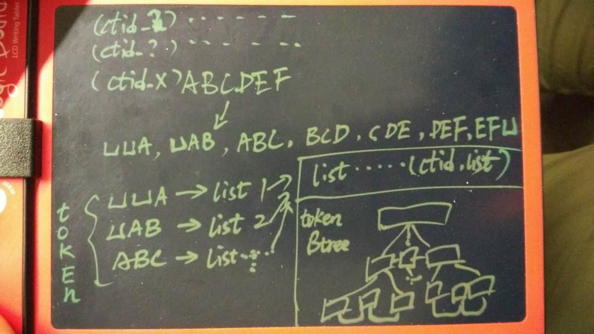
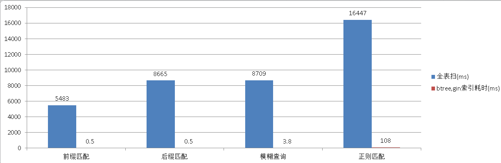
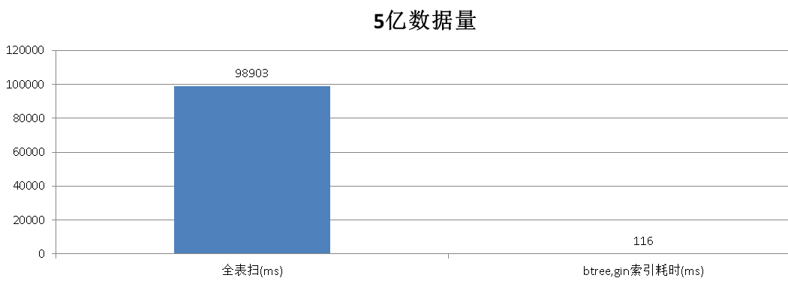
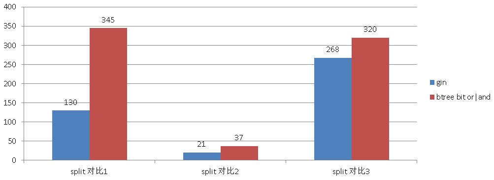
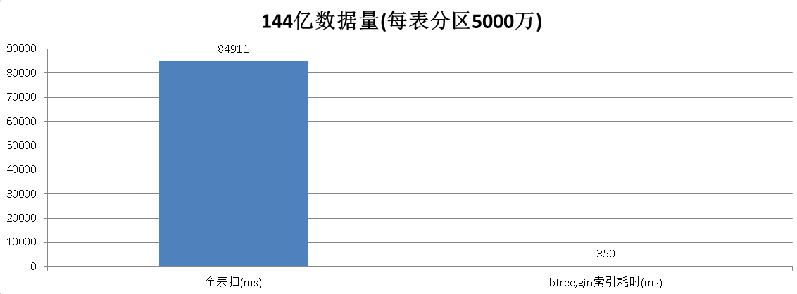
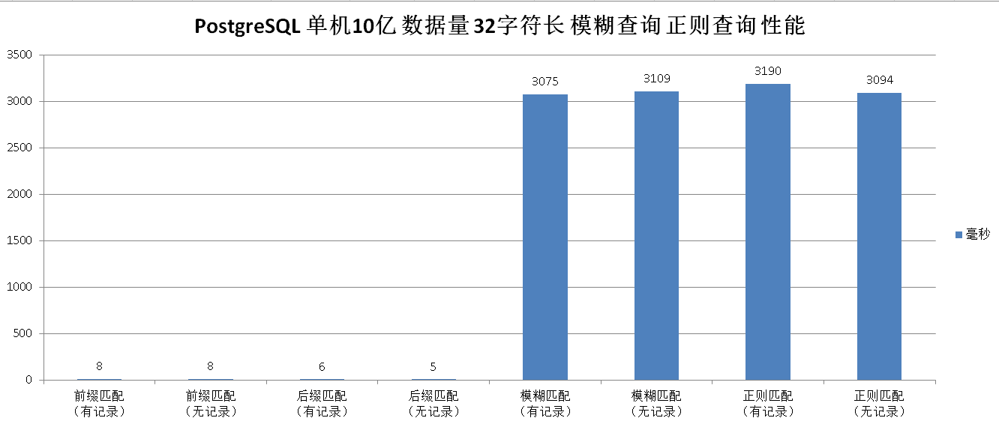

## PostgreSQL 百亿数据 秒级响应 正则及模糊查询   
                                                                                                                                    
### 作者                                                                                                                                   
digoal                                                                                                                                    
                                                                                                                                    
### 日期                                                                                                                                  
2016-03-02                                            
                                                                                                                                    
### 标签                                                                                                                                  
PostgreSQL , pg_trgm , 倒排索引 , reverse , like , 正则匹配 , 模糊查询 , gin索引                                                                                                                  
                                                                      
----                                                                                                                                  
                                                                          
## 背景   
正则匹配和模糊匹配通常是搜索引擎的特长，但是如果你使用的是 PostgreSQL 数据库照样能实现，并且性能不赖，加上分布式方案 (譬如 plproxy, pg_shard, fdw shard, pg-xc, pg-xl, greenplum)，处理百亿以上数据量的正则匹配和模糊匹配效果杠杠的，同时还不失数据库固有的功能，一举多得。  
  
物联网中有大量的数据，除了数字数据，还有字符串类的数据，例如条形码，车牌，手机号，邮箱，姓名等等。  
  
假设用户需要在大量的传感数据中进行模糊检索，甚至规则表达式匹配，有什么高效的方法呢？  
  
这种场景还挺多，例如市面上发现了一批药品可能有问题，需要对药品条码进行规则表达式查找，找出复合条件的药品流向。  
  
又比如在侦查行动时，线索的检索，如用户提供的残缺的电话号码，邮箱，车牌，IP地址，QQ号码，微信号码等等。  
  
根据这些信息加上时间的叠加，模糊匹配和关联，最终找出罪犯。  
  
可以看出，模糊匹配，正则表达式匹配，和人脸拼图有点类似，需求非常的迫切。  
  
## 模糊查询场景与优化手段  
首先对应用场景进行一下分类，以及现有技术下能使用的优化手段。  
  
1\. 带前缀的模糊查询，例如 like 'ABC%'，在PG中也可以写成 ~ '^ABC'  
  
可以使用btree索引优化，或者拆列用多列索引叠加bit and或bit or进行优化（只适合固定长度的端字符串，例如char(8)）。  
  
2\. 带后缀的模糊查询，例如 like '%ABC'，在PG中也可以写成 ~ 'ABC$'  
  
可以使用reverse函数btree索引，或者拆列用多列索引叠加bit and或bit or进行优化（只适合固定长度的端字符串，例如char(8)）。  
  
3\. 不带前缀和后缀的模糊查询，例如 like '%AB_C%'，在PG中也可以写成 ~ 'AB.C'  
  
可以使用pg_trgm的gin索引，或者拆列用多列索引叠加bit and或bit or进行优化（只适合固定长度的端字符串，例如char(8)）。  
  
4\. 正则表达式查询，例如 ~ '[\d]+def1.?[a|b|0|8]{1,3}'  
  
可以使用pg_trgm的gin索引，或者拆列用多列索引叠加bit and或bit or进行优化（只适合固定长度的端字符串，例如char(8)）。  
  
PostgreSQL pg_trgm插件自从9.1开始支持模糊查询使用索引，从9.3开始支持规则表达式查询使用索引，大大提高了PostgreSQL在刑侦方面的能力。  
  
代码见  
  
https://github.com/postgrespro/pg_trgm_pro  
  
pg_trgm插件的原理，将字符串前加2个空格，后加1个空格，组成一个新的字符串，并将这个新的字符串按照每3个相邻的字符拆分成多个token。  
  
当使用规则表达式或者模糊查询进行匹配时，会检索出他们的近似度，再进行filter。  
  
GIN索引的图例：  
  
   
  
从btree检索到匹配的token时，指向对应的list, 从list中存储的ctid找到对应的记录。  
  
因为一个字符串会拆成很多个token，所以没插入一条记录，会更新多条索引，这也是GIN索引需要fastupdate的原因。  
  
正则匹配是怎么做到的呢？  
  
详见 https://raw.githubusercontent.com/postgrespro/pg_trgm_pro/master/trgm_regexp.c  
  
实际上它是将正则表达式转换成了NFA格式，然后扫描多个TOKEN，进行bit and|or匹配。  
  
正则组合如果转换出来的的bit and|or很多的话，就需要大量的recheck，性能也不能好到哪里去。  
  
## 下面针对以上四种场景，实例讲解如何优化  
  
### 1. 带前缀的模糊查询，例如 like 'ABC%'，在PG中也可以写成 ~ '^ABC'  
  
可以使用btree索引优化，或者拆列用多列索引叠加bit and或bit or进行优化（只适合固定长度的端字符串，例如char(8)）。  
  
例子，1000万随机产生的MD5数据的前8个字符。  
  
```  
postgres=# create table tb(info text);    
CREATE TABLE    
postgres=# insert into tb select substring(md5(random()::text),1,8) from generate_series(1,10000000);    
INSERT 0 10000000    
postgres=# create index idx_tb on tb(info);    
CREATE INDEX    
postgres=# select * from tb limit 1;    
   info       
----------    
 376821ab    
(1 row)    
postgres=# explain select * from tb where info ~ '^376821' limit 10;    
                                  QUERY PLAN                                       
-------------------------------------------------------------------------------    
 Limit  (cost=0.43..0.52 rows=10 width=9)    
   ->  Index Only Scan using idx_tb on tb  (cost=0.43..8.46 rows=1000 width=9)    
         Index Cond: ((info >= '376821'::text) AND (info < '376822'::text))    
         Filter: (info ~ '^376821'::text)    
(4 rows)    
postgres=# select * from tb where info ~ '^376821' limit 10;    
   info       
----------    
 376821ab    
(1 row)    
Time: 0.536 ms    
postgres=# set enable_indexscan=off;    
SET    
Time: 1.344 ms    
postgres=# set enable_bitmapscan=off;    
SET    
Time: 0.158 ms    
postgres=# explain select * from tb where info ~ '^376821' limit 10;    
                           QUERY PLAN                               
----------------------------------------------------------------    
 Limit  (cost=0.00..1790.55 rows=10 width=9)    
   ->  Seq Scan on tb  (cost=0.00..179055.00 rows=1000 width=9)    
         Filter: (info ~ '^376821'::text)    
(3 rows)    
Time: 0.505 ms    
```  
  
带前缀的模糊查询，不使用索引需要5483毫秒。  
  
带前缀的模糊查询，使用索引只需要0.5毫秒。  
  
```  
postgres=# select * from tb where info ~ '^376821' limit 10;    
   info       
----------    
 376821ab    
(1 row)    
Time: 5483.655 ms    
```  
  
### 2. 带后缀的模糊查询，例如 like '%ABC'，在PG中也可以写成 ~ 'ABC$'  
  
可以使用reverse函数btree索引，或者拆列用多列索引叠加bit and或bit or进行优化（只适合固定长度的端字符串，例如char(8)）。  
  
```  
postgres=# create index idx_tb1 on tb(reverse(info));    
CREATE INDEX    
postgres=# explain select * from tb where reverse(info) ~ '^ba128' limit 10;    
                                         QUERY PLAN                                             
--------------------------------------------------------------------------------------------    
 Limit  (cost=0.43..28.19 rows=10 width=9)    
   ->  Index Scan using idx_tb1 on tb  (cost=0.43..138778.43 rows=50000 width=9)    
         Index Cond: ((reverse(info) >= 'ba128'::text) AND (reverse(info) < 'ba129'::text))    
         Filter: (reverse(info) ~ '^ba128'::text)    
(4 rows)    
  
postgres=# select * from tb where reverse(info) ~ '^ba128' limit 10;    
   info       
----------    
 220821ab    
 671821ab    
 305821ab    
 e65821ab    
 536821ab    
 376821ab    
 668821ab    
 4d8821ab    
 26c821ab    
(9 rows)    
Time: 0.506 ms    
```  
  
带后缀的模糊查询，使用索引只需要0.5毫秒。  
  
### 3. 不带前缀和后缀的模糊查询，例如 like '%AB_C%'，在PG中也可以写成 ~ 'AB.C'  
  
可以使用pg_trgm的gin索引，或者拆列用多列索引叠加bit and或bit or进行优化（只适合固定长度的端字符串，例如char(8)）。  
  
```  
postgres=# create extension pg_trgm;    
postgres=# explain select * from tb where info ~ '5821a';    
                                 QUERY PLAN                                     
----------------------------------------------------------------------------    
 Bitmap Heap Scan on tb  (cost=103.75..3677.71 rows=1000 width=9)    
   Recheck Cond: (info ~ '5821a'::text)    
   ->  Bitmap Index Scan on idx_tb_2  (cost=0.00..103.50 rows=1000 width=0)    
         Index Cond: (info ~ '5821a'::text)    
(4 rows)    
Time: 0.647 ms    
  
postgres=# select * from tb where info ~ '5821a';    
   info       
----------    
 5821a8a3    
 945821af    
 45821a74    
 9fe5821a    
 5821a7e0    
 5821af2a    
 1075821a    
 e5821ac9    
 d265821a    
 45f5821a    
 df5821a4    
 de5821af    
 71c5821a    
 375821a3    
 fc5821af    
 5c5821ad    
 e65821ab    
 5821adde    
 c35821a6    
 5821a642    
 305821ab    
 5821a1c8    
 75821a5c    
 ce95821a    
 a65821ad    
(25 rows)    
Time: 3.808 ms    
```  
  
前后模糊查询，使用索引只需要3.8毫秒。  
  
### 4. 正则表达式查询，例如 ~ '[\d]+def1.?[a|b|0|8]{1,3}'  
  
可以使用pg_trgm的gin索引，或者拆列用多列索引叠加bit and或bit or进行优化（只适合固定长度的端字符串，例如char(8)）。  
  
前后模糊查询，使用索引只需要108毫秒。  
  
```  
postgres=# select * from tb where info ~ 'e65[\d]{2}a[b]{1,2}8' limit 10;    
   info       
----------    
 4e6567ab    
 1e6530ab    
 e6500ab8    
 ae6583ab    
 e6564ab7    
 5e6532ab    
 e6526abf    
 e6560ab6    
(8 rows)    
Time: 108.577 ms    
```  
  
时间主要花费在排他上面。  
  
检索了14794行，remove了14793行。大量的时间花费在无用功上，但是比全表扫还是好很多。  
  
```  
postgres=# explain (verbose,analyze,buffers,costs,timing) select * from tb where info ~ 'e65[\d]{2}a[b]{1,2}8' limit 10;    
                                                            QUERY PLAN                                                                
----------------------------------------------------------------------------------------------------------------------------------    
 Limit  (cost=511.75..547.49 rows=10 width=9) (actual time=89.934..120.567 rows=1 loops=1)    
   Output: info    
   Buffers: shared hit=13054    
   ->  Bitmap Heap Scan on public.tb  (cost=511.75..4085.71 rows=1000 width=9) (actual time=89.930..120.562 rows=1 loops=1)    
         Output: info    
         Recheck Cond: (tb.info ~ 'e65[\d]{2}a[b]{1,2}8'::text)    
         Rows Removed by Index Recheck: 14793    
         Heap Blocks: exact=12929    
         Buffers: shared hit=13054    
         ->  Bitmap Index Scan on idx_tb_2  (cost=0.00..511.50 rows=1000 width=0) (actual time=67.589..67.589 rows=14794 loops=1)    
               Index Cond: (tb.info ~ 'e65[\d]{2}a[b]{1,2}8'::text)    
               Buffers: shared hit=125    
 Planning time: 0.493 ms    
 Execution time: 120.618 ms    
(14 rows)    
Time: 124.693 ms    
```  
  
优化：  
  
使用gin索引后，需要考虑性能问题，因为info字段被打散成了多个char(3)的token，从而涉及到非常多的索引条目，如果有非常高并发的插入，最好把gin_pending_list_limit设大，来提高插入效率，降低实时合并索引带来的RT升高。  
  
使用了fastupdate后，会在每次vacuum表时，自动将pengding的信息合并到GIN索引中。  
  
还有一点，查询不会有合并的动作，对于没有合并的GIN信息是使用遍历的方式搜索的。  
  
### 压测高并发的性能：  
  
```  
create table tbl(id serial8, crt_time timestamp, sensorid int, sensorloc point, info text) with (autovacuum_enabled=on, autovacuum_vacuum_threshold=0.000001,autovacuum_vacuum_cost_delay=0);    
CREATE INDEX trgm_idx ON tbl USING GIN (info gin_trgm_ops) with (fastupdate='on', gin_pending_list_limit='6553600');    
alter sequence tbl_id_seq cache 10000;    
```  
  
修改配置，让数据库的autovacuum快速迭代合并gin。  
  
```  
vi $PGDATA/postgresql.conf    
autovacuum_naptime=30s    
maintenance_work_mem=1GB    
autovacuum_work_mem=1GB    
autovacuum = on    
autovacuum_max_workers = 3    
log_autovacuum_min_duration = 0    
autovacuum_vacuum_cost_delay=0    
  
$ pg_ctl reload    
```  
  
创建一个测试函数，用来产生随机的测试数据。  
  
```  
postgres=# create or replace function f() returns void as $$    
  insert into tbl (crt_time,sensorid,info) values ( clock_timestamp(),trunc(random()*500000),substring(md5(random()::text),1,8) );    
$$ language sql strict;    
```  
  
```  
vi test.sql    
select f();    
  
pgbench -M prepared -n -r -P 1 -f ./test.sql -c 48 -j 48 -T 10000    
  
progress: 50.0 s, 52800.9 tps, lat 0.453 ms stddev 0.390    
progress: 51.0 s, 52775.8 tps, lat 0.453 ms stddev 0.398    
progress: 52.0 s, 53173.2 tps, lat 0.449 ms stddev 0.371    
progress: 53.0 s, 53010.0 tps, lat 0.451 ms stddev 0.390    
progress: 54.0 s, 53360.9 tps, lat 0.448 ms stddev 0.365    
progress: 55.0 s, 53285.0 tps, lat 0.449 ms stddev 0.362    
progress: 56.0 s, 53662.1 tps, lat 0.445 ms stddev 0.368    
progress: 57.0 s, 53283.8 tps, lat 0.448 ms stddev 0.385    
progress: 58.0 s, 53703.4 tps, lat 0.445 ms stddev 0.355    
progress: 59.0 s, 53818.7 tps, lat 0.444 ms stddev 0.344    
progress: 60.0 s, 53889.2 tps, lat 0.443 ms stddev 0.361    
progress: 61.0 s, 53613.8 tps, lat 0.446 ms stddev 0.355    
progress: 62.0 s, 53339.9 tps, lat 0.448 ms stddev 0.392    
progress: 63.0 s, 54014.9 tps, lat 0.442 ms stddev 0.346    
progress: 64.0 s, 53112.1 tps, lat 0.450 ms stddev 0.374    
progress: 65.0 s, 53706.1 tps, lat 0.445 ms stddev 0.367    
progress: 66.0 s, 53720.9 tps, lat 0.445 ms stddev 0.353    
progress: 67.0 s, 52858.1 tps, lat 0.452 ms stddev 0.415    
progress: 68.0 s, 53218.9 tps, lat 0.449 ms stddev 0.387    
progress: 69.0 s, 53403.0 tps, lat 0.447 ms stddev 0.377    
progress: 70.0 s, 53179.9 tps, lat 0.449 ms stddev 0.377    
progress: 71.0 s, 53232.4 tps, lat 0.449 ms stddev 0.373    
progress: 72.0 s, 53011.7 tps, lat 0.451 ms stddev 0.386    
progress: 73.0 s, 52685.1 tps, lat 0.454 ms stddev 0.384    
progress: 74.0 s, 52937.8 tps, lat 0.452 ms stddev 0.377    
```  
  
按照这个速度，一天能支持超过40亿数据入库。  
  
接下来对比一下字符串分离的例子，这个例子适用于字符串长度固定，并且很小的场景，如果字符串长度不固定，这种方法没用。  
  
适用splict的方法，测试数据不尽人意，所以还是用pg_trgm比较靠谱。  
  
```  
postgres=# create table t_split(id int, crt_time timestamp, sensorid int, sensorloc point, info text, c1 char(1), c2 char(1), c3 char(1), c4 char(1), c5 char(1), c6 char(1), c7 char(1), c8 char(1));    
CREATE TABLE    
Time: 2.123 ms    
  
postgres=# insert into t_split(id,crt_time,sensorid,info,c1,c2,c3,c4,c5,c6,c7,c8) select id,ct,sen,info,substring(info,1,1),substring(info,2,1),substring(info,3,1),substring(info,4,1),substring(info,5,1),substring(info,6,1),substring(info,7,1),substring(info,8,1) from (select id, clock_timestamp() ct, trunc(random()*500000) sen, substring(md5(random()::text), 1, 8) info from generate_series(1,10000000) t(id)) t;    
INSERT 0 10000000    
Time: 81829.274 ms    
  
postgres=# create index idx1 on t_split (c1);    
postgres=# create index idx2 on t_split (c2);    
postgres=# create index idx3 on t_split (c3);    
postgres=# create index idx4 on t_split (c4);    
postgres=# create index idx5 on t_split (c5);    
postgres=# create index idx6 on t_split (c6);    
postgres=# create index idx7 on t_split (c7);    
postgres=# create index idx8 on t_split (c8);    
postgres=# create index idx9 on t_split using gin (info gin_trgm_ops);    
  
postgres=# select * from t_split limit 1;    
 id |          crt_time          | sensorid | sensorloc |   info   | c1 | c2 | c3 | c4 | c5 | c6 | c7 | c8     
----+----------------------------+----------+-----------+----------+----+----+----+----+----+----+----+----    
  1 | 2016-03-02 09:58:03.990639 |   161958 |           | 33eed779 | 3  | 3  | e  | e  | d  | 7  | 7  | 9    
(1 row)    
  
postgres=# select * from t_split where info ~ '^3[\d]?eed[\d]?79$' limit 10;    
 id |          crt_time          | sensorid | sensorloc |   info   | c1 | c2 | c3 | c4 | c5 | c6 | c7 | c8     
----+----------------------------+----------+-----------+----------+----+----+----+----+----+----+----+----    
  1 | 2016-03-02 09:58:03.990639 |   161958 |           | 33eed779 | 3  | 3  | e  | e  | d  | 7  | 7  | 9    
(1 row)    
Time: 133.041 ms    
postgres=# explain (analyze,verbose,timing,costs,buffers) select * from t_split where info ~ '^3[\d]?eed[\d]?79$' limit 10;    
                                                            QUERY PLAN                                                                
----------------------------------------------------------------------------------------------------------------------------------    
 Limit  (cost=575.75..612.78 rows=10 width=57) (actual time=92.406..129.838 rows=1 loops=1)    
   Output: id, crt_time, sensorid, sensorloc, info, c1, c2, c3, c4, c5, c6, c7, c8    
   Buffers: shared hit=13798    
   ->  Bitmap Heap Scan on public.t_split  (cost=575.75..4278.56 rows=1000 width=57) (actual time=92.403..129.833 rows=1 loops=1)    
         Output: id, crt_time, sensorid, sensorloc, info, c1, c2, c3, c4, c5, c6, c7, c8    
         Recheck Cond: (t_split.info ~ '^3[\d]?eed[\d]?79$'::text)    
         Rows Removed by Index Recheck: 14690    
         Heap Blocks: exact=13669    
         Buffers: shared hit=13798    
         ->  Bitmap Index Scan on idx9  (cost=0.00..575.50 rows=1000 width=0) (actual time=89.576..89.576 rows=14691 loops=1)    
               Index Cond: (t_split.info ~ '^3[\d]?eed[\d]?79$'::text)    
               Buffers: shared hit=129    
 Planning time: 0.385 ms    
 Execution time: 129.883 ms    
(14 rows)    
  
Time: 130.678 ms    
  
  
postgres=# select * from t_split where c1='3' and c3='e' and c4='e' and c5='d' and c7='7' and c8='9' and c2 between '0' and '9' and c6 between '0' and '9' limit 10;    
 id |          crt_time          | sensorid | sensorloc |   info   | c1 | c2 | c3 | c4 | c5 | c6 | c7 | c8     
----+----------------------------+----------+-----------+----------+----+----+----+----+----+----+----+----    
  1 | 2016-03-02 09:58:03.990639 |   161958 |           | 33eed779 | 3  | 3  | e  | e  | d  | 7  | 7  | 9    
(1 row)    
  
Time: 337.367 ms    
  
postgres=# explain (analyze,verbose,timing,costs,buffers) select * from t_split where c1='3' and c3='e' and c4='e' and c5='d' and c7='7' and c8='9' and c2 between '0' and '9' and c6 between '0' and '9' limit 10;    
                                                                                                                 QUERY PLAN                                                                                                                     
--------------------------------------------------------------------------------------------------------------------------------------------------------------------------------------------------------------------------------------------    
 Limit  (cost=33582.31..41499.35 rows=1 width=57) (actual time=339.230..344.675 rows=1 loops=1)    
   Output: id, crt_time, sensorid, sensorloc, info, c1, c2, c3, c4, c5, c6, c7, c8    
   Buffers: shared hit=7581    
   ->  Bitmap Heap Scan on public.t_split  (cost=33582.31..41499.35 rows=1 width=57) (actual time=339.228..344.673 rows=1 loops=1)    
         Output: id, crt_time, sensorid, sensorloc, info, c1, c2, c3, c4, c5, c6, c7, c8    
         Recheck Cond: ((t_split.c3 = 'e'::bpchar) AND (t_split.c8 = '9'::bpchar) AND (t_split.c5 = 'd'::bpchar))    
         Filter: ((t_split.c2 >= '0'::bpchar) AND (t_split.c2 <= '9'::bpchar) AND (t_split.c6 >= '0'::bpchar) AND (t_split.c6 <= '9'::bpchar) AND (t_split.c1 = '3'::bpchar) AND (t_split.c4 = 'e'::bpchar) AND (t_split.c7 = '7'::bpchar))    
         Rows Removed by Filter: 2480    
         Heap Blocks: exact=2450    
         Buffers: shared hit=7581    
         ->  BitmapAnd  (cost=33582.31..33582.31 rows=2224 width=0) (actual time=338.512..338.512 rows=0 loops=1)    
               Buffers: shared hit=5131    
               ->  Bitmap Index Scan on idx3  (cost=0.00..11016.93 rows=596333 width=0) (actual time=104.418..104.418 rows=624930 loops=1)    
                     Index Cond: (t_split.c3 = 'e'::bpchar)    
                     Buffers: shared hit=1711    
               ->  Bitmap Index Scan on idx8  (cost=0.00..11245.44 rows=608667 width=0) (actual time=100.185..100.185 rows=625739 loops=1)    
                     Index Cond: (t_split.c8 = '9'::bpchar)    
                     Buffers: shared hit=1712    
               ->  Bitmap Index Scan on idx5  (cost=0.00..11319.44 rows=612667 width=0) (actual time=99.480..99.480 rows=624269 loops=1)    
                     Index Cond: (t_split.c5 = 'd'::bpchar)    
                     Buffers: shared hit=1708    
 Planning time: 0.262 ms    
 Execution time: 344.731 ms    
(23 rows)    
  
Time: 346.424 ms    
  
postgres=# select * from t_split where info ~ '^33.+7.+9$' limit 10;    
   id   |          crt_time          | sensorid | sensorloc |   info   | c1 | c2 | c3 | c4 | c5 | c6 | c7 | c8     
--------+----------------------------+----------+-----------+----------+----+----+----+----+----+----+----+----    
      1 | 2016-03-02 09:58:03.990639 |   161958 |           | 33eed779 | 3  | 3  | e  | e  | d  | 7  | 7  | 9    
  24412 | 2016-03-02 09:58:04.186359 |   251599 |           | 33f07429 | 3  | 3  | f  | 0  | 7  | 4  | 2  | 9    
  24989 | 2016-03-02 09:58:04.191112 |   214569 |           | 334587d9 | 3  | 3  | 4  | 5  | 8  | 7  | d  | 9    
  50100 | 2016-03-02 09:58:04.398499 |   409819 |           | 33beb7b9 | 3  | 3  | b  | e  | b  | 7  | b  | 9    
  92623 | 2016-03-02 09:58:04.745372 |   280100 |           | 3373e719 | 3  | 3  | 7  | 3  | e  | 7  | 1  | 9    
 106054 | 2016-03-02 09:58:04.855627 |   155192 |           | 33c575c9 | 3  | 3  | c  | 5  | 7  | 5  | c  | 9    
 107070 | 2016-03-02 09:58:04.863827 |   464325 |           | 337dd729 | 3  | 3  | 7  | d  | d  | 7  | 2  | 9    
 135152 | 2016-03-02 09:58:05.088217 |   240500 |           | 336271d9 | 3  | 3  | 6  | 2  | 7  | 1  | d  | 9    
 156425 | 2016-03-02 09:58:05.25805  |   218202 |           | 333e7289 | 3  | 3  | 3  | e  | 7  | 2  | 8  | 9    
 170210 | 2016-03-02 09:58:05.368371 |   132530 |           | 33a8d789 | 3  | 3  | a  | 8  | d  | 7  | 8  | 9    
(10 rows)    
  
Time: 20.431 ms    
  
postgres=# explain (analyze,verbose,timing,costs,buffers) select * from t_split where info ~ '^33.+7.+9$' limit 10;    
                                                           QUERY PLAN                                                                
---------------------------------------------------------------------------------------------------------------------------------    
 Limit  (cost=43.75..80.78 rows=10 width=57) (actual time=19.573..21.212 rows=10 loops=1)    
   Output: id, crt_time, sensorid, sensorloc, info, c1, c2, c3, c4, c5, c6, c7, c8    
   Buffers: shared hit=566    
   ->  Bitmap Heap Scan on public.t_split  (cost=43.75..3746.56 rows=1000 width=57) (actual time=19.571..21.206 rows=10 loops=1)    
         Output: id, crt_time, sensorid, sensorloc, info, c1, c2, c3, c4, c5, c6, c7, c8    
         Recheck Cond: (t_split.info ~ '^33.+7.+9$'::text)    
         Rows Removed by Index Recheck: 647    
         Heap Blocks: exact=552    
         Buffers: shared hit=566    
         ->  Bitmap Index Scan on idx9  (cost=0.00..43.50 rows=1000 width=0) (actual time=11.712..11.712 rows=39436 loops=1)    
               Index Cond: (t_split.info ~ '^33.+7.+9$'::text)    
               Buffers: shared hit=14    
 Planning time: 0.301 ms    
 Execution time: 21.255 ms    
(14 rows)    
  
Time: 21.995 ms    
  
  
postgres=# select * from t_split where c1='3' and c2='3' and c8='9' and (c4='7' or c5='7' or c6='7') limit 10;    
   id   |          crt_time          | sensorid | sensorloc |   info   | c1 | c2 | c3 | c4 | c5 | c6 | c7 | c8     
--------+----------------------------+----------+-----------+----------+----+----+----+----+----+----+----+----    
      1 | 2016-03-02 09:58:03.990639 |   161958 |           | 33eed779 | 3  | 3  | e  | e  | d  | 7  | 7  | 9    
  24412 | 2016-03-02 09:58:04.186359 |   251599 |           | 33f07429 | 3  | 3  | f  | 0  | 7  | 4  | 2  | 9    
  24989 | 2016-03-02 09:58:04.191112 |   214569 |           | 334587d9 | 3  | 3  | 4  | 5  | 8  | 7  | d  | 9    
  50100 | 2016-03-02 09:58:04.398499 |   409819 |           | 33beb7b9 | 3  | 3  | b  | e  | b  | 7  | b  | 9    
  92623 | 2016-03-02 09:58:04.745372 |   280100 |           | 3373e719 | 3  | 3  | 7  | 3  | e  | 7  | 1  | 9    
 106054 | 2016-03-02 09:58:04.855627 |   155192 |           | 33c575c9 | 3  | 3  | c  | 5  | 7  | 5  | c  | 9    
 107070 | 2016-03-02 09:58:04.863827 |   464325 |           | 337dd729 | 3  | 3  | 7  | d  | d  | 7  | 2  | 9    
 135152 | 2016-03-02 09:58:05.088217 |   240500 |           | 336271d9 | 3  | 3  | 6  | 2  | 7  | 1  | d  | 9    
 156425 | 2016-03-02 09:58:05.25805  |   218202 |           | 333e7289 | 3  | 3  | 3  | e  | 7  | 2  | 8  | 9    
 170210 | 2016-03-02 09:58:05.368371 |   132530 |           | 33a8d789 | 3  | 3  | a  | 8  | d  | 7  | 8  | 9    
(10 rows)    
  
Time: 37.739 ms    
  
postgres=# explain (analyze,verbose,timing,costs,buffers) select * from t_split where c1='3' and c2='3' and c8='9' and (c4='7' or c5='7' or c6='7') limit 10;    
                                                                                               QUERY PLAN                                                                                                    
---------------------------------------------------------------------------------------------------------------------------------------------------------------------------------------------------------    
 Limit  (cost=0.00..8135.78 rows=10 width=57) (actual time=0.017..35.532 rows=10 loops=1)    
   Output: id, crt_time, sensorid, sensorloc, info, c1, c2, c3, c4, c5, c6, c7, c8    
   Buffers: shared hit=1755    
   ->  Seq Scan on public.t_split  (cost=0.00..353093.00 rows=434 width=57) (actual time=0.015..35.526 rows=10 loops=1)    
         Output: id, crt_time, sensorid, sensorloc, info, c1, c2, c3, c4, c5, c6, c7, c8    
         Filter: ((t_split.c1 = '3'::bpchar) AND (t_split.c2 = '3'::bpchar) AND (t_split.c8 = '9'::bpchar) AND ((t_split.c4 = '7'::bpchar) OR (t_split.c5 = '7'::bpchar) OR (t_split.c6 = '7'::bpchar)))    
         Rows Removed by Filter: 170200    
         Buffers: shared hit=1755    
 Planning time: 0.210 ms    
 Execution time: 35.572 ms    
(10 rows)    
  
Time: 36.260 ms    
  
postgres=# select * from t_split where info ~ '^3.?[b-g]+ed[\d]+79' order by info <-> '^3.?[b-g]+ed[\d]+79' limit 10;    
   id    |          crt_time          | sensorid | sensorloc |   info   | c1 | c2 | c3 | c4 | c5 | c6 | c7 | c8     
---------+----------------------------+----------+-----------+----------+----+----+----+----+----+----+----+----    
       1 | 2016-03-02 09:58:03.990639 |   161958 |           | 33eed779 | 3  | 3  | e  | e  | d  | 7  | 7  | 9    
 1308724 | 2016-03-02 09:58:14.590901 |   458822 |           | 3fed9479 | 3  | f  | e  | d  | 9  | 4  | 7  | 9    
 2866024 | 2016-03-02 09:58:27.20105  |   106467 |           | 3fed2279 | 3  | f  | e  | d  | 2  | 2  | 7  | 9    
 4826729 | 2016-03-02 09:58:42.907431 |   228023 |           | 3ded9879 | 3  | d  | e  | d  | 9  | 8  | 7  | 9    
 6113373 | 2016-03-02 09:58:53.211146 |   499702 |           | 36fed479 | 3  | 6  | f  | e  | d  | 4  | 7  | 9    
 1768237 | 2016-03-02 09:58:18.310069 |   345027 |           | 30fed079 | 3  | 0  | f  | e  | d  | 0  | 7  | 9    
 1472324 | 2016-03-02 09:58:15.913629 |   413283 |           | 3eed5798 | 3  | e  | e  | d  | 5  | 7  | 9  | 8    
 8319056 | 2016-03-02 09:59:10.902137 |   336740 |           | 3ded7790 | 3  | d  | e  | d  | 7  | 7  | 9  | 0    
 8576573 | 2016-03-02 09:59:12.962923 |   130223 |           | 3eed5793 | 3  | e  | e  | d  | 5  | 7  | 9  | 3    
(9 rows)    
  
Time: 268.661 ms    
  
postgres=# explain (analyze,verbose,timing,buffers,costs) select * from t_split where info ~ '^3.?[b-g]+ed[\d]+79' order by info <-> '^3.?[b-g]+ed[\d]+79' limit 10;    
                                                               QUERY PLAN                                                                    
-----------------------------------------------------------------------------------------------------------------------------------------    
 Limit  (cost=4302.66..4302.69 rows=10 width=57) (actual time=269.214..269.217 rows=9 loops=1)    
   Output: id, crt_time, sensorid, sensorloc, info, c1, c2, c3, c4, c5, c6, c7, c8, ((info <-> '^3.?[b-g]+ed[\d]+79'::text))    
   Buffers: shared hit=52606    
   ->  Sort  (cost=4302.66..4305.16 rows=1000 width=57) (actual time=269.212..269.212 rows=9 loops=1)    
         Output: id, crt_time, sensorid, sensorloc, info, c1, c2, c3, c4, c5, c6, c7, c8, ((info <-> '^3.?[b-g]+ed[\d]+79'::text))    
         Sort Key: ((t_split.info <-> '^3.?[b-g]+ed[\d]+79'::text))    
         Sort Method: quicksort  Memory: 26kB    
         Buffers: shared hit=52606    
         ->  Bitmap Heap Scan on public.t_split  (cost=575.75..4281.06 rows=1000 width=57) (actual time=100.771..269.180 rows=9 loops=1)    
               Output: id, crt_time, sensorid, sensorloc, info, c1, c2, c3, c4, c5, c6, c7, c8, (info <-> '^3.?[b-g]+ed[\d]+79'::text)    
               Recheck Cond: (t_split.info ~ '^3.?[b-g]+ed[\d]+79'::text)    
               Rows Removed by Index Recheck: 72929    
               Heap Blocks: exact=52479    
               Buffers: shared hit=52606    
               ->  Bitmap Index Scan on idx9  (cost=0.00..575.50 rows=1000 width=0) (actual time=88.062..88.062 rows=72938 loops=1)    
                     Index Cond: (t_split.info ~ '^3.?[b-g]+ed[\d]+79'::text)    
                     Buffers: shared hit=127    
 Planning time: 0.640 ms    
 Execution time: 269.287 ms    
(19 rows)    
  
Time: 270.430 ms    
  
postgres=# select * from t_split where info ~ '3.?[b-g]+ed[\d]+79' order by info <-> '3.?[b-g]+ed[\d]+79' limit 10;    
   id    |          crt_time          | sensorid | sensorloc |   info   | c1 | c2 | c3 | c4 | c5 | c6 | c7 | c8     
---------+----------------------------+----------+-----------+----------+----+----+----+----+----+----+----+----    
       1 | 2016-03-02 09:58:03.990639 |   161958 |           | 33eed779 | 3  | 3  | e  | e  | d  | 7  | 7  | 9    
 1308724 | 2016-03-02 09:58:14.590901 |   458822 |           | 3fed9479 | 3  | f  | e  | d  | 9  | 4  | 7  | 9    
 4826729 | 2016-03-02 09:58:42.907431 |   228023 |           | 3ded9879 | 3  | d  | e  | d  | 9  | 8  | 7  | 9    
 5250603 | 2016-03-02 09:58:46.300289 |   250582 |           | d3eed179 | d  | 3  | e  | e  | d  | 1  | 7  | 9    
 6113373 | 2016-03-02 09:58:53.211146 |   499702 |           | 36fed479 | 3  | 6  | f  | e  | d  | 4  | 7  | 9    
 1768237 | 2016-03-02 09:58:18.310069 |   345027 |           | 30fed079 | 3  | 0  | f  | e  | d  | 0  | 7  | 9    
 2866024 | 2016-03-02 09:58:27.20105  |   106467 |           | 3fed2279 | 3  | f  | e  | d  | 2  | 2  | 7  | 9    
 1472324 | 2016-03-02 09:58:15.913629 |   413283 |           | 3eed5798 | 3  | e  | e  | d  | 5  | 7  | 9  | 8    
 8576573 | 2016-03-02 09:59:12.962923 |   130223 |           | 3eed5793 | 3  | e  | e  | d  | 5  | 7  | 9  | 3    
 8319056 | 2016-03-02 09:59:10.902137 |   336740 |           | 3ded7790 | 3  | d  | e  | d  | 7  | 7  | 9  | 0    
(10 rows)    
  
Time: 320.525 ms    
  
postgres=# explain (analyze,verbose,buffers,costs,timing) select * from t_split where info ~ '3.?[b-g]+ed[\d]+79' order by info <-> '3.?[b-g]+ed[\d]+79' limit 10;    
                                                                QUERY PLAN                                                                    
------------------------------------------------------------------------------------------------------------------------------------------    
 Limit  (cost=4302.66..4302.69 rows=10 width=57) (actual time=319.925..319.927 rows=10 loops=1)    
   Output: id, crt_time, sensorid, sensorloc, info, c1, c2, c3, c4, c5, c6, c7, c8, ((info <-> '3.?[b-g]+ed[\d]+79'::text))    
   Buffers: shared hit=52602    
   ->  Sort  (cost=4302.66..4305.16 rows=1000 width=57) (actual time=319.923..319.923 rows=10 loops=1)    
         Output: id, crt_time, sensorid, sensorloc, info, c1, c2, c3, c4, c5, c6, c7, c8, ((info <-> '3.?[b-g]+ed[\d]+79'::text))    
         Sort Key: ((t_split.info <-> '3.?[b-g]+ed[\d]+79'::text))    
         Sort Method: quicksort  Memory: 26kB    
         Buffers: shared hit=52602    
         ->  Bitmap Heap Scan on public.t_split  (cost=575.75..4281.06 rows=1000 width=57) (actual time=104.526..319.885 rows=10 loops=1)    
               Output: id, crt_time, sensorid, sensorloc, info, c1, c2, c3, c4, c5, c6, c7, c8, (info <-> '3.?[b-g]+ed[\d]+79'::text)    
               Recheck Cond: (t_split.info ~ '3.?[b-g]+ed[\d]+79'::text)    
               Rows Removed by Index Recheck: 72928    
               Heap Blocks: exact=52479    
               Buffers: shared hit=52602    
               ->  Bitmap Index Scan on idx9  (cost=0.00..575.50 rows=1000 width=0) (actual time=91.945..91.945 rows=72938 loops=1)    
                     Index Cond: (t_split.info ~ '3.?[b-g]+ed[\d]+79'::text)    
                     Buffers: shared hit=123    
 Planning time: 0.948 ms    
 Execution time: 320.003 ms    
(19 rows)    
  
Time: 321.502 ms    
```  
  
### 大数据量性能测试：  
  
模拟分区表，每小时一个分区，每小时数据量5000万，一天12亿，一个月360亿。  
  
```  
drop table tbl cascade;    
create table tbl (id serial8, crt_time timestamp, sensorid int, sensorloc point, info text);    
  
do language plpgsql $$    
declare    
  v_s timestamp := '2016-01-01 00:00:00';    
begin    
  for i in 1..720 loop    
    execute 'create table tbl_'||to_char(v_s,'yyyymmddhh24')||' (id int8 not null default nextval(''tbl_id_seq''::regclass), crt_time timestamp check (crt_time >= '''||to_char(v_s,'yyyy-mm-dd hh24:mi:ss')||''' and crt_time <'''||to_char(v_s+'1 h'::interval,'yyyy-mm-dd hh24:mi:ss')||'''), sensorid int, sensorloc point, info text) inherits (tbl)';    
    v_s := v_s + '1 h'::interval;    
  end loop;    
end;    
$$;    
  
alter sequence tbl_id_seq cache 100000;    
```  
  
生成插入SQL  
  
```  
do language plpgsql $$    
declare    
  v_s timestamp := '2016-01-01 00:00:00';    
begin    
  for i in 1..720 loop    
    raise notice '%', 'psql -c "insert into tbl_'||to_char(v_s,'yyyymmddhh24')||' (crt_time, sensorid, info) select '''||to_char(v_s,'yyyy-mm-dd hh24:mi:ss')||''',trunc(random()*500000), substring(md5(random()::text),1,8) from generate_series(1,50000000);" &';    
    v_s := v_s + '1 h'::interval;    
  end loop;    
end;    
$$;    
```  
  
性能指标, 范围扫描, 落到单表5000万的数据量内, 毫秒级返回.  
  
```  
postgres=# explain (analyze,verbose,timing,buffers,costs) select * from tbl where crt_time between '2016-01-01 12:00:00' and '2016-01-01 12:30:00' and info ~ 'f[\d]{2}e27e0$' order by info <-> 'f[\d]{2}e27e0$' limit 10;    
                                                                                                        QUERY PLAN                                                                                                             
---------------------------------------------------------------------------------------------------------------------------------------------------------------------------------------------------------------------------    
 Limit  (cost=18918.83..18918.85 rows=10 width=45) (actual time=350.296..350.297 rows=2 loops=1)    
   Output: tbl.id, tbl.crt_time, tbl.sensorid, tbl.sensorloc, tbl.info, ((tbl.info <-> 'f[\d]{2}e27e0$'::text))    
   Buffers: shared hit=4530    
   ->  Sort  (cost=18918.83..18931.33 rows=5001 width=45) (actual time=350.294..350.295 rows=2 loops=1)    
         Output: tbl.id, tbl.crt_time, tbl.sensorid, tbl.sensorloc, tbl.info, ((tbl.info <-> 'f[\d]{2}e27e0$'::text))    
         Sort Key: ((tbl.info <-> 'f[\d]{2}e27e0$'::text))    
         Sort Method: quicksort  Memory: 25kB    
         Buffers: shared hit=4530    
         ->  Result  (cost=0.00..18810.76 rows=5001 width=45) (actual time=347.995..350.279 rows=2 loops=1)    
               Output: tbl.id, tbl.crt_time, tbl.sensorid, tbl.sensorloc, tbl.info, (tbl.info <-> 'f[\d]{2}e27e0$'::text)    
               Buffers: shared hit=4530    
               ->  Append  (cost=0.00..18798.26 rows=5001 width=45) (actual time=347.976..350.254 rows=2 loops=1)    
                     Buffers: shared hit=4530    
                     ->  Seq Scan on public.tbl  (cost=0.00..0.00 rows=1 width=68) (actual time=0.001..0.001 rows=0 loops=1)    
                           Output: tbl.id, tbl.crt_time, tbl.sensorid, tbl.sensorloc, tbl.info    
                           Filter: ((tbl.crt_time >= '2016-01-01 12:00:00'::timestamp without time zone) AND (tbl.crt_time <= '2016-01-01 12:30:00'::timestamp without time zone) AND (tbl.info ~ 'f[\d]{2}e27e0$'::text))    
                     ->  Bitmap Heap Scan on public.tbl_2016010112  (cost=574.75..18798.26 rows=5000 width=45) (actual time=347.972..350.249 rows=2 loops=1)    
                           Output: tbl_2016010112.id, tbl_2016010112.crt_time, tbl_2016010112.sensorid, tbl_2016010112.sensorloc, tbl_2016010112.info    
                           Recheck Cond: (tbl_2016010112.info ~ 'f[\d]{2}e27e0$'::text)    
                           Rows Removed by Index Recheck: 4100    
                           Filter: ((tbl_2016010112.crt_time >= '2016-01-01 12:00:00'::timestamp without time zone) AND (tbl_2016010112.crt_time <= '2016-01-01 12:30:00'::timestamp without time zone))    
                           Heap Blocks: exact=4085    
                           Buffers: shared hit=4530    
                           ->  Bitmap Index Scan on idx_tbl_2016010112  (cost=0.00..573.50 rows=5000 width=0) (actual time=337.125..337.125 rows=4102 loops=1)    
                                 Index Cond: (tbl_2016010112.info ~ 'f[\d]{2}e27e0$'::text)    
                                 Buffers: shared hit=445    
 Planning time: 23.913 ms    
 Execution time: 350.383 ms    
(28 rows)    
  
postgres=# select * from tbl where crt_time between '2016-01-01 12:00:00' and '2016-01-01 12:30:00' and info ~ 'f[\d]{2}e27e0$' order by info <-> 'f[\d]{2}e27e0$' limit 10;    
     id     |      crt_time       | sensorid | sensorloc |   info       
------------+---------------------+----------+-----------+----------    
 1982100172 | 2016-01-01 12:00:00 |   336772 |           | f48e27e0    
 2292713691 | 2016-01-01 12:00:00 |   489110 |           | f77e27e0    
(2 rows)    
```  
  
### 单表144亿的正则和模糊查询性能测试：  
  
```  
postgres=# \dt+ t_all    
                    List of relations    
 Schema | Name  | Type  |  Owner   |  Size  | Description     
--------+-------+-------+----------+--------+-------------    
 public | t_all | table | postgres | 811 GB |     
(1 row)    
  
postgres=# \d t_all    
                Table "public.t_all"    
  Column   |            Type             | Modifiers     
-----------+-----------------------------+-----------    
 id        | bigint                      | not null    
 crt_time  | timestamp without time zone |     
 sensorid  | integer                     |     
 sensorloc | point                       |     
 info      | text                        |     
  
postgres=# select count(*) from t_all;    
    count       
-------------    
 14456717312    
(1 row)    
  
postgres=# select * from t_all limit 10;    
     id     |      crt_time       | sensorid | sensorloc |   info       
------------+---------------------+----------+-----------+----------    
 6519272065 | 2016-01-06 10:00:00 |   493013 |           | 62255c83    
 6519272066 | 2016-01-06 10:00:00 |   309676 |           | f6c98800    
 6519272067 | 2016-01-06 10:00:00 |    43859 |           | 125a1191    
 6519272068 | 2016-01-06 10:00:00 |   495624 |           | e75cfd71    
 6519272069 | 2016-01-06 10:00:00 |    10362 |           | 7171f11c    
 6519272070 | 2016-01-06 10:00:00 |   231476 |           | 4201f809    
 6519272071 | 2016-01-06 10:00:00 |    43080 |           | a47e84e5    
 6519272072 | 2016-01-06 10:00:00 |   131292 |           | 17bc248e    
 6519272073 | 2016-01-06 10:00:00 |   486841 |           | 3303097c    
 6519272074 | 2016-01-06 10:00:00 |   491503 |           | f0c53fee    
(10 rows)    
```  
  
测试数据后续放出，分表后做到秒级是没有问题的。信心从何而来呢？  
  
因为瓶颈不在IO上，主要在数据的recheck, 把144亿数据拆分成29个5亿的表，并行执行，秒出是有可能的。  
  
来看一个单表5亿的测试结果，秒出：  
  
```  
postgres=# explain (verbose,analyze,buffers,timing,costs) select * from tbl1 where info ~ 'aad.+f02' limit 10;  
                                                               QUERY PLAN                                                                  
-----------------------------------------------------------------------------------------------------------------------------------------  
 Limit  (cost=1439.79..1476.19 rows=10 width=29) (actual time=116.570..116.719 rows=10 loops=1)  
   Output: id, crt_time, sensorid, info  
   Buffers: shared hit=680  
   ->  Bitmap Heap Scan on public.tbl1  (cost=1439.79..191054.88 rows=52103 width=29) (actual time=116.568..116.716 rows=10 loops=1)  
         Output: id, crt_time, sensorid, info  
         Recheck Cond: (tbl1.info ~ 'aad.+f02'::text)  
         Rows Removed by Index Recheck: 38  
         Heap Blocks: exact=48  
         Buffers: shared hit=680  
         ->  Bitmap Index Scan on tbl1_info_idx  (cost=0.00..1426.77 rows=52103 width=0) (actual time=116.495..116.495 rows=403 loops=1)  
               Index Cond: (tbl1.info ~ 'aad.+f02'::text)  
               Buffers: shared hit=632  
 Planning time: 0.311 ms  
 Execution time: 116.754 ms  
(14 rows)  
  
Time: 117.422 ms  
postgres=# select * from tbl1 where info ~ 'aad.+f02' limit 10;  
    id     |          crt_time          | sensorid |   info     
-----------+----------------------------+----------+----------  
  17986922 | 2016-02-29 17:42:42.427639 |    75863 | aad3f02a  
  19873247 | 2016-02-29 17:43:16.714945 |   174971 | 2aad5f02  
  23798336 | 2016-02-29 17:44:35.369654 |   202085 | aad06f02  
  28630866 | 2016-02-29 17:46:03.544462 |   463184 | baad3f02  
  31458529 | 2016-02-29 17:47:00.300937 |   411670 | aad1af02  
  52009687 | 2016-02-29 17:53:15.466246 |   192821 | 5aad6f02  
  80769909 | 2016-02-29 18:01:31.074248 |    47993 | aadcf029  
  80825896 | 2016-02-29 18:01:31.039063 |   284712 | aad14f02  
  83385996 | 2016-02-29 18:02:12.699317 |    78233 | daadcf02  
 102814316 | 2016-02-29 18:08:20.891412 |   359635 | aad06f02  
(10 rows)  
  
Time: 116.901 ms  
```  
  
全表扫描需要,  
  
```  
postgres=# set enable_bitmapscan=off;  
SET  
Time: 0.145 ms  
postgres=# select * from tbl1 where info ~ 'aad.+f02' limit 10;  
    id     |          crt_time          | sensorid |   info     
-----------+----------------------------+----------+----------  
  31458529 | 2016-02-29 17:47:00.300937 |   411670 | aad1af02  
  52009687 | 2016-02-29 17:53:15.466246 |   192821 | 5aad6f02  
  80769909 | 2016-02-29 18:01:31.074248 |    47993 | aadcf029  
  80825896 | 2016-02-29 18:01:31.039063 |   284712 | aad14f02  
  83385996 | 2016-02-29 18:02:12.699317 |    78233 | daadcf02  
 102814316 | 2016-02-29 18:08:20.891412 |   359635 | aad06f02  
 105236847 | 2016-02-29 18:09:56.914795 |      876 | aadbf026  
 108524272 | 2016-02-29 18:10:47.39312  |   338071 | 2aad2f02  
 128169786 | 2016-02-29 18:17:52.105948 |   262400 | aad0f028  
 135935810 | 2016-02-29 18:20:43.265139 |   487673 | aad7f021  
(10 rows)  
Time: 98903.073 ms  
```  
  
## 性能对比图表：  
  
1000万数据对比  
  
    
  
5亿数据对比  
  
    
  
1000万数据btree bit or|and与gin对比  
  
    
  
144亿分区表对比  
  
    
  
大数据量的优化方法，例如百亿级别以上的数据量，如何能做到秒级的模糊查询响应。  
  
对于单机，可以使用分区，同时使用并行查询，充分使用CPU的功能。  
  
或者使用MPP, SHARDING架构，利用多机的资源。  
  
原则，减少recheck，尽量扫描搜索到最终需要的结果（大量扫描，大量remove checked false row, 全表和索引都存在这种现象）  
  
## 补充  
1\. 测试用的主机配置简单描述  
  
普通x86, 24核，1xxG 内存，SSD硬盘。  
  
2\. 收到了一位朋友的疑问，  
  
德哥,首先要问你一个问题, 为什么你使用md5 前8位生成 数据 ? md5 最小位数就是16位 , 你这样做究竟有什么数学原因导致要前8位字符?  
  
回复如下：  
  
首先MD5计算的结果是一个128bit的hex，PostgreSQL将结果以文本的形式输出，所以看到的是32位长度的字符串，  
  
```  
rfc1321  
  
3.1 Step 1. Append Padding Bits  
3.2 Step 2. Append Length  
3.3 Step 3. Initialize MD Buffer  
3.4 Step 4. Process Message in 16-Word Blocks  
3.5 Step 5. Output  
  
4. Summary  
   The MD5 message-digest algorithm is simple to implement, and provides  
   a "fingerprint" or message digest of a message of arbitrary length.  
   It is conjectured that the difficulty of coming up with two messages  
   having the same message digest is on the order of 2^64 operations,  
   and that the difficulty of coming up with any message having a given  
   message digest is on the order of 2^128 operations. The MD5 algorithm  
   has been carefully scrutinized for weaknesses. It is, however, a  
   relatively new algorithm and further security analysis is of course  
   justified, as is the case with any new proposal of this sort.  
```  
  
PG代码  
  
```  
/*  
 * Create an md5 hash of a text string and return it as hex  
 *  
 * md5 produces a 16 byte (128 bit) hash; double it for hex  
 */  
#define MD5_HASH_LEN  32  
  
Datum  
md5_text(PG_FUNCTION_ARGS)  
{  
    text       *in_text = PG_GETARG_TEXT_PP(0);  
    size_t      len;  
    char        hexsum[MD5_HASH_LEN + 1];  
  
    /* Calculate the length of the buffer using varlena metadata */  
    len = VARSIZE_ANY_EXHDR(in_text);  
  
    /* get the hash result */  
    if (pg_md5_hash(VARDATA_ANY(in_text), len, hexsum) == false)  
        ereport(ERROR,  
                (errcode(ERRCODE_OUT_OF_MEMORY),  
                 errmsg("out of memory")));  
  
    /* convert to text and return it */  
    PG_RETURN_TEXT_P(cstring_to_text(hexsum));  
}  
  
/*  
 *  pg_md5_hash  
 *  
 *  Calculates the MD5 sum of the bytes in a buffer.  
 *  
 *  SYNOPSIS      #include "md5.h"  
 *                int pg_md5_hash(const void *buff, size_t len, char *hexsum)  
 *  
 *  INPUT         buff    the buffer containing the bytes that you want  
 *                        the MD5 sum of.  
 *                len     number of bytes in the buffer.  
 *  
 *  OUTPUT        hexsum  the MD5 sum as a '\0'-terminated string of  
 *                        hexadecimal digits.  an MD5 sum is 16 bytes long.  
 *                        each byte is represented by two heaxadecimal  
 *                        characters.  you thus need to provide an array  
 *                        of 33 characters, including the trailing '\0'.  
 *  
 *  RETURNS       false on failure (out of memory for internal buffers) or  
 *                true on success.  
 *  
 *  STANDARDS     MD5 is described in RFC 1321.  
 *  
 *  AUTHOR        Sverre H. Huseby <sverrehu@online.no>  
 *  
 */  
bool  
pg_md5_hash(const void *buff, size_t len, char *hexsum)  
{  
    uint8       sum[16];  
  
    if (!calculateDigestFromBuffer(buff, len, sum))  
        return false;  
  
    bytesToHex(sum, hexsum);  
    return true;  
}  
  
static int  
calculateDigestFromBuffer(const uint8 *b, uint32 len, uint8 sum[16])  
{  
    register uint32 i,  
                j,  
                k,  
                newI;  
    uint32      l;  
    uint8      *input;  
    register uint32 *wbp;  
    uint32      workBuff[16],  
                state[4];  
  
    l = len;  
  
    state[0] = 0x67452301;  
    state[1] = 0xEFCDAB89;  
    state[2] = 0x98BADCFE;  
    state[3] = 0x10325476;  
  
    if ((input = createPaddedCopyWithLength(b, &l)) == NULL)  
        return 0;  
  
    for (i = 0;;)  
    {  
        if ((newI = i + 16 * 4) > l)  
            break;  
        k = i + 3;  
        for (j = 0; j < 16; j++)  
        {  
            wbp = (workBuff + j);  
            *wbp = input[k--];  
            *wbp <<= 8;  
            *wbp |= input[k--];  
            *wbp <<= 8;  
            *wbp |= input[k--];  
            *wbp <<= 8;  
            *wbp |= input[k];  
            k += 7;  
        }  
        doTheRounds(workBuff, state);  
        i = newI;  
    }  
    free(input);  
  
    j = 0;  
    for (i = 0; i < 4; i++)  
    {  
        k = state[i];  
        sum[j++] = (k & 0xff);  
        k >>= 8;  
        sum[j++] = (k & 0xff);  
        k >>= 8;  
        sum[j++] = (k & 0xff);  
        k >>= 8;  
        sum[j++] = (k & 0xff);  
    }  
    return 1;  
}  
  
  
postgres=# select length(md5(random()::text)),md5(random()::text) from generate_series(1,10);  
 length |               md5                  
--------+----------------------------------  
     32 | 4b0fcafd0f9d189cceade2812e4aa396  
     32 | 9169f49f0c059a65de3325a20068eb8e  
     32 | 7df4b60638972f1372fde91e3d2eee50  
     32 | 4fc6816aa88224163dda3e242f3e16f0  
     32 | 518870a2c8a9cfe6cba018916f5388a9  
     32 | b46b63c409532e5c973ddc27a5e49ce4  
     32 | e24e9d63926094046aa2b300dfa8e986  
     32 | 3f1ca7c5ce5159a0df17729f81e24925  
     32 | 5756f0925eca4c3801c4a49cf9b68023  
     32 | ed54795fcbe9491f4e5a00ec2cf323ee  
(10 rows)  
```  
  
另外，截取前8位的目的是生成一个8位长的随机字符串，在车牌，QQ，条形码等数据类型中长度的一个折中。  
  
其实要测试16或32位长的随机字符串也可以的，我稍后更新一下对应长度的测试数据。  
  
## 一些PG文章推荐，了解一下PostgreSQL：  
  
高并发的优化  
  
http://blog.163.com/digoal@126/blog/static/16387704020159853541614/  
  
秒杀性能调优  
  
http://blog.163.com/digoal@126/blog/static/16387704020158149538415/  
  
每天万亿级记录流式处理  
  
http://blog.163.com/digoal@126/blog/static/1638770402015111543639382/  
  
百亿级数据量地理位置检索  
  
http://blog.163.com/digoal@126/blog/static/163877040201601875129497/  
  
水平分片  
  
http://blog.163.com/digoal@126/blog/static/16387704020161239252998/  
  
数字计算CPU硬解  
  
http://blog.163.com/digoal@126/blog/static/1638770402016237454462/  
  
PG的优化器逻辑推理能力源码剖析  
  
http://blog.163.com/digoal@126/blog/static/163877040201612374931160/  
  
TPC-C 极限调优  
  
https://github.com/digoal/pgsql_admin_script/blob/master/pgsql_perf_tuning  
  
## 32字符长的测试  
  
单机10亿 32位长度 正则，模糊检索 性能图表：  
  
    
  
详细记录：  
  
插入10亿数据，每条记录存储32位长随机字符串。  
  
```  
postgres=# create table t_regexp (info text);    
CREATE TABLE    
postgres=# insert into t_regexp select md5(random()::text) from generate_series(1,1000000000);    
INSERT 0 1000000000    
postgres=# create index idx_t_regexp_gin on t_regexp using gin (info gin_trgm_ops);    
CREATE INDEX    
postgres=# create index idx_t_regexp_1 on t_regexp (info);    
CREATE INDEX    
postgres=# create index idx_t_regexp_2 on t_regexp (reverse(info));    
CREATE INDEX   
```  
  
使用auto_explain收集性能测试数据:  
  
```  
load 'auto_explain';      
set auto_explain.log_analyze =true;       
set auto_explain.log_buffers =true;      
set auto_explain.log_nested_statements=true;      
set auto_explain.log_timing=true;      
set auto_explain.log_triggers=true;      
set auto_explain.log_verbose=true;      
set auto_explain.log_min_duration=0;      
set client_min_messages ='log';      
set work_mem='2GB';      
```  
  
测试数据概貌，总记录数10亿, 唯一数约8亿 如下：  
  
```  
digoal=> select count(*) from t_regexp ;    
   count        
------------    
 1000000000    
(1 row)    
Time: 18547.746 ms    
  
digoal=> select count(*) from (select info from t_regexp group by info) t;    
   count       
-----------    
 799444838    
(1 row)    
```  
  
带前缀模糊查询性能  
  
有结果性能  
  
```  
digoal=# select ctid,* from t_regexp where info ~ '^9def5fe6343a5938b23af38444b7e' limit 10;    
LOG:  duration: 0.351 ms  plan:    
Query Text: select ctid,* from t_regexp where info ~ '^9def5fe6343a5938b23af38444b7e' limit 10;    
Limit  (cost=0.15..8.17 rows=1 width=39) (actual time=0.152..0.346 rows=2 loops=1)    
  Output: ctid, info    
  ->  Remote Subquery Scan on all (data1,data10,data11,data12,data13,data14,data15,data16,data2,data3,data4,data5,data6,data7,data8,data9)  (cost=0.15..8.17 rows=1 width=39) (actual time=0.150..0.342 rows=2 loops=1)    
        Output: ctid, info    
     ctid     |               info                   
--------------+----------------------------------    
 (14720,1)    | 9def5fe6343a5938b23af38444b7e350    
 (379127,105) | 9def5fe6343a5938b23af38444b7e350    
(2 rows)    
Time: 7.952 ms    
```  
  
无结果性能  
  
```  
digoal=# select ctid,* from t_regexp where info ~ '^9def5fe6343a5938b23af38444b7a' limit 10;    
LOG:  duration: 0.447 ms  plan:    
Query Text: select ctid,* from t_regexp where info ~ '^9def5fe6343a5938b23af38444b7a' limit 10;    
Limit  (cost=0.15..8.17 rows=1 width=39) (actual time=0.443..0.443 rows=0 loops=1)    
  Output: ctid, info    
  ->  Remote Subquery Scan on all (data1,data10,data11,data12,data13,data14,data15,data16,data2,data3,data4,data5,data6,data7,data8,data9)  (cost=0.15..8.17 rows=1 width=39) (actual time=0.441..0.441 rows=0 loops=1)    
        Output: ctid, info    
 ctid | info     
------+------    
(0 rows)    
Time: 7.968 ms    
```  
  
带后缀模糊查询性能  
  
有结果性能  
  
```  
digoal=# select ctid,* from t_regexp where reverse(info) ~ '^1e346e5efc7703f11495';    
LOG:  duration: 5.287 ms  plan:    
Query Text: select ctid,* from t_regexp where reverse(info) ~ '^1e346e5efc7703f11495';    
Remote Fast Query Execution  (cost=0.00..0.00 rows=0 width=0) (actual time=4.943..5.281 rows=1 loops=1)    
  Output: t_regexp.ctid, t_regexp.info    
  Node/s: data1, data10, data11, data12, data13, data14, data15, data16, data2, data3, data4, data5, data6, data7, data8, data9    
  Remote query: SELECT ctid, info FROM t_regexp WHERE (reverse(info) ~ '^1e346e5efc7703f11495'::text)    
    ctid    |               info                   
------------+----------------------------------    
 (19928,46) | cc302768b6a459411f3077cfe5e643e1    
(1 row)    
Time: 6.079 ms    
```  
  
无结果性能  
  
```  
digoal=# select ctid,* from t_regexp where reverse(info) ~ '^1e346e5efc7703f11495123';    
LOG:  duration: 4.157 ms  plan:    
Query Text: select ctid,* from t_regexp where reverse(info) ~ '^1e346e5efc7703f11495123';    
Remote Fast Query Execution  (cost=0.00..0.00 rows=0 width=0) (actual time=4.154..4.154 rows=0 loops=1)    
  Output: t_regexp.ctid, t_regexp.info    
  Node/s: data1, data10, data11, data12, data13, data14, data15, data16, data2, data3, data4, data5, data6, data7, data8, data9    
  Remote query: SELECT ctid, info FROM t_regexp WHERE (reverse(info) ~ '^1e346e5efc7703f11495123'::text)    
 ctid | info     
------+------    
(0 rows)    
Time: 4.930 ms   
```  
  
前后模糊查询性能  
  
有结果性能  
  
```  
digoal=# select ctid,* from t_regexp where info ~ '6ccd8ca827b0526cd57a71c949' order by info <-> '6ccd8ca827b0526cd57a71c949' limit 10;    
LOG:  duration: 3066.193 ms  plan:    
Query Text: select ctid,* from t_regexp where info ~ '6ccd8ca827b0526cd57a71c949' order by info <-> '6ccd8ca827b0526cd57a71c949' limit 10;    
Limit  (cost=72.03..72.03 rows=1 width=39) (actual time=3066.175..3066.176 rows=1 loops=1)    
  Output: ctid, info, ((info <-> '6ccd8ca827b0526cd57a71c949'::text))    
  ->  Remote Subquery Scan on all (data1,data10,data11,data12,data13,data14,data15,data16,data2,data3,data4,data5,data6,data7,data8,data9)  (cost=72.03..72.03 rows=1 width=39) (actual time=3066.173..3066.174 rows=1 loops=1)    
        Output: ctid, info, (info <-> '6ccd8ca827b0526cd57a71c949'::text)    
    ctid      |               info                   
--------------+----------------------------------    
 (459019,106) | 8536ccd8ca827b0526cd57a71c949ab2    
(1 row)    
Time: 3074.907 ms    
```  
  
无结果性能  
  
```  
digoal=# select ctid,* from t_regexp where info ~ '6ccd8ca827b0526cd57a71c123' order by info <-> '6ccd8ca827b0526cd57a71c123' limit 10;    
LOG:  duration: 3099.348 ms  plan:    
Query Text: select ctid,* from t_regexp where info ~ '6ccd8ca827b0526cd57a71c123' order by info <-> '6ccd8ca827b0526cd57a71c123' limit 10;    
Limit  (cost=72.03..72.03 rows=1 width=39) (actual time=3099.341..3099.341 rows=0 loops=1)    
  Output: ctid, info, ((info <-> '6ccd8ca827b0526cd57a71c123'::text))    
  ->  Remote Subquery Scan on all (data1,data10,data11,data12,data13,data14,data15,data16,data2,data3,data4,data5,data6,data7,data8,data9)  (cost=72.03..72.03 rows=1 width=39) (actual time=3099.339..3099.339 rows=0 loops=1)    
        Output: ctid, info, (info <-> '6ccd8ca827b0526cd57a71c123'::text)    
 ctid | info     
------+------    
(0 rows)    
Time: 3108.698 ms    
```  
  
使用了GIN索引  
  
```  
digoal=# explain (verbose) select ctid,* from t_regexp where info ~ '6ccd8ca827b0526cd57a71c123' order by info <-> '6ccd8ca827b0526cd57a71c123' limit 10;    
LOG:  duration: 0.000 ms  plan:    
Query Text: explain (verbose) select ctid,* from t_regexp where info ~ '6ccd8ca827b0526cd57a71c123' order by info <-> '6ccd8ca827b0526cd57a71c123' limit 10;    
Limit  (cost=72.03..72.03 rows=1 width=39)    
  Output: ctid, info, ((info <-> '6ccd8ca827b0526cd57a71c123'::text))    
  ->  Remote Subquery Scan on all (data1,data10,data11,data12,data13,data14,data15,data16,data2,data3,data4,data5,data6,data7,data8,data9)  (cost=72.03..72.03 rows=1 width=39)    
        Output: ctid, info, (info <-> '6ccd8ca827b0526cd57a71c123'::text)    
        ->  Limit  (cost=72.03..72.03 rows=1 width=39)    
              Output: ctid, info, ((info <-> '6ccd8ca827b0526cd57a71c123'::text))    
              ->  Sort  (cost=72.03..72.03 rows=1 width=39)    
                    Output: ctid, info, ((info <-> '6ccd8ca827b0526cd57a71c123'::text))    
                    Sort Key: ((t_regexp.info <-> '6ccd8ca827b0526cd57a71c123'::text))    
                    ->  Bitmap Heap Scan on public.t_regexp  (cost=68.00..72.02 rows=1 width=39)    
                          Output: ctid, info, (info <-> '6ccd8ca827b0526cd57a71c123'::text)    
                          Recheck Cond: (t_regexp.info ~ '6ccd8ca827b0526cd57a71c123'::text)    
                          ->  Bitmap Index Scan on idx_t_regexp_gin  (cost=0.00..68.00 rows=1 width=0)    
                                Index Cond: (t_regexp.info ~ '6ccd8ca827b0526cd57a71c123'::text)    
```  
  
正则匹配查询性能  
  
有结果性能(例如0和8,B,6和b混淆)  
  
```  
digoal=# select ctid,* from t_regexp where info ~ 'b44c9616bfa[8|0|B]6a722daa9596f86e[b|6]efb' order by info <-> 'b44c9616bfa[8|0|B]6a722daa9596f86e[b|6]efb' limit 10;    
LOG:  duration: 3181.592 ms  plan:    
Query Text: select ctid,* from t_regexp where info ~ 'b44c9616bfa[8|0|B]6a722daa9596f86e[b|6]efb' order by info <-> 'b44c9616bfa[8|0|B]6a722daa9596f86e[b|6]efb' limit 10;    
Limit  (cost=72.03..72.03 rows=1 width=39) (actual time=3181.568..3181.569 rows=2 loops=1)    
  Output: ctid, info, ((info <-> 'b44c9616bfa[8|0|B]6a722daa9596f86e[b|6]efb'::text))    
  ->  Remote Subquery Scan on all (data1,data10,data11,data12,data13,data14,data15,data16,data2,data3,data4,data5,data6,data7,data8,data9)  (cost=72.03..72.03 rows=1 width=39) (actual time=3181.566..3181.566 rows=2 loops=1)    
        Output: ctid, info, (info <-> 'b44c9616bfa[8|0|B]6a722daa9596f86e[b|6]efb'::text)    
     ctid     |               info                   
--------------+----------------------------------    
 (260416,110) | b44c9616bfa86a722daa9596f86ebefb    
 (504007,4)   | b44c9616bfa86a722daa9596f86ebefb    
(2 rows)    
Time: 3189.666 ms    
```  
  
又如再加难度，中间忘记了几个字符，只知道是数字，并且可能是2到5个数字  
  
```  
digoal=# select ctid,* from t_regexp where info ~ 'b44c9616bfa[8|0|B]6a722daa[\d]{2,5}6f86e[b|6]efb' order by info <-> 'b44c9616bfa[8|0|B]6a722daa[0-9]{2,5}6f86e[b|6]efb' limit 10;    
LOG:  duration: 3249.156 ms  plan:    
Query Text: select ctid,* from t_regexp where info ~ 'b44c9616bfa[8|0|B]6a722daa[\d]{2,5}6f86e[b|6]efb' order by info <-> 'b44c9616bfa[8|0|B]6a722daa[0-9]{2,5}6f86e[b|6]efb' limit 10;    
Limit  (cost=72.03..72.03 rows=1 width=39) (actual time=3249.136..3249.137 rows=2 loops=1)    
  Output: ctid, info, ((info <-> 'b44c9616bfa[8|0|B]6a722daa[0-9]{2,5}6f86e[b|6]efb'::text))    
  ->  Remote Subquery Scan on all (data1,data10,data11,data12,data13,data14,data15,data16,data2,data3,data4,data5,data6,data7,data8,data9)  (cost=72.03..72.03 rows=1 width=39) (actual time=3249.134..3249.134 rows=2 loops=1)    
        Output: ctid, info, (info <-> 'b44c9616bfa[8|0|B]6a722daa[0-9]{2,5}6f86e[b|6]efb'::text)    
     ctid     |               info                   
--------------+----------------------------------    
 (260416,110) | b44c9616bfa86a722daa9596f86ebefb    
 (504007,4)   | b44c9616bfa86a722daa9596f86ebefb    
(2 rows)    
Time: 3257.435 ms    
```  
  
无结果性能  
  
```  
digoal=# select ctid,* from t_regexp where info ~ 'b44c9616bfa[8|0|B]6a722daa9596f86e[b|6]e12' order by info <-> 'b44c9616bfa[8|0|B]6a722daa9596f86e[b|6]e12' limit 10;    
LOG:  duration: 3086.572 ms  plan:    
Query Text: select ctid,* from t_regexp where info ~ 'b44c9616bfa[8|0|B]6a722daa9596f86e[b|6]e12' order by info <-> 'b44c9616bfa[8|0|B]6a722daa9596f86e[b|6]e12' limit 10;    
Limit  (cost=72.03..72.03 rows=1 width=39) (actual time=3086.567..3086.567 rows=0 loops=1)    
  Output: ctid, info, ((info <-> 'b44c9616bfa[8|0|B]6a722daa9596f86e[b|6]e12'::text))    
  ->  Remote Subquery Scan on all (data1,data10,data11,data12,data13,data14,data15,data16,data2,data3,data4,data5,data6,data7,data8,data9)  (cost=72.03..72.03 rows=1 width=39) (actual time=3086.565..3086.565 rows=0 loops=1)    
        Output: ctid, info, (info <-> 'b44c9616bfa[8|0|B]6a722daa9596f86e[b|6]e12'::text)    
 ctid | info     
------+------    
(0 rows)    
Time: 3094.683 ms    
```  
  
[<多机 1000亿级别的性能测试>](./20160307_01.md)    
          
                                                                      
                                                                              
                                             
  
<a rel="nofollow" href="http://info.flagcounter.com/h9V1"  ></a>  
  
  
  
  
  
  
## [digoal's 大量PostgreSQL文章入口](https://github.com/digoal/blog/blob/master/README.md "22709685feb7cab07d30f30387f0a9ae")
  
