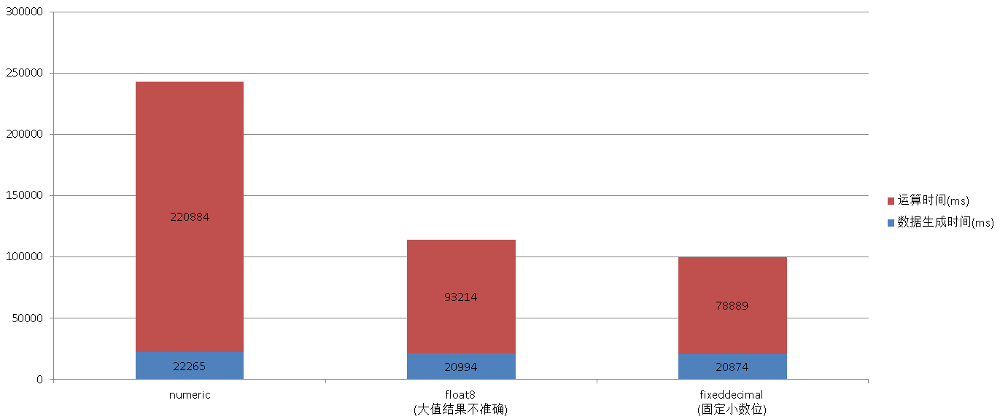

## PostgreSQL fixeddecimal - 用CPU "硬解码" 提升1倍 数值运算能力 助力金融大数据量计算  
                    
### 作者                                                                 
digoal               
                      
### 日期                 
2016-03-03                
                  
### 标签               
PostgreSQL , decimal64 , decimal128 , float4 , float8 , numeric , real    
                    
----              
                       
## 背景    
PostgreSQL 支持的数字类型包括整型，浮点，以及PG自己实现的numeric数据类型。  
  
src/backend/utils/adt/numeric.c    
  
src/backend/utils/adt/float.c    
  
numeric可以存储非常大的数字，超过2^17次方个数字长度。提升了精度的同时，也带来了性能的损耗，不能充分利用CPU 的 “硬解码”能力。  
  
```  
typedef struct NumericVar    
{    
        int                     ndigits;                /* # of digits in digits[] - can be 0! */    
        int                     weight;                 /* weight of first digit */    
        int                     sign;                   /* NUMERIC_POS, NUMERIC_NEG, or NUMERIC_NAN */    
        int                     dscale;                 /* display scale */    
        NumericDigit *buf;                      /* start of palloc'd space for digits[] */    
        NumericDigit *digits;           /* base-NBASE digits */    
} NumericVar;    
```  
  
浮点类型就比numeric轻量很多，所以性能也会好很多，一倍左右。  
  
在大数据的场合中，节约1倍的计算量是很可观的哦，特别是在金融行业，涉及到大量的数值计算。  
  
如果你玩过greenplum, deepgreen, vitessedb ，也能发现在这些数据库产品的测试手册中，会提到使用money, float8类型来替换原有的numeric类型来进行测试。可以得到更好的性能。  
  
但是money, float8始终是有一定的弊端的，超出精度时，结果可能不准确。  
  
那么怎样提升numeric的性能又不会得到有误的结果呢？  
  
我们可以使用fexeddecimal插件，如下：  
  
https://github.com/2ndQuadrant/fixeddecimal  
  
fixeddecimal的原理很简单，实际上它是使用int8来存储的，整数位和小数位是在代码中固定的：  
  
```  
/*    
 * The scale which the number is actually stored.    
 * For example: 100 will allow 2 decimal places of precision    
 * This must always be a '1' followed by a number of '0's.    
 */    
#define FIXEDDECIMAL_MULTIPLIER 100LL    
  
/*    
 * Number of decimal places to store.    
 * This number should be the number of decimal digits that it takes to    
 * represent FIXEDDECIMAL_MULTIPLIER - 1    
 */    
#define FIXEDDECIMAL_SCALE 2    
```  
  
如果 FIXEDDECIMAL_SCALE 设置为2，则FIXEDDECIMAL_MULTIPLIER 设置为100，如果 FIXEDDECIMAL_SCALE 设置为3，FIXEDDECIMAL_MULTIPLIER 设置为1000。  
  
也就是通过整型来存储，显示时除以multiplier得到整数部分，取余得到小数部分。  
  
```  
/*    
 * fixeddecimal2str    
 *              Prints the fixeddecimal 'val' to buffer as a string.    
 *              Returns a pointer to the end of the written string.    
 */    
static char *    
fixeddecimal2str(int64 val, char *buffer)    
{    
        char       *ptr = buffer;    
        int64           integralpart = val / FIXEDDECIMAL_MULTIPLIER;    
        int64           fractionalpart = val % FIXEDDECIMAL_MULTIPLIER;    
  
        if (val < 0)    
        {    
                fractionalpart = -fractionalpart;    
  
                /*    
                 * Handle special case for negative numbers where the intergral part    
                 * is zero. pg_int64tostr() won't prefix with "-0" in this case, so    
                 * we'll do it manually    
                 */    
                if (integralpart == 0)    
                        *ptr++ = '-';    
        }    
        ptr = pg_int64tostr(ptr, integralpart);    
        *ptr++ = '.';    
        ptr = pg_int64tostr_zeropad(ptr, fractionalpart, FIXEDDECIMAL_SCALE);    
        return ptr;    
}    
```  
  
所以fixeddecimal能存取的值范围就是INT8的范围除以multiplier。  
  
```  
postgres=# select 9223372036854775807::int8;    
        int8             
---------------------    
 9223372036854775807    
(1 row)    
  
postgres=# select 9223372036854775808::int8;    
ERROR:  22003: bigint out of range    
LOCATION:  numeric_int8, numeric.c:2955    
  
postgres=# select 92233720368547758.07::fixeddecimal;    
     fixeddecimal         
----------------------    
 92233720368547758.07    
(1 row)    
  
postgres=# select 92233720368547758.08::fixeddecimal;    
ERROR:  22003: value "92233720368547758.08" is out of range for type fixeddecimal    
LOCATION:  scanfixeddecimal, fixeddecimal.c:499    
```  
  
另外需要注意，编译fixeddecimal需要用到支持__int128的编译器，gcc 4.9.3是支持的。所以如果你用的gcc版本比较低的话，需要提前更新好gcc。  
  
http://blog.163.com/digoal@126/blog/static/163877040201601313814429/  
  
下面测试一下fixeddecimal+PostgreSQL 9.5的性能表现，对1亿数据进行加减乘除以及聚合的运算，看float8, numeric, fixeddecimal类型的运算结果和速度：  
  
使用auto_explain记录下对比float8,numeric,fixeddecimal的执行计划和耗时。  
  
```  
psql  
\timing    
  
postgres=# load 'auto_explain';    
LOAD    
Time: 2.328 ms    
  
postgres=# set auto_explain.log_analyze =true;    
SET    
Time: 0.115 ms    
postgres=# set auto_explain.log_buffers =true;    
SET    
Time: 0.080 ms    
postgres=# set auto_explain.log_nested_statements=true;    
SET    
Time: 0.073 ms    
postgres=# set auto_explain.log_timing=true;    
SET    
Time: 0.089 ms    
postgres=# set auto_explain.log_triggers=true;    
SET    
Time: 0.076 ms    
postgres=# set auto_explain.log_verbose=true;    
SET    
Time: 0.074 ms    
postgres=# set auto_explain.log_min_duration=0;    
SET    
Time: 0.149 ms    
postgres=# set client_min_messages ='log';    
SET    
Time: 0.144 ms    
  
postgres=# set work_mem='8GB';    
SET    
Time: 0.152 ms    
  
postgres=# select sum(i::numeric),min(i::numeric),max(i::numeric),avg(i::numeric),sum(3.0::numeric*(i::numeric+i::numeric)),avg(i::numeric/3.0::numeric) from generate_series(1,100000000) t(i);    
LOG:  duration: 241348.655 ms  plan:    
Query Text: select sum(i::numeric),min(i::numeric),max(i::numeric),avg(i::numeric),sum(3.0::numeric*(i::numeric+i::numeric)),avg(i::numeric/3.0::numeric) from generate_series(1,100000000) t(i);    
Aggregate  (cost=50.01..50.02 rows=1 width=4) (actual time=241348.631..241348.631 rows=1 loops=1)    
  Output: sum((i)::numeric), min((i)::numeric), max((i)::numeric), avg((i)::numeric), sum((3.0 * ((i)::numeric + (i)::numeric))), avg(((i)::numeric / 3.0))    
  ->  Function Scan on pg_catalog.generate_series t  (cost=0.00..10.00 rows=1000 width=4) (actual time=12200.116..22265.586 rows=100000000 loops=1)    
        Output: i    
        Function Call: generate_series(1, 100000000)    
       sum        | min |    max    |          avg          |         sum         |              avg                  
------------------+-----+-----------+-----------------------+---------------------+-------------------------------    
 5000000050000000 |   1 | 100000000 | 50000000.500000000000 | 30000000300000000.0 | 16666666.83333333333333333333    
(1 row)    
  
Time: 243149.286 ms    
  
postgres=# select sum(i::float8),min(i::float8),max(i::float8),avg(i::float8),sum(3.0::float8*(i::float8+i::float8)),avg(i::float8/3.0::float8) from generate_series(1,100000000) t(i);    
LOG:  duration: 112407.004 ms  plan:    
Query Text: select sum(i::float8),min(i::float8),max(i::float8),avg(i::float8),sum(3.0::float8*(i::float8+i::float8)),avg(i::float8/3.0::float8) from generate_series(1,100000000) t(i);    
Aggregate  (cost=50.01..50.02 rows=1 width=4) (actual time=112406.967..112406.967 rows=1 loops=1)    
  Output: sum((i)::double precision), min((i)::double precision), max((i)::double precision), avg((i)::double precision), sum(('3'::double precision * ((i)::double precision + (i)::double precision))), avg(((i)::double precision / '3'::double precision))    
  ->  Function Scan on pg_catalog.generate_series t  (cost=0.00..10.00 rows=1000 width=4) (actual time=12157.571..20994.444 rows=100000000 loops=1)    
        Output: i    
        Function Call: generate_series(1, 100000000)    
      sum       | min |    max    |    avg     |         sum          |       avg            
----------------+-----+-----------+------------+----------------------+------------------    
 5.00000005e+15 |   1 | 100000000 | 50000000.5 | 3.00000003225094e+16 | 16666666.8333333    
(1 row)    
  
Time: 114208.528 ms    
  
postgres=# select sum(i::fixeddecimal),min(i::fixeddecimal),max(i::fixeddecimal),avg(i::fixeddecimal),sum(3.0::fixeddecimal*(i::fixeddecimal+i::fixeddecimal)),avg(i::fixeddecimal/3.0::fixeddecimal) from generate_series(1,100000000) t(i);    
LOG:  duration: 97956.458 ms  plan:    
Query Text: select sum(i::fixeddecimal),min(i::fixeddecimal),max(i::fixeddecimal),avg(i::fixeddecimal),sum(3.0::fixeddecimal*(i::fixeddecimal+i::fixeddecimal)),avg(i::fixeddecimal/3.0::fixeddecimal) from generate_series(1,100000000) t(i);    
Aggregate  (cost=50.01..50.02 rows=1 width=4) (actual time=97956.431..97956.431 rows=1 loops=1)    
  Output: sum((i)::fixeddecimal), min((i)::fixeddecimal), max((i)::fixeddecimal), avg((i)::fixeddecimal), sum(('3.00'::fixeddecimal * ((i)::fixeddecimal + (i)::fixeddecimal))), avg(((i)::fixeddecimal / '3.00'::fixeddecimal))    
  ->  Function Scan on pg_catalog.generate_series t  (cost=0.00..10.00 rows=1000 width=4) (actual time=12168.630..20874.617 rows=100000000 loops=1)    
        Output: i    
        Function Call: generate_series(1, 100000000)    
         sum         | min  |     max      |     avg     |         sum          |     avg         
---------------------+------+--------------+-------------+----------------------+-------------    
 5000000050000000.00 | 1.00 | 100000000.00 | 50000000.50 | 30000000300000000.00 | 16666666.83    
(1 row)    
  
Time: 99763.032 ms    
```  
  
性能对比:  
  
  
  
注意上面的测试case,  
  
float8的结果已经不准确了，fixeddecimal使用了默认的scale=2，所以小数位保持2位精度。  
  
numeric则精度更高，显示的部分没有显示全，这是PG内部控制的。  
  
另外需要注意的是，fixeddecimal对于超出精度的部分是做的截断，不是round, 因此123.555是存的12355而不是12356。  
  
```  
postgres=# select '123.555'::fixeddecimal;    
 fixeddecimal     
--------------    
 123.55    
(1 row)    
  
postgres=# select '123.555'::fixeddecimal/'123.556'::fixeddecimal;    
 ?column?     
----------    
 1.00    
(1 row)    
  
postgres=# select '124.555'::fixeddecimal/'123.556'::fixeddecimal;    
 ?column?     
----------    
 1.00    
(1 row)    
  
postgres=# select 124.555/123.556;    
      ?column?          
--------------------    
 1.0080854025704944    
(1 row)    
```  
  
## 参考
https://github.com/2ndQuadrant/fixeddecimal  
  
<a rel="nofollow" href="http://info.flagcounter.com/h9V1"  ></a>  
  
  
  
  
  
  
## [digoal's 大量PostgreSQL文章入口](https://github.com/digoal/blog/blob/master/README.md "22709685feb7cab07d30f30387f0a9ae")
  
