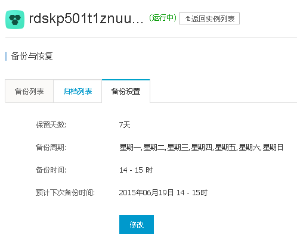
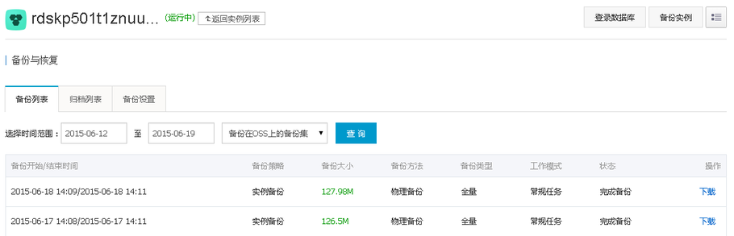
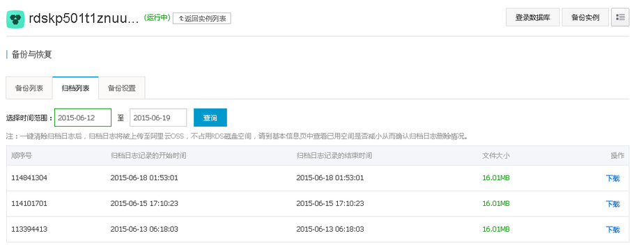

## 如何将阿里云RDS PgSQL恢复到本地主机中  
                                                                                                                                                                     
### 作者                                                                                                                                                                     
digoal                                                                                                                                                                     
                                                                                                                                                                     
### 日期                                                                                                                                                                     
2016-03-16                                                                                                                                                                
                                                                                                                                                                     
### 标签                                                                                                                                                                     
PostgreSQL , 阿里云rds , 备库 , 本地恢复    
                                                                                                                                                                     
----                                                                                                                                                                     
                                                                                                                                                                     
## 背景                                                         
阿里云的RDS for PostgreSQL目前提供的备份为物理备份，备份粒度可以自己设置，最频繁的基础备份可以做到一天一次。    
  
有了这个备份和归档日志，我们可以做到基于任意时间点（实际上是事务提交或回滚点的粒度）的恢复。    
  
在RDS的控制台可以看到：    
  
    
  
  
  
  
    
接下来我将演示一下如何实现以及如何设计一个好的恢复方案。    
  
甚至我们在了解其中的原理后，如果阿里云将来提供基于时间点的恢复服务，我们应该如何更好的与之结合来使用。    
    
要恢复到任意时间点，我们就必须告诉恢复进程一个点，这个点可以是时间，字符串，或者XID。    
  
1\. 时间很好理解，其实就是触及这个时间后的XLOG中的第一个事务结束位置作为停止点。    
  
2\. 字符串，这个是需要通过pg_create_restore_point函数来创建的一个还原点，需要超级用户调用这个函数。    
  
3\. XID也很好理解，就是恢复到指定事务的结束位置。    
  
既然我们已经知道了数据库可以恢复到指定的这几个位置，我们怎么来结合呢？    
  
例如我们在做一笔比较重要的操作前，可以创建一个还原点（但是需要超级用户），不适合阿里云RDS。    
  
```  
postgres=# select pg_create_restore_point('digoal');    
 pg_create_restore_point     
-------------------------    
 1D6/FB17EC08    
(1 row)    
```  
  
阿里云为了防止一些用户的误操作，只开放了普通用户给用户使用，所以有一些东西都无法操作，例如创建检查点，切换XLOG，创建还原点都无法操作。    
  
```  
postgres=> checkpoint;    
ERROR:  must be superuser to do CHECKPOINT    
postgres=> select pg_switch_xlog();    
ERROR:  must be superuser to switch transaction log files    
postgres=> select pg_create_restore_point('ab');    
ERROR:  must be superuser to create a restore point    
```  
  
时间其实是一个比较模糊的概念，所以也不建议使用，除非是我们没有其他信息，才使用时间。    
XID是一个很不错的信息，我们在阿里云就用它了。    
首先要创建一个记录还原点XID的表。记录XID，时间，以及描述信息。（来代替pg_create_restore_point系统函数的功能）    
  
```  
postgres=> create table restore_point(id serial primary key, xid int8, crt_time timestamp default now(), point text);    
CREATE TABLE    
```  
  
创建一个函数，代替pg_create_restore_point的功能，插入还原点。    
  
```  
postgres=> create or replace function create_restore_point(i_point text) returns void as $$    
declare     
begin    
  insert into restore_point(xid,point) values (txid_current(),i_point);    
end;    
$$ language plpgsql strict;    
CREATE FUNCTION    
```  
  
插入一个还原点    
  
```  
postgres=> select create_restore_point('digoal');    
 create_restore_point     
----------------------    
     
(1 row)    
```  
  
查询这个表的信息：    
  
```  
postgres=> select * from restore_point;    
 id |  xid   |          crt_time          | point      
----+--------+----------------------------+--------    
  1 | 561426 | 2015-06-19 09:18:57.525475 | digoal    
(1 row)    
postgres=> select * from restore_point where point='digoal';    
 id |  xid   |          crt_time          | point      
----+--------+----------------------------+--------    
  1 | 561426 | 2015-06-19 09:18:57.525475 | digoal    
(1 row)    
```  
  
接下来要模拟一下还原：   
  
```  
postgres=> create table test(id int,info text);    
CREATE TABLE    
postgres=> insert into test select generate_series(1,1000),md5(random()::text);    
INSERT 0 1000    
```  
  
  
记录当前哈希值。用于恢复后的比对。    
  
```  
postgres=> select sum(hashtext(t.*::text)) from test t;    
     sum          
--------------    
 -69739904784    
(1 row)    
```  
  
接下来我要做一笔删除操作，在删除前，我先创建一条还原点信息。    
  
```  
postgres=> select create_restore_point('before delete test');    
 create_restore_point     
----------------------    
     
(1 row)    
postgres=> delete from test;    
DELETE 1000    
postgres=> select * from restore_point where point='before delete test';    
 id |  xid   |          crt_time          |       point            
----+--------+----------------------------+--------------------    
  2 | 561574 | 2015-06-19 09:45:28.030295 | before delete test    
(1 row)    
```  
  
我只需要恢复到561574 即可。接下来就是模拟恢复了。    
  
但是这个文件可能还没有归档，而pg_switch_xlog()函数又不能用，我们只能主动产生一些XLOG，让RDS触发归档。    
  
```  
postgres=> select pg_xlogfile_name(pg_current_xlog_location());    
     pg_xlogfile_name         
--------------------------    
 000000010000000200000041    
(1 row)    
postgres=> insert into test select generate_series(1,100000);    
INSERT 0 100000    
postgres=> insert into test select generate_series(1,100000);    
INSERT 0 100000    
postgres=> select pg_xlogfile_name(pg_current_xlog_location());    
     pg_xlogfile_name         
--------------------------    
 000000010000000200000042    
(1 row)    
```  
  
已经切换。接下来我们需要下载阿里云RDS的备份和归档到本地。    
  
并且在本地需要安装一个postgresql, 并且与阿里云RDS的编译配置参数一致(例如数据块的大小)，最好使用的模块也一致，但是这里没有用到其他模块，所以无所谓。    
  
给阿里云RDS一个建议，最好提供用户一个软件打包，方便用户恢复，降低恢复门槛。    
  
编译项可以使用pg_config命令查看，但是RDS我们没有办法这么查看。通过pg_settings来看吧。    
  
```  
postgres=> select name,setting,unit from pg_settings where category='Preset Options';    
         name          | setting | unit     
-----------------------+---------+------    
 block_size            | 8192    |      
 data_checksums        | on      |     
 integer_datetimes     | on      |     
 max_function_args     | 100     |     
 max_identifier_length | 63      |     
 max_index_keys        | 32      |     
 segment_size          | 131072  | 8kB    
 server_version        | 9.4.1   |     
 server_version_num    | 90401   |     
 wal_block_size        | 8192    |     
 wal_segment_size      | 2048    | 8kB    
(11 rows)    
postgres=> select version();    
                                                   version                                                        
--------------------------------------------------------------------------------------------------------------    
 PostgreSQL 9.4.1 on x86_64-unknown-linux-gnu, compiled by gcc (GCC) 4.4.6 20110731 (Red Hat 4.4.6-3), 64-bit    
(1 row)    
```  
  
  
本地编译安装PostgreSQL 9.4.1，编译参数与RDS一致。阿里云RDS这几个参数都是默认的。    
  
```  
  --with-blocksize=BLOCKSIZE    
                          set table block size in kB [8]    
  --with-segsize=SEGSIZE  set table segment size in GB [1]    
  --with-wal-blocksize=BLOCKSIZE    
                          set WAL block size in kB [8]    
  --with-wal-segsize=SEGSIZE    
                          set WAL segment size in MB [16]    
```  
  
  
安装    
  
```  
# useradd digoal    
# su - digoal    
$ vi .bash_profile    
# add by digoal    
export PS1="$USER@`/bin/hostname -s`-> "    
export PGPORT=1931    
export PGDATA=/home/digoal/pg_root    
export LANG=en_US.utf8    
export PGHOME=/home/digoal/pgsql9.4.1    
export LD_LIBRARY_PATH=$PGHOME/lib:/lib64:/usr/lib64:/usr/local/lib64:/lib:/usr/lib:/usr/local/lib:$LD_LIBRARY_PATH    
export DATE=`date +"%Y%m%d%H%M"`    
export PATH=$PGHOME/bin:$PATH:.    
export MANPATH=$PGHOME/share/man:$MANPATH    
export PGHOST=$PGDATA    
export PGDATABASE=postgres    
alias rm='rm -i'    
alias ll='ls -lh'    
unalias vi    
    
# wget https://ftp.postgresql.org/pub/source/v9.4.1/postgresql-9.4.1.tar.bz2    
# tar -jxvf postgresql-9.4.1.tar.bz2    
# cd postgresql-9.4.1    
# ./configure --prefix=/home/digoal/pgsql9.4.1 --with-pgport=1931 --with-perl --with-python --with-tcl --with-openssl --with-pam --with-ldap --with-libxml --with-libxslt --enable-thread-safety --enable-debug    
# gmake world && gmake install-world    
```  
    
    
下载备份和归档文件，解压：    
  
基础备份选择需要恢复的时间点之前的一个备份，归档则选择在此之后的所有归档文件。    
  
```  
total 453M    
-rw-r--r-- 1 root   root    17M Jun 19 10:23 000000010000000200000040.tar.gz    
-rw-r--r-- 1 root   root    17M Jun 19 10:23 000000010000000200000041.tar.gz    
-rw-r--r-- 1 root   root   404M Jun 19 10:23 hins668881_xtra_20150618232331.tar.gz    
    
# mkdir /home/digoal/pg_root    
# mv hins668881_xtra_20150618232331.tar.gz /home/digoal/pg_root    
# tar -zxvf hins668881_xtra_20150618232331.tar.gz    
[root@db-172-16-3-150 ~]# tar -xvf 000000010000000200000040.tar.gz     
000000010000000200000040    
[root@db-172-16-3-150 ~]# tar -xvf 000000010000000200000041.tar.gz     
000000010000000200000041    
[root@db-172-16-3-150 ~]# mv 000000010000000200000040 /home/digoal/    
[root@db-172-16-3-150 ~]# mv 000000010000000200000041 /home/digoal/    
[root@db-172-16-3-150 ~]# chown -R digoal:digoal /home/digoal    
[root@db-172-16-3-150 ~]# chmod -R 700 /home/digoal/pg_root    
```  
  
修改配置文件    
  
```  
$ vi postgresql.conf    
port=1931    
注释RDS自定义的GUC参数    
#rds_enable_proxy=on    
#rds_available_extensions='plpgsql,pg_stat_statements,btree_gin,btree_gist,chkpass,citext,cube,dblink,dict_int,earthdistance,hstore,intagg,intarray,isn,ltree,pgcrypto,pgrowlocks,pg_prewarm,pg_trgm,postgres_fdw,sslinfo,tablefunc,tsearch2,unaccent,postgis,postgis_topology,fuzzystrmatch,postgis_tiger_geocoder,plperl,pltcl,plv8,plls,plcoffee,"uuid-ossp"'    
#rds_enable_admin_user_as_super=on    
```  
  
配置recovery.conf    
  
打开hot_standby，恢复到目标点后暂停，如果确认已经到达，使用resume激活。    
  
```  
$ vi recovery.conf    
standby_mode = 'on'    
restore_command = 'cp /home/digoal/%f %p'               
recovery_target_xid='561574'  # 使用我们自建的恢复点的XID    
recovery_target_inclusive=true    
pause_at_recovery_target=true    
```  
  
启动数据库    
  
```  
$ pg_ctl start    
```  
  
检查是否恢复到指定XID    
  
```  
digoal@db-172-16-3-150-> psql -h 127.0.0.1 -p 1931    
psql (9.4.1)    
Type "help" for help.    
    
postgres=> \dt    
             List of relations    
 Schema |      Name       | Type  | Owner      
--------+-----------------+-------+--------    
 public | ha_health_check | table | aurora    
 public | login_log       | table | digoal    
 public | restore_point   | table | digoal    
 public | session         | table | digoal    
 public | tbl_small       | table | digoal    
 public | test            | table | digoal    
 public | userinfo        | table | digoal    
(7 rows)    
```  
  
检查，已经恢复到DELETE test表的数据之前了，HASH sum值一致。    
  
```  
postgres=> select count(*) from test;    
 count     
-------    
  1000    
(1 row)    
postgres=> select sum(hashtext(t.*::text)) from test t;    
     sum          
--------------    
 -69739904784    
(1 row)    
```  
  
接下来就交给你了，导出逻辑备份，还原，或者其他。。。。。。    
    
## 其他    
1\. RDS增加了一些GUC控制参数，例如，    
  
```  
rds_enable_proxy=on    
rds_available_extensions='plpgsql,pg_stat_statements,btree_gin,btree_gist,chkpass,citext,cube,dblink,dict_int,earthdistance,hstore,intagg,intarray,isn,ltree,pgcrypto,pgrowlocks,pg_prewarm,pg_trgm,postgres_fdw,sslinfo,tablefunc,tsearch2,unaccent,postgis,postgis_topology,fuzzystrmatch,postgis_tiger_geocoder,plperl,pltcl,plv8,plls,plcoffee,"uuid-ossp"'    
rds_enable_admin_user_as_super=on    
```  
  
可以看到对云化做的一些修改：    
  
```  
digoal@db-172-16-3-150-> cat postgresql.conf    
#    
#Thu Jun 11 22:34:23 CST 2015    
checkpoint_segments=64    
autovacuum_vacuum_scale_factor=0.1    
maintenance_work_mem=16MB    
log_min_duration_statement=1000    
archive_mode=on    
log_lock_waits=on    
max_prepared_transactions=800    
log_rotation_size=10MB    
timezone='PRC'    
archive_command='cp %p /u02/rds427ugtq91telkvtwap/arch/%f'    
track_functions=all    
port=3011    
max_replication_slots=10    
max_connections=100    
hot_standby=on    
lc_numeric='zh_CN.UTF-8'    
pg_stat_statements.max=1000    
checkpoint_completion_target=0.9    
lc_monetary='zh_CN.UTF-8'    
log_line_prefix='\1\n\t%p\t%r\t%u\t%d\t%t\t%e\t\t\t\t\t\t'    
datestyle='iso, ymd'    
wal_keep_segments=80    
superuser_reserved_connections=10    
default_text_search_config='pg_catalog.simple'    
max_wal_senders=5    
track_io_timing=on    
autovacuum_analyze_scale_factor=0.1    
work_mem=4MB    
wal_buffers=7864kB    
pg_stat_statements.track=all    
rds_enable_proxy=on    
logging_collector=on    
log_timezone='UTC'    
log_directory='pg_log'    
listen_addresses='*'    
shared_preload_libraries='pg_stat_statements'    
log_filename='postgresql-%Y-%m-%d_%H%M%S.log'    
wal_level=hot_standby    
hot_standby_feedback=on    
log_truncate_on_rotation=on    
log_rotation_age=0    
lc_time='zh_CN.UTF-8'    
lc_messages='C'    
default_statistics_target=100    
autovacuum_max_workers=5    
rds_available_extensions='plpgsql,pg_stat_statements,btree_gin,btree_gist,chkpass,citext,cube,dblink,dict_int,earthdistance,hstore,intagg,intarray,isn,ltree,pgcrypto,pgrowlocks,pg_prewarm,pg_trgm,postgres_fdw,sslinfo,tablefunc,tsearch2,unaccent,postgis,postgis_topology,fuzzystrmatch,postgis_tiger_geocoder,plperl,pltcl,plv8,plls,plcoffee,"uuid-ossp"'    
log_temp_files=100000    
log_statement='all'    
shared_buffers=256MB    
effective_cache_size=768MB    
autovacuum_vacuum_cost_delay=0    
bgwriter_delay=20ms    
rds_enable_admin_user_as_super=on    
```  
  
2\. 从pg_hba.conf可以看出，阿里云的RDS 基于流复制的standby 节点有两个，本地一个，异地一个。    
  
但是实际上只开了一个异地的流复制节点。并且没有使用slot，原因可能是准备用于同步流复制的。    
  
```  
digoal@db-172-16-3-150-> grep "^[a-z]" pg_hba.conf     
local   all             all                                     trust    
host    all             all             127.0.0.1/32            trust    
host    all             all             ::1/128                 trust    
local replication pgrds427ugtq91telkvtwap   trust    
host all all 0.0.0.0/0 md5    
host replication xx xx.xx.xx.xx/32 md5    
```  
  
实际开了1个流复制节点：    
  
```  
postgres=> select * from pg_stat_replication ;    
  pid  | usesysid |  usename   | application_name | client_addr | client_hostname | client_port | backend_start | backend_xmin | sta    
te | sent_location | write_location | flush_location | replay_location | sync_priority | sync_state     
-------+----------+------------+------------------+-------------+-----------------+-------------+---------------+--------------+----    
---+---------------+----------------+----------------+-----------------+---------------+------------    
 27049 |    16384 | replicator | standby1         |             |                 |             |               |       561915 |        
   |               |                |                |                 |               |     
(1 row)    
postgres=> select * from pg_replication_slots ;    
 slot_name | plugin | slot_type | datoid | database | active | xmin | catalog_xmin | restart_lsn     
-----------+--------+-----------+--------+----------+--------+------+--------------+-------------    
(0 rows)    
```  
  
## 参考    
1\. http://www.postgresql.org/docs/9.4/static/recovery-config.html    
  
<a rel="nofollow" href="http://info.flagcounter.com/h9V1"  ></a>  
  
  
  
  
  
  
## [digoal's 大量PostgreSQL文章入口](https://github.com/digoal/blog/blob/master/README.md "22709685feb7cab07d30f30387f0a9ae")
  
