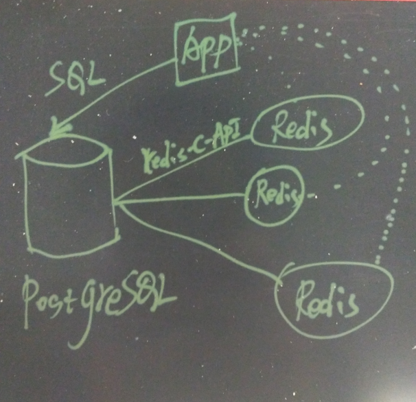

## PostgreSQL 与基友们的故事之 - Redis (无限缓存,实时标签...)    
                                                                       
### 作者                                                                       
digoal                                                                       
                                                                       
### 日期                                                                       
2016-03-25                                                                     
                                                                       
### 标签                                                                       
PostgreSQL , redis , fdw       
                                                                       
----                                                                       
                                                                       
## 背景                 
在PostgreSQL中直接读写redis。       
    
好处多多，可以降低应用层设计的复杂度，减少交互次数，降低RT。       
    
应用场景举例：      
    
1\. 使用redis作为PostgreSQL的二级缓存， 提升数据库的性能。       
        
    例如在生产中有多台redis主机或集群，使用redis扩展PG的二级缓存能力，减少对IO的需求。       
        
    这个完全可以做成触发器形式的，数据插入或更新的时候，同时插入或更新到redis。      
        
    删除的时候，从redis删除。      
    
用来做二级缓存时，更新从postgresql直接操作redis来减少总的交互次数。      
    
查询时直接查询redis或者从postgresql去查询redis都是可以的，如果是乐观的情况，从redis去查是OK的，如果是悲观的情况则从postgresql去读，同时写入redis.      
    
2\.例如用来计算记录的COUNT数，数据插入或删除的时候，记录自增或自减。      
    
3\. 利用来对数据统计标签，例如数据入库时，按照数据的用户ID以及记录的行为习惯进行标签化，将标签信息直接存入REDIS，作为一个实时标签系统。      
    
    
    
    
    
当然还有更多的玩法，等待发掘。      
    
PostgreSQL的好基友还真多，redis也是其中一个。      
    
下面简单的介绍一下redis_fdw插件的安装和使用以及目前的限制。      
    
注意redis可以在其他主机上，不要被我的文档局限了。       
    
redis_fdw已经有很多用户在生产中使用，而且PG的fdw接口是非常靠谱的。      
    
建议使用新版的gcc      
    
[《gcc 更新》](../201601/20160113_02.md)      
    
安装好GCC之后      
    
```    
which gcc    
~/gcc4.9.3/bin/gcc    
```    
    
安装和部署redis      
    
```    
cd ~    
wget http://download.redis.io/releases/redis-3.0.7.tar.gz    
    
tar -zxvf redis-3.0.7.tar.gz    
    
cd redis-3.0.7    
    
make -j 32    
make test    
    
make PREFIX=/home/digoal/redis install    
    
cd /home/digoal/redis    
cp ~/redis-3.0.7/redis.conf ./    
    
mkdir /disk1/digoal/redis    
    
vi redis.conf    
daemonize yes    
pidfile /disk1/digoal/redis/redis.pid    
port 6379    
tcp-backlog 511    
bind 0.0.0.0    
timeout 60    
tcp-keepalive 60    
loglevel notice    
logfile "/disk1/digoal/redis/redis.log"    
databases 16    
save 900 1    
save 300 10    
save 60 10000    
stop-writes-on-bgsave-error yes    
rdbcompression yes    
rdbchecksum yes    
dbfilename dump.rdb    
dir /disk1/digoal/redis/    
requirepass digoal    
maxclients 10000    
maxmemory 10gb    
maxmemory-policy noeviction    
maxmemory-samples 5    
appendonly no    
appendfilename "appendonly.aof"    
appendfsync everysec    
no-appendfsync-on-rewrite no    
auto-aof-rewrite-percentage 100    
auto-aof-rewrite-min-size 64mb    
aof-load-truncated yes    
lua-time-limit 5000    
slowlog-log-slower-than 10000    
slowlog-max-len 128    
latency-monitor-threshold 0    
notify-keyspace-events ""    
hash-max-ziplist-entries 512    
hash-max-ziplist-value 64    
list-max-ziplist-entries 512    
list-max-ziplist-value 64    
set-max-intset-entries 512    
zset-max-ziplist-entries 128    
zset-max-ziplist-value 64    
hll-sparse-max-bytes 3000    
activerehashing yes    
client-output-buffer-limit normal 0 0 0    
client-output-buffer-limit slave 256mb 64mb 60    
client-output-buffer-limit pubsub 32mb 8mb 60    
hz 10    
aof-rewrite-incremental-fsync yes    
    
./redis-server ./redis.conf    
    
./redis-cli -h 127.0.0.1 -p 6379 -a digoal    
```    
    
测试redis可用性      
    
```    
127.0.0.1:6379> help    
redis-cli 3.0.7    
Type: "help @<group>" to get a list of commands in <group>    
      "help <command>" for help on <command>    
      "help <tab>" to get a list of possible help topics    
      "quit" to exit    
```    
    
测试一下redis的性能      
    
```    
cd ~/redis-3.0.7/src    
./redis-benchmark -h 127.0.0.1 -p 6379 -n 1000000 -c 32    
====== PING_INLINE ======    
  1000000 requests completed in 14.35 seconds    
  32 parallel clients    
  3 bytes payload    
  keep alive: 1    
    
100.00% <= 0 milliseconds    
69676.70 requests per second    
    
====== PING_BULK ======    
  1000000 requests completed in 14.39 seconds    
  32 parallel clients    
  3 bytes payload    
  keep alive: 1    
    
100.00% <= 0 milliseconds    
69516.86 requests per second    
    
====== SET ======    
  1000000 requests completed in 14.42 seconds    
  32 parallel clients    
  3 bytes payload    
  keep alive: 1    
    
100.00% <= 0 milliseconds    
69328.90 requests per second    
    
====== GET ======    
  1000000 requests completed in 14.47 seconds    
  32 parallel clients    
  3 bytes payload    
  keep alive: 1    
    
100.00% <= 0 milliseconds    
69094.18 requests per second    
    
====== INCR ======    
  1000000 requests completed in 14.38 seconds    
  32 parallel clients    
  3 bytes payload    
  keep alive: 1    
    
100.00% <= 0 milliseconds    
69521.70 requests per second    
    
====== LPUSH ======    
  1000000 requests completed in 14.47 seconds    
  32 parallel clients    
  3 bytes payload    
  keep alive: 1    
    
100.00% <= 0 milliseconds    
69118.05 requests per second    
    
====== LPOP ======    
  1000000 requests completed in 14.49 seconds    
  32 parallel clients    
  3 bytes payload    
  keep alive: 1    
    
100.00% <= 0 milliseconds    
69008.35 requests per second    
    
====== SADD ======    
  1000000 requests completed in 14.40 seconds    
  32 parallel clients    
  3 bytes payload    
  keep alive: 1    
    
100.00% <= 0 milliseconds    
69458.91 requests per second    
    
====== SPOP ======    
  1000000 requests completed in 14.58 seconds    
  32 parallel clients    
  3 bytes payload    
  keep alive: 1    
    
100.00% <= 1 milliseconds    
100.00% <= 1 milliseconds    
68577.70 requests per second    
    
====== LPUSH (needed to benchmark LRANGE) ======    
  1000000 requests completed in 14.40 seconds    
  32 parallel clients    
  3 bytes payload    
  keep alive: 1    
    
100.00% <= 0 milliseconds    
69463.74 requests per second    
    
====== LRANGE_100 (first 100 elements) ======    
  1000000 requests completed in 13.74 seconds    
  32 parallel clients    
  3 bytes payload    
  keep alive: 1    
    
100.00% <= 0 milliseconds    
72796.09 requests per second    
    
====== LRANGE_300 (first 300 elements) ======    
  1000000 requests completed in 14.42 seconds    
  32 parallel clients    
  3 bytes payload    
  keep alive: 1    
    
100.00% <= 0 milliseconds    
69328.90 requests per second    
    
====== LRANGE_500 (first 450 elements) ======    
  1000000 requests completed in 14.38 seconds    
  32 parallel clients    
  3 bytes payload    
  keep alive: 1    
    
100.00% <= 0 milliseconds    
69550.70 requests per second    
    
====== LRANGE_600 (first 600 elements) ======    
  1000000 requests completed in 14.43 seconds    
  32 parallel clients    
  3 bytes payload    
  keep alive: 1    
    
100.00% <= 0 milliseconds    
69319.29 requests per second    
    
====== MSET (10 keys) ======    
  1000000 requests completed in 14.20 seconds    
  32 parallel clients    
  3 bytes payload    
  keep alive: 1    
    
100.00% <= 0 milliseconds    
70417.58 requests per second    
```    
    
redis的用法可参考      
    
http://redis.io/commands      
    
假设PostgreSQL已安装好，以PostgreSQL 9.5为例：      
    
redis_fdw有几个分支，请根据PostgreSQL的版本切换分支使用。      
    
安装redis_fdw，需要依赖redis的c接口，hiredis。      
    
```    
cd ~    
git clone https://github.com/pg-redis-fdw/redis_fdw.git    
    
cd redis_fdw/    
git checkout REL9_5_STABLE    
    
git clone https://github.com/redis/hiredis    
cd hiredis    
make    
make PREFIX=/home/digoal/hiredis_bin install    
```    
    
修改redis_fdw的Makefile      
    
```    
vi Makefile    
# 末尾追加    
    
LDFLAGS += -L/home/digoal/hiredis_bin/lib    
```    
    
安装redis_fdw      
    
```    
export PATH=/home/digoal/pgsql9.5.0/bin:$PATH    
make USE_PGXS=1    
make USE_PGXS=1 install    
```    
    
将redis_fdw部署到需要访问redis的PostgreSQL数据库中      
    
```    
cd ~    
$ psql    
psql (9.5.0)    
Type "help" for help.    
    
postgres=# create extension redis_fdw;    
CREATE EXTENSION    
```    
    
测试redis_fdw的用法，创建server，创建foreign table。      
    
通过SQL可以写入和读取redis中的数据。      
    
```    
postgres=# CREATE SERVER redis_server    
postgres-#     FOREIGN DATA WRAPPER redis_fdw    
postgres-#     OPTIONS (address '127.0.0.1', port '6379');    
CREATE SERVER    
    
postgres=# CREATE FOREIGN TABLE redis_db0 (key text, val text)    
postgres-#     SERVER redis_server    
postgres-#     OPTIONS (database '0');    
CREATE FOREIGN TABLE    
    
postgres=#     
postgres=# CREATE USER MAPPING FOR PUBLIC    
postgres-#     SERVER redis_server    
postgres-#     OPTIONS (password 'digoal');    
CREATE USER MAPPING    
    
postgres=# CREATE FOREIGN TABLE myredishash (key text, val text[])    
postgres-#     SERVER redis_server    
postgres-#     OPTIONS (database '0', tabletype 'hash', tablekeyprefix 'mytable:');    
CREATE FOREIGN TABLE    
    
postgres=# INSERT INTO myredishash (key, val)    
   VALUES ('mytable:r1','{prop1,val1,prop2,val2}');    
INSERT 0 1    
    
postgres=# UPDATE myredishash    
postgres-#     SET val = '{prop3,val3,prop4,val4}'    
postgres-#     WHERE key = 'mytable:r1';    
UPDATE 1    
    
postgres=# select * from myredishash ;    
    key     |           val               
------------+-------------------------    
 mytable:r1 | {prop3,val3,prop4,val4}    
(1 row)    
    
postgres=# select * from myredishash ;    
    key     |           val               
------------+-------------------------    
 mytable:r1 | {prop3,val3,prop4,val4}    
(1 row)    
    
postgres=# DELETE from myredishash    
postgres-#     WHERE key = 'mytable:r1';    
DELETE 1    
    
postgres=# select * from myredishash ;    
 key | val     
-----+-----    
(0 rows)    
    
postgres=# CREATE FOREIGN TABLE myredis_s_hash (key text, val text)    
postgres-#     SERVER redis_server    
postgres-#     OPTIONS (database '0', tabletype 'hash',  singleton_key 'mytable');    
CREATE FOREIGN TABLE    
    
postgres=# INSERT INTO myredis_s_hash (key, val)    
postgres-#    VALUES ('prop1','val1'),('prop2','val2');    
INSERT 0 2    
    
postgres=# select * from myredis_s_hash ;    
  key  | val      
-------+------    
 prop1 | val1    
 prop2 | val2    
(2 rows)    
    
postgres=# UPDATE myredis_s_hash    
postgres-#     SET val = 'val23'    
postgres-#     WHERE key = 'prop1';    
UPDATE 1    
    
postgres=# select * from myredis_s_hash ;    
  key  |  val      
-------+-------    
 prop1 | val23    
 prop2 | val2    
(2 rows)    
    
postgres=# DELETE from myredis_s_hash    
postgres-#     WHERE key = 'prop2';    
DELETE 1    
    
postgres=# \set VERBOSITY verbose    
postgres=# INSERT INTO myredis_s_hash (key, val)    
   VALUES ('prop1','val1'),('prop2','val2');    
ERROR:  23505: key already exists: prop1    
LOCATION:  redisExecForeignInsert, redis_fdw.c:2158    
postgres=# select * from myredis_s_hash ;           
  key  |  val      
-------+-------    
 prop1 | val23    
(1 row)    
```    
    
redis_fdw详细的用法介绍      
    
1\. CREATE SERVER 支持的 option      
    
指定地址和端口      
    
```    
address: The address or hostname of the Redis server. Default: 127.0.0.1    
port: The port number on which the Redis server is listening. Default: 6379    
```    
    
2\. CREATE USER MAPPING 支持的 option      
    
指定密码      
    
```    
password: The password to authenticate to the Redis server with. Default:    
```    
    
3\. CREATE FOREIGN TABLE 支持的 option      
    
指定数据库ID       
    
表类型(hash,list,set,zset或scalar)       
    
key 前缀  key 集合  singleton_key 指定KEY  （三选一）      
    
```    
database: The numeric ID of the Redis database to query. Default: 0    
(9.2 and later) tabletype: can be 'hash', 'list', 'set' or 'zset' Default: none, meaning only look at scalar values.    
(9.2 and later) tablekeyprefix: only get items whose names start with the prefix Default: none    
(9.2 and later) tablekeyset: fetch item names from the named set Default: none    
(9.2 and later) singleton_key: get all the values in the table from a single named object. Default: none, meaning don't just use a single object.    
    
You can only have one of tablekeyset and tablekeyprefix, and if you use singleton_key you can't have either.    
Structured items are returned as array text, or, if the value column is a text array as an array of values.     
In the case of hash objects this array is an array of key, value, key, value ...    
Singleton key tables are returned as rows with a single column of text in the case of lists sets and scalars, rows with key and value text columns for hashes, and rows with a value text columns and an optional numeric score column for zsets.    
```    
    
限制    
    
1\. There's no such thing as a cursor in Redis, or MVCC, which leaves us with no way to atomically query the database for the available keys and then fetch each value.     
    
So, we get a list of keys to begin with, and then fetch whatever records still exist as we build the tuples.    
    
如果不带条件的查询，或者创建foreign table时没有指定单一KEY，则需要返回集合      
    
redis_fdw/redis_fdw.c      
    
```    
/* initial cursor */    
#define ZERO "0"    
/* redis default is 10 - let's fetch 1000 at a time */    
#define COUNT " COUNT 1000"    
    
/*    
 * redisBeginForeignScan    
 *		Initiate access to the database    
 */    
static void    
redisBeginForeignScan(ForeignScanState *node, int eflags)    
{    
...    
	/* Execute the query */    
	if (festate->singleton_key)    
	{    
		/*    
		 * We're not using cursors for now for singleton key tables. The    
		 * theory is that we don't expect them to be so large in normal use    
		 * that we would get any significant benefit from doing so, and in any    
		 * case scanning them in a single step is not going to tie things up    
		 * like scannoing the whole Redis database could.    
		 */    
	...    
	}    
	else if (qual_value && pushdown)    
	{    
		/*    
		 * if we have a qual, make sure it's a member of the keyset or has the    
		 * right prefix if either of these options is specified.    
		 *    
		 * If not set row to -1 to indicate failure    
		 */    
         ...    
	else    
	{    
		/* no qual - do a cursor scan */    
		if (festate->keyset)    
		{    
			festate->cursor_search_string = "SSCAN %s %s" COUNT;    
			reply = redisCommand(context, festate->cursor_search_string,    
								 festate->keyset, ZERO);    
		}    
		else if (festate->keyprefix)    
		{    
			festate->cursor_search_string = "SCAN %s MATCH %s*" COUNT;    
			reply = redisCommand(context, festate->cursor_search_string,    
								 ZERO, festate->keyprefix);    
		}    
		else    
		{    
			festate->cursor_search_string = "SCAN %s" COUNT;    
			reply = redisCommand(context, festate->cursor_search_string, ZERO);    
		}    
	}    
...    
```    
    
2\. We can only push down a single qual to Redis, which must use the TEXTEQ operator, and must be on the 'key' column.    
  
  
<a rel="nofollow" href="http://info.flagcounter.com/h9V1"  ></a>  
  
  
  
  
  
  
## [digoal's 大量PostgreSQL文章入口](https://github.com/digoal/blog/blob/master/README.md "22709685feb7cab07d30f30387f0a9ae")
  
