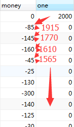

## PostgreSQL 递归查询一例 - 资金累加链  
                      
### 作者                                                                   
digoal                 
                        
### 日期                   
2016-04-05                  
                    
### 标签                 
PostgreSQL , 递归查询 , 资金累加链   
                      
----                
                         
## 背景      
云栖社区问答中，一位网友的问题：  
  
one等于上一个one加上现在的money，如何填充one字段？语句怎么写？  
  
  
  
## 解法  
在PostgreSQL中，可以使用递归查询满足以上业务场景的需求：  
  
需要用到递归查询。  
  
```  
postgres=# create table m(id serial primary key,money int, one int);  
CREATE TABLE  
postgres=# insert into m(money,one) values (0,2000),(85,0),(100,0),(19,0),(21,0);  
INSERT 0 5  
postgres=# select * from m;  
 id | money | one    
----+-------+------  
  1 |     0 | 2000  
  2 |    85 |    0  
  3 |   100 |    0  
  4 |    19 |    0  
  5 |    21 |    0  
(5 rows)  
  
postgres=# with recursive t(id,money,one) as (select 1 id,0 money,2000 one union all select t1.id,t1.money,t.one-t1.money one from t,m t1 where t.id=t1.id-1) select * from t;  
 id | money | one    
----+-------+------  
  1 |     0 | 2000  
  2 |    85 | 1915  
  3 |   100 | 1815  
  4 |    19 | 1796  
  5 |    21 | 1775  
(5 rows)  
```  
  
  
<a rel="nofollow" href="http://info.flagcounter.com/h9V1"  ></a>  
  
  
  
  
  
  
## [digoal's 大量PostgreSQL文章入口](https://github.com/digoal/blog/blob/master/README.md "22709685feb7cab07d30f30387f0a9ae")
  
