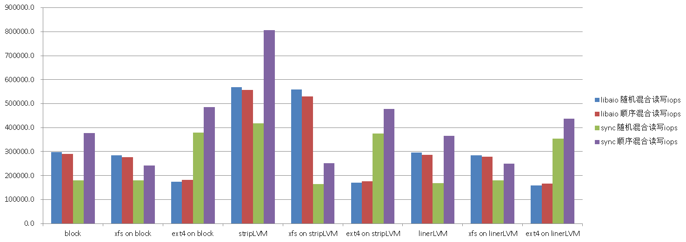
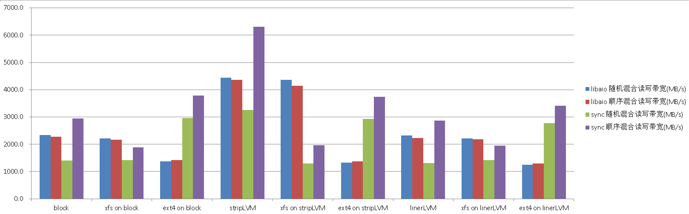
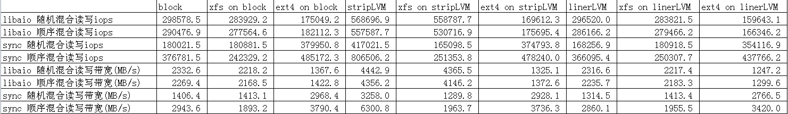

## fio测试IO性能   
                                                                                                                                   
### 作者                                                                                                                                   
digoal                                                                                                                                   
                                                                                                                                   
### 日期                                                                                                                                   
2016-04-07                                                                                                                                
                                                                                                                                   
### 标签                                                                                                                                   
PostgreSQL , Linux , IOPS , fio , io性能测试          
                                                                                                                                   
----                                                                                                                                   
                                                                                                                                   
## 背景                       
FIO flexible testing of the Linux IO subsystem and schedulers    
  
## 安装fio    
  
```  
git clone https://github.com/axboe/fio    
cd fio    
./configure --prefix=/home/digoal/fiohome     
make    
make install    
    
cd ~    
vi env_fio.sh    
export PS1="$USER@`/bin/hostname -s`-> "    
export DATE=`date +"%Y%m%d%H%M"`    
export PATH=/home/digoal/fiohome/bin:$PATH:.    
export MANPATH=/home/digoal/fiohome/man:$MANPATH    
alias rm='rm -i'    
alias ll='ls -lh'    
unalias vi    
    
. ~/env_fio.sh    
```  
    
## 测试环境       
  
3块aliflash，      
    
分别测试文件系统或块设备如下        
  
```  
xfs on block dev,      
ext4 on block dev,       (data=writeback)  
block dev,      
lvm strip raw,     
xfs on lvm strip,     
ext4 on lvm strip,       (data=writeback)  
lvm liner raw,     
xfs on lvm liner,     
ext4 on lvm liner.       (data=writeback)  
```  
  
分别测试引擎如下     
  
```  
aio(mysql)       directio=1, iodepth=16, jobs=64, read 65%, write 35%  
sync io(pgsql)   directio=0, iodepth=1,  jobs=64, read 65%, write 35%  
```  
    
aliflash不支持io scheduler，所以不需要分别测试 cfq,deadline,noop,anticipatory      
  
```  
#cat /sys/block/dfa/queue/scheduler      
none    
#cat /sys/block/sda/queue/scheduler     
noop anticipatory [deadline] cfq     
```  
  
如果支持的话可以这样修改    
  
```  
#echo cfq > /sys/block/sda/queue/scheduler     
```  
  
## 测试1      
  
```  
xfs on block dev,     
ext4 on block dev,     
block dev,     
```  
  
环境准备    
  
```  
/dev/dfa -- 用来测试block dev    
    
/dev/dfb -- 用来测试xfs on blockdev    
  parted /dev/dfb    
  rm 1    
  (parted) mklabel gpt    
  (parted) mkpart primary 1M 2049M    
  (parted) mkpart primary 2049M 6400G    
  q    
  partx -a /dev/dfb    
  kpartx -a /dev/dfb    
  partprobe  /dev/dfb    
  mkfs.xfs -f -b size=4096 -l logdev=/dev/dfb1,size=2047868928,sunit=16 -d agsize=536862720 /dev/dfb2    
  mount -o defaults,allocsize=16M,inode64,nobarrier,nolargeio,logbsize=262144,noatime,nodiratime,swalloc,logdev=/dev/dfb1 /dev/dfb2 /u02    
    
/dev/dfc -- 用来测试ext4 on blockdev    
  mkfs.ext4 /dev/dfc    
  mount -o defaults,noatime,nodiratime,nodelalloc,barrier=0,data=writeback /dev/dfc /u03    
```  
  
fio配置    
  
```  
vi alifalsh-test-cfq-raw    
[global]    
thread    
numjobs=64    
ramp_time=6    
size=10g    
exitall    
time_based    
runtime=180    
group_reporting    
randrepeat=0    
norandommap    
bs=8k    
rwmixwrite=35    
    
[rw-rand-libaio-mysql-raw]    
stonewall    
direct=1    
iodepth=16    
iodepth_batch=8    
iodepth_low=8    
iodepth_batch_complete=8    
rw=randrw    
ioengine=libaio    
filename=/dev/dfa    
    
[rw-seq-libaio-mysql-raw]    
stonewall    
direct=1    
iodepth=16    
iodepth_batch=8    
iodepth_low=8    
iodepth_batch_complete=8    
rw=rw    
ioengine=libaio    
filename=/dev/dfa    
    
[rw-rand-sync-pgsql-raw]    
stonewall    
direct=0    
rw=randrw    
ioengine=sync    
filename=/dev/dfa    
    
[rw-seq-sync-pgsql-raw]    
stonewall    
direct=0    
rw=rw    
ioengine=sync    
filename=/dev/dfa    
    
[rw-rand-libaio-mysql-xfs]    
stonewall    
direct=1    
iodepth=16    
iodepth_batch=8    
iodepth_low=8    
iodepth_batch_complete=8    
rw=randrw    
ioengine=libaio    
filename=/u02/xfs    
    
[rw-seq-libaio-mysql-xfs]    
stonewall    
direct=1    
iodepth=16    
iodepth_batch=8    
iodepth_low=8    
iodepth_batch_complete=8    
rw=rw    
ioengine=libaio    
filename=/u02/xfs    
    
[rw-rand-sync-pgsql-xfs]    
stonewall    
direct=0    
rw=randrw    
ioengine=sync    
filename=/u02/xfs    
    
[rw-seq-sync-pgsql-xfs]    
stonewall    
direct=0    
rw=rw    
ioengine=sync    
filename=/u02/xfs    
    
[rw-rand-libaio-mysql-ext4]    
stonewall    
direct=1    
iodepth=16    
iodepth_batch=8    
iodepth_low=8    
iodepth_batch_complete=8    
rw=randrw    
ioengine=libaio    
filename=/u03/ext4    
    
[rw-seq-libaio-mysql-ext4]    
stonewall    
direct=1    
iodepth=16    
iodepth_batch=8    
iodepth_low=8    
iodepth_batch_complete=8    
rw=rw    
ioengine=libaio    
filename=/u03/ext4    
    
[rw-rand-sync-pgsql-ext4]    
stonewall    
direct=0    
rw=randrw    
ioengine=sync    
filename=/u03/ext4    
    
[rw-seq-sync-pgsql-ext4]    
stonewall    
direct=0    
rw=rw    
ioengine=sync    
filename=/u03/ext4    
```  
  
压测    
  
```  
su - root    
. /home/digoal/env_fio.sh    
    
nohup fio alifalsh-test-cfq-raw --output ./cfq-raw.log >/dev/null 2>&1 &    
```  
  
## 测试2    
  
```  
lvm strip raw,     
xfs on lvm strip,     
```  
  
环境准备    
  
```  
pvcreate /dev/dfa    
pvcreate /dev/dfb    
vgcreate -s 128M vgdata01 /dev/dfa /dev/dfb    
lvcreate -i 2 -I 8 -n lv01 -L 2G vgdata01    
lvcreate -i 2 -I 8 -n lv02 -L 2G vgdata01    
lvcreate -i 2 -I 8 -n lv03 -L 2T vgdata01    
lvcreate -i 2 -I 8 -n lv04 -l 100%FREE vgdata01    
    
mkfs.xfs -f -b size=4096 -l logdev=/dev/mapper/vgdata01-lv02,size=2136997888,sunit=16 -d agsize=536862720,sunit=16,swidth=32 /dev/mapper/vgdata01-lv04    
mount -o defaults,allocsize=16M,inode64,nobarrier,nolargeio,logbsize=262144,noatime,nodiratime,swalloc,logdev=/dev/mapper/vgdata01-lv02 /dev/mapper/vgdata01-lv04 /u02    
    
ll /dev/mapper/vgdata01-lv03    
  /dev/dm-2    
```  
  
fio配置    
  
```  
vi alifalsh-test-cfq-lvmstrip    
[global]    
thread    
numjobs=64    
ramp_time=6    
size=10g    
exitall    
time_based    
runtime=180    
group_reporting    
randrepeat=0    
norandommap    
bs=8k    
rwmixwrite=35    
    
[rw-rand-libaio-mysql-raw]    
stonewall    
direct=1    
iodepth=16    
iodepth_batch=8    
iodepth_low=8    
iodepth_batch_complete=8    
rw=randrw    
ioengine=libaio    
filename=/dev/dm-2    
    
[rw-seq-libaio-mysql-raw]    
stonewall    
direct=1    
iodepth=16    
iodepth_batch=8    
iodepth_low=8    
iodepth_batch_complete=8    
rw=rw    
ioengine=libaio    
filename=/dev/dm-2    
    
[rw-rand-sync-pgsql-raw]    
stonewall    
direct=0    
rw=randrw    
ioengine=sync    
filename=/dev/dm-2    
    
[rw-seq-sync-pgsql-raw]    
stonewall    
direct=0    
rw=rw    
ioengine=sync    
filename=/dev/dm-2    
    
[rw-rand-libaio-mysql-xfs]    
stonewall    
direct=1    
iodepth=16    
iodepth_batch=8    
iodepth_low=8    
iodepth_batch_complete=8    
rw=randrw    
ioengine=libaio    
filename=/u02/xfs    
    
[rw-seq-libaio-mysql-xfs]    
stonewall    
direct=1    
iodepth=16    
iodepth_batch=8    
iodepth_low=8    
iodepth_batch_complete=8    
rw=rw    
ioengine=libaio    
filename=/u02/xfs    
    
[rw-rand-sync-pgsql-xfs]    
stonewall    
direct=0    
rw=randrw    
ioengine=sync    
filename=/u02/xfs    
    
[rw-seq-sync-pgsql-xfs]    
stonewall    
direct=0    
rw=rw    
ioengine=sync    
filename=/u02/xfs    
```  
  
压测    
  
```  
nohup fio alifalsh-test-cfq-lvmstrip --output ./cfq-lvmstrip-raw-xfs.log >/dev/null 2>&1 &    
```  
  
## 测试3    
  
```  
ext4 on lvm strip,    
```  
  
环境准备    
  
```  
umount /u02    
mkfs.ext4 /dev/mapper/vgdata01-lv04    
mount -o defaults,noatime,nodiratime,nodelalloc,barrier=0,data=writeback /dev/mapper/vgdata01-lv04 /u02    
```  
  
fio配置   
  
```  
vi alifalsh-test-cfq-lvmstrip-ext4    
[global]    
thread    
numjobs=64    
ramp_time=6    
size=10g    
exitall    
time_based    
runtime=180    
group_reporting    
randrepeat=0    
norandommap    
bs=8k    
rwmixwrite=35    
    
[rw-rand-libaio-mysql-ext4]    
stonewall    
direct=1    
iodepth=16    
iodepth_batch=8    
iodepth_low=8    
iodepth_batch_complete=8    
rw=randrw    
ioengine=libaio    
filename=/u02/ext4    
    
[rw-seq-libaio-mysql-ext4]    
stonewall    
direct=1    
iodepth=16    
iodepth_batch=8    
iodepth_low=8    
iodepth_batch_complete=8    
rw=rw    
ioengine=libaio    
filename=/u02/ext4    
    
[rw-rand-sync-pgsql-ext4]    
stonewall    
direct=0    
rw=randrw    
ioengine=sync    
filename=/u02/ext4    
    
[rw-seq-sync-pgsql-ext4]    
stonewall    
direct=0    
rw=rw    
ioengine=sync    
filename=/u02/ext4    
```  
  
压测    
  
```  
nohup fio alifalsh-test-cfq-lvmstrip-ext4 --output ./cfq-lvmstrip-ext4.log >/dev/null 2>&1 &    
```  
  
## 测试4    
  
```  
lvm liner raw,     
xfs on lvm liner,     
```  
  
环境准备    
  
```  
umount /u02    
lvremove -A y /dev/mapper/vgdata01-lv01    
lvremove -A y /dev/mapper/vgdata01-lv02    
lvremove -A y /dev/mapper/vgdata01-lv03    
lvremove -A y /dev/mapper/vgdata01-lv04    
lvcreate -n lv01 -L 2G vgdata01    
lvcreate -n lv02 -L 2G vgdata01    
lvcreate -n lv03 -L 2T vgdata01    
lvcreate -n lv04 -l 100%FREE vgdata01    
    
mkfs.xfs -f -b size=4096 -l logdev=/dev/mapper/vgdata01-lv02,size=2136997888,sunit=16 -d agsize=536862720 /dev/mapper/vgdata01-lv04    
mount -o defaults,allocsize=16M,inode64,nobarrier,nolargeio,logbsize=262144,noatime,nodiratime,swalloc,logdev=/dev/mapper/vgdata01-lv02 /dev/mapper/vgdata01-lv04 /u02    
```  
  
fio配置    
  
```  
vi alifalsh-test-cfq-lvmliner    
[global]    
thread    
numjobs=64    
ramp_time=6    
size=10g    
exitall    
time_based    
runtime=180    
group_reporting    
randrepeat=0    
norandommap    
bs=8k    
rwmixwrite=35    
    
[rw-rand-libaio-mysql-raw]    
stonewall    
direct=1    
iodepth=16    
iodepth_batch=8    
iodepth_low=8    
iodepth_batch_complete=8    
rw=randrw    
ioengine=libaio    
filename=/dev/dm-2    
    
[rw-seq-libaio-mysql-raw]    
stonewall    
direct=1    
iodepth=16    
iodepth_batch=8    
iodepth_low=8    
iodepth_batch_complete=8    
rw=rw    
ioengine=libaio    
filename=/dev/dm-2    
    
[rw-rand-sync-pgsql-raw]    
stonewall    
direct=0    
rw=randrw    
ioengine=sync    
filename=/dev/dm-2    
    
[rw-seq-sync-pgsql-raw]    
stonewall    
direct=0    
rw=rw    
ioengine=sync    
filename=/dev/dm-2    
    
[rw-rand-libaio-mysql-xfs]    
stonewall    
direct=1    
iodepth=16    
iodepth_batch=8    
iodepth_low=8    
iodepth_batch_complete=8    
rw=randrw    
ioengine=libaio    
filename=/u02/xfs    
    
[rw-seq-libaio-mysql-xfs]    
stonewall    
direct=1    
iodepth=16    
iodepth_batch=8    
iodepth_low=8    
iodepth_batch_complete=8    
rw=rw    
ioengine=libaio    
filename=/u02/xfs    
    
[rw-rand-sync-pgsql-xfs]    
stonewall    
direct=0    
rw=randrw    
ioengine=sync    
filename=/u02/xfs    
    
[rw-seq-sync-pgsql-xfs]    
stonewall    
direct=0    
rw=rw    
ioengine=sync    
filename=/u02/xfs    
```  
  
压测    
  
```  
nohup fio alifalsh-test-cfq-lvmliner --output ./cfq-lvmliner-raw-xfs.log >/dev/null 2>&1 &    
```  
  
## 测试5    
  
```  
ext4 on lvm liner.    
```  
  
环境准备    
  
```  
umount /u02    
mkfs.ext4 /dev/mapper/vgdata01-lv04    
mount -o defaults,noatime,nodiratime,nodelalloc,barrier=0,data=writeback /dev/mapper/vgdata01-lv04 /u02    
```  
  
fio配置    
  
```  
vi alifalsh-test-cfq-lvmliner-ext4     
[global]    
thread    
numjobs=64    
ramp_time=6    
size=10g    
exitall    
time_based    
runtime=180    
group_reporting    
randrepeat=0    
norandommap    
bs=8k    
rwmixwrite=35    
    
[rw-rand-libaio-mysql-ext4]    
stonewall    
direct=1    
iodepth=16    
iodepth_batch=8    
iodepth_low=8    
iodepth_batch_complete=8    
rw=randrw    
ioengine=libaio    
filename=/u02/ext4    
    
[rw-seq-libaio-mysql-ext4]    
stonewall    
direct=1    
iodepth=16    
iodepth_batch=8    
iodepth_low=8    
iodepth_batch_complete=8    
rw=rw    
ioengine=libaio    
filename=/u02/ext4    
    
[rw-rand-sync-pgsql-ext4]    
stonewall    
direct=0    
rw=randrw    
ioengine=sync    
filename=/u02/ext4    
    
[rw-seq-sync-pgsql-ext4]    
stonewall    
direct=0    
rw=rw    
ioengine=sync    
filename=/u02/ext4    
```  
  
  
压测    
  
```  
nohup fio alifalsh-test-cfq-lvmliner-ext4 --output ./cfq-lvmliner-ext4.log >/dev/null 2>&1 &    
```  
  
## 测试结果    
  
  
  
  
  
  
  
  
<a rel="nofollow" href="http://info.flagcounter.com/h9V1"  ></a>  
  
  
  
  
  
  
## [digoal's 大量PostgreSQL文章入口](https://github.com/digoal/blog/blob/master/README.md "22709685feb7cab07d30f30387f0a9ae")
  
