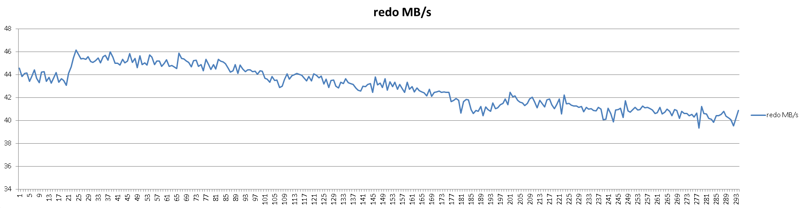
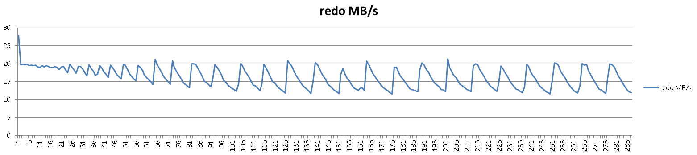

## PostgreSQL 流复制延迟的测试方法  
                                                                                                                                       
### 作者                                                                                                                                       
digoal                                                                                                                                       
                                                                                                                                       
### 日期                                                                                                                                       
2016-04-07                                                                                                                                    
                                                                                                                                       
### 标签                                                                                                                                       
PostgreSQL , 物理流复制 , stream replication , 延迟测试          
                                                                                                                                       
----                                                                                                                                       
                                                                                                                                       
## 背景                           
## 测试环境    
```  
X86    
CentOS 6.x x64  
32 Core  
10000 MB/s  
256 GB  
12 SSD  
PostgreSQL 9.5.1 一主一备  
```  
  
## PostgreSQL配置    
postgresql.conf    
  
```  
listen_addresses = '0.0.0.0'            # what IP address(es) to listen on;  
port = 1922                             # (change requires restart)  
max_connections = 200                   # (change requires restart)  
superuser_reserved_connections = 3      # (change requires restart)  
unix_socket_directories = '.'   # comma-separated list of directories  
unix_socket_permissions = 0700          # begin with 0 to use octal notation  
shared_buffers = 10GB                   # min 128kB  
huge_pages = try                        # on, off, or try  
maintenance_work_mem = 1024MB           # min 1MB  
autovacuum_work_mem = 1024MB            # min 1MB, or -1 to use maintenance_work_mem  
dynamic_shared_memory_type = posix      # the default is the first option  
bgwriter_delay = 10ms                   # 10-10000ms between rounds  
wal_level = hot_standby                 # minimal, archive, hot_standby, or logical  
fsync = on                             # turns forced synchronization on or off  
# 备库fsync=off  ，可以降低延迟。 但是备库会有风险。DOWN机后，需要重搭备库。 
synchronous_commit = off                # synchronization level;  
full_page_writes = on                  # recover from partial page writes  
wal_buffers = 32MB                       # min 32kB, -1 sets based on shared_buffers  
wal_writer_delay = 10ms         # 1-10000 milliseconds  
checkpoint_timeout = 30min              # range 30s-1h  
max_wal_size = 20GB  
checkpoint_completion_target = 0.1      # checkpoint target duration, 0.0 - 1.0  
max_wal_senders = 10            # max number of walsender processes  
hot_standby = on                        # "on" allows queries during recovery  
wal_receiver_status_interval = 1s       # send replies at least this often  
hot_standby_feedback = off               # send info from standby to prevent  
wal_retrieve_retry_interval = 1s        # time to wait before retrying to  
log_destination = 'csvlog'              # Valid values are combinations of  
logging_collector = on          # Enable capturing of stderr and csvlog  
log_truncate_on_rotation = on           # If on, an existing log file with the  
log_timezone = 'PRC'  
autovacuum_max_workers = 4              # max number of autovacuum subprocesses  
autovacuum_naptime = 60s         # time between autovacuum runs  
autovacuum_vacuum_scale_factor = 0.02  # fraction of table size before vacuum  
autovacuum_analyze_scale_factor = 0.01 # fraction of table size before analyze  
datestyle = 'iso, mdy'  
timezone = 'PRC'  
lc_messages = 'C'                       # locale for system error message  
lc_monetary = 'C'                       # locale for monetary formatting  
lc_numeric = 'C'                        # locale for number formatting  
lc_time = 'C'                           # locale for time formatting  
default_text_search_config = 'pg_catalog.english'  
```  
  
recovery.conf    
  
```  
recovery_target_timeline = 'latest'  
standby_mode = on  
primary_conninfo = 'host=xxx.xxx.xxx.xxx port=1922 user=postgres'         # e.g. 'host=localhost port=5432'  
```  
  
## 测试方法    
1、 小事务插入，记录TPS，产生XLOG的速度，延迟    
  
```  
create table test1(id int, info text default md5(random()::text), crt_time timestamp default now());  
  
vi test.sql  
insert into test1 values (1);  
  
create table delay (crt_time timestamp, loc pg_lsn, delay int);  
insert into delay(crt_time,loc,delay) select now(),pg_current_xlog_location(),pg_xlog_location_diff(pg_current_xlog_location(),sent_location) from pg_stat_replication ;  
\watch 1  
  
pgbench -M prepared -n -r -P 1 -f ./test.sql -c 24 -j 24 -T 300  
  
select round(pg_xlog_location_diff(loc,lag(loc) over(order by ts))/1024/1024.0, 2),round(delay/1024.0, 2) from delay;  
```  
  
2、 小事务更新，记录TPS，产生XLOG的速度，延迟    
  
  
```  
create table test(id int primary key, info text default md5(random()::text), crt_time timestamp default now());  
  
vi test.sql  
\setrandom id 1 50000000  
insert into test values (:id) on conflict on constraint test_pkey do update set info=excluded.info;  
  
create table delay (crt_time timestamp, loc pg_lsn, delay int);  
insert into delay(crt_time,loc,delay) select now(),pg_current_xlog_location(),pg_xlog_location_diff(pg_current_xlog_location(),sent_location) from pg_stat_replication ;  
\watch 1  
  
pgbench -M prepared -n -r -P 1 -f ./test.sql -c 24 -j 24 -T 300  
  
select round(pg_xlog_location_diff(loc,lag(loc) over(order by ts))/1024/1024.0, 2),round(delay/1024.0, 2) from delay;  
```  
  
3、 大事务，记录TPS，产生XLOG的速度，延迟    
  
```  
pgbench -i -s 100  
  
create table delay (crt_time timestamp, loc pg_lsn, delay int);  
insert into delay(crt_time,loc,delay) select now(),pg_current_xlog_location(),pg_xlog_location_diff(pg_current_xlog_location(),sent_location) from pg_stat_replication ;  
\watch 1  
  
pgbench -M prepared -n -r -P 1 -c 48 -j 48 -T 300  
  
select round(pg_xlog_location_diff(loc,lag(loc) over(order by ts))/1024/1024.0, 2),round(delay/1024.0, 2) from delay;  
```  
  
## 测试结果    
1、 小事务插入    
  
tps    
  
  
  
redo产生速度(MB/s)    
  
  
  
延迟(KB/s)    
  
  
  
2、 小事务更新    
  
tps    
  
  
  
redo产生速度(MB/s)    
  
  
  
延迟(KB/s)    
  
  
  
3、 大事务    
  
tps    
  
  
  
redo产生速度(MB/s)    
  
  
  
延迟(KB/s)    
  
  
  
## 小结  
1、 由于是异步复制，有轻微的延迟，只要不会随时间增加即可认为正常。  
  
  
  
  
  
  
  
  
  
  
  
  
  
  
  
  
  
  
  
  
  
  
  
  
  
  
  
  
  
  
  
  
  
  
  
  
  
  
  
  
  
  
  
  
  
  
  
  
  
  
  
  
  
  
  
  
  
  
  
  
  
  
  
  
  
  
  
  
  
  
  
  
  
  
#### [PostgreSQL 许愿链接](https://github.com/digoal/blog/issues/76 "269ac3d1c492e938c0191101c7238216")
您的愿望将传达给PG kernel hacker、数据库厂商等, 帮助提高数据库产品质量和功能, 说不定下一个PG版本就有您提出的功能点. 针对非常好的提议，奖励限量版PG文化衫、纪念品、贴纸、PG热门书籍等，奖品丰富，快来许愿。[开不开森](https://github.com/digoal/blog/issues/76 "269ac3d1c492e938c0191101c7238216").  
  
  
#### [9.9元购买3个月阿里云RDS PostgreSQL实例](https://www.aliyun.com/database/postgresqlactivity "57258f76c37864c6e6d23383d05714ea")
  
  
#### [PostgreSQL 解决方案集合](https://yq.aliyun.com/topic/118 "40cff096e9ed7122c512b35d8561d9c8")
  
  
#### [德哥 / digoal's github - 公益是一辈子的事.](https://github.com/digoal/blog/blob/master/README.md "22709685feb7cab07d30f30387f0a9ae")
  
  

  
  
#### [PolarDB 学习图谱: 训练营、培训认证、在线互动实验、解决方案、生态合作、写心得拿奖品](https://www.aliyun.com/database/openpolardb/activity "8642f60e04ed0c814bf9cb9677976bd4")
  
  
#### [购买PolarDB云服务折扣活动进行中, 55元起](https://www.aliyun.com/activity/new/polardb-yunparter?userCode=bsb3t4al "e0495c413bedacabb75ff1e880be465a")
  
  
#### [About 德哥](https://github.com/digoal/blog/blob/master/me/readme.md "a37735981e7704886ffd590565582dd0")
  
