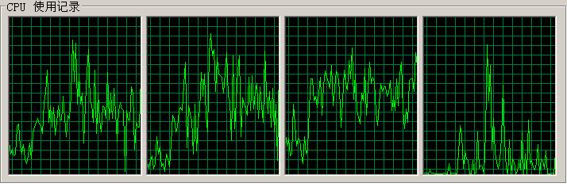
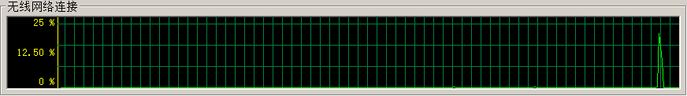
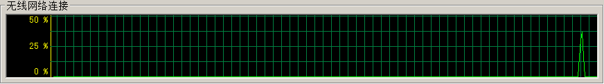

## PostgreSQL IDE pgadmin , edb postgres(Oracle 兼容版) enterprise manager 查询慢的问题分析  
                                                                                             
### 作者                                                                                             
digoal                                                                                             
                                                                                             
### 日期                                                                                             
2016-04-26                                                                                          
                                                                                             
### 标签                                                                                             
PostgreSQL , ide , query , 慢SQL分析   
                                                                                             
----                                                                                             
                                                                                             
## 背景                                 
PostgreSQL 的GUI客户端比较多，有开源的，也有商业的。   
  
用得比较多的可能是PgAdmin了，有些人可能会用EDB的PEM。   
  
但实际上这两个GUI都有一个小问题，在返回较大的结果集时，会非常的慢。   
  
例如 ：   
  
数据库端创建一个表，插入约30MB数据。  
  
```  
postgres=> create table test (like pg_class);  
CREATE TABLE  
postgres=> insert into test select * from pg_class;  
INSERT 0 301  
postgres=> insert into test select * from test;  
INSERT 0 301  
postgres=> insert into test select * from test;  
INSERT 0 602  
...  
postgres=> insert into test select * from test;  
INSERT 0 77056  
postgres=> \dt+  
                          List of relations  
 Schema |      Name       | Type  | Owner  |    Size    | Description   
--------+-----------------+-------+--------+------------+-------------  
 public | test            | table | digoal | 29 MB      |   
(3 rows)  
```  
  
使用EDB的PEM或者pgadmin连接到数据库 ：   
  
在GUI中执行 ：  
  
```  
select * from test;  
```  
  
耗时20秒。  
  
换个执行语句：  
  
```  
copy (select * from test) to stdout;  
```  
  
或者  
  
```  
copy test to stdout;  
```  
  
3秒返回。   
  
copy与select * 查询的数据量一样多，而且都是全表扫描，但是时间却相差10几秒。  
  
原因排查   
  
在pgadmin客户端的机器上，观察到一个现象 ：   
  
执行select * from test;时，网络使用率不高，持续时间长。  
  
网络传输结束后，CPU马上飙高，估计pgadmin在处理数据，很长一段时间后，才开始展示结果。   
  
  
  
  
  
  
  
而更换为  
  
```  
copy (select * from test) to stdout;  
```  
  
或者  
  
```  
copy test to stdout;  
```  
  
后，执行非常迅速，而且展示也非常快，可以看到网络使用率很高，出现了一个尖峰。   
  
  
  
将GUI客户端更换为heidisql后，执行 select * from test; 执行速度很快，与COPY相当。   
  
从网络使用率来看，也出现了一个尖峰，数据很快就传完了。   
  
  
  
使用 PostgreSQL 客户端 psql 命令执行select * from test，速度也和heidisql一样，很快。  
  
对比以上几种情况，说明pgadmin和pem在处理 select 时，效果并不理想，如果要返回大量的结果集，请慎用。   
  
如果使用PEM或者pgadmin要返回大量结果集，建议使用游标来返回：   
  
例子：  
  
```  
begin;  
declare c1 cursor for select * from test;    
fetch 100 from c1;  -- 这里不断的LOOP.  
```  
  
网络流量对比图 :   
  
  
  
  
从左往右数   
  
  
第1个尖峰，heidisql中执行select * from test;   
  
第2个尖峰，pgadmin中执行copy (select * from test) to stdout;   
  
第3个尖峰，pgadmin中执行copy test to stdout;   
  
第4个尖峰，psql中执行select * from test;   
  
说明 select * from test 的网络传输流量确实比copy的更大一些。   
  
heidisql不支持 copy命令.   
  
如果你用的是windows平台，并且遇到了与之类似的问题，建议排查一下客户端程序的代码，从程序层面来解决这个问题。   
  
这个问题我也会反馈给pgadmin和EDB，看看他们怎么解决。  
  
最后要给应用开发人员的一个小建议 :   
  
查询大结果集，给用户展示数据的SQL，建议修改为用游标打开，一次FETCH少量数据, 拿到数据马上就可以向用户展示，后台可以根据策略选择是否再继续fetch剩余的数据。   
  
这样做的好处是用户体验更好，同时有可能可以大大减少数据库的网络开销和CPU开销（因为用户并不一定要查询所有数据）如果用户关闭窗口，可以不再fetch其他数据。   
  
大多数类似的应用场景，都是这样来设计的。  
        
  
  
  
  
  
  
  
  
  
  
  
  
  
  
  
  
  
  
  
  
  
  
  
  
  
  
  
  
  
  
  
  
  
  
  
  
  
  
  
  
  
  
  
  
  
  
  
  
  
  
  
  
  
  
  
  
  
  
  
  
  
  
  
  
  
  
  
  
  
  
  
  
  
#### [PostgreSQL 许愿链接](https://github.com/digoal/blog/issues/76 "269ac3d1c492e938c0191101c7238216")
您的愿望将传达给PG kernel hacker、数据库厂商等, 帮助提高数据库产品质量和功能, 说不定下一个PG版本就有您提出的功能点. 针对非常好的提议，奖励限量版PG文化衫、纪念品、贴纸、PG热门书籍等，奖品丰富，快来许愿。[开不开森](https://github.com/digoal/blog/issues/76 "269ac3d1c492e938c0191101c7238216").  
  
  
#### [9.9元购买3个月阿里云RDS PostgreSQL实例](https://www.aliyun.com/database/postgresqlactivity "57258f76c37864c6e6d23383d05714ea")
  
  
#### [PostgreSQL 解决方案集合](https://yq.aliyun.com/topic/118 "40cff096e9ed7122c512b35d8561d9c8")
  
  
#### [德哥 / digoal's github - 公益是一辈子的事.](https://github.com/digoal/blog/blob/master/README.md "22709685feb7cab07d30f30387f0a9ae")
  
  

  
  
#### [PolarDB 学习图谱: 训练营、培训认证、在线互动实验、解决方案、生态合作、写心得拿奖品](https://www.aliyun.com/database/openpolardb/activity "8642f60e04ed0c814bf9cb9677976bd4")
  
  
#### [购买PolarDB云服务折扣活动进行中, 55元起](https://www.aliyun.com/activity/new/polardb-yunparter?userCode=bsb3t4al "e0495c413bedacabb75ff1e880be465a")
  
  
#### [About 德哥](https://github.com/digoal/blog/blob/master/me/readme.md "a37735981e7704886ffd590565582dd0")
  
