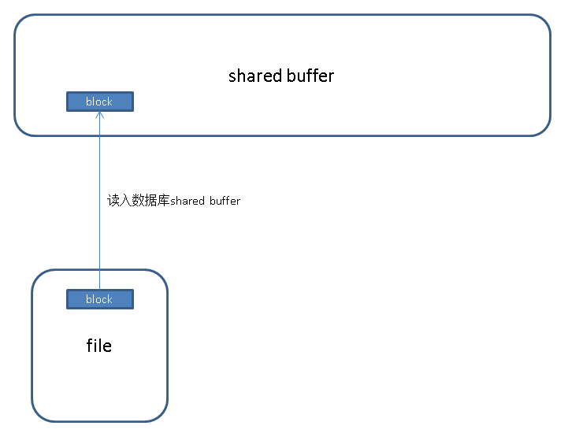
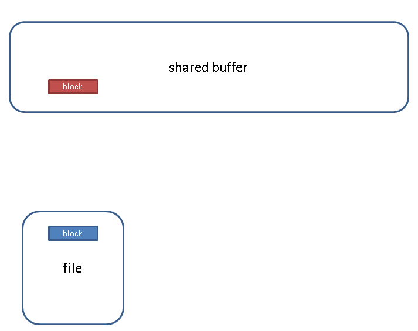
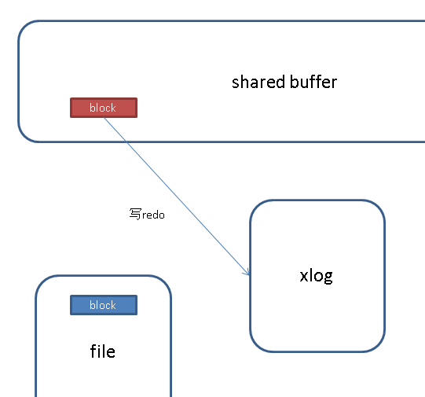
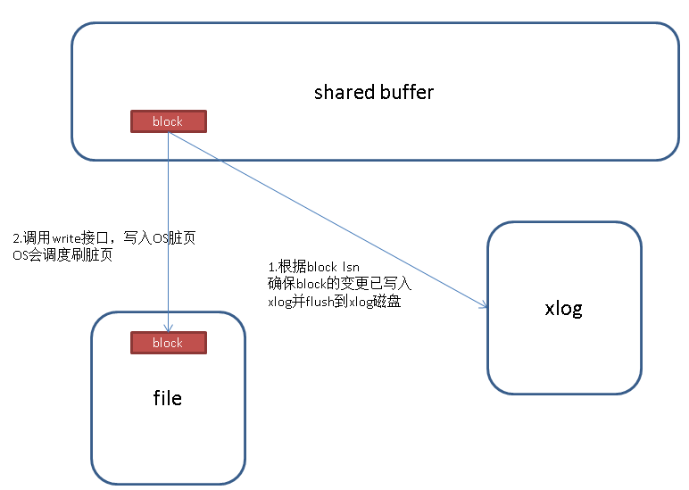

## PostgreSQL 可靠性和一致性 代码分析  
                                                                                               
### 作者                                                                                               
digoal                                                                                               
                                                                                               
### 日期                                                                                               
2016-05-03                                                                                            
                                                                                               
### 标签                                                                                               
PostgreSQL , 可靠性 , 一致性     
                                                                                               
----                                                                                               
                                                                                               
## 背景                                   
PostgreSQL 的数据可靠性是依赖XLOG的实现的，所有的对数据块的变更操作在write到磁盘前，一定是确保这个变更产生的REDO会先写到XLOG，并保证XLOG已落盘。   
  
也就是说流程是这样的：   
  
1\. 首先将需要变更的块从文件读入shared buffer   
  
  
  
2\. 变更shared buffer中block的内容   
  
  
  
3\. 将shared buffer中block变更的内容写入XLOG，如果是checkpoint后第一次变更该块，则写full page。（通过参数控制是否要写full page）。   
  
  
  
4\. 在bgwriter将shared buffer中的脏块write到os dirty page前，会确保它对应的XLOG已经落盘，通过脏块的LSN来确保。   
  
  
  
所以问题来了，如果用户使用了异步提交，即synchronous_commit=off，会怎样呢？   
  
也没有问题，因为在第四步，一定是会保证造成脏页的XLOG是先落盘的。   
  
所以开启synchronous_commit=off，只会造成丢XLOG，绝对不会造成数据不一致。   
  
确保可靠性和一致性的代码如下：  
  
  
```  
/*  
 * Main entry point for bgwriter process  
 *  
 * This is invoked from AuxiliaryProcessMain, which has already created the  
 * basic execution environment, but not enabled signals yet.  
 */  
void  
BackgroundWriterMain(void)  
{  
...  
        /*  
         * Do one cycle of dirty-buffer writing.  
         */  
        can_hibernate = BgBufferSync();  
  
...  
  
  
  
/*  
 * BgBufferSync -- Write out some dirty buffers in the pool.  
 *  
 * This is called periodically by the background writer process.  
 *  
 * Returns true if it's appropriate for the bgwriter process to go into  
 * low-power hibernation mode.  (This happens if the strategy clock sweep  
 * has been "lapped" and no buffer allocations have occurred recently,  
 * or if the bgwriter has been effectively disabled by setting  
 * bgwriter_lru_maxpages to 0.)  
 */  
bool  
BgBufferSync(void)  
{  
...  
  
    /* Execute the LRU scan */  
    while (num_to_scan > 0 && reusable_buffers < upcoming_alloc_est)  
    {  
        int            buffer_state = SyncOneBuffer(next_to_clean, true);  
  
...  
  
  
/*  
 * SyncOneBuffer -- process a single buffer during syncing.  
 *  
 * If skip_recently_used is true, we don't write currently-pinned buffers, nor  
 * buffers marked recently used, as these are not replacement candidates.  
 *  
 * Returns a bitmask containing the following flag bits:  
 *    BUF_WRITTEN: we wrote the buffer.  
 *    BUF_REUSABLE: buffer is available for replacement, ie, it has  
 *        pin count 0 and usage count 0.  
 *  
 * (BUF_WRITTEN could be set in error if FlushBuffers finds the buffer clean  
 * after locking it, but we don't care all that much.)  
 *  
 * Note: caller must have done ResourceOwnerEnlargeBuffers.  
 */  
static int  
SyncOneBuffer(int buf_id, bool skip_recently_used)  
{  
  
...  
  
    FlushBuffer(bufHdr, NULL);  
...  
  
  
/*  
 * FlushBuffer  
 *        Physically write out a shared buffer.  
 *  
 * NOTE: this actually just passes the buffer contents to the kernel; the  
 * real write to disk won't happen until the kernel feels like it.  This  
 * is okay from our point of view since we can redo the changes from WAL.  
 * However, we will need to force the changes to disk via fsync before  
 * we can checkpoint WAL.  
 *  
 * The caller must hold a pin on the buffer and have share-locked the  
 * buffer contents.  (Note: a share-lock does not prevent updates of  
 * hint bits in the buffer, so the page could change while the write  
 * is in progress, but we assume that that will not invalidate the data  
 * written.)  
 *  
 * If the caller has an smgr reference for the buffer's relation, pass it  
 * as the second parameter.  If not, pass NULL.  
 */  
static void  
FlushBuffer(volatile BufferDesc *buf, SMgrRelation reln)  
{  
  
...  
  
    /*  
     * Force XLOG flush up to buffer's LSN.  This implements the basic WAL  
     * rule that log updates must hit disk before any of the data-file changes  
     * they describe do.  
     *  
     * However, this rule does not apply to unlogged relations, which will be  
     * lost after a crash anyway.  Most unlogged relation pages do not bear  
     * LSNs since we never emit WAL records for them, and therefore flushing  
     * up through the buffer LSN would be useless, but harmless.  However,  
     * GiST indexes use LSNs internally to track page-splits, and therefore  
     * unlogged GiST pages bear "fake" LSNs generated by  
     * GetFakeLSNForUnloggedRel.  It is unlikely but possible that the fake  
     * LSN counter could advance past the WAL insertion point; and if it did  
     * happen, attempting to flush WAL through that location would fail, with  
     * disastrous system-wide consequences.  To make sure that can't happen,  
     * skip the flush if the buffer isn't permanent.  
     */  
    if (buf->flags & BM_PERMANENT)  
        XLogFlush(recptr);  
  
...  
  
  
  
  
/*  
 * Ensure that all XLOG data through the given position is flushed to disk.  
 *  
 * NOTE: this differs from XLogWrite mainly in that the WALWriteLock is not  
 * already held, and we try to avoid acquiring it if possible.  
 */  
void  
XLogFlush(XLogRecPtr record)  
{  
    XLogRecPtr    WriteRqstPtr;  
    XLogwrtRqst WriteRqst;  
  
...  
        XLogWrite(WriteRqst, false);  
  
...  
  
  
  
/*  
 * Write and/or fsync the log at least as far as WriteRqst indicates.  
 *  
 * If flexible == TRUE, we don't have to write as far as WriteRqst, but  
 * may stop at any convenient boundary (such as a cache or logfile boundary).  
 * This option allows us to avoid uselessly issuing multiple writes when a  
 * single one would do.  
 *  
 * Must be called with WALWriteLock held. WaitXLogInsertionsToFinish(WriteRqst)  
 * must be called before grabbing the lock, to make sure the data is ready to  
 * write.  
 */  
static void  
XLogWrite(XLogwrtRqst WriteRqst, bool flexible)  
{  
  
...  
    /*  
     * If asked to flush, do so  
     */  
    if (LogwrtResult.Flush < WriteRqst.Flush &&  
        LogwrtResult.Flush < LogwrtResult.Write)  
  
    {  
        /*  
         * Could get here without iterating above loop, in which case we might  
         * have no open file or the wrong one.  However, we do not need to  
         * fsync more than one file.  
         */  
        if (sync_method != SYNC_METHOD_OPEN &&  
            sync_method != SYNC_METHOD_OPEN_DSYNC)  
        {  
            if (openLogFile >= 0 &&  
                !XLByteInPrevSeg(LogwrtResult.Write, openLogSegNo))  
                XLogFileClose();  
            if (openLogFile < 0)  
            {  
                XLByteToPrevSeg(LogwrtResult.Write, openLogSegNo);  
                openLogFile = XLogFileOpen(openLogSegNo);  
                openLogOff = 0;  
            }  
  
            issue_xlog_fsync(openLogFile, openLogSegNo);  
        }  
  
        /* signal that we need to wakeup walsenders later */  
        WalSndWakeupRequest();  
  
        LogwrtResult.Flush = LogwrtResult.Write;  
    }  
...  
```  
  
异步提交代码如下  
  
```  
/*  
     * Check if we want to commit asynchronously.  We can allow the XLOG flush  
     * to happen asynchronously if synchronous_commit=off, or if the current  
     * transaction has not performed any WAL-logged operation or didn't assign  
     * a xid.  The transaction can end up not writing any WAL, even if it has  
     * a xid, if it only wrote to temporary and/or unlogged tables.  It can  
     * end up having written WAL without an xid if it did HOT pruning.  In  
     * case of a crash, the loss of such a transaction will be irrelevant;  
     * temp tables will be lost anyway, unlogged tables will be truncated and  
     * HOT pruning will be done again later. (Given the foregoing, you might  
     * think that it would be unnecessary to emit the XLOG record at all in  
     * this case, but we don't currently try to do that.  It would certainly  
     * cause problems at least in Hot Standby mode, where the  
     * KnownAssignedXids machinery requires tracking every XID assignment.  It  
     * might be OK to skip it only when wal_level < hot_standby, but for now  
     * we don't.)  
     *  
     * However, if we're doing cleanup of any non-temp rels or committing any  
     * command that wanted to force sync commit, then we must flush XLOG  
     * immediately.  (We must not allow asynchronous commit if there are any  
     * non-temp tables to be deleted, because we might delete the files before  
     * the COMMIT record is flushed to disk.  We do allow asynchronous commit  
     * if all to-be-deleted tables are temporary though, since they are lost  
     * anyway if we crash.)  
     */  
    if ((wrote_xlog && markXidCommitted &&  
         synchronous_commit > SYNCHRONOUS_COMMIT_OFF) ||  
        forceSyncCommit || nrels > 0)  
    {  
        XLogFlush(XactLastRecEnd);  
  
        /*  
         * Now we may update the CLOG, if we wrote a COMMIT record above  
         */  
        if (markXidCommitted)  
            TransactionIdCommitTree(xid, nchildren, children);  
    }  
    else  
    {  
        /*  
         * Asynchronous commit case:  
         *  
         * This enables possible committed transaction loss in the case of a  
         * postmaster crash because WAL buffers are left unwritten. Ideally we  
         * could issue the WAL write without the fsync, but some  
         * wal_sync_methods do not allow separate write/fsync.  
         *  
         * Report the latest async commit LSN, so that the WAL writer knows to  
         * flush this commit.  
         */  
        XLogSetAsyncXactLSN(XactLastRecEnd);  
  
        /*  
         * We must not immediately update the CLOG, since we didn't flush the  
         * XLOG. Instead, we store the LSN up to which the XLOG must be  
         * flushed before the CLOG may be updated.  
         */  
        if (markXidCommitted)  
            TransactionIdAsyncCommitTree(xid, nchildren, children, XactLastRecEnd);  
    }  
```  
  
  
<a rel="nofollow" href="http://info.flagcounter.com/h9V1"  ></a>  
  
  
  
  
  
  
## [digoal's 大量PostgreSQL文章入口](https://github.com/digoal/blog/blob/master/README.md "22709685feb7cab07d30f30387f0a9ae")
  
