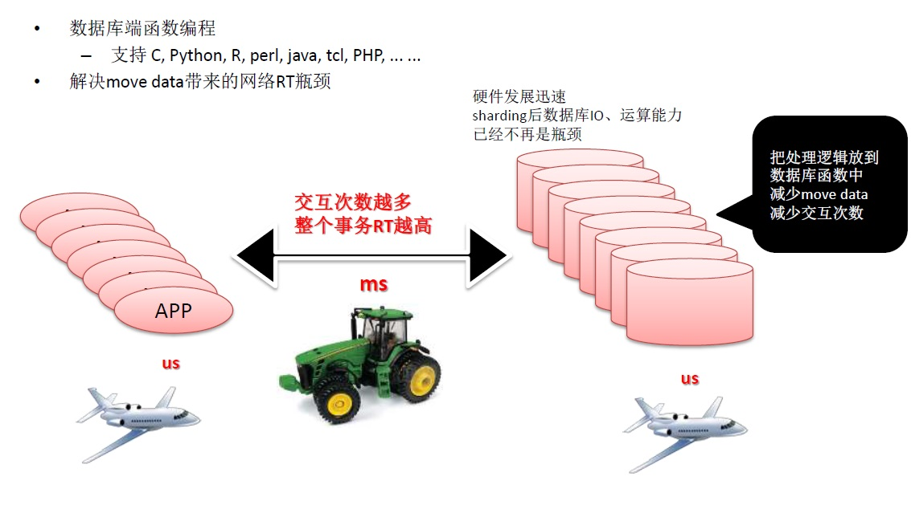
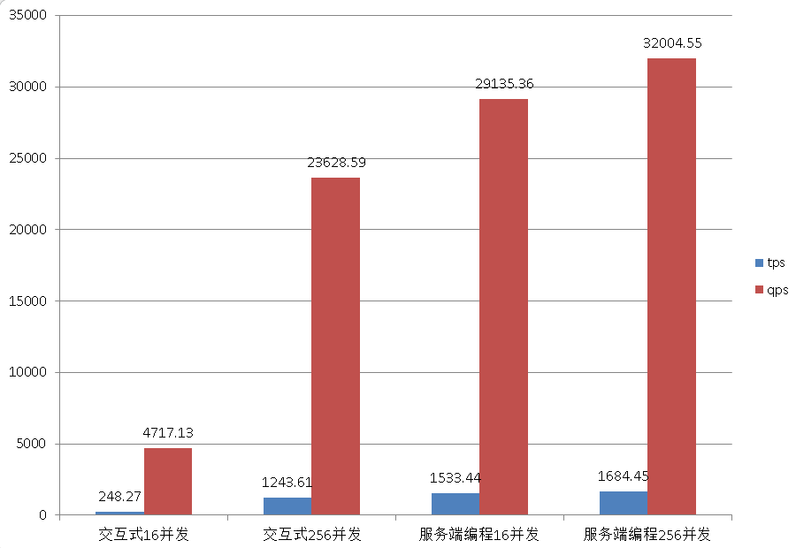

## 论云数据库编程能力的重要性  
     
### 作者     
digoal    
      
### 日期                                                                                                         
2016-05-05                                                                                                               
     
### 标签                   
PostgreSQL , 服务端编程接口 , pl language , 云数据库        
        
----       
      
## 背景   
云为我们提供了便利，降低了开发和运维的成本。  
  
但是也必须思考一个问题，我们的云组件之间的网络延迟有多大，和以前在局域网是一样的吗？  
  
（相比较局域网的服务器和服务器之间）  
  
你可以用各种方法测试验证一下。  
  
以往我们把数据放在数据库，数据库只提供简单的增删改查，大部分的业务逻辑放在应用服务器来完成，一个事务可能需要与数据库进行多次的交互。  
  
那么在云时代，应用服务器和数据库间如果多次交互，会不会浪费大量的时间在网络上面呢？这个问题会不会被放大呢？　　  
  
本文将给大家一个测试思路，以及应对方法。  
  
## 在云端选一个有强大编程能力的数据库多么重要  
我们应该充分利用数据库的编程能力，例如PostgreSQL，是一个功能非常强大的数据库，我们完全可以把业务逻辑放在数据库处理，它强大在哪里呢？  
  
1\. 例如数据库中使用plv8, plpython, plpgsql, plperl, pltcl等函数语言编写业务逻辑，  
  
2\. 数据类型支持也非常的丰富，例如jsonb, GIS, text, 异构类型，Key-Value类型...等，  
  
3\. 索引支持btree, hash, gin , gist, spgist, brin , rum , bloom等索引类型，  
  
4\. SQL语法层面支持 窗口查询，递归查询，grouping set, 等高级语法。  
  
5\. JOIN方面，支持hash join , merge join , nestloop join ，  
  
6\. 优化器方面，支持自定义成本因子， CBO ， 遗传算法等。  
  
7\. 另外可以利用GPU加速运算，包括隐式加速，也可以显示加速。  
  
隐式指数据库自身提供的custom scan provider编程接口，已经有实现了的插件。  
  
显式，指的是过程语言和CUDA的结合，例如PyCUDA。  
  
8\. 还可以用支持并行编程的语言来方便的实现多核处理，（目前PostgreSQL 9.6已经支持内置的并行计算了）。  
  
还有很多特性就不一一介绍了，用到的时候就知道它的好了（来自很多用户的切身感受）。  
  
PostgreSQL完全可以满足大多数业务的需求。  
  
功能如此强大的数据库，只用来做增删改查，是不是有点浪费呢，充分利用它的功能，当网络是瓶颈的时候，让业务逻辑和数据靠近，可以大大提升效率，降低RT，提升业务系统的用户体验。  
  
关于云端网络延迟，这个图可能比较形象，你觉得多次交互后，延迟效果会不会放大呢？  
  
    
  
如何测试呢？可以参考我在前几天写的几篇文档。  
  
1\. PostgreSQL 网络延迟定量分析  
  
https://yq.aliyun.com/articles/35176  
  
2\. 使用sysbench测试阿里云RDS PostgreSQL性能  
  
（内容中包含了如何测试云数据库的网络延迟）  
  
https://yq.aliyun.com/articles/35517  
  
本文还会利用sysbench来佐证一下，使用数据库服务端编程后，带来的性能提升是多么明显。  
  
## 测试来咯  
测试环境依旧是阿里云RDS PostgreSQL，ECS是32核的机器，与RDS PG在同一机房。  
  
步骤  
  
1\. 购买RDS PG数据库实例  
  
2\. 创建数据库用户  
  
3\. 购买同机房，与RDS PG同VPC网络ECS或者同经典网络的ECS  
  
4\. 在ECS端安装PostgreSQL客户端  
  
```  
useradd digoal    
su - digoal    
  
wget https://ftp.postgresql.org/pub/source/v9.5.2/postgresql-9.5.2.tar.bz2    
tar -jxvf postgresql-9.5.2.tar.bz2    
cd postgresql-9.5.2    
./configure --prefix=/home/digoal/pgsql9.5    
gmake world -j 16    
gmake install-world -j 16    
  
vi ~/env_pg.sh    
export PS1="$USER@`/bin/hostname -s`-> "    
export PGPORT=1921    
export LANG=en_US.utf8    
export PGHOME=/home/digoal/pgsql9.5    
export LD_LIBRARY_PATH=$PGHOME/lib:/lib64:/usr/lib64:/usr/local/lib64:/lib:/usr/lib:/usr/local/lib:$LD_LIBRARY_PATH    
export DATE=`date +"%Y%m%d%H%M"`    
export PATH=$PGHOME/bin:$PATH:.    
export MANPATH=$PGHOME/share/man:$MANPATH    
export PGHOST=$PGDATA    
export PGUSER=postgres    
export PGDATABASE=postgres    
alias rm='rm -i'    
alias ll='ls -lh'    
unalias vi    
  
. ~/env_pg.sh    
```  
  
5\. 安装sysbench(from github)  
  
```  
cd ~    
  
git clone https://github.com/digoal/sysbench.git    
```  
  
6\. 初始化数据  
  
并行初始化测试数据  
  
初始化256张表，每张表100万数据。  
  
```  
cd sysbench/sysbench  
  
./sysbench_pg --test=lua/parallel_init_pg.lua \    
  --db-driver=pgsql \    
  --pgsql-host=xxx.xxx.xxx.xxx \    
  --pgsql-port=3432 \    
  --pgsql-user=digoal \    
  --pgsql-password=pwd \    
  --pgsql-db=postgres \    
  --oltp-tables-count=256 \    
  --oltp-table-size=1000000 \    
  --num-threads=256 \    
  cleanup    
  
./sysbench_pg --test=lua/parallel_init_pg.lua \    
  --db-driver=pgsql \    
  --pgsql-host=xxx.xxx.xxx.xxx \    
  --pgsql-port=3432 \    
  --pgsql-user=digoal \    
  --pgsql-password=pwd \    
  --pgsql-db=postgres \    
  --oltp-tables-count=256 \    
  --oltp-table-size=1000000 \    
  --num-threads=256 \    
  run    
```  
  
表结构和数据样本如下  
  
```  
postgres=# \d sbtest1  
                        Unlogged table "public.sbtest1"  
 Column |      Type      |                      Modifiers                         
--------+----------------+------------------------------------------------------  
 id     | integer        | not null default nextval('sbtest1_id_seq'::regclass)  
 k      | integer        |   
 c      | character(120) | not null default ''::bpchar  
 pad    | character(60)  | not null default ''::bpchar  
Indexes:  
    "sbtest1_pkey" PRIMARY KEY, btree (id)  
    "k_1" btree (k)  
  
postgres=# select * from sbtest1 limit 5;  
 id |   k    |                                                            c                                                             |                             pad                                
----+--------+--------------------------------------------------------------------------------------------------------------------------+--------------------------------------------------------------  
  1 | 927400 | 78247013700-08372511066-37272961232-38016471864-11589387900-80841931510-50966088603-62786739920-93329627701-94363926684  | 20366050401-55867147298-47128473450-44371584107-36273281249   
  2 | 462112 | 33336348704-49028541945-04338357184-44674729632-69224541153-27063217868-14496534686-77928030196-63919798937-80588593810  | 38824762880-21605093266-59283997376-03159087192-70078005827   
  3 | 609690 | 17141976536-38472427836-27892280734-53859074932-31683911066-84549350288-65797420080-49379319521-63297303760-61130825562  | 36249349424-23238674070-77120648190-02671383694-80399189992   
  4 | 442570 | 67075106316-33193756800-10093726800-79829712284-63470268100-62589769080-83382855836-21662325414-74934263415-54280518945  | 73517378377-96791797586-54757886848-05144609036-20409864730   
  5 | 126743 | 21608327653-47776651750-16637007643-12991848186-40427635184-24941570285-23769806501-34607807466-88813292380-75665466083  | 06891362272-65143041120-84598756285-94704681508-91545142862   
(5 rows)  
```  
  
7\. 测试  
  
测试包含SQL如下，其中第一条SQL执行10次 ：  
  
```  
   -- select c from tbl where id = $1;  --  执行10次    
   -- select id,k,c,pad from tbl where id in ($1,...$n);    
   -- select c from tbl where id between $1 and $2;    
   -- select sum(k) from tbl where id between $1 and $2;    
   -- select c from tbl where id between $1 and $2 order by c;    
   -- select distinct c from tbl where id between $1 and $2 order by c;    
   -- update tbl set k=k+1 where id = $1;    
   -- update tbl set c=$2 where id = $1;    
   -- delete from tbl where id = $1;    
   -- insert into tbl(id, k, c, pad) values ($1,$2,$3,$4);    
```  
  
8\. 首先 测试不使用服务端编程时的性能, 分别测试16并发和256并发  
  
```  
./sysbench_pg --test=lua/oltp_pg.lua \    
  --db-driver=pgsql \    
  --pgsql-host=xxx.xxx.xxx.xxx \    
  --pgsql-port=3432 \    
  --pgsql-user=digoal \    
  --pgsql-password=pwd \    
  --pgsql-db=postgres \    
  --oltp-tables-count=16 \    
  --oltp-table-size=1000000 \    
  --num-threads=16 \    
  --max-time=120  \    
  --max-requests=0 \    
  --report-interval=1 \    
  run    
  
./sysbench_pg --test=lua/oltp_pg.lua \    
  --db-driver=pgsql \    
  --pgsql-host=xxx.xxx.xxx.xxx \    
  --pgsql-port=3432 \    
  --pgsql-user=digoal \    
  --pgsql-password=pwd \    
  --pgsql-db=postgres \    
  --oltp-tables-count=256 \    
  --oltp-table-size=1000000 \    
  --num-threads=256 \    
  --max-time=120  \    
  --max-requests=0 \    
  --report-interval=1 \    
  run    
```  
  
测试结果  
  
16并发  
  
```  
tps 248.27  
qps 4717.13  
```  
  
256并发  
  
```  
tps 1243.61  
qps 23628.59  
```  
  
9\. 然后 测试使用服务端编程时的性能, 分别测试16并发和256并发  
  
```  
./sysbench_pg --test=lua/oltp_pg_udf.lua \    
  --db-driver=pgsql \    
  --pgsql-host=xxx.xxx.xxx.xxx \    
  --pgsql-port=3432 \    
  --pgsql-user=digoal \    
  --pgsql-password=pwd \    
  --pgsql-db=postgres \    
  --oltp-tables-count=16 \    
  --oltp-table-size=1000000 \    
  --num-threads=16 \    
  --max-time=120  \    
  --max-requests=0 \    
  --report-interval=1 \    
  run    
  
./sysbench_pg --test=lua/oltp_pg_udf.lua \    
  --db-driver=pgsql \    
  --pgsql-host=xxx.xxx.xxx.xxx \    
  --pgsql-port=3432 \    
  --pgsql-user=digoal \    
  --pgsql-password=pwd \    
  --pgsql-db=postgres \    
  --oltp-tables-count=256 \    
  --oltp-table-size=1000000 \    
  --num-threads=256 \    
  --max-time=120  \    
  --max-requests=0 \    
  --report-interval=1 \    
  run    
```  
  
测试结果  
  
16并发  
  
```  
tps 1533.44  
qps 29135.36  
```  
  
256并发  
  
```  
tps 1684.45  
qps 32004.55  
```  
  
从测试数据可以非常明显的看到，RT对小事务的影响非常大（单个连接TPS只有 15.56，交互次数越多TPS越低）。  
  
使用服务端编程，可以大大的规避网络问题，对于交互较多的高并发小事务起到的效果非常棒。  
  
在所有的关系数据库中，PostgreSQL支持的服务端编程语言应该是最丰富的，例如C，Python，java，javascript, Lua, perl, tcl, perl, ......。  
  
    
          
                              
  
<a rel="nofollow" href="http://info.flagcounter.com/h9V1"  ></a>  
  
  
  
  
  
  
## [digoal's 大量PostgreSQL文章入口](https://github.com/digoal/blog/blob/master/README.md "22709685feb7cab07d30f30387f0a9ae")
  
