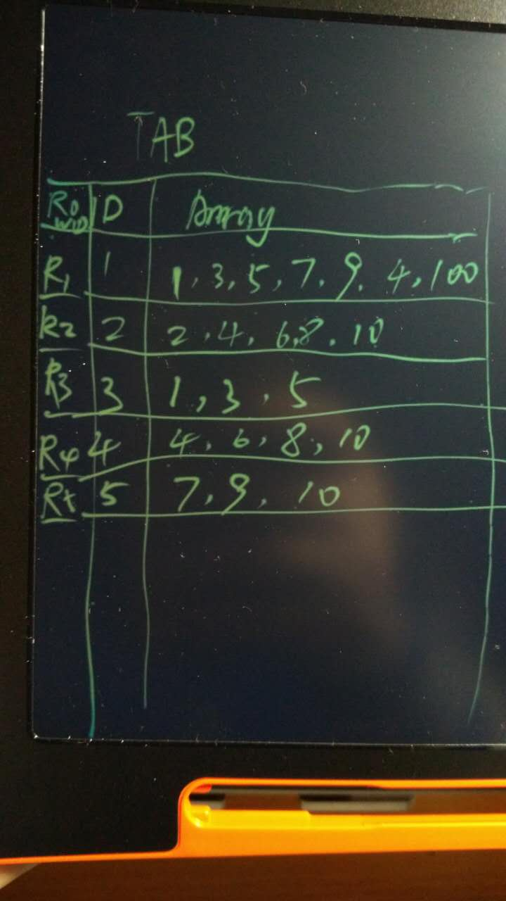
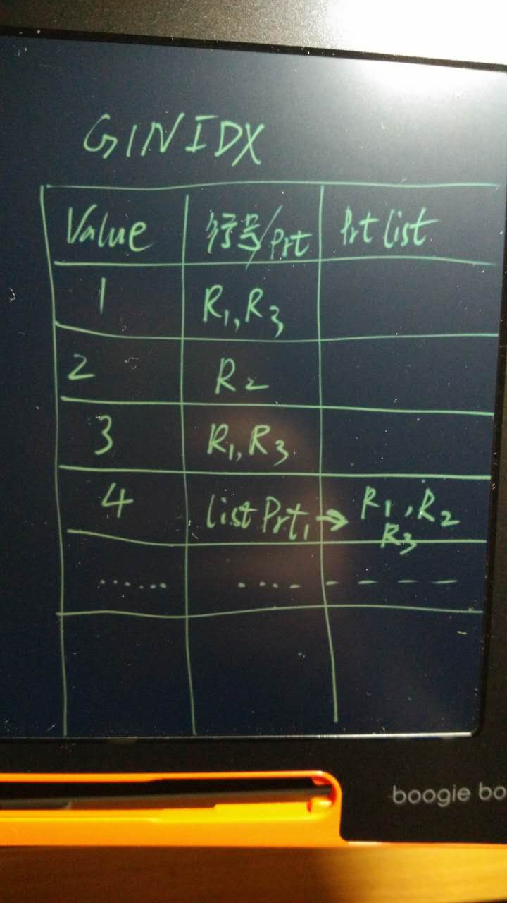

## PostgreSQL GIN索引limit慢的原因分析  
                                                                                                     
### 作者                                                                                                     
digoal                                                                                                     
                                                                                                     
### 日期                                                                                                     
2016-05-07                                                                                                  
                                                                                                     
### 标签                                                                                                     
PostgreSQL , bitmap scan , io放大 , 限制GIN返回结果数 , 性能优化       
                                                                                                     
----                                                                                                     
                                                                                                     
## 背景                                         
PostgreSQL GIN索引的结构如下图 :   
假设这个表有2列，一列存储INT，另一列存储INT数组，最左边的表示记录的行号。   
  
  
  
假设对INT数组建立GIN索引，那么GIN索引会记录每个数组element对应的行号，对于行号多的，会存成LIST，然后在索引中指向该list。   
  
  
  
好了接下来分析一下limit慢的原因， 实际上和gin索引的扫描方法有关，目前gin 索引只支持bitmap index scan，也就是说，会将所有匹配的行号取出，排序，然后去heap表取记录。   
  
那么不管你limit多小，根据行号排序是免不了的，这就是limit比btree索引以及gist索引等不需要bitmap index scan的其他索引方法慢的原因。   
  
例子：  
  
```  
postgres=# create table t3(id int, info int[]);  
CREATE TABLE  
postgres=# insert into t3 select generate_series(1,10000),array[1,2,3,4,5];  
INSERT 0 10000  
postgres=# create index idx_t3_info on t3 using gin(info);  
CREATE INDEX  
postgres=# set enable_seqscan=off;  
SET  
```  
  
数组匹配，走索引，注意是bitmap index scan，所以被匹配的数组对应有1万条记录的话，这1万条记录的行号会先排序，然后扫描heap取出记录。  
  
```  
postgres=# explain analyze select * from t3 where info  && array [1] ;  
                                                         QUERY PLAN                                                            
-----------------------------------------------------------------------------------------------------------------------------  
 Bitmap Heap Scan on t3  (cost=83.00..302.00 rows=10000 width=45) (actual time=1.156..3.565 rows=10000 loops=1)  
   Recheck Cond: (info && '{1}'::integer[])  
   Heap Blocks: exact=94  
   ->  Bitmap Index Scan on idx_t3_info  (cost=0.00..80.50 rows=10000 width=0) (actual time=1.129..1.129 rows=10000 loops=1)  
         Index Cond: (info && '{1}'::integer[])  
 Planning time: 0.107 ms  
 Execution time: 5.272 ms  
(7 rows)  
```  
  
因为走bitmap index scan, 所以即使加了limit 1，行号排序少不了，开销是不小的。  
  
```  
postgres=# explain analyze select * from t3 where info  && array [1] limit 1;  
                                                            QUERY PLAN                                                               
----------------------------------------------------------------------------------------------------------------------------  
 Limit  (cost=83.00..83.02 rows=1 width=45) (actual time=1.121..1.121 rows=1 loops=1)  
   ->  Bitmap Heap Scan on t3  (cost=83.00..302.00 rows=10000 width=45) (actual time=1.119..1.119 rows=1 loops=1)  
         Recheck Cond: (info && '{1}'::integer[])  
         Heap Blocks: exact=1  
         ->  Bitmap Index Scan on idx_t3_info  (cost=0.00..80.50 rows=10000 width=0) (actual time=1.095..1.095 rows=10000 loops=1)  
               Index Cond: (info && '{1}'::integer[])  
 Planning time: 0.113 ms  
 Execution time: 1.175 ms  
(8 rows)  
```  
  
上面就是gin 索引limit慢的原因。   
  
但是GIN这么设计是有原因的，因为数组中可能存在大量的重复值。   
  
例如我需要找的element有3个1,2,3，假设一共有10万条记录.   
  
而1,2,3对应的ctid中可能存在大量重复的page，那么使用bitmap index scan就可以大大减少离散扫描的情况。   
  
对于获取大量离散存放的堆数据是有奇效的。   
  
而如果获取的记录数比较少，并且数据库的shared buffer足够大的话，完全没有必要bitmap index scan效果一般。  
  
下面扩展一下，另一个例子，使用btree_gin使得一些标准类型也支持GIN索引，因此可以用它来建立联合索引。   
  
联合索引一般用在一个字段选择性不好，但几个字段组合起来选择性就比较好的情况。   
  
例子  
  
```  
postgres=# create extension btree_gin;  
CREATE EXTENSION  
  
postgres=# create table t4(id int, info int[]);  
CREATE TABLE  
postgres=# insert into t4 select trunc(random()*1000), array_append(array[1,2,3], trunc(random()*1000)::int) from generate_series(1,100000);  
INSERT 0 100000  
postgres=# select * from t4 limit 10;  
 id  |    info       
-----+-------------  
 588 | {1,2,3,835}  
 382 | {1,2,3,332}  
 817 | {1,2,3,476}  
 478 | {1,2,3,597}  
 928 | {1,2,3,714}  
 645 | {1,2,3,539}  
 457 | {1,2,3,536}  
 713 | {1,2,3,246}  
 842 | {1,2,3,545}  
 194 | {1,2,3,70}  
(10 rows)  
  
postgres=# create index idx_t4 on t4 using gin(id,info);  
CREATE INDEX  
postgres=# explain (analyze,verbose,costs,timing,buffers) select * from t4 where id=10 and info && array[1,2,3];  
                                                            QUERY PLAN                                                              
---------------------------------------------------------------------------------------------------------------------------  
 Bitmap Heap Scan on public.t4  (cost=10000000010.89..10000000111.71 rows=97 width=44) (actual time=1.572..1.737 rows=97 loops=1)  
   Output: id, info  
   Recheck Cond: ((t4.id = 10) AND (t4.info && '{1,2,3}'::integer[]))  
   Heap Blocks: exact=92  
   Buffers: shared hit=179  
   ->  Bitmap Index Scan on idx_t4  (cost=0.00..10.87 rows=97 width=0) (actual time=1.554..1.554 rows=97 loops=1)  
         Index Cond: ((t4.id = 10) AND (t4.info && '{1,2,3}'::integer[]))  
         Buffers: shared hit=87  
 Planning time: 0.262 ms  
 Execution time: 1.786 ms  
(10 rows)  
```  
  
gin的联合索引用在什么地方比较好？   
  
使用索引对应字段上的条件可以将范围缩小到很小的场景。   
  
如果不能这样，或者是btree就可以缩小到很小的范围，那么建议使用BTREE就够了。   
  
或者是说使用了limit限制要取的记录数，那么使用btree也是更好的，因为btree可以走index scan也可以走bitmap index scan。适用于小数据量查询，也适用于大数据量查询。  
  
## 原因  
[《PostgreSQL bitmap scan的IO放大的原理解释和优化》](../201801/20180119_03.md)    
  
## 优化  
PostgreSQL gin索引提供了一个参数，gin_fuzzy_search_limit限制扫描的条数，降低INDEX SCAN,以及bitmap heap scan回表扫描的BLOCK数，从而提升性能。这里的筛选存在一些随机性。  
  
https://www.postgresql.org/docs/devel/static/gin-tips.html  
  
gin_fuzzy_search_limit  
  
The primary goal of developing GIN indexes was to create support for highly scalable full-text search in PostgreSQL, and there are often situations when a full-text search returns a very large set of results. Moreover, this often happens when the query contains very frequent words, so that the large result set is not even useful. Since reading many tuples from the disk and sorting them could take a lot of time, this is unacceptable for production. (Note that the index search itself is very fast.)  
  
To facilitate controlled execution of such queries, GIN has a configurable soft upper limit on the number of rows returned: the gin_fuzzy_search_limit configuration parameter. It is set to 0 (meaning no limit) by default. If a non-zero limit is set, then the returned set is a subset of the whole result set, chosen at random.  
  
“Soft” means that the actual number of returned results could differ somewhat from the specified limit, depending on the query and the quality of the system's random number generator.  
  
From experience, values in the thousands (e.g., 5000 — 20000) work well.    
  
<a rel="nofollow" href="http://info.flagcounter.com/h9V1"  ></a>  
  
  
  
  
  
  
## [digoal's 大量PostgreSQL文章入口](https://github.com/digoal/blog/blob/master/README.md "22709685feb7cab07d30f30387f0a9ae")
  
