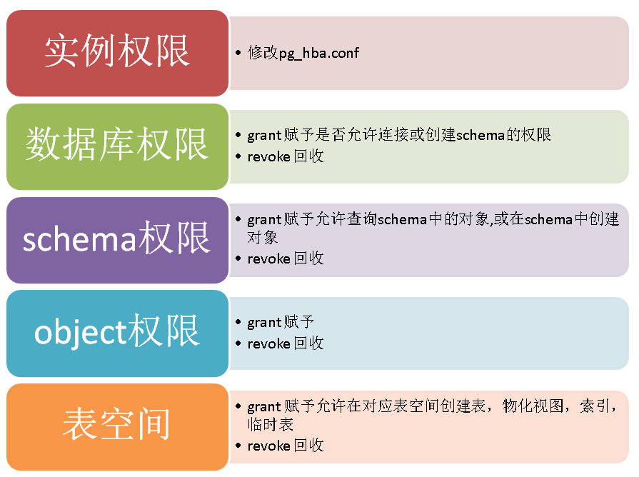

## PostgreSQL 逻辑结构 和 权限体系 介绍
                
### 作者               
digoal                
                
### 日期              
2016-05-10                  
                
### 标签              
PostgreSQL , 逻辑结构 , 权限体系                                       
                
----              
                
## 背景
本文旨在帮助用户理解PostgreSQL的逻辑结构和权限体系，帮助用户快速的理解和管理数据库的权限。  
  
## 逻辑结构  
最上层是实例，实例中允许创建多个数据库，每个数据库中可以创建多个schema，每个schema下面可以创建多个对象。  
  
对象包括表、物化视图、操作符、索引、视图、序列、函数、... 等等。  
  
  
  
在数据库中所有的权限都和角色（用户）挂钩，public是一个特殊角色，代表所有人。  
  
超级用户是有允许任意操作对象的，普通用户只能操作自己创建的对象。  
  
另外有一些对象是有赋予给public角色默认权限的，所以建好之后，所以人都有这些默认权限。    
  
## 权限体系  
  
  
实例级别的权限由pg_hba.conf来控制，例如 ：   
  
```
# TYPE  DATABASE        USER            ADDRESS                 METHOD
# "local" is for Unix domain socket connections only
local   all             all                                     trust
# IPv4 local connections:
host    all             all             127.0.0.1/32            trust
host all postgres 0.0.0.0/0 reject
host all all 0.0.0.0/0 md5
```
  
以上配置的解释  
  
允许任何本地用户无密码连接任何数据库  
  
不允许postgres用户从任何外部地址连接任何数据库  
  
允许其他任何用户从外部地址通过密码连接任何数据库  
  
数据库级别的权限，包括允许连接数据库，允许在数据库中创建schema。  
  
默认情况下，数据库在创建后，允许public角色连接，即允许任何人连接。  
  
默认情况下，数据库在创建后，不允许除了超级用户和owner之外的任何人在数据库中创建schema。  
  
默认情况下，数据库在创建后，会自动创建名为public 的schema，这个schema的all权限已经赋予给public角色，即允许任何人在里面创建对象。  
  
schema级别的权限，包括允许查看schema中的对象，允许在schema中创建对象。  
  
默认情况下新建的schema的权限不会赋予给public角色，因此除了超级用户和owner，任何人都没有权限查看schema中的对象或者在schema中新建对象。  
  
## schema使用 , 特别注意
```
According to the SQL standard, the owner of a schema always owns all objects within it. PostgreSQL allows schemas to contain objects owned by users other than the schema owner. This can happen only if the schema owner grants the CREATE privilege on his schema to someone else, or a superuser chooses to create objects in it.

schema的owner默认是该schema下的所有对象的owner，但是PostgreSQL又允许用户在别人的schema下创建对象，所以一个对象可能属于两个owner，而且schema 的owner有 drop对象的权限。  
对于两个owner都有drop的权限，这个我个人认为是一个BUG。  

所以千万不要把自己的对象创建到别人的schema下面，那很危险。  
```
  
对象级别的权限，每种类型的对象权限属性都不一样，具体请参考  
  
http://www.postgresql.org/docs/9.5/static/sql-grant.html  
  
以表为例，可以有SELECT | INSERT | UPDATE | DELETE | TRUNCATE | REFERENCES | TRIGGER这些权限。  
  
```
GRANT { { SELECT | INSERT | UPDATE | DELETE | TRUNCATE | REFERENCES | TRIGGER }
    [, ...] | ALL [ PRIVILEGES ] }
    ON { [ TABLE ] table_name [, ...]
         | ALL TABLES IN SCHEMA schema_name [, ...] }
    TO role_specification [, ...] [ WITH GRANT OPTION ]

GRANT { { SELECT | INSERT | UPDATE | REFERENCES } ( column_name [, ...] )
    [, ...] | ALL [ PRIVILEGES ] ( column_name [, ...] ) }
    ON [ TABLE ] table_name [, ...]
    TO role_specification [, ...] [ WITH GRANT OPTION ]

GRANT { { USAGE | SELECT | UPDATE }
    [, ...] | ALL [ PRIVILEGES ] }
    ON { SEQUENCE sequence_name [, ...]
         | ALL SEQUENCES IN SCHEMA schema_name [, ...] }
    TO role_specification [, ...] [ WITH GRANT OPTION ]

GRANT { { CREATE | CONNECT | TEMPORARY | TEMP } [, ...] | ALL [ PRIVILEGES ] }
    ON DATABASE database_name [, ...]
    TO role_specification [, ...] [ WITH GRANT OPTION ]

GRANT { USAGE | ALL [ PRIVILEGES ] }
    ON DOMAIN domain_name [, ...]
    TO role_specification [, ...] [ WITH GRANT OPTION ]

GRANT { USAGE | ALL [ PRIVILEGES ] }
    ON FOREIGN DATA WRAPPER fdw_name [, ...]
    TO role_specification [, ...] [ WITH GRANT OPTION ]

GRANT { USAGE | ALL [ PRIVILEGES ] }
    ON FOREIGN SERVER server_name [, ...]
    TO role_specification [, ...] [ WITH GRANT OPTION ]

GRANT { EXECUTE | ALL [ PRIVILEGES ] }
    ON { FUNCTION function_name ( [ [ argmode ] [ arg_name ] arg_type [, ...] ] ) [, ...]
         | ALL FUNCTIONS IN SCHEMA schema_name [, ...] }
    TO role_specification [, ...] [ WITH GRANT OPTION ]

GRANT { USAGE | ALL [ PRIVILEGES ] }
    ON LANGUAGE lang_name [, ...]
    TO role_specification [, ...] [ WITH GRANT OPTION ]

GRANT { { SELECT | UPDATE } [, ...] | ALL [ PRIVILEGES ] }
    ON LARGE OBJECT loid [, ...]
    TO role_specification [, ...] [ WITH GRANT OPTION ]

GRANT { { CREATE | USAGE } [, ...] | ALL [ PRIVILEGES ] }
    ON SCHEMA schema_name [, ...]
    TO role_specification [, ...] [ WITH GRANT OPTION ]

GRANT { CREATE | ALL [ PRIVILEGES ] }
    ON TABLESPACE tablespace_name [, ...]
    TO role_specification [, ...] [ WITH GRANT OPTION ]

GRANT { USAGE | ALL [ PRIVILEGES ] }
    ON TYPE type_name [, ...]
    TO role_specification [, ...] [ WITH GRANT OPTION ]

where role_specification can be:

    [ GROUP ] role_name
  | PUBLIC
  | CURRENT_USER
  | SESSION_USER

GRANT role_name [, ...] TO role_name [, ...] [ WITH ADMIN OPTION ]
```
  
简单介绍一下grant的一些通用选项  
  
WITH ADMIN OPTION表示被赋予权限的用户，拿到对应的权限后，还能将对应的权限赋予给其他人，否则只能自己有这个权限，但是不能再赋予给其他人。  
  
## 用户  
用户，角色在PostgreSQL是一个概念。    

## public  
public角色，代表所有人的意思。  

## 如何查看和解读一个对象的当前权限状态
以表为例 ：   
  
```
select relname,relacl from pg_class where relkind='r';
```
  
或者执行    
  
```
SELECT n.nspname as "Schema",
  c.relname as "Name",
  CASE c.relkind WHEN 'r' THEN 'table' WHEN 'v' THEN 'view' WHEN 'm' THEN 'materialized view' WHEN 'S' THEN 'sequence' WHEN 'f' THEN 'foreign table' END as "Type",
  pg_catalog.array_to_string(c.relacl, E'\n') AS "Access privileges",
  pg_catalog.array_to_string(ARRAY(
    SELECT attname || E':\n  ' || pg_catalog.array_to_string(attacl, E'\n  ')
    FROM pg_catalog.pg_attribute a
    WHERE attrelid = c.oid AND NOT attisdropped AND attacl IS NOT NULL
  ), E'\n') AS "Column privileges",
  pg_catalog.array_to_string(ARRAY(
    SELECT polname
    || CASE WHEN polcmd != '*' THEN
           E' (' || polcmd || E'):'
       ELSE E':' 
       END
    || CASE WHEN polqual IS NOT NULL THEN
           E'\n  (u): ' || pg_catalog.pg_get_expr(polqual, polrelid)
       ELSE E''
       END
    || CASE WHEN polwithcheck IS NOT NULL THEN
           E'\n  (c): ' || pg_catalog.pg_get_expr(polwithcheck, polrelid)
       ELSE E''
       END    || CASE WHEN polroles <> '{0}' THEN
           E'\n  to: ' || pg_catalog.array_to_string(
               ARRAY(
                   SELECT rolname
                   FROM pg_catalog.pg_roles
                   WHERE oid = ANY (polroles)
                   ORDER BY 1
               ), E', ')
       ELSE E''
       END
    FROM pg_catalog.pg_policy pol
    WHERE polrelid = c.oid), E'\n')
    AS "Policies"
FROM pg_catalog.pg_class c
     LEFT JOIN pg_catalog.pg_namespace n ON n.oid = c.relnamespace
WHERE c.relkind IN ('r', 'v', 'm', 'S', 'f')
  AND n.nspname !~ '^pg_' AND pg_catalog.pg_table_is_visible(c.oid)
ORDER BY 1, 2;
```
  
得到权限说明如下  
  
```
 Schema |      Name       |   Type   |       Access privileges        | Column privileges | Policies 
--------+-----------------+----------+--------------------------------+-------------------+----------
 public | sbtest1         | table    | postgres=arwdDxt/postgres     +|                   | 
        |                 |          | digoal=a*r*w*d*D*x*t*/postgres |                   | 
 public | sbtest10        | table    | postgres=arwdDxt/postgres      |                   | 
 public | sbtest10_id_seq | sequence |                                |                   | 
 public | sbtest11        | table    | postgres=arwdDxt/postgres      |                   | 
 public | sbtest11_id_seq | sequence |                                |                   | 
 public | sbtest12        | table    | postgres=arwdDxt/postgres      |                   | 
 public | sbtest12_id_seq | sequence |                                |                   | 
```
  
解释一下 Access privileges  
  
rolename=xxx 其中rolename就是被赋予权限的用户名，即权限被赋予给谁了?    
  
=xxx 表示这个权限赋予给了public角色，即所有人  
  
/yyyy 表示是谁赋予的这个权限?  
  
权限的含义如下  
  
```
rolename=xxxx -- privileges granted to a role
        =xxxx -- privileges granted to PUBLIC

            r -- SELECT ("read")
            w -- UPDATE ("write")
            a -- INSERT ("append")
            d -- DELETE
            D -- TRUNCATE
            x -- REFERENCES
            t -- TRIGGER
            X -- EXECUTE
            U -- USAGE
            C -- CREATE
            c -- CONNECT
            T -- TEMPORARY
      arwdDxt -- ALL PRIVILEGES (for tables, varies for other objects)
            * -- grant option for preceding privilege

        /yyyy -- role that granted this privilege
```
  
例子  
  
赋予权限的人是postgres用户， sbtest2表的select权限被赋予给了digoal用户。  
  
```
postgres=# grant select on sbtest2 to digoal;
GRANT
postgres=# \dp+ sbtest2
                                  Access privileges
 Schema |  Name   | Type  |     Access privileges     | Column privileges | Policies 
--------+---------+-------+---------------------------+-------------------+----------
 public | sbtest2 | table | postgres=arwdDxt/postgres+|                   | 
        |         |       | digoal=r/postgres         |                   | 
(1 row)
```
  
回收权限一定要针对已有的权限来，如果你发现这里的权限还在，那照着权限回收即可。  
  
例如  
  
```
revoke select on sbtest2 from digoal;  
```
  
## 附录
如何查看已有权限，如何查看某个schema下所有对象的权限等。  可以使用psql提供的一些快捷命令。  
  
```
\?
General
  \copyright             show PostgreSQL usage and distribution terms
  \crosstabview [COLUMNS] execute query and display results in crosstab
  \errverbose            show most recent error message at maximum verbosity
  \g [FILE] or ;         execute query (and send results to file or |pipe)
  \gexec                 execute query, then execute each value in its result
  \gset [PREFIX]         execute query and store results in psql variables
  \gx [FILE]             as \g, but forces expanded output mode
  \q                     quit psql
  \watch [SEC]           execute query every SEC seconds

Help
  \? [commands]          show help on backslash commands
  \? options             show help on psql command-line options
  \? variables           show help on special variables
  \h [NAME]              help on syntax of SQL commands, * for all commands

Query Buffer
  \e [FILE] [LINE]       edit the query buffer (or file) with external editor
  \ef [FUNCNAME [LINE]]  edit function definition with external editor
  \ev [VIEWNAME [LINE]]  edit view definition with external editor
  \p                     show the contents of the query buffer
  \r                     reset (clear) the query buffer
  \s [FILE]              display history or save it to file
  \w FILE                write query buffer to file

Input/Output
  \copy ...              perform SQL COPY with data stream to the client host
  \echo [STRING]         write string to standard output
  \i FILE                execute commands from file
  \ir FILE               as \i, but relative to location of current script
  \o [FILE]              send all query results to file or |pipe
  \qecho [STRING]        write string to query output stream (see \o)

Conditional
  \if EXPR               begin conditional block
  \elif EXPR             alternative within current conditional block
  \else                  final alternative within current conditional block
  \endif                 end conditional block

Informational
  (options: S = show system objects, + = additional detail)
  \d[S+]                 list tables, views, and sequences
  \d[S+]  NAME           describe table, view, sequence, or index
  \da[S]  [PATTERN]      list aggregates
  \dA[+]  [PATTERN]      list access methods
  \db[+]  [PATTERN]      list tablespaces
  \dc[S+] [PATTERN]      list conversions
  \dC[+]  [PATTERN]      list casts
  \dd[S]  [PATTERN]      show object descriptions not displayed elsewhere
  \dD[S+] [PATTERN]      list domains
  \ddp    [PATTERN]      list default privileges
  \dE[S+] [PATTERN]      list foreign tables
  \det[+] [PATTERN]      list foreign tables
  \des[+] [PATTERN]      list foreign servers
  \deu[+] [PATTERN]      list user mappings
  \dew[+] [PATTERN]      list foreign-data wrappers
  \df[antw][S+] [PATRN]  list [only agg/normal/trigger/window] functions
  \dF[+]  [PATTERN]      list text search configurations
  \dFd[+] [PATTERN]      list text search dictionaries
  \dFp[+] [PATTERN]      list text search parsers
  \dFt[+] [PATTERN]      list text search templates
  \dg[S+] [PATTERN]      list roles
  \di[S+] [PATTERN]      list indexes
  \dl                    list large objects, same as \lo_list
  \dL[S+] [PATTERN]      list procedural languages
  \dm[S+] [PATTERN]      list materialized views
  \dn[S+] [PATTERN]      list schemas
  \do[S]  [PATTERN]      list operators
  \dO[S+] [PATTERN]      list collations
  \dp     [PATTERN]      list table, view, and sequence access privileges
  \drds [PATRN1 [PATRN2]] list per-database role settings
  \dRp[+] [PATTERN]      list replication publications
  \dRs[+] [PATTERN]      list replication subscriptions
  \ds[S+] [PATTERN]      list sequences
  \dt[S+] [PATTERN]      list tables
  \dT[S+] [PATTERN]      list data types
  \du[S+] [PATTERN]      list roles
  \dv[S+] [PATTERN]      list views
  \dx[+]  [PATTERN]      list extensions
  \dy     [PATTERN]      list event triggers
  \l[+]   [PATTERN]      list databases
  \sf[+]  FUNCNAME       show a function's definition
  \sv[+]  VIEWNAME       show a view's definition
  \z      [PATTERN]      same as \dp
  \dY     [PATTERN]      list synonyms

Formatting
  \a                     toggle between unaligned and aligned output mode
  \C [STRING]            set table title, or unset if none
  \f [STRING]            show or set field separator for unaligned query output
  \H                     toggle HTML output mode (currently off)
  \pset [NAME [VALUE]]   set table output option
                         (NAME := {border|columns|expanded|fieldsep|fieldsep_zero|
                         footer|format|linestyle|null|numericlocale|pager|
                         pager_min_lines|recordsep|recordsep_zero|tableattr|title|
                         tuples_only|unicode_border_linestyle|
                         unicode_column_linestyle|unicode_header_linestyle})
  \t [on|off]            show only rows (currently off)
  \T [STRING]            set HTML <table> tag attributes, or unset if none
  \x [on|off|auto]       toggle expanded output (currently off)

Connection
  \c[onnect] {[DBNAME|- USER|- HOST|- PORT|-] | conninfo}
                         connect to new database (currently "nt_task")
  \conninfo              display information about current connection
  \encoding [ENCODING]   show or set client encoding
  \password [USERNAME]   securely change the password for a user

Operating System
  \cd [DIR]              change the current working directory
  \setenv NAME [VALUE]   set or unset environment variable
  \timing [on|off]       toggle timing of commands (currently off)
  \! [COMMAND]           execute command in shell or start interactive shell

Variables
  \prompt [TEXT] NAME    prompt user to set internal variable
  \set [NAME [VALUE]]    set internal variable, or list all if no parameters
  \unset NAME            unset (delete) internal variable

Large Objects
  \lo_export LOBOID FILE
  \lo_import FILE [COMMENT]
  \lo_list
  \lo_unlink LOBOID      large object operations
```
  
例子  
  
```
\dp+ usera.*
```
  
如果想知道这些快捷命令后面用了什么SQL，可以开启-E选项  
  
```
psql -E

然后在执行时，会打印psql后台执行的SQL  
```
  
## libpq与jdbc连接配置参考
首先需要理解PG的逻辑架构，对于Oracle用户，很容易在没有理解逻辑架构的情况下，对连接数据库的配置束手无策。   
  
PS: EDB PPAS请参考enterprisedb DRIVER文档。  
  
### libpq
  
https://www.postgresql.org/docs/current/static/libpq-connect.html#LIBPQ-MULTIPLE-HOSTS   
  
```
postgresql://[user[:password]@][netloc][:port][,...][/dbname][?param1=value1&...]
```
   
### jdbc
  
https://jdbc.postgresql.org/documentation/head/connect.html#connection-parameters   
  
```
jdbc:postgresql:database
jdbc:postgresql:/
jdbc:postgresql://host/database
jdbc:postgresql://host/
jdbc:postgresql://host:port/database
jdbc:postgresql://host:port/
```
  
## 参考
grant  
  
revoke  
  
## 更高基本的安全控制
PostgreSQL还支持凌驾于基本权限体系之上的安全策略，这些安全策略一般在企业级的商业数据库中才有。  
  
### 行安全策略
https://yq.aliyun.com/articles/4271    
  
### SELinux-PostgreSQL
    
        
  
<a rel="nofollow" href="http://info.flagcounter.com/h9V1"  ></a>  
  
  
  
  
  
  
## [digoal's 大量PostgreSQL文章入口](https://github.com/digoal/blog/blob/master/README.md "22709685feb7cab07d30f30387f0a9ae")
  
