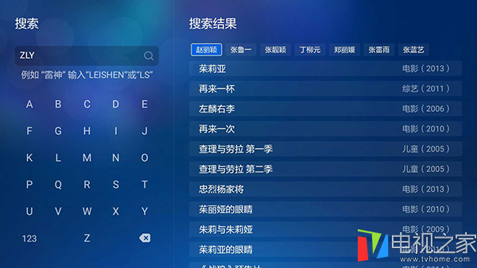

## PostgreSQL 获取拼音首字母的函数 - 摘自互联网         
                                                                  
### 作者                                                                 
digoal                                                                  
                                                                  
### 日期                                                                
2016-05-11                                                                   
                                                                  
### 标签                                                                
PostgreSQL , 拼音首字母 , 转换 , 字符边界                                                                                                 
                                                                  
----                                                                
                                                                  
## 背景   
将中文转换为拼音首字母是一个比较常见的需求，比如用遥控搜索电影，对用户来说输入中文肯定很痛苦，而输入拼音首字母会方便很多。  
  
  
  
在数据库中，我们可以在输入中文后，通过函数将其转换为拼音首字母  
  
转换方法可以通过编码表得到，比如GBK, EUC_CN的编码是按拼音顺序来的（注意多音字），找到26个字母的边界，通过编码区间即可判断属于什么字母。  
  
一下例子取自互联网  
  
## for PostgreSQL  
### 这个函数有点问题，可能必须要在EUC_CN编码的数据库中才能使用。  
  
```  
CREATE FUNCTION func_chinese_spell(str VARCHAR(2000)) RETURNS VARCHAR(2000) AS $$  
DECLARE  
word NCHAR(1);  
code VARCHAR(2000);  
i INTEGER;  
chnstr VARCHAR(2000);  
BEGIN   
code := '';  
i := 1;  
chnstr := str;  
WHILE LENGTH(chnstr)>0 LOOP  
word := SUBSTRING(str,i,1);   
code := code || CASE WHEN (ASCII(word) BETWEEN 19968 AND 19968+20901) THEN  
(  
SELECT p FROM  
(  
SELECT 'A' as p,N'驁' as w   
UNION ALL SELECT 'B',N'簿'   
UNION ALL SELECT 'C',N'錯'   
UNION ALL SELECT 'D',N'鵽'   
UNION ALL SELECT 'E',N'樲'   
UNION ALL SELECT 'F',N'鰒'   
UNION ALL SELECT 'G',N'腂'   
UNION ALL SELECT 'H',N'夻'   
UNION ALL SELECT 'J',N'攈'   
UNION ALL SELECT 'K',N'穒'   
UNION ALL SELECT 'L',N'鱳'   
UNION ALL SELECT 'M',N'旀'   
UNION ALL SELECT 'N',N'桛'   
UNION ALL SELECT 'O',N'漚'   
UNION ALL SELECT 'P',N'曝'   
UNION ALL SELECT 'Q',N'囕'   
UNION ALL SELECT 'R',N'鶸'   
UNION ALL SELECT 'S',N'蜶'   
UNION ALL SELECT 'T',N'籜'   
UNION ALL SELECT 'W',N'鶩'   
UNION ALL SELECT 'X',N'鑂'   
UNION ALL SELECT 'Y',N'韻'   
UNION ALL SELECT 'Z',N'咗'   
) T   
WHERE w>=word ORDER BY p ASC LIMIT 1  
)   
ELSE word END;  
i := i + 1;  
chnstr := SUBSTRING(str,i,LENGTH(str)-i + 1);  
END LOOP;  
  
RETURN code;  
END;   
$$LANGUAGE plpgsql;  
```  
  
### 这个函数很实用  
2014,swish，原版首发：http://blog.qdac.cc/?p=1281，自由使用，保留版权  
  
这个很不错，使用convert_to转换为gb18030，适用于任意字符集的数据库。  
  
只是算法还可以改进一下，提高性能，比如在频繁调用的场景中，可以减少CPU的开销。  
  
```  
CREATE OR REPLACE FUNCTION CnFirstChar(s character varying)  
  RETURNS character varying AS  
$BODY$  
declare  
  retval character varying;  
  c character varying;  
  l integer;  
  b bytea;    
  w integer;  
begin  
l=length(s);  
retval='';  
while l>0 loop  
  c=left(s,1);  
  b=convert_to(c,'GB18030');  
  if get_byte(b,0)<127 then  
    retval=retval || upper(c);  
  elsif length(b)=2 then  
    begin  
    w=get_byte(b,0)*256+get_byte(b,1);  
    --汉字GBK编码按拼音排序，按字符数来查找，基于概率来说，效率应该比挨个强:)  
    if w between 48119 and 49061 then --"J";48119;49061;942  
      retval=retval || 'J';  
    elsif w between 54481 and 55289 then --"Z";54481;55289;808  
      retval=retval || 'Z';  
    elsif w between 53689 and 54480 then --"Y";53689;54480;791  
      retval=retval || 'Y';  
    elsif w between 51446 and 52208 then --"S";51446;52208;762  
      retval=retval || 'S';  
    elsif w between 52980 and 53640 then --"X";52980;53640;660  
      retval=retval || 'X';  
    elsif w between 49324 and 49895 then --"L";49324;49895;571  
      retval=retval || 'L';  
    elsif w between 45761 and 46317 then --"C";45761;46317;556  
      retval=retval || 'C';  
    elsif w between 45253 and 45760 then --"B";45253;45760;507  
      retval=retval || 'B';  
    elsif w between 46318 and 46825 then --"D";46318;46825;507  
      retval=retval || 'D';  
    elsif w between 47614 and 48118 then --"H";47614;48118;504  
      retval=retval || 'H';  
    elsif w between 50906 and 51386 then --"Q";50906;51386;480  
      retval=retval || 'Q';  
    elsif w between 52218 and 52697 then --"T";52218;52697;479  
      retval=retval || 'T';  
    elsif w between 49896 and 50370 then --"M";49896;50370;474  
      retval=retval || 'M';  
    elsif w between 47297 and 47613 then --"G";47297;47613;316  
      retval=retval || 'G';  
    elsif w between 47010 and 47296 then--"F";47010;47296;286  
      retval=retval || 'F';  
    elsif w between 50622 and 50905 then--"P";50622;50905;283  
      retval=retval || 'P';  
    elsif w between 52698 and 52979 then--"W";52698;52979;281  
      retval=retval || 'W';  
    elsif w between 49062 and 49323 then--"K";49062;49323;261  
      retval=retval || 'K';  
    elsif w between 50371 and 50613 then --"N";50371;50613;242  
      retval=retval || 'N';  
    elsif w between 46826 and 47009 then--"E";46826;47009;183  
      retval=retval || 'E';  
    elsif w between 51387 and 51445 then--"R";51387;51445;58  
      retval=retval || 'R';  
    elsif w between 45217 and 45252 then --"A";45217;45252;35  
      retval=retval || 'A';  
    elsif w between 50614 and 50621 then --"O";50614;50621;7  
      retval=retval || 'O';  
    end if;  
    end;  
  end if;  
  s=substring(s,2,l-1);  
  l=l-1;  
end loop;  
return retval;  
end;  
$BODY$  
  LANGUAGE plpgsql IMMUTABLE;  
```  
  
```  
db=# \l  
                                 List of databases  
   Name    |  Owner   | Encoding  |  Collate   |   Ctype    |   Access privileges     
-----------+----------+-----------+------------+------------+-----------------------  
 db        | postgres | SQL_ASCII | C          | C          |   
 db1       | postgres | EUC_CN    | C          | C          |   
 postgres  | postgres | UTF8      | C          | C          |   
  
db=# \c postgres  
postgres=# select CnFirstChar('你好中国');  
 cnfirstchar   
-------------  
 NHZG  
(1 row)  
postgres=# select CnFirstChar('你好重庆');  
 cnfirstchar   
-------------  
 NHZQ  
(1 row)  
```  
  
## for SQL Server  
```  
CREATE function fn_GetPy(@str nvarchar(4000))   
returns nvarchar(4000)   
--WITH ENCRYPTION   
as   
begin   
declare @intLenint   
declare @strRetnvarchar(4000)   
declare @temp nvarchar(100)   
set @intLen = len(@str)   
set @strRet = ''   
while @intLen > 0   
begin   
set @temp = ''   
select @temp = case   
when substring(@str,@intLen,1) >= '帀' then 'Z'   
when substring(@str,@intLen,1) >= '丫' then 'Y'   
when substring(@str,@intLen,1) >= '夕' then 'X'   
when substring(@str,@intLen,1) >= '屲' then 'W'   
when substring(@str,@intLen,1) >= '他' then 'T'   
when substring(@str,@intLen,1) >= '仨' then 'S'   
when substring(@str,@intLen,1) >= '呥' then 'R'   
when substring(@str,@intLen,1) >= '七' then 'Q'   
when substring(@str,@intLen,1) >= '妑' then 'P'   
when substring(@str,@intLen,1) >= '噢' then 'O'   
when substring(@str,@intLen,1) >= '拏' then 'N'   
when substring(@str,@intLen,1) >= '嘸' then 'M'   
when substring(@str,@intLen,1) >= '垃' then 'L'   
when substring(@str,@intLen,1) >= '咔' then 'K'   
when substring(@str,@intLen,1) >= '丌' then 'J'   
when substring(@str,@intLen,1) >= '铪' then 'H'   
when substring(@str,@intLen,1) >= '旮' then 'G'   
when substring(@str,@intLen,1) >= '发' then 'F'   
when substring(@str,@intLen,1) >= '妸' then 'E'   
when substring(@str,@intLen,1) >= '咑' then 'D'   
when substring(@str,@intLen,1) >= '嚓' then 'C'   
when substring(@str,@intLen,1) >= '八' then 'B'   
when substring(@str,@intLen,1) >= '吖' then 'A'   
else rtrim(ltrim(substring(@str,@intLen,1)))   
end   
--对于汉字特殊字符，不生成拼音码   
if (ascii(@temp)>127) set @temp = ''   
--对于英文中小括号，不生成拼音码   
if @temp = '(' or @temp = ')' set @temp = ''   
select @strRet = @temp + @strRet   
set @intLen = @intLen - 1   
end   
return lower(@strRet)   
end   
go   
--调用   
select dbo.fn_getpy('张三')   
--返回：zs   
答！： 2:   
取汉字拼音首字母的存储过程   
Create function fun_getPY ( @str nvarchar(4000) )   
returns nvarchar(4000)   
as   
begin   
declare @word nchar(1),@PY nvarchar(4000)   
set @PY=''   
while len(@str)>0   
begin   
set @word=left(@str,1)   
--如果非汉字字符，返回原字符   
set @PY=@PY+(case when unicode(@word) between 19968 and 19968+20901   
then (   
select top 1 PY   
from   
(   
select 'A' as PY,N'驁' as word   
union all select 'B',N'簿'   
union all select 'C',N'錯'   
union all select 'D',N'鵽'   
union all select 'E',N'樲'   
union all select 'F',N'鰒'   
union all select 'G',N'腂'   
union all select 'H',N'夻'   
union all select 'J',N'攈'   
union all select 'K',N'穒'   
union all select 'L',N'鱳'   
union all select 'M',N'旀'   
union all select 'N',N'桛'   
union all select 'O',N'漚'   
union all select 'P',N'曝'   
union all select 'Q',N'囕'   
union all select 'R',N'鶸'   
union all select 'S',N'蜶'   
union all select 'T',N'籜'   
union all select 'W',N'鶩'   
union all select 'X',N'鑂'   
union all select 'Y',N'韻'   
union all select 'Z',N'咗'   
) T   
where word>=@word collate Chinese_PRC_CS_AS_KS_WS   
order by PY ASC   
)   
else @word   
end)   
set @str=right(@str,len(@str)-1)   
end   
return @PY   
end   
```  
  
                    
                                         
  
<a rel="nofollow" href="http://info.flagcounter.com/h9V1"  ></a>  
  
  
  
  
  
  
## [digoal's 大量PostgreSQL文章入口](https://github.com/digoal/blog/blob/master/README.md "22709685feb7cab07d30f30387f0a9ae")
  
