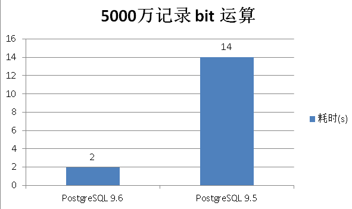

## PostgreSQL 标签系统 bit 位运算 查询性能  
                                                                                                                                                                                           
### 作者                                                                                                                                                                                           
digoal                                                                                                                                                                                           
                                                                                                                                                                                           
### 日期                                                                                                                                                                                           
2016-05-15                                                                                                                                                                                    
                                                                                                                                                                                           
### 标签                                                                                                                                                                                           
PostgreSQL , 标签系统 , varbitx          
                                                                                                                                                                                           
----                                                                                                                                                                                           
                                                                                                                                                                                           
## 背景                                                                               
在标签系统中，通常会有多个属性，每个属性使用一个标签标示，最简单的标签是用0和1来表示，代表true和false。    
  
我们可以把所有的标签转换成比特位，例如系统中一共有200个标签，5000万用户。    
  
那么我们可以通过标签的位运算来圈定特定的人群。    
  
这样就会涉及BIT位的运算。    
  
那么我们来看看PostgreSQL位运算的性能如何？    
  
PostgreSQL 9.5    
  
```  
postgres=# create table t_bit2 (id bit(200));  
CREATE TABLE  
Time: 1.018 ms  
postgres=# insert into t_bit2 select B'10101010101010101010101010101010101010101010101010101010101010101010101010101010101010101010101010101010101010101010101010101010101010101010101010101010101010101010101010101010101010101010101010101010' from generate_series(1,50000000);  
INSERT 0 50000000  
Time: 47203.497 ms  
postgres=# select count(*) from t_bit2 where bitand(id, '10101010101010101010101010101010101010101010101010101010101010101010101010101010101010101010101010101010101010101010101010101010101010101010101010101010101010101010101010101010101010101010101010101010')=B'10101010101010101010101010101010101010101010101010101010101010101010101010101010101010101010101010101010101010101010101010101010101010101010101010101010101010101010101010101010101010101010101010101010';  
  count     
----------  
 50000000  
(1 row)  
  
Time: 14216.286 ms  
postgres=# \dt+ t_bit2  
                     List of relations  
 Schema |  Name  | Type  |  Owner   |  Size   | Description   
--------+--------+-------+----------+---------+-------------  
 public | t_bit2 | table | postgres | 2873 MB |   
(1 row)  
```  
  
PostgreSQL 9.6支持并行查询    
  
```  
postgres=#  create table t_bit2 (id bit(200));  
CREATE TABLE  
Time: 0.933 ms  
postgres=# insert into t_bit2 select B'10101010101010101010101010101010101010101010101010101010101010101010101010101010101010101010101010101010101010101010101010101010101010101010101010101010101010101010101010101010101010101010101010101010' from generate_series(1,50000000);  
INSERT 0 50000000  
Time: 51485.962 ms  
postgres=# explain (analyze,verbose,timing,costs,buffers) select count(*) from t_bit2 where bitand(id, '10101010101010101010101010101010101010101010101010101010101010101010101010101010101010101010101010101010101010101010101010101010101010101010101010101010101010101010101010101010101010101010101010101010')=B'10101010101010101010101010101010101010101010101010101010101010101010101010101010101010101010101010101010101010101010101010101010101010101010101010101010101010101010101010101010101010101010101010101010';  
                                                                                                                                                                                                                                        QUERY  
 PLAN                                                                                                                                                                                                                                          
---------------------------------------------------------------------------------------------------------------------------------------------------------------------------------------------------------------------------------------------  
---------------------------------------------------------------------------------------------------------------------------------------------------------------------------------------------------------------------------------------------  
 Finalize Aggregate  (cost=471554.70..471554.71 rows=1 width=8) (actual time=9667.464..9667.465 rows=1 loops=1)  
   Output: count(*)  
   Buffers: shared hit=368140 dirtied=145199  
   ->  Gather  (cost=471554.07..471554.68 rows=6 width=8) (actual time=9667.433..9667.454 rows=7 loops=1)  
         Output: (PARTIAL count(*))  
         Workers Planned: 6  
         Workers Launched: 6  
         Buffers: shared hit=368140 dirtied=145199  
         ->  Partial Aggregate  (cost=470554.07..470554.08 rows=1 width=8) (actual time=9663.423..9663.424 rows=1 loops=7)  
               Output: PARTIAL count(*)  
               Buffers: shared hit=367648 dirtied=145199  
               Worker 0: actual time=9662.545..9662.546 rows=1 loops=1  
                 Buffers: shared hit=49944 dirtied=19645  
               Worker 1: actual time=9661.922..9661.922 rows=1 loops=1  
                 Buffers: shared hit=49405 dirtied=19198  
               Worker 2: actual time=9662.924..9662.925 rows=1 loops=1  
                 Buffers: shared hit=49968 dirtied=19641  
               Worker 3: actual time=9662.483..9662.484 rows=1 loops=1  
                 Buffers: shared hit=49301 dirtied=19403  
               Worker 4: actual time=9663.341..9663.342 rows=1 loops=1  
                 Buffers: shared hit=49825 dirtied=19814  
               Worker 5: actual time=9663.605..9663.605 rows=1 loops=1  
                 Buffers: shared hit=49791 dirtied=19586  
               ->  Parallel Seq Scan on public.t_bit2  (cost=0.00..470468.39 rows=34274 width=0) (actual time=0.039..5724.642 rows=7142857 loops=7)  
                     Output: id  
                     Filter: (bitand(t_bit2.id, B'1010101010101010101010101010101010101010101010101010101010101010101010101010101010101010101010101010101010101010101010101010101010101010101010101010101010101010101010101010101010101010101  
0101010101010'::"bit") = B'10101010101010101010101010101010101010101010101010101010101010101010101010101010101010101010101010101010101010101010101010101010101010101010101010101010101010101010101010101010101010101010101010101010'::"bit")  
                     Buffers: shared hit=367648 dirtied=145199  
                     Worker 0: actual time=0.038..5676.776 rows=6792384 loops=1  
                       Buffers: shared hit=49944 dirtied=19645  
                     Worker 1: actual time=0.046..5675.846 rows=6719080 loops=1  
                       Buffers: shared hit=49405 dirtied=19198  
                     Worker 2: actual time=0.040..5678.657 rows=6795648 loops=1  
                       Buffers: shared hit=49968 dirtied=19641  
                     Worker 3: actual time=0.037..5678.587 rows=6704936 loops=1  
                       Buffers: shared hit=49301 dirtied=19403  
                     Worker 4: actual time=0.039..5667.813 rows=6776072 loops=1  
                       Buffers: shared hit=49825 dirtied=19814  
                     Worker 5: actual time=0.051..5677.367 rows=6771576 loops=1  
                       Buffers: shared hit=49791 dirtied=19586  
 Planning time: 0.100 ms  
 Execution time: 9772.925 ms  
(41 rows)  
Time: 9773.874 ms  
postgres=# select count(*) from t_bit2 where bitand(id, '10101010101010101010101010101010101010101010101010101010101010101010101010101010101010101010101010101010101010101010101010101010101010101010101010101010101010101010101010101010101010101010101010101010')=B'10101010101010101010101010101010101010101010101010101010101010101010101010101010101010101010101010101010101010101010101010101010101010101010101010101010101010101010101010101010101010101010101010101010';  
  count     
----------  
 50000000  
(1 row)  
Time: 2326.541 ms  
```  
  
PostgreSQL 9.6的性能提升：    
  
  
  
<a rel="nofollow" href="http://info.flagcounter.com/h9V1"  ></a>  
  
  
  
  
  
  
## [digoal's 大量PostgreSQL文章入口](https://github.com/digoal/blog/blob/master/README.md "22709685feb7cab07d30f30387f0a9ae")
  
