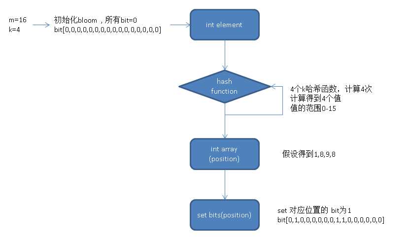
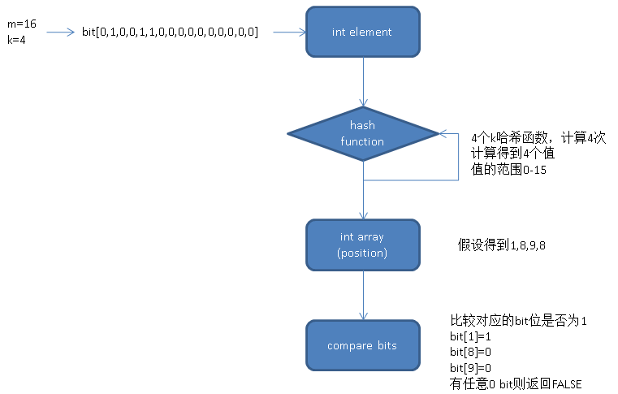

## PostgreSQL 9.6 黑科技 bloom 算法索引，一个索引支撑任意列组合查询   
                                      
### 作者                                     
digoal                                      
                                      
### 日期                                    
2016-05-23                                       
                                      
### 标签                                    
PostgreSQL , bloom , 任意列组合查询  
                                      
----                                    
                                      
## 背景        
在很多前端页面中，通常会让用户勾选需要的查询条件，而用户往往会在几十个查询条件中，选择任意的组合。    
    
    
    
那么难题来了，是不是要为每列创建索引呢，或者有什么好的方法来实现任意列的选择呢？    
    
## bloom filter  
PostgreSQL 确实是学术界和工业界的璀璨明珠，它总是喜欢将学术界的一些玩意工业化，这次的bloom又是一个代表。    
    
在PG很多的地方都能看到学术的影子，比如pgbench支持产生泊松分布，高斯分布的随机值。    
    
bloom filter是一个有损过滤器，使用有限的比特位存储一些唯一值集合所产生的bits。    
    
通过这些bits可以满足这样的场景需求，给定一个值，判断这个值是否属于这个集合。    
    
例如    
    
```  
create table test(c1 int);  
insert into test select trunc(random()*100000) from generate_series(1,10000);  
```  
    
使用所有的 test.c1 值，通过bloom filter算法生成一个值val。    
    
然后给定一个值例如 100，判断100是否在test.c1中。     
    
```  
select * from test where c1=100;   
```  
  
通过bloom filter可以快速得到，不需要遍历表来得到。    
  
判断方法是使用100和val以及统一的bloom算法。    
  
可能得到的结果是true or false。    
  
true表示100在这里面，false表示100不在这里面。    
  
必须注意，由于bloom filter是有损过滤器，并且真的不一定为真，但是假的一定为假。    
  
PostgreSQL 9.6使用custom access methods接口定义了一个索引接口bloom，使用到它的特性：    
  
真的不一定为真，但是假的一定为假。      
  
目前已实现的场景是，支持=查询，但是这个=会包含一些假的值，所以需要recheck。    
  
反过来，它如果要支持<>也是很方便的，并且不需要recheck。    
  
(这句话的理解是=和<>互斥, 所以=为假<>就一定为真。实际上利用了优化器中的互斥推理。    
  
请参考 https://yq.aliyun.com/articles/6653     
  
negator 优化选项， not(x = y) 等价于 x <> y ，   
  
由此可以推理出    
  
(x <> y) == not ( x = y ) == not (false) == true 是肯定的    
  
(如果单独实现<>，则不能这么理解了，和单独实现=是一样的，<>为真时不一定为真，为假时一定为假。 但是也能用<>的假来推理=的真    
  
(x = y) == not ( x <> y ) == not (false) == true 是肯定的    
  
使用PostgreSQL 函数接口也能实现bloom过滤器。    
  
bloom需要m个bit位。    
  
添加元素时，需要k个hash函数，通过每一个hash和传入的值计算得到另一个值（[0,m]）。    
  
得到的值用于设置对应的bit位为1。    
  
例子    
  
创建一个类型，存储bloom。    
  
```  
CREATE TYPE dumbloom AS (  
  m    integer,  -- bit 位数  
  k    integer,  --  hash 函数数量  
  -- Our bit array is actually an array of integers  
  bits integer[]    --  bit  
);  
```  
  
创建一个空的bloom ，设置false值异常设置为TRUE的概率p，  设置期望存储多少个唯一值n  。    
  
```  
CREATE FUNCTION dumbloom_empty (  
  -- 2% false probability  
  p float8 DEFAULT 0.02,  
  -- 100k expected uniques  
  n integer DEFAULT 100000  
) RETURNS dumbloom AS  
$$  
DECLARE  
  m    integer;  
  k    integer;  
  i    integer;  
  bits integer[];     
BEGIN  
  -- Getting m and k from n and p is some math sorcery  
  -- See: https://en.wikipedia.org/wiki/Bloom_filter#Optimal_number_of_hash_functions  
  m := abs(ceil(n * ln(p) / (ln(2) ^ 2)))::integer;  
  k := round(ln(2) * m / n)::integer;  
  bits := NULL;  
  
  -- Initialize all bits to 0  
  FOR i in 1 .. ceil(m / 32.0) LOOP  
    bits := array_append(bits, 0);  
  END LOOP;  
  
  RETURN (m, k, bits)::dumbloom;  
END;  
$$  
LANGUAGE 'plpgsql' IMMUTABLE;  
```  
  
创建一个指纹函数，存储使用K个哈希函数得到的值，存入数组。    
  
    
  
```  
CREATE FUNCTION dumbloom_fingerprint (  
  b    dumbloom,  
  item text  
) RETURNS integer[] AS   
$$  
DECLARE  
  h1     bigint;  
  h2     bigint;  
  i      integer;  
  fingerprint integer[];  
BEGIN  
  h1 := abs(hashtext(upper(item)));  
  -- If lower(item) and upper(item) are the same, h1 and h2 will be identical too,  
  -- let's add some random salt  
  h2 := abs(hashtext(lower(item) || 'yo dawg!'));  
  finger := NULL;   
  
  FOR i IN 1 .. b.k LOOP  
    -- This combinatorial approach works just as well as using k independent  
    -- hash functions, but is obviously much faster  
    -- See: https://www.eecs.harvard.edu/~michaelm/postscripts/tr-02-05.pdf  
    fingerprint := array_append(fingerprint, ((h1 + i * h2) % b.m)::integer);  
  END LOOP;  
  
  RETURN fingerprint;  
END;  
$$  
LANGUAGE 'plpgsql' IMMUTABLE;  
```  
  
添加元素的函数      
  
同样也是设置对应的bit为1    
  
```  
CREATE FUNCTION dumbloom_add (  
  b    dumbloom,  
  item text,  
) RETURNS dumbloom AS   
$$  
DECLARE  
  i    integer;  
  idx  integer;  
BEGIN  
  IF b IS NULL THEN  
    b := dumbloom_empty();  -- 生成空bloom  
  END IF;  
  
  FOREACH i IN ARRAY dumbloom_fingerprint(b, item) LOOP  -- 设置k个哈希产生的值对应的bit位为1  
    -- Postgres uses 1-indexing, hence the + 1 here  
    idx := i / 32 + 1;  
    b.bits[idx] := b.bits[idx] | (1 << (i % 32));  
  END LOOP;  
  
  RETURN b;  
END;  
$$  
LANGUAGE 'plpgsql' IMMUTABLE;  
```  
  
是否包含某元素    
  
    
  
```  
CREATE FUNCTION dumbloom_contains (  
  b    dumbloom,  
  item text  
) RETURNS boolean AS   
$$  
DECLARE  
  i   integer;  
  idx integer;  
BEGIN  
  IF b IS NULL THEN  
    RETURN FALSE;  
  END IF;  
  
  FOREACH i IN ARRAY dumbloom_fingerprint(b, item) LOOP  -- 计算k个哈希产生的值，判断是否有非1的bit, 有则返回false，如果全部为1则返回true.   
    idx := i / 32 + 1;  
    IF NOT (b.bits[idx] & (1 << (i % 32)))::boolean THEN  
      RETURN FALSE;  
    END IF;  
  END LOOP;  
  
  RETURN TRUE;  
END;  
$$  
LANGUAGE 'plpgsql' IMMUTABLE;  
```  
  
测试    
  
```  
CREATE TABLE t (  
  users dumbloom  
);  
  
INSERT INTO t VALUES (dumbloom_empty());  
  
UPDATE t SET users = dumbloom_add(users, 'usmanm');  
UPDATE t SET users = dumbloom_add(users, 'billyg');  
UPDATE t SET users = dumbloom_add(users, 'pipeline');  
  
-- This first three will return true  
SELECT dumbloom_contains(users, 'usmanm') FROM t;  
SELECT dumbloom_contains(users, 'billyg') FROM t;  
SELECT dumbloom_contains(users, 'pipeline') FROM t;  
-- This will return false because we never added 'unknown' to the Bloom filter  
SELECT dumbloom_contains(users, 'unknown') FROM t;  
```  
  
以上例子来自pipelinedb文档， 用C语言写成聚合函数，可以实现流式计算。        
  
https://www.pipelinedb.com/blog/making-postgres-bloom  
  
接下来是PostgreSQL 9.6的例子，9.6是将它做成了索引，而不是聚合。    
  
(如果有朋友想使用pipelinedb的bloom聚合，可以看看PIPELINEDB的代码，PORT过来)      
  
```  
postgres=# create table test(id int);  
CREATE TABLE  
postgres=# insert into test select trunc(100000000*(random())) from generate_series(1,100000000);  
INSERT 0 100000000  
postgres=# create index idx_test_id on test using bloom(id);  
CREATE INDEX  
postgres=# select * from test limit 10;  
    id      
----------  
 16567697  
 17257165  
 78384532  
 96331329  
 62449166  
  3965065  
 80439767  
 54772860  
 34960167  
 30594730  
(10 rows)  
  
位图扫    
postgres=# explain (analyze,verbose,timing,costs,buffers) select * from test where id=16567697;  
                                                           QUERY PLAN                                                              
---------------------------------------------------------------------------------------------------------------------------------  
 Bitmap Heap Scan on public.test  (cost=946080.00..946082.03 rows=2 width=4) (actual time=524.545..561.168 rows=3 loops=1)  
   Output: id  
   Recheck Cond: (test.id = 16567697)  
   Rows Removed by Index Recheck: 30870  
   Heap Blocks: exact=29846  
   Buffers: shared hit=225925  
   ->  Bitmap Index Scan on idx_test_id  (cost=0.00..946080.00 rows=2 width=0) (actual time=517.448..517.448 rows=30873 loops=1)  
         Index Cond: (test.id = 16567697)  
         Buffers: shared hit=196079  
 Planning time: 0.084 ms  
 Execution time: 561.535 ms  
(11 rows)  
  
全表扫    
postgres=# set enable_bitmapscan=off;  
postgres=# explain (analyze,verbose,timing,costs,buffers) select * from test where id=16567697;  
                                                  QUERY PLAN                                                    
--------------------------------------------------------------------------------------------------------------  
 Seq Scan on public.test  (cost=0.00..1692478.00 rows=2 width=4) (actual time=0.017..8270.536 rows=3 loops=1)  
   Output: id  
   Filter: (test.id = 16567697)  
   Rows Removed by Filter: 99999997  
   Buffers: shared hit=442478  
 Planning time: 0.077 ms  
 Execution time: 8270.564 ms  
(7 rows)  
postgres=# set enable_bitmapscan=on;  
```  
  
多个字段测试，16个字段，任意测试组合，速度和recheck有关, recheck越少越好。    
  
不仅仅支持and还支持or, 只是OR的条件是bitmap的， 会慢一些。      
  
```  
postgres=# create table test1(c1 int, c2 int, c3 int, c4 int, c5 int, c6 int ,c7 int, c8 int, c9 int, c10 int, c11 int, c12 int, c13 int, c14 int, c15 int, c16 int);  
CREATE TABLE  
postgres=# insert into test1 select i,i+1,i-1,i+2,i-2,i+3,i-3,i+4,i-4,i+5,i-5,i+6,i-6,i+7,i-7,i+8 from (select trunc(100000000*(random())) i from generate_series(1,10000000)) t;  
INSERT 0 10000000  
postgres=# create index idx_test1_1 on test1 using bloom (c1,c2,c3,c4,c5,c6,c7,c8,c9,c10,c11,c12,c13,c14,c15);  
CREATE INDEX  
postgres=# \dt+ test1  
                    List of relations  
 Schema | Name  | Type  |  Owner   |  Size  | Description   
--------+-------+-------+----------+--------+-------------  
 public | test1 | table | postgres | 888 MB |   
(1 row)  
  
postgres=# \di+ idx_test1_1  
                           List of relations  
 Schema |    Name     | Type  |  Owner   | Table |  Size  | Description   
--------+-------------+-------+----------+-------+--------+-------------  
 public | idx_test1_1 | index | postgres | test1 | 153 MB |   
(1 row)  
  
postgres=# select * from test1 limit 10;  
    c1    |    c2    |    c3    |    c4    |    c5    |    c6    |    c7    |    c8    |    c9    |   c10    |   c11    |   c12    |   c13    |   c14    |   c15    |   c16      
----------+----------+----------+----------+----------+----------+----------+----------+----------+----------+----------+----------+----------+----------+----------+----------  
 68747916 | 68747917 | 68747915 | 68747918 | 68747914 | 68747919 | 68747913 | 68747920 | 68747912 | 68747921 | 68747911 | 68747922 | 68747910 | 68747923 | 68747909 | 68747924  
 36630121 | 36630122 | 36630120 | 36630123 | 36630119 | 36630124 | 36630118 | 36630125 | 36630117 | 36630126 | 36630116 | 36630127 | 36630115 | 36630128 | 36630114 | 36630129  
 72139701 | 72139702 | 72139700 | 72139703 | 72139699 | 72139704 | 72139698 | 72139705 | 72139697 | 72139706 | 72139696 | 72139707 | 72139695 | 72139708 | 72139694 | 72139709  
 35950519 | 35950520 | 35950518 | 35950521 | 35950517 | 35950522 | 35950516 | 35950523 | 35950515 | 35950524 | 35950514 | 35950525 | 35950513 | 35950526 | 35950512 | 35950527  
 15285103 | 15285104 | 15285102 | 15285105 | 15285101 | 15285106 | 15285100 | 15285107 | 15285099 | 15285108 | 15285098 | 15285109 | 15285097 | 15285110 | 15285096 | 15285111  
 43537916 | 43537917 | 43537915 | 43537918 | 43537914 | 43537919 | 43537913 | 43537920 | 43537912 | 43537921 | 43537911 | 43537922 | 43537910 | 43537923 | 43537909 | 43537924  
 38702018 | 38702019 | 38702017 | 38702020 | 38702016 | 38702021 | 38702015 | 38702022 | 38702014 | 38702023 | 38702013 | 38702024 | 38702012 | 38702025 | 38702011 | 38702026  
 59069936 | 59069937 | 59069935 | 59069938 | 59069934 | 59069939 | 59069933 | 59069940 | 59069932 | 59069941 | 59069931 | 59069942 | 59069930 | 59069943 | 59069929 | 59069944  
  6608034 |  6608035 |  6608033 |  6608036 |  6608032 |  6608037 |  6608031 |  6608038 |  6608030 |  6608039 |  6608029 |  6608040 |  6608028 |  6608041 |  6608027 |  6608042  
 35486917 | 35486918 | 35486916 | 35486919 | 35486915 | 35486920 | 35486914 | 35486921 | 35486913 | 35486922 | 35486912 | 35486923 | 35486911 | 35486924 | 35486910 | 35486925  
(10 rows)  
```  
  
任意字段组合查询都能用上这个索引    
  
```  
postgres=# explain (analyze,verbose,timing,costs,buffers) select * from test1 where c8=68747920 and c10=68747921 and c16=68747924 and c7=68747913 and c5=68747914;  
                                                          QUERY PLAN                                                             
-------------------------------------------------------------------------------------------------------------------------------  
 Bitmap Heap Scan on public.test1  (cost=169609.00..169610.02 rows=1 width=64) (actual time=101.724..102.317 rows=1 loops=1)  
   Output: c1, c2, c3, c4, c5, c6, c7, c8, c9, c10, c11, c12, c13, c14, c15, c16  
   Recheck Cond: ((test1.c5 = 68747914) AND (test1.c7 = 68747913) AND (test1.c8 = 68747920) AND (test1.c10 = 68747921))  
   Rows Removed by Index Recheck: 425  
   Filter: (test1.c16 = 68747924)  
   Heap Blocks: exact=425  
   Buffers: shared hit=20033  
   ->  Bitmap Index Scan on idx_test1_1  (cost=0.00..169609.00 rows=1 width=0) (actual time=101.636..101.636 rows=426 loops=1)  
         Index Cond: ((test1.c5 = 68747914) AND (test1.c7 = 68747913) AND (test1.c8 = 68747920) AND (test1.c10 = 68747921))  
         Buffers: shared hit=19608  
 Planning time: 0.129 ms  
 Execution time: 102.364 ms  
(12 rows)  
  
postgres=# explain (analyze,verbose,timing,costs,buffers) select * from test1 where c8=68747920 and c10=68747921 and c16=68747924 and c7=68747913 and c5=68747914 and c12=68747922;  
                                                                      QUERY PLAN                                                                         
-------------------------------------------------------------------------------------------------------------------------------------------------------  
 Bitmap Heap Scan on public.test1  (cost=194609.00..194610.03 rows=1 width=64) (actual time=54.702..54.746 rows=1 loops=1)  
   Output: c1, c2, c3, c4, c5, c6, c7, c8, c9, c10, c11, c12, c13, c14, c15, c16  
   Recheck Cond: ((test1.c5 = 68747914) AND (test1.c7 = 68747913) AND (test1.c8 = 68747920) AND (test1.c10 = 68747921) AND (test1.c12 = 68747922))  
   Rows Removed by Index Recheck: 27  
   Filter: (test1.c16 = 68747924)  
   Heap Blocks: exact=28  
   Buffers: shared hit=19636  
   ->  Bitmap Index Scan on idx_test1_1  (cost=0.00..194609.00 rows=1 width=0) (actual time=54.667..54.667 rows=28 loops=1)  
         Index Cond: ((test1.c5 = 68747914) AND (test1.c7 = 68747913) AND (test1.c8 = 68747920) AND (test1.c10 = 68747921) AND (test1.c12 = 68747922))  
         Buffers: shared hit=19608  
 Planning time: 0.141 ms  
 Execution time: 54.814 ms  
(12 rows)  
```  
  
如果使用其他的索引方法，任意条件组合查询，需要为每一种组合创建一个索引来支持。    
  
而使用bloom索引方法，只需要创建一个索引就够了。    
  
http://www.postgresql.org/docs/9.6/static/bloom.html  
    
       
         
                       
  
<a rel="nofollow" href="http://info.flagcounter.com/h9V1"  ></a>  
  
  
  
  
  
  
## [digoal's 大量PostgreSQL文章入口](https://github.com/digoal/blog/blob/master/README.md "22709685feb7cab07d30f30387f0a9ae")
  
