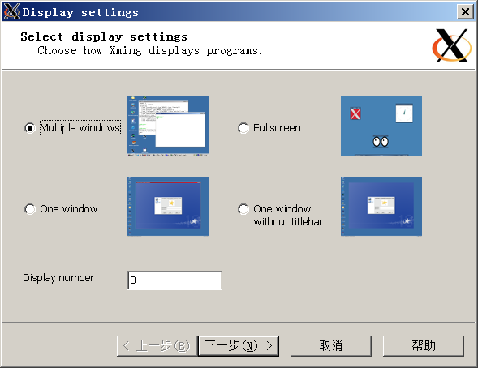
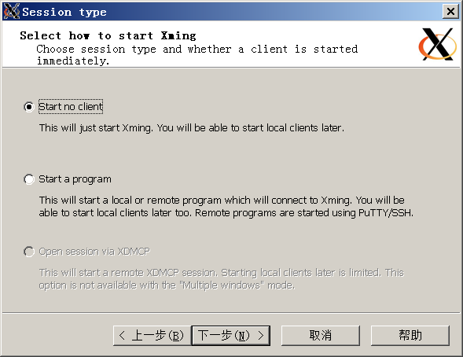
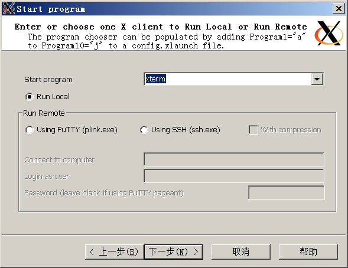
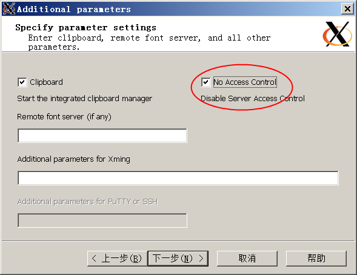
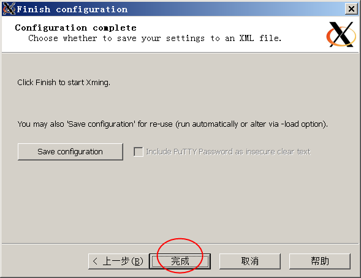
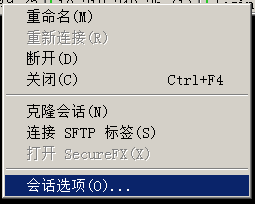
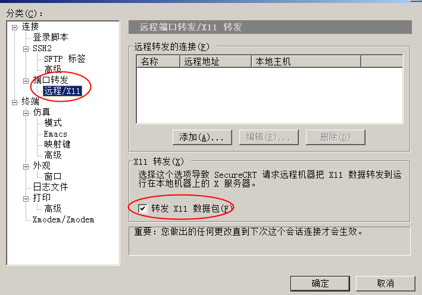
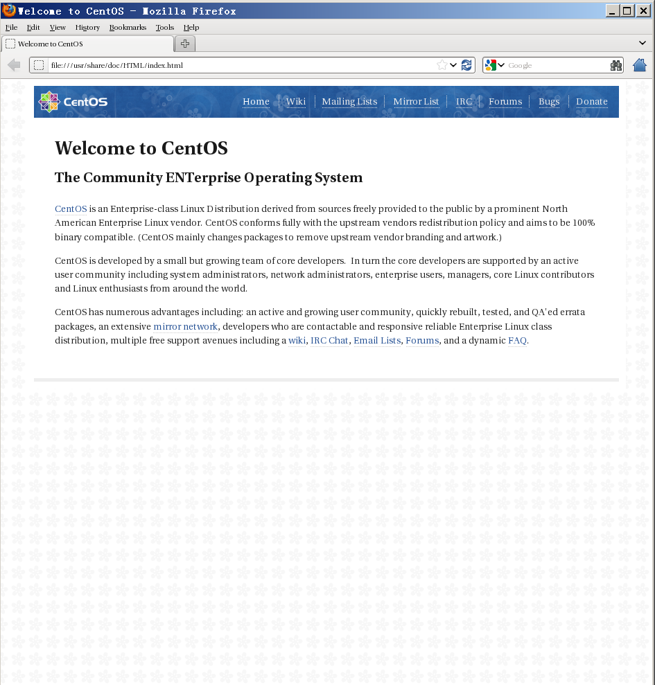

## ssh Forward X11 实现远程主机GUI在本地展示 (C/S X)  
                                                                                                                                           
### 作者                                                                                                                                           
digoal                                                                                                                                           
                                                                                                                                           
### 日期                                                                                                                                           
2016-05-27                                                                                                                                       
                                                                                                                                           
### 标签                                                                                                                                           
PostgreSQL , Linux , x11 , 可视化             
                                                                                                                                           
----                                                                                                                                           
                                                                                                                                           
## 背景                               
有些时候，有些程序可能需要依赖图形界面才能启动，例如安装Oracle时（其实oracle支持命令行安装），例如需要启动一个图形界面的浏览器如firefox。    
  
作为服务端的系统，通常不会安装臃肿的图形界面。    
  
那么如何在不安装图形界面的的情况下启动图形界面的？听起来很矛盾，但是实际上是可行的。     
  
  
X Window System（常被简称为X11或X），是一套基于X display protocol的windowing system，X GUI环境的功能包括窗口的绘制、移动，以及与鼠标、键盘等输入设备的交互。    
  
X采用C/S模型（这是关键）：一个X server 和多个应用程序（client）通信。server接收client的请求绘制窗口，并将来自鼠标、键盘等设备的输入传递给client。    
  
因此 X server和client可以位于同一计算机上，例如在Linux主机上使用KDE等桌面环境就是这种模式。X server也可以通过同构网络、异构网络或Internet与client通信。    
  
X server与client之间的通信是不加密的，这个问题可以通过SSH解决。SSH是Secure Shell的简称，SSH可以看作是通信被加密压缩版的telnet。    
  
需要用到SSH的forwarding功能，当X server与client所在计算机都支持SSH协议时，X server与client之间不安全的TCP/IP连接可以转送到（forwarding）二者之间建立的SSH连接上。    
  
了解原理后，我们就可以在本地自建X服务，然后服务器作为X client，把绘图的请求发给本地的X server。  这样就实现了本地显示图像的目的。    
  
  
  
例子， 以本地为Windows为例，使用ssh连接到服务器， 把服务器的X请求转发到本地的 X server。    
  
简单的几个步骤即可    
1\. 配置服务器的sshd，重启服务    
  
```  
# vi /etc/ssh/sshd_config  
X11Forwarding yes  
X11DisplayOffset 10  
X11UseLocalhost yes  
  
# service sshd restart  
```  
  
2\. 在windows主机安装Xming, 启动X server    
  
windows下的X server可以通过Xming软件来构建。    
  
https://sourceforge.net/projects/xming/  
  
  
  
  
  
  
  
  
  
  
  
3\. 在windows主机安装securecrt或putty    
  
4\. 在windows主机配置securecrt或者putty，配置对应会话的转发X11，并重新连接会话    
  
  
  
  
  
5\. 在securecrt或putty命令行启动GUI命令    
  
```  
开启securecrt FORWARDX11后，会自动设置DISPLAY环境变量.    
#echo $DISPLAY  
localhost:10.0  
  
# firefox    
```  
  
  
  
## 参考    
https://sourceforge.net/projects/xming/  
  
http://www.cnblogs.com/qcly/p/3219902.html  
  
  
  
  
  
  
  
  
  
  
  
  
  
  
  
  
  
  
  
  
  
  
  
  
  
  
  
  
  
  
  
  
  
  
  
  
  
  
  
  
  
  
  
  
  
  
#### [9.9元购买3个月阿里云RDS PostgreSQL实例](https://www.aliyun.com/database/postgresqlactivity "57258f76c37864c6e6d23383d05714ea")
  
  
#### [PostgreSQL 解决方案集合](https://yq.aliyun.com/topic/118 "40cff096e9ed7122c512b35d8561d9c8")
- [1 任意维度实时圈人](https://yq.aliyun.com/topic/118 "40cff096e9ed7122c512b35d8561d9c8")
- [2 时序数据实时处理](https://yq.aliyun.com/topic/118 "40cff096e9ed7122c512b35d8561d9c8")
- [3 时间、空间、业务 多维数据实时透视](https://yq.aliyun.com/topic/118 "40cff096e9ed7122c512b35d8561d9c8")
- [4 独立事件相关性分析](https://yq.aliyun.com/topic/118 "40cff096e9ed7122c512b35d8561d9c8")
- [5 海量关系实时图式搜索](https://yq.aliyun.com/topic/118 "40cff096e9ed7122c512b35d8561d9c8")
- [6 社交业务案例](https://yq.aliyun.com/topic/118 "40cff096e9ed7122c512b35d8561d9c8")
- [7 流式数据实时处理案例](https://yq.aliyun.com/topic/118 "40cff096e9ed7122c512b35d8561d9c8")
- [8 IoT 物联网, 时序](https://yq.aliyun.com/topic/118 "40cff096e9ed7122c512b35d8561d9c8")
- [9 全文检索](https://yq.aliyun.com/topic/118 "40cff096e9ed7122c512b35d8561d9c8")
- [10 模糊、正则 查询案例](https://yq.aliyun.com/topic/118 "40cff096e9ed7122c512b35d8561d9c8")
- [11 图像识别](https://yq.aliyun.com/topic/118 "40cff096e9ed7122c512b35d8561d9c8")
- [12 向量相似检索](https://yq.aliyun.com/topic/118 "40cff096e9ed7122c512b35d8561d9c8")
- [13 数据清洗、采样、脱敏、批处理、合并](https://yq.aliyun.com/topic/118 "40cff096e9ed7122c512b35d8561d9c8")
- [14 GIS 地理信息空间数据应用](https://yq.aliyun.com/topic/118 "40cff096e9ed7122c512b35d8561d9c8")
- [15 金融业务](https://yq.aliyun.com/topic/118 "40cff096e9ed7122c512b35d8561d9c8")
- [16 异步消息应用案例](https://yq.aliyun.com/topic/118 "40cff096e9ed7122c512b35d8561d9c8")
- [17 海量数据 冷热分离](https://yq.aliyun.com/topic/118 "40cff096e9ed7122c512b35d8561d9c8")
- [18 倒排索引案例](https://yq.aliyun.com/topic/118 "40cff096e9ed7122c512b35d8561d9c8")
- [19 海量数据OLAP处理应用](https://yq.aliyun.com/topic/118 "40cff096e9ed7122c512b35d8561d9c8")
  
  
#### [德哥 / digoal's 趣味入口 - 努力成为灯塔, 公益是一辈子的事.](https://github.com/digoal/blog/blob/master/README.md "22709685feb7cab07d30f30387f0a9ae")
  
  

  
  
#### [PostgreSQL 解决方案集合](https://yq.aliyun.com/topic/118 "40cff096e9ed7122c512b35d8561d9c8")
- [1 任意维度实时圈人](https://yq.aliyun.com/topic/118 "40cff096e9ed7122c512b35d8561d9c8")
- [2 时序数据实时处理](https://yq.aliyun.com/topic/118 "40cff096e9ed7122c512b35d8561d9c8")
- [3 时间、空间、业务 多维数据实时透视](https://yq.aliyun.com/topic/118 "40cff096e9ed7122c512b35d8561d9c8")
- [4 独立事件相关性分析](https://yq.aliyun.com/topic/118 "40cff096e9ed7122c512b35d8561d9c8")
- [5 海量关系实时图式搜索](https://yq.aliyun.com/topic/118 "40cff096e9ed7122c512b35d8561d9c8")
- [6 社交业务案例](https://yq.aliyun.com/topic/118 "40cff096e9ed7122c512b35d8561d9c8")
- [7 流式数据实时处理案例](https://yq.aliyun.com/topic/118 "40cff096e9ed7122c512b35d8561d9c8")
- [8 IoT 物联网, 时序](https://yq.aliyun.com/topic/118 "40cff096e9ed7122c512b35d8561d9c8")
- [9 全文检索](https://yq.aliyun.com/topic/118 "40cff096e9ed7122c512b35d8561d9c8")
- [10 模糊、正则 查询案例](https://yq.aliyun.com/topic/118 "40cff096e9ed7122c512b35d8561d9c8")
- [11 图像识别](https://yq.aliyun.com/topic/118 "40cff096e9ed7122c512b35d8561d9c8")
- [12 向量相似检索](https://yq.aliyun.com/topic/118 "40cff096e9ed7122c512b35d8561d9c8")
- [13 数据清洗、采样、脱敏、批处理、合并](https://yq.aliyun.com/topic/118 "40cff096e9ed7122c512b35d8561d9c8")
- [14 GIS 地理信息空间数据应用](https://yq.aliyun.com/topic/118 "40cff096e9ed7122c512b35d8561d9c8")
- [15 金融业务](https://yq.aliyun.com/topic/118 "40cff096e9ed7122c512b35d8561d9c8")
- [16 异步消息应用案例](https://yq.aliyun.com/topic/118 "40cff096e9ed7122c512b35d8561d9c8")
- [17 海量数据 冷热分离](https://yq.aliyun.com/topic/118 "40cff096e9ed7122c512b35d8561d9c8")
- [18 倒排索引案例](https://yq.aliyun.com/topic/118 "40cff096e9ed7122c512b35d8561d9c8")
- [19 海量数据OLAP处理应用](https://yq.aliyun.com/topic/118 "40cff096e9ed7122c512b35d8561d9c8")
  
