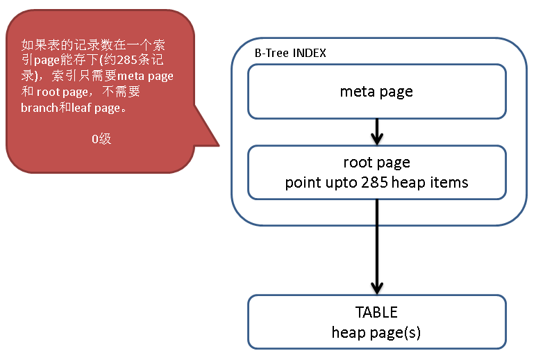
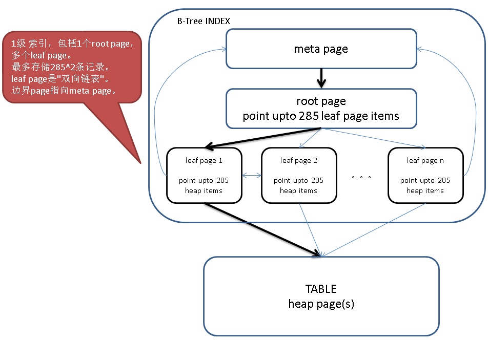
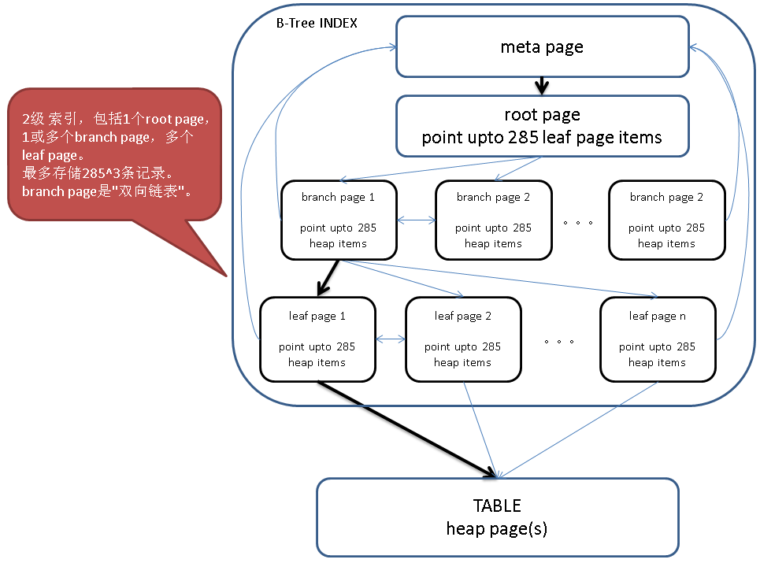
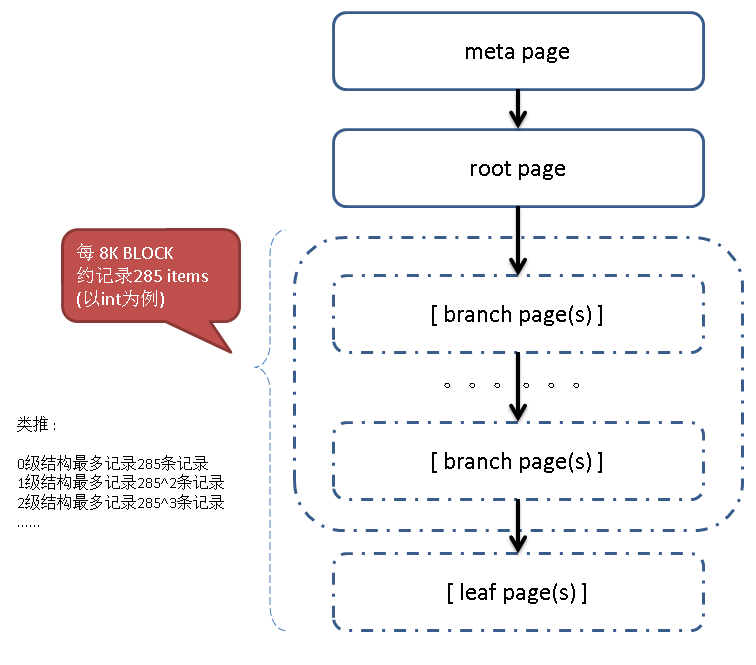
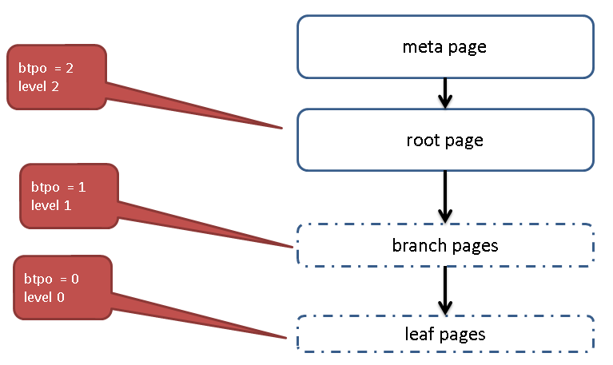

## 深入浅出PostgreSQL B-Tree索引结构     
                                                                                                              
### 作者                                                                                                             
digoal                                                                                                              
                                                                                                              
### 日期                                                                                                            
2016-05-28                      
                                                                                                              
### 标签                                                                                                            
PostgreSQL , b-tree , 索引结构                                            
                                                
----                                                                                                            
                                                    
## 背景        
PostgreSQL B-Tree是一种变种(high-concurrency B-tree management algorithm)，算法详情请参考      
    
src/backend/access/nbtree/README      
    
PostgreSQL 的B-Tree索引页分为几种类别       
    
```    
meta page    
root page         #  btpo_flags=2    
branch page    #  btpo_flags=0    
leaf page         #  btpo_flags=1    
    
如果即是leaf又是root则  btpo_flags=3。      
```    
    
其中meta page和root page是必须有的，meta page需要一个页来存储，表示指向root page的page id。      
    
随着记录数的增加，一个root page可能存不下所有的heap item，就会有leaf page，甚至branch page，甚至多层的branch page。      
    
一共有几层branch 和 leaf，就用btree page元数据的 level 来表示。      
    
    
    
我们可以使用pageinspect插件，内窥B-Tree的结构。      
    
层次可以从bt_page_stats的btpo得到，代表当前index page所处的层级。      
    
注意层级并不是唯一的，例如btpo=3的层级，可能有分几个档。      
    
打个比喻，腾讯的技术岗位级别T3，对应T3这个级别又有几个小的档位。和这里的含义差不多，只是没有区分小档位的值，但是后面我们能看到它的存在。        
    
btpo=0级表示最底层，处于这个层级的index pages存储的items(ctid)是指向heap page的。        
    
类别和层级不挂钩，类别里面又可以有多个层级，但是只有层级=0的index page存储的ctid内容才是指向heap page的;  其他层级index page存储的ctid内容都是指向同层级其他index page(双向链表)，或者指下级的index page。       
    
1\.       
    
0层结构，只有meta和root页。      
    
root页最多可以存储的item数，取决于索引字段数据的长度、以及索引页的大小。      
    
    
    
例子      
    
```    
postgres=# create extension pageinspect;    
    
postgres=# create table tab1(id int primary key, info text);    
CREATE TABLE    
postgres=# insert into tab1 select generate_series(1,100), md5(random()::text);    
INSERT 0 100    
postgres=# vacuum analyze tab1;    
VACUUM    
```    
    
查看meta page，可以看到root page id = 1 。       
    
索引的level = 0，  说明没有branch和leaf page。      
    
```    
postgres=# select * from bt_metap('tab1_pkey');    
 magic  | version | root | level | fastroot | fastlevel     
--------+---------+------+-------+----------+-----------    
 340322 |       2 |    1 |     0 |        1 |         0    
(1 row)    
```    
    
根据root page id = 1查看root page的stats      
    
btpo=0 说明已经到了最底层       
    
btpo_flags=3，说明它既是leaf又是root页。      
    
```    
postgres=# select * from bt_page_stats('tab1_pkey',1);    
 blkno | type | live_items | dead_items | avg_item_size | page_size | free_size | btpo_prev | btpo_next | btpo | btpo_flags     
-------+------+------------+------------+---------------+-----------+-----------+-----------+-----------+------+------------    
     1 | l    |        100 |          0 |            16 |      8192 |      6148 |         0 |         0 |    0 |          3    
(1 row)    
```    
      
btpo_prev和btpo_next分别表示该页的相邻页（branch page是双向链表）。      
    
btpo_flags 可以在代码中查看(src/include/access/nbtree.h)，一共有几个       
    
```    
/* Bits defined in btpo_flags */    
#define BTP_LEAF                (1 << 0)        /* leaf page, i.e. not internal page */    
#define BTP_ROOT                (1 << 1)        /* root page (has no parent) */    
#define BTP_DELETED             (1 << 2)        /* page has been deleted from tree */    
#define BTP_META                (1 << 3)        /* meta-page */    
#define BTP_HALF_DEAD   (1 << 4)        /* empty, but still in tree */    
#define BTP_SPLIT_END   (1 << 5)        /* rightmost page of split group */    
#define BTP_HAS_GARBAGE (1 << 6)        /* page has LP_DEAD tuples */    
#define BTP_INCOMPLETE_SPLIT (1 << 7)   /* right sibling's downlink is missing */    
```    
    
查看0级 page存储的ctid (即items)        
    
0级ctid 表示存储的是 heap页的寻址。  （如果是多层结构，那么branch page中的ctid， 它表示的是同级btree页(链条项ctid)或者下级btree页的寻址）  。        
    
当ctid指向heap时， data是对应的列值。(多级结构的data意义不一样，后面会讲)          
    
```    
postgres=# select * from bt_page_items('tab1_pkey',1);    
 itemoffset |  ctid   | itemlen | nulls | vars |          data               
------------+---------+---------+-------+------+-------------------------    
          1 | (0,1)   |      16 | f     | f    | 01 00 00 00 00 00 00 00    
          2 | (0,2)   |      16 | f     | f    | 02 00 00 00 00 00 00 00    
...    
         99 | (0,99)  |      16 | f     | f    | 63 00 00 00 00 00 00 00    
        100 | (0,100) |      16 | f     | f    | 64 00 00 00 00 00 00 00    
(100 rows)    
```    
    
根据ctid 查看heap记录      
    
```    
postgres=# select * from tab1 where ctid='(0,100)';    
 id  |               info                   
-----+----------------------------------    
 100 | 68b63c269ee8cc2d99fe204f04d0ffcb    
(1 row)    
```    
    
2\.       
    
1层结构，包括meta page, root page, leaf page.      
    
    
    
例子      
    
```    
postgres=# truncate tab1;    
TRUNCATE TABLE    
postgres=# insert into tab1 select generate_series(1,1000), md5(random()::text);    
INSERT 0 1000    
postgres=# vacuum analyze tab1;    
VACUUM    
```    
    
查看meta page，可以看到root page id = 3, 索引的level = 1。      
    
level = 1 表示包含了leaf page。      
    
```    
postgres=# select * from bt_metap('tab1_pkey');    
 magic  | version | root | level | fastroot | fastlevel     
--------+---------+------+-------+----------+-----------    
 340322 |       2 |    3 |     1 |        3 |         1    
(1 row)    
```    
    
根据root page id  查看root page的stats      
    
btpo = 1 说明还没有到最底层（最底层btpo=0, 这种页里面存储的ctid才代表指向heap page的地址）      
    
btpo_flags=2 说明这个页是root page      
    
```    
postgres=# select * from bt_page_stats('tab1_pkey',3);    
 blkno | type | live_items | dead_items | avg_item_size | page_size | free_size | btpo_prev | btpo_next | btpo | btpo_flags     
-------+------+------------+------------+---------------+-----------+-----------+-----------+-----------+------+------------    
     3 | r    |          3 |          0 |            13 |      8192 |      8096 |         0 |         0 |    1 |          2    
(1 row)    
```    
    
查看root page存储的  leaf page items (指向leaf page)        
    
一共3个leaf pages, data存储的是这个leaf page存储的最小值。        
    
```    
postgres=# select * from bt_page_items('tab1_pkey',3);    
 itemoffset | ctid  | itemlen | nulls | vars |          data               
------------+-------+---------+-------+------+-------------------------    
          1 | (1,1) |       8 | f     | f    |     
          2 | (2,1) |      16 | f     | f    | 6f 01 00 00 00 00 00 00    
          3 | (4,1) |      16 | f     | f    | dd 02 00 00 00 00 00 00    
(3 rows)    
```    
    
第一条为空，是因为这个leaf page是最左边的PAGE，不存最小值。      
    
对于有右leaf page的leaf page，第一条存储的heap item为该页的右链路。      
    
第二条才是起始ITEM。      
    
另外需要注意，虽然在item里面只存储右链，leaf page还是双向链表，在stats能看到它的prev 和next page。      
    
根据leaf page id查看stats        
    
最左leaf page = 1      
    
prev btpo 指向meta page     
    
```    
可以看到btpo = 0了，说明这个页是底层页。      
btpo_flags=1 说明是leaf page      
postgres=# select * from bt_page_stats('tab1_pkey',1);    
 blkno | type | live_items | dead_items | avg_item_size | page_size | free_size | btpo_prev | btpo_next | btpo | btpo_flags     
-------+------+------------+------------+---------------+-----------+-----------+-----------+-----------+------+------------    
     1 | l    |        367 |          0 |            16 |      8192 |       808 |         0 |         2 |    0 |          1    
(1 row)    
```    
    
next btpo 指向meta page     
    
最右leaf page = 4      
    
btpo_flags=1 说明是leaf page      
    
```    
postgres=# select * from bt_page_stats('tab1_pkey',4);    
 blkno | type | live_items | dead_items | avg_item_size | page_size | free_size | btpo_prev | btpo_next | btpo | btpo_flags     
-------+------+------------+------------+---------------+-----------+-----------+-----------+-----------+------+------------    
     4 | l    |        268 |          0 |            16 |      8192 |      2788 |         2 |         0 |    0 |          1    
(1 row)    
```    
    
中间leaf page = 2      
    
btpo_flags=1 说明是leaf page      
    
```    
postgres=# select * from bt_page_stats('tab1_pkey',2);    
 blkno | type | live_items | dead_items | avg_item_size | page_size | free_size | btpo_prev | btpo_next | btpo | btpo_flags     
-------+------+------------+------------+---------------+-----------+-----------+-----------+-----------+------+------------    
     2 | l    |        367 |          0 |            16 |      8192 |       808 |         1 |         4 |    0 |          1    
(1 row)    
```    
    
查看leaf page存储的 heap ctid (即heap items)        
    
含右页的例子, index page 1      
    
第一条为右链表的第一条item, 第二条才是起始item        
    
```    
postgres=# select * from bt_page_items('tab1_pkey',1);    
 itemoffset |  ctid   | itemlen | nulls | vars |          data               
------------+---------+---------+-------+------+-------------------------    
          1 | (3,7)   |      16 | f     | f    | 6f 01 00 00 00 00 00 00    
          2 | (0,1)   |      16 | f     | f    | 01 00 00 00 00 00 00 00    
          3 | (0,2)   |      16 | f     | f    | 02 00 00 00 00 00 00 00    
...    
        367 | (3,6)   |      16 | f     | f    | 6e 01 00 00 00 00 00 00    
(367 rows)    
```    
    
不含右页的例子, index page 4      
    
第一条就是起始ctid (即items)      
    
```    
postgres=# select * from bt_page_items('tab1_pkey',4);    
 itemoffset |  ctid   | itemlen | nulls | vars |          data               
------------+---------+---------+-------+------+-------------------------    
          1 | (6,13)  |      16 | f     | f    | dd 02 00 00 00 00 00 00    
          2 | (6,14)  |      16 | f     | f    | de 02 00 00 00 00 00 00    
...    
        268 | (8,40)  |      16 | f     | f    | e8 03 00 00 00 00 00 00    
(268 rows)    
```    
    
根据ctid 查看heap记录      
    
```    
postgres=#              select * from tab1 where ctid='(0,1)';    
 id |               info                   
----+----------------------------------    
  1 | 6ebc6b77aebf5dd11621a2ed846c08c4    
(1 row)    
```    
    
    
3\.       
    
记录数超过1层结构的索引可以存储的记录数时，会分裂为2层结构，除了meta page和root page，还可能包含1层branch page以及1层leaf page。      
    
如果是边界页(branch or leaf)，那么其中一个方向没有PAGE，这个方向的链表信息都统一指向meta page。       
    
    
    
例子      
    
```    
create table tbl1(id int primary key, info text);      
postgres=# select 285^2;    
 ?column?     
----------    
    81225    
(1 row)    
postgres=# insert into tab2 select trunc(random()*10000000), md5(random()::text) from generate_series(1,1000000) on conflict on constraint tab2_pkey do nothing;    
INSERT 0 951379    
postgres=# vacuum analyze tab2;    
VACUUM    
```    
    
查看meta page，可以看到root page id = 412, 索引的level=2，即包括1级 branch 和 1级 leaf。      
    
```    
postgres=# select * from bt_metap('tab2_pkey');    
 magic  | version | root | level | fastroot | fastlevel     
--------+---------+------+-------+----------+-----------    
 340322 |       2 |  412 |     2 |      412 |         2    
(1 row)    
```    
    
根据root page id  查看root page的stats      
    
btpo = 2 当前在第二层，另外还表示下层是1        
    
btpo_flags = 2 说明是root page      
    
```    
postgres=# select * from bt_page_stats('tab2_pkey', 412);    
 blkno | type | live_items | dead_items | avg_item_size | page_size | free_size | btpo_prev | btpo_next | btpo | btpo_flags     
-------+------+------------+------------+---------------+-----------+-----------+-----------+-----------+------+------------    
   412 | r    |         11 |          0 |            15 |      8192 |      7936 |         0 |         0 |    2 |          2    
(1 row)    
```    
    
查看root page存储的  branch page items (指向branch page)      
    
```    
postgres=# select * from bt_page_items('tab2_pkey', 412);    
 itemoffset |   ctid   | itemlen | nulls | vars |          data               
------------+----------+---------+-------+------+-------------------------    
          1 | (3,1)    |       8 | f     | f    |     
          2 | (2577,1) |      16 | f     | f    | e1 78 0b 00 00 00 00 00    
          3 | (1210,1) |      16 | f     | f    | ec 3a 18 00 00 00 00 00    
          4 | (2316,1) |      16 | f     | f    | de 09 25 00 00 00 00 00    
          5 | (574,1)  |      16 | f     | f    | aa e8 33 00 00 00 00 00    
          6 | (2278,1) |      16 | f     | f    | 85 90 40 00 00 00 00 00    
          7 | (1093,1) |      16 | f     | f    | f6 e9 4e 00 00 00 00 00    
          8 | (2112,1) |      16 | f     | f    | a3 60 5c 00 00 00 00 00    
          9 | (411,1)  |      16 | f     | f    | b2 ea 6b 00 00 00 00 00    
         10 | (2073,1) |      16 | f     | f    | db de 79 00 00 00 00 00    
         11 | (1392,1) |      16 | f     | f    | df b0 8a 00 00 00 00 00    
(11 rows)    
```    
    
根据branch page id查看stats      
    
btpo = 1 当前在第一层  ，另外还表示下层是0      
    
btpo_flags = 0 说明是branch page      
    
```    
postgres=# select * from bt_page_stats('tab2_pkey', 3);    
 blkno | type | live_items | dead_items | avg_item_size | page_size | free_size | btpo_prev | btpo_next | btpo | btpo_flags     
-------+------+------------+------------+---------------+-----------+-----------+-----------+-----------+------+------------    
     3 | i    |        254 |          0 |            15 |      8192 |      3076 |         0 |      2577 |    1 |          0    
(1 row)    
```    
    
查看branch page存储的 leaf page ctid (指向leaf page)        
    
只要不是最右边的页，第一条都代表右页的起始item。      
    
第二条才是当前页的起始ctid      
    
注意所有branch page的起始item对应的data都是空的。        
    
也就是说它不存储当前branch page包含的所有leaf pages的索引字段内容的最小值。      
    
```    
postgres=# select * from bt_page_items('tab2_pkey', 3);    
 itemoffset |   ctid   | itemlen | nulls | vars |          data               
------------+----------+---------+-------+------+-------------------------    
          1 | (735,1)  |      16 | f     | f    | e1 78 0b 00 00 00 00 00    
          2 | (1,1)    |       8 | f     | f    |     
          3 | (2581,1) |      16 | f     | f    | a8 09 00 00 00 00 00 00    
          4 | (1202,1) |      16 | f     | f    | f8 13 00 00 00 00 00 00    
...    
        254 | (3322,1) |      16 | f     | f    | ee 6f 0b 00 00 00 00 00    
(254 rows)    
```    
    
根据ctid 查看leaf page        
    
btpo = 0 当前在第0层，即最底层，这里存储的是heap ctid        
    
btpo_flags = 1 说明是leaf page      
    
```    
postgres=# select * from bt_page_stats('tab2_pkey', 1);    
 blkno | type | live_items | dead_items | avg_item_size | page_size | free_size | btpo_prev | btpo_next | btpo | btpo_flags     
-------+------+------------+------------+---------------+-----------+-----------+-----------+-----------+------+------------    
     1 | l    |        242 |          0 |            16 |      8192 |      3308 |         0 |      2581 |    0 |          1    
(1 row)    
    
postgres=# select * from bt_page_items('tab2_pkey', 1);    
 itemoffset |    ctid    | itemlen | nulls | vars |          data               
------------+------------+---------+-------+------+-------------------------    
          1 | (4985,16)  |      16 | f     | f    | a8 09 00 00 00 00 00 00    
          2 | (7305,79)  |      16 | f     | f    | 01 00 00 00 00 00 00 00    
          3 | (2757,120) |      16 | f     | f    | 09 00 00 00 00 00 00 00    
...    
        242 | (1329,101) |      16 | f     | f    | a0 09 00 00 00 00 00 00    
(242 rows)    
```    
    
查看leaf page中包含的heap page items。      
    
如果我们根据索引页结构的原理，能推算出来(7305,79)是最小值，取它就没错了。      
    
```    
postgres=# select * from tab2 where ctid='(7305,79)';    
 id |               info                   
----+----------------------------------    
  1 | 18aaeb74c359355311ac825ae2aeb22a    
(1 row)    
    
postgres=# select min(id) from tab2;    
 min     
-----    
   1    
(1 row)    
```    
    
    
4\.      
    
多层结构，除了meta page，还可能包含多层branch page，以及一层leaf page。      
    
    
    
例子       
    
```    
postgres=# create table tab3(id int primary key, info text);    
CREATE TABLE    
postgres=# insert into tab3 select generate_series(1, 100000000), md5(random()::text);      
```    
    
查看meta page, 注意level，已经是3级了。      
    
```    
meta page    
postgres=# select * from bt_metap('tab3_pkey');    
 magic  | version |  root  | level | fastroot | fastlevel     
--------+---------+--------+-------+----------+-----------    
 340322 |       2 | 116816 |     3 |   116816 |         3    
(1 row)    
```    
    
btpo_flags=2  代表 root page      
    
btpo = 3 代表第3层        
    
```    
postgres=# select * from bt_page_stats('tab3_pkey', 116816);    
 blkno  | type | live_items | dead_items | avg_item_size | page_size | free_size | btpo_prev | btpo_next | btpo | btpo_flags     
--------+------+------------+------------+---------------+-----------+-----------+-----------+-----------+------+------------    
 116816 | r    |          3 |          0 |            13 |      8192 |      8096 |         0 |         0 |    3 |          2    
(1 row)    
    
postgres=# select * from bt_page_items('tab3_pkey', 116816);    
 itemoffset |    ctid    | itemlen | nulls | vars |          data               
------------+------------+---------+-------+------+-------------------------    
          1 | (412,1)    |       8 | f     | f    |     
          2 | (116815,1) |      16 | f     | f    | 5f 9e c5 01 00 00 00 00    
          3 | (198327,1) |      16 | f     | f    | bd 3c 8b 03 00 00 00 00    
(3 rows)    
```    
    
btpo_flags=0  代表 branch page      
    
btpo = 2 代表第2层        
    
```    
postgres=# select * from bt_page_stats('tab3_pkey', 412);    
 blkno | type | live_items | dead_items | avg_item_size | page_size | free_size | btpo_prev | btpo_next | btpo | btpo_flags     
-------+------+------------+------------+---------------+-----------+-----------+-----------+-----------+------+------------    
   412 | i    |        286 |          0 |            15 |      8192 |      2436 |         0 |    116815 |    2 |          0    
(1 row)    
    
postgres=# select * from bt_page_items('tab3_pkey', 412);    
 itemoffset |   ctid    | itemlen | nulls | vars |          data               
------------+-----------+---------+-------+------+-------------------------    
          1 | (81636,1) |      16 | f     | f    | 5f 9e c5 01 00 00 00 00  -- 这是指向当前层级右页的ctid    
          2 | (3,1)     |       8 | f     | f    |    -- 注意第一条初始值是这    
          3 | (411,1)   |      16 | f     | f    | 77 97 01 00 00 00 00 00    
          4 | (698,1)   |      16 | f     | f    | ed 2e 03 00 00 00 00 00    
...    
        286 | (81350,1) |      16 | f     | f    | e9 06 c4 01 00 00 00 00    
(286 rows)    
```    
    
btpo_flags=0  代表 branch page      
    
btpo = 1 代表第1层     
    
```    
postgres=# select * from bt_page_stats('tab3_pkey', 3);    
 blkno | type | live_items | dead_items | avg_item_size | page_size | free_size | btpo_prev | btpo_next | btpo | btpo_flags     
-------+------+------------+------------+---------------+-----------+-----------+-----------+-----------+------+------------    
     3 | i    |        286 |          0 |            15 |      8192 |      2436 |         0 |       411 |    1 |          0    
(1 row)    
    
postgres=# select * from bt_page_items('tab3_pkey', 3);    
 itemoffset |  ctid   | itemlen | nulls | vars |          data               
------------+---------+---------+-------+------+-------------------------    
          1 | (287,1) |      16 | f     | f    | 77 97 01 00 00 00 00 00    
          2 | (1,1)   |       8 | f     | f    |     
          3 | (2,1)   |      16 | f     | f    | 6f 01 00 00 00 00 00 00    
          4 | (4,1)   |      16 | f     | f    | dd 02 00 00 00 00 00 00    
...    
        286 | (286,1) |      16 | f     | f    | 09 96 01 00 00 00 00 00    
(286 rows)    
```    
    
btpo_flags=1  代表 leaf page        
    
btpo = 0     代表第0层        
    
```    
postgres=# select * from bt_page_stats('tab3_pkey', 1);    
 blkno | type | live_items | dead_items | avg_item_size | page_size | free_size | btpo_prev | btpo_next | btpo | btpo_flags     
-------+------+------------+------------+---------------+-----------+-----------+-----------+-----------+------+------------    
     1 | l    |        367 |          0 |            16 |      8192 |       808 |         0 |         2 |    0 |          1    
(1 row)    
    
postgres=# select * from bt_page_items('tab3_pkey', 1);    
 itemoffset |  ctid   | itemlen | nulls | vars |          data               
------------+---------+---------+-------+------+-------------------------    
          1 | (3,7)   |      16 | f     | f    | 6f 01 00 00 00 00 00 00    
          2 | (0,1)   |      16 | f     | f    | 01 00 00 00 00 00 00 00    
          3 | (0,2)   |      16 | f     | f    | 02 00 00 00 00 00 00 00    
...    
        367 | (3,6)   |      16 | f     | f    | 6e 01 00 00 00 00 00 00    
(367 rows)    
```    
    
通过第0层的ctid就可以获取到heap了.      
    
heap tuple例子      
    
```    
postgres=# select * from tab3 where ctid='(0,1)';    
 id |               info                   
----+----------------------------------    
  1 | 370ee1989a2b7f5d8a5b43243596d91f    
(1 row)    
```    
    
    
如何解释explain analyze中的扫描了多少个btree page        
    
实战例子1      
    
```    
postgres=# create table tbl1(id int primary key, info text);    
CREATE TABLE    
postgres=# insert into tbl1 select trunc(random()*10000000), md5(random()::text) from generate_series(1,5000000) on conflict on constraint tbl1_pkey do nothing;    
INSERT 0 3934875    
postgres=# select ctid,* from tbl1 limit 10;    
  ctid  |   id    |               info                   
--------+---------+----------------------------------    
 (0,1)  | 2458061 | 5c91812b54bdcae602321dceaf22e276    
 (0,2)  | 8577271 | fe8e7a8be0d71a94e13b1b5a7786010b    
 (0,3)  | 4612744 | 56983e47f044b5a4655300e1868d2850    
 (0,4)  | 3690167 | 4a5ec8abf67bc018dcc113be829a59da    
 (0,5)  | 2646638 | 7686b47dcb94e56c11d69ec04d6017f3    
 (0,6)  | 6023272 | 4779d9a849c8287490be9d37a27b4637    
 (0,7)  | 7163674 | 35af37f479f48caa65033a5ef56cd75e    
 (0,8)  | 4049257 | 12fa110d927c88dce0773b546cc600c6    
 (0,9)  | 5815903 | 69ed9770ede59917d15ac2373ca8c797    
 (0,10) | 4068194 | 738595f73670da7ede40aefa8cb3d00c    
(10 rows)    
postgres=# vacuum analyze tbl1;    
VACUUM    
```    
    
首先我们需要了解索引的level，才能正确的判断需要扫描多少个index page才能取出1条记录。      
    
```    
postgres=# select * from bt_metap('tbl1_pkey');    
 magic  | version | root | level | fastroot | fastlevel     
--------+---------+------+-------+----------+-----------    
 340322 |       2 |  412 |     2 |      412 |         2    
(1 row)    
```    
    
level = 2的btree应该长这样      
    
    
    
1\. 以下查询，命中了1条记录，并且走的是index only scan。      
    
读了4个INDEX PAGE, 包括1 meta page, 1 root page, 1 branch page, 1 leaf page.        
    
```    
postgres=#  explain (analyze,verbose,timing,costs,buffers) select id from tbl1 where id = 1;    
                                                         QUERY PLAN                                                             
----------------------------------------------------------------------------------------------------------------------------    
 Index Only Scan using tbl1_pkey on public.tbl1  (cost=0.42..1.44 rows=1 width=4) (actual time=0.019..0.020 rows=1 loops=1)    
   Output: id    
   Index Cond: (tbl1.id = 1)    
   Heap Fetches: 0    
   Buffers: shared hit=4    
 Planning time: 0.072 ms    
 Execution time: 0.072 ms    
(7 rows)    
```    
2\. 以下查询，命中了0条记录，并且走的是index only scan。      
    
读了4个INDEX PAGE, 包括1 meta page, 1 root page, 1 branch page, 1 leaf page.        
    
但是explain只算了3个，没有计算leaf page的那次，算个小BUG吧。      
    
```    
postgres=# explain (analyze,verbose,timing,costs,buffers) select id from tbl1 where id in (3);    
                                                         QUERY PLAN                                                             
----------------------------------------------------------------------------------------------------------------------------    
 Index Only Scan using tbl1_pkey on public.tbl1  (cost=0.43..1.45 rows=1 width=4) (actual time=0.010..0.010 rows=0 loops=1)    
   Output: id    
   Index Cond: (tbl1.id = 3)    
   Heap Fetches: 0    
   Buffers: shared hit=3    
 Planning time: 0.073 ms    
 Execution time: 0.031 ms    
(7 rows)    
```    
    
3\. 以下查询，命中了7条记录，并且走的是index only scan。      
    
读了22个INDEX PAGE,     
    
1 meta page + 7 * (1 root + 1 branch + 1 leaf)    = 22      
    
也就是说，每个value都扫了root,branch,leaf。      
    
```    
postgres=#  explain (analyze,verbose,timing,costs,buffers) select id from tbl1 where id in (1,2,3,4,100,1000,10000);    
                                                         QUERY PLAN                                                              
-----------------------------------------------------------------------------------------------------------------------------    
 Index Only Scan using tbl1_pkey on public.tbl1  (cost=0.42..10.10 rows=7 width=4) (actual time=0.018..0.033 rows=7 loops=1)    
   Output: id    
   Index Cond: (tbl1.id = ANY ('{1,2,3,4,100,1000,10000}'::integer[]))    
   Heap Fetches: 0    
   Buffers: shared hit=22    
 Planning time: 0.083 ms    
 Execution time: 0.056 ms    
(7 rows)    
```    
    
4\. 以下查询，命中了2条记录，并且走的是index only scan。      
    
读了22个INDEX PAGE,      
    
1 meta page + 7 * (1 root + 1 branch + 1 leaf)    = 22      
    
也就是说，每个value都扫了root,branch,leaf。      
    
```    
postgres=# explain (analyze,verbose,timing,costs,buffers) select id from tbl1 where id in (1,2,3,4,5,6,7);    
                                                         QUERY PLAN                                                              
-----------------------------------------------------------------------------------------------------------------------------    
 Index Only Scan using tbl1_pkey on public.tbl1  (cost=0.43..10.13 rows=7 width=4) (actual time=0.039..0.046 rows=2 loops=1)    
   Output: id    
   Index Cond: (tbl1.id = ANY ('{1,2,3,4,5,6,7}'::integer[]))    
   Heap Fetches: 0    
   Buffers: shared hit=22    
 Planning time: 0.232 ms    
 Execution time: 0.086 ms    
(7 rows)    
```    
    
5\. 以下查询结果和以上查询一样，也命中了3条记录，并且走的是index only scan。      
    
但是只读了4个INDEX PAGE,     
    
1 meta page + 1 root + 1 branch + 1 leaf      
    
```    
postgres=# explain (analyze,verbose,timing,costs,buffers) select id from tbl1 where id>0 and id <=7;    
                                                         QUERY PLAN                                                             
----------------------------------------------------------------------------------------------------------------------------    
 Index Only Scan using tbl1_pkey on public.tbl1  (cost=0.43..1.49 rows=3 width=4) (actual time=0.008..0.009 rows=2 loops=1)    
   Output: id    
   Index Cond: ((tbl1.id > 0) AND (tbl1.id <= 7))    
   Heap Fetches: 0    
   Buffers: shared hit=4    
 Planning time: 0.127 ms    
 Execution time: 0.028 ms    
(7 rows)    
```    
    
对于第四个查询，扫描了22个块，这个查询，优化器有优化的空间，比如找到1和7作为边界值，在查询到第一个值时，就可以取到leaf page的下一个page的最小值，从而得到1,2,3,4,5,6,7的值在当前page就可以完全取到，不需要去重复扫描。      
                       
                                              
                                                      
                  
  
<a rel="nofollow" href="http://info.flagcounter.com/h9V1"  ></a>  
  
  
  
  
  
  
## [digoal's 大量PostgreSQL文章入口](https://github.com/digoal/blog/blob/master/README.md "22709685feb7cab07d30f30387f0a9ae")
  
