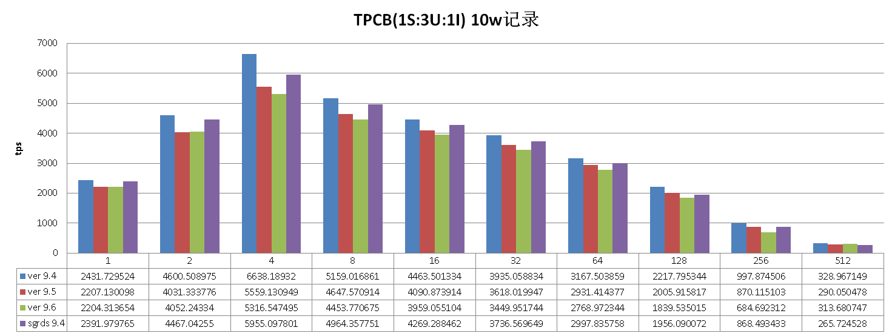
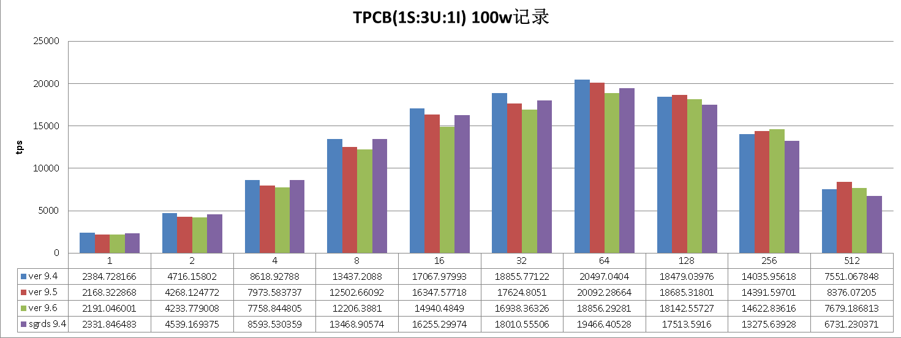
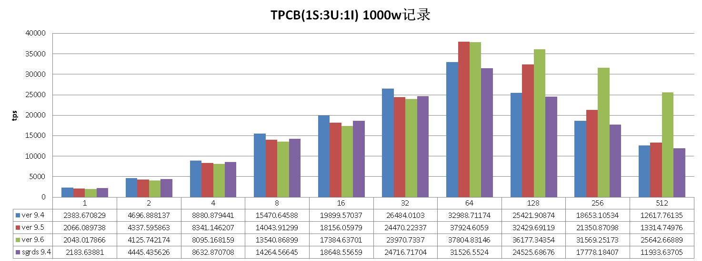
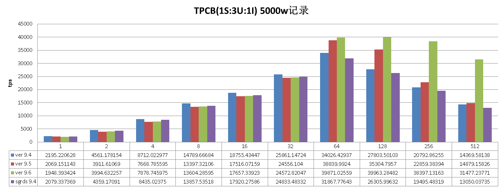
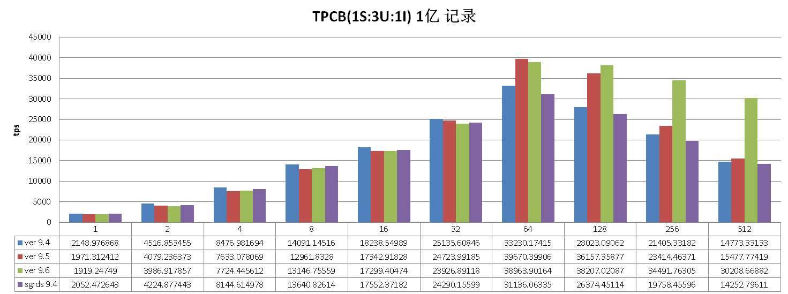
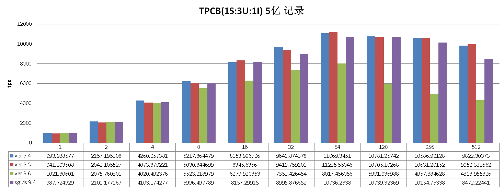

## PostgreSQL on ECS 横向版本TPCB性能测试  
                                                                                                                                                                                                       
### 作者                                                                                                                                                                                                       
digoal                                                                                                                                                                                                       
                                                                                                                                                                                                       
### 日期                                                                                                                                                                                                       
2016-06-04                                                                                                                                                                                                
                                                                                                                                                                                                       
### 标签                                                                                                                                                                                                       
PostgreSQL , tpc-b , 测试 , ecs         
                                                                                                                                                                                                       
----                                                                                                                                                                                                       
                                                                                                                                                                                                       
## 背景                                                                                           
本文对比的是PostgreSQL 9.4, 9.5, 9.6, 以及某基于9.4的国产数据库在ECS上的性能。    
  
硬件环境和搭配    
  
```  
Intel(R) Xeon(R) CPU E5-2680 v3 @ 2.50GHz  
32核  
128G 内存  
500G 高效本地SSD  ,  15000 IOPS  ,  $PGDATA  
700G * 2 高效SSD云盘  ,  20000 IOPS  ,  tbs1, tbs2  
```  
  
测试模型            TPCB      
  
分别测试的数据量    10万乘以  1 10 100 500 1000 5000 10000    
  
分别测试的并发数              1 2 4 8 16 32 64 128 256 512    
  
  
环境部署    
  
```  
parted /dev/vdc  
(parted) mklabel gpt  
(parted) mkpart primary 1M 2049M  
(parted) mkpart primary 2049M 710G  
(parted) select /dev/vdb  
Using /dev/vdb  
(parted) rm 1           
(parted) mkpart primary 1M 2049M   
(parted) mkpart primary 2049M 710G  
q  
  
partx -a /dev/vdc  
kpartx -a /dev/vdc  
partprobe  /dev/vdc  
partx -a /dev/vdb  
kpartx -a /dev/vdb  
partprobe  /dev/vdb  
  
dmsetup remove vdc1  
dmsetup remove vdc2  
  
dmsetup remove vdb1  
dmsetup remove vdb2  
  
mkfs.xfs -f -b size=4096 -l logdev=/dev/vdc1,size=2047868928,sunit=16 -d agsize=134217728 /dev/vdc2  
mkfs.xfs -f -b size=4096 -l logdev=/dev/vdb1,size=2047868928,sunit=16 -d agsize=134217728 /dev/vdb2  
  
vi /etc/fstab  
/dev/vdc2 /data02 xfs defaults,allocsize=16M,inode64,nobarrier,nolargeio,logbsize=262144,noatime,nodiratime,swalloc,logdev=/dev/vdc1 0 0  
/dev/vdb2 /data01 xfs defaults,allocsize=16M,inode64,nobarrier,nolargeio,logbsize=262144,noatime,nodiratime,swalloc,logdev=/dev/vdb1 0 0  
  
  
mkdir /data01  
mkdir /data02  
mkdir /data03  
  
mount -a  
  
mkdir -p /data01/pgdata  
mkdir -p /data02/pgdata  
mkdir -p /data03/pgdata  
chown -R digoal:digoal /data*/*  
  
还需要调整一些内核参数，LIMITS，本文略 .     
```  
  
表空间目录    
  
```  
mkdir /data01/pgdata/9.4_tbs  
mkdir /data02/pgdata/9.4_tbs  
mkdir /data01/pgdata/9.5_tbs  
mkdir /data02/pgdata/9.5_tbs  
mkdir /data01/pgdata/9.6_tbs  
mkdir /data02/pgdata/9.6_tbs  
mkdir /data01/pgdata/sgrds_tbs  
mkdir /data02/pgdata/sgrds_tbs  
chown -R digoal:digoal /data*/*  
```  
  
配置环境变量    
  
```  
# vi env.sh    
  
  
#!/bin/bash   
  
if [ $# -ne 2 ]; then  
  echo "$0 ver port"  
else  
  
export PS1="$USER@`/bin/hostname -s`-> "  
export PGPORT=$2  
export PGDATA=/data03/pgdata/pg_root$1  
export LANG=en_US.utf8  
export PGHOME=/home/digoal/pgsql$1  
export LD_LIBRARY_PATH=$PGHOME/lib:/lib64:/usr/lib64:/usr/local/lib64:/lib:/usr/lib:/usr/local/lib:$LD_LIBRARY_PATH  
export DATE=`date +"%Y%m%d%H%M"`  
export PATH=$PGHOME/bin:$PATH:.  
export MANPATH=$PGHOME/share/man:$MANPATH  
export PGHOST=$PGDATA  
export PGUSER=postgres  
export PGDATABASE=postgres  
alias rm='rm -i'  
alias ll='ls -lh'  
unalias vi  
  
fi  
```  
  
初始化数据库集群    
  
```  
. ./env.sh 9.4 1920  
initdb -D $PGDATA -E UTF8 --locale=C -U postgres  
  
. ./env.sh 9.5 1921  
initdb -D $PGDATA -E UTF8 --locale=C -U postgres  
  
. ./env.sh 9.6 1922  
initdb -D $PGDATA -E UTF8 --locale=C -U postgres  
  
. ./env.sh sgrds 1923  
initdb -D $PGDATA -E UTF8 --locale=C -U postgres  
```  
  
  
启动数据库   
  
```  
. ./env.sh 9.4 1920  
pg_ctl stop -m fast  
. ./env.sh 9.5 1921  
pg_ctl stop -m fast  
. ./env.sh 9.6 1922  
pg_ctl stop -m fast  
. ./env.sh sgrds 1923  
pg_ctl stop -m fast  
  
  
. ./env.sh 9.4 1920  
nohup postgres -B 16GB \  
-c port=$PGPORT \  
-c max_connections=700 \  
-c unix_socket_directories='.' \  
-c listen_addresses='0.0.0.0' \  
-c vacuum_cost_delay=0 \  
-c vacuum_cost_limit=10000 \  
-c bgwriter_delay=10ms \  
-c bgwriter_lru_maxpages=1000 \  
-c bgwriter_lru_multiplier=10.0 \  
-c synchronous_commit=off \  
-c full_page_writes=off \  
-c wal_buffers=1900MB \  
-c wal_writer_delay=10ms \  
-c checkpoint_timeout=35min \  
-c checkpoint_segments=1024 \  
-c checkpoint_completion_target=0.9 \  
-c random_page_cost=1.1 \  
-c effective_cache_size=64GB \  
-c log_destination='csvlog' \  
-c logging_collector=on \  
-c log_truncate_on_rotation=on \  
-D $PGDATA \  
>/dev/null 2>&1 &  
sleep 2  
psql -c "create tablespace tbs1 location '/data01/pgdata/$PGPORT_tbs';"  
psql -c "create tablespace tbs2 location '/data02/pgdata/$PGPORT_tbs';"  
  
  
  
. ./env.sh 9.5 1921  
nohup postgres -B 16GB \  
-c port=$PGPORT \  
-c max_connections=700 \  
-c unix_socket_directories='.' \  
-c listen_addresses='0.0.0.0' \  
-c vacuum_cost_delay=0 \  
-c vacuum_cost_limit=10000 \  
-c bgwriter_delay=10ms \  
-c bgwriter_lru_maxpages=1000 \  
-c bgwriter_lru_multiplier=10.0 \  
-c synchronous_commit=off \  
-c full_page_writes=off \  
-c wal_buffers=1900MB \  
-c wal_writer_delay=10ms \  
-c checkpoint_timeout=35min \  
-c max_wal_size=16GB \  
-c checkpoint_completion_target=0.9 \  
-c random_page_cost=1.1 \  
-c effective_cache_size=64GB \  
-c log_destination='csvlog' \  
-c logging_collector=on \  
-c log_truncate_on_rotation=on \  
-D $PGDATA \  
>/dev/null 2>&1 &  
sleep 2  
psql -c "create tablespace tbs1 location '/data01/pgdata/$PGPORT_tbs';"  
psql -c "create tablespace tbs2 location '/data02/pgdata/$PGPORT_tbs';"  
  
  
. ./env.sh 9.6 1922  
nohup postgres -B 16GB \  
-p $PGPORT \  
-N 700 \  
-c unix_socket_directories='.' \  
-c listen_addresses='0.0.0.0' \  
-c vacuum_cost_delay=0 \  
-c vacuum_cost_limit=10000 \  
-c bgwriter_delay=10ms \  
-c bgwriter_lru_maxpages=1000 \  
-c bgwriter_lru_multiplier=10.0 \  
-c synchronous_commit=off \  
-c wal_writer_flush_after=0 \  
-c full_page_writes=off \  
-c wal_buffers=1900MB \  
-c wal_writer_delay=10ms \  
-c checkpoint_timeout=35min \  
-c max_wal_size=16GB \  
-c checkpoint_completion_target=0.9 \  
-c random_page_cost=1.1 \  
-c effective_cache_size=64GB \  
-c log_destination='csvlog' \  
-c logging_collector=on \  
-c log_truncate_on_rotation=on \  
-D $PGDATA \  
>/dev/null 2>&1 &  
sleep 2  
psql -c "create tablespace tbs1 location '/data01/pgdata/$PGPORT_tbs';"  
psql -c "create tablespace tbs2 location '/data02/pgdata/$PGPORT_tbs';"  
  
  
. ./env.sh sgrds 1923  
nohup postgres -B 16GB \  
-c port=$PGPORT \  
-c max_connections=700 \  
-c unix_socket_directories='.' \  
-c listen_addresses='0.0.0.0' \  
-c vacuum_cost_delay=0 \  
-c vacuum_cost_limit=10000 \  
-c bgwriter_delay=10ms \  
-c bgwriter_lru_maxpages=1000 \  
-c bgwriter_lru_multiplier=10.0 \  
-c synchronous_commit=off \  
-c full_page_writes=off \  
-c wal_buffers=1900MB \  
-c wal_writer_delay=10ms \  
-c checkpoint_timeout=35min \  
-c checkpoint_segments=1024 \  
-c checkpoint_completion_target=0.9 \  
-c random_page_cost=1.1 \  
-c effective_cache_size=64GB \  
-c log_destination='csvlog' \  
-c logging_collector=on \  
-c log_truncate_on_rotation=on \  
-D $PGDATA \  
>/dev/null 2>&1 &  
sleep 2  
psql -c "create tablespace tbs1 location '/data01/pgdata/$PGPORT_tbs';"  
psql -c "create tablespace tbs2 location '/data02/pgdata/$PGPORT_tbs';"  
```  
  
  
测试脚本    
  
```  
# vi test.sh  
#!/bin/bash  
  
for s in 1 10 100 500 1000 5000 10000  
do  
  
################  
. ~/env.sh 9.4 1920  
pgbench -i -s $s --tablespace=tbs1 --index-tablespace=tbs2 --unlogged-tables  
  
for i in 1 2 4 8 16 32 64 128 256 512  
do  
if [ $i -ge 16 ]; then  
  j=16  
else  
  j=i  
fi  
pgbench -M prepared -n -r -c $i -j $i -T 120 > ./9.4.s_$s.i_$i.log 2>&1  
done  
pgbench -i -s 1  
#################  
  
################  
. ~/env.sh 9.5 1921  
pgbench -i -s $s --tablespace=tbs1 --index-tablespace=tbs2 --unlogged-tables  
  
for i in 1 2 4 8 16 32 64 128 256 512  
do  
if [ $i -ge 16 ]; then  
  j=16  
else  
  j=i  
fi  
pgbench -M prepared -n -r -c $i -j $i -T 120 > ./9.5.s_$s.i_$i.log 2>&1  
done  
pgbench -i -s 1  
#################  
  
################  
. ~/env.sh 9.6 1922  
pgbench -i -s $s --tablespace=tbs1 --index-tablespace=tbs2 --unlogged-tables  
  
for i in 1 2 4 8 16 32 64 128 256 512  
do  
if [ $i -ge 16 ]; then  
  j=16  
else  
  j=i  
fi  
pgbench -M prepared -n -r -c $i -j $i -T 120 > ./9.6.s_$s.i_$i.log 2>&1  
done  
pgbench -i -s 1  
#################  
  
################  
. ~/env.sh sgrds 1923  
pgbench -i -s $s --tablespace=tbs1 --index-tablespace=tbs2 --unlogged-tables  
  
for i in 1 2 4 8 16 32 64 128 256 512  
do  
if [ $i -ge 16 ]; then  
  j=16  
else  
  j=i  
fi  
pgbench -M prepared -n -r -c $i -j $i -T 120 > ./sgrds.s_$s.i_$i.log 2>&1  
done  
pgbench -i -s 1  
#################  
  
done  
```  
  
  
测试    
  
```  
chmod 500 test.sh  
nohup ./test.sh >/dev/null 2>&1 &  
```  
  
测试结果    
  
```  
# vi result.sh  
  
for s in 1 10 100 500 1000 5000 10000   
do  
  
echo "9.4 s $s"  
for i in 1 2 4 8 16 32 64 128 256 512  
do   
cat 9.4.s_$s.i_$i.log | grep including | awk '{print $3}'  
done  
  
echo "9.5 s $s"  
for i in 1 2 4 8 16 32 64 128 256 512  
do   
cat 9.5.s_$s.i_$i.log | grep including | awk '{print $3}'  
done  
  
echo "9.6 s $s"  
for i in 1 2 4 8 16 32 64 128 256 512  
do   
cat 9.6.s_$s.i_$i.log | grep including | awk '{print $3}'  
done  
  
echo "sgrds s $s"  
for i in 1 2 4 8 16 32 64 128 256 512  
do   
cat sgrds.s_$s.i_$i.log | grep including | awk '{print $3}'  
done  
  
done  
  
  
. ./result.sh  
```  
  
瓶颈分析请结合压测过程中的主机资源开销(io,cpu,调用,内存,网络等)和PROFILE来判断。      
  
数据量小的时候，高并发的情况下行级锁等待较多，因为数据量少，高并发的UPDATE的原因。    
  
  
  
  
  
  
  
  
  
  
  
  
    
  
<a rel="nofollow" href="http://info.flagcounter.com/h9V1"  ></a>  
  
  
  
  
  
  
## [digoal's 大量PostgreSQL文章入口](https://github.com/digoal/blog/blob/master/README.md "22709685feb7cab07d30f30387f0a9ae")
  
