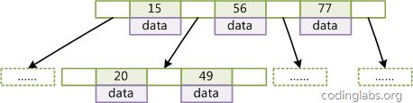
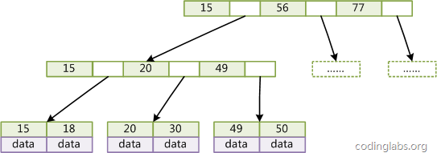
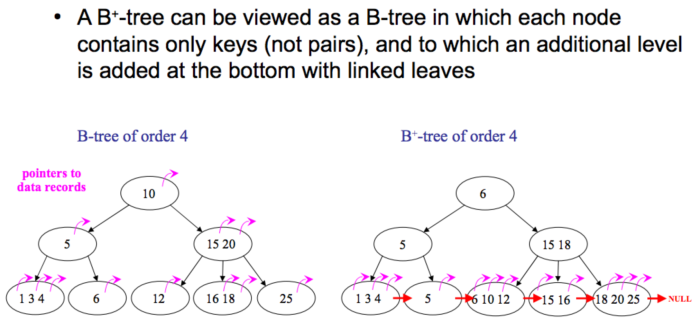
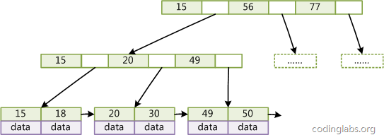

## B-Tree和B+Tree       
                                                                                                                                  
### 作者                                                                                                                                 
digoal                                                                                                                                  
                                                                                                                                  
### 日期                                                                                                                                
2016-06-10                                          
                                                                                                                                  
### 标签                                                                                                                                
PostgreSQL , b-tree , b+tree                                                                                                            
                                                                    
----                                                                                                                                
                                                                        
## 背景                    
本文介绍一下索引结构b-tree, b+tree.    
    
部分内容转载自互联网    
  
https://en.wikipedia.org/wiki/B-tree    
  
https://en.wikipedia.org/wiki/B%2B_tree    
  
## B-Tree    
为了描述B-Tree，首先定义一条数据记录为一个二元组[key, data]，key为记录的键值，对于不同数据记录，key是互不相同的；data为数据记录除key外的数据。那么B-Tree是满足下列条件的数据结构：    
  
1\. d为大于1的一个正整数，称为B-Tree的度。    
  
2\. h为一个正整数，称为B-Tree的高度或深度。    
  
3\. 每个非叶子节点由n-1个key和n个指针组成，其中d<=n<=2d。    
  
4\. 每个叶子节点最少包含一个key和两个指针，最多包含2d-1个key和2d个指针，叶节点的指针均为null(因叶子节点是最底层的节点，不需要再指向其他节点) 。    
  
5\. 所有叶节点具有相同的深度，等于树高h。    
  
6\. key和指针互相间隔，节点两端是指针，所以节点中指针比key多一个。    
  
7\. 一个节点中的key从左到右非递减(即升序)排列。    
  
8\. 所有节点组成树结构。    
  
9\. 每个指针要么为null，要么指向另外一个节点。    
  
10\. 如果某个指针在节点node最左边且不为null，则其指向节点的所有key小于v(key1)，其中v(key1)为node的第一个key的值。    
  
11\. 如果某个指针在节点node最右边且不为null，则其指向节点的所有key大于v(keym)，其中v(keym)为node的最后一个key的值。    
  
12\. 如果某个指针在节点node的左右相邻key分别是keyi和keyi+1且不为null，则其指向节点的所有key小于v(keyi+1)且大于v(keyi)。    
  
图2 是一个d=2的B-Tree示意图。    
  
  
  
由于B-Tree的特性，在B-Tree中按key检索数据的算法非常直观：    
  
首先从根节点进行二分查找，如果找到则返回对应节点的data，否则对相应区间的指针指向的节点递归进行查找，直到找到节点或找到null指针，前者查找成功，后者查找失败。    
  
B-Tree上查找算法的伪代码如下：      
  
```  
BTree_Search(node, key) {  
if(node == null) return null;  
foreach(node.key)  
{  
    if(node.key[i] == key) return node.data[i];  
        if(node.key[i] > key) return BTree_Search(point[i]->node);  
}  
return BTree_Search(point[i+1]->node);  
}  
data = BTree_Search(root, my_key);  
```  
  
关于B-Tree有一系列有趣的性质，例如一个度为d的B-Tree，设其索引N个key，则其树高h的上限为logd((N+1)/2)，检索一个key，其查找节点个数的渐进复杂度为O(logdN)。    
  
从这点可以看出，B-Tree是一个非常有效率的索引数据结构。      
  
另外，由于插入删除新的数据记录会破坏B-Tree的性质，因此在插入删除时，需要对树进行一个分裂、合并、转移等操作以保持B-Tree性质。    
  
## B+Tree  
B-Tree有许多变种，其中最常见的是B+Tree，例如MySQL就普遍使用B+Tree实现其索引结构。  
  
与B-Tree相比，B+Tree有以下不同点：      
  
1\. 每个节点的指针上限为2d而不是2d+1。(上下矛盾?)      
  
2\. 内节点不存储data，只存储key；叶子节点不存储指针。    
  
图3 是一个简单的B+Tree示意。    
  
  
  
由于并不是所有节点都具有相同的域，因此B+Tree中叶节点和内节点一般大小不同。    
  
这点与B-Tree不同，虽然B-Tree中不同节点存放的key和指针可能数量不一致，但是每个节点的域和上限是一致的，所以在实现中B-Tree往往对每个节点申请同等大小的空间。    
  
  
  
本质差别是B-Tree的每个NODE都记录了data，所以不是每次都要搜叶子节点才能拿到DATA。    
  
B+Tree，只有叶子节点有DATA，因此，每次都要搜到叶子节点取DATA。    
  
但是B+Tree在叶子节点上可以加指向下一个叶子节点的指针，所以范围扫描，B+Tree占优，比如排序。    
  
## 带有顺序访问指针的B+Tree  
一般在数据库系统或文件系统中使用的B+Tree结构都在经典B+Tree的基础上进行了优化，增加了顺序访问指针(称为B* tree)。  
  
  
  
如图4 所示，在B+Tree的每个叶子节点增加一个指向相邻叶子节点的指针，就形成了带有顺序访问指针的B+Tree。做这个优化的目的是为了提高区间访问的性能，例如图4中如果要查询key为从18到49的所有数据记录，当找到18后，只需顺着节点和指针顺序遍历就可以一次性访问到所有数据节点，极大提到了区间查询效率。    
    
B+树的分裂：当一个结点满时，分配一个新的结点，并将原结点中1/2的数据复制到新结点，最后在父结点中增加新结点的指针；    
  
B+树的分裂只影响原结点和父结点，而不会影响兄弟结点，所以它不需要指向兄弟的指针。    
    
B*树的分裂：当一个结点满时，如果它的下一个兄弟结点未满，那么将一部分数据移到兄弟结点中，再在原结点插入关键字，最后修改父结点中兄弟结点的关键字（因为兄弟结点的关键字范围改变了）；    
  
如果兄弟也满了，则在原结点与兄弟结点之间增加新结点，并各复制1/3的数据到新结点，最后在父结点增加新结点的指针。      
    
所以，B*树分配新结点的概率比B+树要低，空间使用率更高；      
    
## PostgreSQL B-Tree 索引  
也是一种增强版本，具体算法见      
  
src/backend/access/nbtree/README    
  
主要用了两篇论文中的算法，PostgreSQL的插入性能是非常有保障的.      
  
```  
Lehman and Yao's high-concurrency B-tree management algorithm     
(P. Lehman and S. Yao,Efficient Locking for Concurrent Operations on B-Trees,   
ACM Transactions on Database Systems, Vol 6, No. 4, December 1981, pp 650-670).       
  
a simplified version of the deletion logic described in Lanin and Shasha     
(V. Lanin and D. Shasha, A Symmetric Concurrent B-Tree Algorithm,    
Proceedings of 1986 Fall Joint Computer Conference, pp 380-389).      
```  
    
Lehman & Yao Algorithm算法优化     
  
添加了一个右指针(like B+Tree)，以及一个upper bound value（解决了分裂的并发问题）。    
  
```  
Compared to a classic B-tree, L&Y adds a right-link pointer to each page,  
to the page's right sibling.  It also adds a "high key" to each page, which  
is an upper bound on the keys that are allowed on that page.  These two  
additions make it possible detect a concurrent page split, which allows the  
tree to be searched without holding any read locks (except to keep a single  
page from being modified while reading it).  
  
When a search follows a downlink to a child page, it compares the page's  
high key with the search key.  If the search key is greater than the high  
key, the page must've been split concurrently, and you must follow the  
right-link to find the new page containing the key range you're looking  
for.  This might need to be repeated, if the page has been split more than  
once.  
```  
MySQL的请参考   
  
http://tech.it168.com/a2011/0711/1216/000001216087_all.shtml    
   
        
                                                                    
                                                                            
                                           
  
<a rel="nofollow" href="http://info.flagcounter.com/h9V1"  ></a>  
  
  
  
  
  
  
## [digoal's 大量PostgreSQL文章入口](https://github.com/digoal/blog/blob/master/README.md "22709685feb7cab07d30f30387f0a9ae")
  
