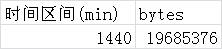
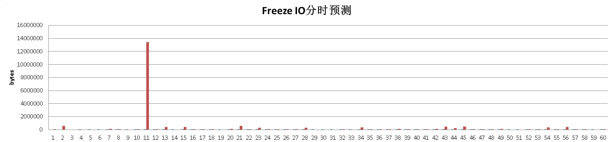

## PostgreSQL的"天气预报" - 如何预测Freeze IO风暴  
            
### 作者                                                         
digoal       
              
### 日期         
2016-06-12        
          
### 标签       
PostgreSQL , freeze , 大表 , 冻结 , io风暴 , 预测       
            
----      
               
## 背景      
还记得我写的这篇文档吗？ 《PostgreSQL 大表自动 freeze 优化思路》    
  
https://yq.aliyun.com/articles/50411  
  
文章主要针对如何优化大表的freeze调度来减少IO风暴的问题，请注意只是减少，不是避免。    
    
作为一名有追求的PGer，要时刻保持警惕，生于忧患、死于安乐；     
  
本文要给大家讲的是预测风暴，掌握了预测能力，才能未雨绸缪，淡定的面对暴风雨。    
  
  
    
### 预测 IO 风暴  
如何预测此类(prevent wrapped vacuum freeze) IO 风暴的来临呢？     
  
首先需要测量几个维度的值。     
  
1\. 表的大小以及距离它需要被强制vacuum freeze prevent wrap的年龄    
    
2\. 每隔一段时间的XID值的采样（例如每分钟一次），采样越多越好，因为需要用于预测下一个时间窗口的XID。（其实就是每分钟消耗多少个事务号的数据）    
    
3\. 通过第二步得到的结果，预测下一个时间窗口的每分钟的pXID（可以使用线性回归来进行预测）  
  
预测方法这里不在细说，也可以参考我以前写的一些预测类的文章。      
    
预测的结论包括 未来一段时间的总Freeze IO量，以及分时的Freeze IO量。    
  
预测结果范例     
  
Freeze IO 时段总量    
  
  
  
Freeze IO 分时走势    
  
  
  
    
### 详细的预测过程    
1\.     
  
每隔一段时间的XID值的采样（例如每分钟一次），采样越多越好，因为需要用于预测下一个时间窗口的XID。（其实就是每分钟消耗多少个事务号的数据）    
  
```  
vi xids.sh  
#!/bin/bash  
export PATH=/home/digoal/pgsql9.5/bin:$PATH  
export PGHOST=127.0.0.1  
export PGPORT=1921  
export PGDATABASE=postgres  
export PGUSER=postgres  
export PGPASSWORD=postgres  
  
psql -c "create table xids(crt_time timestamp, xids int8)"  
for ((i=1;i>0;))  
do  
# 保留1个月的数据  
psql -c "with a as (select ctid from xids order by crt_time desc limit 100 offset 43200) delete from xids where ctid in (select ctid from a);"  
psql -c "insert into xids values (now(), txid_current());"  
sleep 60  
done  
  
chmod 500 xids.sh  
  
nohup ./xids.sh >/dev/null 2>&1 &  
```  
  
采集1天的数据可能是这样的    
  
```  
postgres=# select * from xids ;  
          crt_time          | xids   
----------------------------+------  
 2016-06-12 12:36:13.201315 | 2020  
 2016-06-12 12:37:13.216002 | 9021  
 2016-06-12 12:38:13.240739 | 21022  
 2016-06-12 12:39:13.259203 | 32023  
 2016-06-12 12:40:13.300604 | 42024  
 2016-06-12 12:41:13.325874 | 52025  
 2016-06-12 12:42:13.361152 | 62026  
 2016-06-12 12:43:15.481609 | 72027  
...  
```  
    
2\.     
表的大小以及距离它需要被强制vacuum freeze prevent wrap的年龄        
  
(因为freeze是全集群的，所以需要把所有库得到的数据汇总到一起)       
  
```  
vi pred_io.sh  
  
#!/bin/bash  
export PATH=/home/digoal/pgsql9.5/bin:$PATH  
export PGHOST=127.0.0.1  
export PGPORT=1921  
export PGDATABASE=postgres  
export PGUSER=postgres  
export PGPASSWORD=postgres  
  
psql -c "drop table pred_io; create table pred_io(crt_time timestamp, bytes int8, left_live int8);"  
for db in `psql -A -t -q -c "select datname from pg_database where datname <> 'template0'"`  
do  
psql -d $db -c " copy (  
select now(), bytes, case when max_age>age then max_age-age else 0 end as xids from   
(select block_size*relpages bytes,   
case when d_max_age is not null and d_max_age<max_age then d_max_age else max_age end as max_age,  
age from  
(select   
(select setting from pg_settings where name='block_size')::int8 as block_size,   
(select setting from pg_settings where name='autovacuum_freeze_max_age')::int8 as max_age,   
relpages,   
substring(reloptions::text,'autovacuum_freeze_max_age=(\d+)')::int8 as d_max_age,  
age(relfrozenxid) age  
from pg_class where relkind in ('r', 't')) t) t  
) to stdout;" | psql -d $PGDATABASE -c "copy pred_io from stdin"  
done  
  
. ./pred_io.sh  
```  
  
得到的数据可能是这样的      
  
```  
postgres=# select * from pred_io limit 10;  
          crt_time          | bytes  | left_live   
----------------------------+--------+-----------  
 2016-06-12 13:24:08.666995 | 131072 | 199999672  
 2016-06-12 13:24:08.666995 |  65536 | 199999672  
 2016-06-12 13:24:08.666995 |      0 | 199999672  
 2016-06-12 13:24:08.666995 |      0 | 199999672  
 2016-06-12 13:24:08.666995 |      0 | 199999672  
 2016-06-12 13:24:08.666995 |      0 | 199999672  
...  
```  
    
3\.     
  
预测XIDs走势(略)，本文直接取昨天的同一时间点开始后的数据。      
  
```  
create view v_pred_xids as   
with b as (select min(crt_time) tbase from pred_io),   
       a as (select crt_time + interval '1 day' as crt_time, xids from xids,b where crt_time >= b.tbase - interval '1 day')    
select crt_time, xids - (select min(xids) from a) as xids from a ;       
```  
  
数据可能是这样的，预测未来分时的相对XIDs消耗量      
  
```  
          crt_time          | xids   
----------------------------+------  
 2016-06-13 12:36:13.201315 |    0  
 2016-06-13 12:37:13.216002 |    100  
 2016-06-13 12:38:13.240739 |    200  
 2016-06-13 12:39:13.259203 |    300  
 2016-06-13 12:40:13.300604 |    400  
```  
    
4\.     
  
结合pred_io与v_pred_xids 进行 io风暴预测      
  
基准视图，后面的数据通过这个基准视图得到      
  
```  
create view pred_tbased_io as  
with a as (select crt_time, xids as s_xids, lead(xids) over(order by crt_time) as e_xids from v_pred_xids)  
select a.crt_time, sum(b.bytes) bytes from a, pred_io b where b.left_live >=a.s_xids and b.left_live < a.e_xids group by a.crt_time order by a.crt_time;  
```  
  
未来一天的总freeze io bytes预测    
  
```  
postgres=# select min(crt_time),max(crt_time),sum(bytes) from pred_tbased_io ;  
            min             |            max             |   sum      
----------------------------+----------------------------+----------  
 2016-06-13 12:36:13.201315 | 2016-06-14 12:35:26.104025 | 19685376  
(1 row)  
```  
  
未来一天的freeze io bytes分时走势     
  
得到的结果可能是这样的     
  
```  
postgres=# select * from pred_tbased_io ;  
          crt_time          |  bytes     
----------------------------+----------  
 2016-06-13 12:36:13.201315 |    65536  
 2016-06-13 12:37:13.216002 |   581632  
 2016-06-13 12:38:13.240739 |        0  
 2016-06-13 12:39:13.259203 |        0  
 2016-06-13 12:40:13.300604 |        0  
 2016-06-13 12:41:13.325874 |        0  
 2016-06-13 12:43:15.481609 |   106496  
 2016-06-13 12:43:24.133055 |     8192  
 2016-06-13 12:45:24.193318 |        0  
 2016-06-13 12:46:24.225559 |    16384  
 2016-06-13 12:48:24.296223 | 13434880  
 2016-06-13 12:49:24.325652 |    24576  
 2016-06-13 12:50:24.367232 |   401408  
 2016-06-13 12:51:24.426199 |        0  
 2016-06-13 12:52:24.457375 |   393216  
......  
```  
    
### 小结    
主要用到什么?    
  
1\. 线性回归    
  
2\. with语法    
  
3\. 窗口函数    
  
4\. xid分时消耗统计    
  
5\. 强制prevent wrap freeze vacuum的剩余XIDs统计                                 
  
6\. [《PostgreSQL Freeze 风暴预测续 - 珍藏级SQL》](../201804/20180411_01.md)   
  
<a rel="nofollow" href="http://info.flagcounter.com/h9V1"  ></a>  
  
  
  
  
  
  
## [digoal's 大量PostgreSQL文章入口](https://github.com/digoal/blog/blob/master/README.md "22709685feb7cab07d30f30387f0a9ae")
  
