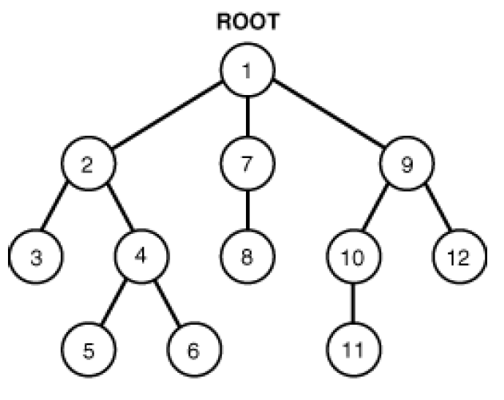
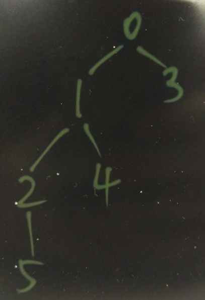
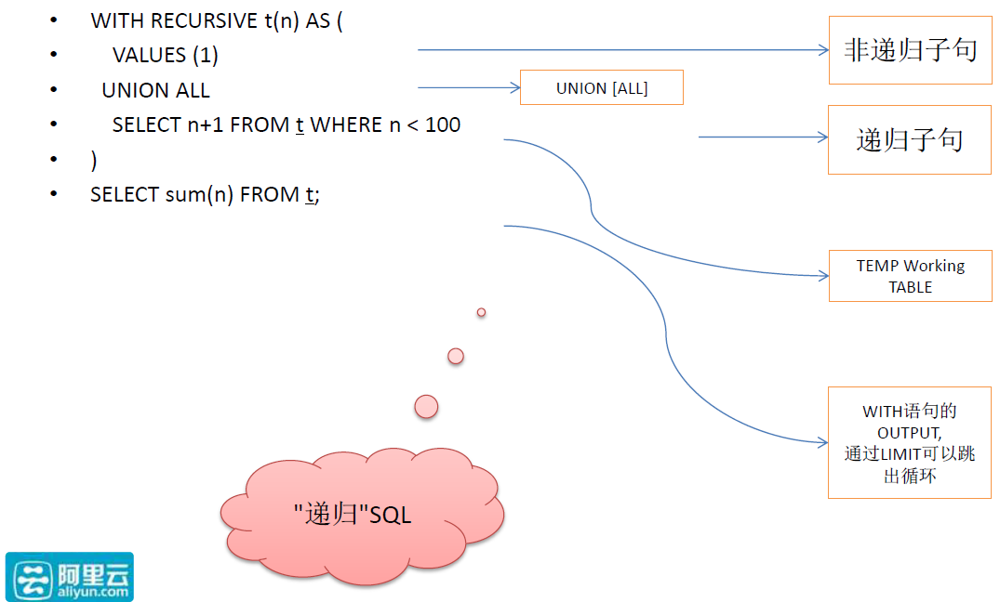
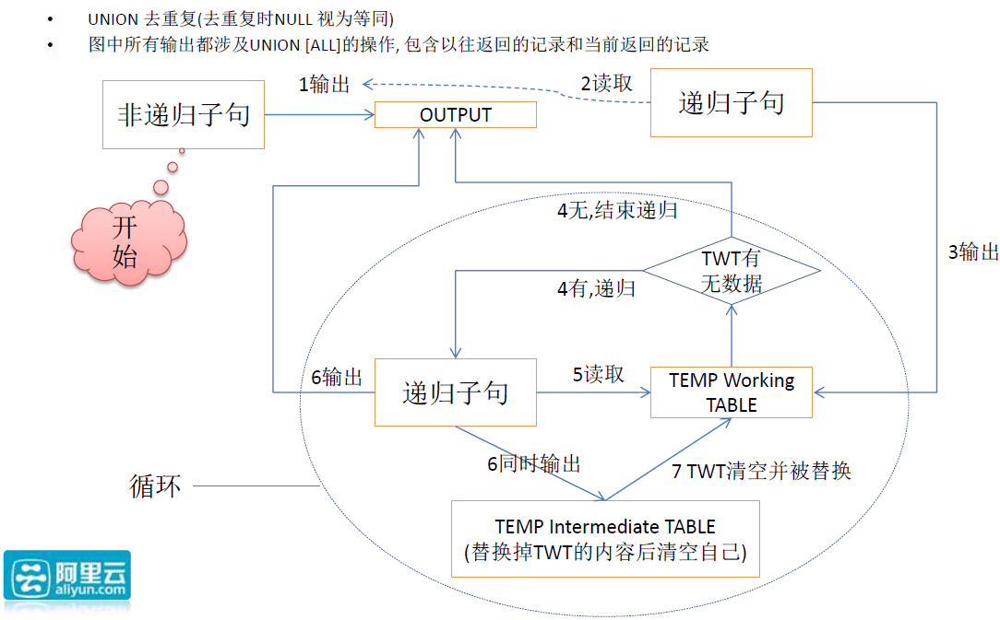

## PostgreSQL Oracle 兼容性之 - connect by  
##### [TAG 21](../class/21.md)
                   
### 作者                   
digoal                    
                      
### 日期                    
2016-06-14                                               
                    
### 标签                                                                                                                                    
PostgreSQL , Oracle , 兼容性 , 递归查询 , connect by     
                  
----                    
                  
## 背景            
Oracle用户常用的功能之一connect by。    
  
主要针对的是树形查询，例如上下级关系，家族图谱，分类，等。    
  
  
  
用法举例    
  
创建示例表：    
  
```  
CREATE TABLE TBL_TEST  
(  
ID    NUMBER,  
NAME VARCHAR2(100 BYTE),  
PID   NUMBER                                  DEFAULT 0  
);  
```  
  
插入测试数据：    
  
```  
INSERT INTO TBL_TEST(ID,NAME,PID) VALUES('1','10','0');  
INSERT INTO TBL_TEST(ID,NAME,PID) VALUES('2','11','1');  
INSERT INTO TBL_TEST(ID,NAME,PID) VALUES('3','20','0');  
INSERT INTO TBL_TEST(ID,NAME,PID) VALUES('4','12','1');  
INSERT INTO TBL_TEST(ID,NAME,PID) VALUES('5','121','2');  
```  
  
以pid为父ID，id为子ID，这几条记录的关系结构时这样的    
  
  
    
### 从Root往树末梢递归  
  
```  
select * from TBL_TEST  
start with id=1  
connect by prior id = pid;  
```  
  
从1开始往下搜索，应该得到1,2,4,5    
  
```  
 id | name | pid   
----+------+-----  
  1 | 10   |   0  
  2 | 11   |   1  
  5 | 121  |   2  
  4 | 12   |   1  
(4 rows)  
```  
  
### 从末梢往树ROOT递归    
  
```  
select * from TBL_TEST  
start with id=5   
connect by prior pid = id;  
```  
  
从5开始往上搜索，应该得到5,2,1,0  (没有id=0的记录)    
  
```  
 id | name | pid   
----+------+-----  
  5 | 121  |   2  
  2 | 11   |   1  
  1 | 10   |   0  
(3 rows)  
```  
    
使用PostgreSQL with recursive可以达到同样的目的。    
  
原理如下     
  
  
  
  
  
有一个启动QUERY，得到的结果进入输出表    
  
然后会进入第一次JOIN，用到输出表进行JOIN，输出的结果分别进入WORK TABLE和APPEND到输出表    
  
然后进如第二次JOIN，用到WORK TABLE进行JOIN，清空WORK TABLE输出的结果分别进入WORK TABLE和APPEND到输出表    
  
持续循环。    
    
对应的SQL写法如下 :       
  
创建示例表：    
  
```  
CREATE TABLE TBL_TEST  
(  
ID    numeric,  
NAME text,  
PID   numeric                                  DEFAULT 0  
);  
```  
  
插入测试数据：    
  
```  
INSERT INTO TBL_TEST(ID,NAME,PID) VALUES('1','10','0');  
INSERT INTO TBL_TEST(ID,NAME,PID) VALUES('2','11','1');  
INSERT INTO TBL_TEST(ID,NAME,PID) VALUES('3','20','0');  
INSERT INTO TBL_TEST(ID,NAME,PID) VALUES('4','12','1');  
INSERT INTO TBL_TEST(ID,NAME,PID) VALUES('5','121','2');  
```  
  
### 从Root往树末梢递归    
  
```  
with recursive t_result as (  
  select * from tbl_test where id=1  
    union all  
  select t2.* from t_result t1 join tbl_test t2 on t1.id=t2.pid  
)  
select * from t_result;  
  
 id | name | pid   
----+------+-----  
  1 | 10   |   0  
  2 | 11   |   1  
  4 | 12   |   1  
  5 | 121  |   2  
(4 rows)  
```  
  
### 从末梢往树ROOT递归    
  
```  
with recursive t_result as (  
  select * from tbl_test where id=5  
    union all  
  select t2.* from t_result t1 join tbl_test t2 on t1.pid=t2.id  
)  
select * from t_result;  
  
 id | name | pid   
----+------+-----  
  5 | 121  |   2  
  2 | 11   |   1  
  1 | 10   |   0  
(3 rows)  
```  
    
### 树形结构的注意事项      
  
1\. 一定要能跳出循环，即循环子句查不到结果为止。    
  
2\. 树形结构如果有多个值，则会出现查到的结果比实际的多的情况，这个业务上是需要保证不出现重复的。    
  
例子      
  
再插几条记录     
  
```  
INSERT INTO TBL_TEST(ID,NAME,PID) VALUES('1','10','0');  
INSERT INTO TBL_TEST(ID,NAME,PID) VALUES('4','12','1');  
INSERT INTO TBL_TEST(ID,NAME,PID) VALUES('5','121','2');  
  
postgres=# select * from tbl_test order by pid;  
 id | name | pid   
----+------+-----  
  1 | 10   |   0  
  3 | 20   |   0  
  1 | 10   |   0  
  4 | 12   |   1  
  4 | 12   |   1  
  2 | 11   |   1  
  5 | 121  |   2  
  5 | 121  |   2  
(8 rows)  
```  
  
结构如下      
  
  
  
因此在从ID=1向下搜索时，会得到这样的结果    
  
```  
 id | name | pid   
----+------+-----  
  1 | 10   |   0  
  1 | 10   |   0  
  2 | 11   |   1  
  2 | 11   |   1  
  4 | 12   |   1  
  4 | 12   |   1  
  4 | 12   |   1  
  4 | 12   |   1  
  5 | 121  |   2  
  5 | 121  |   2  
  5 | 121  |   2  
  5 | 121  |   2  
(12 rows)  
```  
  
startup 得到2条记录    
  
```  
  1 | 10   |   0  
  1 | 10   |   0  
```  
  
第一次JOIN得到    
  
```  
  2 | 11   |   1  
  2 | 11   |   1  
  4 | 12   |   1  
  4 | 12   |   1  
  4 | 12   |   1  
  4 | 12   |   1  
```  
  
第二次JOIN得到    
  
```  
  5 | 121  |   2  
  5 | 121  |   2  
  5 | 121  |   2  
  5 | 121  |   2  
```  
    
从ID=5向上搜索时，会得到这样的结果    
  
```  
 id | name | pid   
----+------+-----  
  5 | 121  |   2  
  5 | 121  |   2  
  2 | 11   |   1  
  2 | 11   |   1  
  1 | 10   |   0  
  1 | 10   |   0  
  1 | 10   |   0  
  1 | 10   |   0  
(8 rows)  
```  
  
startup 得到2条记录      
  
```  
  5 | 121  |   2  
  5 | 121  |   2  
```  
  
第一次JOIN得到    
  
```  
  2 | 11   |   1  
  2 | 11   |   1  
```  
  
第二次JOIN得到    
  
```  
  1 | 10   |   0  
  1 | 10   |   0  
  1 | 10   |   0  
  1 | 10   |   0  
```  
  
目前能做到这种查询的开源数据库不多，PostgreSQL作为学院派和工业界璀璨的明珠，从8.4开始就支持这种用法了。  赶紧试试你家的数据库能支持么？      
    
                                                                                
                                     
  
  
  
  
  
  
  
  
  
  
  
  
  
  
  
  
  
  
  
  
  
  
  
  
  
  
  
  
  
  
  
  
  
  
  
  
  
  
  
  
  
  
  
  
  
  
  
  
  
  
  
  
  
  
  
#### [9.9元购买3个月阿里云RDS PostgreSQL实例](https://www.aliyun.com/database/postgresqlactivity "57258f76c37864c6e6d23383d05714ea")
  
  
#### [PostgreSQL 解决方案集合](https://yq.aliyun.com/topic/118 "40cff096e9ed7122c512b35d8561d9c8")
- [1 任意维度实时圈人](https://yq.aliyun.com/topic/118 "40cff096e9ed7122c512b35d8561d9c8")
- [2 时序数据实时处理](https://yq.aliyun.com/topic/118 "40cff096e9ed7122c512b35d8561d9c8")
- [3 时间、空间、业务 多维数据实时透视](https://yq.aliyun.com/topic/118 "40cff096e9ed7122c512b35d8561d9c8")
- [4 独立事件相关性分析](https://yq.aliyun.com/topic/118 "40cff096e9ed7122c512b35d8561d9c8")
- [5 海量关系实时图式搜索](https://yq.aliyun.com/topic/118 "40cff096e9ed7122c512b35d8561d9c8")
- [6 社交业务案例](https://yq.aliyun.com/topic/118 "40cff096e9ed7122c512b35d8561d9c8")
- [7 流式数据实时处理案例](https://yq.aliyun.com/topic/118 "40cff096e9ed7122c512b35d8561d9c8")
- [8 IoT 物联网, 时序](https://yq.aliyun.com/topic/118 "40cff096e9ed7122c512b35d8561d9c8")
- [9 全文检索](https://yq.aliyun.com/topic/118 "40cff096e9ed7122c512b35d8561d9c8")
- [10 模糊、正则 查询案例](https://yq.aliyun.com/topic/118 "40cff096e9ed7122c512b35d8561d9c8")
- [11 图像识别](https://yq.aliyun.com/topic/118 "40cff096e9ed7122c512b35d8561d9c8")
- [12 向量相似检索](https://yq.aliyun.com/topic/118 "40cff096e9ed7122c512b35d8561d9c8")
- [13 数据清洗、采样、脱敏、批处理、合并](https://yq.aliyun.com/topic/118 "40cff096e9ed7122c512b35d8561d9c8")
- [14 GIS 地理信息空间数据应用](https://yq.aliyun.com/topic/118 "40cff096e9ed7122c512b35d8561d9c8")
- [15 金融业务](https://yq.aliyun.com/topic/118 "40cff096e9ed7122c512b35d8561d9c8")
- [16 异步消息应用案例](https://yq.aliyun.com/topic/118 "40cff096e9ed7122c512b35d8561d9c8")
- [17 海量数据 冷热分离](https://yq.aliyun.com/topic/118 "40cff096e9ed7122c512b35d8561d9c8")
- [18 倒排索引案例](https://yq.aliyun.com/topic/118 "40cff096e9ed7122c512b35d8561d9c8")
- [19 海量数据OLAP处理应用](https://yq.aliyun.com/topic/118 "40cff096e9ed7122c512b35d8561d9c8")
  
  
#### [德哥 / digoal's 趣味入口 - 努力成为灯塔, 公益是一辈子的事.](https://github.com/digoal/blog/blob/master/README.md "22709685feb7cab07d30f30387f0a9ae")
  
  

  
