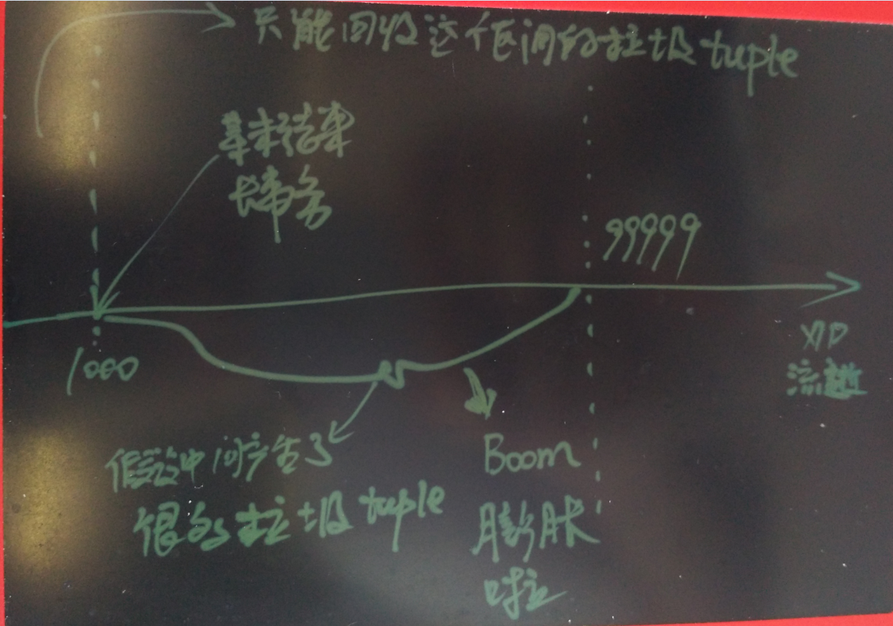
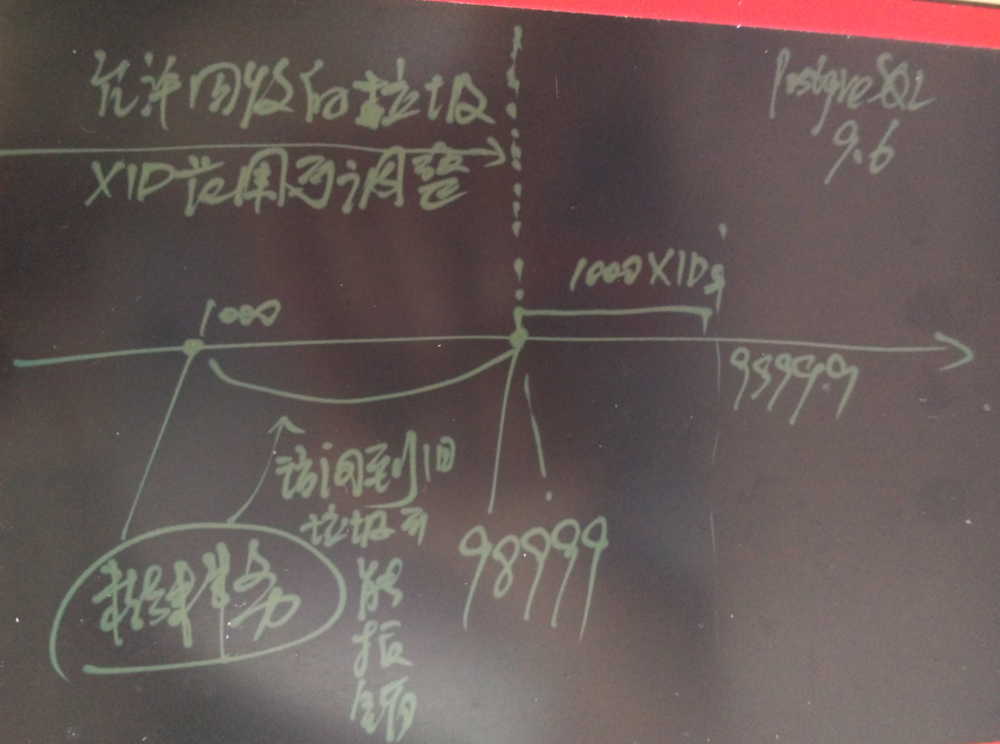

## 大量使用临时表带来的系统表如pg_attribute膨胀问题，替代方案，以及如何擦屁股 - Greenplum, PostgreSQL最佳实践    
##### [TAG 11](../class/11.md)
                                                                                            
### 作者                                                                                           
digoal                                                                                            
                                                                                            
### 日期                                                                                          
2016-06-15                                                                                            
                                                                                            
### 标签                                                                                          
PostgreSQL , Greenplum , 临时表 , catalog膨胀              
                              
----                                                                                          
                                  
## 背景                  
以前有使用Greenplum的朋友遇到元表膨胀的问题，总结了原因写了一篇文章如下。    
  
建议先阅读这篇文档，再阅读本文，里面有些原理我在本文就不讲了。    
  
http://blog.163.com/digoal@126/blog/static/1638770402014616113353555  
    
近日，又有使用PostgreSQL的朋友也遇到类似的问题，一些元表膨胀非常厉害。    
  
用户大量的使用临时表，频繁的创建（PG的临时表是需要随时用随时建的，每个会话都要自己建，而且每个临时表会在pg_class,pg_attribute 中留下痕迹，用完还需要从元表中 delete 这些元数据），因此元表pg_attribute, pg_rewrite, pg_class 会出现大量的dead tuple。      
  
同时用户的业务需要在数据库长期跑长事务，这个也是膨胀的关键点。    
    
### 图说问题, 一针见血  
目前PostgreSQL的版本，在回收垃圾时，只能回收比现存最早事务更老的垃圾tuple。    
  
如图  
  
  
  
这张图表示，当前XID=99999，当前数据库集群中未结束的事务是XID=1000的事务，假设在XID=1000后系统产生了100GB的垃圾数据（如UPDATE了一个大表，或者删除或更新了一大批数据）。    
  
那么这100GB是没有办法被vacuum回收的，只能回收XID=1000以前的垃圾。    
  
这就是膨胀的起因。 (长事务同时伴随大量更新或删除产生垃圾)     
    
PostgreSQL 9.6会引入快照过旧的功能，有点类似于Oracle 的undo snapshot too old的玩意。来防止因存在很长的事务带来的膨胀问题。    
  
如图    
  
  
  
例如用户设置了只保留最近1000个事务产生的垃圾，当老的事务访问到已经被vacuum清除的数据时，会报snapshot too old的错误。  这个方法大大降低了膨胀的概率。    
  
### 如何戒掉临时表(替代方案)  
回到本文的主题，用户除了用临时表，还有什么方法？    
  
因为PG的临时表是随用随建的（会话断开又得建）， 有什么好的替代方案，不要动到元数据吗?    
  
答案是，当然有。    
  
如果你是在存储过程中使用临时表，你可以建立composite type，然后用数组来存储这些临时数据，这样就不会动到元数据了。    
  
例子  :      
  
```  
postgres=# create type t as (id int, info text, crt_time timestamp);  
CREATE TYPE  
  
create or replace function f() returns void as $$                                                                      
declare   
  tmp_t t[];  
  tmp t;  
begin  
  -- 产生一批临时记录，聚合后存入数组，原来你可能要存入临时表  
  select array_agg((t1)::t) into tmp_t from (select id,md5(random()::text),clock_timestamp() from generate_series(1,100) t(id)) t1;  
  
  -- 把数组当表使用, unnest数组,   
  -- select (unnest(tmp_t)).*;  
    
  -- 你可能会用临时数据做一些JOIN操作, 用unnest和subquery就能和其他表一样JOIN操作  
  -- select t2.* from t2 join (select (unnest(tmp_t)).*) t1 on t1.id=t2.id where ....;  
  -- update t2 set xx=xx from (select (unnest(tmp_t)).*) t1 where t2.xx=t1.xx and t1.xx=xx and t2.xx=xx;  
  
  -- 你可能会对临时数据做一些处理  
  for i in 1..array_length(tmp_t, 1) loop  
    raise notice '%', tmp_t[i];  
    tmp := tmp_t[i];  
    tmp.info := 'new '||tmp.info;  
    tmp_t[i] := tmp;  
    raise notice '%', tmp_t[i];  
    -- 逻辑处理可以放在这里做  
  end loop;  
end;  
$$ language plpgsql strict;  
  
...  
NOTICE:  (91,dc3606d6b017f60fc10b945ab00b02bd,"2016-06-15 17:53:41.749235")  
NOTICE:  (91,"new dc3606d6b017f60fc10b945ab00b02bd","2016-06-15 17:53:41.749235")  
...  
```  
  
使用composite type的数组完全能满足原来使用临时表才能满足的需求。    
  
但是也需要注意array是在内存中的，如果临时数据非常庞大，使用数组可能OOM。    
  
虽然临时表也是在内存中的，但是它太大的时候可以落盘，不会OOM。    
  
数组求记录数，使用 array_length就可以了，千万不要unnest转成行再count。    
    
### 学会擦屁股   
如果元数据已经膨胀了怎么处理？该擦的屁股还得擦。         
  
对于PostgreSQL 9.5 你可以放心大胆的擦，（其他版本暂时没有验证过）。    
  
可选的方法有 vacuum full, cluster, reindex.      
  
如果要回收空间，同时重建索引，使用vacuum full。      
  
如果要重排元表顺序，使用cluster。     
  
如果要重新建索引，使用reindex 。     
  
根据你自己的情况选择就可以了。    
    
当你使用的是Greenplum时，要特别注意。    
  
就是pg_class，这个元表是比较特殊的，因为其他元表的记录也记录在这里，包括索引的元表也记录在pg_class里面。    
  
对它进行vacuum full, reindex, cluster都会导致有几个元表的记录会排到这张表的最后面去。    
  
例如我的系统中有几百万张表，这样快速生成几百万表      
  
```  
CREATE OR REPLACE FUNCTION public.f(id integer)  
 RETURNS void  
 LANGUAGE plpgsql  
 STRICT  
AS $function$   
declare   
  sql text;  
  i int;   
begin   
  for i in id..id+100 loop   
    sql='create table if not exists tbl'||i||' (id int)';  
    execute sql;  
  end loop;  
end;  
$function$;  
  
vi test.sql  
\setrandom id 1 1000000000  
select f(:id);  
  
pgbench -M prepared -n -r -P 1 -f ./test.sql -c 20 -j 20 -T 1000  
```  
  
对pg_class这样操作后，有几条元数据就会跑到pg_class的最后面去。    
  
1\.   
  
```  
vacuum full pg_class;    
  
然后你会发现这几个小家伙排到最后了  
postgres=# select oid,relname,ctid from pg_class order by ctid desc limit 10;  
   oid    |              relname              |    ctid      
----------+-----------------------------------+------------  
     1259 | pg_class                          | (92424,30)  
     3455 | pg_class_tblspc_relfilenode_index | (92424,29)  
     2663 | pg_class_relname_nsp_index        | (92424,28)  
     2662 | pg_class_oid_index                | (92424,27)  
```  
  
2\.  
  
```  
cluster pg_class using pg_class_oid_index;    
```  
-- 你可能会想，oid=这几个的是小的，应该到前面的行了吧。 但实际并不是如此。     
这几个小家伙排到最后了  
```  
postgres=# select oid,relname,ctid from pg_class order by ctid desc limit 10;  
   oid    |              relname              |    ctid      
----------+-----------------------------------+------------  
     1259 | pg_class                          | (92424,30)  
     3455 | pg_class_tblspc_relfilenode_index | (92424,29)  
     2663 | pg_class_relname_nsp_index        | (92424,28)  
     2662 | pg_class_oid_index                | (92424,27)  
 13089945 | test_pkey                         | (92424,25)  
 13089944 | pg_toast_13089939_index           | (92424,24)  
 13089942 | pg_toast_13089939                 | (92424,23)  
 13089939 | test                              | (92424,22)  
```  
  
3\.  
  
```  
reindex table pg_class;    
```  
-- 别看它只是重建索引，但是实际上它也会影响 pg_class_oid_index  , pg_class_relname_nsp_index    ,   pg_class_tblspc_relfilenode_index   这三在pg_class的顺序。    
这几个小家伙又奇迹般的排到最后了  
```  
postgres=# select oid,relname,ctid from pg_class order by ctid desc limit 10;  
   oid    |              relname              |    ctid      
----------+-----------------------------------+------------  
     3455 | pg_class_tblspc_relfilenode_index | (92424,33)  
     2663 | pg_class_relname_nsp_index        | (92424,32)  
     2662 | pg_class_oid_index                | (92424,31)  
     1259 | pg_class                          | (92424,30)  
 13089945 | test_pkey                         | (92424,25)  
```  
    
以上诡异的问题，在Greenplum数据库中就是致命的（不知道现在的版本改进了没有，反正PostgreSQL 9.5是没这个问题的）。    
  
如果你在GP中有几百万的表，这几条元数据因以上原因跑pg_class 的最后几页去了，那问题就大了(后面会讲回天的方法)。    
  
http://cncc.bingj.com/cache.aspx?q=osdba+pg_index+reindex&d=5025474051580513&mkt=zh-CN&setlang=zh-CN&w=pa4BQX_-Pu7tUlh6kM34Dv-xu2uzi4m6    
    
以前老唐在Greenplum上对元表做了这样的操作，结果很感人。      
  
greenplum中reindex pg_class后发生狂读pg_class的问题分析       
  
当访问任何一个表时，需要从pg_class表中提取这个表的元数据信息，而在pg_class中查找表的原数据信息，需要访问索引pg_class_oid_index，而访问索引pg_class_oid_index，也需要从pg_class表中获得索引pg_class_oid_index的元数据信息，而获得索引pg_class_oid_index自己的元数据信息，就不能再通过索引自己去查找自己的信息了，这里就只能从头扫描表pg_class来获得，而由于索引pg_class_oid_index的条目被移到了最后的位置，所以导致需要几乎把pg_class从头 扫描到尾才能找到pg_class_oid_index的条目，这样就大大的降低了数据库的性能。  
  
以前也做过pg_class，为什么没有出来这个问题呢？我和任振中也做了测试发现，当原先的0号块中有空闲空间时，做reindex时，索引pg_class_oid_index的 条目仍会在0号块中，这样就不会出现上面的问题了。    
  
由此可知，在greenplum中是不能随便对pg_class表做reindex了。      
    
### 如果不小心把pg_class_oid_index等几个元表弄到pg_class 的末端了咋办  
其实还是可以回天的，而且方法依旧很简单。    
  
把头几个页的数据更新掉，然后用 vacuum回收前几页，然后把要挪动的记录更新一下，FSM会随机选择空页面给你放，就有机会回到前面的页。    
  
例子    
  
当前他们在这里    
  
```  
postgres=# select ctid,oid,relname from pg_class where oid in (1259,3455,2663,2662);  
    ctid    | oid  |              relname                
------------+------+-----------------------------------  
 (92424,42) | 1259 | pg_class  
 (92424,43) | 2662 | pg_class_oid_index  
 (92424,44) | 2663 | pg_class_relname_nsp_index  
 (0,1)      | 3455 | pg_class_tblspc_relfilenode_index  
(4 rows)  
```  
  
把前面5页的记录都更新一遍    
  
```  
postgres=# update pg_class set relkind=relkind where ctid::text ~ '^\(0,' or ctid::text ~ '^\(1,' or ctid::text ~ '^\(2,' or ctid::text ~ '^\(3,' or ctid::text ~ '^\(4,' or ctid::text ~ '^\(5,';  
UPDATE 207  
```  
  
回收垃圾    
  
```  
postgres=# vacuum verbose pg_class;  
```  
  
更新要挪动的记录  
  
```  
postgres=# update pg_class set relkind=relkind where oid in (1259,3455,2663,2662);  
UPDATE 4  
```  
  
已经挪到前面的页了，恭喜你    
  
```  
postgres=# select ctid,oid,relname from pg_class where oid in (1259,3455,2663,2662);  
  ctid  | oid  |              relname                
--------+------+-----------------------------------  
 (0,46) | 1259 | pg_class  
 (0,48) | 2662 | pg_class_oid_index  
 (1,1)  | 2663 | pg_class_relname_nsp_index  
 (1,2)  | 3455 | pg_class_tblspc_relfilenode_index  
(4 rows)  
```  
    
### 参考    
src/backend/catalog/postgres.bki    
  
```  
create pg_proc 1255 bootstrap rowtype_oid 81  
...  
insert OID = 1242 ( boolin 11 10 12 1 0 0 0 f f f f t f i 1 0 16 "2275" _null_ _null_ _null_ _null_ _null_ boolin _null_ _null_ _null_ )  
insert OID = 1243 ( boolout 11 10 12 1 0 0 0 f f f f t f i 1 0 2275 "16" _null_ _null_ _null_ _null_ _null_ boolout _null_ _null_ _null_ )  
...  
```  
  
### 注意事项    
1\. 因为vacuum full和cluster都是DDL操作，需要注意锁等待和本身需要运行的时间，建议空闲时间操作。      
  
并且设置语句超时或锁超时。      
  
2\. 对于Greenplum 千万别对pg_class执行vacuum full, reindex, cluster操作，否则可能是致命伤害。    
  
万一你不小心这么做了，可以使用我上面教你的挪动记录的方法来补救。      
  
<a rel="nofollow" href="http://info.flagcounter.com/h9V1"  ></a>  
  
  
  
  
  
  
## [digoal's 大量PostgreSQL文章入口](https://github.com/digoal/blog/blob/master/README.md "22709685feb7cab07d30f30387f0a9ae")
  
