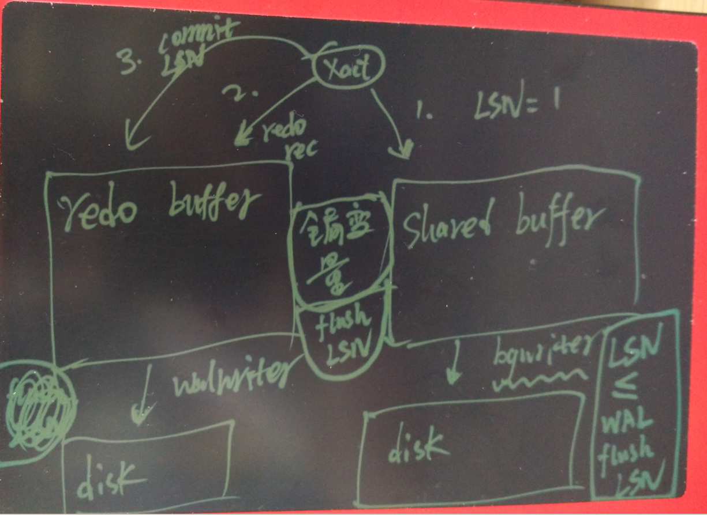
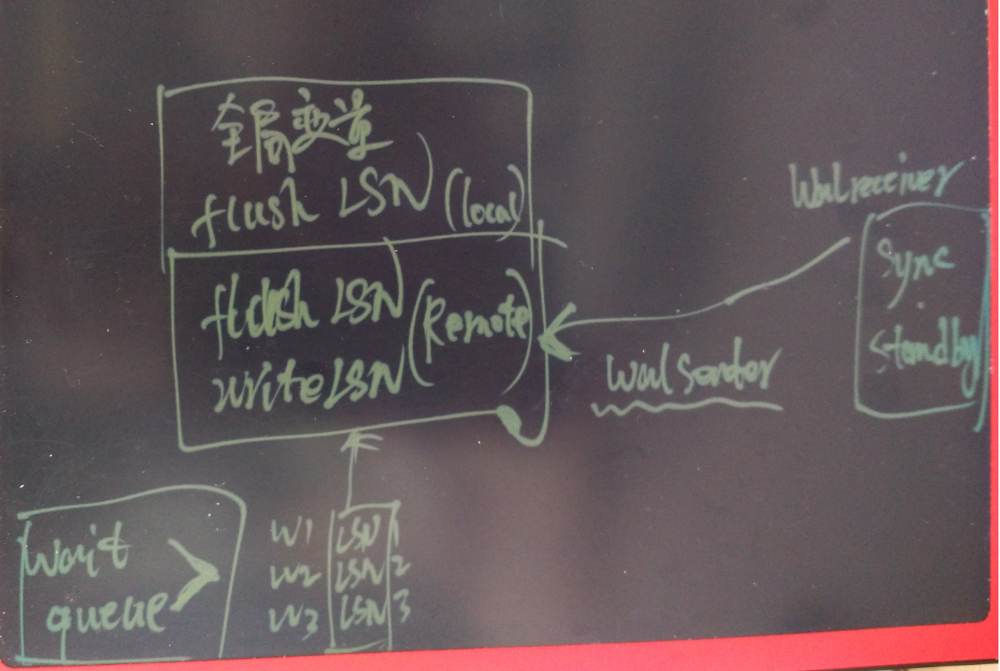

## PostgreSQL 同步流复制原理和代码浅析  
                                            
### 作者                                               
digoal                                       
                                        
### 日期                                                                                                           
2016-06-16                                     
                                           
### 标签                                        
PostgreSQL , 同步复制 , 代码浅析             
                                                                                                              
----                                                                                                        
                                                                                                                 
## 背景      
## 数据库ACID中的持久化如何实现  
  
数据库ACID里面的D，持久化。 指的是对于用户来说提交的事务，数据是可靠的，即使数据库crash了，在硬件完好的情况下，也能恢复回来。   
  
PostgreSQL是怎么做到的呢，看一幅图，画得比较丑，凑合看吧。   
  
假设一个事务，对数据库做了一些操作，并且产生了一些脏数据，首先这些脏数据会在数据库的shared buffer中。   
  
同时，产生这些脏数据的同时也会产生对应的redo信息，产生的REDO会有对应的LSN号（你可以理解为REDO 的虚拟地址空间的一个唯一的OFFSET，每一笔REDO都有），这个LSN号也会记录到shared buffer中对应的脏页中。   
  
walwriter是负责将wal buffer flush到持久化设备的进程，同时它会更新一个全局变量，记录已经flush的最大的LSN号。   
  
bgwriter是负责将shared buffer的脏页持久化到持久化设备的进程，它在flush时，除了要遵循LRU算法之外，还要通过LSN全局变量的比对，来保证脏页对应的REDO记录已经flush到持久化设备了，如果发现还对应的REDO没有持久化，会触发WAL writer去flush wal buffer。 (即确保日志比脏数据先落盘)   
  
当用户提交事务时，也会产生一笔提交事务的REDO，这笔REDO也携带了LSN号。backend process 同样需要等待对应LSN flush到磁盘后才会返回给用户提交成功的信号。(保证日志先落盘，然后返回给用户)   
  
  
  
## 数据库同步复制原理浅析  
  
同步流复制，即保证standby节点和本地节点的日志双双落盘。   
  
  
  
PostgreSQL使用另一组全局变量，记录同步流复制节点已经接收到的XLOG LSN，以及已经持久化的XLOG LSN。   
  
用户在发起提交请求后，backend process除了要判断本地wal有没有持久化，同时还需要判断同步流复制节点的XLOG有没有接收到或持久化（通过synchronous_commit参数控制）。   
  
如果同步流复制节点的XLOG还没有接收或持久化，backend process会进入等待状态。   
  
  
## 数据库同步复制代码浅析  
  
对应的代码和解释如下：   
  
```  
CommitTransaction @ src/backend/access/transam/xact.c   
RecordTransactionCommit @ src/backend/access/transam/xact.c  
```  
  
```  
        /*  
         * If we didn't create XLOG entries, we're done here; otherwise we  
         * should trigger flushing those entries the same as a commit record  
         * would.  This will primarily happen for HOT pruning and the like; we  
         * want these to be flushed to disk in due time.  
         */  
        if (!wrote_xlog)  // 没有产生redo的事务，直接返回  
            goto cleanup;  
  
    if (wrote_xlog && markXidCommitted)  // 如果产生了redo, 等待同步流复制  
        SyncRepWaitForLSN(XactLastRecEnd);  
```  
  
```  
SyncRepWaitForLSN @ src/backend/replication/syncrep.c  
```  
  
```  
/*  
 * Wait for synchronous replication, if requested by user.  
 *  
 * Initially backends start in state SYNC_REP_NOT_WAITING and then  
 * change that state to SYNC_REP_WAITING before adding ourselves  
 * to the wait queue. During SyncRepWakeQueue() a WALSender changes  
 * the state to SYNC_REP_WAIT_COMPLETE once replication is confirmed.  
 * This backend then resets its state to SYNC_REP_NOT_WAITING.  
 */  
void  
SyncRepWaitForLSN(XLogRecPtr XactCommitLSN)  
{  
...  
    /*  
     * Fast exit if user has not requested sync replication, or there are no  
     * sync replication standby names defined. Note that those standbys don't  
     * need to be connected.  
     */  
    if (!SyncRepRequested() || !SyncStandbysDefined())  //  如果不是同步事务或者没有定义同步流复制节点，直接返回  
        return;  
...  
    /*  
     * We don't wait for sync rep if WalSndCtl->sync_standbys_defined is not  
     * set.  See SyncRepUpdateSyncStandbysDefined.  
     *  
     * Also check that the standby hasn't already replied. Unlikely race  
     * condition but we'll be fetching that cache line anyway so it's likely  
     * to be a low cost check.  
     */  
    if (!WalSndCtl->sync_standbys_defined ||      
        XactCommitLSN <= WalSndCtl->lsn[mode])  //  如果没有定义同步流复制节点，或者判断到commit lsn小于已同步的LSN，说明XLOG已经flush了，直接返回。    
    {  
        LWLockRelease(SyncRepLock);  
        return;  
    }  
...  
  
// 进入循环等待状态，说明本地的xlog已经flush了，只是等待同步流复制节点的REDO同步状态。  
    /*  
     * Wait for specified LSN to be confirmed.  
     *  
     * Each proc has its own wait latch, so we perform a normal latch  
     * check/wait loop here.  
     */  
    for (;;)  // 进入等待状态，检查latch是否满足释放等待的条件（wal sender会根据REDO的同步情况，实时更新对应的latch）  
    {  
        int            syncRepState;  
  
        /* Must reset the latch before testing state. */  
        ResetLatch(&MyProc->procLatch);  
  
        syncRepState = MyProc->syncRepState;  
        if (syncRepState == SYNC_REP_WAITING)  
        {  
            LWLockAcquire(SyncRepLock, LW_SHARED);  
            syncRepState = MyProc->syncRepState;  
            LWLockRelease(SyncRepLock);  
        }  
        if (syncRepState == SYNC_REP_WAIT_COMPLETE)  // 说明XLOG同步完成，退出等待  
            break;  
  
//  如果本地进程挂了，输出的消息内容是，本地事务信息已持久化，但是远程也许还没有持久化  
        if (ProcDiePending)  
        {  
            ereport(WARNING,  
                    (errcode(ERRCODE_ADMIN_SHUTDOWN),  
                     errmsg("canceling the wait for synchronous replication and terminating connection due to administrator command"),  
                     errdetail("The transaction has already committed locally, but might not have been replicated to the standby.")));  
            whereToSendOutput = DestNone;  
            SyncRepCancelWait();  
            break;  
        }  
  
//  如果用户主动cancel query，输出的消息内容是，本地事务信息已持久化，但是远程也许还没有持久化  
        if (QueryCancelPending)  
        {  
            QueryCancelPending = false;  
            ereport(WARNING,  
                    (errmsg("canceling wait for synchronous replication due to user request"),  
                     errdetail("The transaction has already committed locally, but might not have been replicated to the standby.")));  
            SyncRepCancelWait();  
            break;  
        }  
  
// 如果postgres主进程挂了，进入退出流程。    
        if (!PostmasterIsAlive())  
        {  
            ProcDiePending = true;  
            whereToSendOutput = DestNone;  
            SyncRepCancelWait();  
            break;  
        }  
  
//  等待wal sender来修改对应的latch  
        /*  
         * Wait on latch.  Any condition that should wake us up will set the  
         * latch, so no need for timeout.  
         */  
        WaitLatch(&MyProc->procLatch, WL_LATCH_SET | WL_POSTMASTER_DEATH, -1);  
```  
  
注意用户进入等待状态后，只有主动cancel , 或者kill(terminate) , 或者主进程die才能退出无限的等待状态。后面会讲到如何将同步级别降级为异步。  
  
前面提到了，用户端需要等待LATCH的释放信号。   
  
那么谁来给它这个信号了，是wal sender进程，源码和解释如下 :   
  
src/backend/replication/walsender.c  
  
  
```  
StartReplication  
  
WalSndLoop  
  
ProcessRepliesIfAny  
  
ProcessStandbyMessage  
  
ProcessStandbyReplyMessage  
    if (!am_cascading_walsender)  // 非级联流复制节点，那么它将调用SyncRepReleaseWaiters修改backend process等待队列中它们对应的 latch。      
        SyncRepReleaseWaiters();  
```  
  
```  
SyncRepReleaseWaiters @ src/backend/replication/syncrep.c  
```  
  
```  
/*  
 * Update the LSNs on each queue based upon our latest state. This  
 * implements a simple policy of first-valid-standby-releases-waiter.  
 *  
 * Other policies are possible, which would change what we do here and what  
 * perhaps also which information we store as well.  
 */  
void  
SyncRepReleaseWaiters(void)  
{  
...  
      //  释放满足条件的等待队列  
    /*  
     * Set the lsn first so that when we wake backends they will release up to  
     * this location.  
     */  
    if (walsndctl->lsn[SYNC_REP_WAIT_WRITE] < MyWalSnd->write)  
    {  
        walsndctl->lsn[SYNC_REP_WAIT_WRITE] = MyWalSnd->write;  
        numwrite = SyncRepWakeQueue(false, SYNC_REP_WAIT_WRITE);  
    }  
    if (walsndctl->lsn[SYNC_REP_WAIT_FLUSH] < MyWalSnd->flush)  
    {  
        walsndctl->lsn[SYNC_REP_WAIT_FLUSH] = MyWalSnd->flush;  
        numflush = SyncRepWakeQueue(false, SYNC_REP_WAIT_FLUSH);  
    }  
...  
```  
  
  
SyncRepWakeQueue @ src/backend/replication/syncrep.c  
  
```  
/*  
 * Walk the specified queue from head.  Set the state of any backends that  
 * need to be woken, remove them from the queue, and then wake them.  
 * Pass all = true to wake whole queue; otherwise, just wake up to  
 * the walsender's LSN.  
 *  
 * Must hold SyncRepLock.  
 */  
static int  
SyncRepWakeQueue(bool all, int mode)  
{  
  
...  
    while (proc)  // 修改对应的backend process 的latch  
    {  
        /*  
         * Assume the queue is ordered by LSN  
         */  
        if (!all && walsndctl->lsn[mode] < proc->waitLSN)  
            return numprocs;  
  
        /*  
         * Move to next proc, so we can delete thisproc from the queue.  
         * thisproc is valid, proc may be NULL after this.  
         */  
        thisproc = proc;  
        proc = (PGPROC *) SHMQueueNext(&(WalSndCtl->SyncRepQueue[mode]),  
                                       &(proc->syncRepLinks),  
                                       offsetof(PGPROC, syncRepLinks));  
  
        /*  
         * Set state to complete; see SyncRepWaitForLSN() for discussion of  
         * the various states.  
         */  
        thisproc->syncRepState = SYNC_REP_WAIT_COMPLETE;  // 满足条件时，改成SYNC_REP_WAIT_COMPLETE    
....  
```  
  
## 如何设置事务可靠性级别  
  
PostgreSQL 支持在会话中设置事务的可靠性级别。   
  
off 表示commit 时不需要等待wal 持久化。   
  
local 表示commit 是只需要等待本地数据库的wal 持久化。   
  
remote_write 表示commit 需要等待本地数据库的wal 持久化，同时需要等待sync standby节点wal write buffer完成(不需要持久化)。   
  
on 表示commit 需要等待本地数据库的wal 持久化，同时需要等待sync standby节点wal持久化。   
  
  
提醒一点， synchronous_commit 的任何一种设置，都不影响wal日志持久化必须先于shared buffer脏数据持久化。 所以不管你怎么设置，都不好影响数据的一致性。  
  
```  
synchronous_commit = off                # synchronization level;  
                                        # off, local, remote_write, or on  
  
```  
  
## 如何实现同步复制降级  
从前面的代码解析可以得知，如果 backend process 进入了等待循环，只接受几种信号降级。 并且降级后会告警，表示本地wal已持久化，但是sync standby节点不确定wal有没有持久化。   
  
如果你只配置了1个standby，并且将它配置为同步流复制节点。一旦出现网络抖动，或者sync standby节点故障，将导致同步事务进入等待状态。   
  
怎么降级呢？   
  
### 方法1.   
修改配置文件并重置  
  
```  
$ vi postgresql.conf    
synchronous_commit = local  
$ pg_ctl reload  
```  
  
然后cancel 所有query .  
  
```  
postgres=# select pg_cancel_backend(pid) from pg_stat_activity where pid<>pg_backend_pid();  
```  
  
收到这样的信号，表示事务成功提交，同时表示WAL不知道有没有同步到sync standby。  
  
```  
WARNING:  canceling wait for synchronous replication due to user request  
DETAIL:  The transaction has already committed locally, but might not have been replicated to the standby.  
COMMIT  
postgres=# show synchronous_commit ;  
 synchronous_commit   
--------------------  
 off  
(1 row)  
```  
  
同时它会读到全局变量synchronous_commit 已经是 local了。   
  
这样就完成了降级的动作。  
  
### 方法2.   
方法1的降级需要对已有的正在等待wal sync的pid使用cancel进行处理，有点不人性化。   
  
可以通过修改代码的方式，做到更人性化。   
  
  
SyncRepWaitForLSN for循环中，加一个判断，如果发现全局变量sync commit变成local, off了，则告警并退出。这样就不需要人为的去cancel query了.  
  
```  
WARNING:  canceling wait for synchronous replication due to user request  
DETAIL:  The transaction has already committed locally, but might not have been replicated to the standby.  
```  
  
  
<a rel="nofollow" href="http://info.flagcounter.com/h9V1"  ></a>  
  
  
  
  
  
  
## [digoal's 大量PostgreSQL文章入口](https://github.com/digoal/blog/blob/master/README.md "22709685feb7cab07d30f30387f0a9ae")
  
