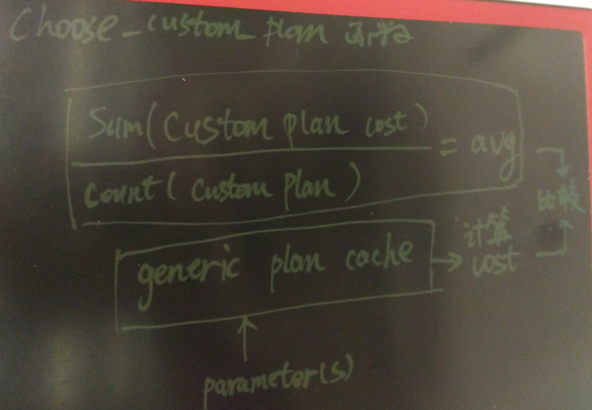

## PostgreSQL plan cache 源码浅析 - 如何确保不会计划倾斜    
                                           
### 作者                                           
digoal                                            
                                              
### 日期                                            
2016-06-17                                                                       
                                            
### 标签                                                                                                                                                            
PostgreSQL , 绑定变量 , 执行计划 , 倾斜       
                                          
----                                            
                                          
## 背景                                    
早上写了一篇文章《为什么用 PostgreSQL 绑定变量 没有 Oracle pin S 等待问题》，可以看到PostgreSQL为开发人员着想的，设计得非常人性化。  
    
https://yq.aliyun.com/articles/55698    
  
同时也收到了一些朋友发来的问题，有朋友问我PostgreSQL plan cache有没有计划倾斜的问题。    
  
本文将针对这个问题展开和大家聊一聊。    
  
### 什么是执行计划缓存倾斜  
我先解释一下什么是执行计划缓存倾斜。    
  
例如一张表数据本来就有倾斜，在使用绑定变量后，如果所有的条件都走同一个执行计划，那就可能是倾斜了？    
  
例子    
  
```  
create table tbl (id int , info text);  
insert into tbl select 1 from generate_series(1,20000000);  
insert into tbl select generate_series(1,200);  
  
2000万行 id = 1    
另外 id = 1~200 每个一行    
  
create index idx_tbl_id on tbl(id);  
vacuum analyze tbl;  
  
prepare p(int) as select * from tbl where id=$1;  
execute p(2);  --  正常情况下它应该走索引扫描  
execute p(1);  --  它应该走全表扫描  
```  
  
如果plan cache是index scan, 假设出现倾斜，那么execute p(1)也会走索引（但实际上走索引的COST更高，不应该走索引。）    
      
  
PostgreSQL 不会出现这样的问题。    
  
看实际的例子    
  
生成一个服务端绑定SQL    
  
```  
postgres=# prepare p(int) as select * from tbl where id=$1;  
PREPARE  
```  
  
查看参数是2和1的执行计划的COST    
  
```  
postgres=# explain execute p(2);  
                              QUERY PLAN                                 
-----------------------------------------------------------------------  
 Index Scan using idx_tbl_id on tbl  (cost=0.44..4.46 rows=1 width=36)  
   Index Cond: (id = 2)  
(2 rows)  
```  
  
参数为1时，成本最低的是全表扫描 cost = 338500.00   
  
```  
postgres=# explain execute p(1);  
                           QUERY PLAN                             
----------------------------------------------------------------  
 Seq Scan on tbl  (cost=0.00..338500.00 rows=20000240 width=36)  
   Filter: (id = 1)  
(2 rows)  
```  
  
参数为1时，index scan cost = 657868.64   
  
```  
postgres=# set enable_seqscan=off;  
postgres=# explain execute p(1);  
                                    QUERY PLAN                                       
-----------------------------------------------------------------------------------  
 Index Scan using idx_tbl_id on tbl  (cost=0.44..657868.64 rows=20000240 width=36)  
   Index Cond: (id = 1)  
(2 rows)  
```  
  
参数为1时，index scan cost = 712866.30   
  
```  
postgres=# set enable_indexscan=off;  
postgres=# explain execute p(1);  
                                     QUERY PLAN                                        
-------------------------------------------------------------------------------------  
 Bitmap Heap Scan on tbl  (cost=374366.30..712866.30 rows=20000240 width=36)  
   Recheck Cond: (id = 1)  
   ->  Bitmap Index Scan on idx_tbl_id  (cost=0.00..369366.24 rows=20000240 width=0)  
         Index Cond: (id = 1)  
(4 rows)  
postgres=# \q  
```  
  
好了，接下来看看实际是不是这样呢？    
  
```  
postgres=# prepare p(int) as select * from tbl where id=$1;  
postgres=# explain analyze execute p(2);  
                                                   QUERY PLAN                                                      
-----------------------------------------------------------------------------------------------------------------  
 Index Scan using idx_tbl_id on tbl  (cost=0.44..4.46 rows=1 width=36) (actual time=0.013..0.013 rows=1 loops=1)  
   Index Cond: (id = 2)  
 Execution time: 0.030 ms  
(3 rows)  
```  
  
执行5次会生成generic plan cache。    
  
然后换参数1，PostgreSQL很聪敏，没有走索引，而是选择了对于1这个参数最优的全表扫描      
  
```  
postgres=# explain analyze execute p(1);  
                                                     QUERY PLAN                                                       
--------------------------------------------------------------------------------------------------------------------  
 Seq Scan on tbl  (cost=0.00..338500.00 rows=20000240 width=36) (actual time=0.014..2480.369 rows=20000001 loops=1)  
   Filter: (id = 1)  
   Rows Removed by Filter: 199  
 Execution time: 3395.182 ms  
(4 rows)  
```  
  
后面大家可以继续演示，选择的执行计划都是正确的。    
  
那么为什么PostgreSQL这么智能呢？它是通过什么方法避免的执行计划缓存倾斜？    
  
  
  
### 从代码角度解释为什么PostgreSQL不会出现plan cache倾斜  
其实原理也很简单，PG在生成执行计划缓存前，会先走若干次（目前代码写死了5次）custom plan。     
  
同时会记录总的custom plan 的cost, 以及custom plan的次数。    
  
然后会生成generic plan。    
  
以后，每次bind时，会根据缓存的执行计划以及给定的参数值计算一个COST，如果这个COST 小于前面存储的custom plan cost的平均值，则使用当前缓存的执行计划。    
  
如果这个COST大于前面存储的custom plan cost的平均值，则使用custom plan(即重新生成执行计划)，同时custom plan的次数加1，custom plan总成本也会累加进去。    
  
循环往复。     
  
如图     
  
    
  
因此在上面的例子中，是怎么影响执行计划的呢？      
  
前面5次产生的是custom plan     
  
```  
count (custom plan) = 5     
sum (custom plan cost) = 4.46*5     
avg (custom plan cost) = 4.46  
```  
  
第六次调用时, 参数=1 会使用generic plan 计算cost, 算出来是generic plan (index scan)对应的657868.64   
  
明显大于avg (custom plan cost)，所以会选择custom plan，优化器选择了seq scan.    
  
对custom plan进行累加得到    
  
```  
count (custom plan) = 6    
sum (custom plan cost) = 4.46*5 +    338500.00     
avg (custom plan cost) = (4.46*5 +    338500.00) / 6 = 56420.3833  
```  
  
第七次调用，参数如果=2，会走plan cache, 如果参数=1则继续走custom plan，选择 全表扫描、。    
  
源码如下    
  
接收客户端请求    
  
PostgresMain @ src/backend/tcop/postgres.c    
    
prepare消息略，我们看bind的消息。    
  
exec_bind_message @ src/backend/tcop/postgres.c    
    
在bind里会调用获取执行计划缓存, 获取执行计划缓存是会根据bind的参数以及plansource(即缓存的计划)计算是否需要使用customplan     
  
GetCachedPlan @ src/backend/utils/cache/plancache.c    
  
```  
...  
			customplan = choose_custom_plan(plansource, boundParams);  
...  
	if (customplan)  
	{  
		/* Build a custom plan */  
		plan = BuildCachedPlan(plansource, qlist, boundParams);  
		/* Accumulate total costs of custom plans, but 'ware overflow */  
		if (plansource->num_custom_plans < INT_MAX)  
		{  
			plansource->total_custom_cost += cached_plan_cost(plan, true);  
			plansource->num_custom_plans++;  
		}  
	}  
..  
```  
  
计算是否需要custom plan的算法如下      
  
choose_custom_plan @ src/backend/utils/cache/plancache.c    
  
```  
/*  
 * choose_custom_plan: choose whether to use custom or generic plan  
 *  
 * This defines the policy followed by GetCachedPlan.  
 */  
static bool  
choose_custom_plan(CachedPlanSource *plansource, ParamListInfo boundParams)  
{  
        double          avg_custom_cost;  
  
        /* One-shot plans will always be considered custom */  
        if (plansource->is_oneshot)  
                return true;  
  
        /* Otherwise, never any point in a custom plan if there's no parameters */  
        if (boundParams == NULL)  
                return false;  
        /* ... nor for transaction control statements */  
        if (IsTransactionStmtPlan(plansource))  
                return false;  
  
        /* See if caller wants to force the decision */  
        if (plansource->cursor_options & CURSOR_OPT_GENERIC_PLAN)  
                return false;  
        if (plansource->cursor_options & CURSOR_OPT_CUSTOM_PLAN)  
                return true;  
  
        /* Generate custom plans until we have done at least 5 (arbitrary) */  
        if (plansource->num_custom_plans < 5)  
                return true;  
  
        avg_custom_cost = plansource->total_custom_cost / plansource->num_custom_plans;  
  
        /*  
         * Prefer generic plan if it's less expensive than the average custom  
         * plan.  (Because we include a charge for cost of planning in the  
         * custom-plan costs, this means the generic plan only has to be less  
         * expensive than the execution cost plus replan cost of the custom  
         * plans.)  
         *  
         * Note that if generic_cost is -1 (indicating we've not yet determined  
         * the generic plan cost), we'll always prefer generic at this point.  
         */  
        if (plansource->generic_cost < avg_custom_cost)  
                return false;  
  
        return true;  
}  
```  
  
### 小结  
1\. PostgreSQL的bind使用choose_custom_plan巧妙的解决了执行计划缓存倾斜的问题。     
  
用户再也不用担心一个执行计划会导致某些数据倾斜是不适用某些VALUE。    
  
2\. 需要注意一点，generic plan的选择，是和前面几次调用有关，如果前面几次调用的都是p(1)，seq scan将会变成generic plan，然后avg custom plan的值会很高，达到338500.00   . 接下来的p(2)，全表扫描算出来的成本也会低于avg custom plan, 会继续走seq scan。  这个算法对于这种情况还没辙。  所以算法还有优化的空间，但是还要注意算法太复杂的话，会影响高并发下的性能。所以PG还提供了一种选择，那就是plan hint，这个和Oracle用法一样。先安装pg hint插件就好了。      
  
阿里云RDS PG已经打包了这个插件。       
    
                                                                                                        
                                                             
  
<a rel="nofollow" href="http://info.flagcounter.com/h9V1"  ></a>  
  
  
  
  
  
  
## [digoal's 大量PostgreSQL文章入口](https://github.com/digoal/blog/blob/master/README.md "22709685feb7cab07d30f30387f0a9ae")
  
