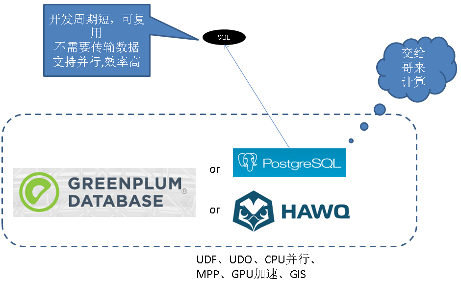
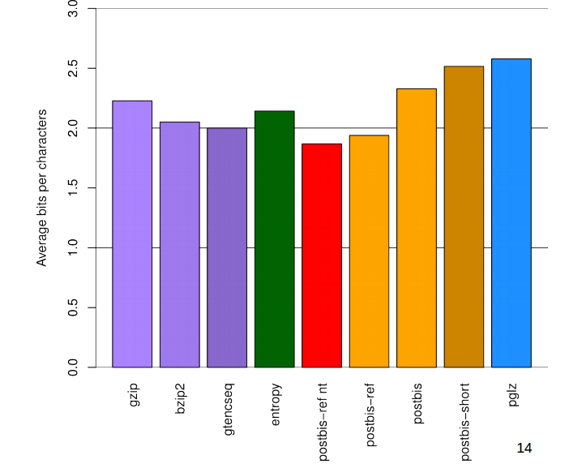
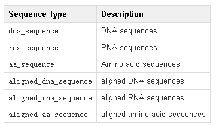

## 为了部落 - 如何通过PostgreSQL基因配对，产生优良下一代
* digoal.zhou
  
## 引言
PostgreSQL凭借良好的扩展性，不仅仅是一个数据库，更是一个有非常强大的数据处理能力的数据平台。很多垂直行业的用户拿它来做各种和业务贴合非常紧密的事情。 
     
本文给大家分享的是PostgreSQL在生命科学领域的应用案例 - 基因工程。    
  
通常的思维可能是这样的，把数据存在数据库，需要运算的时候，再把数据取出进行运算（例如配对），需要花费非常多的网络传输时间。    

  
PostgreSQL提供了基因工程相关的数据类型，操作类型，索引。满足基因工程业务的需求。  你甚至可以利用MPP来解决更大数据量的问题（例如压缩后百TB级别）。    

  
并行计算请参考    
https://yq.aliyun.com/articles/44655  
GPU加速请参考  
https://wiki.postgresql.org/wiki/PGStrom  
  
## 背景知识
1. 染色体DNA的数字化，由4种最基本的腺嘌呤（A）、胸腺嘧啶（T）、胞嘧啶（C）与鸟嘌呤的（G）排列组成。  
染色体长度从几千到几十亿不等。  

  
2. 由于DNA过长，不利于分析，所以有了RNA，RNA是一些更短的ATCG基本排列，通常是50到1万的长度。  
每个DNA由一些RNA排列组成(其中可能会有一些重复)。  

  
3. 基因测序，目的是找出两组DNA的相似和不同的地方。  

  
4. DNA的压缩，前面讲了DNA实际上是由ATCG排列而成，长度从几千到几十亿不等。  
所以压缩存储非常重要，PostBIS提供了很好的压缩算法解决压缩效率和解压效率的问题。  

  
5. PostBIS提供的数据类型  

  
6. 几种压缩效率对比  

  
7. DNA编码效率对比  

  
8. 对比常用的压缩算法和PostBIS压缩算法的压缩比  


9. 对比常用的压缩算法和PostBIS压缩算法的压缩效率  

  
10. 基因数据存储到数据库后，能干什么？  

  
11. PostBIS 基因抽取的效率和基因长度无关，是O(1)的.

    
## PostgreSQL 如何支撑基因工程应用
PostBIS支持的数据类型  

    
使用例子
```
/* a table which contains all sequences of some metagenomic sampe */
CREATE TABLE MetagenomicSample123 (
    sequence_read_identifier text,
    sequence dna_sequence(SHORT, CASE_SENSITIVE, IUPAC)
);
```

唯一约束(为什么不用btree? 因为它有长度限制，字段长度不能超过数据块的三分之一)  
```
ALTER TABLE MetagenomicSample123 ADD EXCLUDE USING hash (sequence WITH =);

INSERT INTO MetagenomicSample123 VALUES ('read-123', 'AACGCAATCAGACTAGCTCAGGC');

INSERT INTO MetagenomicSample123 VALUES ('something else', 'PostBIS rocks!');
    ERROR:  input sequence violates alphabet restrictions
 

/* a table that contains the human genome */
CREATE TABLE human_genome (
    chromosome text,
    sequence dna_sequence(REFERENCE)
);
```

插入随机生成的DNA序列  
```
CREATE TABLE metagenomic_sample (
  id int PRIMARY KEY,
  sequence dna_sequence(SHORT,FLC)
);
/* Create random metagenomic_sample */
INSERT INTO metagenomic_sample SELECT generate_series(1,10000), generate_sequence(dna_flc(), 100)::dna_sequence(SHORT);
```
  
Kmer Matching  
```
参见, 有上下文相关数据
https://colab.mpi-bremen.de/wiki/display/pbis/Tutorial%3A+Biological+Sequences+in+PostgreSQL

SELECT id, matching_cds, string_agg(kmer || ':' || position || '->' || matching_positions::text, ',') FROM (
  SELECT id, position, kmer, split_part(unnested_matches, ':', 1) AS matching_cds, ('{' || split_part(unnested_matches, ':', 2) || '}')::int[] AS matching_positions FROM (
    SELECT id, position, kmer, regexp_split_to_table(matches, ';') AS unnested_matches FROM (
      SELECT id, position, kmers.kmer, matches FROM (
        SELECT id, position, substr(sequence, position, 5) AS kmer FROM (
          SELECT id, generate_series(1, char_length(sequence) - 5 + 1, 5) AS position, sequence FROM (
            SELECT id, translate(six_frame(transcribe(complement(sequence))), bacterial_archaeal_plant_plastid_code()) AS sequence FROM metagenomic_sample
          ) AS six_frame_translated
        ) AS kmer_positions
      ) AS kmers
      INNER JOIN preprocessed_fn554766_proteome ON kmers.kmer = preprocessed_fn554766_proteom.kmer
    ) AS kmer_matches
  ) AS kmer_matches_unnested
) AS all_matches_unnested
GROUP BY id, matching_cds;
```
  
## 应用举例  
纯笔者YY，也许将来有临床经验了，可以包装成商业化的产品。  


  
互联网抓来的基因相关的例子  
  
* 史蒂夫·乔布斯曾接受过全基因测序
  
因“名人效应”应用于高端体检、产前诊断等领域，价格不菲。基因测序最广为人知的，是影星安吉丽娜·朱莉通过基因检测，选择手术切除乳腺以降低患乳腺癌风险。2011年去世的苹果公司创始人史蒂夫·乔布斯患癌时，也曾接受过全基因测序。  
  
* 基因测序挽救两兄妹  
  
1996年，一对双胞胎出生了，男孩叫诺亚，女孩叫艾丽西斯。然而，他们的行为举止与别的孩子有所不同。从回到家的那天起，这对双胞胎就开始腹痛，并且一天要呕吐好几次。
在孩子们两岁的时候，他们被确诊为脑瘫。在精心的治疗和护理之下，这对双胞胎的病情似乎得到了控制。然而，5岁半的时候，双胞胎的病情又开始恶化。女孩艾丽西斯的眼珠开始上翻，手也无法正常下垂；男孩诺亚则是一天24小时地不断呕吐。他们甚至无法像正常人一样走路、说话。  
此后，双胞胎的病情又几次反复，一直没有找到能治愈他们的方法。  
2003年，机缘巧合，这对双胞胎和他们的哥哥以及父母进行了一次基因测序。经过对比分析，最终发现双胞胎致病的罪魁祸首是体内一种还原酶发生了基因突变。它破坏了产生多巴胺以及其他两种神经递质的细胞途径。  
找到病因后，医生立刻做出了精确的治疗方案。一个月后，这对双胞胎被治愈。让这对双胞胎重获健康的，便是来自于生命技术公司的基因测序技术。  
  
* 本·拉登身份靠基因技术确认  
  
“除了人类的基因测序，测序仪还有很广泛的应用。”戴尔·帕特森说，比如医疗研究、法医鉴定、农作物研究、动物健康、食品安全等多个领域，都可以是测序仪大展拳脚的舞台。  
在抓捕本·拉登时，测序仪就帮上了大忙。美国海军特种部队在巴基斯坦首都伊斯兰堡击毙了拉登。除了震惊之外，很多民众好奇美军是如何确定拉登的身份的。利用生命技术公司提供的基因测序技术，美军和美国中央情报局首先提取了拉登的DNA，然后再将DNA与来自拉登家人的DNA参照样本对比，最终确定了拉登的身份。  

## PostBIS便捷安装
```
tar -jxvf postgresql-9.5.3.tar.bz2
cd postgresql-9.5.3
./configure --prefix=/home/digoal/pgsql9.5.3
make world
make install-world

svn co https://colab.mpi-bremen.de/postbis/svn/trunk/ postbis
cd postbis
export PATH=/home/digoal/pgsql9.5.3/bin:$PATH
make
make install

psql
create extension postbis;
```
  
## 参考  
* https://wiki.postgresql.org/images/1/1b/Postbis_pgcon_eu_2012.pdf  
* https://colab.mpi-bremen.de/wiki/display/pbis/PostBIS  
  
## 小结  
1. hash index，用于支持超长字段的索引。  （当然你也可以使用hashtext(column)的b-tree索引来替代）
2. hash index可以借助 exclude 约束来处理唯一性问题。  
3. PostBIS可以借助gpu并行，提升查询效率。  
4. PostgreSQL 9.6开始支持cpu并行，可以大大提升查询效率。  
5. 结合PostGIS，可以对基因进行划地域分析。
6. 使用PostgreSQL进行基因分析的好处，利用PG的数据存储和处理能力，解决数据需要通过网络传输的问题。同时使用自定义的DNA，RNA等序列类型解决了高效的数据压缩和编解码的问题。    
7. PostgreSQL 提供了非常多的接口，用户不需要了解PG数据库内核，就可以在PG基础之上，构建应用平台。  例如本文提到的，利用PG处理基因数据，创建自定义的数据类型，创建数据库端的处理函数，操作数，等等。  事实证明，用好PG是可以解决非常多的现实的业务问题的。  
  
[flag](http://info.flagcounter.com/h9V1)  
  
  
<a rel="nofollow" href="http://info.flagcounter.com/h9V1"  ></a>  
  
  
  
  
  
  
## [digoal's 大量PostgreSQL文章入口](https://github.com/digoal/blog/blob/master/README.md "22709685feb7cab07d30f30387f0a9ae")
  
