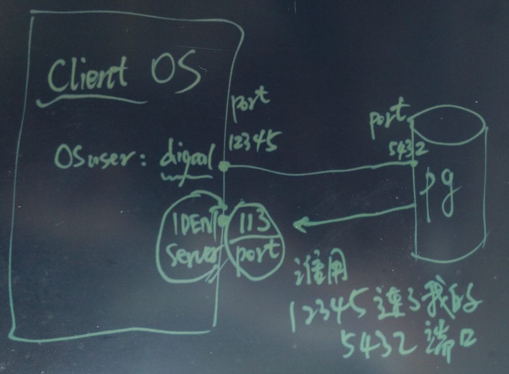
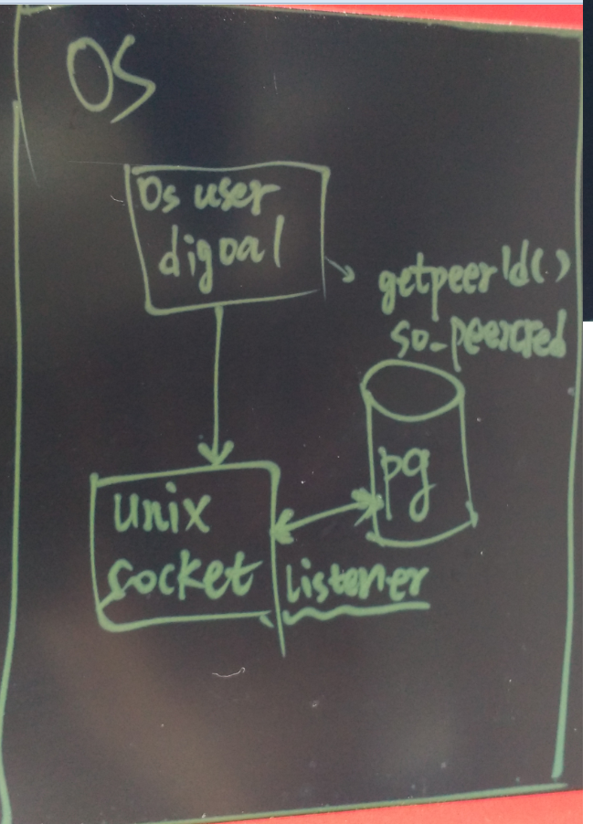
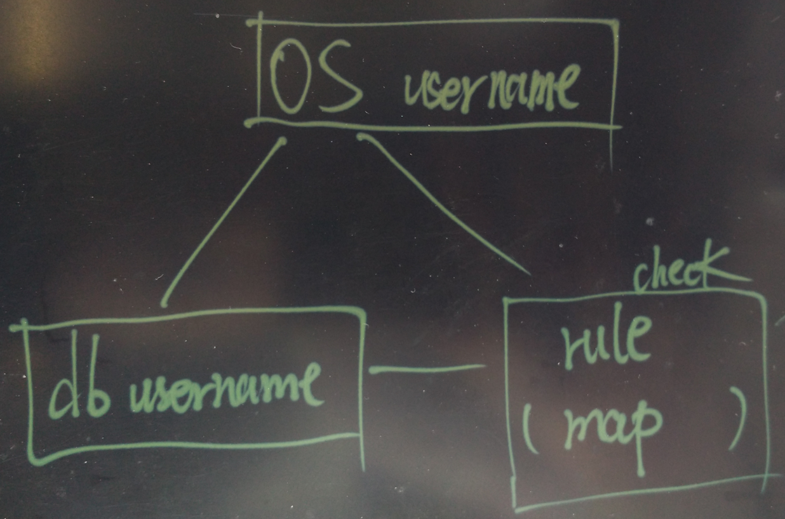

## PostgreSQL ident和peer基于操作系统用户的认证  
##### [TAG 6](../class/6.md)
                                                      
### 作者                                                                                                   
digoal                                                 
                                                        
### 日期                                                   
2016-06-22                                                
                                                    
### 标签                                                 
PostgreSQL , ident , peer , auth , 认证                 
                                                      
----                                                
                                                         
## 背景                                               
PostgreSQL支持的认证方法非常多，除了自身的密码认证以外，还支持很多其他认证服务。    
  
```  
trust  
md5  
password  
GSSAPI  
SSPI   
Ident  
Peer  
LDAP  
RADIUS   
PAM  
Certificate   
BSD  
```  
  
详见    
  
https://www.postgresql.org/docs/9.6/static/auth-methods.html    
    
本文主要给大家讲一下ident认证和peer认证。    
  
## ident和peer认证的原理  
这两种认证方法的目的是获取客户端连接数据库的操作系统用户，检查MAP中是否存在，判断是否允许连接数据库。    
    
ident 认证，客户端和数据库建立TCP会话后（假设会话的连接信息是client_ip:12345 <-> db_ip:5432），数据库通过ident协议询问客户端所在IP地址的ident server (默认是113监听端口)，询问内容：使用client_ip:12345端口连接db_ip:5432的操作系统用户是谁？      
  
协议可以参考一下RFC 文档。    
  
如图:    
  
  
    
peer认证，目的和ident认证一样，都是要拿到客户端的操作系统用户名，只不过peer对应的是unix socket连接（客户端和数据库在同一个操作系统中），所以是通过系统调用来获取客户端的用户名，系统调用是getpeereid().    
  
如图:    
  
  
    
在获取到客户端的OS用户名之后，PostgreSQL会通过pg_hba.conf中配置的map名与pg_ident.conf中配置的映射关系，以及客户端提供的数据库用户名，判断是否允许登陆数据库。    
  
如图    
  
  
    
## 例子  
我这里举一个peer认证的例子    
  
```  
postgresql.conf  
#ident_file = 'ConfigDir/pg_ident.conf'  
  
pg_hba.conf  
# TYPE  DATABASE        USER            ADDRESS                 METHOD  
local   all             all                                     ident map=mm  
  
pg_ident.conf  
# MAPNAME       SYSTEM-USERNAME         PG-USERNAME  
mm digoal postgres  
```  
  
这个配置的含义:    
  
当客户端使用unix socket连接数据库时，使用ident认证。  当客户端的OS用户是digoal时，允许它以数据库用户postgres连接数据库。      
  
```  
$ whoami  
digoal  
  
$ psql -h $PGDATA -p 1921 -U postgres  
psql (9.5.3)  
Type "help" for help.  
```  
  
当连接的数据库用户不在map中时，报错。   
  
```  
$ psql -h $PGDATA -p 1921 -U digoal  
psql: FATAL:  Peer authentication failed for user "digoal"  
```  
  
pg_ident.conf还支持规则表达式，具体用法见     
  
https://www.postgresql.org/docs/9.6/static/auth-username-maps.html    
  
https://www.postgresql.org/docs/9.6/static/functions-matching.html#POSIX-SYNTAX-DETAILS    
    
ident的方法略复杂，需要在客户端部署ident server，可参考以下文档进行配置      
  
https://wiki.archlinux.org/index.php/Identd_Setup      
    
## 小结  
1\. ident针对TCP会话，即通过TCP连接数据库时。    
  
2\. peer针对UNIX SOCKET会话，即通过unix socket 连接数据库时。    
  
## 安全建议  
如果你的主机是数据库和其他业务共用，或者你不太相信你的OS环境的话，如何加固你的数据库呢？      
  
假设ROOT用户是可信任的，启动数据库的digoal用户是可信任的，你可以这样加固。      
  
禁止所有的trust认证，同时对root和digoal用户，使用peer认证方法。     
  
其他用户要连，对不起，不允许，请提供密码。    
  
(这种加固，仅仅针对不能修改pg_hba.conf的用户，所以说root和启动数据库的用户必须是可信任的)    
    
### 例子    
  
1\. 使用某个非启动数据库的普通用户通过unix socket连接并监控数据库。    
  
root 超级用户    
  
digoal 启动数据库的用户    
  
nobody 某监控用户(没有login shell，不允许登陆)    
  
配置    
  
```  
允许nobody使用postgres用户，通过unix socket连接数据库.    
nobody 是不允许登陆shell的，但是可以用它来执行监控脚本。 如下    
  
postgresql.conf  
#ident_file = 'ConfigDir/pg_ident.conf'  
  
pg_hba.conf  
# TYPE  DATABASE        USER            ADDRESS                 METHOD  
local   all             all                                     ident map=mm  
  
pg_ident.conf  
# MAPNAME       SYSTEM-USERNAME         PG-USERNAME  
mm digoal postgres  
mm nobody postgres  
```  
  
监控脚本示例      
  
```  
cp -r /home/digoal/pgsql9.5 /tmp  
  
vi /tmp/test.sh  
#!/bin/bash  
export LD_LIBRARY_PATH=/tmp/pgsql9.5/lib:$LD_LIBRARY_PATH  
export PATH=/tmp/pgsql9.5/bin:$PATH  
for ((i=1;i>0;))  
do  
  psql -h /tmp -p 1921 -U postgres postgres -c "select now();" >> /tmp/pg_1921.log 2>&1  
  sleep 1  
done  
  
chown nobody test.sh  
chmod 700 test.sh  
```  
  
以nobody用户运行监控脚本      
  
```  
# sudo -u nobody -s bash -c "nohup /tmp/test.sh >/dev/null 2>&1 &"  
```  
  
## 参考  
https://wiki.archlinux.org/index.php/Identd_Setup    
  
https://www.postgresql.org/docs/9.6/static/auth-methods.html#AUTH-IDENT    
  
https://www.postgresql.org/docs/9.6/static/auth-username-maps.html                                                                                     
  
<a rel="nofollow" href="http://info.flagcounter.com/h9V1"  ></a>  
  
  
  
  
  
  
## [digoal's 大量PostgreSQL文章入口](https://github.com/digoal/blog/blob/master/README.md "22709685feb7cab07d30f30387f0a9ae")
  
